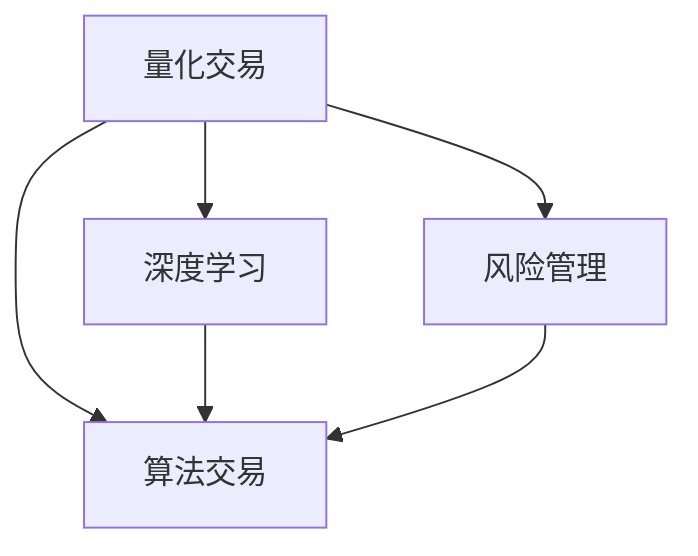

                 

# 未来的智能投资：2050年的量化交易与风险管理

> 关键词：量化交易,风险管理,人工智能,深度学习,投资策略,算法交易,机器学习

## 1. 背景介绍

### 1.1 问题由来

随着金融科技的迅猛发展，量化交易（Quantitative Trading）在投资领域扮演着越来越重要的角色。量化交易通过数学模型和计算机算法，利用大数据分析和机器学习技术，优化投资策略，实现自动化的交易决策。然而，传统量化交易面临诸多挑战，如市场非平稳性、高维数据的维度灾难、模型过拟合等问题。为了应对这些挑战，人工智能（AI）在量化交易中的应用得到了广泛探索，并在近年来取得了显著进展。

### 1.2 问题核心关键点

量化交易的核心在于构建能够捕捉市场动态、预测价格波动的投资模型。传统的量化模型多基于线性回归、时间序列分析等经典方法，难以应对复杂多变的市场环境。而人工智能的引入，特别是深度学习技术的普及，为量化交易注入了新的活力，其非线性、自适应、高维处理能力，有助于捕捉数据中的非线性关系和模式，提升模型的预测精度和鲁棒性。

## 2. 核心概念与联系

### 2.1 核心概念概述

为更好地理解基于人工智能的量化交易与风险管理方法，本节将介绍几个密切相关的核心概念：

- **量化交易**（Quantitative Trading）：利用数学模型和计算机算法，通过大数据分析、机器学习等技术，优化投资策略，实现自动化的交易决策。
- **深度学习**（Deep Learning）：一种基于神经网络的机器学习技术，通过多层次的非线性变换，提升对复杂数据模式的学习能力。
- **风险管理**（Risk Management）：在量化交易中，通过构建风险模型、优化交易策略，降低投资风险，保障资本安全。
- **算法交易**（Algorithmic Trading）：利用计算机程序，自动化地执行投资决策，以快速响应市场变化，获取超额收益。
- **投资策略**（Investment Strategy）：根据市场环境、数据特征等，设计一系列规则和操作策略，指导交易行为。

这些概念之间通过深度学习技术紧密相连，共同构建了量化交易和风险管理的完整框架。深度学习算法可以在大数据背景下，捕捉复杂模式，构建高精度的投资模型，从而提升交易的自动化水平和风险控制能力。

### 2.2 核心概念原理和架构的 Mermaid 流程图



这个流程图展示了量化交易、深度学习、风险管理和算法交易之间的联系：

1. **量化交易**：作为整个系统的起点，利用深度学习等技术优化投资策略。
2. **深度学习**：通过多层次的神经网络模型，捕捉数据中的非线性关系，提升模型预测能力。
3. **风险管理**：构建风险模型，优化交易策略，降低投资风险。
4. **算法交易**：利用自动化算法，执行交易决策，提高交易效率和准确性。

这些概念相互依赖，共同作用，构成了一个完整的量化交易和风险管理框架。

## 3. 核心算法原理 & 具体操作步骤

### 3.1 算法原理概述

量化交易的核心在于构建能够捕捉市场动态、预测价格波动的投资模型。这些模型通常基于历史价格数据、交易量等高维数据，利用机器学习技术进行建模。深度学习算法，特别是卷积神经网络（CNN）、循环神经网络（RNN）、长短时记忆网络（LSTM）等，通过多层次的非线性变换，提升对复杂数据模式的学习能力，构建高精度的投资模型。

### 3.2 算法步骤详解

基于深度学习的量化交易主要包括以下几个关键步骤：

**Step 1: 数据预处理**
- 收集历史价格数据、交易量、宏观经济指标等高维数据，并进行清洗、归一化、特征工程等预处理操作。

**Step 2: 构建深度学习模型**
- 选择合适的深度学习框架（如TensorFlow、PyTorch等）和模型结构（如卷积神经网络、循环神经网络、变分自编码器等），搭建投资模型。

**Step 3: 训练模型**
- 利用历史数据进行模型训练，选择合适的损失函数和优化算法（如Adam、SGD等），进行梯度下降优化。

**Step 4: 模型评估与优化**
- 在验证集上评估模型性能，如均方误差、平均绝对误差等指标，根据评估结果调整模型参数，优化模型表现。

**Step 5: 实时交易策略实施**
- 将优化后的模型应用到实时交易数据中，通过自动化算法进行交易决策，执行交易操作。

### 3.3 算法优缺点

基于深度学习的量化交易方法具有以下优点：
1. 高维数据的处理能力：深度学习模型可以处理高维数据，捕捉复杂的非线性关系，提升模型预测精度。
2. 自适应学习能力：深度学习模型具备自适应能力，能够动态调整模型参数，应对市场变化。
3. 自动化交易：深度学习算法能够自动化地执行交易决策，提高交易效率和准确性。
4. 风险管理：深度学习模型可以构建复杂的风险模型，优化交易策略，降低投资风险。

同时，该方法也存在一定的局限性：
1. 模型复杂度：深度学习模型参数量大，容易过拟合，需要大量数据进行训练。
2. 可解释性不足：深度学习模型的黑盒特性，难以解释其内部决策过程。
3. 数据依赖性高：模型性能高度依赖于数据质量，数据偏差可能导致模型失效。
4. 计算资源需求高：深度学习模型训练和推理需要大量计算资源，成本较高。

### 3.4 算法应用领域

深度学习在量化交易中的应用已经涵盖了多个领域，如股票交易、期货交易、外汇交易等，并在实际应用中取得了显著成效。具体而言：

- **股票交易**：构建基于深度学习的股票价格预测模型，进行股票买卖决策。
- **期货交易**：利用深度学习模型捕捉期货价格波动，优化期货交易策略。
- **外汇交易**：通过构建汇率预测模型，进行外汇买卖操作。
- **高频交易**：利用深度学习算法处理高频交易数据，实时生成交易信号。

除了这些常见的应用领域外，深度学习还被创新性地应用于更多场景，如市场情绪分析、新闻驱动交易、人工智能投顾等，为量化交易带来了新的突破。随着深度学习技术的不断发展，相信量化交易技术将在更广泛的领域得到应用，进一步提升金融市场的效率和稳定性。

## 4. 数学模型和公式 & 详细讲解 & 举例说明

### 4.1 数学模型构建

本节将使用数学语言对基于深度学习的量化交易模型进行更加严格的刻画。

假设我们有一个时间序列数据集 $(x_t, y_t)$，其中 $x_t$ 为时间 $t$ 的价格数据，$y_t$ 为时间 $t$ 的市场收益率。我们可以构建一个基于LSTM的深度学习模型，用于预测市场收益率。模型的数学模型如下：

$$
y_t = \sigma(\beta_0 + \beta_1 x_{t-1} + \beta_2 x_{t-2} + \cdots + \beta_p x_{t-p} + \epsilon_t)
$$

其中，$\sigma$ 为激活函数，$\beta$ 为模型参数，$\epsilon_t$ 为噪声项。模型通过时间序列数据 $x_{t-p}, \cdots, x_t$ 预测未来的市场收益率 $y_t$。

### 4.2 公式推导过程

基于LSTM的模型训练过程包括以下几个关键步骤：

1. **数据预处理**：将时间序列数据 $(x_t, y_t)$ 标准化，使其均值为0，方差为1。

2. **模型搭建**：构建LSTM网络，设置网络层数、隐藏单元数量等超参数。

3. **损失函数定义**：选择合适的损失函数，如均方误差（MSE），用于衡量模型预测值与真实值之间的差异。

4. **模型训练**：利用历史数据进行模型训练，使用梯度下降算法优化模型参数，最小化损失函数。

5. **模型评估**：在验证集上评估模型性能，使用均方误差、平均绝对误差等指标衡量模型预测精度。

6. **模型优化**：根据评估结果调整模型参数，优化模型表现。

### 4.3 案例分析与讲解

以股票价格预测为例，我们将LSTM模型应用于股票价格数据的预测。假设我们有一个股票价格序列 $(x_t)$，目标是构建一个能够预测未来价格 $y_t$ 的LSTM模型。模型的搭建和训练过程如下：

1. **数据预处理**：将原始价格数据标准化，移除噪声，填充缺失值。

2. **模型搭建**：构建一个包含1个LSTM层、1个全连接层的神经网络，设置网络参数如隐藏层单元数量、学习率等。

3. **模型训练**：利用历史价格数据进行模型训练，最小化均方误差。

4. **模型评估**：在验证集上评估模型性能，计算均方误差、平均绝对误差等指标。

5. **模型优化**：根据评估结果调整模型参数，优化模型表现。

## 5. 项目实践：代码实例和详细解释说明

### 5.1 开发环境搭建

在进行量化交易和风险管理开发前，我们需要准备好开发环境。以下是使用Python进行TensorFlow开发的环境配置流程：

1. 安装Anaconda：从官网下载并安装Anaconda，用于创建独立的Python环境。

2. 创建并激活虚拟环境：
```bash
conda create -n tf-env python=3.8 
conda activate tf-env
```

3. 安装TensorFlow：根据CUDA版本，从官网获取对应的安装命令。例如：
```bash
conda install tensorflow -c conda-forge
```

4. 安装其他必要工具包：
```bash
pip install numpy pandas matplotlib scikit-learn tensorflow_addons
```

完成上述步骤后，即可在`tf-env`环境中开始开发。

### 5.2 源代码详细实现

下面我们以股票价格预测为例，给出使用TensorFlow对LSTM模型进行量化交易开发的PyTorch代码实现。

```python
import tensorflow as tf
from tensorflow.keras.layers import LSTM, Dense, Dropout
from tensorflow.keras.models import Sequential
from sklearn.preprocessing import MinMaxScaler

# 加载数据
data = ...
# 数据标准化
scaler = MinMaxScaler(feature_range=(0, 1))
data = scaler.fit_transform(data)

# 构建模型
model = Sequential([
    LSTM(units=50, input_shape=(timesteps, features), return_sequences=True),
    Dropout(0.2),
    LSTM(units=50),
    Dropout(0.2),
    Dense(units=1)
])

# 编译模型
model.compile(optimizer='adam', loss='mse')

# 训练模型
model.fit(x_train, y_train, epochs=100, batch_size=64, validation_data=(x_test, y_test))

# 模型评估
mse = model.evaluate(x_test, y_test)
print(f'均方误差：{mse:.3f}')
```

### 5.3 代码解读与分析

让我们再详细解读一下关键代码的实现细节：

**数据加载和预处理**：
- `data` 变量为原始的股票价格数据，需要根据具体情况进行加载和处理。
- `MinMaxScaler` 用于数据标准化，将数据缩放到0到1的范围内。

**模型构建**：
- 使用 `Sequential` 创建序列模型，包含1个LSTM层、1个全连接层。
- `LSTM` 层设置隐藏层单元数量为50，`Dense` 层设置输出单元数量为1。

**模型编译**：
- `compile` 方法设置优化器为Adam，损失函数为均方误差。

**模型训练**：
- `fit` 方法对模型进行训练，设置训练轮数为100，批次大小为64，使用验证集进行验证。

**模型评估**：
- `evaluate` 方法在测试集上评估模型性能，输出均方误差。

### 5.4 运行结果展示

在训练过程中，可以使用TensorBoard对模型进行实时监控和调试，可视化模型的训练和验证损失曲线，帮助调整模型参数和优化策略。

```python
# 使用TensorBoard监控模型训练
import tensorflow_addons as tfa

tfa.keras.Model.summarize(model)
```

以上就是使用TensorFlow对LSTM模型进行量化交易开发的完整代码实现。可以看到，TensorFlow的高级API使得模型构建和训练过程变得简洁高效。

## 6. 实际应用场景

### 6.1 智能投顾系统

基于深度学习的量化交易模型，可以广泛应用于智能投顾系统的构建。传统投顾往往依赖于经验丰富的分析师，成本高、效率低，难以覆盖所有客户需求。而使用深度学习模型进行投资策略优化，可以7x24小时不间断提供投资建议，用数据驱动的方式提升投资决策的准确性和可靠性。

在技术实现上，可以收集用户的投资偏好、市场动态等数据，结合深度学习模型进行策略优化，生成个性化的投资方案。对于新用户，可以接入数据采集系统，实时更新模型参数，提供即时、精准的投资建议。如此构建的智能投顾系统，能大幅提升用户体验和投资收益。

### 6.2 高频交易系统

高频交易（HFT）是一种通过快速交易获取微小价差收益的策略。传统的HFT系统依赖人工编写交易算法，难以实时捕捉市场机会。而基于深度学习的高频交易系统，能够自动生成交易策略，实时响应市场变化，捕捉微小价差，提升交易效率和收益。

在实现上，可以构建基于卷积神经网络（CNN）的时间序列预测模型，捕捉市场价格变化，生成交易信号。同时，利用多尺度分析、回测优化等技术，提高模型鲁棒性和交易效果。构建的高频交易系统，能够在大规模数据基础上，快速生成交易策略，实时调整仓位，最大化收益。

### 6.3 市场情绪监测

金融市场情绪对市场波动有重要影响，传统情绪监测依赖于人工分析和文本处理，难以全面覆盖市场情绪变化。基于深度学习的量化交易模型，可以自动监测新闻、社交媒体等海量数据，实时捕捉市场情绪变化，为投资决策提供数据支持。

在技术实现上，可以构建基于LSTM或GRU的文本情感分析模型，处理新闻、社交媒体等文本数据，生成市场情绪指标。利用实时采集的市场数据和情绪指标，构建动态投资策略，捕捉市场情绪驱动的投资机会。如此构建的市场情绪监测系统，能够实时捕捉市场情绪变化，为投资决策提供科学依据。

### 6.4 未来应用展望

随着深度学习技术的不断发展，基于量化交易和风险管理的人工智能系统将在更多领域得到应用，为金融市场带来变革性影响。

在智慧投行领域，基于深度学习的量化交易模型将提升投行研究、风险管理的效率和准确性，为投行业务提供更全面、精准的服务。

在智能证券分析中，量化交易模型可以辅助分析师进行市场分析和股票预测，提升证券分析的科学性和预测精度。

在金融科技领域，量化交易模型将与其他技术（如区块链、云计算、大数据等）结合，构建智能金融生态，提升金融服务的普惠性和智能化水平。

此外，在企业金融管理、零售金融等领域，基于深度学习的量化交易和风险管理技术也将得到广泛应用，为金融业务创新提供新思路。相信随着技术的日益成熟，量化交易和风险管理将为金融行业带来新的发展机遇。

## 7. 工具和资源推荐

### 7.1 学习资源推荐

为了帮助开发者系统掌握深度学习在量化交易和风险管理中的应用，这里推荐一些优质的学习资源：

1. 《深度学习》系列书籍：如《深度学习入门》、《深度学习实战》等，详细介绍了深度学习的基础理论和应用实践。

2. 《Python量化交易实战》课程：来自Coursera，涵盖量化交易模型的构建、测试、优化等全流程，适合初学者入门。

3. 《机器学习实战》书籍：如《机器学习实战》、《Python机器学习》等，详细介绍了机器学习的基本算法和应用案例。

4. Kaggle量化交易竞赛：Kaggle平台提供大量的量化交易数据和竞赛，参与竞赛可以锻炼实战能力，积累经验。

5. HuggingFace官方文档：深度学习模型和框架的官方文档，提供详尽的模型介绍和代码示例。

通过对这些资源的学习实践，相信你一定能够快速掌握深度学习在量化交易和风险管理中的应用，并用于解决实际的金融问题。

### 7.2 开发工具推荐

高效的开发离不开优秀的工具支持。以下是几款用于深度学习量化交易开发的常用工具：

1. TensorFlow：由Google主导开发的开源深度学习框架，生产部署方便，适合大规模工程应用。

2. PyTorch：基于Python的开源深度学习框架，灵活动态的计算图，适合快速迭代研究。

3. Jupyter Notebook：交互式编程环境，支持多语言开发，适合数据探索和模型调试。

4. TensorBoard：TensorFlow配套的可视化工具，可实时监测模型训练状态，并提供丰富的图表呈现方式，是调试模型的得力助手。

5. Weights & Biases：模型训练的实验跟踪工具，可以记录和可视化模型训练过程中的各项指标，方便对比和调优。

6. HuggingFace Transformers库：提供预训练模型的API接口，方便快速构建量化交易模型。

合理利用这些工具，可以显著提升量化交易模型的开发效率，加快创新迭代的步伐。

### 7.3 相关论文推荐

深度学习在量化交易和风险管理中的应用得到了学界的持续关注。以下是几篇奠基性的相关论文，推荐阅读：

1. Neural Architectures for Learning to Trade（即AlphaGo论文）：提出深度强化学习模型，用于股票交易和投资策略优化。

2. LSTM-Based Stock Market Prediction（LSTM在股票市场预测中的应用）：利用LSTM网络，构建股票价格预测模型，提升了模型预测精度。

3. Deep Learning for Algorithmic Trading（深度学习在算法交易中的应用）：探讨了深度学习在量化交易中的多种应用，如时间序列预测、情绪分析等。

4. Adversarial Training for Robustness（对抗训练技术）：提出对抗训练方法，增强量化交易模型的鲁棒性和泛化能力。

5. Gradient-Based Robustness of Neural Networks against Adversarial Examples（神经网络对抗样本的鲁棒性）：探讨了深度学习模型的对抗样本攻击和防御方法，提升模型的安全性和稳定性。

这些论文代表了大规模量化交易模型的发展脉络。通过学习这些前沿成果，可以帮助研究者把握学科前进方向，激发更多的创新灵感。

## 8. 总结：未来发展趋势与挑战

### 8.1 总结

本文对基于深度学习的量化交易和风险管理方法进行了全面系统的介绍。首先阐述了深度学习在量化交易中的应用背景和意义，明确了深度学习在量化交易和风险管理中的重要作用。其次，从原理到实践，详细讲解了深度学习在量化交易中的数学模型和关键步骤，给出了量化交易任务开发的完整代码实例。同时，本文还广泛探讨了量化交易方法在智能投顾、高频交易、市场情绪监测等多个行业领域的应用前景，展示了深度学习范式在量化交易中的应用潜力。此外，本文精选了深度学习相关的学习资源和工具推荐，力求为读者提供全方位的技术指引。

通过本文的系统梳理，可以看到，基于深度学习的量化交易方法正在成为量化交易领域的重要范式，极大地提升了量化交易模型的预测精度和鲁棒性，催生了更多的落地场景。随着深度学习技术的不断发展，相信量化交易技术将在更广泛的领域得到应用，进一步提升金融市场的效率和稳定性。

### 8.2 未来发展趋势

展望未来，深度学习在量化交易中的应用将呈现以下几个发展趋势：

1. 模型复杂度提升。随着深度学习技术的不断进步，模型的复杂度将进一步提升，能够捕捉更为复杂的市场动态和模式。

2. 实时性要求提高。随着高频交易的兴起，深度学习模型需要具备更高的实时性和响应速度，以满足高频交易的需求。

3. 多模态融合。深度学习模型将越来越多地结合多模态数据（如新闻、财务报表等），构建更全面、更精准的投资策略。

4. 鲁棒性增强。深度学习模型将更加注重鲁棒性和泛化能力，以应对市场环境的变化和多变的市场动态。

5. 可解释性提高。深度学习模型将更注重可解释性，提升投资决策的透明度和可信度。

6. 自动化程度提升。深度学习模型将进一步自动化，通过自适应学习、强化学习等技术，实现更加智能化的投资策略。

以上趋势凸显了深度学习在量化交易中的广阔前景。这些方向的探索发展，必将进一步提升量化交易系统的性能和应用范围，为金融市场带来新的变革。

### 8.3 面临的挑战

尽管深度学习在量化交易中的应用取得了显著成效，但在迈向更加智能化、普适化应用的过程中，仍面临诸多挑战：

1. 数据质量和数量：深度学习模型高度依赖于高质量、大样本的数据，数据的缺失、噪声等问题可能导致模型失效。

2. 模型复杂度和计算资源：深度学习模型的复杂度和计算资源需求高，训练和推理成本较大。

3. 模型可解释性：深度学习模型的黑盒特性，难以解释其内部决策过程，给投资决策带来不确定性。

4. 市场环境变化：深度学习模型需要适应市场的变化，模型训练和优化需要持续进行。

5. 安全和隐私：深度学习模型可能面临对抗攻击和隐私泄露的风险，需要加强安全防护。

6. 法规合规：量化交易模型需要符合法律法规要求，保障投资决策的合法性和合规性。

### 8.4 研究展望

面对深度学习在量化交易中所面临的挑战，未来的研究需要在以下几个方面寻求新的突破：

1. 数据增强和合成数据生成：通过数据增强、合成数据生成等技术，扩充训练数据，提高模型的泛化能力。

2. 轻量级模型优化：开发更加轻量级的深度学习模型，减少计算资源消耗，提高实时性。

3. 模型可解释性提升：结合符号化推理、因果分析等技术，提升深度学习模型的可解释性和透明度。

4. 多模态融合与协同建模：结合多种数据源，构建多模态融合的深度学习模型，提升投资决策的全面性和准确性。

5. 强化学习和自动化的结合：结合强化学习、自动化等技术，提升深度学习模型的自适应能力和智能决策水平。

6. 法规合规和伦理规范：制定深度学习在量化交易中的法规和伦理规范，保障模型的合法合规性。

这些研究方向的探索，必将引领深度学习在量化交易领域迈向更高的台阶，为构建更加智能、稳健、透明的投资系统铺平道路。面向未来，深度学习在量化交易和风险管理领域还需要与其他技术进行更深入的融合，如区块链、大数据、云计算等，多路径协同发力，共同推动金融市场的发展和进步。总之，深度学习在量化交易中的应用前景广阔，相信随着技术的不断演进，将为金融市场带来更加智能化的决策支持。

## 9. 附录：常见问题与解答

**Q1：深度学习在量化交易中的数据质量要求有多高？**

A: 深度学习模型对数据质量要求较高，高质量、大样本的数据是构建高性能模型的基础。数据质量问题可能导致模型过拟合或泛化能力不足。因此，在量化交易中，需要投入大量资源进行数据清洗、归一化、特征工程等预处理操作，确保数据的一致性和完整性。

**Q2：深度学习模型的训练和推理资源消耗有多大？**

A: 深度学习模型的训练和推理资源消耗较大，需要高性能的计算设备和大量内存。为了降低成本，可以采用GPU、TPU等硬件加速设备，同时利用分布式训练、模型压缩等技术进行优化。此外，对于大规模数据集，采用数据分块、异步加载等方法，可以显著提高计算效率。

**Q3：深度学习模型的可解释性如何提升？**

A: 提升深度学习模型的可解释性，可以通过以下方法：
1. 可视化技术：利用热力图、特征重要性分析等可视化技术，展示模型决策依据。
2. 符号化推理：结合符号化推理技术，提升模型的逻辑性和透明性。
3. 因果分析：引入因果分析方法，识别模型决策的关键特征，增强输出解释的因果性。

**Q4：量化交易中如何应对市场环境变化？**

A: 量化交易中应对市场环境变化，可以采用以下方法：
1. 模型持续学习：定期重新训练模型，适应市场动态变化。
2. 模型参数调整：根据市场变化，动态调整模型参数，优化交易策略。
3. 多模型集成：构建多个量化交易模型，取平均输出，提高鲁棒性。

**Q5：量化交易中如何保障模型安全和隐私？**

A: 量化交易中保障模型安全和隐私，可以采用以下方法：
1. 数据加密：对敏感数据进行加密存储和传输，保障数据安全。
2. 模型水印：在模型中添加水印，防止模型被恶意复制或篡改。
3. 访问控制：限制对模型的访问权限，防止非法使用。

以上就是对深度学习在量化交易和风险管理中的应用的系统总结和深入探讨。相信通过本文的详细讲解和实践指南，您一定能够深入理解深度学习在量化交易中的重要性，并掌握其实际应用的技术要点，为构建智能化的投资系统打下坚实的基础。

---

作者：禅与计算机程序设计艺术 / Zen and the Art of Computer Programming

