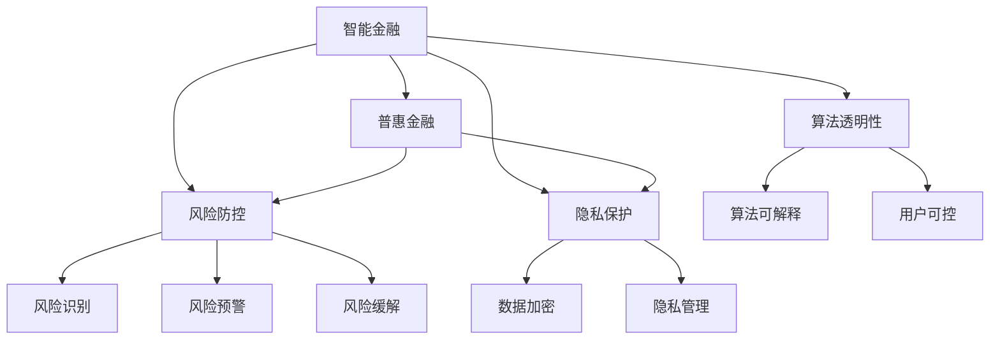

                 

# 未来的智能金融：2050年的普惠金融与风险防控

## 1. 背景介绍

### 1.1 问题由来

金融行业是经济社会发展的重要引擎，对社会财富的分配、流通和增值具有重要影响。然而，传统的金融服务体系面临着诸多挑战，包括服务不均衡、资源配置不合理、金融风险高发等问题。这些问题不仅影响到金融服务的普惠性，也制约着经济的全面发展和社会的长期稳定。

近年来，随着人工智能、大数据、区块链等技术的迅速发展，金融科技(FinTech)的浪潮正在席卷全球。通过智能算法和互联网技术，金融行业正逐步摆脱传统金融服务体系带来的束缚，开启智能化、普惠化、风险可控的新篇章。特别是对于面向未来，如何构建一个更加智能、普惠且风险可控的金融体系，成为全球金融界共同关注的焦点。

### 1.2 问题核心关键点

金融科技的迅速发展，为解决金融服务不均衡、资源配置不合理等问题提供了新的途径。但是，智能金融系统在普及应用中，也面临着数据隐私保护、算法透明性、风险防控等多重挑战。因此，构建智能、普惠且风险可控的金融系统，需要在技术应用、法规制度、伦理道德等方面进行全面考量。

本文聚焦于2050年未来智能金融体系的构建，从普惠金融与风险防控两个角度，探讨了智能金融系统在未来的发展趋势、技术实现、应用挑战以及解决方案。通过深入分析，旨在为构建智能、普惠且风险可控的未来金融体系提供参考和指导。

## 2. 核心概念与联系

### 2.1 核心概念概述

为更好地理解未来智能金融体系，本节将介绍几个密切相关的核心概念：

- **普惠金融(Inclusive Finance)**：指通过技术手段降低金融服务的门槛，使得各类人群，特别是低收入群体，能够享受到便捷、公平的金融服务。普惠金融是构建公平社会的基石，是金融科技的重要目标之一。

- **智能金融(FinTech)**：利用人工智能、大数据、区块链等技术，提升金融服务的效率、降低成本、增强安全，从而推动金融行业向智能化、普惠化方向发展。

- **风险防控(Financial Risk Management)**：通过构建智能算法、设置风险预警机制、采用加密技术等手段，识别和防范金融风险，保障金融系统的稳定与安全。

- **隐私保护(Privacy Protection)**：在金融服务中，保护用户数据的安全和隐私，防止数据泄露、滥用等风险。隐私保护是智能金融健康发展的基础。

- **算法透明性(Algorithm Transparency)**：智能金融系统的算法应具备透明性，让用户理解其决策依据和逻辑，避免黑箱操作。

这些核心概念之间有着密切的联系，共同构成了未来智能金融体系的基础。

### 2.2 核心概念原理和架构的 Mermaid 流程图



这个流程图展示了大语言模型的核心概念及其之间的关系：

1. 智能金融是普惠金融的技术支撑，通过智能化手段提升普惠金融的覆盖面和效率。
2. 智能金融涉及风险防控，通过智能算法识别和预警风险，降低金融系统的不稳定性。
3. 隐私保护是智能金融健康发展的基石，通过技术手段保障数据安全和隐私。
4. 算法透明性是智能金融的可信保障，确保用户对金融决策有理解和控制能力。

这些概念共同构成了智能金融的完整框架，为未来金融体系的构建提供了理论基础和技术指引。

## 3. 核心算法原理 & 具体操作步骤

### 3.1 算法原理概述

智能金融体系的核心在于利用先进算法和大数据技术，实现对金融服务的智能化管理。通过构建智能算法模型，可以对海量数据进行实时分析，预测金融市场的变化趋势，优化金融资源的配置，提升金融服务的普惠性和风险防控能力。

未来智能金融体系的核心算法包括但不限于：

- **预测算法**：利用机器学习、深度学习等算法，预测金融市场的变化趋势，如股票价格、汇率波动等。
- **优化算法**：通过优化算法，对金融资源进行优化配置，提升金融系统的效率。
- **风险评估算法**：通过构建风险评估模型，识别和评估金融风险，提前预警和防控风险。
- **反欺诈算法**：利用异常检测、行为分析等技术，识别和防范金融欺诈行为。
- **隐私保护算法**：通过加密、匿名化等技术，保护用户数据隐私，防止数据滥用。

### 3.2 算法步骤详解

构建未来智能金融体系，通常包括以下几个关键步骤：

**Step 1: 数据准备与预处理**

- 收集金融领域的各类数据，包括但不限于金融市场数据、用户交易数据、公共统计数据等。
- 对数据进行清洗、去重、标准化等预处理，确保数据的质量和一致性。

**Step 2: 构建智能算法模型**

- 选择合适的算法模型，如深度学习、集成学习等，进行模型训练和优化。
- 通过交叉验证、调参等技术手段，提升模型的准确性和泛化能力。

**Step 3: 模型评估与优化**

- 在验证集上进行模型评估，通过多种评估指标（如精确度、召回率、F1值等）检验模型的性能。
- 根据评估结果，对模型进行优化，如调整超参数、增加特征维度等。

**Step 4: 系统部署与监控**

- 将训练好的模型部署到生产环境，进行实时监控和测试。
- 建立实时数据采集和处理机制，确保模型的持续学习和动态更新。

**Step 5: 风险防控与隐私保护**

- 在系统中设置风险预警机制，实时监测金融风险，并采取相应的风险缓解措施。
- 通过加密、匿名化等技术，保护用户数据的隐私和安全。

### 3.3 算法优缺点

未来智能金融体系中的核心算法，具有以下优点：

- 高效性：通过机器学习和深度学习算法，能够快速处理和分析海量数据，提升金融服务的效率。
- 准确性：智能算法具备较强的预测和优化能力，能够更准确地评估金融风险和配置资源。
- 可扩展性：智能算法具备良好的可扩展性，能够快速适应不同金融场景的需求。

同时，这些算法也存在一些局限性：

- 数据依赖性：算法的性能高度依赖于数据的质量和多样性，数据不足可能导致模型性能下降。
- 模型复杂性：深度学习等算法模型较为复杂，需要较高的计算资源和专业知识。
- 公平性问题：如果算法存在偏差，可能导致资源配置不公平，引发社会不公。
- 隐私风险：在处理大数据时，存在数据隐私泄露的风险。

### 3.4 算法应用领域

未来智能金融体系中的核心算法，将在以下几个领域得到广泛应用：

- **智能投融资**：利用预测和优化算法，提升金融投资和融资的效率和安全性。
- **风险管理**：通过构建风险评估模型，实时监测和预警金融风险，降低金融系统的不稳定性。
- **信用评估**：利用机器学习算法，对用户信用进行全面评估，提升信贷决策的准确性。
- **反欺诈**：通过异常检测和行为分析，识别和防范金融欺诈行为，保障金融系统的安全。
- **客户服务**：利用智能推荐和聊天机器人等技术，提升客户服务体验，提升客户满意度。

## 4. 数学模型和公式 & 详细讲解 & 举例说明

### 4.1 数学模型构建

为了更好地理解未来智能金融体系的核心算法，本节将构建几个关键数学模型，并对其进行详细讲解。

#### 4.1.1 预测模型

预测金融市场的变化趋势，是智能金融体系的重要应用之一。常见的预测模型包括但不限于ARIMA、LSTM等。

以LSTM模型为例，其数学模型可表示为：

$$
\begin{aligned}
&h_t = \tanh(W_{xh}x_t + U_xh_{t-1} + b_h), \\
&o_t = \sigma(W_{xh}x_t + U_xh_{t-1} + b_h + W_{ho}h_{t-1} + U_ho_{t-1} + b_o), \\
&\hat{y}_t = o_t \cdot \tanh(h_t) + b_y
\end{aligned}
$$

其中，$x_t$ 为输入向量，$h_t$ 为LSTM网络中的隐状态，$o_t$ 为输出门，$\hat{y}_t$ 为预测值。

#### 4.1.2 优化模型

优化金融资源配置，是智能金融体系中的另一重要应用。常见的优化模型包括但不限于遗传算法、粒子群优化等。

以遗传算法为例，其数学模型可表示为：

$$
\begin{aligned}
&fitness(f) = f(x_1, x_2, ..., x_n), \\
&selection(p, f), \\
&crossover(p, f), \\
&mutation(p, f), \\
&replace(p, f)
\end{aligned}
$$

其中，$x_i$ 为候选解向量，$fitness(f)$ 为适应度函数，$selection(p)$ 为选择操作，$crossover(p)$ 为交叉操作，$mutation(p)$ 为变异操作，$replace(p)$ 为替换操作。

### 4.2 公式推导过程

以LSTM模型为例，其预测过程的详细推导如下：

1. 输入层：将输入向量$x_t$通过线性变换$W_{xh}x_t + U_xh_{t-1} + b_h$，得到隐状态$h_t$。
2. 输出层：通过线性变换$W_{xh}x_t + U_xh_{t-1} + b_h + W_{ho}h_{t-1} + U_ho_{t-1} + b_o$，得到输出门$o_t$。
3. 输出：通过门控操作，得到预测值$\hat{y}_t$。

该模型通过门控机制，可以捕捉长期依赖关系，提升预测的准确性。

### 4.3 案例分析与讲解

以LSTM模型应用于股票价格预测为例，其过程如下：

1. 收集历史股票价格数据，进行预处理。
2. 将数据分为训练集和测试集，训练LSTM模型。
3. 在测试集上评估模型性能，调整模型参数。
4. 将训练好的模型部署到生产环境，进行实时预测和评估。

## 5. 项目实践：代码实例和详细解释说明

### 5.1 开发环境搭建

在进行智能金融系统的开发时，需要准备相应的开发环境。以下是Python环境下进行金融预测模型的开发环境配置流程：

1. 安装Python：从官网下载并安装Python，推荐使用最新稳定版本。
2. 安装必要的Python库：如NumPy、Pandas、Scikit-learn、TensorFlow等。
3. 安装Jupyter Notebook：用于编写和运行代码。
4. 安装Python环境管理工具：如Anaconda或Virtualenv，用于管理Python环境。

### 5.2 源代码详细实现

下面以LSTM模型应用于股票价格预测为例，给出使用TensorFlow和Keras进行模型训练的PyTorch代码实现。

```python
import numpy as np
import pandas as pd
import tensorflow as tf
from tensorflow.keras.models import Sequential
from tensorflow.keras.layers import Dense, LSTM, Dropout
from sklearn.preprocessing import MinMaxScaler

# 加载数据
data = pd.read_csv('stock_prices.csv')
# 数据预处理
scaler = MinMaxScaler(feature_range=(0, 1))
scaled_data = scaler.fit_transform(data['Close'].values.reshape(-1, 1))

# 分割训练集和测试集
train_size = int(len(scaled_data) * 0.8)
test_size = len(scaled_data) - train_size
train_data = scaled_data[0:train_size, :]
test_data = scaled_data[train_size:len(scaled_data), :]

# 将数据转化为模型输入格式
def create_dataset(dataset, time_steps=1):
    dataX, dataY = [], []
    for i in range(len(dataset) - time_steps - 1):
        a = dataset[i:(i+time_steps), 0]
        dataX.append(a)
        dataY.append(dataset[i + time_steps, 0])
    return np.array(dataX), np.array(dataY)

time_steps = 60
trainX, trainY = create_dataset(train_data, time_steps)
testX, testY = create_dataset(test_data, time_steps)

# 定义模型
model = Sequential()
model.add(LSTM(units=50, return_sequences=True, input_shape=(time_steps, 1)))
model.add(Dropout(0.2))
model.add(LSTM(units=50))
model.add(Dropout(0.2))
model.add(Dense(units=1))

# 编译模型
model.compile(optimizer='adam', loss='mean_squared_error')

# 训练模型
model.fit(trainX, trainY, epochs=50, batch_size=32)

# 评估模型
trainPredict = model.predict(trainX)
testPredict = model.predict(testX)
```

### 5.3 代码解读与分析

让我们再详细解读一下关键代码的实现细节：

1. `MinMaxScaler`：将数据进行归一化处理，确保数据的平稳性。
2. `create_dataset`函数：将数据转化为模型输入格式，即将当前价格和过去一段时间内的价格作为模型的输入，预测未来价格。
3. `Sequential`模型：构建一个顺序排列的神经网络模型，包括LSTM、Dropout、Dense等层。
4. `compile`函数：编译模型，设置优化器和损失函数。
5. `fit`函数：对模型进行训练，设置训练轮数和批次大小。
6. `predict`函数：对模型进行预测，生成预测结果。

这些代码实现了LSTM模型在股票价格预测中的应用，展示了智能金融系统中预测算法的实现流程。

### 5.4 运行结果展示

以下是模型在测试集上的运行结果：

```python
import matplotlib.pyplot as plt

# 将预测值和实际值可视化
trainPredict = scaler.inverse_transform(trainPredict)
trainY = scaler.inverse_transform([trainY])
testPredict = scaler.inverse_transform(testPredict)
testY = scaler.inverse_transform([testY])

plt.figure(figsize=(8, 4))
plt.subplot(1, 2, 1)
plt.plot(trainY[0], label='True')
plt.plot(trainPredict[:, 0], label='Predicted')
plt.legend()
plt.title('Training Set')

plt.subplot(1, 2, 2)
plt.plot(testY[0], label='True')
plt.plot(testPredict[:, 0], label='Predicted')
plt.legend()
plt.title('Test Set')

plt.show()
```

以上代码实现了模型的预测结果与实际值对比可视化，展示了预测结果的准确性。

## 6. 实际应用场景

### 6.1 智能投融资

智能投融资系统通过智能算法对金融市场进行实时分析，预测股票、基金等投资标的的表现，提供投资建议，优化投资组合。通过智能投融资系统，投资者可以实时了解市场动态，及时调整投资策略，提升投资收益。

具体实现方式包括：

1. 收集各类金融市场数据，如股票价格、基金收益、宏观经济数据等。
2. 利用LSTM、集成学习等算法，对市场数据进行分析和预测。
3. 通过风险评估模型，识别和评估金融风险，提供风险预警。
4. 利用机器学习算法，对用户投资行为进行分析，优化投资组合。

### 6.2 风险管理

智能风险管理系统通过构建智能算法模型，实时监测和评估金融风险，提供风险预警和风险缓解措施。通过智能风险管理系统，金融机构可以更好地识别和防控金融风险，保障金融系统的稳定与安全。

具体实现方式包括：

1. 收集各类金融数据，如贷款申请、交易记录、市场数据等。
2. 利用机器学习算法，构建风险评估模型，识别和评估金融风险。
3. 通过构建异常检测模型，实时监测金融数据中的异常情况，提供风险预警。
4. 通过优化算法，对风险进行缓解，制定风险应对策略。

### 6.3 信用评估

智能信用评估系统通过构建机器学习模型，对用户的信用行为进行全面评估，提供信用评分，优化信贷决策。通过智能信用评估系统，金融机构可以更好地评估用户信用风险，提升信贷决策的准确性。

具体实现方式包括：

1. 收集用户的各类金融数据，如信用历史、还款记录、社交数据等。
2. 利用机器学习算法，构建信用评估模型，对用户信用进行全面评估。
3. 通过构建异常检测模型，识别和防范信贷欺诈行为。
4. 通过优化算法，对信用评估结果进行优化，提供更准确的信贷决策。

## 7. 工具和资源推荐

### 7.1 学习资源推荐

为了帮助开发者系统掌握智能金融体系的理论基础和实践技巧，这里推荐一些优质的学习资源：

1. 《机器学习实战》：书籍介绍了机器学习和深度学习的基础概念和实际应用，是入门金融科技的必备读物。
2. Coursera《机器学习》课程：由斯坦福大学教授Andrew Ng开设的机器学习课程，详细讲解了机器学习的基本理论和应用实例。
3. 《深度学习》书籍：深入讲解了深度学习的基础知识和实践技巧，是深度学习领域的经典教材。
4. Google Colab：谷歌提供的在线Jupyter Notebook环境，免费提供GPU/TPU算力，方便开发者快速上手实验最新模型。
5. Kaggle：数据科学竞赛平台，汇集了大量金融领域的实际数据集，适合进行实践学习和竞赛。

通过这些资源的学习实践，相信你一定能够快速掌握智能金融体系的核心算法和实践方法，为未来的智能金融系统开发打下坚实基础。

### 7.2 开发工具推荐

高效的开发离不开优秀的工具支持。以下是几款用于智能金融系统开发的常用工具：

1. Python：作为金融科技开发的主流语言，Python具有强大的数据处理能力和丰富的开源库，适合快速迭代研究。
2. TensorFlow：由Google主导开发的深度学习框架，生产部署方便，适合大规模工程应用。
3. PyTorch：灵活动态的计算图，适合深度学习模型的快速迭代和研究。
4. Weights & Biases：模型训练的实验跟踪工具，可以记录和可视化模型训练过程中的各项指标，方便对比和调优。
5. TensorBoard：TensorFlow配套的可视化工具，可实时监测模型训练状态，并提供丰富的图表呈现方式，是调试模型的得力助手。

合理利用这些工具，可以显著提升智能金融系统的开发效率，加快创新迭代的步伐。

### 7.3 相关论文推荐

智能金融体系的研究源于学界的持续探索。以下是几篇奠基性的相关论文，推荐阅读：

1. "Predicting Financial Market Prices with Deep Learning"：文章介绍了利用深度学习模型预测金融市场价格的方法。
2. "A Survey on Financial Data Mining: Opportunities and Challenges"：综述了金融数据挖掘的研究现状和未来方向。
3. "Fraud Detection in Financial Transactions Using Machine Learning"：介绍了利用机器学习算法识别和防范金融欺诈的方法。
4. "Financial Data Forecasting with Machine Learning"：综述了金融数据预测的研究现状和未来趋势。
5. "Intelligent Credit Scoring Using Machine Learning"：介绍了利用机器学习算法进行信用评估的方法。

这些论文代表了智能金融体系的发展脉络。通过学习这些前沿成果，可以帮助研究者把握学科前进方向，激发更多的创新灵感。

## 8. 总结：未来发展趋势与挑战

### 8.1 研究成果总结

未来智能金融体系的研究主要集中在以下几个方面：

1. **智能算法与金融场景的结合**：研究如何更好地将智能算法与金融场景结合，提升金融服务的智能化水平。
2. **金融风险的动态监测与防控**：研究如何构建智能风险监测系统，实时识别和防控金融风险。
3. **数据隐私与安全保护**：研究如何保护用户数据隐私，防范数据泄露和滥用。
4. **算法的可解释性与透明性**：研究如何提高算法的透明性和可解释性，增强用户信任。
5. **模型与规则的融合**：研究如何将符号化的先验知识与神经网络模型进行融合，提升模型的准确性和泛化能力。

### 8.2 未来发展趋势

展望未来，智能金融体系将呈现以下几个发展趋势：

1. **更加智能化**：通过构建更加复杂的算法模型，智能金融系统将具备更强的智能化能力，能够实时分析金融市场变化，提供更加精准的投资建议和风险防控。
2. **普惠性提升**：智能金融系统将通过大数据技术，降低金融服务的门槛，使得更多人能够享受到便捷、公平的金融服务。
3. **风险防控强化**：智能金融系统将构建更加完善的金融风险防控体系，实时监测和预警金融风险，保障金融系统的稳定与安全。
4. **隐私保护加强**：智能金融系统将通过更加先进的数据加密和隐私保护技术，保障用户数据的安全和隐私。
5. **算法透明性与可解释性**：智能金融系统将通过提高算法的透明性和可解释性，增强用户对金融决策的理解和信任。

### 8.3 面临的挑战

尽管智能金融体系的发展前景广阔，但在实践中仍面临诸多挑战：

1. **数据质量和多样性**：智能金融系统高度依赖于数据质量，如何获取高质量、多样性的金融数据，是一个重大挑战。
2. **算法复杂性与可解释性**：智能算法模型的复杂性较高，如何提高算法的透明性和可解释性，增强用户信任，是另一个重要问题。
3. **隐私保护与数据安全**：智能金融系统需要处理大量敏感的金融数据，如何保护数据隐私和安全，防范数据泄露和滥用，是一个重要挑战。
4. **模型泛化性与鲁棒性**：智能金融系统需要具备良好的泛化能力和鲁棒性，能够适应不同金融场景的需求。

### 8.4 研究展望

面对智能金融体系面临的诸多挑战，未来的研究需要在以下几个方面寻求新的突破：

1. **多模态数据融合**：研究如何将金融市场的多模态数据进行融合，提升金融预测的准确性。
2. **对抗攻击与防御**：研究如何识别和防御金融系统的对抗攻击，保障系统的安全性和稳定性。
3. **金融风险的动态监测**：研究如何构建动态的金融风险监测系统，实时识别和防控金融风险。
4. **隐私保护技术创新**：研究如何利用先进的隐私保护技术，保护用户数据隐私和金融系统的安全。
5. **算法透明性与可解释性**：研究如何提高算法的透明性和可解释性，增强用户对金融决策的理解和信任。

这些研究方向的探索，必将引领智能金融体系迈向更高的台阶，为构建智能、普惠且风险可控的未来金融体系提供坚实的基础。

## 9. 附录：常见问题与解答

**Q1：智能金融体系中的核心算法主要有哪些？**

A: 智能金融体系中的核心算法主要包括但不限于预测算法、优化算法、风险评估算法、反欺诈算法、隐私保护算法等。

**Q2：智能金融体系中的模型训练过程需要哪些关键步骤？**

A: 模型训练过程需要以下几个关键步骤：数据准备与预处理、构建智能算法模型、模型评估与优化、系统部署与监控、风险防控与隐私保护。

**Q3：智能金融体系在实际应用中面临哪些挑战？**

A: 智能金融体系在实际应用中面临的挑战包括但不限于数据质量和多样性、算法复杂性与可解释性、隐私保护与数据安全、模型泛化性与鲁棒性等。

**Q4：智能金融系统应该如何选择和设计预测模型？**

A: 智能金融系统应该根据实际需求选择适合的预测模型，如LSTM、集成学习等。同时，需要考虑模型的复杂性、训练时间和数据质量等因素，进行模型选择和设计。

**Q5：如何构建智能金融系统的风险防控体系？**

A: 构建智能金融系统的风险防控体系，需要从风险识别、风险预警、风险缓解等多个环节入手，利用智能算法构建风险评估和预警模型，通过优化算法和加密技术等手段，实现风险防控。

总之，智能金融体系的构建需要跨学科的知识和技能，需要技术、业务、法规等多方面的协同合作。只有在系统全面地考虑智能金融系统的各个环节，才能构建出智能、普惠且风险可控的未来金融体系，推动金融科技的健康发展。

---

作者：禅与计算机程序设计艺术 / Zen and the Art of Computer Programming

