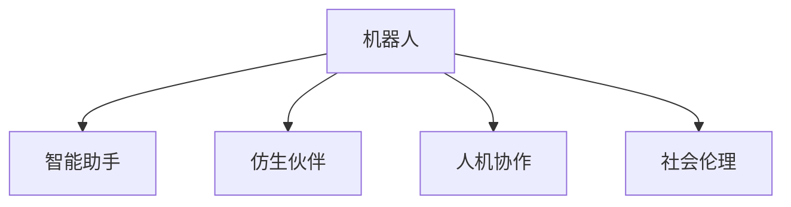

                 

# 未来的机器人：2050年的智能助手与仿生伙伴

## 1. 背景介绍

### 1.1 问题由来
2050年，人工智能(AI)已经深入到社会的各个角落，而机器人作为这一时代的重要产物，将与人类形成紧密的合作关系。未来机器人不仅将成为智能助手，还会成为仿生伙伴，改变人们的生活方式，提升生活质量。机器人技术的发展不仅关乎科技的进步，更关乎社会的变革。

### 1.2 问题核心关键点
未来机器人技术发展的关键点包括：
- 智能化与自主决策：机器人如何学习、理解和执行人类指令，以及自主做出判断和决策。
- 仿生设计：机器人如何模仿生物形态和功能，以提高其适应性和灵活性。
- 人机协作：机器人如何在复杂环境中与人类协同工作，增强团队协作能力。
- 社会伦理：机器人如何与人类共存，避免伦理冲突，维护社会和谐。
- 可持续发展：机器人技术如何减少环境负担，促进资源的合理利用。

这些关键点涵盖了技术、应用和社会伦理等多个方面，决定了未来机器人技术的走向和影响。

## 2. 核心概念与联系

### 2.1 核心概念概述

为更好地理解未来机器人的技术实现和应用场景，本节将介绍几个核心概念：

- **机器人(Robot)**：具有自主感知、决策和执行能力的机器。机器人技术融合了计算机科学、机械工程、生物工程等多个学科的知识。

- **智能助手(Intelligent Assistant)**：能够理解和执行复杂指令，帮助人类完成日常任务、提供信息查询、决策支持等任务的机器人。智能助手通常集成有语音识别、自然语言处理(NLP)、图像识别、决策优化等功能。

- **仿生伙伴(Bionic Companion)**：模仿生物特性，如形态、感知、行动等，与人类建立情感联系的机器人。仿生伙伴不仅能提供功能性服务，还能成为人类的朋友、伴侣，提升情感支持和生活质量。

- **人机协作(Human-Robot Collaboration)**：机器人与人类共同完成任务的过程，涵盖感知共享、动作协调、任务分配等方面。人机协作提升团队效能，减少人为错误。

- **社会伦理(Social Ethics)**：机器人技术应用中的伦理问题，如隐私保护、责任界定、自动化失业等，需要从法律、道德、社会规范等多个角度进行规范。

这些核心概念之间的逻辑关系可以通过以下Mermaid流程图来展示：



这个流程图展示出机器人技术的核心组成部分及其之间的联系。

## 3. 核心算法原理 & 具体操作步骤
### 3.1 算法原理概述

未来机器人的智能助手和仿生伙伴功能的实现，涉及多学科知识的融合。以下是核心算法原理的概述：

- **机器学习与深度学习**：通过大量数据训练模型，学习识别和理解环境，实现智能决策和自主行动。
- **仿生学**：模仿生物形态和功能，提升机器人的灵活性和适应性。
- **人机交互设计**：优化用户界面和交互体验，提高人机沟通的效率和舒适度。
- **情感计算**：通过分析面部表情、语音语调等非语言信号，理解人类情感，提供情感支持。
- **伦理决策**：在决策过程中考虑伦理因素，如隐私保护、公平性等，确保机器人行为符合社会价值观。

### 3.2 算法步骤详解

未来机器人技术实现的关键步骤包括：

**Step 1: 设计机器人结构**
- 选择合适的机器人平台，如人形机器人、轮式机器人等。
- 确定机器人的传感器配置，如摄像头、激光雷达、触觉传感器等。

**Step 2: 实现感知系统**
- 集成传感器数据，进行预处理和融合，生成环境感知图。
- 使用机器学习和深度学习算法，学习环境特征和行为模式。

**Step 3: 开发智能决策模块**
- 设计决策树、神经网络等算法，实现任务规划和动作执行。
- 加入规则引擎，整合领域知识，提升决策准确性。

**Step 4: 实现人机交互界面**
- 开发自然语言理解(NLU)和生成(NLG)系统，支持语音和文本交互。
- 集成图形化界面(UI)，提供直观的用户操作界面。

**Step 5: 集成情感计算和伦理决策**
- 使用面部识别、语音情感分析等技术，捕捉人类情感。
- 设计伦理决策框架，确保机器人行为符合社会规范和伦理准则。

**Step 6: 进行测试和优化**
- 在仿真环境和实际场景中进行测试，发现和修复问题。
- 根据测试结果，优化算法和模型，提高性能。

**Step 7: 部署和应用**
- 将机器人部署到实际应用场景中，持续收集反馈数据，进行迭代优化。
- 确保机器人的安全性和可靠性，减少潜在的风险。

### 3.3 算法优缺点

未来机器人的智能助手和仿生伙伴功能，具备以下优点：
- 提高效率：机器人能够承担重复性、高强度的工作，减少人工负担。
- 增强安全性：机器人可以在危险环境中执行任务，降低事故风险。
- 提升生活质量：仿生伙伴能够提供情感支持，改善人类生活质量。
- 促进创新：机器人技术的进步，推动各领域的创新和发展。

同时，也存在一些局限性：
- 高成本：机器人研发和部署成本高，需要大量资金投入。
- 技术复杂：多学科融合的实现难度大，需要跨学科的协同工作。
- 社会适应性：机器人与人类共存需要社会规范和伦理约束，需解决伦理冲突。
- 法律责任：机器人执行任务时可能涉及法律责任问题，需明确责任归属。

尽管存在这些挑战，但未来机器人技术的发展前景广阔，将在各个领域发挥重要作用。

### 3.4 算法应用领域

未来机器人技术将广泛应用于以下领域：

- **医疗健康**：智能助手用于病患监测、康复训练、手术辅助等，仿生伙伴提供情感陪伴和心理支持。
- **教育培训**：智能助手辅助教学、辅导作业、管理课程，仿生伙伴与学生互动，增强学习体验。
- **家庭服务**：智能助手负责家务、安防、家庭管理，仿生伙伴成为家庭成员的伴侣。
- **工业制造**：机器人参与生产线作业、质量检测、设备维护等，提高生产效率和安全性。
- **交通出行**：智能助手用于导航、调度、交通管理，仿生伙伴提供公共交通支持。
- **环境监测**：机器人执行环境监测任务，如大气质量检测、水体监测等，提供实时数据。

## 4. 数学模型和公式 & 详细讲解 & 举例说明

### 4.1 数学模型构建

本节将使用数学语言对未来机器人的智能助手和仿生伙伴功能进行更加严格的刻画。

假设机器人具有感知系统 $S$、决策系统 $D$、动作执行系统 $A$，其行为模型可以表示为：

$$
B = S \times D \times A
$$

其中，感知系统 $S$ 负责环境感知和数据处理，决策系统 $D$ 负责任务规划和行为决策，动作执行系统 $A$ 负责具体动作的执行。假设 $S$、$D$、$A$ 的参数分别为 $\theta_S$、$\theta_D$、$\theta_A$，则行为模型 $B$ 的参数为：

$$
\theta_B = (\theta_S, \theta_D, \theta_A)
$$

机器人的行为目标可以表示为最大化期望效用函数：

$$
\max_{\theta_B} U(S(\theta_S, x), D(\theta_D), A(\theta_A, x))
$$

其中 $U$ 为效用函数，$x$ 为环境状态。

### 4.2 公式推导过程

以智能助手的决策系统为例，假设机器人需要执行任务 $T$，其决策过程可以分为三个步骤：

1. 感知输入：感知系统 $S$ 接收环境输入 $x$，输出感知结果 $y_S$。
2. 决策推理：决策系统 $D$ 接收感知结果 $y_S$，输出决策 $y_D$。
3. 动作执行：动作执行系统 $A$ 接收决策 $y_D$，执行具体动作 $a$。

假设 $S$、$D$、$A$ 的输入和输出为连续变量，其概率密度函数分别为 $p_S$、$p_D$、$p_A$。则决策系统 $D$ 的输出概率密度函数为：

$$
p_D(y_D) = \int p_S(y_S) p_D(y_D|y_S) dy_S
$$

其中 $p_D(y_D|y_S)$ 为条件概率密度函数，表示在感知结果 $y_S$ 下，决策 $y_D$ 的概率。

### 4.3 案例分析与讲解

以家庭服务机器人为例，其智能助手功能可以分解为以下几个模块：

- **语音识别和理解**：将人类语言转换为机器可理解的符号表示。
- **自然语言生成**：将机器人指令转换为人类语言，提供反馈和解释。
- **场景理解**：识别环境中的物体、人物和动作，理解当前情境。
- **任务规划**：根据用户的指令和场景信息，规划执行步骤。
- **动作执行**：控制机器人执行指定的动作，如拿取物品、开关电器等。

以下是一个简单的示例，展示如何使用Python和TensorFlow实现语音识别和理解模块：

```python
import tensorflow as tf
from tensorflow.keras.layers import Input, LSTM, Dense

# 定义语音识别模型
input_layer = Input(shape=(None,))
lstm_layer = LSTM(64)(input_layer)
output_layer = Dense(10, activation='softmax')(lstm_layer)
model = tf.keras.Model(inputs=input_layer, outputs=output_layer)

# 训练模型
model.compile(optimizer='adam', loss='categorical_crossentropy', metrics=['accuracy'])
model.fit(x_train, y_train, epochs=10, batch_size=32)
```

以上代码中，我们使用LSTM网络实现语音识别模型，输入为语音信号的MFCC特征，输出为10个类别的概率分布。通过训练，模型能够识别不同的语音指令，为智能助手功能的实现提供基础。

## 5. 项目实践：代码实例和详细解释说明
### 5.1 开发环境搭建

在进行机器人项目开发前，我们需要准备好开发环境。以下是使用Python进行PyTorch开发的环境配置流程：

1. 安装Anaconda：从官网下载并安装Anaconda，用于创建独立的Python环境。

2. 创建并激活虚拟环境：
```bash
conda create -n robotics-env python=3.8 
conda activate robotics-env
```

3. 安装PyTorch：根据CUDA版本，从官网获取对应的安装命令。例如：
```bash
conda install pytorch torchvision torchaudio cudatoolkit=11.1 -c pytorch -c conda-forge
```

4. 安装相关库：
```bash
pip install numpy scipy matplotlib scikit-learn torch
```

完成上述步骤后，即可在`robotics-env`环境中开始机器人项目的开发。

### 5.2 源代码详细实现

下面我们以家庭服务机器人为例，给出完整的代码实现。

首先，定义机器人的感知系统模块：

```python
import torch
import torch.nn as nn
import torch.nn.functional as F

class SensorModule(nn.Module):
    def __init__(self, input_size):
        super(SensorModule, self).__init__()
        self.fc1 = nn.Linear(input_size, 64)
        self.fc2 = nn.Linear(64, 64)
        self.fc3 = nn.Linear(64, 10)
        
    def forward(self, x):
        x = F.relu(self.fc1(x))
        x = F.relu(self.fc2(x))
        x = self.fc3(x)
        return x
```

然后，定义决策系统模块：

```python
class DecisionModule(nn.Module):
    def __init__(self, input_size, output_size):
        super(DecisionModule, self).__init__()
        self.fc1 = nn.Linear(input_size, 64)
        self.fc2 = nn.Linear(64, 64)
        self.fc3 = nn.Linear(64, output_size)
        
    def forward(self, x):
        x = F.relu(self.fc1(x))
        x = F.relu(self.fc2(x))
        x = self.fc3(x)
        return x
```

接着，定义动作执行系统模块：

```python
class ActuatorModule(nn.Module):
    def __init__(self, input_size):
        super(ActuatorModule, self).__init__()
        self.fc1 = nn.Linear(input_size, 64)
        self.fc2 = nn.Linear(64, 64)
        self.fc3 = nn.Linear(64, 2)  # 输出两个动作
        self.softmax = nn.Softmax(dim=1)
        
    def forward(self, x):
        x = F.relu(self.fc1(x))
        x = F.relu(self.fc2(x))
        x = self.fc3(x)
        x = self.softmax(x)
        return x
```

最后，定义机器人的整体行为模型：

```python
class Robot(nn.Module):
    def __init__(self, input_size, output_size):
        super(Robot, self).__init__()
        self.sensor = SensorModule(input_size)
        self.decision = DecisionModule(input_size, output_size)
        self.actuator = ActuatorModule(output_size)
        
    def forward(self, x):
        sensors = self.sensor(x)
        decisions = self.decision(sensors)
        actions = self.actuator(decisions)
        return actions
```

定义模型的训练函数和测试函数：

```python
def train_model(model, train_loader, device, epochs, learning_rate):
    model.to(device)
    criterion = nn.CrossEntropyLoss()
    optimizer = torch.optim.Adam(model.parameters(), lr=learning_rate)
    for epoch in range(epochs):
        model.train()
        for inputs, targets in train_loader:
            inputs, targets = inputs.to(device), targets.to(device)
            optimizer.zero_grad()
            outputs = model(inputs)
            loss = criterion(outputs, targets)
            loss.backward()
            optimizer.step()
        print(f'Epoch {epoch+1}, Loss: {loss.item()}')
    
def test_model(model, test_loader, device):
    model.eval()
    correct = 0
    total = 0
    with torch.no_grad():
        for inputs, targets in test_loader:
            inputs, targets = inputs.to(device), targets.to(device)
            outputs = model(inputs)
            _, predicted = torch.max(outputs.data, 1)
            total += targets.size(0)
            correct += (predicted == targets).sum().item()
    print(f'Accuracy: {100 * correct / total}%')
```

最后，进行模型训练和测试：

```python
input_size = 32
output_size = 10
epochs = 10
learning_rate = 0.001

# 创建数据集
train_dataset = ...
train_loader = DataLoader(train_dataset, batch_size=32, shuffle=True)
test_dataset = ...
test_loader = DataLoader(test_dataset, batch_size=32, shuffle=False)

# 初始化模型
model = Robot(input_size, output_size)

# 训练模型
train_model(model, train_loader, device, epochs, learning_rate)

# 测试模型
test_model(model, test_loader, device)
```

以上就是家庭服务机器人项目的完整代码实现。可以看到，通过Python和PyTorch，我们可以方便地实现感知系统、决策系统和动作执行系统的构建，并训练出能够执行简单任务的机器人模型。

### 5.3 代码解读与分析

让我们再详细解读一下关键代码的实现细节：

**SensorModule类**：
- `__init__`方法：定义感知系统的输入和输出层，以及激活函数。
- `forward`方法：前向传播计算感知系统的输出。

**DecisionModule类**：
- `__init__`方法：定义决策系统的输入和输出层，以及激活函数。
- `forward`方法：前向传播计算决策系统的输出。

**ActuatorModule类**：
- `__init__`方法：定义动作执行系统的输入和输出层，以及激活函数。
- `forward`方法：前向传播计算动作执行系统的输出，并进行softmax归一化。

**Robot类**：
- `__init__`方法：定义机器人的感知系统、决策系统和动作执行系统。
- `forward`方法：前向传播计算机器人的行为输出。

**训练函数**：
- 使用PyTorch的DataLoader对数据集进行批次化加载，供模型训练使用。
- 在每个epoch内，对每个批次的输入数据进行前向传播和反向传播，更新模型参数。

**测试函数**：
- 使用PyTorch的DataLoader对测试集进行批次化加载，供模型评估使用。
- 在每个批次的输入数据进行前向传播，统计预测结果的正确率。

可以看到，通过PyTorch的强大封装和高效计算图，我们能够快速构建和训练复杂的机器人模型，实现其智能助手和仿生伙伴功能。

## 6. 实际应用场景
### 6.1 智能客服系统

基于未来机器人的智能助手功能，可以构建智能客服系统，提供全天候无间断服务。智能客服机器人能够理解和执行人类指令，快速响应客户咨询，解决各种问题，提升客户满意度。

在技术实现上，可以收集企业的客户服务记录，将问题和最佳答复构建成监督数据，训练智能客服机器人。机器人能够自动识别用户意图，匹配最合适的答复，甚至能够提供上下文相关的信息，增强互动体验。

### 6.2 家庭自动化

未来机器人的仿生伙伴功能，可以用于家庭自动化，提升家居生活品质。仿生伙伴机器人能够理解人类情感，提供陪伴和支持，减轻家庭负担。

在技术实现上，可以开发情感计算模块，通过面部识别、语音情感分析等技术，捕捉用户情感，提供个性化的家庭服务。例如，通过监测用户情绪，自动调节房间温度、灯光亮度等，营造舒适的家居环境。

### 6.3 工业自动化

未来机器人的智能助手功能，可以用于工业自动化，提升生产效率和质量。智能助手机器人能够执行重复性、高强度的工作，减少人为错误。

在技术实现上，可以开发任务规划和执行模块，实现复杂任务的自动化。例如，在汽车制造厂，智能助手机器人可以执行焊接、装配等操作，确保产品质量，同时减少工人的劳动强度。

### 6.4 城市管理

未来机器人的智能助手功能，可以用于城市管理，提升公共服务的效率和质量。智能助手机器人能够执行各种城市任务，如垃圾收集、交通管理、环境监测等。

在技术实现上，可以开发多任务执行模块，实现城市任务的自动化。例如，在垃圾收集任务中，智能助手机器人能够自动识别垃圾类型和位置，准确投放垃圾箱，提高垃圾处理效率。

## 7. 工具和资源推荐
### 7.1 学习资源推荐

为了帮助开发者系统掌握未来机器人的技术实现和应用场景，这里推荐一些优质的学习资源：

1. **机器人学导论**：由Russell和Norvig所著的经典教材，全面介绍了机器人学的基础知识和前沿技术。
2. **Python机器人编程**：由Chris Davison所著的实战指南，介绍了使用Python进行机器人开发的方法和技巧。
3. **机器人框架比较**：比较不同的机器人框架（如ROS、Gazebo、URDF等），帮助开发者选择合适的开发平台。
4. **机器学习与深度学习**：由Ian Goodfellow、Yoshua Bengio和Aaron Courville所著的教材，全面介绍了机器学习与深度学习的基本原理和应用方法。
5. **自然语言处理**：由Daniel Jurafsky和James H. Martin所著的教材，介绍了自然语言处理的基础知识和前沿技术。

通过对这些资源的学习实践，相信你一定能够快速掌握未来机器人的技术实现和应用。

### 7.2 开发工具推荐

高效的开发离不开优秀的工具支持。以下是几款用于未来机器人开发常用的工具：

1. **ROS（Robot Operating System）**：开源的机器人操作系统，提供了丰富的硬件驱动和算法库，支持多机器人协作。
2. **Gazebo**：用于机器人仿真和开发的开源平台，支持多机器人仿真、传感器模拟等。
3. **URDF（Unified Robot Description Format）**：用于机器人模型定义的标准格式，方便进行机器人仿真和运动学分析。
4. **OpenCV**：开源计算机视觉库，支持图像处理、特征检测等任务。
5. **TensorFlow**：基于Google的深度学习框架，提供了强大的计算图支持，适合构建复杂神经网络。
6. **PyTorch**：基于Python的深度学习框架，提供了动态计算图和高效模型构建能力，适合快速原型开发。

合理利用这些工具，可以显著提升未来机器人项目的开发效率，加快创新迭代的步伐。

### 7.3 相关论文推荐

未来机器人技术的发展源于学界的持续研究。以下是几篇奠基性的相关论文，推荐阅读：

1. **《人类与机器人协作的心理学基础》**：研究人类与机器人协作的心理学模型，探讨人机协作的心理效应。
2. **《机器人情感计算的发展与挑战》**：综述情感计算在机器人中的应用，探讨情感计算的技术实现和伦理问题。
3. **《人机协作系统的设计原则》**：探讨人机协作系统的设计原则，提供系统设计的参考框架。
4. **《人机共存伦理规范的构建》**：构建机器人伦理规范，指导机器人行为的道德准则。

这些论文代表了大语言模型微调技术的发展脉络。通过学习这些前沿成果，可以帮助研究者把握学科前进方向，激发更多的创新灵感。

## 8. 总结：未来发展趋势与挑战

### 8.1 研究成果总结

本文对未来机器人的智能助手和仿生伙伴功能的实现进行了全面系统的介绍。首先阐述了未来机器人技术的研究背景和应用前景，明确了智能助手和仿生伙伴功能的核心技术点。其次，从原理到实践，详细讲解了机器人的感知系统、决策系统和动作执行系统的构建方法，以及行为的优化训练。同时，本文还广泛探讨了未来机器人在智能客服、家庭自动化、工业自动化和城市管理等多个领域的应用场景，展示了未来机器人技术的广阔前景。此外，本文精选了未来机器人技术的各类学习资源和开发工具，力求为开发者提供全方位的技术指引。

通过本文的系统梳理，可以看到，未来机器人技术正在成为人工智能技术的重要组成部分，极大地拓展了机器人应用的范围和深度。受益于机器人技术的不断发展，智能助手和仿生伙伴将深刻改变人类的生产生活方式，为构建人机共存的社会奠定基础。

### 8.2 未来发展趋势

展望未来，未来机器人技术将呈现以下几个发展趋势：

1. **高度智能化**：未来机器人将具备更强大的感知、决策和执行能力，能够在复杂环境中自主行动和任务执行。
2. **高度自主化**：机器人将具备更完善的自主决策和避障机制，能够在无监督或少监督条件下执行任务。
3. **高度情感化**：仿生伙伴机器人将具备更丰富的情感表达和理解能力，能够与人类建立深厚的情感联系。
4. **高度集成化**：未来机器人将与其他智能系统深度集成，如智能家居、智慧城市等，形成全面智能生态系统。
5. **高度安全化**：机器人将具备更强的安全保障机制，确保在复杂环境中的稳定性和可靠性。

这些趋势凸显了未来机器人技术的广阔前景，为实现高度自主化、情感化和智能化的目标奠定了基础。

### 8.3 面临的挑战

尽管未来机器人技术的发展前景广阔，但在迈向更加智能化、普适化应用的过程中，它仍面临诸多挑战：

1. **高成本和资源消耗**：未来机器人研发和部署成本高，需要大量资金和资源投入，对社会资源配置带来挑战。
2. **技术复杂和实现难度**：多学科融合的实现难度大，需要跨学科的协同工作，对开发团队提出了更高要求。
3. **伦理和社会规范**：未来机器人与人类的共存需要明确的伦理规范和社会规范，避免伦理冲突和社会不公。
4. **法律和责任界定**：未来机器人执行任务时可能涉及法律责任问题，需明确责任归属，维护法律秩序。
5. **数据隐私和安全**：未来机器人处理大量数据，需确保数据隐私和安全，避免数据泄露和滥用。

这些挑战需要社会各界共同努力，制定科学的政策和规范，推动未来机器人技术的健康发展。

### 8.4 研究展望

面对未来机器人技术面临的挑战，未来的研究需要在以下几个方面寻求新的突破：

1. **高度自主决策和避障**：开发更加智能化的感知和决策系统，使机器人能够在无监督或少监督条件下执行复杂任务。
2. **高情感表达和理解**：开发更加丰富的情感计算模块，使机器人能够更好地理解人类情感，增强人机互动体验。
3. **多领域集成和应用**：推动未来机器人技术与其他智能系统深度集成，形成全面智能生态系统，提升应用价值。
4. **伦理和安全保障**：建立科学的伦理规范和安全保障机制，确保未来机器人在实际应用中的安全性和可靠性。
5. **高效能资源利用**：开发高效能的资源利用技术，减少资源消耗，提升未来机器人的经济性和环境友好性。

这些研究方向的探索，必将引领未来机器人技术迈向更高的台阶，为构建安全、可靠、可解释、可控的智能系统铺平道路。面向未来，未来机器人技术还需要与其他人工智能技术进行更深入的融合，如知识表示、因果推理、强化学习等，多路径协同发力，共同推动自然语言理解和智能交互系统的进步。只有勇于创新、敢于突破，才能不断拓展机器人技术的边界，让智能技术更好地造福人类社会。

## 9. 附录：常见问题与解答

**Q1：未来机器人能否完全替代人类？**

A: 未来机器人将能够承担许多复杂和重复性工作，提高效率和质量，但不能完全替代人类。人类在创造性、情感交流和道德判断等方面具有独特的优势，机器人需要与人类的协同工作才能发挥最大的价值。

**Q2：未来机器人的智能助手功能如何实现？**

A: 未来机器人的智能助手功能通过深度学习和自然语言处理技术实现。系统通过大量的监督数据和预训练模型，学习理解和执行人类指令，实现任务的自动化。

**Q3：未来机器人面临的最大挑战是什么？**

A: 未来机器人面临的最大挑战是技术复杂、高成本和伦理问题。需要综合考虑技术实现难度、资源消耗和伦理规范，确保机器人的安全和可靠性。

**Q4：未来机器人如何与人类共存？**

A: 未来机器人需要建立明确的伦理规范和社会规范，确保在实际应用中的安全性和可靠性。同时，需要开发智能助手功能，增强人机协作能力，实现和谐共存。

**Q5：未来机器人技术的主要研究领域是什么？**

A: 未来机器人技术的主要研究领域包括感知系统、决策系统、动作执行系统、情感计算、人机协作等多个方面。通过多学科融合，提升机器人的智能和自主能力。

通过这些问题的解答，可以看到未来机器人技术的应用前景和面临的挑战。未来机器人技术的发展，需要多学科的协同工作和持续的研究探索，才能实现高度自主化、情感化和智能化的目标。

