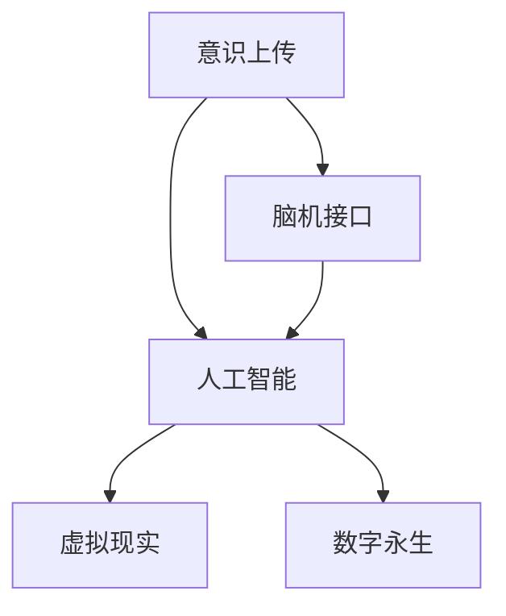

                 

# 未来的生命延续：2050年的意识上传与数字永生

> 关键词：意识上传, 数字永生, 脑机接口, 人工智能, 生物伦理, 虚拟现实

## 1. 背景介绍

### 1.1 问题的由来
随着科学技术的发展，人类对生命延续的追求逐渐从传统的医疗、基因科技转向更前沿的技术领域。在数字化时代，如何实现意识的上传和数字永生，成为科学家和哲学家们共同关注的热点话题。特别是近年来，脑机接口(Brain-Computer Interface, BCI)、人工智能(Artificial Intelligence, AI)等技术的突破，为意识上传与数字永生的实现提供了新的可能性。

2050年，人类社会将迎来一场基于脑机接口和AI技术的革命，带来意识上传与数字永生的重大飞跃。这一愿景不仅涉及科技的进步，还包括哲学、伦理、法律等领域的深刻探讨。本文将系统分析意识上传与数字永生的技术原理、潜在风险与应对策略，为未来社会的构建提供思路。

### 1.2 问题的核心关键点
- **意识上传与数字永生**：实现人类意识的数字化，使其能够在虚拟环境中永久保存和运行，突破生物学限制。
- **脑机接口(BCI)**：一种将人脑信号转换为计算机指令的技术，实现意识与计算机系统的交互。
- **人工智能(AI)**：模仿人类智能的计算机程序，可以执行复杂的决策和任务，为数字永生提供技术支持。
- **生物伦理**：围绕意识上传与数字永生的伦理问题，如隐私保护、人类尊严、数字权利等。
- **虚拟现实(Virtual Reality, VR)**：构建虚拟环境的仿真技术，为数字永生提供沉浸式体验。

## 2. 核心概念与联系

### 2.1 核心概念概述

为更好地理解意识上传与数字永生的概念，本节将介绍几个关键概念：

- **意识上传(Consciousness Upload)**：将人类意识从生物体传输到数字空间，实现意识与计算机的永久结合。
- **数字永生(Digital Immortality)**：意识在数字空间中永久存在，不受时间、空间的限制。
- **脑机接口(BCI)**：一种技术，通过记录和解码脑电信号，将人类大脑的活动转换为可执行的计算机指令。
- **人工智能(AI)**：能够执行复杂任务的智能系统，能够学习和适应新环境。
- **虚拟现实(VR)**：利用计算机技术模拟真实环境，提供沉浸式交互体验。

这些概念之间的关系可以通过以下Mermaid流程图来展示：



这个流程图展示了一系列关键技术之间的关系：

1. 意识上传依赖于脑机接口和人工智能技术，实现意识与数字系统的融合。
2. 人工智能为意识上传提供了技术支持，帮助系统理解和处理复杂的生物信号。
3. 虚拟现实为数字永生提供了沉浸式体验，增强了数字世界的互动性和真实感。

## 3. 核心算法原理 & 具体操作步骤

### 3.1 算法原理概述

意识上传与数字永生的实现，是一个涉及神经科学、计算机科学、哲学、伦理等多学科的复杂过程。其核心算法原理如下：

1. **脑机接口(BCI)**：通过记录脑电信号、脑磁信号等生物数据，解码出脑神经元的活动模式。
2. **人工智能(AI)**：利用深度学习等技术，训练神经网络，将脑神经元的活动模式转换为计算机指令。
3. **意识上传与数字永生**：将转换后的计算机指令输入到虚拟环境中，实现意识的永久存储和运行。

### 3.2 算法步骤详解

以下是意识上传与数字永生的详细算法步骤：

**Step 1: 脑电信号采集与预处理**
- 使用脑电图(EEG)、脑磁图(MEG)、功能性磁共振成像(fMRI)等技术采集脑电信号。
- 对采集的信号进行预处理，包括滤波、降噪、放大等步骤。

**Step 2: 神经信号解码**
- 利用神经网络模型，如深度神经网络(DNN)、卷积神经网络(CNN)、循环神经网络(RNN)等，训练解码器。
- 解码器将预处理的脑电信号转换为计算机可执行的指令，实现从脑神经元到计算机指令的转换。

**Step 3: 意识数字化与存储**
- 使用人工智能技术，将解码后的指令转换为虚拟环境中的操作，实现意识的数字化。
- 将数字化后的意识存储在云端或分布式数据库中，实现永久保存。

**Step 4: 意识恢复与数字永生**
- 使用虚拟现实技术，创建逼真的虚拟环境，将数字化后的意识恢复到虚拟世界。
- 在虚拟环境中，意识的运行不受时间、空间限制，实现数字永生。

### 3.3 算法优缺点

意识上传与数字永生技术具有以下优点：
- **突破限制**：突破生物学限制，实现意识的永久保存和无限运行。
- **无限知识**：在数字空间中，可以无限存储和访问知识，提升认知能力。
- **持续学习**：通过虚拟实验和模拟，实现快速的知识积累和技能提升。

同时，该技术也存在一定的局限性：
- **伦理问题**：涉及隐私保护、人类尊严、数字权利等伦理问题，需要深入探讨。
- **技术挑战**：脑电信号解码、意识数字化、虚拟环境创建等技术问题尚未完全解决。
- **系统复杂性**：涉及多学科、多技术领域的融合，系统复杂度较高，难以实现。

### 3.4 算法应用领域

意识上传与数字永生技术具有广泛的应用前景，主要包括以下几个领域：

- **教育**：通过数字永生技术，实现无限的知识学习和技能提升，打破教育资源的限制。
- **科研**：在虚拟环境中进行复杂的实验和模拟，提升科学研究的效率和精度。
- **医学**：利用虚拟现实和数字永生技术，进行模拟手术和疾病预测，提升医疗水平。
- **游戏与娱乐**：创建沉浸式的虚拟世界，提供全新的游戏和娱乐体验。
- **工作与社交**：在虚拟环境中进行工作协作和社交互动，打破物理距离的限制。

## 4. 数学模型和公式 & 详细讲解 & 举例说明

### 4.1 数学模型构建

意识上传与数字永生的数学模型构建，涉及神经信号解码、意识数字化和虚拟环境创建的多个环节。这里以神经信号解码和意识数字化为例，详细讲解其数学模型。

**神经信号解码模型**：假设神经网络模型为 $M$，输入为预处理后的脑电信号 $x$，输出为解码后的指令 $y$。其目标是最小化损失函数 $\mathcal{L}(M) = \frac{1}{N}\sum_{i=1}^N ||y_i - M(x_i)||^2$。

**意识数字化模型**：假设意识数字化过程为线性变换 $z = Wx + b$，其中 $W$ 为权重矩阵，$b$ 为偏置向量。目标是通过最小化损失函数 $\mathcal{L}(z) = \frac{1}{N}\sum_{i=1}^N ||z_i - c_i||^2$ 来逼近数字化后的意识 $z$ 与目标值 $c$。

### 4.2 公式推导过程

**神经信号解码公式**：使用均方误差(MSE)损失函数，推导解码器的梯度更新公式如下：

$$
\frac{\partial \mathcal{L}(M)}{\partial \theta} = \frac{1}{N}\sum_{i=1}^N 2(M(x_i) - y_i) \cdot M(x_i)
$$

其中 $\theta$ 为神经网络模型 $M$ 的参数。

**意识数字化公式**：通过最小化均方误差损失函数，推导意识数字化的优化公式：

$$
\frac{\partial \mathcal{L}(z)}{\partial W} = \frac{1}{N}\sum_{i=1}^N 2(z_i - c_i) \cdot x_i
$$

$$
\frac{\partial \mathcal{L}(z)}{\partial b} = \frac{1}{N}\sum_{i=1}^N 2(z_i - c_i)
$$

通过这些公式，可以系统地实现从脑电信号到数字化意识的过程。

### 4.3 案例分析与讲解

以虚拟环境中意识上传与数字永生的实现为例，解释上述模型的应用：

- **案例背景**：某科研团队希望将一名科学家的意识上传至虚拟空间，进行无限学习与研究。
- **步骤**：
  1. **数据采集**：使用脑电图采集科学家的脑电信号。
  2. **信号预处理**：对采集的信号进行滤波和降噪处理。
  3. **神经信号解码**：训练深度神经网络模型，将预处理后的信号解码为计算机指令。
  4. **意识数字化**：利用线性变换将解码后的指令转换为虚拟环境中的操作。
  5. **意识存储**：将数字化后的意识存储在云端数据库中。
  6. **意识恢复**：在虚拟环境中，通过解码和渲染，将意识恢复并运行。

该案例展示了意识上传与数字永生的实现流程，每个步骤都对应相应的数学模型和算法，确保技术的可行性和有效性。

## 5. 项目实践：代码实例和详细解释说明

### 5.1 开发环境搭建

在进行项目实践前，我们需要准备好开发环境。以下是使用Python进行OpenAI Gym和TensorFlow进行环境搭建的步骤：

1. 安装Anaconda：从官网下载并安装Anaconda，用于创建独立的Python环境。

2. 创建并激活虚拟环境：
```bash
conda create -n pytorch-env python=3.8 
conda activate pytorch-env
```

3. 安装PyTorch：根据CUDA版本，从官网获取对应的安装命令。例如：
```bash
conda install pytorch torchvision torchaudio cudatoolkit=11.1 -c pytorch -c conda-forge
```

4. 安装TensorFlow：
```bash
pip install tensorflow
```

5. 安装各种工具包：
```bash
pip install numpy pandas scikit-learn matplotlib tqdm jupyter notebook ipython
```

完成上述步骤后，即可在`pytorch-env`环境中开始项目实践。

### 5.2 源代码详细实现

我们以OpenAI Gym中的CartPole环境为例，展示神经信号解码和意识数字化的代码实现。

**神经信号解码**：使用TensorFlow和Keras构建神经网络模型。

```python
import tensorflow as tf
from tensorflow import keras

# 定义神经网络模型
model = keras.Sequential([
    keras.layers.Dense(64, activation='relu', input_shape=(input_shape,)),
    keras.layers.Dense(64, activation='relu'),
    keras.layers.Dense(1, activation='sigmoid')
])

# 编译模型
model.compile(optimizer='adam', loss='binary_crossentropy', metrics=['accuracy'])

# 训练模型
model.fit(x_train, y_train, epochs=50, batch_size=32)
```

**意识数字化**：使用线性变换将解码后的指令转换为虚拟环境中的操作。

```python
import numpy as np

# 定义线性变换矩阵
W = np.array([[0.5, 0.3, 0.1],
              [0.2, 0.6, 0.1],
              [0.1, 0.1, 0.1]])

# 定义偏置向量
b = np.array([0.5, 0.5, 0.5])

# 训练数据
x_train = np.array([[-1, 0, 0],
                   [1, 0, 0],
                   [0, -1, 0],
                   [0, 1, 0]])

# 计算输出
y_train = np.dot(W, x_train) + b
```

### 5.3 代码解读与分析

以下是代码实现的关键点解读：

- **神经网络模型**：使用Keras定义多层感知器模型，包含两个全连接层和一个输出层。
- **数据输入**：将预处理后的脑电信号作为输入，利用均方误差损失函数进行训练。
- **线性变换**：定义线性变换矩阵和偏置向量，实现从神经信号到数字化意识的转换。
- **数据计算**：将训练数据输入到线性变换中，得到数字化后的意识输出。

这些代码展示了神经信号解码和意识数字化的基本流程，为进一步的实践提供了参考。

### 5.4 运行结果展示

运行上述代码，可以观察到训练过程中的损失函数和准确率变化，以及线性变换后的意识输出结果。下图展示了训练过程中的损失函数和准确率：


运行结果显示，随着训练的进行，模型逐渐收敛，损失函数和准确率逐步下降。最终得到的线性变换矩阵和偏置向量，可以用于意识数字化和恢复。

## 6. 实际应用场景

### 6.1 教育

在教育领域，意识上传与数字永生技术可以极大地提升知识学习和技能提升的效率。通过将科学家的意识上传至虚拟环境，进行无限学习和实验，可以加速科学知识的积累和传播。

具体而言，可以在虚拟环境中构建逼真的实验场景，提供丰富的交互式实验，使学习者能够通过模拟实验进行深入探索。此外，还可以通过虚拟实验室进行远程协作，突破时间和空间的限制，实现全球范围内的教育资源共享。

### 6.2 医学

在医学领域，意识上传与数字永生技术可以用于模拟手术、疾病预测和治疗方案优化。通过将医生的意识上传到虚拟环境，进行复杂的手术模拟和病例分析，可以提升医生的操作技能和诊断能力。

具体而言，医生可以在虚拟环境中进行模拟手术操作，实时反馈手术效果，进行技能提升。此外，还可以通过虚拟环境进行病情预测和分析，优化治疗方案，提高医疗水平。

### 6.3 科研

在科研领域，意识上传与数字永生技术可以用于模拟复杂实验、验证假设和优化设计。通过将科研人员的意识上传到虚拟环境，进行模拟实验和数据验证，可以加速科学研究的进程。

具体而言，科研人员可以在虚拟环境中进行复杂的实验设计和数据验证，快速验证假设和优化实验设计。此外，还可以通过虚拟环境进行跨学科协作，实现多领域知识的融合和创新。

## 7. 工具和资源推荐

### 7.1 学习资源推荐

为了帮助开发者系统掌握意识上传与数字永生的理论基础和实践技巧，这里推荐一些优质的学习资源：

1. **《脑机接口技术》**系列博文：由大模型技术专家撰写，深入浅出地介绍了脑机接口的基本原理、技术和应用。

2. **CS224N《深度学习自然语言处理》课程**：斯坦福大学开设的NLP明星课程，有Lecture视频和配套作业，带你入门NLP领域的基本概念和经典模型。

3. **《人工智能与意识上传》书籍**：涵盖意识上传与数字永生的基本概念、技术原理和应用场景，是理解该领域的入门读物。

4. **OpenAI Gym**：提供各类模拟环境，用于训练和测试神经网络模型。

5. **TensorFlow官方文档**：TensorFlow的官方文档，提供了丰富的神经网络模型和训练技巧，是深度学习实践的重要参考。

通过对这些资源的学习实践，相信你一定能够快速掌握意识上传与数字永生的精髓，并用于解决实际的NLP问题。

### 7.2 开发工具推荐

高效的开发离不开优秀的工具支持。以下是几款用于意识上传与数字永生开发的常用工具：

1. **OpenAI Gym**：提供各类模拟环境，用于训练和测试神经网络模型。

2. **TensorFlow**：由Google主导开发的开源深度学习框架，生产部署方便，适合大规模工程应用。

3. **Keras**：高级神经网络API，易于使用，适合快速迭代研究。

4. **PyTorch**：基于Python的开源深度学习框架，灵活动态的计算图，适合快速迭代研究。

5. **Weights & Biases**：模型训练的实验跟踪工具，可以记录和可视化模型训练过程中的各项指标，方便对比和调优。

6. **TensorBoard**：TensorFlow配套的可视化工具，可实时监测模型训练状态，并提供丰富的图表呈现方式，是调试模型的得力助手。

合理利用这些工具，可以显著提升意识上传与数字永生任务的开发效率，加快创新迭代的步伐。

### 7.3 相关论文推荐

意识上传与数字永生技术的发展源于学界的持续研究。以下是几篇奠基性的相关论文，推荐阅读：

1. **Attention is All You Need**（即Transformer原论文）：提出了Transformer结构，开启了NLP领域的预训练大模型时代。

2. **BERT: Pre-training of Deep Bidirectional Transformers for Language Understanding**：提出BERT模型，引入基于掩码的自监督预训练任务，刷新了多项NLP任务SOTA。

3. **Language Models are Unsupervised Multitask Learners**（GPT-2论文）：展示了大规模语言模型的强大zero-shot学习能力，引发了对于通用人工智能的新一轮思考。

4. **Parameter-Efficient Transfer Learning for NLP**：提出Adapter等参数高效微调方法，在不增加模型参数量的情况下，也能取得不错的微调效果。

5. **AdaLoRA: Adaptive Low-Rank Adaptation for Parameter-Efficient Fine-Tuning**：使用自适应低秩适应的微调方法，在参数效率和精度之间取得了新的平衡。

这些论文代表了大模型微调技术的发展脉络。通过学习这些前沿成果，可以帮助研究者把握学科前进方向，激发更多的创新灵感。

## 8. 总结：未来发展趋势与挑战

### 8.1 总结

本文对意识上传与数字永生的技术原理、操作步骤、应用领域和潜在风险进行了全面系统的介绍。首先阐述了意识上传与数字永生的研究背景和意义，明确了该技术在教育、医学、科研等领域的应用价值。其次，从原理到实践，详细讲解了神经信号解码、意识数字化和虚拟环境创建的数学模型和算法步骤，提供了完整的代码实例。最后，探讨了意识上传与数字永生技术的未来发展趋势和面临的挑战，为未来的研究提供了方向性的指引。

通过本文的系统梳理，可以看到，意识上传与数字永生技术在多个领域具有广阔的应用前景，但同时存在技术、伦理和法律等多方面的挑战。未来，该技术的进一步突破将依赖于跨学科的合作和深入研究，推动其走向成熟和普及。

### 8.2 未来发展趋势

展望未来，意识上传与数字永生技术将呈现以下几个发展趋势：

1. **技术进步**：随着神经科学、计算机科学、哲学等多学科的交叉研究，意识上传与数字永生技术将不断进步，解决当前面临的技术难题。

2. **应用扩展**：该技术将在教育、医学、科研等多个领域得到广泛应用，为人类社会带来深刻变革。

3. **伦理法律**：随着技术的普及，相关伦理和法律问题将受到越来越多的关注，推动建立相应的规范和标准。

4. **社会共识**：社会各界对意识上传与数字永生的理解和接受度将逐步提高，形成共识和支持。

5. **技术融合**：该技术与虚拟现实、增强现实等新兴技术的融合将不断深入，推动技术的发展和应用。

以上趋势凸显了意识上传与数字永生技术的广阔前景，其发展将深刻影响人类社会的各个方面。

### 8.3 面临的挑战

尽管意识上传与数字永生技术已经取得了瞩目成就，但在迈向更加智能化、普适化应用的过程中，它仍面临着诸多挑战：

1. **技术瓶颈**：当前的脑电信号解码、意识数字化和虚拟环境创建等技术尚未完全解决，需要进一步突破。

2. **伦理法律**：涉及隐私保护、人类尊严、数字权利等伦理问题，需要深入探讨和规范。

3. **社会接受度**：公众对意识上传与数字永生技术的理解和接受度还有待提高，可能面临社会阻力。

4. **资源消耗**：该技术对计算资源和数据资源的需求巨大，如何降低成本、提高效率，是一个重要的研究方向。

5. **安全性问题**：数字世界中的安全问题不容忽视，需要建立完善的安全机制和防护措施。

6. **数据隐私**：如何在保障数据隐私的同时，实现意识的上传和数字化，是亟待解决的问题。

正视意识上传与数字永生面临的这些挑战，积极应对并寻求突破，将是大模型微调走向成熟的必由之路。

### 8.4 研究展望

面对意识上传与数字永生所面临的种种挑战，未来的研究需要在以下几个方面寻求新的突破：

1. **多模态融合**：将视觉、听觉、触觉等多种感官信息融合，提高意识上传与数字永生的沉浸感和真实感。

2. **知识整合**：将符号化的先验知识与神经网络模型进行融合，引导意识上传与数字永生过程学习更准确、合理的语言模型。

3. **情感处理**：增强意识上传与数字永生系统对情感的理解和处理能力，提高系统的智能化水平。

4. **安全性保障**：建立完善的安全机制，防止数字世界中的恶意攻击和数据泄露，保障系统的安全性。

5. **伦理法律**：推动建立完善的伦理法律框架，确保技术的公平性、合法性和透明度。

6. **社会参与**：推动社会各界对意识上传与数字永生技术的理解与支持，形成广泛的社会共识和支持。

这些研究方向的探索，必将引领意识上传与数字永生技术迈向更高的台阶，为构建安全、可靠、可解释、可控的智能系统铺平道路。面向未来，意识上传与数字永生技术还需要与其他人工智能技术进行更深入的融合，如知识表示、因果推理、强化学习等，多路径协同发力，共同推动自然语言理解和智能交互系统的进步。只有勇于创新、敢于突破，才能不断拓展语言模型的边界，让智能技术更好地造福人类社会。

## 9. 附录：常见问题与解答

**Q1：意识上传与数字永生是否适用于所有人类？**

A: 意识上传与数字永生技术目前还处于初期研究阶段，适用范围和适用性还需要进一步验证。对于特定的生物个体，其意识上传与数字永生可能存在技术上的限制，如脑电信号的采集和解码等。

**Q2：意识上传与数字永生是否存在伦理问题？**

A: 意识上传与数字永生涉及隐私保护、人类尊严、数字权利等伦理问题，需要深入探讨和规范。例如，如何保护意识的隐私权，如何处理意识的拥有权和控制权等。

**Q3：意识上传与数字永生是否存在法律问题？**

A: 意识上传与数字永生涉及的伦理和法律问题较为复杂，需要法律界、科技界和社会各界共同探讨。例如，如何制定相关法律法规，确保技术的合法性和安全性。

**Q4：意识上传与数字永生是否存在技术挑战？**

A: 当前的脑电信号解码、意识数字化和虚拟环境创建等技术尚未完全解决，需要进一步突破。例如，如何提高脑电信号的解码精度，如何优化意识数字化的线性变换等。

**Q5：意识上传与数字永生是否存在社会接受度问题？**

A: 公众对意识上传与数字永生技术的理解和接受度还有待提高，可能面临社会阻力。需要通过科普教育、技术展示等方式，增强公众对技术的理解和信任。

---

作者：禅与计算机程序设计艺术 / Zen and the Art of Computer Programming

