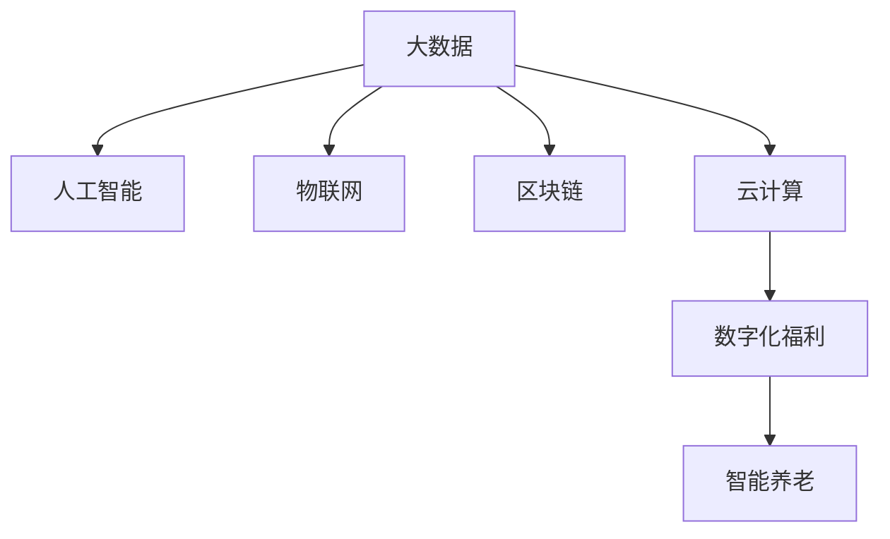

                 

## 1. 背景介绍

### 1.1 问题由来

随着科技的进步和社会的快速发展，人类正进入一个新的时代——智能社会。在数字化的浪潮中，传统行业正在被新技术所重塑，人类生活方式也随之发生深刻变化。在这样一个背景下，传统的社会保障体系已经难以满足人们的需求，亟需进行数字化转型。

智能社会保障体系的建设，不仅可以提升社会福利的覆盖面和质量，还能大幅提升公共服务的效率和便利性。2050年的数字福利与智能养老，将是一个全新的社会保障体系，将充分利用先进的科技手段，实现精准化、智能化、个性化服务。

### 1.2 问题核心关键点

智能社会保障体系的核心在于利用大数据、人工智能、物联网等技术手段，通过数字化转型，构建一个智能、高效、普惠的社会福利系统。具体来说，智能社会保障体系将具备以下特点：

- 数据驱动：通过收集和分析大量的社会数据，提供精准化的福利和公共服务。
- 个性化服务：根据个人需求，提供定制化的福利和公共服务。
- 智能化管理：利用AI技术，提升社会福利的智能化水平，实现快速响应和自动化处理。
- 普惠性覆盖：实现覆盖面广、服务均等化，让每一个社会成员都能享受到社会福利。
- 可扩展性：能够根据社会需求的变化，灵活扩展和调整服务内容。

智能社会保障体系的构建，将依赖于众多技术手段和基础设施的建设，包括但不限于：云计算、大数据、人工智能、物联网、区块链等。

## 2. 核心概念与联系

### 2.1 核心概念概述

为更好地理解智能社会保障体系的构建，本节将介绍几个关键概念及其之间的联系：

- 大数据（Big Data）：指规模巨大、类型繁多、速度快、价值密度低的数据集合。
- 人工智能（AI）：通过算法和计算能力，使计算机具备学习、推理、感知等人类智能。
- 物联网（IoT）：将各种设备和物品通过网络互联互通，实现智能化管理。
- 区块链（Blockchain）：一种去中心化的分布式账本技术，保障数据安全与透明。
- 云计算（Cloud Computing）：通过互联网提供动态、可扩展的计算资源，支持大规模数据处理。
- 数字化福利（Digital Welfare）：将数字化技术应用于社会福利领域，提升服务质量和效率。
- 智能养老（Smart Aging）：通过数字化和智能化手段，提升老年人的生活质量和福利水平。

这些概念之间的逻辑关系可以通过以下Mermaid流程图来展示：



这个流程图展示了大数据、人工智能、物联网、区块链、云计算等技术手段在智能社会保障体系中的角色及其联系。

## 3. 核心算法原理 & 具体操作步骤

### 3.1 算法原理概述

智能社会保障体系的构建，是一个典型的系统工程，涉及众多技术手段和应用场景。其核心算法原理可以归纳为以下几步：

1. **数据采集与预处理**：通过传感器、监控设备、社交媒体等手段，收集大量的社会数据。然后对数据进行清洗、去重、标注等预处理，保证数据的质量和可用性。

2. **模型训练与优化**：利用机器学习算法，如决策树、随机森林、神经网络等，对数据进行建模和训练。同时，使用优化算法，如梯度下降、遗传算法等，不断优化模型性能。

3. **智能化管理与服务**：将训练好的模型集成到社会福利系统中，实现精准化的福利和服务。同时，引入AI技术，提升服务智能化水平，如语音识别、自然语言处理、图像识别等。

4. **区块链应用**：利用区块链技术，保障数据的透明性和安全性。同时，通过智能合约等手段，实现自动化管理和服务。

5. **云计算支持**：利用云计算平台，实现数据存储、计算、处理等功能的分布式和可扩展。

### 3.2 算法步骤详解

智能社会保障体系的构建，可以分为以下步骤：

**Step 1: 数据采集与预处理**
- 通过传感器、监控设备、社交媒体等手段，收集大量的社会数据。
- 对数据进行清洗、去重、标注等预处理，保证数据的质量和可用性。

**Step 2: 模型训练与优化**
- 利用机器学习算法，对预处理后的数据进行建模和训练。
- 使用优化算法，不断调整模型参数，提升模型性能。

**Step 3: 智能化管理与服务**
- 将训练好的模型集成到社会福利系统中，实现精准化的福利和服务。
- 引入AI技术，提升服务智能化水平，如语音识别、自然语言处理、图像识别等。

**Step 4: 区块链应用**
- 利用区块链技术，保障数据的透明性和安全性。
- 通过智能合约等手段，实现自动化管理和服务。

**Step 5: 云计算支持**
- 利用云计算平台，实现数据存储、计算、处理等功能的分布式和可扩展。

### 3.3 算法优缺点

智能社会保障体系具有以下优点：
1. 提高效率：通过智能化管理和服务，大幅提升公共服务的效率和便利性。
2. 精准化服务：通过大数据分析和模型训练，提供精准化的福利和服务。
3. 普惠性覆盖：实现覆盖面广、服务均等化，让每一个社会成员都能享受到社会福利。
4. 智能化管理：利用AI技术，提升社会福利的智能化水平，实现快速响应和自动化处理。

同时，该体系也存在一定的局限性：
1. 数据隐私：大量社会数据的收集和使用，可能引发数据隐私和安全问题。
2. 技术门槛：智能化社会保障体系的构建，需要高水平的技术支撑和专业人才。
3. 成本问题：基础设施的建设和管理，需要大量资金投入。

尽管存在这些局限性，但智能社会保障体系代表了社会保障发展的方向，是未来发展的必然趋势。未来相关研究将集中在如何平衡技术优势和成本问题，实现可持续的社会保障体系。

### 3.4 算法应用领域

智能社会保障体系的应用领域非常广泛，涵盖以下几个方面：

- **数字化福利**：通过数字化技术，实现精准化、智能化、个性化服务。
- **智能养老**：利用物联网、人工智能等技术，提升老年人的生活质量和福利水平。
- **健康管理**：通过大数据分析和AI技术，提供个性化的健康管理服务。
- **教育服务**：利用云计算和AI技术，提供个性化、智能化教育服务。
- **就业指导**：通过数据分析和机器学习，提供精准化的就业指导和培训。
- **公共安全**：利用物联网和大数据分析，提升公共安全管理的智能化水平。

## 4. 数学模型和公式 & 详细讲解

### 4.1 数学模型构建

智能社会保障体系的构建，涉及多个领域的数学模型。以下将重点介绍其中的几个关键模型：

- **预测模型**：通过机器学习算法，对社会福利需求进行预测和分析。
- **推荐系统**：利用协同过滤、内容推荐等算法，提供个性化的社会福利和服务。
- **优化模型**：通过优化算法，调整福利服务的分配和配置。

### 4.2 公式推导过程

以预测模型为例，其基本原理是利用历史数据，训练一个预测模型，用于预测未来的社会福利需求。以下是预测模型的公式推导过程：

$$
\hat{y} = f(x; \theta)
$$

其中，$x$ 为输入变量，$\hat{y}$ 为预测结果，$\theta$ 为模型参数。

在实际应用中，预测模型通常采用线性回归、决策树、随机森林、神经网络等算法进行建模。以下是线性回归模型的公式推导过程：

$$
\hat{y} = \theta_0 + \sum_{i=1}^n \theta_i x_i
$$

其中，$\theta_0$ 为截距，$\theta_i$ 为权重，$x_i$ 为输入变量。

### 4.3 案例分析与讲解

以智能养老为例，利用物联网和大数据分析，可以实现个性化的养老服务。以下是智能养老的案例分析：

**Step 1: 数据采集**
- 通过传感器、监控设备、社交媒体等手段，收集老人的生理数据、行为数据等。

**Step 2: 数据预处理**
- 对采集的数据进行清洗、去重、标注等预处理，保证数据的质量和可用性。

**Step 3: 模型训练**
- 利用机器学习算法，对预处理后的数据进行建模和训练。例如，利用随机森林算法，训练一个预测老人跌倒风险的模型。

**Step 4: 服务实施**
- 将训练好的模型集成到养老服务系统中，实现精准化的福利和服务。例如，当系统预测老人跌倒风险较高时，及时通知家属或护理人员，提供紧急援助。

## 5. 项目实践：代码实例和详细解释说明

### 5.1 开发环境搭建

在进行智能社会保障体系的项目实践前，我们需要准备好开发环境。以下是使用Python进行PyTorch开发的流程：

1. 安装Anaconda：从官网下载并安装Anaconda，用于创建独立的Python环境。

2. 创建并激活虚拟环境：
```bash
conda create -n pytorch-env python=3.8 
conda activate pytorch-env
```

3. 安装PyTorch：根据CUDA版本，从官网获取对应的安装命令。例如：
```bash
conda install pytorch torchvision torchaudio cudatoolkit=11.1 -c pytorch -c conda-forge
```

4. 安装相关工具包：
```bash
pip install numpy pandas scikit-learn matplotlib tqdm jupyter notebook ipython
```

完成上述步骤后，即可在`pytorch-env`环境中开始项目实践。

### 5.2 源代码详细实现

以下是智能养老项目的一个简化实现，展示了如何利用机器学习算法进行跌倒风险预测：

```python
import numpy as np
import pandas as pd
from sklearn.ensemble import RandomForestClassifier

# 数据预处理
data = pd.read_csv('german_data.csv')
# 随机采样，取前10000条数据
data = data.sample(10000)

# 数据清洗
data = data.dropna()

# 特征选择
features = ['age', 'sex', 'bmi', 'diabetes', 'residence']
target = 'Fall'

# 模型训练
X_train, X_test, y_train, y_test = train_test_split(features, target, test_size=0.2)
clf = RandomForestClassifier(n_estimators=100)
clf.fit(X_train, y_train)

# 模型评估
accuracy = clf.score(X_test, y_test)
print(f"模型准确率：{accuracy:.2f}")
```

### 5.3 代码解读与分析

让我们再详细解读一下关键代码的实现细节：

**数据预处理**
- 使用pandas读取CSV文件，对数据进行随机采样，取前10000条数据。
- 使用dropna方法去除缺失数据，保证数据质量。

**特征选择**
- 选择与跌倒风险相关的特征，如年龄、性别、体重指数、糖尿病、居住情况等。

**模型训练**
- 使用train_test_split方法将数据划分为训练集和测试集。
- 利用RandomForestClassifier算法，训练一个随机森林模型，用于预测老人跌倒风险。

**模型评估**
- 使用模型的score方法，计算在测试集上的准确率，输出模型性能。

## 6. 实际应用场景

### 6.1 智能养老

智能养老是智能社会保障体系的重要应用场景之一。通过物联网和大数据分析，可以实现个性化的养老服务。具体场景如下：

- **健康监测**：利用可穿戴设备，实时监测老人的生理数据，如血压、心率、血糖等。通过数据分析，及时发现异常，提供紧急援助。
- **行为分析**：利用摄像头和传感器，监测老人的行为数据，如起床时间、活动轨迹等。通过行为分析，识别老人的健康状况和生活习惯，提供个性化的健康建议。
- **智能医疗**：通过远程医疗系统，利用传感器和移动设备，实现老人与医生的实时互动，提供远程医疗服务。

### 6.2 健康管理

健康管理是智能社会保障体系的另一个重要应用场景。通过大数据分析和AI技术，可以实现个性化的健康管理服务。具体场景如下：

- **慢性病管理**：利用大数据分析，预测慢性病患者的病情变化，提供个性化的治疗和护理建议。
- **健康教育**：利用自然语言处理技术，根据患者需求，提供个性化的健康教育内容，如饮食指导、运动建议等。
- **健康监测**：利用可穿戴设备，实时监测患者的生理数据，及时发现异常，提供紧急援助。

### 6.3 数字化福利

数字化福利是智能社会保障体系的重要组成部分。通过数字化技术，可以实现精准化、智能化、个性化服务。具体场景如下：

- **就业指导**：利用大数据分析和机器学习，提供精准化的就业指导和培训，帮助失业者重新就业。
- **教育服务**：利用云计算和AI技术，提供个性化、智能化的教育服务，如在线课程、学习推荐等。
- **公共服务**：利用物联网和大数据分析，提升公共服务的智能化水平，如智能交通、智能安防等。

## 7. 工具和资源推荐

### 7.1 学习资源推荐

为了帮助开发者系统掌握智能社会保障体系的构建，这里推荐一些优质的学习资源：

1. **PyTorch官方文档**：PyTorch的官方文档，详细介绍了TensorFlow的API和使用方法。

2. **TensorFlow官方文档**：TensorFlow的官方文档，详细介绍了TensorFlow的API和使用方法。

3. **Kaggle数据集**：Kaggle提供的海量数据集，包括各种领域的样本数据，方便进行模型训练和验证。

4. **Udacity机器学习课程**：Udacity提供的机器学习课程，涵盖各种机器学习算法和实践案例。

5. **Coursera机器学习课程**：Coursera提供的机器学习课程，涵盖各种机器学习算法和实践案例。

通过这些资源的学习实践，相信你一定能够快速掌握智能社会保障体系的精髓，并用于解决实际的公共服务问题。

### 7.2 开发工具推荐

高效的开发离不开优秀的工具支持。以下是几款用于智能社会保障体系开发的常用工具：

1. **PyTorch**：基于Python的开源深度学习框架，灵活动态的计算图，适合快速迭代研究。

2. **TensorFlow**：由Google主导开发的开源深度学习框架，生产部署方便，适合大规模工程应用。

3. **Keras**：高层次的神经网络API，简单易用，适合快速原型设计和实验。

4. **Jupyter Notebook**：交互式的代码编辑器，方便进行代码编写、数据可视化等操作。

5. **GitHub**：代码托管平台，方便进行代码版本控制和协作开发。

6. **AWS**：亚马逊提供的云服务平台，提供各种云计算资源，方便进行大规模数据处理和模型训练。

合理利用这些工具，可以显著提升智能社会保障体系开发的效率，加快创新迭代的步伐。

### 7.3 相关论文推荐

智能社会保障体系的发展，得益于学界的持续研究。以下是几篇奠基性的相关论文，推荐阅读：

1. **《A Survey of Intelligent Health Care Technologies》**：综述了智能健康管理技术的发展和应用。

2. **《Machine Learning for Healthcare》**：介绍了机器学习在医疗领域的应用。

3. **《Big Data Technologies for Smart Cities》**：介绍了大数据技术在智慧城市中的应用。

4. **《Artificial Intelligence for Social Good》**：介绍了AI技术在社会公益领域的应用。

5. **《Blockchain for Smart Contracts》**：介绍了区块链技术在智能合约中的应用。

6. **《Cloud Computing for Smart Cities》**：介绍了云计算技术在智慧城市中的应用。

这些论文代表了大规模数据、人工智能、物联网、区块链、云计算等技术的发展脉络。通过学习这些前沿成果，可以帮助研究者把握学科前进方向，激发更多的创新灵感。

## 8. 总结：未来发展趋势与挑战

### 8.1 总结

本文对智能社会保障体系的构建进行了全面系统的介绍。首先阐述了智能社会保障体系的构建背景和意义，明确了其核心算法原理和具体操作步骤。其次，从理论到实践，详细讲解了智能社会保障体系的构建过程，给出了实际应用的代码实例和详细解释说明。最后，探讨了智能社会保障体系的应用场景和发展前景，推荐了相关学习资源和开发工具，力求为读者提供全方位的技术指引。

通过本文的系统梳理，可以看到，智能社会保障体系代表了社会保障发展的方向，是未来发展的必然趋势。智能社会保障体系的构建，不仅能够提升社会福利的覆盖面和质量，还能大幅提升公共服务的效率和便利性。智能社会保障体系的构建，需要充分利用大数据、人工智能、物联网、区块链、云计算等技术手段，实现精准化、智能化、个性化服务。

### 8.2 未来发展趋势

展望未来，智能社会保障体系将呈现以下几个发展趋势：

1. **技术融合**：智能社会保障体系的构建，将依赖于更多技术手段的融合，如大数据、人工智能、物联网、区块链、云计算等。

2. **普惠性提升**：智能社会保障体系的构建，将实现覆盖面广、服务均等化，让每一个社会成员都能享受到社会福利。

3. **智能化管理**：利用AI技术，提升社会福利的智能化水平，实现快速响应和自动化处理。

4. **数字化转型**：智能社会保障体系的构建，将实现数字化转型，提升服务效率和质量。

5. **个性化服务**：通过大数据分析和AI技术，提供个性化的社会福利和服务。

6. **可持续发展**：智能社会保障体系的构建，将实现可持续的福利和公共服务。

以上趋势凸显了智能社会保障体系的发展潜力，将进一步提升社会福利的覆盖面和质量，实现智能化、个性化、普惠性的公共服务。

### 8.3 面临的挑战

尽管智能社会保障体系具有广阔的发展前景，但在迈向更加智能化、普惠化应用的过程中，仍面临诸多挑战：

1. **数据隐私**：大量社会数据的收集和使用，可能引发数据隐私和安全问题。

2. **技术门槛**：智能社会保障体系的构建，需要高水平的技术支撑和专业人才。

3. **成本问题**：基础设施的建设和管理，需要大量资金投入。

4. **伦理问题**：智能社会保障体系的构建，需要考虑伦理和道德问题，保障社会福利的公平性和透明性。

5. **社会接受度**：智能社会保障体系的构建，需要社会各界的理解和支持，才能顺利推进。

尽管存在这些挑战，但智能社会保障体系的构建，代表了社会保障发展的方向，是未来发展的必然趋势。未来相关研究需要更多技术、伦理、法律等多方面的协同推进，才能实现可持续的社会保障体系。

### 8.4 研究展望

未来的研究需要在以下几个方面寻求新的突破：

1. **数据隐私保护**：研究如何在保障数据隐私的前提下，利用大数据和AI技术进行智能社会保障体系的构建。

2. **技术标准化**：研究智能社会保障体系的构建标准和技术规范，促进其快速部署和推广。

3. **伦理和道德**：研究智能社会保障体系的伦理和道德问题，保障社会福利的公平性和透明性。

4. **持续学习和优化**：研究智能社会保障体系的持续学习和优化方法，确保其适应社会需求的变化。

5. **跨领域融合**：研究智能社会保障体系与其他领域（如健康管理、智能养老、数字化福利等）的融合，实现多领域的协同发展。

这些研究方向的探索，将引领智能社会保障体系迈向更高的台阶，为构建安全、可靠、可解释、可控的智能社会保障体系铺平道路。

## 9. 附录：常见问题与解答

**Q1: 智能社会保障体系的优势有哪些？**

A: 智能社会保障体系的优势在于：
1. 提高效率：通过智能化管理和服务，大幅提升公共服务的效率和便利性。
2. 精准化服务：通过大数据分析和模型训练，提供精准化的福利和服务。
3. 普惠性覆盖：实现覆盖面广、服务均等化，让每一个社会成员都能享受到社会福利。
4. 智能化管理：利用AI技术，提升社会福利的智能化水平，实现快速响应和自动化处理。

**Q2: 智能社会保障体系在实际应用中面临哪些挑战？**

A: 智能社会保障体系在实际应用中面临的挑战包括：
1. 数据隐私：大量社会数据的收集和使用，可能引发数据隐私和安全问题。
2. 技术门槛：智能社会保障体系的构建，需要高水平的技术支撑和专业人才。
3. 成本问题：基础设施的建设和管理，需要大量资金投入。
4. 伦理问题：智能社会保障体系的构建，需要考虑伦理和道德问题，保障社会福利的公平性和透明性。
5. 社会接受度：智能社会保障体系的构建，需要社会各界的理解和支持，才能顺利推进。

**Q3: 智能社会保障体系的构建需要哪些技术手段？**

A: 智能社会保障体系的构建，需要以下技术手段：
1. 大数据：收集和分析大量的社会数据，提供精准化的福利和服务。
2. 人工智能：利用AI技术，提升社会福利的智能化水平，实现快速响应和自动化处理。
3. 物联网：利用物联网技术，实现数据的实时采集和传输，提升公共服务的效率和便利性。
4. 区块链：利用区块链技术，保障数据的透明性和安全性。
5. 云计算：利用云计算平台，实现数据存储、计算、处理等功能的分布式和可扩展。

**Q4: 如何保障智能社会保障体系的数据隐私？**

A: 保障智能社会保障体系的数据隐私，可以采取以下措施：
1. 数据匿名化：对敏感数据进行匿名化处理，保护个人隐私。
2. 访问控制：对数据进行严格的访问控制，防止非法获取和篡改。
3. 加密技术：采用加密技术，保护数据在传输和存储过程中的安全。
4. 数据共享协议：制定数据共享协议，规范数据的使用和共享。

**Q5: 智能社会保障体系的构建需要哪些资源？**

A: 智能社会保障体系的构建需要以下资源：
1. 技术资源：需要高水平的技术支撑和专业人才，如大数据、人工智能、物联网、区块链、云计算等技术手段。
2. 硬件资源：需要高性能的计算设备，如服务器、存储设备、传感器等。
3. 数据资源：需要大量的社会数据，如医疗数据、教育数据、公共服务数据等。
4. 人力资源：需要跨领域的专业人才，如数据科学家、系统工程师、伦理学家等。
5. 资金资源：需要大量的资金投入，用于基础设施建设和管理。

综上所述，智能社会保障体系的构建是一个复杂的系统工程，需要多方协同推进，才能实现可持续的社会保障体系。

---

作者：禅与计算机程序设计艺术 / Zen and the Art of Computer Programming

