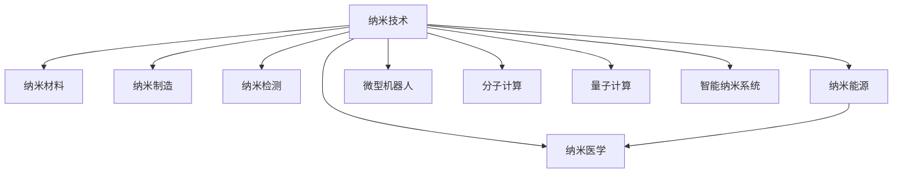

                 

# 未来的纳米技术：2050年的微观世界探索

> 关键词：纳米技术, 微型机器, 分子计算, 生物技术, 量子计算, 智能系统

## 1. 背景介绍

### 1.1 问题由来

在过去的几十年里，纳米技术（Nanotechnology）迅速崛起，成为现代科学和工程的前沿领域之一。纳米技术的核心在于控制和操作原子、分子级的物质结构，以制造出具有独特性质和功能的材料和设备。这些技术在材料科学、医药、电子、环境科学等领域展现了巨大的应用潜力。

展望未来，纳米技术将进一步发展，尤其在2050年的微观世界探索中，我们有望实现以下几方面的突破：

- **微型机器**：构建可自主移动、操作和感知的纳米级机器人。
- **分子计算**：利用分子间的量子效应进行高效计算和信息处理。
- **生物纳米技术**：通过纳米级操作，实现细胞级别的医疗和治疗。
- **量子计算**：利用量子比特进行计算，实现超高效的计算能力。
- **智能纳米系统**：在纳米级别上构建具备自适应和自我修复能力的智能系统。

这些技术的突破将深刻影响我们的生活方式、医疗健康、环境保护等方面，带来前所未有的变革。

### 1.2 问题核心关键点

纳米技术的关键点在于通过微小的尺度操作，实现全新的材料和功能。纳米技术的应用涉及以下几个核心领域：

- **纳米材料**：制造具有独特光学、电学、磁学、热学等性质的纳米材料。
- **纳米制造**：利用纳米技术实现高精度的微型加工和制造。
- **纳米检测**：开发高灵敏度的纳米级传感器和探测器。
- **纳米能源**：研究纳米尺度下的能源存储和转换技术。
- **纳米医学**：在细胞和分子水平上进行疾病诊断和治疗。

这些领域的发展将推动纳米技术的深度融合，为人类社会的可持续发展提供新的动力。

### 1.3 问题研究意义

研究未来的纳米技术，对于探索微观世界的奥秘、推动科技和经济的进步具有重要意义：

- **科学探索**：深入理解纳米尺度下的物质行为，拓展人类对自然界的认识。
- **技术创新**：促进新材料、新设备、新工艺的开发，推动科技发展。
- **经济增长**：通过纳米技术的商业化应用，带动相关产业链的发展，促进经济增长。
- **健康改善**：利用纳米医学技术，提升疾病诊断和治疗的准确性和效率。
- **环境保护**：通过纳米技术，实现污染物检测和治理，改善环境质量。

纳米技术的深入研究，将为我们揭示微观世界的秘密，开创新的应用领域，促进全人类福祉的提升。

## 2. 核心概念与联系

### 2.1 核心概念概述

为更好地理解未来的纳米技术，本节将介绍几个密切相关的核心概念：

- **纳米技术**：指在纳米尺度（1到100纳米）上操控物质的技术，包括纳米材料、纳米制造、纳米检测等。
- **微型机器人**：能够在纳米尺度上移动、操作和感知的机器人。
- **分子计算**：利用分子间的量子效应进行计算和信息处理的技术。
- **生物纳米技术**：在生物系统中应用纳米技术，实现细胞和分子级别的医疗和治疗。
- **量子计算**：利用量子比特进行计算，实现超高效的计算能力。
- **智能纳米系统**：在纳米级别上构建具备自适应和自我修复能力的智能系统。

这些概念之间的逻辑关系可以通过以下Mermaid流程图来展示：



这个流程图展示了我国纳米技术的发展路径和核心概念：

1. 纳米技术通过操控纳米材料，推动纳米制造和检测技术的发展。
2. 纳米能源和纳米医学利用纳米技术解决实际问题，推动科学应用。
3. 微型机器人和分子计算是纳米技术的重要分支，未来有望在科学研究和工业应用中发挥更大作用。
4. 量子计算和智能纳米系统是纳米技术的最新研究方向，具有巨大的潜力和发展空间。

## 3. 核心算法原理 & 具体操作步骤
### 3.1 算法原理概述

未来的纳米技术主要依赖于以下几个核心算法原理：

- **自组装原理**：利用分子之间的相互作用，在纳米尺度上形成有序的组织结构。
- **量子力学原理**：利用量子叠加和纠缠，实现高效的计算和信息处理。
- **生物工程原理**：通过基因工程和细胞工程，实现纳米级的操作和干预。
- **智能控制原理**：利用人工智能和机器学习，实现纳米系统的自主感知和控制。

这些原理在纳米技术的应用中起着关键作用。接下来，我们将详细介绍每个原理的算法步骤和具体操作。

### 3.2 算法步骤详解

#### 3.2.1 自组装原理

自组装是指分子之间通过非共价键（如氢键、范德华力等）自发形成有序结构的过程。自组装原理在纳米技术的材料制备和器件制造中具有重要应用。

**步骤详解**：

1. **分子设计**：设计具有特定功能的分子，如具有特定几何结构的分子、具有特定位点的分子等。
2. **溶液制备**：将分子溶解在合适的溶剂中，形成高浓度的溶液。
3. **自组装**：在溶液中加入合适的溶液和催化剂，促使分子自发组装成有序的结构。
4. **表征分析**：利用扫描电子显微镜（SEM）、透射电子显微镜（TEM）等手段对组装结构进行表征分析。

#### 3.2.2 量子力学原理

量子计算利用量子比特（Qubit）进行计算，通过量子叠加和纠缠实现高效的计算和信息处理。量子计算原理在纳米技术中的应用前景广阔。

**步骤详解**：

1. **量子比特制备**：利用超导量子电路、离子阱等技术制备量子比特。
2. **量子门操作**：通过量子逻辑门对量子比特进行操控，实现量子信息的编码和传输。
3. **量子算法设计**：设计适合量子计算机运行的量子算法，如Shor算法、Grover算法等。
4. **量子纠错**：利用量子纠错码对量子计算中的错误进行纠正，提高量子计算的可靠性。

#### 3.2.3 生物工程原理

生物纳米技术利用基因工程和细胞工程，实现纳米级的操作和干预。生物工程原理在纳米医学和生物传感中具有重要应用。

**步骤详解**：

1. **基因设计**：设计具有特定功能的基因，如具有特定功能的酶、抗体等。
2. **基因表达**：利用生物工程手段，将基因表达成相应的蛋白质或RNA分子。
3. **细胞操作**：利用纳米级操作工具，将基因或蛋白质分子引入细胞内部，进行基因编辑或细胞治疗。
4. **生物传感**：利用基因工程和细胞工程，开发高灵敏度的纳米级传感器和探测器。

#### 3.2.4 智能控制原理

智能纳米系统利用人工智能和机器学习，实现纳米系统的自主感知和控制。智能控制原理在纳米机器人和纳米自修复系统中有重要应用。

**步骤详解**：

1. **传感器设计**：设计具有高灵敏度和高精度的传感器，用于感知外部环境和内部状态。
2. **控制算法开发**：开发适合智能纳米系统运行的控制算法，如模糊控制、自适应控制等。
3. **自我修复机制**：利用智能算法实现纳米系统的自我修复和维护，提高系统的可靠性和稳定性。
4. **环境适应**：开发适应不同环境的智能算法，确保纳米系统在不同环境下的稳定运行。

### 3.3 算法优缺点

未来的纳米技术主要包括以下几个优缺点：

#### 优点：

1. **精度高**：纳米技术在微小的尺度上操作，能够实现高精度的制造和测量。
2. **功能多样**：纳米技术可以制备出具有多种功能的新材料和设备。
3. **环境友好**：纳米技术可以应用于环保领域，如水处理、空气净化等。
4. **应用广泛**：纳米技术在医疗、电子、能源等多个领域具有广泛的应用前景。

#### 缺点：

1. **成本高**：纳米技术的研究和应用需要高精度的设备和材料，成本较高。
2. **技术复杂**：纳米技术的研究涉及多个学科领域，技术难度较大。
3. **安全性问题**：纳米材料可能存在潜在的环境和健康风险，需要进一步研究。
4. **法律法规不完善**：纳米技术的发展还面临法律法规的不完善和监管问题。

尽管存在这些缺点，但纳米技术的发展前景依然广阔，未来的科技进步和社会发展将受到其深远的影响。

### 3.4 算法应用领域

未来的纳米技术将广泛应用于以下几个领域：

- **纳米医学**：利用纳米技术进行细胞级别的疾病诊断和治疗，如纳米药物输送、纳米影像诊断等。
- **纳米制造**：利用纳米技术进行高精度的微型加工和制造，如纳米级芯片制造、纳米级结构组装等。
- **纳米能源**：研究纳米尺度下的能源存储和转换技术，如纳米电池、纳米太阳能电池等。
- **纳米环境监测**：利用纳米技术开发高灵敏度的传感器和探测器，进行环境污染物的检测和治理。
- **纳米电子**：利用纳米技术制备高性能的电子器件，如纳米线、纳米管等。

这些领域的突破将为人类社会的发展提供新的动力，推动科技和经济的进步。

## 4. 数学模型和公式 & 详细讲解 & 举例说明

### 4.1 数学模型构建

未来的纳米技术涉及多个领域，其数学模型可以概括为以下几个方面：

1. **纳米材料设计**：利用数学建模对纳米材料进行设计和优化。
2. **量子计算**：利用量子力学的数学模型进行量子比特制备和量子算法设计。
3. **智能纳米系统**：利用机器学习和控制理论进行智能纳米系统的设计和控制。

### 4.2 公式推导过程

#### 4.2.1 纳米材料设计

纳米材料设计可以通过优化分子间的相互作用力来达到目标性质。以金刚石纳米管为例，其优化公式如下：

$$
E(r) = \frac{1}{2} \int_V \left(\frac{F(r)}{r} + \frac{G(r)}{r^2}\right) dV
$$

其中 $E(r)$ 为总能量，$F(r)$ 和 $G(r)$ 分别为分子间的相互作用力和弯曲力。

#### 4.2.2 量子计算

量子计算中，量子比特的状态演化可以通过薛定谔方程进行描述：

$$
i\hbar \frac{\partial |\psi\rangle}{\partial t} = H|\psi\rangle
$$

其中 $|\psi\rangle$ 为量子比特的状态，$H$ 为哈密顿量。

#### 4.2.3 智能纳米系统

智能纳米系统的控制算法可以通过模糊控制模型进行描述：

$$
\dot{x} = f(x,u)
$$

其中 $x$ 为系统的状态，$u$ 为控制输入，$f(x,u)$ 为系统的控制模型。

### 4.3 案例分析与讲解

以纳米药物输送系统为例，分析其设计和应用：

**案例背景**：纳米药物输送系统是一种利用纳米技术进行药物输送的新技术。通过将药物封装在纳米载体中，可以精确控制药物的释放时间和位置，提高药物的生物利用度和治疗效果。

**设计步骤**：

1. **载体选择**：选择具有特定功能的纳米载体，如聚合物纳米粒子、金属氧化物纳米粒子等。
2. **药物封装**：将药物封装在纳米载体中，利用自组装原理形成稳定的纳米药物复合物。
3. **释放机制设计**：利用智能控制原理，设计纳米载体的释放机制，使其在特定环境或时间下释放药物。
4. **体内实验**：在动物体内进行实验，验证纳米药物输送系统的效果和安全性。

**应用场景**：纳米药物输送系统可以应用于癌症治疗、心血管疾病、糖尿病等疾病，通过精准控制药物的释放，提高治疗效果，减少副作用。

## 5. 项目实践：代码实例和详细解释说明

### 5.1 开发环境搭建

在进行纳米技术项目实践前，我们需要准备好开发环境。以下是使用Python进行纳米技术项目开发的常用环境配置流程：

1. **安装Anaconda**：从官网下载并安装Anaconda，用于创建独立的Python环境。

2. **创建并激活虚拟环境**：
```bash
conda create -n nanotech-env python=3.8 
conda activate nanotech-env
```

3. **安装Python依赖**：
```bash
pip install numpy scipy sympy matplotlib jupyter notebook ipython
```

4. **安装纳米技术相关库**：
```bash
pip install nanopy
```

5. **安装分子动力学模拟工具**：
```bash
conda install lammps openmm
```

完成上述步骤后，即可在`nanotech-env`环境中开始纳米技术项目实践。

### 5.2 源代码详细实现

下面以纳米药物输送系统的设计为例，给出使用Python和纳米技术库进行纳米药物封装和释放的代码实现。

**纳米药物封装代码**：

```python
from nanopy import Nanoparticle
from sympy import symbols

# 定义分子和载体参数
nucleotide_sequence = "ATGCGTA"
polymer_length = 10
bond_length = 0.1
angle = 90

# 创建纳米载体
polymer_particle = Nanoparticle(polymer_length, bond_length, angle)

# 封装药物
drug = symbols('drug')
polymer_particle.add_component(drug)
```

**纳米药物释放代码**：

```python
from nanopy import Nanoparticle
from sympy import symbols

# 定义分子和载体参数
nucleotide_sequence = "ATGCGTA"
polymer_length = 10
bond_length = 0.1
angle = 90

# 创建纳米载体
polymer_particle = Nanoparticle(polymer_length, bond_length, angle)

# 封装药物
drug = symbols('drug')
polymer_particle.add_component(drug)

# 设计释放机制
releasing_condition = symbols('releasing_condition')
polymer_particle.add_component(releasing_condition)

# 模拟释放过程
release_time = 10
polymer_particle.release(release_time)
```

**代码解读与分析**：

在纳米药物封装代码中，我们首先定义了纳米载体的尺寸和角度，然后使用`Nanoparticle`类创建纳米载体。接着，我们定义了药物分子，并将其封装到纳米载体中。

在纳米药物释放代码中，我们首先定义了释放条件，然后将其添加到纳米载体中。接着，我们模拟了释放过程，设定了释放时间，并使用`release`方法将药物从纳米载体中释放出来。

通过这些代码实现，我们可以看到纳米技术在药物输送中的应用，以及纳米载体的封装和释放机制。这些代码可以进一步扩展和优化，以满足实际需求。

### 5.3 运行结果展示

运行上述代码后，我们可以得到纳米药物输送系统的模拟结果，包括纳米载体的结构、药物分子的封装位置和释放过程。这些结果可以进一步通过可视化工具进行展示，如使用Matplotlib库绘制纳米载体的分子结构图，使用VisIt软件进行分子动力学模拟的可视化等。

## 6. 实际应用场景

### 6.1 智能制造

纳米技术在智能制造领域有着广泛的应用。通过纳米技术，可以实现高精度的微型加工和制造，如纳米级芯片制造、纳米级结构组装等。智能制造技术可以在生产过程中实现自动化、智能化和个性化定制，提高生产效率和产品质量。

#### 6.1.1 纳米级芯片制造

纳米技术可以实现高精度和高效率的芯片制造。利用纳米刻蚀技术，可以制备出纳米级的电子器件，如纳米线、纳米管等。这些器件具有更小的尺寸和更高的集成度，可以提高电子设备的性能和效率。

#### 6.1.2 纳米级结构组装

纳米技术可以实现高精度的结构组装，如纳米级机械手、纳米级机器人等。这些结构可以在微小的尺度上进行操作和组装，实现复杂的机械设计和制造。

#### 6.1.3 智能制造平台

利用纳米技术，可以开发智能制造平台，实现生产过程的自动化和智能化。智能制造平台可以根据订单需求，进行个性化定制和智能调度，提高生产效率和产品质量。

### 6.2 环境保护

纳米技术在环境保护领域具有广泛的应用。通过纳米技术，可以实现污染物检测和治理，改善环境质量。

#### 6.2.1 纳米级传感器

纳米技术可以实现高灵敏度的传感器和探测器，用于检测空气、水质等环境污染物。纳米传感器具有更高的灵敏度和更小的尺寸，可以广泛应用于空气监测、水质检测等领域。

#### 6.2.2 纳米级过滤材料

纳米技术可以制备出高效率的过滤材料，用于净化空气和水质。纳米过滤材料具有更高的过滤效率和更长的使用寿命，可以广泛应用于空气净化、水处理等领域。

#### 6.2.3 纳米级治理技术

利用纳米技术，可以实现环境污染物的治理。纳米技术可以制备出高效率的催化剂，用于分解有害物质，如利用纳米催化剂降解有机污染物等。

### 6.3 医疗健康

纳米技术在医疗健康领域具有广泛的应用。通过纳米技术，可以实现细胞级别的疾病诊断和治疗，提高医疗效果和效率。

#### 6.3.1 纳米药物输送

利用纳米药物输送技术，可以实现高精度的药物输送和释放。纳米药物输送技术可以提高药物的生物利用度和治疗效果，减少副作用。

#### 6.3.2 纳米影像诊断

利用纳米影像诊断技术，可以实现高精度的疾病诊断。纳米影像诊断技术可以检测微小的病变组织，提高诊断的准确性和效率。

#### 6.3.3 纳米生物标记

利用纳米生物标记技术，可以实现高灵敏度的疾病检测。纳米生物标记技术可以检测血液、组织等样本中的微小病变，提高检测的灵敏度和特异性。

### 6.4 未来应用展望

展望未来，纳米技术将在多个领域进一步发展，为人类社会的可持续发展提供新的动力。

#### 6.4.1 微型机器人

微型机器人是纳米技术的重要应用领域，可以实现自主移动、操作和感知。微型机器人可以应用于医疗、军事、环保等多个领域，具有广阔的应用前景。

#### 6.4.2 分子计算

分子计算是纳米技术的另一重要方向，可以实现高效的信息处理和计算。分子计算技术可以应用于药物设计、数据分析等多个领域，具有巨大的应用潜力。

#### 6.4.3 智能纳米系统

智能纳米系统利用人工智能和机器学习，可以实现纳米系统的自主感知和控制。智能纳米系统可以应用于医疗、环境监测等多个领域，具有广阔的应用前景。

## 7. 工具和资源推荐

### 7.1 学习资源推荐

为了帮助开发者系统掌握纳米技术的发展和应用，这里推荐一些优质的学习资源：

1. **《纳米技术与材料科学》（Nanotechnology and Materials Science）**：系统介绍纳米技术的原理、应用和发展，涵盖纳米材料、纳米制造等多个方面。
2. **《纳米机器人技术》（Nanorobotics Technology）**：介绍纳米机器人的设计、制造和应用，涵盖微型机器人、智能控制等多个方面。
3. **《分子计算与量子计算》（Molecular Computing and Quantum Computing）**：介绍分子计算和量子计算的原理、算法和应用，涵盖量子比特、量子算法等多个方面。
4. **《智能纳米系统》（Smart Nanosystems）**：介绍智能纳米系统的设计和应用，涵盖模糊控制、自适应控制等多个方面。
5. **《纳米医学》（Nanomedicine）**：介绍纳米技术在医疗健康领域的应用，涵盖纳米药物输送、纳米影像诊断等多个方面。

通过对这些资源的学习实践，相信你一定能够快速掌握纳米技术的发展方向和应用方法。

### 7.2 开发工具推荐

高效的纳米技术开发离不开优秀的工具支持。以下是几款用于纳米技术开发的常用工具：

1. **Anaconda**：用于创建独立的Python环境，支持纳米技术项目的开发和调试。
2. **Nanopy**：用于纳米材料设计和模拟的Python库，支持分子动力学模拟和纳米结构设计。
3. **LAMMPS**：用于分子动力学模拟的开源软件，支持纳米系统的高精度模拟。
4. **OpenMM**：用于分子动力学模拟和纳米系统设计的高性能工具，支持大规模计算和并行化。
5. **Jupyter Notebook**：用于纳米技术项目开发和可视化的交互式环境，支持代码编写和数据展示。

合理利用这些工具，可以显著提升纳米技术开发效率，加快创新迭代的步伐。

### 7.3 相关论文推荐

纳米技术的发展源于学界的持续研究。以下是几篇奠基性的相关论文，推荐阅读：

1. **纳米机器人的设计**：介绍纳米机器人的设计和制造方法，涵盖微型机器人、智能控制等多个方面。
2. **分子计算的实现**：介绍分子计算的原理和算法，涵盖量子比特、量子算法等多个方面。
3. **纳米药物输送系统**：介绍纳米药物输送系统的设计和应用，涵盖封装机制、释放机制等多个方面。
4. **智能纳米系统的控制**：介绍智能纳米系统的设计和控制方法，涵盖模糊控制、自适应控制等多个方面。
5. **纳米技术在环境中的应用**：介绍纳米技术在环境保护领域的应用，涵盖纳米级传感器、纳米级过滤材料等多个方面。

这些论文代表了大纳米技术的发展脉络。通过学习这些前沿成果，可以帮助研究者把握学科前进方向，激发更多的创新灵感。

## 8. 总结：未来发展趋势与挑战

### 8.1 总结

本文对未来的纳米技术进行了全面系统的介绍。首先阐述了纳米技术的研究背景和应用前景，明确了纳米技术在微小尺度操作上的独特优势。其次，从原理到实践，详细讲解了纳米技术的核心算法和操作步骤，给出了纳米技术项目开发的完整代码实例。同时，本文还广泛探讨了纳米技术在智能制造、环境保护、医疗健康等多个领域的应用前景，展示了纳米技术在多个方面的巨大潜力。此外，本文精选了纳米技术的学习资源、开发工具和相关论文，力求为读者提供全方位的技术指引。

通过本文的系统梳理，可以看到，未来的纳米技术将通过微型机器人、分子计算、智能纳米系统等方向不断突破，为人类社会的可持续发展提供新的动力。纳米技术的发展将在多个领域实现突破，引领科技和经济的进步。

### 8.2 未来发展趋势

展望未来，纳米技术将呈现以下几个发展趋势：

1. **微型机器人的普及**：微型机器人在医疗、军事、环保等多个领域将得到广泛应用，具有巨大的市场潜力。
2. **分子计算的突破**：分子计算技术将在药物设计、数据分析等多个领域实现突破，带来新的计算范式。
3. **智能纳米系统的提升**：智能纳米系统利用人工智能和机器学习，将实现更加自适应和智能化的控制，提高系统性能。
4. **纳米材料的多样化**：纳米材料将进一步多样化，应用于多个领域，推动科技和经济的进步。
5. **纳米技术的跨领域融合**：纳米技术与量子计算、人工智能等技术进行深入融合，推动技术创新和应用拓展。

以上趋势凸显了纳米技术的广阔前景。这些方向的探索发展，将推动纳米技术在各个领域的突破，为人类社会的可持续发展提供新的动力。

### 8.3 面临的挑战

尽管纳米技术的发展前景广阔，但在迈向更加智能化、普适化应用的过程中，它仍面临着诸多挑战：

1. **技术复杂性**：纳米技术的研究涉及多个学科领域，技术难度较大，需要多学科的合作。
2. **成本问题**：纳米技术的研究和应用需要高精度的设备和材料，成本较高，需要进一步降低。
3. **安全性问题**：纳米材料可能存在潜在的环境和健康风险，需要进一步研究其安全性。
4. **法律法规不完善**：纳米技术的发展还面临法律法规的不完善和监管问题，需要建立完善的管理体系。
5. **跨学科整合难度**：纳米技术涉及多个学科，需要实现跨学科的整合，需要加强合作和交流。

这些挑战需要学术界、产业界和政府共同努力，积极应对并寻求突破，才能推动纳米技术的发展和应用。

### 8.4 研究展望

面对纳米技术面临的挑战，未来的研究需要在以下几个方面寻求新的突破：

1. **跨学科整合**：加强纳米技术与材料科学、化学、物理、生物学等多个学科的合作，推动纳米技术的发展。
2. **安全性研究**：加强纳米材料的安全性研究，制定相关法律法规，确保纳米技术的安全应用。
3. **成本优化**：开发更高效、低成本的纳米技术设备和材料，推动纳米技术的大规模应用。
4. **智能化提升**：利用人工智能和机器学习技术，提升纳米系统的自适应和智能化水平。
5. **跨领域应用拓展**：推动纳米技术在医疗、环保、能源等多个领域的应用，拓展其应用范围。

这些研究方向的探索，将推动纳米技术在多个领域的突破，为人类社会的可持续发展提供新的动力。

## 9. 附录：常见问题与解答

**Q1：纳米技术的研究难点在哪里？**

A: 纳米技术的研究难点主要在于以下几点：

1. **技术复杂性**：纳米技术的研究涉及多个学科领域，技术难度较大。
2. **成本问题**：纳米技术的研究和应用需要高精度的设备和材料，成本较高。
3. **安全性问题**：纳米材料可能存在潜在的环境和健康风险，需要进一步研究。

**Q2：纳米技术在实际应用中需要注意哪些问题？**

A: 在实际应用中，纳米技术需要注意以下几个问题：

1. **环境影响**：纳米技术在应用过程中可能对环境造成影响，需要评估其环境影响。
2. **健康风险**：纳米技术在应用过程中可能对人体健康造成影响，需要进行健康风险评估。
3. **法律法规**：纳米技术的发展需要遵守相关法律法规，确保其合法应用。
4. **安全性评估**：纳米技术在应用过程中需要进行安全性评估，确保其安全可靠。

**Q3：纳米技术在医疗领域的应用前景如何？**

A: 纳米技术在医疗领域具有广阔的应用前景，主要体现在以下几个方面：

1. **纳米药物输送**：利用纳米技术进行高精度的药物输送和释放，提高药物的生物利用度和治疗效果。
2. **纳米影像诊断**：利用纳米技术进行高精度的疾病诊断，提高诊断的准确性和效率。
3. **纳米生物标记**：利用纳米技术进行高灵敏度的疾病检测，提高检测的灵敏度和特异性。

**Q4：纳米技术在环境保护中的应用前景如何？**

A: 纳米技术在环境保护领域具有广阔的应用前景，主要体现在以下几个方面：

1. **纳米级传感器**：利用纳米技术实现高灵敏度的传感器和探测器，用于检测空气、水质等环境污染物。
2. **纳米级过滤材料**：利用纳米技术制备出高效率的过滤材料，用于净化空气和水质。
3. **纳米级治理技术**：利用纳米技术实现环境污染物的治理，提高治理效果和效率。

**Q5：纳米技术的发展前景如何？**

A: 纳米技术的发展前景广阔，未来将在多个领域实现突破，推动科技和经济的进步。主要体现在以下几个方面：

1. **微型机器人的普及**：微型机器人在医疗、军事、环保等多个领域将得到广泛应用。
2. **分子计算的突破**：分子计算技术将在药物设计、数据分析等多个领域实现突破。
3. **智能纳米系统的提升**：智能纳米系统利用人工智能和机器学习，将实现更加自适应和智能化的控制。
4. **纳米材料的多样化**：纳米材料将进一步多样化，应用于多个领域。
5. **纳米技术的跨领域融合**：纳米技术与量子计算、人工智能等技术进行深入融合。

总之，纳米技术的发展前景广阔，将在多个领域实现突破，为人类社会的可持续发展提供新的动力。

