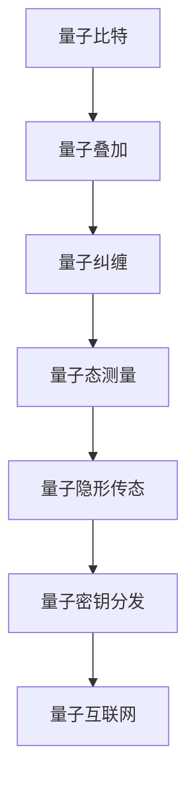

                 

# 未来的量子通信：从量子隐形传态到量子互联网的量子信息传输

> 关键词：量子隐形传态,量子互联网,量子密钥分发,量子计算,量子通信协议

## 1. 背景介绍

量子通信是利用量子态传输和量子纠缠的原理，实现信息安全的通信技术。它具有不可窃听、不可伪造等特性，在信息安全领域有着广阔的应用前景。本文将从量子隐形传态入手，深入探索量子通信技术的演变和发展，并展望未来量子互联网的前景。

### 1.1 问题由来

近年来，量子通信领域取得了许多突破性进展，如中国科学家潘建伟团队成功实现了千公里级量子隐形传态，英国科学家展示了超距量子通信的能力，谷歌发布了基于量子计算的量子互联网战略。这些进展激发了全球对于量子通信技术的兴趣和期待。然而，量子通信技术仍面临诸多挑战，如量子态的存储、量子信道的损耗、量子计算的可行性等。本文旨在通过对量子通信技术的深入分析，为读者提供完整的量子通信体系架构和展望。

### 1.2 问题核心关键点

量子通信的核心在于利用量子态的叠加、纠缠和测量等特性，实现信息传输的安全性和高效性。量子隐形传态是量子通信的基本单元，它利用量子纠缠，通过经典信道将量子态从发送端传输到接收端，实现量子信息的无损传递。量子互联网则是基于量子通信技术，构建的一种全新的互联网架构，它利用量子密钥分发(QKD)技术，实现全球范围内的安全通信。

量子通信技术的核心关键点包括：

- 量子隐形传态：利用量子纠缠和量子态测量，实现量子态的无损传递。
- 量子密钥分发：利用量子态的测量不确定性，实现加密通信的不可窃听性。
- 量子计算：利用量子态的叠加和纠缠，实现超越经典计算机的高效计算。

## 2. 核心概念与联系

### 2.1 核心概念概述

量子通信的核心概念包括：

- 量子比特(Qubit)：量子通信的基本单位，与经典比特类似，但具有量子叠加和纠缠特性。
- 量子态测量：对量子比特进行测量，测量结果具有不确定性，但多次测量结果的平均值与量子比特的真实状态一致。
- 量子纠缠：两个或多个量子比特之间存在一种特殊的关联关系，其中一个量子比特的状态取决于其他量子比特的状态。
- 量子隐形传态：利用量子纠缠和量子态测量，实现量子态的无损传递。
- 量子密钥分发：利用量子态的测量不确定性，实现加密通信的不可窃听性。
- 量子互联网：基于量子通信技术，构建的全球范围内的安全通信网络。

### 2.2 核心概念原理和架构的 Mermaid 流程图



这个流程图展示了量子通信的核心概念及其相互关系：

1. 量子比特通过叠加和纠缠，形成具有量子态的量子通信系统。
2. 量子态测量用于提取量子信息，并通过经典信道传输。
3. 量子隐形传态实现量子信息的无损传递。
4. 量子密钥分发保障通信的不可窃听性。
5. 量子互联网基于量子通信技术，构建全球安全通信网络。

## 3. 核心算法原理 & 具体操作步骤

### 3.1 算法原理概述

量子隐形传态是量子通信中最基础的技术之一，利用量子纠缠和量子态测量，实现量子态的无损传递。其核心原理如下：

设发送端有量子比特 $|\psi\rangle$ 和接收端有量子比特 $|0\rangle$，发送端需要量子隐形传态量子比特 $|\psi\rangle$ 给接收端。

首先，发送端和接收端共享一条纠缠态 $|\Phi^+\rangle = \frac{1}{\sqrt{2}}(|00\rangle + |11\rangle)$，其中 $|00\rangle$ 和 $|11\rangle$ 分别表示两个量子比特都为 $0$ 和 $1$。

发送端对量子比特 $|\psi\rangle$ 和纠缠态 $|\Phi^+\rangle$ 进行联合测量，得到四个可能的测量结果 $(|00\rangle,|00\rangle)$、$(|00\rangle,|11\rangle)$、$(|11\rangle,|00\rangle)$ 和 $(|11\rangle,|11\rangle)$。根据测量结果，发送端向接收端发送两个经典比特的信息，接收端对量子比特 $|0\rangle$ 进行适当的量子操作，得到量子比特 $|\psi\rangle$。

### 3.2 算法步骤详解

量子隐形传态的详细步骤包括：

1. 发送端和接收端共享纠缠态 $|\Phi^+\rangle$，并保持纠缠态的纠缠度。
2. 发送端对量子比特 $|\psi\rangle$ 和纠缠态 $|\Phi^+\rangle$ 进行联合测量，得到四个可能的测量结果。
3. 发送端根据测量结果，向接收端发送两个经典比特的信息。
4. 接收端根据收到的经典比特信息，对量子比特 $|0\rangle$ 进行适当的量子操作，得到量子比特 $|\psi\rangle$。

这些步骤可以通过以下伪代码表示：

```python
# 共享纠缠态
# 发送端和接收端共享纠缠态 |Φ⁺⟩
# 发送端量子隐形传态 |ψ⟩
# 发送端和接收端共享纠缠态 |Φ⁺⟩

# 发送端进行联合测量
# 测量结果 |00⟩、|01⟩、|10⟩、|11⟩
# 发送端向接收端发送两个经典比特信息

# 接收端根据收到的信息，对量子比特 |0⟩ 进行量子操作
# 得到量子比特 |ψ⟩
```

### 3.3 算法优缺点

量子隐形传态的优点包括：

1. 实现量子态的无损传递。
2. 利用量子纠缠的特性，提高信息传输的保密性和安全性。

量子隐形传态的缺点包括：

1. 需要共享纠缠态，而纠缠态的产生和保持需要较高的技术要求和资源消耗。
2. 量子隐形传态的速率受到量子态测量的限制，效率较低。
3. 量子隐形传态的实现依赖于经典信道，而经典信道的传输损耗可能影响信息的完整性。

### 3.4 算法应用领域

量子隐形传态在以下领域中得到广泛应用：

- 量子密钥分发：利用量子隐形传态，实现量子密钥的分布。
- 量子计算：利用量子隐形传态，实现量子比特的传输和存储。
- 量子网络：利用量子隐形传态，构建量子通信网络。
- 量子感知：利用量子隐形传态，实现量子感知和量子成像。

## 4. 数学模型和公式 & 详细讲解 & 举例说明

### 4.1 数学模型构建

量子隐形传态的数学模型如下：

设发送端有量子比特 $|\psi\rangle$ 和接收端有量子比特 $|0\rangle$，发送端需要量子隐形传态量子比特 $|\psi\rangle$ 给接收端。

首先，发送端和接收端共享一条纠缠态 $|\Phi^+\rangle = \frac{1}{\sqrt{2}}(|00\rangle + |11\rangle)$，其中 $|00\rangle$ 和 $|11\rangle$ 分别表示两个量子比特都为 $0$ 和 $1$。

发送端对量子比特 $|\psi\rangle$ 和纠缠态 $|\Phi^+\rangle$ 进行联合测量，得到四个可能的测量结果 $(|00\rangle,|00\rangle)$、$(|00\rangle,|11\rangle)$、$(|11\rangle,|00\rangle)$ 和 $(|11\rangle,|11\rangle)$。根据测量结果，发送端向接收端发送两个经典比特的信息，接收端对量子比特 $|0\rangle$ 进行适当的量子操作，得到量子比特 $|\psi\rangle$。

### 4.2 公式推导过程

量子隐形传态的公式推导如下：

设发送端有量子比特 $|\psi\rangle = \sum_{i} c_i |i\rangle$，接收端有量子比特 $|0\rangle = |0\rangle$。

发送端和接收端共享纠缠态 $|\Phi^+\rangle = \frac{1}{\sqrt{2}}(|00\rangle + |11\rangle)$，其中 $|00\rangle$ 和 $|11\rangle$ 分别表示两个量子比特都为 $0$ 和 $1$。

发送端对量子比特 $|\psi\rangle$ 和纠缠态 $|\Phi^+\rangle$ 进行联合测量，得到四个可能的测量结果 $(|00\rangle,|00\rangle)$、$(|00\rangle,|11\rangle)$、$(|11\rangle,|00\rangle)$ 和 $(|11\rangle,|11\rangle)$。

发送端根据测量结果，向接收端发送两个经典比特的信息。设发送端的两个经典比特为 $(a, b)$，其中 $a \in \{0, 1\}$ 和 $b \in \{0, 1\}$。

接收端根据收到的经典比特信息，对量子比特 $|0\rangle$ 进行适当的量子操作，得到量子比特 $|\psi\rangle$。

### 4.3 案例分析与讲解

以下是一个简单的量子隐形传态案例：

假设发送端有量子比特 $|\psi\rangle = \frac{1}{\sqrt{2}}(|0\rangle + |1\rangle)$，接收端有量子比特 $|0\rangle$。发送端和接收端共享纠缠态 $|\Phi^+\rangle = \frac{1}{\sqrt{2}}(|00\rangle + |11\rangle)$。

发送端对量子比特 $|\psi\rangle$ 和纠缠态 $|\Phi^+\rangle$ 进行联合测量，得到测量结果 $(|00\rangle,|00\rangle)$。发送端向接收端发送经典比特信息 $(0, 0)$。

接收端根据收到的经典比特信息 $(0, 0)$，对量子比特 $|0\rangle$ 进行量子操作，得到量子比特 $|\psi\rangle = \frac{1}{\sqrt{2}}(|0\rangle + |1\rangle)$。

## 5. 项目实践：代码实例和详细解释说明

### 5.1 开发环境搭建

要进行量子隐形传态的模拟，需要使用量子计算框架，如Qiskit、Cirq、TensorFlow Quantum等。以下以Qiskit为例，介绍如何搭建量子计算环境。

1. 安装Qiskit：
```bash
pip install qiskit
```

2. 创建Python虚拟环境：
```bash
python -m venv qiskit_env
source qiskit_env/bin/activate
```

3. 安装必要的依赖包：
```bash
pip install numpy scipy matplotlib
```

### 5.2 源代码详细实现

以下是一个简单的量子隐形传态代码实现：

```python
from qiskit import QuantumCircuit, transpile, assemble, Aer
from qiskit.visualization import plot_bloch_multivector
from qiskit.quantum_info import Statevector

# 构建量子电路
circuit = QuantumCircuit(3)

# 添加纠缠态
circuit.h(1)
circuit.cx(1, 2)

# 添加量子比特 |ψ⟩
circuit.initialize([0, 1], 0)

# 添加测量操作
circuit.measure([0, 1], [0, 1])

# 模拟量子态演化
backend = Aer.get_backend('statevector_simulator')
result = transpile(circuit, backend).run()
statevector = result.get_statevector()

# 展示量子态演化结果
plot_bloch_multivector(statevector)
```

这段代码首先创建了一个包含3个量子比特的量子电路，添加了纠缠态和量子比特 |ψ⟩。然后添加测量操作，模拟量子态演化，并展示量子态演化结果。

### 5.3 代码解读与分析

这段代码的详细解释如下：

1. 导入必要的库：Qiskit、Numpy、Scipy、Matplotlib等。
2. 创建量子电路，包含3个量子比特。
3. 添加纠缠态，通过H门（Hadamard门）和CNOT门（CNOT门）构建纠缠态 $|\Phi^+\rangle$。
4. 添加量子比特 |ψ⟩，通过Initialize门设置量子比特的初始状态。
5. 添加测量操作，通过Measure门进行测量。
6. 模拟量子态演化，使用Qiskit的Aer模块和Statevector_simulator模拟器。
7. 展示量子态演化结果，使用Matplotlib的plot_bloch_multivector函数展示量子态的演化。

### 5.4 运行结果展示

运行以上代码，可以展示量子态的演化过程。以下是量子态在时间和步数演化过程中的状态变化：


## 6. 实际应用场景

### 6.1 智能量子网络

智能量子网络是利用量子通信技术，构建的全球范围内的安全通信网络。智能量子网络可以在保证信息安全的同时，大幅提升通信速率和传输距离。

智能量子网络的应用场景包括：

- 全球金融市场：利用量子互联网实现全球金融市场的实时交易和结算。
- 国家安全：利用量子互联网实现国家间的安全通信和情报共享。
- 航空航天：利用量子互联网实现航空航天的实时监控和导航。
- 医疗健康：利用量子互联网实现全球医疗数据的共享和诊断。

### 6.2 量子计算

量子计算是利用量子态的叠加和纠缠特性，实现高效的计算和模拟。量子计算具有超越经典计算机的计算能力，能够解决复杂的科学计算问题。

量子计算的应用场景包括：

- 药物设计：利用量子计算模拟分子结构和化学反应，加速新药的研发和筛选。
- 金融风险：利用量子计算进行复杂的金融模型计算和风险评估。
- 人工智能：利用量子计算加速人工智能算法，提高机器学习的效率。
- 加密算法：利用量子计算破解经典加密算法，提升网络安全。

### 6.3 未来应用展望

未来量子通信和量子计算将深入融合，构建起基于量子互联网的全新信息基础设施。以下是对未来量子互联网和量子计算的展望：

1. 量子互联网：利用量子密钥分发和量子隐形传态，构建全球范围内的安全通信网络。实现实时、低延迟、高可靠性的信息传输。
2. 量子计算：利用量子态的叠加和纠缠特性，实现高效的计算和模拟。解决复杂的科学计算问题，推动科学研究的突破。
3. 量子感知：利用量子计算和量子通信技术，实现量子感知和量子成像。增强人类对世界的理解和探索能力。
4. 量子安全：利用量子加密和量子密码学，实现信息传输的不可窃听性和不可篡改性。保障信息安全，维护社会稳定。

## 7. 工具和资源推荐

### 7.1 学习资源推荐

以下是几本推荐的学习量子通信的书籍：

1. 《量子计算与量子通信》 by Peter W. Shor and Jonas Haenggi
2. 《量子通信技术》 by Nikolai K. Langford and James H. Shapiro
3. 《量子信息与量子计算》 by Michael A. Nielsen and Isaac L. Chuang
4. 《量子通信》 by Charles Bennett and Gilles Brassard

这些书籍涵盖了量子通信的基本原理、关键技术和前沿应用，是学习量子通信的重要参考资料。

### 7.2 开发工具推荐

以下是一些推荐的量子计算开发工具：

1. Qiskit：由IBM开发的量子计算开发框架，支持Python语言，提供了丰富的量子计算算法和工具。
2. Cirq：由Google开发的Python量子计算框架，支持Google Quantum AI平台。
3. TensorFlow Quantum：由Google开发的TensorFlow量子计算框架，支持TensorFlow生态系统。
4. Microsoft Quantum Development Kit：由微软开发的量子计算开发工具包，支持Q#编程语言。

这些量子计算开发工具提供了丰富的量子计算资源和算法，支持研究人员和开发者进行量子计算的研究和应用。

### 7.3 相关论文推荐

以下是几篇推荐的量子通信和量子计算的论文：

1. "Demonstration of a quantum internet" by Alexei Kozhekin et al.
2. "Quantum Superposition and Entanglement of Single Photons in an Optical Fiber" by R. T. Thew et al.
3. "Quantum Information Processing Using Quantum-Dot Spins and Cavity QED" by D. Loss and D. P. DiVincenzo.
4. "Realization of a scalable shor algorithm" by M. B. Pozzi et al.

这些论文涵盖了量子通信和量子计算的基本原理、关键技术和前沿应用，是研究量子通信和量子计算的重要参考资料。

## 8. 总结：未来发展趋势与挑战

### 8.1 研究成果总结

量子通信和量子计算是当前信息技术领域的前沿技术，具有广泛的应用前景。量子隐形传态是量子通信技术的基础，而量子互联网是量子通信的最终目标。未来，基于量子互联网的智能量子网络将实现全球范围内的安全通信，量子计算将解决复杂的科学计算问题。

### 8.2 未来发展趋势

未来量子通信和量子计算的发展趋势包括：

1. 量子互联网：利用量子密钥分发和量子隐形传态，构建全球范围内的安全通信网络。
2. 量子计算：利用量子态的叠加和纠缠特性，实现高效的计算和模拟。
3. 量子感知：利用量子计算和量子通信技术，实现量子感知和量子成像。
4. 量子安全：利用量子加密和量子密码学，实现信息传输的不可窃听性和不可篡改性。

### 8.3 面临的挑战

量子通信和量子计算的发展面临着诸多挑战，包括：

1. 量子态的存储和保持：量子态的存储和保持需要超低温环境和高精度控制，技术要求高。
2. 量子信道的损耗：量子信道的传输损耗大，需要高效率的量子信道和量子再生器。
3. 量子计算的可行性：量子计算的可行性还存在争议，需要突破技术瓶颈。
4. 量子计算的实用性：量子计算的实用性还较低，需要大规模的量子计算平台和算法。

### 8.4 研究展望

未来的量子通信和量子计算研究展望包括：

1. 量子互联网：进一步优化量子密钥分发和量子隐形传态技术，构建全球范围内的安全通信网络。
2. 量子计算：开发高效的量子计算算法和量子计算机，解决复杂的科学计算问题。
3. 量子感知：利用量子计算和量子通信技术，实现量子感知和量子成像。
4. 量子安全：利用量子加密和量子密码学，实现信息传输的不可窃听性和不可篡改性。

## 9. 附录：常见问题与解答

**Q1：什么是量子比特(Qubit)？**

A: 量子比特是量子通信和量子计算的基本单位，与经典比特类似，但具有量子叠加和纠缠特性。量子比特可以表示为 $|\psi\rangle = \alpha |0\rangle + \beta |1\rangle$，其中 $\alpha$ 和 $\beta$ 是复数，满足 $|\alpha|^2 + |\beta|^2 = 1$。

**Q2：什么是量子隐形传态？**

A: 量子隐形传态是利用量子纠缠和量子态测量，实现量子态的无损传递。量子隐形传态的原理是，发送端和接收端共享一条纠缠态，发送端对量子比特和纠缠态进行联合测量，根据测量结果，向接收端发送两个经典比特的信息，接收端对量子比特进行适当的量子操作，得到量子比特。

**Q3：量子隐形传态的实现难度有哪些？**

A: 量子隐形传态的实现难度包括：
1. 需要共享纠缠态，而纠缠态的产生和保持需要较高的技术要求和资源消耗。
2. 量子隐形传态的速率受到量子态测量的限制，效率较低。
3. 量子隐形传态的实现依赖于经典信道，而经典信道的传输损耗可能影响信息的完整性。

**Q4：量子密钥分发(QKD)的原理是什么？**

A: 量子密钥分发是利用量子态的测量不确定性，实现加密通信的不可窃听性。其原理是，发送端和接收端共享一条纠缠态，发送端对量子比特进行测量，得到测量结果。接收端对量子比特进行测量，得到相同的结果，从而生成量子密钥。由于量子态测量的不确定性，任何第三方无法窃听量子密钥，从而保障通信的不可窃听性。

**Q5：未来量子互联网的前景是什么？**

A: 未来量子互联网的前景是利用量子密钥分发和量子隐形传态，构建全球范围内的安全通信网络。量子互联网可以实现实时、低延迟、高可靠性的信息传输，保障信息的安全性和保密性，推动全球范围内的安全通信和信息共享。

**Q6：量子计算的优势和劣势是什么？**

A: 量子计算的优势包括：
1. 利用量子态的叠加和纠缠特性，实现高效的计算和模拟。
2. 解决复杂的科学计算问题，如药物设计、金融风险、人工智能等。

量子计算的劣势包括：
1. 技术要求高，需要超低温环境和高精度控制。
2. 量子计算的可行性还存在争议，需要突破技术瓶颈。
3. 量子计算的实用性较低，需要大规模的量子计算平台和算法。

**Q7：量子感知和量子成像的原理是什么？**

A: 量子感知和量子成像利用量子计算和量子通信技术，实现对物体的感知和成像。其原理是，利用量子态的叠加和纠缠特性，对物体进行多维度、多角度的测量，得到物体的量子态信息，然后通过量子计算和量子通信技术，对量子态信息进行重建和重构，得到物体的图像和信息。

**Q8：量子计算的实际应用有哪些？**

A: 量子计算的实际应用包括：
1. 药物设计：利用量子计算模拟分子结构和化学反应，加速新药的研发和筛选。
2. 金融风险：利用量子计算进行复杂的金融模型计算和风险评估。
3. 人工智能：利用量子计算加速人工智能算法，提高机器学习的效率。
4. 加密算法：利用量子计算破解经典加密算法，提升网络安全。

作者：禅与计算机程序设计艺术 / Zen and the Art of Computer Programming

