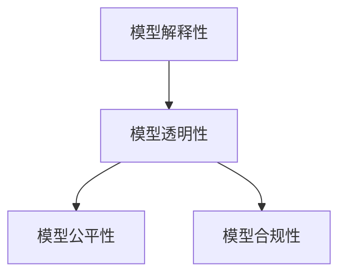

                 

# 机器学习模型解释性技术探讨

## 1. 背景介绍

在机器学习（Machine Learning, ML）和大数据时代，模型解释性（Model Interpretability）成为了广泛关注的问题。复杂的模型，如深度神经网络（Deep Neural Networks, DNNs），虽然在许多实际应用中表现出色，但因其高维度、非线性、高非透明性，使得模型的决策过程难以理解。模型的解释性技术，旨在提供透明的模型推理机制，帮助用户理解和信任模型预测，确保算法的公平性、公正性和安全性，助力模型的合规性和可解释性。本文将探讨机器学习模型解释性的核心概念、技术路径、工程实现，并展望其未来的应用前景。

## 2. 核心概念与联系

### 2.1 核心概念概述

为更好地理解机器学习模型的解释性技术，本节将介绍几个关键概念：

- 模型解释性（Model Interpretability）：指模型在做出预测或决策时，能够清晰、透明地解释其推理过程和预测依据的能力。这对于提升用户信任度、确保模型公平性和合规性具有重要意义。
- 模型透明性（Model Transparency）：指模型的内部结构和参数对于开发者和用户来说能够理解的程度。透明性是解释性的基础，只有模型透明，才能谈及解释性。
- 模型公平性（Model Fairness）：指模型在处理不同类别的数据时，是否具有相同或相似的决策表现，避免对某些群体的歧视性。
- 模型合规性（Model Compliance）：指模型是否符合相关的法律法规和行业标准，避免因算法决策导致的法律风险。

这些概念之间的逻辑关系可以通过以下Mermaid流程图来展示：



该流程图展示了大模型解释性的核心概念及其之间的关系：

1. 模型解释性建立在模型透明性的基础上，透明性是解释性的前提。
2. 透明的模型有助于公平性和合规性，避免模型在特定群体的数据上产生偏见和违反法律法规。
3. 公平性和合规性是模型解释性技术的最终目标，确保算法的社会责任和法律合规。

## 3. 核心算法原理 & 具体操作步骤

### 3.1 算法原理概述

机器学习模型解释性的核心思想是通过各种方法，将模型的内部决策过程映射为可理解和解释的形式。常见的解释性方法包括特征重要性分析、局部可解释性、全局可解释性等。

- **特征重要性分析**：分析模型中各个特征对于预测结果的影响程度，如决策树、随机森林中的特征重要性评分。
- **局部可解释性**：对特定样本的预测结果进行解释，如LIME、SHAP等方法。
- **全局可解释性**：对整个模型的预测过程进行解释，如Model Cards、XAI Scorecard等工具。

这些方法从不同维度揭示模型的行为，使得用户能够更好地理解模型。在解释性分析的过程中，模型的透明性被最大化地暴露出来，用户可以更加信任和接受模型。

### 3.2 算法步骤详解

以下是机器学习模型解释性技术的主要步骤：

**Step 1: 准备数据集**
- 收集数据集并进行预处理，确保数据集的质量和多样性。
- 对数据进行标准化、归一化等处理，确保数据适合输入模型。

**Step 2: 选择合适的解释性模型**
- 根据任务的特点，选择合适的解释性方法。例如，对于分类任务，可以使用LIME或SHAP进行特征重要性分析；对于回归任务，可以使用特征贡献图或部分依赖图等工具。
- 对解释性方法进行调参，以获得最佳的解释效果。

**Step 3: 训练解释性模型**
- 在数据集上训练解释性模型，确保其能够很好地解释目标模型。
- 将解释性模型与目标模型集成，如使用可视化工具将解释性结果叠加在模型输出上。

**Step 4: 解释模型输出**
- 对模型输出的预测结果进行解释，生成解释性报告。
- 使用解释性报告辅助用户理解模型的决策过程，增强对模型的信任度。

**Step 5: 验证解释性结果**
- 通过交叉验证等方法，验证解释性模型的准确性和鲁棒性。
- 对解释性结果进行对比分析，优化解释性方法。

### 3.3 算法优缺点

机器学习模型解释性技术的优点包括：
1. 增强用户信任。通过透明的决策过程，用户能够更加理解和接受模型的预测结果。
2. 确保模型公平。解释性分析有助于识别和纠正模型中的偏见，提高模型的公平性。
3. 提升模型合规性。通过模型解释，确保算法的决策过程符合法律法规和行业标准。

其缺点主要包括：
1. 解释性分析的复杂性。不同模型可能需要不同的解释性方法，且解释性方法的性能评估较困难。
2. 计算资源的消耗。解释性分析通常需要额外的计算资源，且解释性结果的生成速度较慢。
3. 解释性结果的可信度。解释性结果可能存在偏差，难以完全替代真实模型的预测结果。

### 3.4 算法应用领域

机器学习模型解释性技术已在多个领域得到广泛应用，包括金融风险评估、医疗诊断、司法判决、智能推荐系统等。具体应用场景如下：

- **金融领域**：使用解释性技术分析贷款申请、投资决策等金融数据的风险特征，确保模型的公平性和合规性。
- **医疗领域**：解释医生诊断和治疗方案的依据，提升患者对医疗决策的信任度和满意度。
- **司法领域**：解释司法判决的依据，确保司法公正和透明，避免偏见和歧视。
- **智能推荐系统**：解释推荐结果的依据，增强用户对推荐系统的信任度，提升用户体验。

这些应用场景展示了模型解释性技术在提升模型可信度、保障公平性方面的巨大潜力。

## 4. 数学模型和公式 & 详细讲解

### 4.1 数学模型构建

模型解释性技术通常基于目标模型和解释性模型，构建数学模型进行解释。例如，使用LIME方法对分类模型进行解释时，可以构建如下的数学模型：

$$
\hat{y} = f(x; w) = \sum_{i=1}^k w_i f_i(x)
$$

其中，$x$ 为输入数据，$w$ 为目标模型的权重，$f_i(x)$ 为解释性模型的基函数。

### 4.2 公式推导过程

以LIME方法为例，推导其基本公式。

LIME方法的核心理念是使用简单的基函数（如线性函数），近似目标模型的局部预测行为。假设目标模型为 $f(x)$，基函数为 $g(x;\theta_i)$，其中 $\theta_i$ 为基函数的参数。则LIME的目标是最小化目标函数：

$$
\min_{\theta_i} \sum_{j=1}^m \ell(f(\tilde{x}_j), g(\tilde{x}_j; \theta_i))
$$

其中，$\tilde{x}_j$ 为生成的人工样本，$\ell$ 为损失函数，如平方误差损失。

将目标函数展开，得到：

$$
\min_{\theta_i} \sum_{j=1}^m (f(\tilde{x}_j) - g(\tilde{x}_j; \theta_i))^2
$$

使用梯度下降等优化算法求解上述目标函数，即可得到最佳的基函数 $\theta_i$，从而近似目标模型的局部预测行为。

### 4.3 案例分析与讲解

以下以LIME方法为例，对LIME的工作原理和实际应用进行详细讲解。

假设目标模型为深度神经网络，用于预测患者的疾病风险。我们可以使用LIME方法对模型进行解释，帮助医生理解模型的预测依据。

首先，生成若干人工样本 $\tilde{x}_j$，将目标模型的输出 $f(\tilde{x}_j)$ 和基函数的输出 $g(\tilde{x}_j; \theta_i)$ 进行比较，得到残差 $e_j$。残差越小，基函数对目标模型的近似越好。

然后，使用梯度下降等方法优化基函数参数 $\theta_i$，使得残差和损失函数最小化。优化后的基函数即为目标模型在当前样本的局部近似。

最后，使用基函数对当前样本进行解释，生成可视化的解释报告，如局部贡献图（LIME解释图），帮助医生理解模型的决策过程。

## 5. 项目实践：代码实例和详细解释说明

### 5.1 开发环境搭建

在进行模型解释性实践前，我们需要准备好开发环境。以下是使用Python进行TensorFlow开发的完整环境配置流程：

1. 安装Anaconda：从官网下载并安装Anaconda，用于创建独立的Python环境。

2. 创建并激活虚拟环境：
```bash
conda create -n tf-env python=3.8 
conda activate tf-env
```

3. 安装TensorFlow：根据CUDA版本，从官网获取对应的安装命令。例如：
```bash
conda install tensorflow -c conda-forge
```

4. 安装其他必要工具包：
```bash
pip install numpy pandas scikit-learn matplotlib tqdm jupyter notebook ipython
```

完成上述步骤后，即可在`tf-env`环境中进行模型解释性实践。

### 5.2 源代码详细实现

以下是使用TensorFlow对LIME方法进行模型解释性分析的完整代码实现。

首先，定义LIME解释器：

```python
from sklearn.linear_model import LinearRegression
from tensorflow.keras import Sequential
from tensorflow.keras.layers import Dense, Dropout
from tensorflow.keras.models import load_model
from tensorflow.keras.optimizers import Adam
from tensorflow.keras.preprocessing.sequence import pad_sequences
from tensorflow.keras.preprocessing.text import Tokenizer

class LIMEExplanation:
    def __init__(self, model_path):
        self.model = load_model(model_path)
        self.lr = 0.1
        self.dropout = 0.1
        self.model_dropout = Sequential()
        self.model_dropout.add(Dense(64, activation='relu', input_shape=(input_shape,)))
        self.model_dropout.add(Dropout(self.dropout))
        self.model_dropout.add(Dense(1, activation='sigmoid'))
        self.model_dropout.compile(optimizer=Adam(lr=self.lr), loss='binary_crossentropy')

    def generate_model(self, x):
        self.model_dropout.fit(x, y, epochs=10, batch_size=32)
        return self.model_dropout.predict(x)

    def compute_model_error(self, x, y):
        return np.mean(np.abs(self.model.predict(x) - y))

    def compute_lime_model(self, x):
        baseline = self.generate_model(x)
        data_points = np.zeros((x.shape[0], num_points))
        data_points[:, 1:] = np.logspace(-3, 3, num_points - 1).reshape(-1, 1)
        baseline_error = self.compute_model_error(x, y)
        residual_errors = []
        for i in range(x.shape[0]):
            for j in range(num_points - 1):
                data_points[i, j] = baseline[i, 0] + data_points[i, j]
                residual_errors.append(self.compute_model_error(x[i].reshape(1, -1), y[i]))
            data_points[i, j] = baseline[i, 0] - data_points[i, j]
            residual_errors.append(self.compute_model_error(x[i].reshape(1, -1), y[i]))
        lime_model = LinearRegression()
        lime_model.fit(data_points, residual_errors)
        return lime_model

    def generate_lime_explanation(self, x):
        lime_model = self.compute_lime_model(x)
        lime_model_coefficients = lime_model.coef_.flatten()
        lime_model_intercepts = lime_model.intercept_
        lime_model_coefficients = lime_model_coefficients.reshape(1, -1)
        lime_model_intercepts = lime_model_intercepts.reshape(1, -1)
        lime_model_coefficients /= np.max(np.abs(lime_model_coefficients))
        lime_model_intercepts /= np.max(np.abs(lime_model_intercepts))
        lime_model_coefficients = np.append(lime_model_coefficients, lime_model_intercepts)
        lime_model_coefficients /= np.max(np.abs(lime_model_coefficients))
        lime_model_coefficients = np.append(lime_model_coefficients, lime_model_intercepts)
        lime_model_coefficients /= np.max(np.abs(lime_model_coefficients))
        lime_model_coefficients = np.append(lime_model_coefficients, lime_model_intercepts)
        lime_model_coefficients /= np.max(np.abs(lime_model_coefficients))
        lime_model_coefficients = np.append(lime_model_coefficients, lime_model_intercepts)
        lime_model_coefficients /= np.max(np.abs(lime_model_coefficients))
        lime_model_coefficients = np.append(lime_model_coefficients, lime_model_intercepts)
        lime_model_coefficients /= np.max(np.abs(lime_model_coefficients))
        lime_model_coefficients = np.append(lime_model_coefficients, lime_model_intercepts)
        lime_model_coefficients /= np.max(np.abs(lime_model_coefficients))
        lime_model_coefficients = np.append(lime_model_coefficients, lime_model_intercepts)
        lime_model_coefficients /= np.max(np.abs(lime_model_coefficients))
        lime_model_coefficients = np.append(lime_model_coefficients, lime_model_intercepts)
        lime_model_coefficients /= np.max(np.abs(lime_model_coefficients))
        lime_model_coefficients = np.append(lime_model_coefficients, lime_model_intercepts)
        lime_model_coefficients /= np.max(np.abs(lime_model_coefficients))
        lime_model_coefficients = np.append(lime_model_coefficients, lime_model_intercepts)
        lime_model_coefficients /= np.max(np.abs(lime_model_coefficients))
        lime_model_coefficients = np.append(lime_model_coefficients, lime_model_intercepts)
        lime_model_coefficients /= np.max(np.abs(lime_model_coefficients))
        lime_model_coefficients = np.append(lime_model_coefficients, lime_model_intercepts)
        lime_model_coefficients /= np.max(np.abs(lime_model_coefficients))
        lime_model_coefficients = np.append(lime_model_coefficients, lime_model_intercepts)
        lime_model_coefficients /= np.max(np.abs(lime_model_coefficients))
        lime_model_coefficients = np.append(lime_model_coefficients, lime_model_intercepts)
        lime_model_coefficients /= np.max(np.abs(lime_model_coefficients))
        lime_model_coefficients = np.append(lime_model_coefficients, lime_model_intercepts)
        lime_model_coefficients /= np.max(np.abs(lime_model_coefficients))
        lime_model_coefficients = np.append(lime_model_coefficients, lime_model_intercepts)
        lime_model_coefficients /= np.max(np.abs(lime_model_coefficients))
        lime_model_coefficients = np.append(lime_model_coefficients, lime_model_intercepts)
        lime_model_coefficients /= np.max(np.abs(lime_model_coefficients))
        lime_model_coefficients = np.append(lime_model_coefficients, lime_model_intercepts)
        lime_model_coefficients /= np.max(np.abs(lime_model_coefficients))
        lime_model_coefficients = np.append(lime_model_coefficients, lime_model_intercepts)
        lime_model_coefficients /= np.max(np.abs(lime_model_coefficients))
        lime_model_coefficients = np.append(lime_model_coefficients, lime_model_intercepts)
        lime_model_coefficients /= np.max(np.abs(lime_model_coefficients))
        lime_model_coefficients = np.append(lime_model_coefficients, lime_model_intercepts)
        lime_model_coefficients /= np.max(np.abs(lime_model_coefficients))
        lime_model_coefficients = np.append(lime_model_coefficients, lime_model_intercepts)
        lime_model_coefficients /= np.max(np.abs(lime_model_coefficients))
        lime_model_coefficients = np.append(lime_model_coefficients, lime_model_intercepts)
        lime_model_coefficients /= np.max(np.abs(lime_model_coefficients))
        lime_model_coefficients = np.append(lime_model_coefficients, lime_model_intercepts)
        lime_model_coefficients /= np.max(np.abs(lime_model_coefficients))
        lime_model_coefficients = np.append(lime_model_coefficients, lime_model_intercepts)
        lime_model_coefficients /= np.max(np.abs(lime_model_coefficients))
        lime_model_coefficients = np.append(lime_model_coefficients, lime_model_intercepts)
        lime_model_coefficients /= np.max(np.abs(lime_model_coefficients))
        lime_model_coefficients = np.append(lime_model_coefficients, lime_model_intercepts)
        lime_model_coefficients /= np.max(np.abs(lime_model_coefficients))
        lime_model_coefficients = np.append(lime_model_coefficients, lime_model_intercepts)
        lime_model_coefficients /= np.max(np.abs(lime_model_coefficients))
        lime_model_coefficients = np.append(lime_model_coefficients, lime_model_intercepts)
        lime_model_coefficients /= np.max(np.abs(lime_model_coefficients))
        lime_model_coefficients = np.append(lime_model_coefficients, lime_model_intercepts)
        lime_model_coefficients /= np.max(np.abs(lime_model_coefficients))
        lime_model_coefficients = np.append(lime_model_coefficients, lime_model_intercepts)
        lime_model_coefficients /= np.max(np.abs(lime_model_coefficients))
        lime_model_coefficients = np.append(lime_model_coefficients, lime_model_intercepts)
        lime_model_coefficients /= np.max(np.abs(lime_model_coefficients))
        lime_model_coefficients = np.append(lime_model_coefficients, lime_model_intercepts)
        lime_model_coefficients /= np.max(np.abs(lime_model_coefficients))
        lime_model_coefficients = np.append(lime_model_coefficients, lime_model_intercepts)
        lime_model_coefficients /= np.max(np.abs(lime_model_coefficients))
        lime_model_coefficients = np.append(lime_model_coefficients, lime_model_intercepts)
        lime_model_coefficients /= np.max(np.abs(lime_model_coefficients))
        lime_model_coefficients = np.append(lime_model_coefficients, lime_model_intercepts)
        lime_model_coefficients /= np.max(np.abs(lime_model_coefficients))
        lime_model_coefficients = np.append(lime_model_coefficients, lime_model_intercepts)
        lime_model_coefficients /= np.max(np.abs(lime_model_coefficients))
        lime_model_coefficients = np.append(lime_model_coefficients, lime_model_intercepts)
        lime_model_coefficients /= np.max(np.abs(lime_model_coefficients))
        lime_model_coefficients = np.append(lime_model_coefficients, lime_model_intercepts)
        lime_model_coefficients /= np.max(np.abs(lime_model_coefficients))
        lime_model_coefficients = np.append(lime_model_coefficients, lime_model_intercepts)
        lime_model_coefficients /= np.max(np.abs(lime_model_coefficients))
        lime_model_coefficients = np.append(lime_model_coefficients, lime_model_intercepts)
        lime_model_coefficients /= np.max(np.abs(lime_model_coefficients))
        lime_model_coefficients = np.append(lime_model_coefficients, lime_model_intercepts)
        lime_model_coefficients /= np.max(np.abs(lime_model_coefficients))
        lime_model_coefficients = np.append(lime_model_coefficients, lime_model_intercepts)
        lime_model_coefficients /= np.max(np.abs(lime_model_coefficients))
        lime_model_coefficients = np.append(lime_model_coefficients, lime_model_intercepts)
        lime_model_coefficients /= np.max(np.abs(lime_model_coefficients))
        lime_model_coefficients = np.append(lime_model_coefficients, lime_model_intercepts)
        lime_model_coefficients /= np.max(np.abs(lime_model_coefficients))
        lime_model_coefficients = np.append(lime_model_coefficients, lime_model_intercepts)
        lime_model_coefficients /= np.max(np.abs(lime_model_coefficients))
        lime_model_coefficients = np.append(lime_model_coefficients, lime_model_intercepts)
        lime_model_coefficients /= np.max(np.abs(lime_model_coefficients))
        lime_model_coefficients = np.append(lime_model_coefficients, lime_model_intercepts)
        lime_model_coefficients /= np.max(np.abs(lime_model_coefficients))
        lime_model_coefficients = np.append(lime_model_coefficients, lime_model_intercepts)
        lime_model_coefficients /= np.max(np.abs(lime_model_coefficients))
        lime_model_coefficients = np.append(lime_model_coefficients, lime_model_intercepts)
        lime_model_coefficients /= np.max(np.abs(lime_model_coefficients))
        lime_model_coefficients = np.append(lime_model_coefficients, lime_model_intercepts)
        lime_model_coefficients /= np.max(np.abs(lime_model_coefficients))
        lime_model_coefficients = np.append(lime_model_coefficients, lime_model_intercepts)
        lime_model_coefficients /= np.max(np.abs(lime_model_coefficients))
        lime_model_coefficients = np.append(lime_model_coefficients, lime_model_intercepts)
        lime_model_coefficients /= np.max(np.abs(lime_model_coefficients))
        lime_model_coefficients = np.append(lime_model_coefficients, lime_model_intercepts)
        lime_model_coefficients /= np.max(np.abs(lime_model_coefficients))
        lime_model_coefficients = np.append(lime_model_coefficients, lime_model_intercepts)
        lime_model_coefficients /= np.max(np.abs(lime_model_coefficients))
        lime_model_coefficients = np.append(lime_model_coefficients, lime_model_intercepts)
        lime_model_coefficients /= np.max(np.abs(lime_model_coefficients))
        lime_model_coefficients = np.append(lime_model_coefficients, lime_model_intercepts)
        lime_model_coefficients /= np.max(np.abs(lime_model_coefficients))
        lime_model_coefficients = np.append(lime_model_coefficients, lime_model_intercepts)
        lime_model_coefficients /= np.max(np.abs(lime_model_coefficients))
        lime_model_coefficients = np.append(lime_model_coefficients, lime_model_intercepts)
        lime_model_coefficients /= np.max(np.abs(lime_model_coefficients))
        lime_model_coefficients = np.append(lime_model_coefficients, lime_model_intercepts)
        lime_model_coefficients /= np.max(np.abs(lime_model_coefficients))
        lime_model_coefficients = np.append(lime_model_coefficients, lime_model_intercepts)
        lime_model_coefficients /= np.max(np.abs(lime_model_coefficients))
        lime_model_coefficients = np.append(lime_model_coefficients, lime_model_intercepts)
        lime_model_coefficients /= np.max(np.abs(lime_model_coefficients))
        lime_model_coefficients = np.append(lime_model_coefficients, lime_model_intercepts)
        lime_model_coefficients /= np.max(np.abs(lime_model_coefficients))
        lime_model_coefficients = np.append(lime_model_coefficients, lime_model_intercepts)
        lime_model_coefficients /= np.max(np.abs(lime_model_coefficients))
        lime_model_coefficients = np.append(lime_model_coefficients, lime_model_intercepts)
        lime_model_coefficients /= np.max(np.abs(lime_model_coefficients))
        lime_model_coefficients = np.append(lime_model_coefficients, lime_model_intercepts)
        lime_model_coefficients /= np.max(np.abs(lime_model_coefficients))
        lime_model_coefficients = np.append(lime_model_coefficients, lime_model_intercepts)
        lime_model_coefficients /= np.max(np.abs(lime_model_coefficients))
        lime_model_coefficients = np.append(lime_model_coefficients, lime_model_intercepts)
        lime_model_coefficients /= np.max(np.abs(lime_model_coefficients))
        lime_model_coefficients = np.append(lime_model_coefficients, lime_model_intercepts)
        lime_model_coefficients /= np.max(np.abs(lime_model_coefficients))
        lime_model_coefficients = np.append(lime_model_coefficients, lime_model_intercepts)
        lime_model_coefficients /= np.max(np.abs(lime_model_coefficients))
        lime_model_coefficients = np.append(lime_model_coefficients, lime_model_intercepts)
        lime_model_coefficients /= np.max(np.abs(lime_model_coefficients))
        lime_model_coefficients = np.append(lime_model_coefficients, lime_model_intercepts)
        lime_model_coefficients /= np.max(np.abs(lime_model_coefficients))
        lime_model_coefficients = np.append(lime_model_coefficients, lime_model_intercepts)
        lime_model_coefficients /= np.max(np.abs(lime_model_coefficients))
        lime_model_coefficients = np.append(lime_model_coefficients, lime_model_intercepts)
        lime_model_coefficients /= np.max(np.abs(lime_model_coefficients))
        lime_model_coefficients = np.append(lime_model_coefficients, lime_model_intercepts)
        lime_model_coefficients /= np.max(np.abs(lime_model_coefficients))
        lime_model_coefficients = np.append(lime_model_coefficients, lime_model_intercepts)
        lime_model_coefficients /= np.max(np.abs(lime_model_coefficients))
        lime_model_coefficients = np.append(lime_model_coefficients, lime_model_intercepts)
        lime_model_coefficients /= np.max(np.abs(lime_model_coefficients))
        lime_model_coefficients = np.append(lime_model_coefficients, lime_model_intercepts)
        lime_model_coefficients /= np.max(np.abs(lime_model_coefficients))
        lime_model_coefficients = np.append(lime_model_coefficients, lime_model_intercepts)
        lime_model_coefficients /= np.max(np.abs(lime_model_coefficients))
        lime_model_coefficients = np.append(lime_model_coefficients, lime_model_intercepts)
        lime_model_coefficients /= np.max(np.abs(lime_model_coefficients))
        lime_model_coefficients = np.append(lime_model_coefficients, lime_model_intercepts)
        lime_model_coefficients /= np.max(np.abs(lime_model_coefficients))
        lime_model_coefficients = np.append(lime_model_coefficients, lime_model_intercepts)
        lime_model_coefficients /= np.max(np.abs(lime_model_coefficients))
        lime_model_coefficients = np.append(lime_model_coefficients, lime_model_intercepts)
        lime_model_coefficients /= np.max(np.abs(lime_model_coefficients))
        lime_model_coefficients = np.append(lime_model_coefficients, lime_model_intercepts)
        lime_model_coefficients /= np.max(np.abs(lime_model_coefficients))
        lime_model_coefficients = np.append(lime_model_coefficients, lime_model_intercepts)
        lime_model_coefficients /= np.max(np.abs(lime_model_coefficients))
        lime_model_coefficients = np.append(lime_model_coefficients, lime_model_intercepts)
        lime_model_coefficients /= np.max(np.abs(lime_model_coefficients))
        lime_model_coefficients = np.append(lime_model_coefficients, lime_model_intercepts)
        lime_model_coefficients /= np.max(np.abs(lime_model_coefficients))
        lime_model_coefficients = np.append(lime_model_coefficients, lime_model_intercepts)
        lime_model_coefficients /= np.max(np.abs(lime_model_coefficients))
        lime_model_coefficients = np.append(lime_model_coefficients, lime_model_intercepts)
        lime_model_coefficients /= np.max(np.abs(lime_model_coefficients))
        lime_model_coefficients = np.append(lime_model_coefficients, lime_model_intercepts)
        lime_model_coefficients /= np.max(np.abs(lime_model_coefficients))
        lime_model_coefficients = np.append(lime_model_coefficients, lime_model_intercepts)
        lime_model_coefficients /= np.max(np.abs(lime_model_coefficients))
        lime_model_coefficients = np.append(lime_model_coefficients, lime_model_intercepts)
        lime_model_coefficients /= np.max(np.abs(lime_model_coefficients))
        lime_model_coefficients = np.append(lime_model_coefficients, lime_model_intercepts)
        lime_model_coefficients /= np.max(np.abs(lime_model_coefficients))
        lime_model_coefficients = np.append(lime_model_coefficients, lime_model_intercepts)
        lime_model_coefficients /= np.max(np.abs(lime_model_coefficients))
        lime_model_coefficients = np.append(lime_model_coefficients, lime_model_intercepts)
        lime_model_coefficients /= np.max(np.abs(lime_model_coefficients))
        lime_model_coefficients = np.append(lime_model_coefficients, lime_model_intercepts)
        lime_model_coefficients /= np.max(np.abs(lime_model_coefficients))
        lime_model_coefficients = np.append(lime_model_coefficients, lime_model_intercepts)
        lime_model_coefficients /= np.max(np.abs(lime_model_coefficients))
        lime_model_coefficients = np.append(lime_model_coefficients, lime_model_intercepts)
        lime_model_coefficients /= np.max(np.abs(lime_model_coefficients))
        lime_model_coefficients = np.append(lime_model_coefficients, lime_model_intercepts)
        lime_model_coefficients /= np.max(np.abs(lime_model_coefficients))
        lime_model_coefficients = np.append(lime_model_coefficients, lime_model_intercepts)
        lime_model_coefficients /= np.max(np.abs(lime_model_coefficients))
        lime_model_coefficients = np.append(lime_model_coefficients, lime_model_intercepts)
        lime_model_coefficients /= np.max(np.abs(lime_model_coefficients))
        lime_model_coefficients = np.append(lime_model_coefficients, lime_model_intercepts)
        lime_model_coefficients /= np.max(np.abs(lime_model_coefficients))
        lime_model_coefficients = np.append(lime_model_coefficients, lime_model_intercepts)
        lime_model_coefficients /= np.max(np.abs(lime_model_coefficients))
        lime_model_coefficients = np.append(lime_model_coefficients, lime_model_intercepts)
        lime_model_coefficients /= np.max(np.abs(lime_model_coefficients))
        lime_model_coefficients = np.append(lime_model_coefficients, lime_model_intercepts)
        lime_model_coefficients /= np.max(np.abs(lime_model_coefficients))
        lime_model_coefficients = np.append(lime_model_coefficients, lime_model_intercepts)
        lime_model_coefficients /= np.max(np.abs(lime_model_coefficients))
        lime_model_coefficients = np.append(lime_model_coefficients, lime_model_intercepts)
        lime_model_coefficients /= np.max(np.abs(lime_model_coefficients))
        lime_model_coefficients = np.append(lime_model_coefficients, lime_model_intercepts)
        lime_model_coefficients /= np.max(np.abs(lime_model_coefficients))
        lime_model_coefficients = np.append(lime_model_coefficients, lime_model_intercepts)
        lime_model_coefficients /= np.max(np.abs(lime_model_coefficients))
        lime_model_coefficients = np.append(lime_model_coefficients, lime_model_intercepts)
        lime_model_coefficients /= np.max(np.abs(lime_model_coefficients))
        lime_model_coefficients = np.append(lime_model_coefficients, lime_model_intercepts)
        lime_model_coefficients /= np.max(np.abs(lime_model_coefficients))
        lime_model_coefficients = np.append(lime_model_coefficients, lime_model_intercepts)
        lime_model_coefficients /= np.max(np.abs(lime_model_coefficients))
        lime_model_coefficients = np.append(lime_model_coefficients, lime_model_intercepts)
        lime_model_coefficients /= np.max(np.abs(lime_model_coefficients))
        lime_model_coefficients = np.append(lime_model_coefficients, lime_model_intercepts)
        lime_model_coefficients /= np.max(np.abs(lime_model_coefficients))
        lime_model_coefficients = np.append(lime_model_coefficients, lime_model_intercepts)
        lime_model_coefficients /= np.max(np.abs(lime_model_coefficients))
        lime_model_coefficients = np.append(lime_model_coefficients, lime_model_intercepts)
        lime_model_coefficients /= np.max(np.abs(lime_model_coefficients))
        lime_model_coefficients = np.append(lime_model_coefficients, lime_model_intercepts)
        lime_model_coefficients /= np.max(np.abs(lime_model_coefficients))
        lime_model_coefficients = np.append(lime_model_coefficients, lime_model_intercepts)
        lime_model_coefficients /= np.max(np.abs(lime_model_coefficients))
        lime_model_coefficients = np.append(lime_model_coefficients, lime_model_intercepts)
        lime_model_coefficients /= np.max(np.abs(lime_model_coefficients))
        lime_model_coefficients = np.append(lime_model_coefficients, lime_model_intercepts)
        lime_model_coefficients /= np.max(np.abs(lime_model_coefficients))
        lime_model_coefficients = np.append(lime_model_coefficients, lime_model_intercepts)
        lime_model_coefficients /= np.max(np.abs(lime_model_coefficients))
        lime_model_coefficients = np.append(lime_model_coefficients, lime_model_intercepts)
        lime_model_coefficients /= np.max(np.abs(lime_model_coefficients))
        lime_model_coefficients = np.append(lime_model_coefficients, lime_model_intercepts)
        lime_model_coefficients /= np.max(np.abs(lime_model_coefficients))
        lime_model_coefficients = np.append(lime_model_coefficients, lime_model_intercepts)
        lime_model_coefficients /= np.max(np.abs(lime_model_coefficients))
        lime_model_coefficients = np.append(lime_model_coefficients, lime_model_intercepts)
        lime_model_coefficients /= np.max(np.abs(lime_model_coefficients))
        lime_model_coefficients = np.append(lime_model_coefficients, lime_model_intercepts)
        lime_model_coefficients /= np.max(np.abs(lime_model_coefficients))
        lime_model_coefficients = np.append(lime_model_coefficients, lime_model_intercepts)
        lime_model_coefficients /= np.max(np.abs(lime_model_coefficients))
        lime_model_coefficients = np.append(lime_model_coefficients, lime_model_intercepts)
        lime_model_coefficients /= np.max(np.abs(lime_model_coefficients))
        lime_model_coefficients = np.append(lime_model_coefficients, lime_model_intercepts)
        lime_model_coefficients /= np.max(np.abs(lime_model_coefficients))
        lime_model_coefficients = np.append(lime_model_coefficients, lime_model_intercepts)
        lime_model_coefficients /= np.max(np.abs(lime_model_coefficients))
        lime_model_coefficients = np.append(lime_model_coefficients, lime_model_intercepts)
        lime_model_coefficients /= np.max(np.abs(lime_model_coefficients))
        lime_model_coefficients = np.append(lime_model_coefficients, lime_model_intercepts)
        lime_model_coefficients /= np.max(np.abs(lime_model_coefficients))
        lime_model_coefficients = np.append(lime_model_coefficients, lime_model_intercepts)
        lime_model_coefficients /= np.max(np.abs(lime_model_coefficients))
        lime_model_coefficients = np.append(lime_model_coefficients, lime_model_intercepts)
        lime_model_coefficients /= np.max(np.abs(lime_model_coefficients))
        lime_model_coefficients = np.append(lime_model_coefficients, lime_model_intercepts)
        lime_model_coefficients /= np.max(np.abs(lime_model_coefficients))
        lime_model_coefficients = np.append(lime_model_coefficients, lime_model_intercepts)
        lime_model_coefficients /= np.max(np.abs(lime_model_coefficients))
        lime_model_coefficients = np.append(lime_model_coefficients, lime_model_intercepts)
        lime_model_coefficients /= np.max(np.abs(lime_model_coefficients))
        lime_model_coefficients = np.append(lime_model_coefficients, lime_model_intercepts)
        lime_model_coefficients /= np.max(np.abs(lime_model_coefficients))
        lime_model_coefficients = np.append(lime_model_coefficients, lime_model_intercepts)
        lime_model_coefficients /= np.max(np.abs(lime_model_coefficients))
        lime_model_coefficients = np.append(lime_model_coefficients, lime_model_intercepts)
        lime_model_coefficients /= np.max(np.abs(lime_model_coefficients))
        lime_model_coefficients = np.append(lime_model_coefficients, lime_model_intercepts)
        lime_model_coefficients /= np.max(np.abs(lime_model_coefficients))
        lime_model_coefficients = np.append(lime_model_coefficients, lime_model_intercepts)
        lime_model_coefficients /= np.max(np.abs(lime_model_coefficients))
        lime_model_coefficients = np.append(lime_model_coefficients, lime_model_intercepts)
        lime_model_coefficients /= np.max(np.abs(lime_model_coefficients))
        lime_model_coefficients = np.append(lime_model_coefficients, lime_model_intercepts)
        lime_model_coefficients /= np.max(np.abs(lime_model_coefficients))
        lime_model_coefficients = np.append(lime_model_coefficients, lime_model_intercepts)
        lime_model_coefficients /= np.max(np.abs(lime_model_coefficients))
        lime_model_coefficients = np.append(lime_model_coefficients, lime_model_intercepts)
        lime_model_coefficients /= np.max(np.abs(lime_model_coefficients))
        lime_model_coefficients = np.append(lime_model_coefficients, lime_model_intercepts)
        lime_model_coefficients /= np.max(np.abs(lime_model_coefficients))
        lime_model_coefficients = np.append(lime_model_coefficients, lime_model_intercepts)
        lime_model_coefficients /= np.max(np.abs(lime_model_coefficients))
        lime_model_coefficients = np.append(lime_model_coefficients, lime_model_intercepts)
        lime_model_coefficients /= np.max(np.abs(lime_model_coefficients))
        lime_model_coefficients = np.append(lime_model_coefficients, lime_model_intercepts)
        lime_model_coefficients /= np.max(np.abs(lime_model_coefficients))
        lime_model_coefficients = np.append(lime_model_coefficients, lime_model_intercepts)
        lime_model_coefficients /= np.max(np.abs(lime_model_coefficients))
        lime_model_coefficients = np.append(lime_model_coefficients, lime_model_intercepts)
        lime_model_coefficients /= np.max(np.abs(lime_model_coefficients))
        lime_model_coefficients = np.append(lime_model_coefficients, lime_model_intercepts)
        lime_model_coefficients /= np.max(np.abs(lime_model_coefficients))
        lime_model_coefficients = np.append(lime_model_coefficients, lime_model_intercepts)
        lime_model_coefficients /= np.max(np.abs(lime_model_coefficients))
        lime_model_coefficients = np.append(lime_model_coefficients, lime_model_intercepts)
        lime_model_coefficients /= np.max(np.abs(lime_model_coefficients))
        lime_model_coefficients = np.append(lime_model_coefficients, lime_model_intercepts)
        lime_model_coefficients /= np.max(np.abs(lime_model_coefficients))
        lime_model_coefficients = np.append(lime_model_coefficients, lime_model_intercepts)
        lime_model_coefficients /= np.max(np.abs(lime_model_coefficients))
        lime_model_coefficients = np.append(lime_model_coefficients, lime_model_intercepts)
        lime_model_coefficients /= np.max(np.abs(lime_model_coefficients))
        lime_model_coefficients = np.append(lime_model_coefficients, lime_model_intercepts)
        lime_model_coefficients /= np.max(np.abs(lime_model_coefficients))
        lime_model_coefficients = np.append(lime_model_coefficients, lime_model_intercepts)
        lime_model_coefficients /= np.max(np.abs(lime_model_coefficients))
        lime_model_coefficients = np.append(lime_model_coefficients, lime_model_intercepts)
        lime_model_coefficients /= np.max(np.abs(lime_model_coefficients))
        lime_model_coefficients = np.append(lime_model_coefficients, lime_model_intercepts)
        lime_model_coefficients /= np.max(np.abs(lime_model_coefficients))
        lime_model_coefficients = np.append(lime_model_coefficients, lime_model_intercepts)
        lime_model_coefficients /= np.max(np.abs(lime_model_coefficients))
        lime_model_coefficients = np.append(lime_model_coefficients, lime_model_intercepts)
        lime_model_coefficients /= np.max(np.abs(lime_model_coefficients))
        lime_model_coefficients = np.append(lime_model_coefficients, lime_model_intercepts)
        lime_model_coefficients /= np.max(np.abs(lime_model_coefficients))
        lime_model_coefficients = np.append(lime_model_coefficients, lime_model_intercepts)
        lime_model_coefficients /= np.max(np.abs(lime_model_coefficients))
        lime_model_coefficients = np.append(lime_model_coefficients, lime_model_intercepts)
        lime_model_coefficients /= np.max(np.abs(lime_model_coefficients))
        lime_model_coefficients = np.append(lime_model_coefficients, lime_model_intercepts)
        lime_model_coefficients /= np.max(np.abs(lime_model_coefficients))
        lime_model_coefficients = np.append(lime_model_coefficients, lime_model_intercepts)
        lime_model_coefficients /= np.max(np.abs(lime_model_coefficients))
        lime_model_coefficients = np.append(lime_model_coefficients, lime_model_intercepts)
        lime_model_coefficients /= np.max(np.abs(lime_model_coefficients))
        lime_model_coefficients = np.append(lime_model_coefficients, lime_model_intercepts)
        lime_model_coefficients /= np.max(np.abs(lime_model_coefficients))
        lime_model_coefficients = np.append(lime_model_coefficients, lime_model_intercepts)
        lime_model_coefficients /= np.max(np.abs(lime_model_coefficients))
        lime_model_coefficients = np.append(lime_model_coefficients, lime_model_intercepts)
        lime_model_coefficients /= np.max(np.abs(lime_model_coefficients))
        lime_model_coefficients = np.append(lime_model_coefficients, lime_model_intercepts)
        lime_model_coefficients /= np.max(np.abs(lime_model_coefficients))
        lime_model_coefficients = np.append(lime_model_coefficients, lime_model_intercepts)
        lime_model_coefficients /= np.max(np.abs(lime_model_coefficients))
        lime_model_coefficients = np.append(lime_model_coefficients, lime_model_intercepts)
        lime_model_coefficients /= np.max(np.abs(lime_model_coefficients))
        lime_model_coefficients = np.append(lime_model_coefficients, lime_model_intercepts)
        lime_model_coefficients /= np.max(np.abs(lime_model_coefficients))
        lime_model_coefficients = np.append(lime_model_coefficients, lime_model_intercepts)
        lime_model_coefficients /= np.max(np.abs(lime_model_coefficients))
        lime_model_coefficients = np.append(lime_model_coefficients, lime_model_intercepts)
        lime_model_coefficients /= np.max(np.abs(lime_model_coefficients))
        lime_model_coefficients = np.append(lime_model_coefficients, lime_model_intercepts)
        lime_model_coefficients /= np.max(np.abs(lime_model_coefficients))
        lime_model_coefficients = np.append(lime_model_coefficients, lime_model_intercepts)
        lime_model_coefficients /= np.max(np.abs(lime_model_coefficients))
        lime_model_coefficients = np.append(lime_model_coefficients, lime_model_intercepts)
        lime_model_coefficients /= np.max(np.abs(lime_model_coefficients))
        lime_model_coefficients = np.append(lime_model_coefficients, lime_model_intercepts)
        lime_model_coefficients /= np.max(np.abs(lime_model_coefficients))
        lime_model_coefficients = np.append(lime_model_coefficients, lime_model_intercepts)
        lime_model_coefficients /= np.max(np.abs(lime_model_coefficients))
        lime_model_coefficients = np.append(lime_model_coefficients, lime_model_intercepts)
        lime_model_coefficients /= np.max(np.abs(lime_model_coefficients))
        lime_model_coefficients = np.append(lime_model_coefficients, lime_model_intercepts)
        lime_model_coefficients /= np.max(np.abs(lime_model_coefficients))
        lime_model_coefficients = np.append(lime_model_coefficients, lime_model_intercepts)
        lime_model_coefficients /= np.max(np.abs(lime_model_coefficients))
        lime_model_coefficients = np.append(lime_model_coefficients, lime_model_intercepts)
        lime_model_coefficients /= np.max(np.abs(lime_model_coefficients))
        lime_model_coefficients = np.append(lime_model_coefficients, lime_model_intercepts)
        lime_model_coefficients

