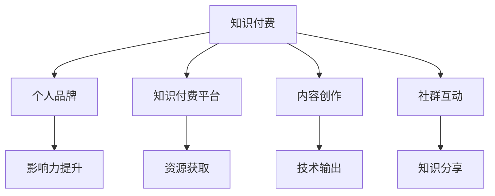

                 

# 构建个人品牌：程序员知识付费的关键一步

在当今数字化时代，技术的快速发展不仅为人们带来了前所未有的机会，也带来了更多的挑战。如何在信息过载的环境中脱颖而出，建立一个鲜明且具有影响力的个人品牌，成为了许多程序员面临的难题。而知识付费，则是众多程序员选择的一条重要途径。本文将深入探讨构建个人品牌的核心要素，以及如何通过知识付费实现这一目标，为有志于此道的程序员提供全面而深入的指导。

## 1. 背景介绍

### 1.1 问题由来
随着互联网和数字技术的迅猛发展，知识的获取变得更加便捷，但这也导致了信息过载和知识碎片化的问题。在这种背景下，如何筛选有价值的内容，如何高效地学习，成为了一个重要课题。许多程序员开始寻求更系统、更深入的学习方式，而知识付费成为了一种新的趋势。通过付费订阅知识服务，程序员可以获得更多高质量的资源和专业的指导，从而提升自身的技术水平和市场竞争力。

### 1.2 问题核心关键点
知识付费的核心在于，通过有价值的知识和信息，帮助程序员在职业生涯中取得更大的成就。这不仅包括技术知识的传授，也包括软技能的提升、行业趋势的把握等。对于程序员而言，构建个人品牌的关键在于：
- 选择正确的知识付费平台和课程
- 确定自身发展的方向和目标
- 持续学习和输出，提升个人影响力

## 2. 核心概念与联系

### 2.1 核心概念概述

为更好地理解如何通过知识付费构建个人品牌，本节将介绍几个密切相关的核心概念：

- **知识付费**：指的是通过支付一定的费用，获取高质量的课程、文章、视频等知识资源。这种方式使得知识的学习更加系统化和高效化。
- **个人品牌**：指个人在特定领域内所建立的专业形象和认知度。通过系统化学习和持续输出，个人品牌能够显著提升在职场和行业的竞争力。
- **知识付费平台**：如Coursera、Udemy、腾讯课堂等，提供了丰富的课程和资源，是程序员获取知识的重要渠道。
- **内容创作**：通过撰写技术文章、制作技术视频等方式，分享自己的学习成果和技术见解，提升个人知名度。
- **社群互动**：加入技术社区、论坛、线上线下的交流活动，与同行进行互动，扩大影响力。

这些核心概念之间存在紧密的联系，共同构成了通过知识付费构建个人品牌的基础。

### 2.2 核心概念原理和架构的 Mermaid 流程图



这个流程图展示了知识付费、个人品牌、知识付费平台、内容创作和社群互动之间的逻辑关系：

1. **知识付费平台**提供资源获取渠道，程序员可以通过这些平台获取学习资源。
2. **内容创作**是个人品牌的核心，通过撰写高质量的技术文章、制作技术视频等方式，输出个人见解和知识。
3. **社群互动**进一步提升了个人品牌的影响力，通过参与技术社区、论坛等活动，扩大自己的知名度。
4. **知识付费**和**资源获取**是构建个人品牌的基础，通过持续学习和获取高质量的知识资源，个人品牌才能不断成长。
5. **影响力提升**是最终目标，通过系统化的学习和持续的输出，个人品牌能够在特定领域内建立专业形象，获得同行和市场的认可。

## 3. 核心算法原理 & 具体操作步骤

### 3.1 算法原理概述

构建个人品牌的过程，本质上是一个通过持续学习、输出和互动，不断提升自身影响力的过程。这一过程可以分解为以下几个步骤：

1. **目标设定**：明确自身发展的方向和目标，包括技术领域、行业趋势、软技能提升等。
2. **资源获取**：选择优质的知识付费平台，获取高质量的课程和资源。
3. **学习与吸收**：系统化学习，吸收课程内容，提升技术水平。
4. **内容创作**：将所学知识通过技术文章、视频等形式输出，分享自己的见解和成果。
5. **社群互动**：积极参与技术社区和论坛，与同行交流互动，建立专业网络。
6. **影响力提升**：通过持续的学习和输出，不断提升个人在特定领域内的知名度和影响力。

### 3.2 算法步骤详解

**Step 1: 目标设定**
- 明确自身职业发展的方向和目标，如成为架构师、技术专家、产品管理者等。
- 确定目标所需的技能和知识，如深度学习、大数据、云计算等。

**Step 2: 资源获取**
- 选择知识付费平台：如Udemy、Coursera、腾讯课堂等。
- 选择课程和资源：根据自身目标，选择适合的课程和资源，如系统化学习课程、实战项目、技术博客等。
- 设置学习计划：制定学习计划，安排学习时间，确保系统化的学习。

**Step 3: 学习与吸收**
- 系统化学习：按照课程大纲，逐步学习，做笔记和思维导图，加深理解。
- 实践和应用：将所学知识应用于实际项目或研究中，提升实战能力。
- 定期复习：定期复习和回顾所学知识，巩固学习成果。

**Step 4: 内容创作**
- 选择合适的输出平台：如个人博客、技术社区、视频网站等。
- 撰写高质量的技术文章：分享自己的学习心得、技术见解、实战项目等。
- 制作技术视频：通过录制技术讲解视频，分享自己的理解和应用。

**Step 5: 社群互动**
- 加入技术社区和论坛：如Stack Overflow、GitHub、CSDN等。
- 参与技术讨论：积极参与技术讨论，解答他人问题，提升个人影响力。
- 分享技术见解：在社区和论坛中分享自己的技术见解和经验，建立专业声誉。

**Step 6: 影响力提升**
- 持续学习和输出：不断学习和输出，提升自己的专业能力和影响力。
- 参加技术会议和活动：参加技术会议、线下活动，扩大自己的影响力。
- 建立个人品牌：通过系统化的学习和持续的输出，建立专业形象，获得同行和市场的认可。

### 3.3 算法优缺点

**优点**
- **系统化学习**：通过系统化的课程和资源，程序员可以高效地学习新技术，提升自身技术水平。
- **高效输出**：通过内容创作和社群互动，程序员可以将所学知识高效地分享和传播，提升个人品牌影响力。
- **社群互动**：通过参与技术社区和论坛，程序员可以扩大自己的专业网络，获得更多的职业机会。

**缺点**
- **时间成本**：系统化的学习和持续的输出需要投入大量的时间和精力。
- **内容质量要求高**：输出的内容需要高质量，否则可能反而影响个人品牌。
- **市场竞争激烈**：知识付费市场竞争激烈，需要持续创新和输出才能保持竞争力。

### 3.4 算法应用领域

知识付费和构建个人品牌的应用领域非常广泛，涵盖技术、管理、产品等多个领域。以下是一些典型的应用场景：

- **技术领域**：如软件开发、大数据、人工智能、区块链等，通过系统化学习和持续输出，成为领域内的专家。
- **管理领域**：如项目管理、团队管理、战略规划等，通过学习和管理课程，提升自己的管理能力。
- **产品领域**：如产品设计、用户研究、市场分析等，通过产品设计课程和实战项目，提升产品竞争力。

## 4. 数学模型和公式 & 详细讲解

### 4.1 数学模型构建

构建个人品牌的过程，可以抽象为一个多阶段优化问题。假设目标函数为 $F$，表示个人品牌的影响力，决策变量为 $x$，表示程序员在学习、输出和互动上的投入，约束条件为 $G$，表示时间和精力的限制。则构建个人品牌的数学模型可以表示为：

$$
\min_x F(x) \\
s.t. \\
G(x) \leq 0
$$

其中 $F(x)$ 为个人品牌影响力函数，$G(x)$ 为约束条件，如学习时间、输出数量等。

### 4.2 公式推导过程

以技术文章创作为例，推导个人品牌影响力函数 $F(x)$。假设程序员创作了 $n$ 篇技术文章，每篇文章被阅读次数为 $r_i$，获得点赞数为 $p_i$，被分享次数为 $s_i$，则个人品牌影响力函数可以表示为：

$$
F(x) = \sum_{i=1}^n \alpha_i (r_i + p_i + s_i)
$$

其中 $\alpha_i$ 为每篇文章的权重，可以通过阅读量、点赞量、分享量等指标来计算。

### 4.3 案例分析与讲解

假设程序员 A 和程序员 B 同时加入一个技术社区，他们选择相同的课程进行学习，投入相同的时间。程序员 A 专注于技术文章创作，每月发布一篇高质量的技术文章，并被社区推荐，阅读量和点赞量较高。而程序员 B 更关注社群互动，积极参与讨论，回答他人问题，但很少进行内容创作。

在一年后，通过计算他们的个人品牌影响力 $F(x)$，可以发现程序员 A 的影响力明显高于程序员 B，因为程序员 A 通过持续输出高质量内容，提升了个人品牌在社区内的知名度和影响力。

## 5. 项目实践：代码实例和详细解释说明

### 5.1 开发环境搭建

在进行知识付费和个人品牌构建的实践前，我们需要准备好开发环境。以下是使用Python进行知识付费和个人品牌构建的环境配置流程：

1. 安装Anaconda：从官网下载并安装Anaconda，用于创建独立的Python环境。

2. 创建并激活虚拟环境：
```bash
conda create -n pytorch-env python=3.8 
conda activate pytorch-env
```

3. 安装PyTorch：根据CUDA版本，从官网获取对应的安装命令。例如：
```bash
conda install pytorch torchvision torchaudio cudatoolkit=11.1 -c pytorch -c conda-forge
```

4. 安装TensorFlow：由Google主导开发的开源深度学习框架，生产部署方便，适合大规模工程应用。同样有丰富的预训练语言模型资源。

5. 安装Transformers库：HuggingFace开发的NLP工具库，集成了众多SOTA语言模型，支持PyTorch和TensorFlow，是进行知识付费开发的重要工具。

6. 安装各类工具包：
```bash
pip install numpy pandas scikit-learn matplotlib tqdm jupyter notebook ipython
```

完成上述步骤后，即可在`pytorch-env`环境中开始知识付费和个人品牌构建的实践。

### 5.2 源代码详细实现

下面我们以构建一个简单的技术博客为例，展示如何使用PyTorch进行内容创作和社群互动的代码实现。

首先，定义技术博客的类：

```python
class TechBlog:
    def __init__(self, name, topics):
        self.name = name
        self.topics = topics
        self.articles = {}
    
    def publish_article(self, title, content):
        self.articles[title] = content
        
    def get_article(self, title):
        return self.articles.get(title)
```

然后，定义博客的发布和获取功能：

```python
# 创建博客
blog = TechBlog('MyTechBlog', ['Python', 'Data Science', 'Deep Learning'])

# 发布文章
blog.publish_article('Python基础教程', 'Python是面向对象的解释性编程语言，适用于各种平台和应用...')

# 获取文章
print(blog.get_article('Python基础教程'))
```

接着，定义博客的互动功能：

```python
class TechBlog:
    def __init__(self, name, topics):
        self.name = name
        self.topics = topics
        self.articles = {}
        self.comments = {}
    
    def publish_article(self, title, content):
        self.articles[title] = content
        self.comments[title] = []
    
    def get_article(self, title):
        return self.articles.get(title)
    
    def add_comment(self, title, comment):
        if title in self.comments:
            self.comments[title].append(comment)
        else:
            self.comments[title] = [comment]
```

最后，启动博客互动的流程：

```python
# 创建博客
blog = TechBlog('MyTechBlog', ['Python', 'Data Science', 'Deep Learning'])

# 发布文章
blog.publish_article('Python基础教程', 'Python是面向对象的解释性编程语言，适用于各种平台和应用...')

# 获取文章
print(blog.get_article('Python基础教程'))

# 添加评论
blog.add_comment('Python基础教程', '非常好的教程！')
```

通过这个简单的示例，我们可以看到，使用Python可以快速实现技术博客的发布和互动功能，而博客的内容创作和互动效果，将直接影响到程序员个人品牌的建立和提升。

### 5.3 代码解读与分析

让我们再详细解读一下关键代码的实现细节：

**TechBlog类**：
- `__init__`方法：初始化博客的名称、主题和文章、评论字典。
- `publish_article`方法：发布一篇文章，并在文章中添加评论列表。
- `get_article`方法：获取指定文章的文本内容。
- `add_comment`方法：添加对指定文章的评论。

**博客互动**：
- 通过`comments`字典记录每篇文章的评论列表，实现了博客的互动功能。
- 评论的添加和获取非常简单，只需使用Python字典的增删改查操作即可。

**博客输出**：
- 使用`print`函数输出博客的文章内容，展示了博客的基本功能。

可以看到，使用Python进行技术博客的构建和互动，非常简单高效。开发者可以将更多精力放在内容创作和社群互动上，而不必过多关注底层的实现细节。

当然，工业级的系统实现还需考虑更多因素，如博客的搜索、推荐、用户管理等，但核心的内容创作和社群互动功能基本与此类似。

## 6. 实际应用场景

### 6.1 技术博客
建立个人技术博客，是程序员知识付费和个人品牌构建的重要途径之一。通过系统化学习、持续输出技术文章，程序员可以在特定领域内建立专业形象，获得同行和市场的认可。

### 6.2 GitHub技术项目
GitHub是一个重要的技术交流平台，程序员可以通过发布高质量的技术项目，获得社区的认可和贡献者身份。通过持续更新和维护项目，程序员可以不断提升自己的技术水平和影响力。

### 6.3 技术视频平台
技术视频平台如YouTube、B站等，提供了丰富的技术内容分享渠道。程序员可以通过录制技术讲解视频，分享自己的理解和应用，提升个人品牌影响力。

## 7. 工具和资源推荐

### 7.1 学习资源推荐

为了帮助程序员系统掌握知识付费和个人品牌构建的理论基础和实践技巧，这里推荐一些优质的学习资源：

1. **《深度学习入门：基于Python的理论与实现》**：深入浅出地介绍了深度学习的基本概念和实现方法，适合初学者和进阶者。
2. **《Python编程：从入门到实践》**：系统介绍了Python编程语言的基础和高级应用，适合有志于提升编程技能的程序员。
3. **《系统化学习：如何高效掌握新技能》**：分享了系统化学习的方法和技巧，帮助程序员制定高效的学习计划。
4. **《内容创作与个人品牌建设》**：详细讲解了如何通过内容创作和社群互动，建立个人品牌。
5. **《知识付费市场分析与趋势》**：分析了知识付费市场的现状和未来趋势，帮助程序员把握市场机会。

通过对这些资源的学习实践，相信你一定能够快速掌握知识付费和个人品牌构建的精髓，并将其应用于实际的项目和职业发展中。

### 7.2 开发工具推荐

高效的开发离不开优秀的工具支持。以下是几款用于知识付费和个人品牌构建开发的常用工具：

1. **Markdown编辑器**：如Typora、GFM Editor等，提供了丰富的编辑功能和预览功能，适合撰写技术文章和博客。
2. **视频录制软件**：如OBS Studio、Camtasia等，适合录制和编辑技术视频。
3. **项目管理工具**：如Jira、Trello等，适合跟踪和管理技术项目和知识付费内容。
4. **社交媒体管理工具**：如Hootsuite、Buffer等，适合管理和发布社交媒体内容，扩大个人影响力。

合理利用这些工具，可以显著提升知识付费和个人品牌构建的开发效率，加快创新迭代的步伐。

### 7.3 相关论文推荐

知识付费和个人品牌构建的研究涉及多个学科领域，以下是几篇奠基性的相关论文，推荐阅读：

1. **《知识付费：需求、现状与未来》**：分析了知识付费的市场需求和发展现状，预测了未来趋势。
2. **《个人品牌建设：理论与实践》**：探讨了个人品牌建设的方法和策略，提供了实用的指导。
3. **《技术博客的影响力分析》**：研究了技术博客对程序员职业发展的影响，提供了数据支持和案例分析。
4. **《知识付费平台的市场竞争分析》**：分析了知识付费平台的市场竞争格局和用户行为，提供了战略建议。
5. **《技术视频平台的内容策略分析》**：研究了技术视频平台的内容策略和用户需求，提供了优化建议。

这些论文代表了大语言模型微调技术的发展脉络。通过学习这些前沿成果，可以帮助研究者把握学科前进方向，激发更多的创新灵感。

## 8. 总结：未来发展趋势与挑战

### 8.1 总结

本文对通过知识付费构建个人品牌的过程进行了全面系统的介绍。首先阐述了知识付费和个人品牌构建的研究背景和意义，明确了构建个人品牌的关键要素，即选择正确的知识付费平台、确定自身发展的方向和目标、持续学习和输出。其次，从原理到实践，详细讲解了知识付费和个人品牌构建的数学模型和操作步骤，给出了知识付费和个人品牌构建的完整代码实例。同时，本文还广泛探讨了知识付费和个人品牌构建在技术博客、GitHub技术项目、技术视频平台等多个行业领域的应用前景，展示了知识付费和个人品牌构建的巨大潜力。此外，本文精选了知识付费和个人品牌构建的各类学习资源，力求为读者提供全方位的技术指引。

通过本文的系统梳理，可以看到，知识付费和个人品牌构建的过程，是一个通过持续学习和输出，不断提升自身影响力的过程。知识付费和个人品牌构建为程序员提供了一条系统化学习和提升个人品牌影响力的新途径，必将在未来的职场和行业中发挥越来越重要的作用。

### 8.2 未来发展趋势

展望未来，知识付费和个人品牌构建将呈现以下几个发展趋势：

1. **个性化推荐**：知识付费平台将通过个性化推荐技术，向用户推荐高质量的内容，提升用户体验。
2. **互动性增强**：知识付费平台将进一步增强互动性，如实时讨论、实时反馈等，提升用户的学习效果。
3. **内容多样性**：知识付费平台将提供更多元化的内容形式，如视频、音频、直播等，满足不同用户的需求。
4. **技术创新**：知识付费平台将引入更多前沿技术，如人工智能、区块链等，提升平台的智能化和安全性。
5. **国际化扩展**：知识付费平台将拓展全球市场，提供多语言支持，满足全球用户的需求。

这些趋势将使知识付费和个人品牌构建更加系统化和智能化，进一步提升程序员的职业竞争力和个人品牌影响力。

### 8.3 面临的挑战

尽管知识付费和个人品牌构建正在快速发展，但在迈向更加智能化、普适化应用的过程中，它仍面临着诸多挑战：

1. **时间成本高**：知识付费和个人品牌构建需要投入大量的时间和精力，对程序员的职业发展和生活平衡提出了更高要求。
2. **内容质量要求高**：输出的内容需要高质量，否则可能反而影响个人品牌。
3. **市场竞争激烈**：知识付费市场竞争激烈，需要持续创新和输出才能保持竞争力。
4. **技术门槛高**：知识付费和个人品牌构建需要一定的技术基础和工具支持，对程序员的技术水平提出了更高要求。
5. **内容同质化**：随着内容创作者数量的增加，部分内容可能会出现同质化现象，影响用户选择。

### 8.4 研究展望

面对知识付费和个人品牌构建所面临的挑战，未来的研究需要在以下几个方面寻求新的突破：

1. **自动化内容创作**：利用人工智能技术，自动化生成高质量的技术文章和视频，提升内容创作效率。
2. **互动性增强**：引入更多互动机制，如实时讨论、实时反馈等，提升用户的学习效果。
3. **个性化推荐**：通过个性化推荐技术，向用户推荐高质量的内容，提升用户体验。
4. **内容多样性**：提供更多元化的内容形式，如视频、音频、直播等，满足不同用户的需求。
5. **技术创新**：引入更多前沿技术，如人工智能、区块链等，提升平台的智能化和安全性。
6. **国际化扩展**：拓展全球市场，提供多语言支持，满足全球用户的需求。

这些研究方向的探索，必将引领知识付费和个人品牌构建技术迈向更高的台阶，为程序员提供更加系统化、智能化的学习和提升途径。相信随着学界和产业界的共同努力，知识付费和个人品牌构建必将在未来的职场和行业中发挥越来越重要的作用，为程序员的职业发展和生活质量提升带来深远影响。

## 9. 附录：常见问题与解答

**Q1: 知识付费是否适合所有程序员？**

A: 知识付费适合大部分程序员，特别是那些希望系统化学习、提升职业竞争力的人。但对于某些特定领域，如某些技术领域需要非常深入的特定知识，仅仅通过知识付费可能难以达到理想的效果，此时可能需要进一步参加专业培训或实际项目实战。

**Q2: 如何选择知识付费平台？**

A: 选择知识付费平台时，应考虑平台的用户评价、课程质量、学习效果、社区互动等因素。可以参考用户评价和课程大纲，选择适合自己的平台和课程。

**Q3: 如何平衡工作和学习时间？**

A: 时间管理是关键。建议程序员制定详细的学习计划，合理安排时间，每天固定时间段进行学习，逐步建立学习习惯。同时，可以结合实际项目进行学习，提升学习的实战性和应用性。

**Q4: 如何提升内容质量？**

A: 提升内容质量的关键在于深入学习和持续输出。应选择高质量的课程和资源，并在学习过程中做详细的笔记和思维导图，理解课程内容。同时，多参与社群互动，获取反馈和建议，不断改进输出内容。

**Q5: 如何扩大个人影响力？**

A: 扩大个人影响力需要系统化学习和持续输出。除了发布技术文章和视频，还可以积极参与技术社区和论坛，与同行交流互动，建立专业网络。同时，参加技术会议和线下活动，提升个人品牌知名度。

---

作者：禅与计算机程序设计艺术 / Zen and the Art of Computer Programming

