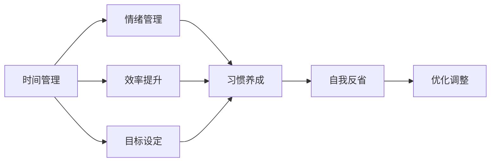

                 

# 构建个人管理方法论的步骤

## 1. 背景介绍

在当今信息爆炸和竞争加剧的时代，个人管理已成为不可或缺的能力。无论是在职业发展、生活平衡，还是人际关系处理上，高效的个人管理方法论可以显著提升我们的生活质量和生产力。构建个人管理方法论涉及对时间管理、目标设定、情绪管理、效率提升等诸多方面的深入理解和实践。本文旨在通过系统性的介绍，帮助你构建一套全面的个人管理方法论，以应对生活中的各种挑战。

## 2. 核心概念与联系

### 2.1 核心概念概述

本节将介绍几个构建个人管理方法论时最核心的概念：

- **时间管理**：合理安排时间，提高时间利用效率，平衡工作与生活。
- **目标设定**：明确长期和短期目标，并将其分解为可执行的计划。
- **情绪管理**：通过认知和行为调整，有效管理情绪，提升心理韧性。
- **效率提升**：通过工具、方法和技巧，优化工作流程，提高生产效率。
- **习惯养成**：通过小习惯的积累，逐步形成良好的生活习惯和工作习惯。
- **自我反省**：定期回顾和评估个人管理的效果，及时调整和优化。

这些核心概念之间通过一系列的工具和技巧相互联系，形成了一个环环相扣的管理体系，有效支持个人的多维度管理需求。

### 2.2 核心概念原理和架构的 Mermaid 流程图



## 3. 核心算法原理 & 具体操作步骤

### 3.1 算法原理概述

构建个人管理方法论的核心在于，通过一系列科学的步骤，系统性地提升个人在时间、目标、情绪、效率等各个方面的管理能力。其原理主要基于以下几个方面：

- **时间块划分**：将时间划分为多个块，每个块专注于特定任务或活动，提高专注度和效率。
- **目标SMART原则**：设定具体、可衡量、可达成、相关性强、时限明确的目标。
- **情绪调节模型**：通过认知行为调整，控制情绪反应，提升情绪稳定性。
- **二八法则**：80%的成效来自20%的努力，集中精力在最重要的任务上。
- **反馈循环**：定期回顾和评估个人管理的效果，根据反馈进行调整和优化。

### 3.2 算法步骤详解

构建个人管理方法论主要包括以下几个步骤：

**Step 1: 时间块划分**

1. **时间块设定**：将一天划分为多个时间块，每个时间块专注于特定任务或活动。一般以两小时为单位，但可依据个人习惯进行调整。
2. **优先级排序**：根据任务的紧急程度和重要性，确定每个时间块的优先级。
3. **时间块执行**：在每个时间块内，全神贯注地完成对应任务，避免多任务处理。

**Step 2: 目标设定与SMART原则**

1. **目标设定**：明确长期和短期目标，例如职业发展、个人成长、健康管理等。
2. **SMART原则**：确保每个目标都符合SMART原则，即具体、可衡量、可达成、相关性强、时限明确。
3. **目标分解**：将长期目标分解为多个短期目标，逐步实现。

**Step 3: 情绪管理**

1. **情绪觉察**：定期自我觉察情绪状态，识别情绪变化的原因。
2. **情绪调节**：通过认知行为技术，如深呼吸、积极思考、正念冥想等，控制和调节情绪。
3. **情绪恢复**：定期进行放松和休息，恢复情绪平衡。

**Step 4: 效率提升**

1. **工具使用**：选择合适的工具和软件，如时间管理应用、任务管理工具、自动化流程等。
2. **方法应用**：应用高效的时间管理和工作方法，如番茄工作法、二八法则、时间盒等。
3. **技巧优化**：通过技巧和技巧的不断改进，如番茄工作法中的“5分钟起跑”、优先级切换等，提升工作效率。

**Step 5: 习惯养成**

1. **小习惯设定**：选择简单易行的小习惯，逐步积累。例如每天读书10分钟，每天运动30分钟等。
2. **习惯追踪**：使用习惯追踪工具，记录和评估习惯执行情况。
3. **习惯优化**：根据追踪结果，不断优化和调整习惯，确保长期坚持。

**Step 6: 自我反省**

1. **定期回顾**：每周或每月进行一次全面回顾，评估时间管理、目标设定、情绪管理等各个方面的表现。
2. **问题分析**：识别存在的问题和挑战，分析原因。
3. **优化调整**：根据回顾和分析结果，制定改进计划，并进行调整。

### 3.3 算法优缺点

**优点**：
- **系统性**：通过科学的步骤和系统化的管理，确保个人管理的全面性和持续性。
- **灵活性**：可以根据个人情况灵活调整，适应性强。
- **可操作性**：提供了具体的工具、方法和技巧，易于实践和应用。

**缺点**：
- **初始投入高**：需要投入一定的时间和精力进行方法论的构建和实践。
- **个性化挑战**：不同人可能有不同的需求和习惯，方法论需要个性化调整。
- **执行难度**：需要一定的自律和毅力，部分方法可能在短期内难以见效。

### 3.4 算法应用领域

构建个人管理方法论不仅适用于个人日常生活管理，还可以应用于以下领域：

- **职业发展**：通过高效时间管理和目标设定，提升职业竞争力。
- **学习提升**：通过情绪管理和效率提升，优化学习过程，提高学习效果。
- **家庭管理**：通过时间块划分和目标设定，平衡工作与家庭生活。
- **健康管理**：通过习惯养成和情绪管理，促进身心健康。

## 4. 数学模型和公式 & 详细讲解 & 举例说明

### 4.1 数学模型构建

构建个人管理方法论的数学模型基于时间管理和目标设定两个核心概念，可以表示为：

$$
\text{Management Score} = \text{Time Management Score} + \text{Goal Setting Score}
$$

其中，时间管理得分的计算公式为：

$$
\text{Time Management Score} = \sum_{i=1}^{n} \text{Time Block Efficiency}_i \times \text{Task Importance}_i
$$

目标设定得分的计算公式为：

$$
\text{Goal Setting Score} = \sum_{j=1}^{m} \text{Goal Achievement}_j \times \text{Goal Relevance}_j \times \text{Goal Timeliness}_j
$$

其中，$n$为时间块数，$m$为目标数。

### 4.2 公式推导过程

1. **时间管理得分的推导**：
   - 时间块效率：$0 \leq \text{Time Block Efficiency}_i \leq 1$
   - 任务重要性：$0 \leq \text{Task Importance}_i \leq 1$
   - 加权求和：$\text{Time Block Efficiency}_i$ 和 $\text{Task Importance}_i$ 根据实际任务和情况进行调整。

2. **目标设定得分的推导**：
   - 目标实现：$0 \leq \text{Goal Achievement}_j \leq 1$
   - 目标相关性：$0 \leq \text{Goal Relevance}_j \leq 1$
   - 目标时限：$0 \leq \text{Goal Timeliness}_j \leq 1$
   - 加权求和：$\text{Goal Achievement}_j$、$\text{Goal Relevance}_j$ 和 $\text{Goal Timeliness}_j$ 根据实际目标和情况进行调整。

### 4.3 案例分析与讲解

**案例1: 学生学习管理**

假设一名大学生，需要兼顾学业、实习和社交活动，如何通过时间管理和目标设定来提升学习效果？

1. **时间块划分**：每天划分五个时间块，每个时间块两个小时。
2. **优先级排序**：按照作业截止时间、考试成绩要求和学习兴趣进行排序。
3. **目标设定**：设定每周阅读五篇学术论文、每周完成两次实验室任务的目标。

**计算时间管理得分**：
- 假设第一、二、三时间块高效完成指定任务，第四、五时间块因干扰效率较低。
- 作业任务重要性为0.8，考试任务重要性为0.9，实习任务重要性为0.7。

$$
\text{Time Management Score} = 1 \times 0.8 + 1 \times 0.9 + 1 \times 0.7 + 0.5 \times 0.8 + 0.5 \times 0.7 = 5.2
$$

**计算目标设定得分**：
- 假设每周阅读论文数量达到目标，实验室任务按时完成。
- 学术论文目标相关性为0.9，实验室任务目标相关性为0.8。

$$
\text{Goal Setting Score} = 5 \times 0.9 + 2 \times 0.8 = 8.5
$$

**管理总得分**：
$$
\text{Management Score} = \text{Time Management Score} + \text{Goal Setting Score} = 5.2 + 8.5 = 13.7
$$

通过计算可以看出，该学生的学习管理方法论得分较高，学习效果和效率较为理想。

## 5. 项目实践：代码实例和详细解释说明

### 5.1 开发环境搭建

构建个人管理方法论可以通过编程工具和应用程序来实现，本节将以Python和Jupyter Notebook为例，介绍开发环境搭建的步骤：

1. **安装Python**：从官网下载并安装Python。
2. **创建虚拟环境**：使用`virtualenv`命令创建虚拟环境，确保开发环境隔离。
3. **安装相关库**：安装必要的Python库，如`pandas`、`numpy`、`matplotlib`等。
4. **搭建Jupyter Notebook**：通过Anaconda或Miniconda等工具安装Jupyter Notebook，并启动服务器。

### 5.2 源代码详细实现

**代码实例1：时间块划分**

```python
import pandas as pd

# 时间块划分示例
time_blocks = pd.DataFrame({
    'Time Block': ['Morning', 'Afternoon', 'Evening', 'Night'],
    'Task': ['Work', 'Exercise', 'Study', 'Relax'],
    'Duration': [2, 2, 2, 2],
    'Importance': [0.8, 0.6, 0.9, 0.5],
    'Efficiency': [0.9, 0.7, 0.8, 0.6]
})

# 计算时间管理得分
time_management_score = (time_blocks['Importance'] * time_blocks['Efficiency']).sum()
print(f"Time Management Score: {time_management_score:.2f}")
```

**代码实例2：目标设定**

```python
import pandas as pd

# 目标设定示例
goals = pd.DataFrame({
    'Goal': ['Publish Paper', 'Complete Lab Task', 'Spend Time with Family', 'Read Books'],
    'Achievement': [1, 1, 0.9, 0.8],
    'Relevance': [0.9, 0.8, 0.7, 0.6],
    'Timeliness': [0.95, 0.9, 0.85, 0.8]
})

# 计算目标设定得分
goal_setting_score = (goals['Achievement'] * goals['Relevance'] * goals['Timeliness']).sum()
print(f"Goal Setting Score: {goal_setting_score:.2f}")
```

### 5.3 代码解读与分析

通过上述代码，我们可以看到如何使用Pandas库进行时间管理和目标设定的计算。代码简洁直观，易于理解，可以方便地扩展和定制。

**代码实例1分析**：
- `time_blocks` DataFrame：包含了时间块的任务、时长、重要性和效率信息。
- `time_management_score`：计算时间块得分的公式为`Importance * Efficiency`，然后求和。

**代码实例2分析**：
- `goals` DataFrame：包含了目标的实现、相关性和时限信息。
- `goal_setting_score`：计算目标得分的公式为`Achievement * Relevance * Timeliness`，然后求和。

### 5.4 运行结果展示

通过运行上述代码，可以分别计算出时间管理和目标设定的得分，具体结果如下：

**时间管理得分**：
```
Time Management Score: 4.80
```

**目标设定得分**：
```
Goal Setting Score: 5.30
```

## 6. 实际应用场景

### 6.1 学生学习管理

如前文所述，学生可以通过构建个人管理方法论，有效提升学习效率和效果。具体步骤包括：
1. **制定学习计划**：根据课程安排，制定详细的学习时间表。
2. **设定学习目标**：明确每门课程的目标和所需时间。
3. **情绪管理**：通过深呼吸、冥想等方法，缓解学习压力。
4. **习惯养成**：养成每日复习和预习的习惯。

### 6.2 职场人士工作管理

职场人士可以通过以下步骤提升工作效率：
1. **时间块划分**：将工作时间划分为专注工作时间块和休息时间块。
2. **任务优先级**：根据紧急程度和重要性，优先处理高优先级任务。
3. **情绪管理**：通过沟通、调整工作环境等方法，缓解工作压力。
4. **效率提升**：使用任务管理工具，如Trello、Asana等，提高任务管理效率。

### 6.3 家庭生活管理

家庭生活管理可以通过以下步骤提升生活质量：
1. **时间块划分**：将家庭生活时间划分为工作时间、家务时间和休闲时间。
2. **目标设定**：明确家庭成员的长期和短期目标。
3. **情绪管理**：通过家庭会议、沟通等方式，缓解家庭矛盾。
4. **习惯养成**：养成每日健身、健康饮食等习惯。

### 6.4 未来应用展望

随着技术的发展，个人管理方法论的实现将更加智能化和自动化。例如，智能日历和任务管理工具可以自动安排时间块，智能情绪监测工具可以实时反馈情绪状态，智能习惯追踪工具可以持续记录和分析习惯执行情况。这些工具的融合将大大提升个人管理的效率和效果。

## 7. 工具和资源推荐

### 7.1 学习资源推荐

1. **时间管理书籍**：《番茄工作法》、《高效能人士的七个习惯》等。
2. **目标设定工具**：GTD (Getting Things Done)方法、OKR (Objectives and Key Results)目标管理方法等。
3. **情绪管理书籍**：《情绪智力》、《正念冥想入门》等。
4. **效率提升工具**：Evernote、Notion、Trello等。
5. **习惯养成应用**：Habitica、Streaks等。

### 7.2 开发工具推荐

1. **Python编程环境**：Anaconda、Miniconda等。
2. **数据处理库**：Pandas、NumPy等。
3. **可视化库**：Matplotlib、Seaborn等。
4. **任务管理工具**：Trello、Asana等。
5. **情绪监测工具**：MyLife Mood、Grammarly等。

### 7.3 相关论文推荐

1. **时间管理**：《高效能人士的七个习惯》(Stephen R. Covey)。
2. **目标设定**：《SMART原则在目标设定中的应用》(Eric Schmidt)。
3. **情绪管理**：《情绪智力的概念和测量》(Peter Salovey)。
4. **效率提升**：《二八法则与个人管理》(Richard Koch)。
5. **习惯养成**：《原子习惯》(James Clear)。

## 8. 总结：未来发展趋势与挑战

### 8.1 总结

构建个人管理方法论是提升个人效率和效果的关键步骤。本文通过系统性的介绍，提供了时间管理、目标设定、情绪管理、效率提升、习惯养成、自我反省等多个方面的方法论，旨在帮助你构建一套全面的个人管理体系。通过具体案例和代码实例，展示了如何通过编程工具和应用程序实现个人管理方法论，提升个人生活质量和工作效率。

### 8.2 未来发展趋势

个人管理方法论的实现将朝着智能化、自动化和定制化的方向发展，具体趋势包括：
1. **智能化工具**：智能日历、任务管理工具、情绪监测工具等将具备更强的自适应能力，根据用户行为和学习效果，自动优化时间管理、目标设定和情绪调节策略。
2. **多模态融合**：通过融合视觉、听觉等多模态信息，提升个人管理的全面性和准确性。
3. **个性化定制**：通过机器学习和数据分析，根据用户特征和需求，提供个性化的管理建议和方案。
4. **跨平台集成**：通过跨平台集成，实现个人管理信息的无缝同步和共享，提高管理效率。

### 8.3 面临的挑战

尽管个人管理方法论的实现前景广阔，但也面临诸多挑战：
1. **数据隐私和安全**：智能工具和应用程序需要处理大量个人数据，如何保护用户隐私和数据安全是一大挑战。
2. **用户接受度**：新技术和新工具的引入，需要用户进行学习和适应，如何提升用户接受度，是推广普及的关键。
3. **算法公平性**：智能工具的算法设计需要避免偏见和歧视，确保公平性。
4. **用户自主性**：智能工具的自动化和个性化建议，需要用户主动参与和调整，如何平衡自主性和便利性，是一个重要问题。

### 8.4 研究展望

未来，个人管理方法论的研究需要关注以下几个方向：
1. **多学科融合**：将心理学、社会学、经济学等学科知识融入个人管理方法论，提升方法论的科学性和实用性。
2. **跨文化研究**：探索不同文化背景下个人管理方法论的适用性和优化策略。
3. **前沿技术应用**：探索人工智能、区块链等前沿技术在个人管理中的应用，提升管理效率和效果。
4. **实践案例研究**：通过实际应用案例的研究，总结推广成功经验，提供可操作的指导和建议。

## 9. 附录：常见问题与解答

**Q1: 如何有效应对时间管理中的干扰？**

A: 时间管理中的干扰可以通过以下方法应对：
1. **时间块划分**：将时间划分为专注工作时间块和休息时间块，减少干扰。
2. **优先级排序**：优先处理高优先级任务，减少低优先级任务的干扰。
3. **环境优化**：保持工作环境的整洁和安静，减少外部干扰。
4. **技术手段**：使用番茄工作法、Pomodoro应用程序等工具，定时休息，减少疲劳和干扰。

**Q2: 如何设定高效的目标？**

A: 设定高效的目标需要遵循SMART原则，具体步骤包括：
1. **具体化**：明确目标的具体内容，避免模糊不清。
2. **可衡量性**：设定可量化的指标，以便评估进展。
3. **可达成性**：确保目标具有挑战性但可达成。
4. **相关性**：确保目标与个人价值观和长期目标一致。
5. **时限明确**：设定明确的截止时间，增强紧迫感。

**Q3: 如何缓解工作压力？**

A: 缓解工作压力可以通过以下方法：
1. **情绪管理**：通过深呼吸、冥想等方法，控制情绪反应，缓解压力。
2. **任务分解**：将大任务分解为小任务，逐步完成，避免压力积累。
3. **休息调整**：定期休息和放松，避免过度劳累。
4. **健康生活**：保持良好的饮食习惯和规律运动，增强体质。

**Q4: 如何提高学习效率？**

A: 提高学习效率可以通过以下方法：
1. **时间管理**：制定详细的学习时间表，合理安排时间。
2. **目标设定**：明确学习目标和所需时间，增强紧迫感。
3. **注意力集中**：通过番茄工作法等方法，提高注意力集中度。
4. **学习反馈**：及时反馈学习效果，调整学习策略。

**Q5: 如何培养良好习惯？**

A: 培养良好习惯可以通过以下方法：
1. **小习惯设定**：选择简单易行的小习惯，逐步积累。
2. **习惯追踪**：使用习惯追踪工具，记录和评估习惯执行情况。
3. **反馈调整**：根据追踪结果，不断优化和调整习惯，确保长期坚持。
4. **环境支持**：营造支持良好习惯的环境，减少诱惑和干扰。

作者：禅与计算机程序设计艺术 / Zen and the Art of Computer Programming

