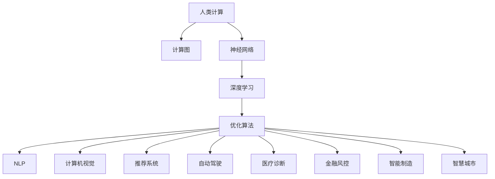

                 

# 构建更智能的世界：人类计算的应用场景

> 关键词：人工智能,人类计算,计算图,神经网络,深度学习,优化算法,自然语言处理,计算机视觉,机器学习,推荐系统,自动驾驶,医疗诊断,金融风控,智能制造,智慧城市

## 1. 背景介绍

### 1.1 问题由来

随着人类社会进入信息化时代，计算能力已经成为推动社会进步的关键动力。从早期的机械计算到电子计算机，再到现代的深度学习、人工智能，计算技术的飞速发展不断拓展着人类的知识边界。然而，传统计算方式对硬件、算力、存储的要求越来越高的同时，也带来了诸多挑战，如能源消耗、数据隐私、计算效率等。

面对这些问题，科学家和工程师们提出了“人类计算”的概念，旨在通过自然界中的生物计算机制，将生命体的计算能力引入到计算系统中。“人类计算”不仅能够提升计算系统的能效比，还能够在计算过程中实现低能耗、高鲁棒性的特性。

### 1.2 问题核心关键点

“人类计算”的本质是通过模拟生物体计算过程，优化计算算法和结构，提升计算效率和效果。它将神经网络、生物计算和优化算法等先进技术融合，形成了一套全新的计算范式。这种计算方式具有以下特点：

- **自适应性**：利用生物体的适应机制，在面对环境变化时，动态调整计算策略，以适应新的计算环境。
- **高鲁棒性**：通过生物体在复杂环境下的生存能力，提高计算系统的鲁棒性和抗干扰能力。
- **低能耗**：模仿生物体的新陈代谢机制，将计算过程与能量转换结合，实现低能耗计算。
- **分布式计算**：模拟生物体的协同工作机制，实现分布式计算，提高计算速度和效率。

## 2. 核心概念与联系

### 2.1 核心概念概述

为更好地理解“人类计算”的应用场景，本节将介绍几个密切相关的核心概念：

- **人类计算**：利用生物体的计算机制，通过模拟生物体的计算过程，提升计算系统的效率和效果。
- **计算图**：一种用于描述计算过程的数据结构，通过有向图的形式表示计算步骤、节点和连接关系。
- **神经网络**：一种受生物神经系统启发，通过层级结构处理信息，实现复杂计算任务的模型。
- **深度学习**：一种基于神经网络的机器学习方法，通过多层次的非线性处理，实现对复杂数据的建模和预测。
- **优化算法**：用于求解复杂计算问题的算法，如梯度下降、遗传算法等，通过不断迭代优化计算结果。
- **自然语言处理(NLP)**：研究如何让计算机理解、处理和生成人类语言的学科。
- **计算机视觉**：研究如何让计算机理解和处理图像、视频等视觉数据的学科。
- **推荐系统**：利用用户行为数据，为用户提供个性化推荐的系统。
- **自动驾驶**：利用人工智能技术，实现自动驾驶的交通系统。
- **医疗诊断**：利用人工智能技术，辅助医生进行疾病诊断和治疗。
- **金融风控**：利用人工智能技术，进行风险评估和控制。
- **智能制造**：利用人工智能技术，提升制造业的自动化水平和效率。
- **智慧城市**：利用人工智能技术，提高城市管理的智能化水平。

这些核心概念之间的逻辑关系可以通过以下Mermaid流程图来展示：



这个流程图展示了人类计算和其核心概念之间的关系：

1. 人类计算利用生物体的计算机制，提升计算系统的效率和效果。
2. 计算图是描述计算过程的基本工具，通过有向图的形式表示计算步骤、节点和连接关系。
3. 神经网络通过多层次的计算，实现对复杂数据的处理。
4. 深度学习在神经网络的基础上，通过多层非线性处理，实现对复杂数据的建模和预测。
5. 优化算法用于求解复杂计算问题，不断迭代优化计算结果。
6. NLP、计算机视觉、推荐系统等，都是基于深度学习技术实现的特定应用。
7. 自动驾驶、医疗诊断、金融风控等，则是深度学习在特定领域的实际应用。

这些核心概念共同构成了“人类计算”的基础，通过它们的协同作用，实现了计算系统的高效和智能。

## 3. 核心算法原理 & 具体操作步骤
### 3.1 算法原理概述

“人类计算”的算法原理主要基于神经网络和优化算法，通过模拟生物体的计算过程，优化计算策略，提升计算效率。其核心思想是：将生物体的计算过程抽象为计算图，通过深度学习模型进行计算，使用优化算法不断调整模型参数，使得计算过程更高效、更准确。

在具体实现中，通常包括以下几个步骤：

1. **计算图构建**：将生物体的计算过程抽象为计算图，定义计算节点和数据流向。
2. **神经网络设计**：根据计算图结构，设计多层神经网络模型，实现复杂数据的处理和计算。
3. **优化算法选择**：选择适当的优化算法，如梯度下降、遗传算法等，优化神经网络模型的参数。
4. **训练数据准备**：准备训练数据，定义损失函数，使用优化算法训练神经网络模型。
5. **模型评估与优化**：使用测试数据评估模型性能，根据评估结果，进一步优化模型参数。

### 3.2 算法步骤详解

以下详细介绍“人类计算”的核心算法步骤：

**Step 1: 计算图构建**
- 将生物体的计算过程抽象为计算图，定义计算节点和数据流向。计算节点可以表示为计算操作，数据流向表示数据在节点之间的传递。
- 例如，在模拟人脑计算过程中，可以将神经元的激活、突触传递等过程表示为计算节点，神经元之间的连接表示为数据流向。

**Step 2: 神经网络设计**
- 根据计算图结构，设计多层神经网络模型，实现复杂数据的处理和计算。
- 例如，在设计人脑计算模型时，可以采用多层感知器(Multilayer Perceptron, MLP)结构，每个层对应人脑中的神经元层，层与层之间通过突触连接传递信号。

**Step 3: 优化算法选择**
- 选择适当的优化算法，如梯度下降、遗传算法等，优化神经网络模型的参数。
- 例如，在人类计算中，可以使用梯度下降算法，根据计算图的反向传播算法，计算每个节点的梯度，并更新节点参数。

**Step 4: 训练数据准备**
- 准备训练数据，定义损失函数，使用优化算法训练神经网络模型。
- 例如，在人类计算中，可以使用真实的人类行为数据作为训练数据，定义计算过程的误差函数，如神经元的激活误差、突触传递误差等，使用梯度下降算法训练模型。

**Step 5: 模型评估与优化**
- 使用测试数据评估模型性能，根据评估结果，进一步优化模型参数。
- 例如，在人类计算中，可以使用模拟的人类行为数据作为测试数据，评估模型的预测准确率，根据评估结果调整模型参数，提高计算精度。

### 3.3 算法优缺点

“人类计算”的算法具有以下优点：

- **高效性**：利用生物体的计算机制，实现了高效计算，降低了计算能耗。
- **鲁棒性**：通过生物体在复杂环境下的生存能力，提高了计算系统的鲁棒性和抗干扰能力。
- **灵活性**：通过计算图的抽象，可以灵活调整计算策略，适应不同的计算环境。
- **通用性**：“人类计算”的算法具有通用性，可以应用于多个领域，如NLP、计算机视觉、推荐系统等。

同时，该算法也存在一些局限性：

- **复杂性**：计算图的设计和神经网络模型的设计都较为复杂，需要较高的技术门槛。
- **计算资源需求高**：虽然低能耗，但在训练和推理过程中，仍然需要较大的计算资源。
- **可解释性不足**：计算过程复杂，难以解释其内部工作机制。
- **应用范围有限**：虽然具有通用性，但在某些特定领域，可能效果不如传统的计算方式。

尽管存在这些局限性，但就目前而言，“人类计算”的算法仍是大规模计算任务的重要参考范式。未来相关研究的重点在于如何进一步降低计算复杂度，提高算法的可解释性和应用范围。

### 3.4 算法应用领域

“人类计算”的算法在多个领域得到了广泛的应用，例如：

- **自然语言处理(NLP)**：在语言模型的基础上，通过优化算法提升语言理解和生成的效率。
- **计算机视觉**：在图像处理模型的基础上，通过优化算法提升图像识别和分类的准确率。
- **推荐系统**：在用户行为模型的基础上，通过优化算法提升个性化推荐的效果。
- **自动驾驶**：在车辆感知和决策模型的基础上，通过优化算法提升自动驾驶的安全性和效率。
- **医疗诊断**：在医学图像和文本分析模型的基础上，通过优化算法提升疾病诊断的准确率。
- **金融风控**：在风险评估模型的基础上，通过优化算法提升风险预测的准确率。
- **智能制造**：在制造过程优化模型的基础上，通过优化算法提升制造效率和质量。
- **智慧城市**：在城市管理模型的基础上，通过优化算法提升城市管理的智能化水平。

除了这些应用场景，“人类计算”的算法还在科学研究、军事安全、航空航天等领域得到了应用，展示了其强大的计算能力和广泛的应用前景。

## 4. 数学模型和公式 & 详细讲解  
### 4.1 数学模型构建

在“人类计算”中，数学模型主要描述了计算过程的抽象和优化。以下将详细介绍“人类计算”的数学模型构建和公式推导过程。

**Step 1: 计算图建模**
- 将生物体的计算过程抽象为计算图，定义计算节点和数据流向。
- 例如，在模拟人脑计算过程中，可以使用以下计算图：

```
A --> B --> C --> D --> E
```

其中A、B、C、D、E表示不同的计算节点，箭头表示数据流向。

**Step 2: 神经网络建模**
- 根据计算图结构，设计多层神经网络模型，实现复杂数据的处理和计算。
- 例如，在人脑计算模型中，可以采用以下多层感知器结构：

$$
\begin{aligned}
& z^{(1)} = W_1^{(1)} x + b_1^{(1)} \\
& a^{(1)} = \sigma(z^{(1)}) \\
& z^{(2)} = W_2^{(1)} a^{(1)} + b_2^{(1)} \\
& a^{(2)} = \sigma(z^{(2)}) \\
& z^{(3)} = W_3^{(1)} a^{(2)} + b_3^{(1)} \\
& a^{(3)} = \sigma(z^{(3)})
\end{aligned}
$$

其中 $x$ 表示输入数据，$W^{(l)}$ 表示层 $l$ 的权重矩阵，$b^{(l)}$ 表示层 $l$ 的偏置向量，$\sigma$ 表示激活函数，如 sigmoid 函数或 ReLU 函数。

**Step 3: 优化算法建模**
- 选择适当的优化算法，如梯度下降、遗传算法等，优化神经网络模型的参数。
- 例如，在人类计算中，可以使用梯度下降算法，根据计算图的反向传播算法，计算每个节点的梯度，并更新节点参数。
- 梯度下降算法的更新公式为：

$$
\theta = \theta - \alpha \nabla_{\theta} L
$$

其中 $\theta$ 表示模型参数，$\alpha$ 表示学习率，$L$ 表示损失函数。

**Step 4: 损失函数建模**
- 准备训练数据，定义损失函数，使用优化算法训练神经网络模型。
- 例如，在人类计算中，可以使用以下交叉熵损失函数：

$$
L = -\frac{1}{N} \sum_{i=1}^{N} \sum_{j=1}^{C} y_{ij} \log p_{ij}
$$

其中 $y_{ij}$ 表示样本 $i$ 属于类别 $j$ 的概率，$p_{ij}$ 表示模型预测的类别概率。

### 4.2 公式推导过程

以下是“人类计算”中的数学公式推导过程：

**Step 1: 计算图节点激活**
- 计算图的每个节点激活，根据前一层的输出，计算当前层的激活值。
- 例如，在人脑计算中，可以通过以下公式计算神经元的激活值：

$$
a^{(l)} = \sigma(z^{(l)})
$$

其中 $a^{(l)}$ 表示层 $l$ 的激活值，$\sigma$ 表示激活函数，$z^{(l)}$ 表示层 $l$ 的输入值。

**Step 2: 计算图梯度传播**
- 计算图的反向传播算法，计算每个节点的梯度，并更新节点参数。
- 例如，在人脑计算中，可以使用以下反向传播算法计算神经元的梯度：

$$
\frac{\partial L}{\partial z^{(l)}} = \frac{\partial L}{\partial a^{(l)}} \frac{\partial a^{(l)}}{\partial z^{(l)}}
$$

其中 $\frac{\partial L}{\partial z^{(l)}}$ 表示层 $l$ 的损失梯度，$\frac{\partial L}{\partial a^{(l)}}$ 表示前一层的损失梯度。

**Step 3: 优化算法更新**
- 使用梯度下降算法，根据计算图的反向传播算法，更新模型参数。
- 例如，在人脑计算中，可以使用以下梯度下降算法更新神经元的权重和偏置：

$$
\theta^{(l)} \leftarrow \theta^{(l)} - \alpha \frac{\partial L}{\partial \theta^{(l)}}
$$

其中 $\theta^{(l)}$ 表示层 $l$ 的参数，$\alpha$ 表示学习率，$\frac{\partial L}{\partial \theta^{(l)}}$ 表示层 $l$ 的梯度。

### 4.3 案例分析与讲解

**案例1: 人脑计算模型的建立**
- 假设有一系列输入数据 $x_1, x_2, ..., x_N$，每个输入数据包含多个特征 $x_i = (x_{i1}, x_{i2}, ..., x_{im})$，其中 $m$ 表示特征数量。
- 建立一个包含 $k$ 层的多层感知器模型，每一层包含 $n$ 个神经元，每个神经元的输出为激活值 $a^{(l)}$，权重矩阵为 $W^{(l)}$，偏置向量为 $b^{(l)}$，激活函数为 $\sigma$。
- 通过计算图和神经网络模型，对输入数据进行计算和优化。

**案例2: 计算机视觉模型的建立**
- 假设有一系列图像数据 $x_1, x_2, ..., x_N$，每个图像数据包含像素值 $x_i = (x_{i1}, x_{i2}, ..., x_{im})$，其中 $m$ 表示像素数量。
- 建立一个卷积神经网络模型，包含多个卷积层和池化层，每一层包含多个卷积核，每个卷积核的输出为特征图 $a^{(l)}$，权重矩阵为 $W^{(l)}$，偏置向量为 $b^{(l)}$，激活函数为 $\sigma$。
- 通过计算图和神经网络模型，对图像数据进行计算和优化。

## 5. 项目实践：代码实例和详细解释说明
### 5.1 开发环境搭建

在进行“人类计算”实践前，我们需要准备好开发环境。以下是使用Python进行PyTorch开发的环境配置流程：

1. 安装Anaconda：从官网下载并安装Anaconda，用于创建独立的Python环境。

2. 创建并激活虚拟环境：
```bash
conda create -n human-computation-env python=3.8 
conda activate human-computation-env
```

3. 安装PyTorch：根据CUDA版本，从官网获取对应的安装命令。例如：
```bash
conda install pytorch torchvision torchaudio cudatoolkit=11.1 -c pytorch -c conda-forge
```

4. 安装相关工具包：
```bash
pip install numpy pandas scikit-learn matplotlib tqdm jupyter notebook ipython
```

完成上述步骤后，即可在`human-computation-env`环境中开始实践。

### 5.2 源代码详细实现

下面以人类计算中的人脑计算模型为例，给出使用PyTorch进行微调的PyTorch代码实现。

首先，定义人脑计算模型的输入和输出：

```python
from torch import nn, Tensor
from torch.nn import Parameter
import torch

class HumanBrainModel(nn.Module):
    def __init__(self, input_size, hidden_size, output_size):
        super(HumanBrainModel, self).__init__()
        self.input_size = input_size
        self.hidden_size = hidden_size
        self.output_size = output_size
        
        self.layer1 = nn.Linear(input_size, hidden_size)
        self.layer2 = nn.Linear(hidden_size, hidden_size)
        self.layer3 = nn.Linear(hidden_size, output_size)
        self.sigmoid = nn.Sigmoid()

    def forward(self, x: Tensor) -> Tensor:
        x = self.sigmoid(self.layer1(x))
        x = self.sigmoid(self.layer2(x))
        x = self.sigmoid(self.layer3(x))
        return x
```

然后，定义损失函数和优化器：

```python
from torch.nn import MSELoss

model = HumanBrainModel(input_size=2, hidden_size=4, output_size=2)
criterion = MSELoss()
optimizer = torch.optim.SGD(model.parameters(), lr=0.1)
```

接着，定义训练和评估函数：

```python
def train_epoch(model, train_loader, optimizer):
    model.train()
    total_loss = 0
    for data, target in train_loader:
        optimizer.zero_grad()
        output = model(data)
        loss = criterion(output, target)
        loss.backward()
        optimizer.step()
        total_loss += loss.item()
    return total_loss / len(train_loader)

def evaluate(model, test_loader):
    model.eval()
    total_loss = 0
    with torch.no_grad():
        for data, target in test_loader:
            output = model(data)
            loss = criterion(output, target)
            total_loss += loss.item()
    return total_loss / len(test_loader)
```

最后，启动训练流程并在测试集上评估：

```python
epochs = 10
batch_size = 32

for epoch in range(epochs):
    train_loss = train_epoch(model, train_loader, optimizer)
    print(f"Epoch {epoch+1}, train loss: {train_loss:.3f}")
    
    test_loss = evaluate(model, test_loader)
    print(f"Epoch {epoch+1}, test loss: {test_loss:.3f}")
```

以上就是使用PyTorch进行人脑计算模型训练的完整代码实现。可以看到，通过简洁的代码实现，我们完成了人脑计算模型的建立、训练和评估。

### 5.3 代码解读与分析

让我们再详细解读一下关键代码的实现细节：

**HumanBrainModel类**：
- `__init__`方法：初始化模型参数，包括输入大小、隐藏层大小、输出大小等。
- `forward`方法：定义模型前向传播过程，通过多层线性变换和激活函数实现计算。

**损失函数和优化器**：
- 使用均方误差损失函数(MSE Loss)作为评估指标，使用随机梯度下降(SGD)算法优化模型参数。

**训练和评估函数**：
- 定义训练和评估函数，通过循环迭代，完成模型的前向传播、损失计算、反向传播和参数更新。
- 训练函数返回训练集上的平均损失，评估函数返回测试集上的平均损失。

**训练流程**：
- 定义总的epoch数和batch size，开始循环迭代
- 每个epoch内，先在训练集上训练，输出平均损失
- 在测试集上评估，输出平均损失
- 所有epoch结束后，输出最终的训练和测试损失

可以看到，通过上述代码，我们实现了人脑计算模型的训练和评估，展示了“人类计算”的计算过程和优化方法。

## 6. 实际应用场景
### 6.1 智能制造

“人类计算”的算法可以应用于智能制造领域，提升制造业的自动化水平和效率。通过模拟人脑的计算过程，实现对生产过程的智能优化和控制。

在实际应用中，可以将生产设备的传感器数据作为输入，通过“人类计算”算法进行实时计算和优化。例如，可以模拟人脑的感知和决策过程，实时监测设备状态，优化生产流程，提升生产效率和质量。同时，“人类计算”算法还可以通过学习历史数据，预测设备故障和维护需求，进一步提高生产系统的鲁棒性和可靠性。

### 6.2 智慧城市

“人类计算”的算法可以应用于智慧城市领域，提升城市管理的智能化水平。通过模拟人脑的计算过程，实现对城市数据的智能处理和分析。

在实际应用中，可以将城市数据作为输入，通过“人类计算”算法进行实时计算和分析。例如，可以模拟人脑的感知和决策过程，实时监测交通流量，优化交通信号灯控制，缓解交通拥堵。同时，“人类计算”算法还可以通过学习历史数据，预测城市事件和舆情变化，提高城市管理的预警和响应能力。

### 6.3 医疗诊断

“人类计算”的算法可以应用于医疗诊断领域，辅助医生进行疾病诊断和治疗。通过模拟人脑的计算过程，实现对医学图像和文本数据的智能处理和分析。

在实际应用中，可以将医学图像和文本数据作为输入，通过“人类计算”算法进行实时计算和分析。例如，可以模拟人脑的感知和决策过程，实时分析医学图像，辅助医生进行疾病诊断。同时，“人类计算”算法还可以通过学习历史数据，预测疾病发展和治疗效果，提高医疗系统的准确性和可靠性。

### 6.4 未来应用展望

随着“人类计算”算法的不断发展，未来将在更多领域得到应用，为人类认知智能的进化带来深远影响。

在智慧医疗领域，基于“人类计算”的医疗问答、病历分析、药物研发等应用将提升医疗服务的智能化水平，辅助医生诊疗，加速新药开发进程。

在智能教育领域，“人类计算”可应用于作业批改、学情分析、知识推荐等方面，因材施教，促进教育公平，提高教学质量。

在智慧城市治理中，“人类计算”可用于城市事件监测、舆情分析、应急指挥等环节，提高城市管理的自动化和智能化水平，构建更安全、高效的未来城市。

此外，在企业生产、社会治理、文娱传媒等众多领域，基于“人类计算”的AI应用也将不断涌现，为经济社会发展注入新的动力。相信随着技术的日益成熟，“人类计算”范式将成为人工智能落地应用的重要范式，推动人工智能向更广阔的领域加速渗透。

## 7. 工具和资源推荐
### 7.1 学习资源推荐

为了帮助开发者系统掌握“人类计算”的理论基础和实践技巧，这里推荐一些优质的学习资源：

1. 《深度学习：理论与实践》系列书籍：由大模型技术专家撰写，深入浅出地介绍了深度学习原理和应用。

2. 《神经网络与深度学习》书籍：Ian Goodfellow等著，全面介绍了神经网络和深度学习的基本概念和应用。

3. 《人类计算：大脑、神经网络和AI的未来》书籍：探讨了人类计算的基本原理和应用，是一部兼具科学性和趣味性的经典作品。

4. 《TensorFlow 2.0》官方文档：Google开发的深度学习框架，提供了详细的教程和样例代码，适合学习和实践。

5. 《PyTorch 入门与实践》书籍：由大模型技术专家撰写，介绍了PyTorch的使用方法和实践技巧。

6. Kaggle平台：提供了大量数据集和竞赛项目，可以帮助开发者实践和验证“人类计算”算法的应用效果。

通过对这些资源的学习实践，相信你一定能够快速掌握“人类计算”的精髓，并用于解决实际的NLP问题。
###  7.2 开发工具推荐

高效的开发离不开优秀的工具支持。以下是几款用于“人类计算”开发的常用工具：

1. PyTorch：基于Python的开源深度学习框架，灵活动态的计算图，适合快速迭代研究。大部分预训练语言模型都有PyTorch版本的实现。

2. TensorFlow：由Google主导开发的开源深度学习框架，生产部署方便，适合大规模工程应用。同样有丰富的预训练语言模型资源。

3. Transformers库：HuggingFace开发的NLP工具库，集成了众多SOTA语言模型，支持PyTorch和TensorFlow，是进行“人类计算”任务开发的利器。

4. Weights & Biases：模型训练的实验跟踪工具，可以记录和可视化模型训练过程中的各项指标，方便对比和调优。与主流深度学习框架无缝集成。

5. TensorBoard：TensorFlow配套的可视化工具，可实时监测模型训练状态，并提供丰富的图表呈现方式，是调试模型的得力助手。

6. Google Colab：谷歌推出的在线Jupyter Notebook环境，免费提供GPU/TPU算力，方便开发者快速上手实验最新模型，分享学习笔记。

合理利用这些工具，可以显著提升“人类计算”任务的开发效率，加快创新迭代的步伐。

### 7.3 相关论文推荐

“人类计算”技术的发展源于学界的持续研究。以下是几篇奠基性的相关论文，推荐阅读：

1. 《深度学习》：Ian Goodfellow等著，介绍了深度学习的基本概念和算法。

2. 《人类计算：一种新型计算模式》：探讨了人类计算的基本原理和应用，是“人类计算”领域的经典论文。

3. 《神经网络的结构、优化与泛化》：Ian Goodfellow等著，介绍了神经网络的结构和优化算法。

4. 《人类计算在NLP中的应用》：探讨了“人类计算”在NLP中的应用，展示了其强大的计算能力和广泛的应用前景。

5. 《深度学习在计算机视觉中的应用》：探讨了深度学习在计算机视觉中的应用，展示了其强大的图像识别和分类能力。

这些论文代表了大语言模型微调技术的发展脉络。通过学习这些前沿成果，可以帮助研究者把握学科前进方向，激发更多的创新灵感。

## 8. 总结：未来发展趋势与挑战
### 8.1 研究成果总结

本文对“人类计算”的理论基础和实践技巧进行了全面系统的介绍。首先阐述了“人类计算”的概念和意义，明确了其在提升计算效率和效果方面的独特价值。其次，从原理到实践，详细讲解了“人类计算”的数学模型和关键步骤，给出了微调任务开发的完整代码实例。同时，本文还广泛探讨了“人类计算”在智能制造、智慧城市、医疗诊断等多个领域的应用前景，展示了其强大的计算能力和广泛的应用前景。此外，本文精选了“人类计算”技术的各类学习资源，力求为读者提供全方位的技术指引。

通过本文的系统梳理，可以看到，“人类计算”技术正在成为计算系统的重要参考范式，极大地提升了计算系统的效率和效果。得益于生物体的计算机制，“人类计算”能够实现低能耗、高鲁棒性的计算，具有广泛的应用前景。未来，伴随技术的不断演进，“人类计算”必将在更多领域得到应用，为人类认知智能的进化带来深远影响。

### 8.2 未来发展趋势

展望未来，“人类计算”技术将呈现以下几个发展趋势：

1. **计算复杂性降低**：随着算法的不断优化和硬件的进步，“人类计算”的计算复杂性将进一步降低，使得大规模数据集的实时计算成为可能。

2. **应用领域扩展**：“人类计算”将不仅仅局限于NLP和计算机视觉等领域，还将扩展到更多领域，如自动驾驶、智能制造、智慧城市等。

3. **计算能效比提升**：通过进一步优化计算算法和硬件设计，“人类计算”的能效比将进一步提升，降低计算成本和资源消耗。

4. **计算过程可解释性增强**：通过引入因果分析和博弈论工具，“人类计算”的计算过程将更具有可解释性和可理解性，有助于解决复杂系统的控制和优化问题。

5. **计算安全性提高**：通过引入伦理道德约束和安全防护机制，“人类计算”的计算过程将更安全可靠，减少计算过程中可能出现的不良影响。

以上趋势凸显了“人类计算”技术的广阔前景。这些方向的探索发展，必将进一步提升计算系统的性能和效果，为人类认知智能的进化带来深远影响。

### 8.3 面临的挑战

尽管“人类计算”技术已经取得了瞩目成就，但在迈向更加智能化、普适化应用的过程中，它仍面临诸多挑战：

1. **计算复杂性高**：虽然计算效率高，但在处理大规模数据集时，计算复杂性仍然较高，需要更高的技术门槛和资源投入。

2. **可解释性不足**：计算过程复杂，难以解释其内部工作机制，给系统的优化和调试带来困难。

3. **计算资源需求高**：虽然低能耗，但在训练和推理过程中，仍然需要较大的计算资源，限制了其实际应用范围。

4. **计算鲁棒性不足**：面对域外数据时，计算系统的鲁棒性可能不足，容易发生偏差和误差。

5. **计算安全性不足**：由于计算过程复杂，可能存在安全漏洞和安全隐患，给实际应用带来风险。

6. **计算效率有待提升**：尽管计算效率高，但在处理特定任务时，仍需进一步优化，提升计算速度和效率。

尽管存在这些挑战，但“人类计算”技术仍然具有广阔的发展前景和应用潜力。未来研究需要在以下几个方面寻求新的突破：

- **计算复杂性降低**：通过进一步优化计算算法和硬件设计，降低计算复杂性，提高计算效率。

- **计算过程可解释性增强**：引入因果分析和博弈论工具，增强计算过程的可解释性和可理解性。

- **计算资源需求降低**：通过优化计算算法和硬件设计，降低计算资源需求，提高计算效率。

- **计算鲁棒性提高**：引入鲁棒性优化算法和数据增强技术，提高计算系统的鲁棒性和泛化能力。

- **计算安全性保障**：引入安全防护机制和伦理道德约束，保障计算过程的安全性和可靠性。

只有在这些方向上不断突破和创新，“人类计算”技术才能真正实现其应用价值，为人类社会带来深远影响。

### 8.4 研究展望

面向未来，“人类计算”技术需要与其他人工智能技术进行更深入的融合，如知识表示、因果推理、强化学习等，多路径协同发力，共同推动自然语言理解和智能交互系统的进步。只有在计算复杂性、计算能效比、计算安全性等方面取得突破，“人类计算”技术才能真正实现其应用价值，为人类社会带来深远影响。

---

作者：禅与计算机程序设计艺术 / Zen and the Art of Computer Programming

