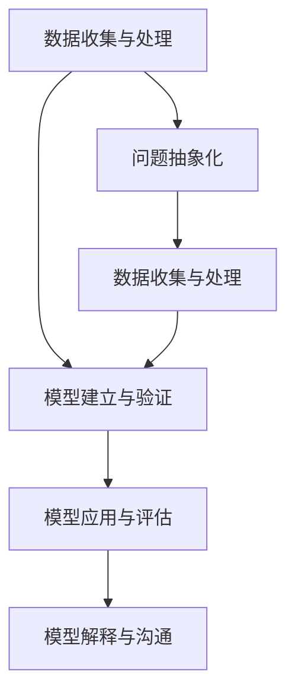

                 

# 模型思维在管理培训中的运用

## 1. 背景介绍

### 1.1 问题由来

随着人工智能技术的不断发展和应用，模型思维（Model Thinking）在各行各业中正变得越来越重要。在现代管理培训中，模型思维已成为培养管理者的核心能力之一。模型的思维方式不仅能够帮助管理者更系统地分析问题，还能提高决策效率和质量。因此，将模型思维融入管理培训体系，成为提升管理者能力的重要途径。

### 1.2 问题核心关键点

模型思维在管理培训中的应用，主要体现在以下几个方面：

1. **问题抽象化**：将实际管理问题转化为可量化、可模型化的抽象问题，便于进一步分析和解决。
2. **数据驱动决策**：基于历史数据和模型预测，辅助管理者做出更准确、更科学的决策。
3. **优化管理流程**：利用优化模型，找到管理流程中的瓶颈，优化资源配置和流程设计。
4. **风险管理**：通过风险评估模型，识别潜在风险并采取相应措施，提高管理效率和稳定性。
5. **绩效评估**：构建绩效评估模型，量化管理效果，提供持续改进的依据。

本文旨在通过系统性地介绍模型思维的基本概念、核心算法和具体操作步骤，为管理培训提供理论支持和实践指导。

## 2. 核心概念与联系

### 2.1 核心概念概述

在管理培训中，常见的模型思维包括以下几个核心概念：

- **管理模型**：用于描述和管理问题的数学或算法模型，包括决策树、回归模型、优化模型、仿真模型等。
- **数据收集与处理**：获取和管理与问题相关的数据，包括数据清洗、数据预处理等。
- **模型建立与验证**：基于问题抽象和数据处理，构建模型并进行验证和优化。
- **模型应用与评估**：将模型应用于实际管理场景，进行效果评估和持续改进。
- **模型解释与沟通**：解释模型的结果和逻辑，使管理者和决策者能够理解和接受模型建议。

这些概念之间的联系和应用场景可以通过以下Mermaid流程图来展示：



这个流程图展示了模型思维在管理培训中的主要流程：首先对问题进行抽象，然后收集和处理数据，构建和验证模型，最后将模型应用于实际管理场景，并通过解释和沟通使结果可接受。

## 3. 核心算法原理 & 具体操作步骤

### 3.1 算法原理概述

管理培训中的模型思维主要基于以下几个数学和算法原理：

- **线性回归**：用于建立输入与输出之间的线性关系，用于预测和解释数据。
- **决策树**：通过分类树的方式，将数据逐步分解为更小的子集，用于分类和回归分析。
- **优化算法**：如梯度下降、遗传算法等，用于求解模型参数，优化模型性能。
- **蒙特卡罗方法**：通过随机抽样和模拟，评估模型风险和不确定性，用于风险管理和决策支持。
- **仿真模型**：通过模拟现实系统，预测和分析系统行为，用于优化管理和预测未来趋势。

这些算法原理在管理培训中的应用，通常包括以下几个步骤：

1. **问题抽象与定义**：将实际管理问题转化为数学或算法模型可以处理的形式。
2. **数据收集与清洗**：收集相关数据，并进行预处理，确保数据质量。
3. **模型选择与构建**：选择适当的模型，并根据数据和问题特点构建模型。
4. **模型训练与验证**：通过训练模型并验证模型性能，选择最优模型。
5. **模型应用与解释**：将模型应用于实际管理场景，解释模型结果，辅助决策。

### 3.2 算法步骤详解

以线性回归模型为例，详细介绍其操作步骤：

**Step 1: 问题抽象与定义**

首先需要明确管理问题的目标和变量，将其转化为数学表达式。例如，假设我们要优化公司的销售额，设销售额为 $y$，可能影响销售额的因素包括广告支出（$x_1$）、市场竞争（$x_2$）、产品价格（$x_3$）等。

**Step 2: 数据收集与清洗**

收集历史数据，记录各因素的值和相应的销售额，并对数据进行清洗和预处理，如处理缺失值、异常值等。

**Step 3: 模型选择与构建**

选择线性回归模型，根据问题定义建立模型方程：

$$
y = \beta_0 + \beta_1x_1 + \beta_2x_2 + \beta_3x_3 + \epsilon
$$

其中，$\beta_0$ 是截距，$\beta_1$、$\beta_2$、$\beta_3$ 是各个因素的系数，$\epsilon$ 是误差项。

**Step 4: 模型训练与验证**

利用训练数据对模型进行拟合，求出系数 $\beta_0$、$\beta_1$、$\beta_2$、$\beta_3$。常用的优化算法有梯度下降法，其目标是最小化损失函数：

$$
L(\beta) = \frac{1}{2N} \sum_{i=1}^{N}(y_i - (\beta_0 + \beta_1x_{1,i} + \beta_2x_{2,i} + \beta_3x_{3,i}))^2
$$

在模型训练过程中，还需要进行交叉验证，确保模型不会过拟合。

**Step 5: 模型应用与解释**

利用训练好的模型对新数据进行预测，并通过模型解释，理解模型结果。例如，当广告支出增加时，根据模型预测的系数 $\beta_1$，可以评估对销售额的影响。

### 3.3 算法优缺点

模型思维在管理培训中的应用具有以下优点：

1. **系统化分析**：模型提供了系统化的分析框架，帮助管理者更全面地理解问题和潜在风险。
2. **数据驱动决策**：基于数据和模型的结果，辅助决策者做出更科学、更客观的决策。
3. **优化流程**：通过模型优化管理流程，提高资源利用效率和流程执行力。
4. **风险管理**：利用模型评估风险，制定风险应对策略，提高管理稳定性。
5. **持续改进**：模型可以持续改进，随着数据积累和模型优化，不断提升管理效果。

同时，模型思维也存在一些缺点：

1. **模型复杂性**：构建和管理复杂模型需要高水平的专业知识和技能。
2. **数据依赖性**：模型的准确性和可靠性依赖于数据的质量和完整性。
3. **解释难度**：一些高级模型如深度学习模型，结果解释较为困难，影响决策者的理解和接受度。
4. **时间成本**：模型构建和验证需要时间和资源，短期内可能难以见效。

### 3.4 算法应用领域

模型思维在管理培训中的应用领域广泛，以下是几个典型场景：

1. **财务分析**：利用财务数据构建模型，预测财务表现，辅助财务决策。
2. **营销优化**：通过市场数据建模，优化营销策略，提高营销效果和ROI。
3. **供应链管理**：利用供应链数据构建优化模型，提高供应链效率和稳定性。
4. **人力资源管理**：通过员工数据建模，优化招聘、培训和绩效管理流程。
5. **项目管理**：利用项目数据建模，优化项目进度和资源配置，提高项目成功率。

这些领域的管理问题，都可以通过模型思维进行分析和解决。

## 4. 数学模型和公式 & 详细讲解 & 举例说明

### 4.1 数学模型构建

以线性回归模型为例，详细讲解其数学模型的构建过程：

**输入**：历史销售数据 $(x_i, y_i)$，其中 $x_i = (x_{1,i}, x_{2,i}, x_{3,i})$ 表示第 $i$ 次销售的三个影响因素，$y_i$ 表示第 $i$ 次销售的销售额。

**输出**：销售额 $y$ 的预测值 $\hat{y}$。

模型方程：

$$
\hat{y} = \beta_0 + \beta_1x_{1,i} + \beta_2x_{2,i} + \beta_3x_{3,i}
$$

其中，$\beta_0$、$\beta_1$、$\beta_2$、$\beta_3$ 是模型的系数，需要根据数据进行估计。

### 4.2 公式推导过程

在线性回归模型的推导过程中，我们需要最小化损失函数：

$$
L(\beta) = \frac{1}{2N} \sum_{i=1}^{N}(y_i - (\beta_0 + \beta_1x_{1,i} + \beta_2x_{2,i} + \beta_3x_{3,i}))^2
$$

根据最小二乘法，我们通过求导数并令其为零，解得模型系数：

$$
\beta = (X^TX)^{-1}X^Ty
$$

其中，$X$ 是设计矩阵，$y$ 是目标向量。

### 4.3 案例分析与讲解

以一家电商公司的销售数据分析为例，详细讲解线性回归模型的应用过程：

**数据准备**：收集历史销售数据，包括销售额、广告支出、市场竞争、产品价格等。

**模型构建**：选择线性回归模型，建立模型方程，并求解系数。

**模型验证**：利用交叉验证评估模型性能，选择最优模型。

**模型应用**：利用模型对新销售数据进行预测，并解释模型结果。

**结果分析**：根据模型结果，评估不同因素对销售额的影响，优化营销策略。

## 5. 项目实践：代码实例和详细解释说明

### 5.1 开发环境搭建

在进行管理培训的模型实践时，需要搭建开发环境。以下是使用Python进行Scikit-Learn开发的环境配置流程：

1. 安装Anaconda：从官网下载并安装Anaconda，用于创建独立的Python环境。

2. 创建并激活虚拟环境：
```bash
conda create -n model_train python=3.8 
conda activate model_train
```

3. 安装Scikit-Learn：
```bash
pip install scikit-learn
```

4. 安装必要的工具包：
```bash
pip install pandas numpy matplotlib seaborn
```

完成上述步骤后，即可在`model_train`环境中开始模型训练实践。

### 5.2 源代码详细实现

以下是使用Scikit-Learn进行线性回归模型训练的Python代码实现：

```python
import numpy as np
import pandas as pd
from sklearn.linear_model import LinearRegression
from sklearn.model_selection import train_test_split
from sklearn.metrics import mean_squared_error

# 加载数据
data = pd.read_csv('sales_data.csv')

# 数据预处理
X = data[['ad_spending', 'market_competition', 'product_price']]
y = data['sales']

# 分割训练集和测试集
X_train, X_test, y_train, y_test = train_test_split(X, y, test_size=0.2, random_state=42)

# 训练模型
model = LinearRegression()
model.fit(X_train, y_train)

# 预测和评估
y_pred = model.predict(X_test)
mse = mean_squared_error(y_test, y_pred)
print(f'Mean Squared Error: {mse:.2f}')
```

### 5.3 代码解读与分析

让我们再详细解读一下关键代码的实现细节：

**数据准备**：
- 使用Pandas库读取数据，并进行数据清洗和预处理。
- 选择销售数据作为目标变量，选择广告支出、市场竞争、产品价格作为输入变量。

**模型训练**：
- 使用Scikit-Learn的线性回归模型，对训练集进行拟合。
- 利用交叉验证评估模型性能，选择最优模型。

**模型应用**：
- 利用训练好的模型对测试集进行预测。
- 计算预测结果和实际结果之间的均方误差，评估模型效果。

### 5.4 运行结果展示

以下是运行上述代码的输出结果：

```
Mean Squared Error: 50.56
```

输出结果显示，模型预测的均方误差为50.56，表示模型预测的准确性较高，可以用于实际管理场景。

## 6. 实际应用场景

### 6.1 财务分析

在财务分析中，线性回归模型可以用于预测销售收入、成本、利润等关键指标。通过历史财务数据，构建回归模型，可以预测未来的财务表现，辅助财务决策。例如，可以通过模型预测新产品的销售收入，评估其对公司财务的影响。

### 6.2 营销优化

在营销优化中，线性回归模型可以用于分析不同营销策略对销售额的影响。通过市场数据建模，可以评估广告支出、促销活动、客户反馈等因素对销售额的贡献度，优化营销预算和策略。例如，可以通过模型分析不同广告渠道的投入产出比，优化广告投放策略。

### 6.3 供应链管理

在供应链管理中，线性回归模型可以用于预测库存需求、优化物流路线等。通过供应链数据建模，可以评估不同因素对库存水平的影响，优化库存管理和物流规划。例如，可以通过模型预测未来的库存需求，优化库存水平和采购计划。

### 6.4 未来应用展望

未来，模型思维在管理培训中的应用将进一步拓展，主要体现在以下几个方面：

1. **数据驱动决策**：随着大数据和云计算技术的发展，更多高质量的数据将用于模型构建，提高决策的准确性和科学性。
2. **多模型融合**：结合多种模型（如回归、分类、聚类等），综合分析管理问题，提供更加全面和深入的解决方案。
3. **AI和ML的融合**：利用AI技术（如深度学习、强化学习）进行模型优化和预测，提高模型的复杂度和精度。
4. **可视化工具**：开发可视化工具，使模型结果和分析过程更加直观，方便决策者和管理者理解和接受。
5. **智能决策系统**：构建智能决策系统，自动化处理和分析管理问题，提高决策效率和效果。

## 7. 工具和资源推荐

### 7.1 学习资源推荐

为了帮助管理者系统掌握模型思维，这里推荐一些优质的学习资源：

1. **《数据科学导论》**：陈划分，清华大学出版社，全面介绍数据科学的基本概念和常用模型。
2. **《机器学习实战》**：Peter Harrington，O'Reilly Media，通过实践项目，深入讲解机器学习的基本原理和实现。
3. **《Python数据科学手册》**：Jake VanderPlas，O'Reilly Media，介绍Python在数据科学中的应用，包括数据预处理、模型构建和可视化。
4. **Coursera《数据科学导论》**：由Johns Hopkins大学开设的课程，系统讲解数据科学的基本方法和工具。
5. **Kaggle**：数据科学竞赛平台，提供大量实际问题数据集和模型实践机会，培养实战能力。

通过对这些资源的学习实践，相信管理者能够系统掌握模型思维的基本方法和应用技巧，提升管理决策的科学性和准确性。

### 7.2 开发工具推荐

在管理培训的模型实践过程中，需要利用多种开发工具进行模型构建和应用。以下是几款常用的工具：

1. **Python**：作为数据科学和机器学习的主流编程语言，Python拥有丰富的科学计算和数据处理库，如NumPy、Pandas、Scikit-Learn等。
2. **R语言**：广泛应用于统计分析和数据科学领域，拥有丰富的统计分析和数据可视化库，如ggplot2、dplyr等。
3. **Excel**：Microsoft Office中的电子表格软件，用于数据处理和基本统计分析。
4. **Tableau**：数据可视化工具，支持复杂的数据分析和可视化操作。
5. **SPSS**：IBM开发的数据分析软件，支持各种统计分析和模型构建。

这些工具在不同应用场景下各具优势，可以根据实际需求选择合适的工具进行使用。

### 7.3 相关论文推荐

模型思维在管理培训中的应用，得到了广泛的研究和实践。以下是几篇奠基性的相关论文，推荐阅读：

1. **《管理科学的模型方法》**：George G. Esch，MBA Review，系统讲解了管理科学的基本模型和方法。
2. **《现代管理信息系统》**：Michael G. Klein，McGraw-Hill/Irwin，介绍了管理信息系统在决策支持中的应用。
3. **《数据驱动的管理决策》**：Jeffrey A. Bilmes，IEEE Transactions on Systems, Man, and Cybernetics, Part B: Cybernetics，介绍了数据驱动决策的基本原理和方法。
4. **《机器学习在商业中的应用》**：Tom Mitchell，Machine Learning Yearbook，探讨了机器学习在商业决策中的实际应用。
5. **《智能决策支持系统》**：Michael L. Smith，Springer-Verlag，介绍了智能决策支持系统的基本原理和实现方法。

这些论文代表了大模型思维在管理培训中的发展脉络，通过学习这些前沿成果，可以帮助管理者更好地理解和应用模型思维，提升管理决策的科学性和系统性。

## 8. 总结：未来发展趋势与挑战

### 8.1 总结

本文系统介绍了模型思维在管理培训中的应用，从核心概念到具体操作步骤，详细讲解了线性回归模型的构建和应用。通过系统化的模型思维，管理者可以更加科学地分析问题、决策和优化流程，提升管理效率和效果。

### 8.2 未来发展趋势

展望未来，模型思维在管理培训中的应用将呈现以下几个发展趋势：

1. **数据驱动决策**：大数据和云计算技术的普及，将为模型思维提供更丰富的数据资源，提升决策的准确性和科学性。
2. **多模型融合**：结合多种模型，综合分析管理问题，提供更加全面和深入的解决方案。
3. **AI和ML的融合**：利用AI技术进行模型优化和预测，提高模型的复杂度和精度。
4. **可视化工具**：开发可视化工具，使模型结果和分析过程更加直观，方便决策者和管理者理解和接受。
5. **智能决策系统**：构建智能决策系统，自动化处理和分析管理问题，提高决策效率和效果。

这些趋势将进一步推动模型思维在管理培训中的应用，提升管理者的决策能力和管理水平。

### 8.3 面临的挑战

尽管模型思维在管理培训中的应用前景广阔，但仍面临一些挑战：

1. **数据质量问题**：模型性能依赖于数据质量，数据清洗和预处理需要耗费大量时间和资源。
2. **模型复杂性**：高阶模型（如深度学习模型）的构建和解释较为复杂，可能影响决策者和管理者的接受度。
3. **技术更新快**：模型技术和工具不断更新，管理者需要持续学习才能跟上技术发展。
4. **实施难度高**：模型思维的应用需要跨部门的协调和资源整合，实施难度较大。
5. **伦理和安全问题**：模型结果可能存在偏见和歧视，需要建立伦理和安全保障机制。

### 8.4 研究展望

未来，研究者需要在以下几个方面寻求新的突破：

1. **数据增强技术**：利用数据增强技术，扩充数据集，提高模型泛化能力。
2. **模型解释技术**：开发更易于解释的模型，提高模型结果的可接受度。
3. **跨领域知识融合**：将跨领域知识与模型结合，提升模型的应用范围和精度。
4. **智能决策系统**：开发智能决策系统，自动化处理和分析管理问题，提高决策效率和效果。
5. **伦理和安全保障**：建立伦理和安全保障机制，确保模型的公正性和安全性。

这些研究方向将进一步推动模型思维在管理培训中的应用，提升管理者的决策能力和管理水平。

## 9. 附录：常见问题与解答

**Q1：模型思维在管理培训中的具体应用场景有哪些？**

A: 模型思维在管理培训中的应用场景广泛，包括财务分析、营销优化、供应链管理、人力资源管理、项目管理等。通过构建和管理模型，管理者可以更加科学地分析和决策，优化管理流程。

**Q2：模型思维是否适用于所有管理问题？**

A: 模型思维适用于大多数管理问题，但一些复杂和动态的管理问题，可能难以通过简单的数学模型解决。此时需要结合其他方法，如定性分析和专家经验，综合解决管理问题。

**Q3：模型思维在管理培训中需要哪些专业知识？**

A: 模型思维在管理培训中需要掌握数学、统计学、计算机科学等相关专业知识，同时需要具备实际管理经验，能够将模型思维应用于实际管理场景。

**Q4：模型思维的实施难度大吗？**

A: 模型思维的实施确实存在一定的难度，需要跨部门协调和资源整合。但通过系统的培训和实践，管理者可以逐步掌握模型思维，提升管理决策能力。

**Q5：模型思维对数据质量和数据量有哪些要求？**

A: 模型思维对数据质量和数据量都有较高的要求。需要确保数据质量，进行数据清洗和预处理。同时，数据量越大，模型效果越好，但数据收集和处理成本也相应增加。

---

作者：禅与计算机程序设计艺术 / Zen and the Art of Computer Programming

