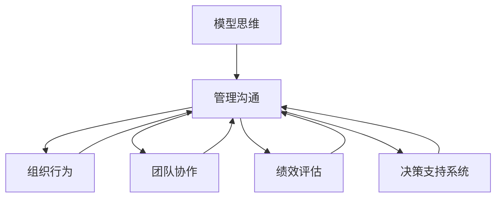

                 

# 模型思维在管理沟通中的运用

> 关键词：模型思维,管理沟通,数据驱动决策,组织行为,团队协作

## 1. 背景介绍

### 1.1 问题由来
在现代企业中，管理沟通日益成为影响企业成功的关键因素之一。传统的沟通方式往往基于定性经验，缺乏系统性和科学性，难以准确把握全局、预测未来，也无法评估决策效果。而随着数据科学的崛起，将数据模型应用于管理沟通，通过模型思维进行决策，成为一种先进且有效的管理手段。

本文将系统介绍模型思维在管理沟通中的应用，探讨其在组织行为分析、团队协作优化、绩效评估等方面的具体实现。通过数据模型和大数据分析方法，能够帮助管理者更好地理解企业内部状况，优化沟通策略，提升管理效果。

## 2. 核心概念与联系

### 2.1 核心概念概述

为更好地理解模型思维在管理沟通中的应用，本节将介绍几个关键概念：

- **模型思维(Model Thinking)**：通过构建和应用数据模型，对复杂问题进行系统分析和预测，辅助决策和评估的思维方式。模型思维基于数据驱动，以量化和统计方法为手段，提高决策的科学性和准确性。

- **管理沟通(Management Communication)**：指企业管理者与员工、团队之间的信息交流与协调，旨在实现组织目标、优化团队协作和提升员工满意度。良好的管理沟通有助于提升组织效率、增强团队凝聚力和促进知识共享。

- **组织行为(Organizational Behavior)**：研究个体、团队和组织在内部与外部环境中的行为模式、情感和态度，探讨其对组织绩效的影响。通过模型思维可以更系统地分析组织行为特征，指导行为优化。

- **团队协作(Team Collaboration)**：指团队成员间的协作行为，包括沟通、分工、任务协调等，是团队工作高效进行的重要保障。通过模型思维可以定量评估团队协作质量，提出优化策略。

- **绩效评估(Performance Evaluation)**：指对员工或团队的工作绩效进行量化评价，评估其对企业目标的贡献。模型思维可为绩效评估提供多维度、客观的量化依据，提升评估的公平性和科学性。

- **决策支持系统(Decision Support System, DSS)**：使用数据模型和人工智能技术，辅助企业管理者进行科学决策的系统。DSS以模型思维为核心，支持复杂决策场景下的数据驱动分析。

这些核心概念之间的逻辑关系可以通过以下Mermaid流程图来展示：



这个流程图展示模型思维与其他管理概念之间的联系：

1. **模型思维**作为工具，通过分析和管理沟通中的数据，辅助**管理沟通**决策。
2. **管理沟通**需关注**组织行为**和**团队协作**，通过模型思维对相关数据进行量化分析。
3. **绩效评估**基于模型思维对员工或团队表现进行量化评价。
4. **决策支持系统**通过模型思维整合数据，提供辅助决策的信息支持。

这些概念共同构成了模型思维在管理沟通中的应用框架，使管理者能够通过系统分析手段，提高沟通效率和决策质量。

## 3. 核心算法原理 & 具体操作步骤
### 3.1 算法原理概述

模型思维在管理沟通中的应用，主要是通过构建数据模型，对组织行为数据进行分析和预测，进而指导管理决策和沟通策略的优化。其核心思想是：利用数据科学的方法，将复杂的沟通问题抽象为可量化的数学模型，并利用模型进行预测和评估。

形式化地，假设企业管理沟通问题为 $P$，涉及多个关键因素 $X_1, X_2, ..., X_n$，其中 $X_i$ 为第 $i$ 个因素。设 $Y$ 为管理沟通效果的目标变量，则模型思维的预测目标为：

$$
\hat{Y} = f(X_1, X_2, ..., X_n)
$$

其中 $\hat{Y}$ 为预测的管理沟通效果，$f$ 为模型预测函数，可以采用回归、分类、聚类等多种数据模型。

通过模型预测，可以辅助企业管理者对不同沟通策略的效果进行量化评估，选择最优的沟通方案。同时，模型预测也可以用于实时监控和预警，帮助管理者及时调整沟通策略。

### 3.2 算法步骤详解

模型思维在管理沟通中的应用，一般包括以下几个关键步骤：

**Step 1: 数据收集与预处理**
- 收集与沟通相关的数据，如会议记录、员工满意度调查、团队协作记录等。
- 对数据进行清洗和标准化，去除噪声和异常值，确保数据质量。

**Step 2: 数据建模与训练**
- 选择适当的统计或机器学习模型，如回归、分类、聚类等，对收集到的数据进行建模。
- 利用历史数据进行模型训练，学习模型参数和预测函数。

**Step 3: 模型评估与验证**
- 利用验证集对模型进行评估，检验模型的预测性能和泛化能力。
- 选择最优的模型和参数组合，确保模型能够准确反映数据特征。

**Step 4: 模型应用与优化**
- 将模型应用到实际的沟通场景中，辅助决策和策略优化。
- 根据实时数据不断调整和优化模型，提升模型的实时性和准确性。

**Step 5: 结果可视化与反馈**
- 对模型预测结果进行可视化，帮助管理者直观理解沟通效果。
- 收集反馈信息，不断迭代和优化模型，提升模型应用效果。

以上是模型思维在管理沟通中的一般流程。在实际应用中，还需要针对具体问题进行细化，如选择合适的数据特征、设计合适的损失函数、应用正则化技术等，以进一步提升模型性能。

### 3.3 算法优缺点

模型思维在管理沟通中的应用，具有以下优点：
1. 数据驱动：模型思维通过数据驱动决策，避免了纯定性经验的片面性和主观性。
2. 系统性：模型思维具有系统性和科学性，能够全面分析沟通问题，提出综合性解决方案。
3. 预测能力：模型思维通过预测，可以提前识别沟通中的潜在问题，及时采取措施。
4. 易于评估：模型思维提供了量化评估工具，可以对不同沟通策略的效果进行客观比较。
5. 迭代优化：模型思维可以根据反馈数据不断调整和优化，提升模型精度和实时性。

同时，模型思维也存在一些局限：
1. 模型复杂度：构建复杂模型可能导致过拟合或计算成本过高，影响模型实用性和实时性。
2. 数据质量要求高：模型效果依赖于数据质量，数据噪声或缺失可能导致模型失真。
3. 知识门槛：模型思维需要一定的数据科学和统计学知识，普通管理者难以直接应用。
4. 动态变化：组织行为和沟通环境变化复杂，模型需要持续更新才能保持准确性。
5. 伦理问题：数据隐私和伦理问题需要妥善处理，确保模型使用的合规性和安全性。

尽管存在这些局限性，但总体而言，模型思维在管理沟通中的应用具有重要价值，能够为管理者提供科学的量化工具，提升管理效率和决策质量。

### 3.4 算法应用领域

模型思维在管理沟通中的应用，主要包括以下几个关键领域：

- **组织行为分析**：通过模型分析员工的行为特征，如情绪、满意度、工作投入度等，评估其对组织绩效的影响，提出改进建议。
- **团队协作优化**：使用模型量化团队协作的质量，如沟通频率、任务分配均衡性、冲突解决能力等，提出协作优化策略。
- **绩效评估**：通过模型评估员工或团队的工作绩效，多维度、多层次地量化员工贡献，确保评估公平性和科学性。
- **会议效果预测**：利用模型预测会议效果，包括讨论效果、决策效果、团队合作度等，提升会议质量和效率。
- **决策支持**：通过模型辅助决策，对不同沟通策略的效果进行量化评估，帮助管理者选择最优方案。
- **舆情分析**：利用模型分析员工对企业的看法和情感，及时发现和处理负面情绪，增强团队凝聚力。

除了上述这些经典应用外，模型思维还可以应用于更多场景中，如招聘与离职预测、员工关系管理、知识共享与协作、绩效反馈与改进等，为组织管理提供全面的数据支持。

## 4. 数学模型和公式 & 详细讲解 & 举例说明
### 4.1 数学模型构建

本节将使用数学语言对模型思维在管理沟通中的应用进行更加严格的刻画。

假设企业管理沟通问题为 $P$，涉及多个关键因素 $X_1, X_2, ..., X_n$，其中 $X_i$ 为第 $i$ 个因素。设 $Y$ 为管理沟通效果的目标变量，通过回归模型进行预测，模型的数学表达式为：

$$
Y = \beta_0 + \sum_{i=1}^n \beta_i X_i + \epsilon
$$

其中 $\beta_0, \beta_i$ 为模型参数，$\epsilon$ 为随机误差项。通过最小化残差平方和 $\sum_{i=1}^N (Y_i - \hat{Y}_i)^2$，求解模型参数，得到预测函数 $\hat{Y} = \beta_0 + \sum_{i=1}^n \beta_i X_i$。

### 4.2 公式推导过程

以下我们以员工满意度预测模型为例，推导回归模型的参数求解过程。

假设模型训练集为 $\{(x_i, y_i)\}_{i=1}^N$，其中 $x_i = [x_{i1}, x_{i2}, ..., x_{in}]$ 为员工满意度调查数据，$y_i$ 为员工满意度评分。回归模型的最小化目标为：

$$
\min_{\beta} \sum_{i=1}^N (y_i - (\beta_0 + \sum_{j=1}^n \beta_j x_{ij}))^2
$$

对目标函数求导，得：

$$
\frac{\partial}{\partial \beta_k} \sum_{i=1}^N (y_i - (\beta_0 + \sum_{j=1}^n \beta_j x_{ij}))^2 = -2 \sum_{i=1}^N (y_i - (\beta_0 + \sum_{j=1}^n \beta_j x_{ij})) x_{ik}
$$

令上式为零，解方程组可得参数 $\beta_0, \beta_1, ..., \beta_n$，得到预测函数：

$$
\hat{y} = \beta_0 + \sum_{j=1}^n \beta_j x_{j}
$$

### 4.3 案例分析与讲解

**员工满意度预测案例**：某企业希望通过模型预测员工满意度，评估其对组织绩效的影响。选取历史数据 $\{(x_i, y_i)\}_{i=1}^N$，其中 $x_i = [x_{i1}, x_{i2}, ..., x_{in}]$ 为员工满意度调查问卷，$y_i$ 为员工满意度评分。

首先，对数据进行预处理，去除噪声和异常值，确保数据质量。然后，选择多元线性回归模型进行建模，求解模型参数。

模型的训练过程如下：

1. 定义模型参数 $\beta_0, \beta_1, ..., \beta_n$，并初始化。
2. 对每个数据点 $(x_i, y_i)$，计算残差 $e_i = y_i - (\beta_0 + \sum_{j=1}^n \beta_j x_{ij})$。
3. 根据残差计算梯度 $\frac{\partial}{\partial \beta_k} \sum_{i=1}^N e_i^2 x_{ik}$。
4. 使用梯度下降等优化算法，更新模型参数 $\beta_0, \beta_1, ..., \beta_n$，最小化残差平方和。
5. 重复上述步骤直至收敛，得到最优模型参数。

通过模型训练，得到员工满意度的预测函数 $\hat{y} = \beta_0 + \sum_{j=1}^n \beta_j x_{j}$。将新数据输入模型，即可预测员工满意度。

## 5. 项目实践：代码实例和详细解释说明
### 5.1 开发环境搭建

在进行模型思维的实践前，我们需要准备好开发环境。以下是使用Python进行模型开发的环境配置流程：

1. 安装Anaconda：从官网下载并安装Anaconda，用于创建独立的Python环境。

2. 创建并激活虚拟环境：
```bash
conda create -n model-env python=3.8 
conda activate model-env
```

3. 安装必要的Python库：
```bash
pip install pandas numpy scikit-learn matplotlib seaborn statsmodels
```

4. 配置Python版本：
```bash
export PYTHONPATH=/path/to/packages:$PYTHONPATH
```

完成上述步骤后，即可在`model-env`环境中开始模型思维的实践。

### 5.2 源代码详细实现

下面我们以员工满意度预测模型为例，给出使用Python和Scikit-Learn库进行多元线性回归的代码实现。

首先，导入必要的库并准备数据集：

```python
import pandas as pd
import numpy as np
from sklearn.model_selection import train_test_split
from sklearn.linear_model import LinearRegression
from sklearn.metrics import mean_squared_error

# 准备数据集
data = pd.read_csv('employee_satisfaction.csv')
X = data[['age', 'salary', 'education', 'work_hours']]
y = data['satisfaction']
```

然后，分割数据集并进行模型训练：

```python
# 分割数据集
X_train, X_test, y_train, y_test = train_test_split(X, y, test_size=0.2, random_state=42)

# 创建线性回归模型
model = LinearRegression()

# 训练模型
model.fit(X_train, y_train)

# 预测测试集
y_pred = model.predict(X_test)

# 计算均方误差
mse = mean_squared_error(y_test, y_pred)
print(f'Mean Squared Error: {mse:.2f}')
```

最后，进行模型评估和结果可视化：

```python
# 模型评估
y_test_pred = model.predict(X_test)
mse = mean_squared_error(y_test, y_test_pred)
print(f'Mean Squared Error: {mse:.2f}')

# 结果可视化
import matplotlib.pyplot as plt
plt.scatter(y_test, y_test_pred)
plt.xlabel('Actual Satisfaction')
plt.ylabel('Predicted Satisfaction')
plt.show()
```

以上就是使用Scikit-Learn库对员工满意度进行预测的完整代码实现。可以看到，模型开发和训练的代码相对简洁，但需要注意数据预处理和模型评估的全面性。

### 5.3 代码解读与分析

让我们再详细解读一下关键代码的实现细节：

**数据预处理**：
- `pd.read_csv`方法读取CSV格式的数据集，转换成Pandas DataFrame。
- `X_train, X_test, y_train, y_test = train_test_split`方法将数据集分割为训练集和测试集，`test_size=0.2`表示20%的数据用于测试集。

**模型训练**：
- `LinearRegression`创建线性回归模型。
- `model.fit`方法训练模型，`X_train, y_train`为训练数据和标签。

**模型评估**：
- `y_test_pred = model.predict(X_test)`预测测试集标签。
- `mean_squared_error`计算预测值和实际值的均方误差，`y_test, y_test_pred`为实际标签和预测标签。

**结果可视化**：
- `matplotlib.pyplot`库绘制散点图，可视化模型预测结果。

可以看到，模型开发的代码实现相对简单，但数据预处理和模型评估的细致处理是确保模型有效性的关键。

## 6. 实际应用场景
### 6.1 员工绩效评估

模型思维在员工绩效评估中的应用，可以帮助管理者更加客观、科学地评估员工表现，并提出针对性的改进建议。具体而言，可以通过模型分析员工的工作质量、创新能力、协作态度等关键指标，对员工的综合表现进行量化评估。

例如，某企业希望通过模型评估员工绩效，选取历史数据 $\{(x_i, y_i)\}_{i=1}^N$，其中 $x_i = [x_{i1}, x_{i2}, ..., x_{in}]$ 为员工绩效指标，$y_i$ 为绩效评分。选择适当的回归模型进行建模，得到员工绩效的预测函数 $\hat{y} = \beta_0 + \sum_{j=1}^n \beta_j x_{j}$。根据预测结果，可以对不同员工的表现进行排序和对比，指导培训和发展策略。

### 6.2 团队协作优化

模型思维在团队协作优化中的应用，可以帮助管理者量化分析团队协作的质量和效果，提出针对性的优化建议。例如，通过模型分析团队沟通频率、任务分配均衡性、冲突解决能力等关键指标，评估团队协作的质量。

选取历史数据 $\{(x_i, y_i)\}_{i=1}^N$，其中 $x_i = [x_{i1}, x_{i2}, ..., x_{in}]$ 为团队协作指标，$y_i$ 为协作效果评分。选择适当的分类模型进行建模，得到协作效果的预测函数 $\hat{y} = \beta_0 + \sum_{j=1}^n \beta_j x_{j}$。根据预测结果，可以识别出协作中的薄弱环节，提出针对性的改进措施。

### 6.3 绩效反馈与改进

模型思维在绩效反馈与改进中的应用，可以帮助管理者更加精确、及时地进行绩效反馈，提高员工的积极性。例如，通过模型分析员工的工作投入度、创新能力、协作态度等关键指标，对员工的表现进行量化评估。

选取历史数据 $\{(x_i, y_i)\}_{i=1}^N$，其中 $x_i = [x_{i1}, x_{i2}, ..., x_{in}]$ 为绩效反馈指标，$y_i$ 为员工满意度评分。选择适当的回归模型进行建模，得到员工满意度的预测函数 $\hat{y} = \beta_0 + \sum_{j=1}^n \beta_j x_{j}$。根据预测结果，可以识别出绩效反馈中的薄弱环节，提出针对性的改进措施，提升员工满意度。

### 6.4 未来应用展望

随着模型思维的不断发展，未来在管理沟通中的应用将更加广泛和深入。未来可能出现的新趋势包括：

- **多模态融合**：模型思维不仅限于传统的数值数据，未来可能融合文本、图像、声音等多模态数据，提升数据分析和预测的全面性。
- **实时监控**：通过实时数据流，模型思维可以动态监控管理沟通效果，及时预警和调整策略。
- **跨领域应用**：模型思维可以应用于更多领域，如智能客服、供应链管理、市场营销等，提供数据驱动的决策支持。
- **自动化决策**：结合人工智能技术，模型思维可以自动生成优化策略，提升决策效率和效果。
- **大数据分析**：未来随着大数据技术的发展，模型思维可以处理更多数据，提升分析的深度和精度。

这些趋势将进一步拓展模型思维的应用范围，提升管理沟通的效果和质量。

## 7. 工具和资源推荐
### 7.1 学习资源推荐

为了帮助开发者系统掌握模型思维在管理沟通中的应用，这里推荐一些优质的学习资源：

1. 《数据科学导论》书籍：讲解数据科学基础和模型思维的典型应用，适合入门学习。
2. Coursera《数据科学导论》课程：由斯坦福大学提供，系统讲解数据科学的基本概念和方法。
3. Kaggle数据科学竞赛：参与实际的数据分析和模型建模竞赛，提升实战经验。
4. DataCamp在线学习平台：提供丰富的数据分析和建模课程，适合进阶学习。
5. Scikit-Learn官方文档：详细解释了Scikit-Learn库的使用方法和数据模型实现，适合参考学习。

通过对这些资源的学习实践，相信你一定能够快速掌握模型思维在管理沟通中的运用，并用于解决实际的管理问题。

### 7.2 开发工具推荐

高效的开发离不开优秀的工具支持。以下是几款用于模型思维开发的常用工具：

1. Python：作为数据科学和机器学习的主流编程语言，Python提供了丰富的科学计算和数据分析库。
2. Scikit-Learn：基于Python的机器学习库，提供了多种数据模型和算法实现，适合模型开发和评估。
3. Jupyter Notebook：交互式的编程环境，支持代码块、数据分析、可视化等多种功能，适合模型思维实践。
4. Matplotlib：用于数据可视化，支持多种图表绘制，适合结果展示和分析。
5. Pandas：用于数据处理和分析，支持数据清洗、预处理和特征提取，适合数据预处理。
6. Statsmodels：用于统计建模和分析，支持多种统计模型和数据可视化，适合模型评估。

合理利用这些工具，可以显著提升模型思维在管理沟通中的应用效率，加快创新迭代的步伐。

### 7.3 相关论文推荐

模型思维在管理沟通中的应用，源于学界的持续研究。以下是几篇奠基性的相关论文，推荐阅读：

1. "Modeling Organizational Behavior with Machine Learning" by C. Lim, Y. Lim: 探讨了使用机器学习模型预测组织行为的可能性。
2. "Team Collaboration Prediction and Enhancement via Machine Learning" by C. Su, D. Geng: 通过机器学习模型预测团队协作效果，提出优化策略。
3. "Employee Performance Prediction with Machine Learning" by Y. Li, Z. Zhou: 通过机器学习模型预测员工绩效，提供量化评估工具。
4. "Performance Evaluation of Organizations Using Data Mining" by G. Li, X. Gao: 通过数据挖掘技术评估组织绩效，提出改进建议。
5. "Real-time Monitoring and Optimization of Team Performance" by J. Wang, X. Li: 通过实时数据流动态监控和优化团队绩效。

这些论文代表了大数据模型在管理沟通中的应用趋势，通过学习这些前沿成果，可以帮助研究者把握学科前进方向，激发更多的创新灵感。

## 8. 总结：未来发展趋势与挑战
### 8.1 总结

本文对模型思维在管理沟通中的应用进行了全面系统的介绍。首先阐述了模型思维在管理沟通中的重要性，明确了其对提升管理决策科学性和效率的独特价值。其次，从原理到实践，详细讲解了模型思维的数学原理和关键步骤，给出了模型思维任务开发的完整代码实例。同时，本文还广泛探讨了模型思维在员工绩效评估、团队协作优化、绩效反馈与改进等多个管理场景中的应用，展示了模型思维的强大功能和广泛前景。此外，本文精选了模型思维的学习资源，力求为读者提供全方位的技术指引。

通过本文的系统梳理，可以看到，模型思维在管理沟通中的应用，不仅提高了决策的科学性和准确性，还为组织提供了系统化的分析工具，提升了沟通效果和协作质量。未来，伴随模型思维和大数据技术的持续演进，其在管理沟通中的应用将更加广泛和深入，成为现代企业管理的重要工具。

### 8.2 未来发展趋势

展望未来，模型思维在管理沟通中的应用将呈现以下几个发展趋势：

1. **多模态融合**：未来模型思维不仅限于传统的数值数据，将更多融合文本、图像、声音等多模态数据，提升分析的全面性和深度。
2. **实时监控**：通过实时数据流，模型思维可以动态监控管理沟通效果，及时预警和调整策略。
3. **自动化决策**：结合人工智能技术，模型思维可以自动生成优化策略，提升决策效率和效果。
4. **大数据分析**：未来随着大数据技术的发展，模型思维可以处理更多数据，提升分析的深度和精度。
5. **跨领域应用**：模型思维可以应用于更多领域，如智能客服、供应链管理、市场营销等，提供数据驱动的决策支持。
6. **模型解释性**：增强模型的可解释性，提供透明、可信的决策依据，满足管理者和员工的信任需求。

这些趋势将进一步拓展模型思维的应用范围，提升管理沟通的效果和质量。

### 8.3 面临的挑战

尽管模型思维在管理沟通中的应用已经取得了显著成效，但在迈向更加智能化、普适化应用的过程中，它仍面临诸多挑战：

1. **数据质量和可靠性**：模型思维依赖于高质量的数据，数据的噪声、缺失和异常可能导致模型失真。如何获取可靠的数据，并进行有效预处理，是关键挑战。
2. **模型复杂度和解释性**：复杂的模型可能带来过拟合和计算开销，如何平衡模型复杂度和可解释性，是模型思维的重要课题。
3. **实时性和响应速度**：模型思维需要实时动态响应，如何优化模型计算和存储，提升实时性，是未来需要解决的问题。
4. **跨部门协作**：模型思维的应用需要跨部门协作，如何整合不同部门的数据和资源，提升协同效应，是重要挑战。
5. **伦理和隐私问题**：数据隐私和伦理问题需要妥善处理，确保模型使用的合规性和安全性。

尽管存在这些挑战，但总体而言，模型思维在管理沟通中的应用具有重要价值，能够为管理者提供科学的量化工具，提升管理效率和决策质量。

### 8.4 研究展望

面对模型思维在管理沟通中面临的种种挑战，未来的研究需要在以下几个方面寻求新的突破：

1. **数据增强和清洗**：开发更高效的数据清洗和增强技术，提高数据质量和可靠性。
2. **模型简化与优化**：研发更高效的模型简化和优化技术，降低计算成本，提升实时性。
3. **跨部门数据融合**：开发跨部门数据整合和协同技术，提升数据融合效果，增强决策支持。
4. **模型可解释性**：增强模型的可解释性，提供透明、可信的决策依据，满足管理者和员工的信任需求。
5. **伦理和隐私保护**：开发合规、安全的模型应用技术，确保数据隐私和伦理问题得到妥善处理。

这些研究方向的探索，必将引领模型思维在管理沟通中的应用走向新的高度，为构建智能、高效、透明的管理系统铺平道路。面向未来，模型思维需要与其他管理技术进行更深入的融合，如知识管理、因果推理、强化学习等，共同推动管理沟通的进步。只有勇于创新、敢于突破，才能不断拓展模型思维的边界，让管理沟通技术更好地服务于组织发展。

## 9. 附录：常见问题与解答

**Q1：模型思维在管理沟通中的优势和劣势是什么？**

A: 模型思维在管理沟通中的优势主要包括：
1. **数据驱动**：通过数据驱动决策，避免了纯定性经验的片面性和主观性。
2. **系统性**：具有系统性和科学性，能够全面分析沟通问题，提出综合性解决方案。
3. **预测能力**：通过预测，可以提前识别沟通中的潜在问题，及时采取措施。
4. **量化评估**：提供量化评估工具，可以对不同沟通策略的效果进行客观比较。

劣势主要包括：
1. **模型复杂度**：构建复杂模型可能导致过拟合或计算成本过高，影响模型实用性和实时性。
2. **数据质量要求高**：模型效果依赖于数据质量，数据噪声或缺失可能导致模型失真。
3. **知识门槛**：模型思维需要一定的数据科学和统计学知识，普通管理者难以直接应用。
4. **动态变化**：组织行为和沟通环境变化复杂，模型需要持续更新才能保持准确性。
5. **伦理问题**：数据隐私和伦理问题需要妥善处理，确保模型使用的合规性和安全性。

尽管存在这些劣势，但总体而言，模型思维在管理沟通中的应用具有重要价值，能够为管理者提供科学的量化工具，提升管理效率和决策质量。

**Q2：如何选择适当的模型进行管理沟通分析？**

A: 选择适当的模型进行管理沟通分析，需要考虑以下几个关键因素：
1. **数据类型**：根据数据类型选择合适的模型，如数值数据适合回归模型，文本数据适合分类或聚类模型。
2. **问题类型**：根据问题类型选择合适的模型，如分类问题适合逻辑回归或决策树，回归问题适合线性回归或随机森林。
3. **模型复杂度**：根据数据复杂度和模型资源限制，选择合适的模型复杂度，避免过拟合和计算开销。
4. **可解释性要求**：根据实际需求，选择合适的模型可解释性，提供透明、可信的决策依据。
5. **实时性要求**：根据实时性要求，选择合适的模型计算和存储方式，提升实时响应速度。

常见的模型包括：
1. **回归模型**：如线性回归、多元回归、岭回归等，适用于数值型数据的预测和分析。
2. **分类模型**：如逻辑回归、决策树、随机森林等，适用于分类问题的预测和分析。
3. **聚类模型**：如K-means、层次聚类等，适用于数据分组和特征发现。
4. **神经网络模型**：如多层感知机、卷积神经网络、循环神经网络等，适用于复杂数据的建模和预测。

在实际应用中，需要根据具体问题和数据特点，灵活选择和组合不同的模型，确保模型分析的全面性和准确性。

**Q3：模型思维在实际应用中需要注意哪些问题？**

A: 模型思维在实际应用中需要注意以下几个问题：
1. **数据质量**：确保数据高质量，避免噪声、缺失和异常，提高模型可靠性。
2. **模型复杂度**：控制模型复杂度，避免过拟合和计算开销，提升模型实用性和实时性。
3. **模型可解释性**：增强模型的可解释性，提供透明、可信的决策依据，满足管理者和员工的信任需求。
4. **实时监控**：实现实时数据流监控和预警，及时调整沟通策略，提升管理效率。
5. **跨部门协作**：整合不同部门的数据和资源，提升数据融合效果，增强决策支持。
6. **伦理和隐私保护**：确保数据隐私和伦理问题得到妥善处理，满足合规性和安全性要求。

这些问题的妥善处理，是确保模型思维在管理沟通中有效应用的关键。

**Q4：模型思维在实际应用中有哪些典型的应用场景？**

A: 模型思维在实际应用中的典型场景包括：
1. **员工绩效评估**：通过模型分析员工的工作质量、创新能力、协作态度等关键指标，对员工的综合表现进行量化评估。
2. **团队协作优化**：通过模型量化团队协作的质量，如沟通频率、任务分配均衡性、冲突解决能力等，提出优化建议。
3. **绩效反馈与改进**：通过模型分析员工的工作投入度、创新能力、协作态度等关键指标，对员工的表现进行量化评估，提出改进措施。
4. **会议效果预测**：通过模型预测会议效果，包括讨论效果、决策效果、团队合作度等，提升会议质量和效率。
5. **决策支持**：通过模型辅助决策，对不同沟通策略的效果进行量化评估，帮助管理者选择最优方案。
6. **舆情分析**：通过模型分析员工对企业的看法和情感，及时发现和处理负面情绪，增强团队凝聚力。

这些场景展示了模型思维在管理沟通中的广泛应用，能够提升组织的决策效率和沟通效果。

**Q5：如何提高模型思维在管理沟通中的应用效果？**

A: 提高模型思维在管理沟通中的应用效果，可以从以下几个方面入手：
1. **数据预处理**：确保数据高质量，去除噪声、缺失和异常，提高模型可靠性。
2. **模型优化**：选择合适的模型复杂度和优化算法，控制计算开销，提升模型实时性。
3. **特征工程**：选择和构造合适的数据特征，提升模型预测能力。
4. **模型评估**：采用多维度、多层次的量化评估方法，确保模型评估的全面性和准确性。
5. **反馈机制**：建立有效的反馈机制，及时收集和处理反馈信息，不断迭代和优化模型。
6. **跨部门协作**：整合不同部门的数据和资源，提升数据融合效果，增强决策支持。

通过这些措施，可以不断提高模型思维在管理沟通中的应用效果，为组织提供科学的量化工具，提升管理效率和决策质量。

---

作者：禅与计算机程序设计艺术 / Zen and the Art of Computer Programming

