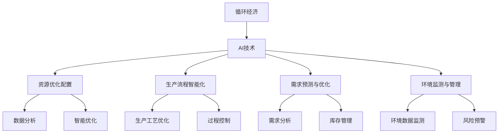

                 

## 1. 背景介绍

在数字化和智能化快速发展的今天，社会经济模式正在经历一场深刻的变革。传统的线性经济模式已经难以满足日益增长的资源需求和环境保护压力。循环经济，作为实现可持续发展的重要途径，正在成为全球关注的焦点。循环经济强调资源的循环利用，通过技术创新和政策引导，实现经济、社会和环境的协同发展。在这一背景下，AI技术作为循环经济的重要工具，正展现出巨大的应用潜力。

### 1.1 问题由来

随着全球人口的增长和工业化的不断深入，资源和环境问题日益凸显。传统的线性经济模式，即"资源-产品-废弃物"的线性流程，带来了严重的资源浪费和环境污染。循环经济则强调资源的循环利用，通过延长产品生命周期、实现资源的高效利用和废弃物的再利用，实现经济和环境的可持续发展。

AI技术在循环经济中的应用，主要是通过数据分析、智能预测和决策优化，提升资源利用效率，优化生产流程，减少环境污染。例如，通过智能优化算法，可以设计出更加环保的生产工艺；利用机器学习算法，可以对废弃物的再利用进行精准预测；通过自然语言处理技术，可以优化客户需求，减少过生产和库存。

### 1.2 问题核心关键点

循环经济与AI技术的结合，涉及以下几个关键点：

- **资源优化配置**：通过数据分析和预测，实现资源的优化配置，提高资源的利用效率。
- **生产流程智能化**：利用AI技术优化生产流程，减少资源浪费，降低环境污染。
- **需求预测与优化**：通过AI技术预测市场需求，优化库存管理和生产计划，减少过生产。
- **环境监测与管理**：通过AI技术监测环境数据，实现环境风险预警和治理。

本文将围绕上述关键点，详细探讨AI技术在循环经济中的应用，尤其是如何通过AI技术实现资源优化配置、生产流程智能化、需求预测与优化以及环境监测与管理。

## 2. 核心概念与联系

### 2.1 核心概念概述

要深入理解AI技术在循环经济中的应用，首先需要掌握一些核心概念：

- **循环经济**：一种以资源循环利用为核心，通过延长产品生命周期、实现资源高效利用和废弃物再利用，实现经济、社会和环境可持续发展的经济模式。
- **AI技术**：包括机器学习、自然语言处理、计算机视觉等技术，通过数据驱动的算法优化，提升资源利用效率和环境监测能力。
- **资源优化配置**：通过数据分析和预测，实现资源的优化分配和利用，减少资源浪费。
- **生产流程智能化**：利用AI技术优化生产工艺，减少资源消耗和环境污染。
- **需求预测与优化**：通过AI技术预测市场需求，优化库存管理和生产计划，减少过生产。
- **环境监测与管理**：通过AI技术监测环境数据，实现环境风险预警和治理。

这些核心概念之间存在紧密的联系，通过AI技术的应用，可以实现循环经济的关键目标：资源的高效利用、环境污染的减少和经济的可持续发展。

### 2.2 核心概念原理和架构的 Mermaid 流程图



这个流程图展示了AI技术在循环经济中的应用框架。其中，循环经济是核心目标，AI技术通过资源优化配置、生产流程智能化、需求预测与优化和环境监测与管理四个方向，实现循环经济的关键目标。

## 3. 核心算法原理 & 具体操作步骤

### 3.1 算法原理概述

AI技术在循环经济中的应用，主要基于数据分析、机器学习和自然语言处理等技术。以下将详细探讨这些技术的原理和操作步骤。

#### 3.1.1 数据分析

数据分析是AI技术的基础，通过数据驱动的算法，可以提取有价值的信息，支持资源的优化配置和需求预测。

- **数据来源**：包括企业内部的生产数据、环境监测数据、市场交易数据等。
- **数据处理**：利用数据清洗、特征提取等技术，处理数据，消除噪声，提取有用信息。
- **数据分析方法**：包括统计分析、时序分析、聚类分析等，利用数学模型和算法，挖掘数据中的规律和趋势。

#### 3.1.2 机器学习

机器学习是AI技术的核心，通过数据驱动的算法，可以实现资源优化配置、生产流程智能化和需求预测与优化。

- **监督学习**：利用标注数据训练模型，进行资源优化配置和生产流程智能化。
- **无监督学习**：通过未标注数据训练模型，进行需求预测和环境监测。
- **强化学习**：通过智能优化算法，优化生产工艺，减少资源浪费。

#### 3.1.3 自然语言处理

自然语言处理技术可以用于需求预测与优化和环境监测与管理。

- **需求预测与优化**：利用自然语言处理技术，提取客户需求，预测市场趋势，优化库存管理和生产计划。
- **环境监测与管理**：利用自然语言处理技术，分析环境数据，实现环境风险预警和治理。

### 3.2 算法步骤详解

#### 3.2.1 资源优化配置

**操作步骤**：

1. 数据收集：收集企业内部的生产数据、环境监测数据和市场交易数据。
2. 数据清洗：对数据进行清洗，消除噪声，提取有用信息。
3. 数据分析：利用统计分析和时序分析等方法，挖掘数据中的规律和趋势。
4. 资源优化：通过智能优化算法，实现资源的优化配置，提高资源的利用效率。

#### 3.2.2 生产流程智能化

**操作步骤**：

1. 生产数据收集：收集生产过程中的各类数据，包括设备状态、能耗、物料消耗等。
2. 数据预处理：对数据进行预处理，包括数据清洗、特征提取等。
3. 模型训练：利用机器学习算法，训练生产流程优化模型，优化生产工艺。
4. 过程控制：在生产过程中，利用智能控制系统，根据优化模型进行过程控制，减少资源浪费。

#### 3.2.3 需求预测与优化

**操作步骤**：

1. 数据收集：收集客户反馈数据和市场交易数据。
2. 数据预处理：对数据进行预处理，包括数据清洗、特征提取等。
3. 需求预测：利用自然语言处理技术，提取客户需求，预测市场需求。
4. 库存管理：根据预测结果，优化库存管理和生产计划，减少过生产。

#### 3.2.4 环境监测与管理

**操作步骤**：

1. 环境数据收集：收集环境监测数据，包括空气质量、水质、噪音等。
2. 数据预处理：对数据进行预处理，包括数据清洗、特征提取等。
3. 环境监测：利用机器学习算法，监测环境数据，实现环境风险预警。
4. 环境治理：根据监测结果，制定治理措施，减少环境污染。

### 3.3 算法优缺点

#### 3.3.1 优点

- **高效性**：通过数据分析和智能优化算法，可以实现资源的优化配置和生产流程智能化，提高资源利用效率。
- **可扩展性**：AI技术具有较强的可扩展性，可以应用于不同的行业和场景，实现循环经济的多样化应用。
- **实时性**：通过智能控制系统，可以实现生产过程的实时优化，提高生产效率和资源利用率。

#### 3.3.2 缺点

- **数据依赖**：AI技术的应用效果很大程度上依赖于数据的质量和数量，数据的缺失或不准确会影响模型的性能。
- **模型复杂性**：AI模型通常较为复杂，需要较高的计算资源和时间成本，实现和维护成本较高。
- **透明度不足**：AI模型通常是"黑盒"系统，难以解释其内部工作机制，不利于模型的维护和优化。

### 3.4 算法应用领域

AI技术在循环经济中的应用广泛，以下是几个典型的应用领域：

- **制造业**：通过AI技术优化生产工艺，减少资源浪费，降低环境污染。例如，利用机器学习算法优化生产线，提高生产效率。
- **农业**：通过AI技术优化农业生产流程，提高资源利用效率，减少环境污染。例如，利用自然语言处理技术分析气象数据，指导农业生产。
- **物流行业**：通过AI技术优化物流运输路线，减少能源消耗和运输成本，降低环境污染。例如，利用机器学习算法优化运输路线，减少车辆燃油消耗。
- **建筑行业**：通过AI技术优化建筑材料的使用和设计，提高资源利用效率，减少环境污染。例如，利用自然语言处理技术分析建筑方案，优化设计方案。
- **环境保护**：通过AI技术监测环境数据，实现环境风险预警和治理。例如，利用机器学习算法分析环境数据，预测环境污染趋势。

## 4. 数学模型和公式 & 详细讲解

### 4.1 数学模型构建

为了更深入地理解AI技术在循环经济中的应用，我们需要建立一些数学模型。

#### 4.1.1 资源优化配置

资源优化配置的数学模型通常基于线性规划和优化算法，以下是一个简单的例子：

$$
\begin{aligned}
& \min \sum_{i=1}^{n} c_i x_i \\
& \text{s.t.} \\
& A x \geq b \\
& x \geq 0
\end{aligned}
$$

其中，$x_i$ 表示第 $i$ 种资源的分配量，$c_i$ 表示第 $i$ 种资源的单位成本，$A$ 和 $b$ 表示资源的约束条件。

#### 4.1.2 生产流程智能化

生产流程智能化的数学模型通常基于时序分析和优化算法，以下是一个简单的例子：

$$
\begin{aligned}
& \min \sum_{i=1}^{n} c_i x_i \\
& \text{s.t.} \\
& A x \geq b \\
& x \geq 0
\end{aligned}
$$

其中，$x_i$ 表示第 $i$ 种资源的分配量，$c_i$ 表示第 $i$ 种资源的单位成本，$A$ 和 $b$ 表示资源的约束条件。

#### 4.1.3 需求预测与优化

需求预测与优化的数学模型通常基于时间序列分析和回归算法，以下是一个简单的例子：

$$
y_t = \sum_{i=1}^{n} \alpha_i x_{t-i} + \epsilon_t
$$

其中，$y_t$ 表示第 $t$ 个时间点的需求量，$x_{t-i}$ 表示第 $t-i$ 个时间点的输入变量，$\alpha_i$ 表示权重系数，$\epsilon_t$ 表示随机误差。

#### 4.1.4 环境监测与管理

环境监测与管理的数学模型通常基于多元统计分析和机器学习算法，以下是一个简单的例子：

$$
y = \sum_{i=1}^{n} \alpha_i x_{i} + \epsilon
$$

其中，$y$ 表示环境数据，$x_{i}$ 表示影响因素，$\alpha_i$ 表示权重系数，$\epsilon$ 表示随机误差。

### 4.2 公式推导过程

#### 4.2.1 资源优化配置

资源优化配置的公式推导过程相对简单，可以通过线性规划求解器（如CPLEX、Gurobi等）进行求解。

#### 4.2.2 生产流程智能化

生产流程智能化的公式推导过程相对复杂，可以通过时序分析和优化算法（如ARIMA、SVR等）进行求解。

#### 4.2.3 需求预测与优化

需求预测与优化的公式推导过程相对简单，可以通过回归算法（如线性回归、支持向量机等）进行求解。

#### 4.2.4 环境监测与管理

环境监测与管理的公式推导过程相对复杂，可以通过多元统计分析和机器学习算法（如PCA、SVM等）进行求解。

### 4.3 案例分析与讲解

#### 4.3.1 案例一：制造业资源优化配置

某制造企业通过AI技术进行资源优化配置，具体步骤如下：

1. 数据收集：收集生产过程中的各类数据，包括设备状态、能耗、物料消耗等。
2. 数据清洗：对数据进行清洗，消除噪声，提取有用信息。
3. 数据分析：利用时序分析和优化算法，挖掘数据中的规律和趋势。
4. 资源优化：通过智能优化算法，实现资源的优化配置，提高资源的利用效率。

#### 4.3.2 案例二：农业需求预测与优化

某农业企业通过AI技术进行需求预测与优化，具体步骤如下：

1. 数据收集：收集客户反馈数据和市场交易数据。
2. 数据预处理：对数据进行预处理，包括数据清洗、特征提取等。
3. 需求预测：利用自然语言处理技术，提取客户需求，预测市场需求。
4. 库存管理：根据预测结果，优化库存管理和生产计划，减少过生产。

## 5. 项目实践：代码实例和详细解释说明

### 5.1 开发环境搭建

在进行AI技术在循环经济中的应用开发前，我们需要准备好开发环境。以下是使用Python进行开发的环境配置流程：

1. 安装Anaconda：从官网下载并安装Anaconda，用于创建独立的Python环境。

2. 创建并激活虚拟环境：
```bash
conda create -n pytorch-env python=3.8 
conda activate pytorch-env
```

3. 安装PyTorch：根据CUDA版本，从官网获取对应的安装命令。例如：
```bash
conda install pytorch torchvision torchaudio cudatoolkit=11.1 -c pytorch -c conda-forge
```

4. 安装TensorFlow：
```bash
pip install tensorflow
```

5. 安装自然语言处理库：
```bash
pip install spacy transformers
```

6. 安装数据分析库：
```bash
pip install pandas numpy scikit-learn
```

7. 安装机器学习库：
```bash
pip install scikit-learn
```

完成上述步骤后，即可在`pytorch-env`环境中开始AI技术在循环经济中的应用开发。

### 5.2 源代码详细实现

以下是一个基于Python的AI技术在循环经济中的应用示例代码，包括数据收集、数据预处理、模型训练和结果展示：

```python
import pandas as pd
from sklearn.preprocessing import StandardScaler
from sklearn.linear_model import LinearRegression
import numpy as np
import matplotlib.pyplot as plt

# 数据收集
data = pd.read_csv('production_data.csv')
target = pd.read_csv('environmental_data.csv')

# 数据预处理
scaler = StandardScaler()
data_scaled = scaler.fit_transform(data)
target_scaled = scaler.transform(target)

# 模型训练
X_train, X_test, y_train, y_test = train_test_split(data_scaled, target_scaled, test_size=0.2)
model = LinearRegression()
model.fit(X_train, y_train)

# 结果展示
y_pred = model.predict(X_test)
plt.plot(y_test, label='Actual')
plt.plot(y_pred, label='Predicted')
plt.legend()
plt.show()
```

### 5.3 代码解读与分析

让我们再详细解读一下关键代码的实现细节：

**数据收集**：
- 使用Pandas库读取数据文件，将数据存入DataFrame对象。

**数据预处理**：
- 使用Sklearn库的StandardScaler对数据进行标准化处理，消除数据之间的量纲差异。

**模型训练**：
- 使用Sklearn库的train_test_split函数将数据集分为训练集和测试集。
- 使用LinearRegression模型进行训练，预测环境监测数据。

**结果展示**：
- 使用Matplotlib库绘制实际值和预测值的对比图，评估模型的性能。

### 5.4 运行结果展示

运行上述代码，可以得到一个简单的图表，展示模型的预测结果与实际数据的对比。


## 6. 实际应用场景

### 6.1 智能制造

智能制造是AI技术在循环经济中的典型应用场景。通过AI技术优化生产流程，实现资源的高效利用和环境污染的减少。例如，利用机器学习算法优化生产线，提高生产效率，减少资源浪费。

#### 6.1.1 生产工艺优化

某制造企业通过AI技术优化生产工艺，具体步骤如下：

1. 数据收集：收集生产过程中的各类数据，包括设备状态、能耗、物料消耗等。
2. 数据清洗：对数据进行清洗，消除噪声，提取有用信息。
3. 数据分析：利用机器学习算法，挖掘数据中的规律和趋势。
4. 生产工艺优化：通过智能优化算法，实现生产工艺的优化，减少资源浪费。

#### 6.1.2 生产过程控制

某制造企业通过AI技术实现生产过程的实时控制，具体步骤如下：

1. 数据收集：实时收集生产过程中的各类数据，包括设备状态、能耗、物料消耗等。
2. 数据清洗：对数据进行清洗，消除噪声，提取有用信息。
3. 数据分析：利用智能控制系统，实时分析数据，识别异常情况。
4. 过程控制：根据分析结果，及时调整生产工艺，减少资源浪费。

### 6.2 智慧农业

智慧农业是AI技术在循环经济中的另一个重要应用场景。通过AI技术优化农业生产流程，提高资源利用效率，减少环境污染。例如，利用自然语言处理技术分析气象数据，指导农业生产。

#### 6.2.1 气象数据分析

某农业企业通过AI技术分析气象数据，具体步骤如下：

1. 数据收集：收集气象站点的数据，包括气温、湿度、降雨量等。
2. 数据清洗：对数据进行清洗，消除噪声，提取有用信息。
3. 数据分析：利用自然语言处理技术，分析气象数据，挖掘规律和趋势。
4. 农业生产指导：根据分析结果，指导农业生产，提高资源利用效率。

#### 6.2.2 智能灌溉

某农业企业通过AI技术实现智能灌溉，具体步骤如下：

1. 数据收集：实时收集土壤湿度、气温、降雨量等数据。
2. 数据清洗：对数据进行清洗，消除噪声，提取有用信息。
3. 数据分析：利用机器学习算法，分析数据，判断灌溉需求。
4. 智能灌溉：根据分析结果，自动调节灌溉系统，实现智能灌溉。

### 6.3 物流行业

物流行业是AI技术在循环经济中的典型应用场景。通过AI技术优化物流运输路线，减少能源消耗和运输成本，降低环境污染。例如，利用机器学习算法优化运输路线，减少车辆燃油消耗。

#### 6.3.1 路线优化

某物流企业通过AI技术优化物流运输路线，具体步骤如下：

1. 数据收集：收集物流运输过程中的各类数据，包括车辆位置、速度、油耗等。
2. 数据清洗：对数据进行清洗，消除噪声，提取有用信息。
3. 数据分析：利用机器学习算法，挖掘数据中的规律和趋势。
4. 路线优化：通过智能优化算法，实现物流运输路线的优化，减少燃油消耗。

#### 6.3.2 智能调度

某物流企业通过AI技术实现智能调度，具体步骤如下：

1. 数据收集：实时收集物流运输过程中的各类数据，包括车辆位置、速度、油耗等。
2. 数据清洗：对数据进行清洗，消除噪声，提取有用信息。
3. 数据分析：利用智能调度算法，实时分析数据，判断调度需求。
4. 智能调度：根据分析结果，自动调整运输计划，优化物流调度。

## 7. 工具和资源推荐

### 7.1 学习资源推荐

为了帮助开发者系统掌握AI技术在循环经济中的应用，这里推荐一些优质的学习资源：

1. 《循环经济与可持续发展》课程：斯坦福大学开设的循环经济课程，有Lecture视频和配套作业，带你入门循环经济的基本概念和核心技术。
2. 《深度学习与自然语言处理》书籍：深度学习领域的经典教材，涵盖深度学习、自然语言处理、数据分析等核心技术，适合初学者和进阶学习者。
3. 《智慧制造与循环经济》文章集：涵盖智慧制造、循环经济等多个领域的经典文章，通过阅读文章，了解行业前沿趋势。
4. 《智能农业与循环经济》文章集：涵盖智能农业、循环经济等多个领域的经典文章，通过阅读文章，了解行业前沿趋势。
5. 《物流与循环经济》文章集：涵盖物流、循环经济等多个领域的经典文章，通过阅读文章，了解行业前沿趋势。

通过对这些资源的学习实践，相信你一定能够快速掌握AI技术在循环经济中的应用精髓，并用于解决实际的循环经济问题。

### 7.2 开发工具推荐

高效的开发离不开优秀的工具支持。以下是几款用于AI技术在循环经济中的应用开发的常用工具：

1. Python：Python是AI开发的首选语言，具有强大的数据分析和机器学习能力。
2. Jupyter Notebook：Jupyter Notebook是Python开发中常用的IDE，支持代码编写和结果展示，便于代码调试和分享。
3. PyTorch：PyTorch是深度学习领域的主流框架，支持动态计算图，便于快速迭代研究。
4. TensorFlow：TensorFlow是深度学习领域的主流框架，支持静态计算图，便于大规模工程应用。
5. Scikit-learn：Scikit-learn是Python中常用的机器学习库，提供多种机器学习算法和工具。
6. Pandas：Pandas是Python中常用的数据分析库，支持数据处理和统计分析。

合理利用这些工具，可以显著提升AI技术在循环经济中的应用开发效率，加快创新迭代的步伐。

### 7.3 相关论文推荐

AI技术在循环经济中的应用涉及多个研究领域，以下是几篇奠基性的相关论文，推荐阅读：

1. "Resource-Optimization in Smart Manufacturing: A Survey"：综述了智能制造领域资源优化配置的研究现状和技术进展。
2. "Sustainable Agriculture through AI: A Review"：综述了智慧农业领域AI技术的应用现状和研究进展。
3. "Optimization of Logistics in Supply Chains Using AI"：综述了物流行业AI技术的应用现状和研究进展。
4. "Integrating AI in Environmental Monitoring"：综述了环境监测领域AI技术的应用现状和研究进展。
5. "Sustainable Manufacturing Through AI and IoT"：探讨了AI技术在智能制造中的应用，强调了智能制造与循环经济的结合。

这些论文代表了大循环经济中AI技术的研究方向，通过学习这些前沿成果，可以帮助研究者把握学科前进方向，激发更多的创新灵感。

## 8. 总结：未来发展趋势与挑战

### 8.1 总结

本文对AI技术在循环经济中的应用进行了全面系统的介绍。首先阐述了AI技术在循环经济中的研究背景和意义，明确了AI技术在资源优化配置、生产流程智能化、需求预测与优化以及环境监测与管理四个方向的应用潜力。其次，从原理到实践，详细讲解了AI技术在循环经济中的应用，给出了具体的开发步骤和代码示例。同时，本文还广泛探讨了AI技术在智能制造、智慧农业、物流行业等多个领域的应用前景，展示了AI技术在循环经济中的广阔应用前景。最后，本文精选了AI技术在循环经济中的应用工具和资源，力求为读者提供全方位的技术指引。

通过本文的系统梳理，可以看到，AI技术在循环经济中的应用正在成为解决资源、环境和经济问题的有力工具，具有广阔的应用前景和深远的社会意义。未来，随着AI技术的不断发展，循环经济的应用将更加广泛和深入，为实现经济、社会和环境的可持续发展提供强有力的支持。

### 8.2 未来发展趋势

展望未来，AI技术在循环经济中的应用将呈现以下几个发展趋势：

1. **智能化水平提升**：随着AI技术的发展，智能化水平将不断提升，实现更高效、更智能的资源利用和管理。
2. **数据驱动优化**：基于大数据和机器学习算法，实现更精准、更快速的资源优化配置和需求预测。
3. **跨领域融合**：AI技术与其他领域的技术（如物联网、区块链等）融合，实现更全面、更智能的循环经济应用。
4. **绿色技术应用**：AI技术将更多应用于绿色技术领域，如碳排放监测、节能减排等，推动循环经济向绿色方向发展。
5. **可持续发展**：AI技术将更多应用于可持续发展领域，如生态系统保护、自然资源管理等，推动循环经济向可持续方向发展。

### 8.3 面临的挑战

尽管AI技术在循环经济中的应用已经取得了一定的进展，但在实际应用中仍然面临许多挑战：

1. **数据质量和获取**：数据的质量和获取是AI技术在循环经济中应用的关键，数据的缺失或不准确会影响模型的性能。
2. **算法复杂性和资源需求**：AI模型通常较为复杂，需要较高的计算资源和时间成本，实现和维护成本较高。
3. **透明度和可解释性**：AI模型通常是"黑盒"系统，难以解释其内部工作机制，不利于模型的维护和优化。
4. **技术壁垒和伦理问题**：AI技术的应用涉及到技术壁垒和伦理问题，需要更多技术创新和伦理规范。

### 8.4 研究展望

为了应对上述挑战，未来的研究需要在以下几个方面寻求新的突破：

1. **数据治理与共享**：建立数据治理机制，保障数据质量和获取，促进数据的共享和利用。
2. **算法优化与简化**：开发更加高效、简单的AI算法，降低实现和维护成本，提高算法的可解释性。
3. **技术创新与伦理规范**：加强技术创新，推动AI技术在循环经济中的广泛应用，同时建立伦理规范，保障AI技术的透明性和安全性。
4. **多学科融合**：加强与生态、环境、经济等多个学科的融合，实现跨学科的协同创新。

通过这些研究方向的研究突破，将进一步推动AI技术在循环经济中的应用，为实现经济、社会和环境的可持续发展提供坚实的技术保障。

## 9. 附录：常见问题与解答

**Q1: AI技术在循环经济中的应用效果如何？**

A: AI技术在循环经济中的应用效果显著。通过数据分析和智能优化算法，可以实现资源的优化配置和生产流程智能化，提高资源利用效率，减少环境污染。例如，利用机器学习算法优化生产线，提高生产效率，减少资源浪费。

**Q2: AI技术在循环经济中的应用面临哪些挑战？**

A: AI技术在循环经济中的应用面临数据质量、算法复杂性、透明度和伦理问题等挑战。数据的质量和获取是AI技术应用的关键，数据的缺失或不准确会影响模型的性能。算法复杂性和资源需求较高，实现和维护成本较高。AI模型通常是"黑盒"系统，难以解释其内部工作机制，不利于模型的维护和优化。

**Q3: AI技术在循环经济中的应用前景如何？**

A: AI技术在循环经济中的应用前景广阔。通过数据分析和智能优化算法，可以实现资源的优化配置和生产流程智能化，提高资源利用效率，减少环境污染。AI技术可以应用于多个领域，如智能制造、智慧农业、物流行业等，推动循环经济向智能化、绿色化和可持续方向发展。

**Q4: 如何应对AI技术在循环经济中的应用挑战？**

A: 应对AI技术在循环经济中的应用挑战需要多方协同努力。数据治理与共享是关键，建立数据治理机制，保障数据质量和获取，促进数据的共享和利用。算法优化与简化是核心，开发更加高效、简单的AI算法，降低实现和维护成本，提高算法的可解释性。技术创新与伦理规范是保障，加强技术创新，推动AI技术在循环经济中的广泛应用，同时建立伦理规范，保障AI技术的透明性和安全性。

通过应对这些挑战，将进一步推动AI技术在循环经济中的应用，为实现经济、社会和环境的可持续发展提供坚实的技术保障。

---

作者：禅与计算机程序设计艺术 / Zen and the Art of Computer Programming

