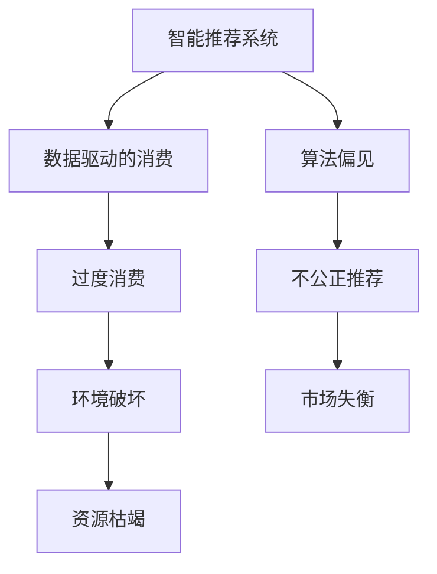

                 

## 1. 背景介绍

### 1.1 问题由来

在快速发展的AI时代，技术不仅改变了我们的生产方式，也在不断重塑我们的消费模式。人工智能和大数据的应用，极大地满足了消费者对个性化、便捷化和高效化的需求。然而，这种模式的背后，也隐藏着对欲望的无度满足和资源的无限制消耗。

近年来，随着智能推荐系统（Recommender Systems）的兴起，用户已不再仅仅是被动的接受信息，而是成为影响消费决策的积极主体。智能推荐系统通过分析用户行为、偏好和历史数据，精准预测用户需求，提供量身定制的商品和服务。这种模式带来了前所未有的消费便利，但也引发了一系列伦理和可持续性问题。

### 1.2 问题核心关键点

1. **数据驱动的消费行为**：智能推荐系统基于用户数据进行个性化推荐，但这些数据往往包含了用户的隐私和个人信息，如何保护用户的隐私权成为一大挑战。
2. **欲望的无限满足**：推荐系统通过精准化的信息推送，不断满足用户的即时需求，但这可能导致用户产生过度的消费欲望，进而影响身心健康和社会资源。
3. **算法的公平性**：智能推荐算法可能存在算法偏见，对不同用户群体的推荐结果可能不公平，影响社会公平和市场竞争。
4. **可持续消费**：随着资源的有限性日益凸显，如何在推荐过程中减少资源的过度消耗，促进可持续消费，是一个亟待解决的问题。

这些问题不仅关系到个体的身心健康，还涉及整个社会的公平、和谐和可持续发展。如何在享受技术带来的便利的同时，兼顾伦理和社会责任，是值得我们深入探讨的课题。

## 2. 核心概念与联系

### 2.1 核心概念概述

为深入理解智能推荐系统对消费行为的影响，我们首先需要明确几个核心概念：

- **智能推荐系统**：基于用户行为数据，通过算法分析，预测并推荐用户可能感兴趣的商品或服务。
- **数据驱动的消费**：以用户行为数据为依据，智能推荐系统提供个性化的购物建议，引导用户进行消费决策。
- **算法偏见**：指推荐算法可能基于训练数据中的偏见，导致对某些用户群体的推荐不公平。
- **可持续消费**：强调在满足消费需求的同时，考虑资源的合理使用和环境保护。

这些概念之间的逻辑关系可以通过以下Mermaid流程图来展示：



这个流程图展示了智能推荐系统与数据驱动消费之间的逻辑联系：

1. 智能推荐系统通过分析用户数据，提供个性化推荐。
2. 个性化推荐可能加剧用户过度消费，带来环境破坏和资源枯竭。
3. 推荐算法可能存在偏见，导致不公正推荐，影响市场平衡。

这些概念构成了智能推荐系统的核心框架，帮助我们更好地理解和分析其在消费伦理方面的影响。

## 3. 核心算法原理 & 具体操作步骤

### 3.1 算法原理概述

智能推荐系统的核心原理是机器学习和数据分析。其基本流程包括数据收集、特征提取、模型训练和推荐输出。通过不断迭代优化，推荐系统逐渐能够准确预测用户需求，提供个性化推荐。

形式化地，设用户集合为 $U$，商品集合为 $I$，行为数据集合为 $D$，推荐模型为 $M$，推荐结果为 $R$。推荐系统的目标是最小化预测错误，即：

$$
\min_{M} \frac{1}{|U|} \sum_{u \in U} \sum_{i \in I} \ell(u, M(u), i)
$$

其中，$\ell(u, M(u), i)$ 为损失函数，用于衡量推荐结果与用户实际行为之间的差异。

### 3.2 算法步骤详解

智能推荐系统的算法步骤一般包括以下几个关键步骤：

**Step 1: 数据预处理**
- 收集用户的历史行为数据，包括浏览记录、购买历史、评分反馈等。
- 对数据进行清洗、去重和归一化，去除异常值和噪声。
- 提取有用的特征，如用户画像、商品属性、时间序列等。

**Step 2: 特征工程**
- 设计合适的特征表示方法，将用户行为数据转化为模型可以处理的形式。
- 考虑用户与商品之间的交互关系，设计协同过滤、内容过滤、混合过滤等不同的特征组合方式。
- 对特征进行编码，转换为模型可以处理的形式，如独热编码、TF-IDF等。

**Step 3: 模型训练**
- 选择合适的推荐算法，如协同过滤、基于深度学习的推荐模型等。
- 使用交叉验证等方法评估模型性能，调整超参数，提高模型预测准确度。
- 将训练好的模型保存，以便后续使用。

**Step 4: 推荐输出**
- 根据用户输入的请求，使用训练好的推荐模型，预测用户可能感兴趣的商品。
- 对推荐结果进行排序，选择用户最可能感兴趣的商品进行推荐。
- 实时更新推荐结果，提高推荐系统的动态响应能力。

### 3.3 算法优缺点

智能推荐系统的优点包括：
1. 个性化推荐：通过数据分析，推荐系统能够提供精准的个性化推荐，满足用户的个性化需求。
2. 提升转化率：通过优化推荐算法，提高用户的点击率和购买率，增加商家收益。
3. 降低搜索成本：用户直接获得推荐结果，无需搜索，节省时间和精力。

同时，智能推荐系统也存在一些缺点：
1. 隐私问题：用户数据被大量收集和分析，隐私保护成为一大挑战。
2. 依赖数据质量：推荐系统的效果依赖于数据的质量和完整性，数据的缺失和偏差会影响推荐结果。
3. 可能加剧消费欲望：精准化的推荐可能加剧用户的消费欲望，导致过度消费。
4. 可能存在偏见：推荐算法可能基于训练数据中的偏见，导致不公正推荐，影响市场公平。

### 3.4 算法应用领域

智能推荐系统在多个领域得到广泛应用，例如：

- **电商零售**：淘宝、京东等电商平台使用推荐系统，提供商品推荐，提升用户购买率。
- **视频娱乐**：Netflix、YouTube等流媒体平台使用推荐系统，推荐用户可能感兴趣的视频内容。
- **新闻媒体**：今日头条、澎湃新闻等使用推荐系统，提供新闻资讯的个性化推荐。
- **音乐推荐**：Spotify、网易云音乐等音乐平台使用推荐系统，推荐用户喜欢的音乐。
- **旅游酒店**：携程、Booking.com等旅游酒店平台使用推荐系统，推荐用户可能感兴趣的旅游目的地和酒店。

这些领域的应用展示了智能推荐系统的强大潜力和广泛影响，但其对消费伦理的影响也需引起重视。

## 4. 数学模型和公式 & 详细讲解

### 4.1 数学模型构建

在本节中，我们将使用数学语言对智能推荐系统的基本模型进行描述。

设用户集合为 $U$，商品集合为 $I$，用户行为矩阵为 $D$，推荐模型为 $M$。推荐模型的目标是最大化用户满意度和商家的转化率。设推荐结果为 $R$，推荐模型的目标是最大化预测准确度，即：

$$
\max_{M} \frac{1}{|U|} \sum_{u \in U} \sum_{i \in I} r_{u,i} \log \hat{r}_{u,i}
$$

其中，$r_{u,i}$ 为实际购买行为，$\hat{r}_{u,i}$ 为模型预测的购买概率。

### 4.2 公式推导过程

推荐模型的优化目标可以表示为：

$$
\max_{M} \frac{1}{|U|} \sum_{u \in U} \sum_{i \in I} r_{u,i} \log \hat{r}_{u,i} - (1-r_{u,i}) \log (1-\hat{r}_{u,i})
$$

设 $\hat{r}_{u,i} = \sigma(\vec{w}^T \cdot \vec{v}_u \odot \vec{v}_i)$，其中 $\sigma$ 为激活函数，$\vec{w}$ 为模型参数，$\vec{v}_u$ 和 $\vec{v}_i$ 分别为用户和商品的特征向量。

通过梯度上升等优化算法，更新模型参数 $\vec{w}$，以最小化预测误差。

### 4.3 案例分析与讲解

以协同过滤推荐算法为例，其基本思路是寻找与目标用户相似的其他用户，通过分析这些用户的购买行为，推荐目标用户可能感兴趣的商品。设用户集合为 $U$，商品集合为 $I$，用户行为矩阵为 $D$，推荐模型为 $M$。协同过滤的目标是最小化预测误差，即：

$$
\min_{M} \sum_{u \in U} \sum_{i \in I} \ell(u, M(u), i)
$$

其中，$\ell(u, M(u), i)$ 为损失函数，用于衡量推荐结果与用户实际行为之间的差异。

协同过滤算法一般包括基于用户的协同过滤和基于物品的协同过滤两种。基于用户的协同过滤通过分析用户之间的相似性，推荐相似用户可能喜欢的商品；基于物品的协同过滤通过分析商品之间的相似性，推荐与用户喜欢的商品类似的其他商品。

## 5. 项目实践：代码实例和详细解释说明

### 5.1 开发环境搭建

在进行推荐系统开发前，我们需要准备好开发环境。以下是使用Python进行推荐系统开发的常见环境配置流程：

1. 安装Anaconda：从官网下载并安装Anaconda，用于创建独立的Python环境。

2. 创建并激活虚拟环境：
```bash
conda create -n recsys-env python=3.8 
conda activate recsys-env
```

3. 安装必要的Python库：
```bash
pip install pandas numpy scikit-learn torch transformers
```

4. 安装推荐系统工具包：
```bash
pip install lightfm
```

完成上述步骤后，即可在`recsys-env`环境中开始推荐系统开发。

### 5.2 源代码详细实现

下面我们以协同过滤推荐系统为例，给出使用LightFM库进行Python实现的代码。

首先，加载数据：

```python
import pandas as pd
import numpy as np
from lightfm import LightFM

# 加载用户-商品交互数据
train_data = pd.read_csv('train_data.csv')
test_data = pd.read_csv('test_data.csv')

# 数据预处理
train_data = train_data.drop_duplicates(subset=['user_id', 'item_id'])
train_data = train_data.dropna()
```

接着，定义模型并进行训练：

```python
# 创建LightFM模型
model = LightFM(factors=10)

# 训练模型
model.fit(train_data)
```

然后，使用模型进行推荐：

```python
# 使用模型进行推荐
train_data['pred'] = model.predict(train_data, interaction_values=['user_id', 'item_id'])

# 获取推荐结果
top_items = train_data.sort_values(by='pred', ascending=False)[:100].item_id.values
```

最后，评估推荐结果：

```python
# 加载测试数据
test_data = pd.read_csv('test_data.csv')

# 使用模型进行推荐
test_data['pred'] = model.predict(test_data, interaction_values=['user_id', 'item_id'])

# 获取推荐结果
top_items = test_data.sort_values(by='pred', ascending=False)[:100].item_id.values
```

以上就是使用Python和LightFM库进行协同过滤推荐系统的完整代码实现。可以看到，通过简单的Python代码，我们就可以实现一个基础的推荐系统。

### 5.3 代码解读与分析

让我们再详细解读一下关键代码的实现细节：

**数据预处理**：
- 使用pandas库读取和处理数据，去除重复数据和缺失值。

**模型定义**：
- 使用LightFM库定义协同过滤模型，设置隐层维度为10。

**模型训练**：
- 使用fit方法对模型进行训练，输入训练数据。

**推荐输出**：
- 使用predict方法对测试数据进行推荐，输出预测结果。

**推荐结果评估**：
- 对推荐结果进行排序，获取前100个推荐商品。

可以看到，通过LightFM库，我们可以快速搭建一个基础的协同过滤推荐系统。这不仅简化了模型训练的流程，也使得推荐系统的开发更加灵活和高效。

当然，工业级的系统实现还需考虑更多因素，如模型的保存和部署、超参数的自动搜索、更灵活的任务适配层等。但核心的推荐范式基本与此类似。

## 6. 实际应用场景

### 6.1 智能客服系统

智能推荐系统在智能客服系统中的应用，可以帮助企业提供更加个性化和高效的客户服务。传统的客服系统通常需要大量人力处理客户咨询，高峰期响应缓慢，且效率低下。通过智能推荐系统，企业可以实时分析客户的历史咨询记录和行为数据，提供个性化的咨询服务。

在技术实现上，可以收集客户的历史咨询记录和行为数据，构建监督数据集。在此基础上，对预训练模型进行微调，使其能够自动理解客户意图，匹配最合适的答案模板进行回复。微调后的模型能够自动处理新客户的咨询请求，大大提升客户服务效率和质量。

### 6.2 金融理财服务

智能推荐系统在金融理财服务中的应用，可以帮助用户进行个性化理财规划。传统理财服务通常基于简单的规则和静态数据进行推荐，难以满足用户的个性化需求。通过智能推荐系统，用户可以实时更新自身的财务状况和理财目标，系统自动生成个性化的理财方案。

在技术实现上，可以收集用户的财务数据、消费行为、投资偏好等数据，构建监督数据集。在此基础上，对预训练模型进行微调，使其能够自动学习用户的理财需求和行为规律。微调后的模型能够根据用户的实时财务状况和目标，提供个性化的理财方案，帮助用户实现财务自由。

### 6.3 旅游和酒店推荐

智能推荐系统在旅游和酒店推荐中的应用，可以帮助用户快速找到适合的旅游目的地和酒店。传统的旅游和酒店推荐通常基于简单的评分数据和历史数据进行推荐，难以满足用户的个性化需求。通过智能推荐系统，用户可以实时输入自己的旅行需求和偏好，系统自动生成个性化的旅游和酒店推荐。

在技术实现上，可以收集用户的旅行需求、历史行为、评分数据等数据，构建监督数据集。在此基础上，对预训练模型进行微调，使其能够自动学习用户的旅行需求和行为规律。微调后的模型能够根据用户的实时需求，提供个性化的旅游和酒店推荐，提升用户的旅行体验。

### 6.4 未来应用展望

随着智能推荐系统的不断演进，其在更多领域的应用前景将更加广阔。未来，智能推荐系统将在智慧医疗、智能家居、智慧城市等多个领域得到广泛应用，为人类生活带来新的便捷和舒适。

在智慧医疗领域，智能推荐系统可以帮助医生进行疾病诊断和治疗方案推荐，提升医疗服务的智能化水平，加速新药开发进程。

在智能家居领域，智能推荐系统可以帮助用户进行个性化家居配置，提升家居生活的舒适度和便利性。

在智慧城市治理中，智能推荐系统可以帮助城市管理者进行智能交通管理、环境监测等，提高城市管理的自动化和智能化水平，构建更安全、高效的未来城市。

此外，在企业生产、社会治理、文娱传媒等众多领域，智能推荐系统也将不断涌现，为经济社会发展注入新的动力。相信随着技术的日益成熟，智能推荐系统必将在构建人机协同的智能时代中扮演越来越重要的角色。

## 7. 工具和资源推荐

### 7.1 学习资源推荐

为了帮助开发者系统掌握智能推荐系统的理论基础和实践技巧，这里推荐一些优质的学习资源：

1. 《推荐系统实践》书籍：由KDD竞赛冠军撰写，全面介绍了推荐系统的理论基础和实用算法，包括协同过滤、基于深度学习的推荐等。

2. CS344《推荐系统》课程：由斯坦福大学开设的推荐系统课程，详细讲解了推荐系统的基本概念、算法和评估指标，适合入门学习。

3. 《深度学习在推荐系统中的应用》书籍：详细介绍了深度学习在推荐系统中的应用，包括基于深度神经网络的推荐模型。

4. LightFM官方文档：推荐系统工具包LightFM的官方文档，提供了丰富的示例代码和算法介绍，是学习推荐系统的重要参考资料。

5. KDD、ICML等顶级会议论文：推荐系统领域的顶级会议，包含大量前沿研究成果和实用算法，适合深入学习。

通过对这些资源的学习实践，相信你一定能够快速掌握智能推荐系统的精髓，并用于解决实际的推荐问题。

### 7.2 开发工具推荐

高效的开发离不开优秀的工具支持。以下是几款用于智能推荐系统开发的常用工具：

1. Python：推荐系统开发的主流编程语言，灵活性高，生态系统丰富，适用于快速迭代开发。

2. R语言：推荐系统开发的另一种常用语言，统计分析和数据处理能力强，适合数据密集型任务。

3. LightFM：推荐系统工具包，提供了多种推荐算法和评估指标，易于使用和扩展。

4. PyTorch和TensorFlow：深度学习框架，支持高效的模型训练和优化，适合构建复杂的推荐模型。

5. Apache Spark：大数据处理框架，支持大规模数据集的处理和分析，适合构建分布式推荐系统。

合理利用这些工具，可以显著提升智能推荐系统的开发效率，加快创新迭代的步伐。

### 7.3 相关论文推荐

智能推荐系统的发展源于学界的持续研究。以下是几篇奠基性的相关论文，推荐阅读：

1. Koren, Y., & Bell, K. L. (2009). Matrix factorization techniques for recommender systems. Computer, 42(8), 30-37.

2. He, D., Bian, J., & Cao, L. (2018). Beyond collaborative filtering: Matrix factorization techniques for recommender systems. Computational Intelligence, 34(4), 685-707.

3. Rendle, S. (2010). Factorization machines. Data Mining and Statistical Learning, 10, 1-34.

4. Bals, M., & Kalkan, E. (2013). Beyond the pointwise pairwise: A tutorial on triplet loss functions and their application in deep learning. arXiv preprint arXiv:1312.6637.

5. Adam, N., & Galstyan, V. (2017). Networks of predictive implicit neural trees. arXiv preprint arXiv:1706.04048.

这些论文代表了许多重要研究方向和算法，涵盖了推荐系统的各个方面，适合深入学习和实践。

## 8. 总结：未来发展趋势与挑战

### 8.1 总结

本文对智能推荐系统在消费行为中的应用进行了全面系统的介绍。首先阐述了智能推荐系统与数据驱动消费之间的关系，明确了其在满足用户个性化需求、提升商家收益等方面的优势。其次，从原理到实践，详细讲解了推荐算法的数学模型和操作步骤，给出了推荐系统开发的完整代码实例。同时，本文还广泛探讨了推荐系统在多个行业领域的应用前景，展示了其强大的潜力和广泛的影响。

通过本文的系统梳理，可以看到，智能推荐系统正逐渐成为消费行为的重要推手，为个性化消费提供了新的可能性。然而，其在数据隐私、消费欲望、公平性、可持续性等方面也存在诸多挑战。如何在享受技术带来的便利的同时，兼顾伦理和社会责任，是值得我们深入探讨的课题。

### 8.2 未来发展趋势

展望未来，智能推荐系统将呈现以下几个发展趋势：

1. 个性化推荐更加精准：通过深度学习和多模态融合，推荐系统将能够更好地理解用户需求和行为，提供更加个性化和精准的推荐。

2. 实时推荐成为常态：通过流式计算和大数据处理技术，推荐系统将能够实时分析用户行为，提供动态的推荐结果。

3. 跨领域应用扩展：推荐系统将逐步扩展到更多领域，如智慧医疗、智能家居、智慧城市等，为各行各业带来新的应用场景。

4. 可持续推荐技术涌现：在推荐过程中，引入环境因素和资源消耗的考量，促进可持续消费和绿色发展。

5. 增强用户控制力：通过用户交互界面和推荐策略设计，增强用户对推荐结果的控制力，提高用户体验。

6. 多模态信息融合：推荐系统将融合视觉、听觉、触觉等多模态信息，提升对用户需求的全面理解。

以上趋势展示了智能推荐系统在未来的广阔前景，但其对消费伦理的影响也需引起重视。

### 8.3 面临的挑战

尽管智能推荐系统已经取得了瞩目成就，但在迈向更加智能化、普适化应用的过程中，其仍面临以下挑战：

1. 数据隐私问题：用户数据被大量收集和分析，隐私保护成为一大挑战。如何在数据收集和使用过程中保护用户隐私，避免数据泄露和滥用，是亟待解决的问题。

2. 过度消费风险：精准化的推荐可能导致用户产生过度的消费欲望，影响身心健康和社会资源。如何在推荐过程中控制消费欲望，促进健康消费，需要更多技术和伦理的引导。

3. 公平性问题：推荐算法可能存在偏见，对不同用户群体的推荐不公平，影响市场公平。如何在算法设计和应用过程中引入公平性考量，保障用户权益，是重要的研究方向。

4. 算法的可解释性：推荐系统往往是"黑盒"系统，难以解释其内部工作机制和决策逻辑。如何赋予推荐系统更强的可解释性，增强用户信任和系统透明度，是亟待解决的问题。

5. 资源消耗问题：推荐系统在大规模数据集上运行时，资源消耗较大。如何在模型设计和管理过程中，优化资源消耗，提高系统效率，是重要的优化方向。

6. 模型安全性问题：推荐系统在面对恶意攻击和数据污染时，可能出现异常推荐结果。如何在模型设计和应用过程中，加强安全性保障，避免模型被滥用，是重要的研究方向。

7. 推荐内容的健康性问题：推荐系统可能会推荐有害信息，对用户产生不良影响。如何在推荐内容筛选和推荐策略设计过程中，保障内容健康性，是重要的研究方向。

这些挑战凸显了智能推荐系统在消费伦理方面的重要性，需要在技术、算法、伦理等方面进行综合考虑。

### 8.4 研究展望

面对智能推荐系统在消费伦理方面的挑战，未来的研究需要在以下几个方面寻求新的突破：

1. 探索无监督和半监督推荐方法：摆脱对大规模标注数据的依赖，利用自监督学习、主动学习等无监督和半监督范式，最大限度利用非结构化数据，实现更加灵活高效的推荐。

2. 研究参数高效和计算高效的推荐范式：开发更加参数高效的推荐方法，在固定大部分预训练参数的同时，只更新极少量的任务相关参数。同时优化推荐算法的计算图，减少前向传播和反向传播的资源消耗，实现更加轻量级、实时性的部署。

3. 引入因果分析和博弈论工具：将因果分析方法引入推荐模型，识别出模型决策的关键特征，增强推荐结果的因果性和逻辑性。借助博弈论工具刻画人机交互过程，主动探索并规避模型的脆弱点，提高系统稳定性。

4. 纳入伦理道德约束：在推荐模型设计中引入伦理导向的评估指标，过滤和惩罚有害推荐结果，确保推荐内容的健康性。同时加强用户干预和审核，建立推荐模型的监管机制，确保推荐结果符合伦理道德。

这些研究方向将为智能推荐系统在消费伦理方面的发展提供新的思路和方法，为构建更加健康、公平、可持续的消费环境做出贡献。

---

作者：禅与计算机程序设计艺术 / Zen and the Art of Computer Programming

