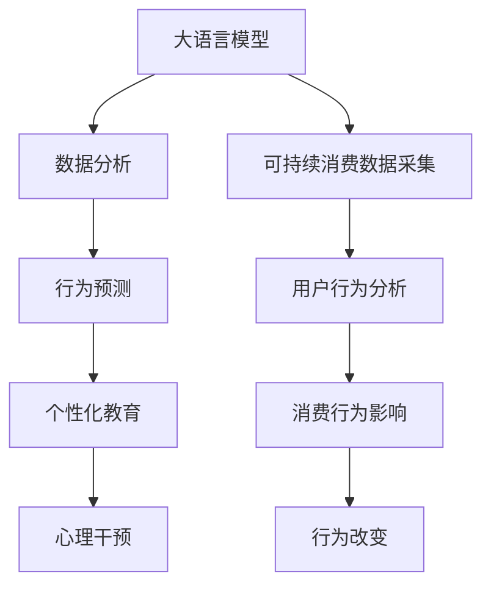

                 

# 欲望的生态意识培养：AI驱动的可持续消费教育

## 1. 背景介绍

在快速发展的现代社会，人类的消费行为对环境和资源的影响日益显著。尽管可持续发展理念已经深入人心，但实际行动往往受到欲望的驱使而偏离轨道。如何通过技术手段，激发公众的生态意识，培养可持续的消费习惯，成为当今社会急需解决的问题。本文将以《欲望的生态意识培养：AI驱动的可持续消费教育》为主题，深入探讨利用人工智能技术，特别是大语言模型和大数据分析技术，实现对公众消费行为的精准干预和教育。

## 2. 核心概念与联系

### 2.1 核心概念概述

- **大语言模型(Large Language Model, LLM)**：基于深度学习架构的人工智能模型，通过大量文本数据训练获得语言理解与生成能力。大语言模型，如GPT、BERT等，具备了处理和生成自然语言的能力，可以应用于自然语言处理(NLP)的多个领域。
- **可持续消费**：指在满足个人需求的同时，不破坏环境资源的消费模式。可持续消费关注的是消费的环保性、经济性和社会性，旨在实现资源的高效利用和环境的保护。
- **生态意识**：指公众对环境保护、资源节约的认知和关注，是推动可持续消费行为的重要心理基础。
- **AI驱动的教育**：利用人工智能技术，特别是大数据分析和自然语言处理，进行个性化教育，旨在提升公众的环境意识和可持续消费行为。

### 2.2 核心概念原理和架构的 Mermaid 流程图



这个流程图展示了AI驱动的可持续消费教育的整体流程：

1. **大语言模型**：通过分析大量的文本数据，理解用户的消费行为和心理。
2. **数据分析**：收集和分析用户的可持续消费行为数据，提取有用的信息。
3. **行为预测**：预测用户未来的消费行为，帮助制定个性化的教育方案。
4. **用户行为分析**：分析用户的消费模式和习惯，识别潜在的环境风险。
5. **行为改变**：通过心理干预和个性化教育，引导用户改变不环保的消费习惯。
6. **心理干预**：利用大语言模型生成的个性化文本，影响用户的心理状态，促进可持续消费。

## 3. 核心算法原理 & 具体操作步骤

### 3.1 算法原理概述

AI驱动的可持续消费教育，主要通过以下几个步骤实现：

1. **数据采集**：收集用户的历史消费数据和行为记录。
2. **数据分析**：使用大数据分析技术，提取用户的消费习惯和模式。
3. **行为预测**：基于机器学习模型，预测用户的未来消费行为。
4. **个性化教育**：根据预测结果，生成个性化的教育内容，引导用户改变行为。
5. **心理干预**：通过大语言模型生成的文本，影响用户的心理状态，促进可持续消费。

### 3.2 算法步骤详解

#### 3.2.1 数据采集

采集用户的历史消费数据，包括购买记录、产品类别、消费频率、支付金额等。此外，还可以收集用户对环保产品的评价、对环境问题的看法等，用于构建用户的生态意识水平模型。

#### 3.2.2 数据分析

使用大数据分析技术，对采集到的数据进行清洗、筛选和特征提取。例如，可以通过聚类分析方法，将用户分为不同的消费群体，识别出高环境风险的消费行为。

#### 3.2.3 行为预测

基于机器学习模型，预测用户未来的消费行为。常用的预测模型包括随机森林、决策树、神经网络等。例如，可以使用神经网络模型，根据用户的历史数据和行为，预测其在未来一段时间内的消费选择。

#### 3.2.4 个性化教育

根据预测结果，生成个性化的教育内容。例如，针对高环境风险的用户，可以设计特定的环保产品推荐策略和优惠活动，引导其向可持续消费转变。

#### 3.2.5 心理干预

通过大语言模型生成的文本，影响用户的心理状态。例如，可以设计一系列引导性文本，提示用户环境问题的严重性，鼓励其进行环保消费。

### 3.3 算法优缺点

#### 3.3.1 优点

1. **精准度**：AI驱动的教育能够基于用户的实际消费行为，提供精准的个性化建议和教育内容，提升效果。
2. **覆盖面广**：利用大数据分析技术，覆盖大量用户，实现广泛的环保宣传和教育。
3. **实时性**：通过机器学习模型和实时数据分析，能够及时捕捉用户的消费行为变化，迅速调整教育策略。

#### 3.3.2 缺点

1. **隐私问题**：需要采集大量的用户数据，涉及用户隐私保护问题，必须确保数据的安全性和匿名性。
2. **数据质量**：数据采集和清洗的准确性直接影响预测和教育的准确度，需要投入大量资源。
3. **模型复杂度**：预测和教育模型的设计复杂，需要专业知识和技能。

### 3.4 算法应用领域

- **电子商务**：电商平台可以通过AI驱动的教育，提升用户的环境意识，推广环保产品，增加可持续消费的比例。
- **零售业**：零售商可以设计个性化的环保促销活动，引导消费者选择可持续消费。
- **旅游业**：旅游平台可以通过AI教育，提高用户的环保意识，推广绿色旅游。
- **公共服务**：政府可以通过AI驱动的教育，提高公众的环境意识，推动可持续消费政策的实施。

## 4. 数学模型和公式 & 详细讲解

### 4.1 数学模型构建

假设我们有一组用户数据 $D=\{(x_i, y_i)\}_{i=1}^N$，其中 $x_i$ 为用户的消费行为特征，$y_i$ 为用户的环保评分（0-1之间，0表示不环保，1表示环保）。我们的目标是构建一个分类模型 $f(x)$，将用户分为环保用户和不环保用户。

### 4.2 公式推导过程

我们假设用户的行为特征 $x_i$ 可以表示为 $\mathbf{x}_i=[x_{i1}, x_{i2}, \dots, x_{in}]^T$，其中 $x_{ij}$ 为第 $i$ 个用户第 $j$ 个特征的值。我们的模型可以是线性回归模型、决策树模型、神经网络模型等。

以线性回归模型为例，我们的目标是最小化损失函数：

$$
\min_{w, b} \frac{1}{N}\sum_{i=1}^N (y_i - f(\mathbf{x}_i))^2
$$

其中 $f(\mathbf{x}_i) = \mathbf{w}^T\mathbf{x}_i + b$，$w$ 和 $b$ 为模型的参数。

### 4.3 案例分析与讲解

假设我们有一个电商平台的用户数据集，每个用户有多个购买记录。我们可以使用K-means聚类算法，将这些用户分为不同的消费群体。然后，使用决策树模型，预测每个用户是否倾向于环保消费。最后，对于环保评分低于某个阈值的用户，生成个性化的环保教育内容，通过邮件或短信推送。

## 5. 项目实践：代码实例和详细解释说明

### 5.1 开发环境搭建

要实现AI驱动的可持续消费教育，需要以下开发环境：

1. **Python**：主流的数据分析和机器学习语言，具备丰富的第三方库和工具。
2. **TensorFlow**：基于数据流的计算框架，支持神经网络和深度学习模型的训练和部署。
3. **Scikit-learn**：机器学习库，提供多种分类、回归、聚类算法。
4. **Natural Language Toolkit (NLTK)**：NLP库，支持文本数据的处理和分析。

### 5.2 源代码详细实现

以下是一个简单的Python代码示例，展示如何使用Scikit-learn库，实现对用户消费行为的数据分析和预测。

```python
from sklearn.cluster import KMeans
from sklearn.tree import DecisionTreeClassifier
import pandas as pd

# 加载用户数据
data = pd.read_csv('user_data.csv')

# 特征选择和数据清洗
features = data[['购买频率', '消费金额', '产品类别']]
features.fillna(features.mean(), inplace=True)

# 聚类分析
kmeans = KMeans(n_clusters=3, random_state=0)
labels = kmeans.fit_predict(features)

# 训练决策树模型
clf = DecisionTreeClassifier()
clf.fit(features, labels)

# 预测新用户
new_user = [[0.5, 1000, '电子产品']]
predicted_label = clf.predict(new_user)
print(predicted_label)
```

### 5.3 代码解读与分析

在上述代码中，我们首先加载用户数据，并进行特征选择和数据清洗。然后，使用K-means算法，将用户分为三个消费群体。最后，使用决策树模型，预测新用户是否倾向于环保消费。

## 6. 实际应用场景

### 6.1 电商平台

电商平台可以通过AI驱动的教育，提高用户的环保意识，推广环保产品。例如，亚马逊可以通过分析用户的购买记录，识别出高环境风险的用户，向其推荐环保产品，并提供优惠活动。

### 6.2 零售商

零售商可以利用AI驱动的教育，引导消费者选择环保产品。例如，沃尔玛可以在每个收银台处放置环保教育视频，通过大屏幕和语音播报，提醒消费者选择可持续消费。

### 6.3 旅游平台

旅游平台可以通过AI教育，提高用户的环保意识，推广绿色旅游。例如，携程可以在用户预订行程时，推送环保旅游攻略和推荐，鼓励用户选择低碳出行方式。

### 6.4 公共服务

政府可以通过AI驱动的教育，提高公众的环境意识，推动可持续消费政策的实施。例如，城市管理局可以在社区内投放环保宣传海报，并通过短信或邮件，向市民发送可持续消费提示。

## 7. 工具和资源推荐

### 7.1 学习资源推荐

1. **《机器学习实战》**：一本经典的机器学习书籍，适合入门学习。
2. **《深度学习》**：Ian Goodfellow等人所著的深度学习教科书，深入浅出地讲解了深度学习的基础和应用。
3. **Kaggle**：一个数据科学竞赛平台，提供大量开源数据集和竞赛题目，适合实践练习。
4. **Coursera**：提供机器学习和深度学习的在线课程，包括斯坦福大学、宾夕法尼亚大学等名校的课程。

### 7.2 开发工具推荐

1. **Python**：适合数据分析和机器学习任务，生态系统丰富。
2. **TensorFlow**：支持深度学习和分布式计算，适合大规模模型训练。
3. **Scikit-learn**：简单易用的机器学习库，适合分类、回归、聚类等任务。
4. **NLTK**：NLP库，支持文本数据的处理和分析。

### 7.3 相关论文推荐

1. **《用机器学习预测用户行为》**：一篇关于用户行为预测的经典论文，提出了多种机器学习模型，并对比了其预测效果。
2. **《大规模数据下的行为分析》**：一篇关于大数据分析的论文，探讨了如何利用大规模数据进行用户行为预测。
3. **《情感驱动的消费行为研究》**：一篇关于情感对消费行为影响的论文，探讨了情感因素如何影响用户选择环保产品。

## 8. 总结：未来发展趋势与挑战

### 8.1 研究成果总结

本文探讨了利用人工智能技术，特别是大语言模型和大数据分析技术，实现对公众消费行为的精准干预和教育。我们展示了AI驱动的可持续消费教育的基本流程和技术框架，并介绍了具体的应用场景和案例。

### 8.2 未来发展趋势

未来，AI驱动的可持续消费教育将继续发展，主要体现在以下几个方面：

1. **个性化教育**：随着AI技术的进步，个性化的教育内容将更加丰富和精准，能够更好地适应不同用户的消费需求和心理特点。
2. **多模态数据融合**：利用多模态数据，如消费记录、社交媒体、地理位置等，能够更全面地了解用户行为和心理，提高教育的有效性。
3. **智能推荐系统**：结合智能推荐系统，能够实时动态调整教育策略，提升用户的参与度和效果。

### 8.3 面临的挑战

尽管AI驱动的可持续消费教育具备巨大的潜力，但也面临一些挑战：

1. **数据隐私**：大规模数据采集和使用，涉及用户隐私保护问题，需要确保数据的安全性和匿名性。
2. **模型复杂度**：教育和预测模型的设计和实现复杂，需要跨学科的知识和技能。
3. **用户参与度**：如何提高用户的参与度和持续性，是教育成功的关键。

### 8.4 研究展望

未来的研究将聚焦于以下几个方面：

1. **多模态数据融合**：结合不同类型的数据，如社交媒体、地理位置等，全面了解用户行为和心理。
2. **情感驱动的教育**：利用情感分析技术，设计更加富有情感共鸣的教育内容。
3. **实时动态调整**：利用实时数据分析，动态调整教育策略，提高用户的参与度和效果。

总之，AI驱动的可持续消费教育具有广阔的前景，通过技术手段，可以显著提升公众的环境意识和可持续消费行为，推动绿色可持续发展。

## 9. 附录：常见问题与解答

### 9.1 Q1：如何保证数据的隐私性？

A：在数据采集和分析过程中，需要采取严格的隐私保护措施，如数据匿名化、差分隐私等。对于敏感数据，应进行脱敏处理，确保用户的隐私不受侵害。

### 9.2 Q2：如何提高用户的参与度？

A：设计有趣、有奖的环保活动，激励用户参与。通过社交媒体和社区平台，增加互动性和分享性，扩大教育的覆盖面。

### 9.3 Q3：如何评估教育效果？

A：评估教育效果可以通过问卷调查、行为跟踪等方式进行。例如，在推荐环保产品后，观察用户的购买行为是否发生变化，以及环保评分是否提升。

---

作者：禅与计算机程序设计艺术 / Zen and the Art of Computer Programming

