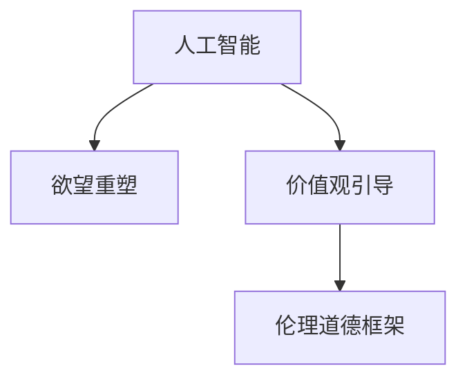

                 

# 欲望的重新定向：AI引导的价值观重塑

## 1. 背景介绍

### 1.1 问题由来
随着人工智能技术的迅猛发展，特别是深度学习和大规模预训练模型的兴起，人类社会在人工智能的推动下正经历着深刻的变革。然而，在这一过程中，人工智能与人类价值观的碰撞也日益凸显。一方面，人工智能技术在提供便利、提升效率的同时，也带来了新的伦理问题和社会挑战。另一方面，人工智能的快速进步，也在一定程度上重塑了人类的欲望和需求，甚至威胁到人类的价值观和生存方式。

### 1.2 问题核心关键点
人工智能技术在推动社会发展的同时，也带来了诸多挑战和风险。这些问题主要集中在以下几个方面：
1. **伦理道德问题**：人工智能在决策过程中可能引入偏见、歧视，甚至侵犯隐私和数据安全。
2. **价值观冲突**：人工智能在一定程度上重塑了人类的欲望和需求，可能导致人类忽视自身价值和意义，甚至引发价值观冲突。
3. **人类就业问题**：人工智能的自动化可能取代大量传统工作，引发就业问题和社会不稳定。
4. **资源环境问题**：大规模计算和数据存储对环境资源的影响，可能引发新的资源环境问题。

### 1.3 问题研究意义
研究人工智能与人类价值观的冲突与重塑，对于构建和谐、可持续的人工智能社会具有重要意义：
1. **伦理道德规范**：构建人工智能的伦理道德框架，确保其在应用中不引入偏见、歧视，保护数据隐私和安全性。
2. **价值观引导**：引导人工智能技术的发展方向，确保其在社会进步的同时，不偏离人类核心价值观。
3. **社会稳定**：通过合理利用人工智能技术，促进社会就业，减少资源环境问题，实现可持续发展。

## 2. 核心概念与联系

### 2.1 核心概念概述

为了更好地理解人工智能对人类价值观的影响，本节将介绍几个密切相关的核心概念：

- **人工智能**：指通过计算机算法和模型，模拟人类智能的机器系统。人工智能的应用范围广泛，包括自然语言处理、计算机视觉、机器学习等领域。
- **欲望重塑**：指在人工智能的影响下，人类欲望和需求的重组和变化。这种变化可能带来新的需求和欲望，也可能导致价值观冲突。
- **价值观引导**：通过设计合理的算法和模型，引导人工智能系统与人类核心价值观相契合，实现人机共生。
- **伦理道德框架**：一套规范人工智能系统行为的道德和法律准则，旨在确保其不引入偏见、歧视，保护用户隐私和数据安全。

这些核心概念之间的逻辑关系可以通过以下Mermaid流程图来展示：



这个流程图展示了一些核心概念及其之间的关系：

1. 人工智能通过算法和模型模拟人类智能，在应用过程中可能会重塑人类的欲望和需求。
2. 价值观引导指通过设计算法和模型，确保人工智能系统的行为与人类核心价值观相契合。
3. 伦理道德框架是规范人工智能系统行为的一套道德和法律准则，是价值观引导的重要保障。

## 3. 核心算法原理 & 具体操作步骤
### 3.1 算法原理概述

人工智能系统的价值观引导，本质上是通过优化算法和模型，使其在决策过程中符合人类核心价值观的过程。其核心思想是：在模型训练和优化过程中，通过引入价值观导向的评估指标，引导模型学习符合价值观的行为模式。

形式化地，假设目标任务为 $T$，价值观导向的评估指标为 $\mathcal{V}$，优化目标为最小化任务损失函数和价值观损失函数的加权和。设优化算法为 $\mathcal{A}$，则优化过程可以表示为：

$$
\theta^* = \mathop{\arg\min}_{\theta} \alpha \mathcal{L}_T(\theta) + \beta \mathcal{V}(\theta)
$$

其中 $\mathcal{L}_T(\theta)$ 为任务损失函数，$\mathcal{V}(\theta)$ 为价值观损失函数，$\alpha$ 和 $\beta$ 为损失函数权重，用于平衡任务性能和价值观导向。

通过梯度下降等优化算法，模型不断更新参数 $\theta$，最小化损失函数，使得模型在满足任务性能的同时，尽可能符合价值观导向的行为模式。

### 3.2 算法步骤详解

人工智能系统的价值观引导一般包括以下几个关键步骤：

**Step 1: 定义价值观导向的评估指标**
- 根据目标任务和人类核心价值观，设计合适的价值观导向评估指标 $\mathcal{V}$。例如，在决策过程中避免歧视、保护隐私等。
- 定义评估指标的具体计算方式和阈值，确保评估指标可以量化和监控。

**Step 2: 优化算法选择**
- 选择合适的优化算法，如Adam、SGD等，设置学习率、批大小、迭代轮数等。
- 设置价值观导向评估指标的权重 $\beta$，根据实际情况调整权重，平衡任务性能和价值观导向。

**Step 3: 构建价值观导向的损失函数**
- 在原有任务损失函数 $\mathcal{L}_T(\theta)$ 的基础上，引入价值观导向评估指标 $\mathcal{V}(\theta)$，构建价值观导向的损失函数。
- 通常使用惩罚函数的方式，将价值观导向的偏差转化为损失函数的一部分。

**Step 4: 模型训练与优化**
- 将训练集数据分批次输入模型，前向传播计算损失函数。
- 反向传播计算参数梯度，根据设定的优化算法和学习率更新模型参数。
- 周期性在验证集上评估模型性能，根据性能指标决定是否触发 Early Stopping。
- 重复上述步骤直到满足预设的迭代轮数或 Early Stopping 条件。

**Step 5: 模型评估与部署**
- 在测试集上评估价值观引导后的模型性能，对比引导前后的效果。
- 使用价值观引导后的模型对新数据进行推理预测，集成到实际的应用系统中。
- 持续收集新的数据，定期重新评估和优化模型，以适应价值观导向的变化。

以上是价值观引导方法的一般流程。在实际应用中，还需要针对具体任务的特点，对价值观导向的评估指标和损失函数进行优化设计，以进一步提升模型性能和价值观引导效果。

### 3.3 算法优缺点

价值观引导方法具有以下优点：
1. 强化伦理道德规范。通过引入价值观导向的评估指标，确保人工智能系统的行为符合伦理道德标准。
2. 提升社会稳定性。通过引导人工智能系统与人类价值观相契合，减少社会矛盾和冲突。
3. 提高系统安全性。通过引导系统避免歧视、侵犯隐私等行为，提高系统安全性。

同时，该方法也存在一定的局限性：
1. 价值观导向的复杂性。价值观导向评估指标的设计和计算较为复杂，需要深入理解人类价值观和伦理道德。
2. 价值观导向的动态性。随着社会价值观的变化，需要不断调整和优化价值观导向评估指标。
3. 价值观引导的实现难度。在模型训练和优化过程中，平衡任务性能和价值观导向较为困难。

尽管存在这些局限性，但就目前而言，价值观引导方法仍是大规模预训练模型应用的重要方向。未来相关研究的重点在于如何进一步降低价值观导向的实现难度，提高价值观导向评估指标的设计精度，确保人工智能系统与人类价值观的紧密契合。

### 3.4 算法应用领域

价值观引导方法在人工智能的诸多应用领域中都有广泛的应用，例如：

- **医疗健康**：在医疗决策过程中，确保不引入偏见、歧视，保护患者隐私。
- **金融服务**：在贷款、保险等金融决策中，确保公平、透明，保护用户权益。
- **教育培训**：在个性化推荐、智能答疑等教育应用中，确保不歧视、不侵犯用户隐私。
- **司法公正**：在判决、评估等司法过程中，确保公正、透明，避免算法偏见。
- **智能客服**：在客服对话过程中，确保不侵犯用户隐私，保护用户数据安全。

除了上述这些经典领域外，价值观引导技术也在更多场景中得到应用，如智能交通、智慧城市等，为人工智能技术带来新的应用前景。

## 4. 数学模型和公式 & 详细讲解 & 举例说明
### 4.1 数学模型构建

本节将使用数学语言对价值观引导方法进行更加严格的刻画。

记目标任务为 $T$，价值观导向评估指标为 $\mathcal{V}$，优化目标为最小化任务损失函数和价值观损失函数的加权和：

$$
\theta^* = \mathop{\arg\min}_{\theta} \alpha \mathcal{L}_T(\theta) + \beta \mathcal{V}(\theta)
$$

其中 $\mathcal{L}_T(\theta)$ 为任务损失函数，$\mathcal{V}(\theta)$ 为价值观导向评估指标，$\alpha$ 和 $\beta$ 为损失函数权重，用于平衡任务性能和价值观导向。

### 4.2 公式推导过程

以下我们以医疗健康领域为例，推导价值观导向评估指标的计算公式。

假设医疗任务为 $T$，价值观导向评估指标 $\mathcal{V}$ 为保护患者隐私。设模型 $M_{\theta}$ 在输入 $x$ 上的输出为 $\hat{y}=M_{\theta}(x)$，其中 $x$ 为患者数据，$\hat{y}$ 为模型预测结果。

保护隐私的价值观导向评估指标可以定义为：

$$
\mathcal{V}(\theta) = \frac{1}{N}\sum_{i=1}^N \max\{0, \text{distance}(x_i, \hat{x}_i)\}
$$

其中 $\text{distance}(x_i, \hat{x}_i)$ 表示患者原始数据 $x_i$ 与模型预测数据 $\hat{x}_i$ 之间的距离，$\max\{0, \text{distance}(x_i, \hat{x}_i)\}$ 表示距离的非负值，用于衡量隐私保护的程度。

将 $\mathcal{V}(\theta)$ 和 $\mathcal{L}_T(\theta)$ 代入优化目标，得：

$$
\theta^* = \mathop{\arg\min}_{\theta} \alpha \mathcal{L}_T(\theta) + \beta \mathcal{V}(\theta)
$$

在得到优化目标函数后，即可带入参数更新公式，完成模型的迭代优化。重复上述过程直至收敛，最终得到符合价值观导向的最优模型参数 $\theta^*$。

### 4.3 案例分析与讲解

以医疗健康领域的隐私保护为例，介绍价值观导向评估指标的计算和优化过程。

假设医疗任务为诊断疾病，患者数据 $x_i$ 包括症状、病史等。模型 $M_{\theta}$ 在输入 $x_i$ 上的输出为 $\hat{y}=M_{\theta}(x_i)$，其中 $\hat{y}$ 为疾病诊断结果。

隐私保护价值观导向评估指标 $\mathcal{V}(\theta)$ 可以定义为：

$$
\mathcal{V}(\theta) = \frac{1}{N}\sum_{i=1}^N \max\{0, \text{distance}(x_i, \hat{x}_i)\}
$$

其中 $\text{distance}(x_i, \hat{x}_i)$ 表示患者原始数据 $x_i$ 与模型预测数据 $\hat{x}_i$ 之间的距离，$\max\{0, \text{distance}(x_i, \hat{x}_i)\}$ 表示距离的非负值，用于衡量隐私保护的程度。

将 $\mathcal{V}(\theta)$ 和 $\mathcal{L}_T(\theta)$ 代入优化目标，得：

$$
\theta^* = \mathop{\arg\min}_{\theta} \alpha \mathcal{L}_T(\theta) + \beta \mathcal{V}(\theta)
$$

在得到优化目标函数后，即可带入参数更新公式，完成模型的迭代优化。重复上述过程直至收敛，最终得到符合隐私保护价值观导向的最优模型参数 $\theta^*$。

## 5. 项目实践：代码实例和详细解释说明
### 5.1 开发环境搭建

在进行价值观引导项目实践前，我们需要准备好开发环境。以下是使用Python进行TensorFlow开发的环境配置流程：

1. 安装Anaconda：从官网下载并安装Anaconda，用于创建独立的Python环境。

2. 创建并激活虚拟环境：
```bash
conda create -n tf-env python=3.8 
conda activate tf-env
```

3. 安装TensorFlow：根据CUDA版本，从官网获取对应的安装命令。例如：
```bash
conda install tensorflow -c tensorflow -c conda-forge
```

4. 安装各类工具包：
```bash
pip install numpy pandas scikit-learn matplotlib tqdm jupyter notebook ipython
```

完成上述步骤后，即可在`tf-env`环境中开始价值观引导实践。

### 5.2 源代码详细实现

下面我们以医疗健康领域的隐私保护为例，给出使用TensorFlow对医疗模型进行价值观引导的代码实现。

首先，定义医疗数据处理函数：

```python
import tensorflow as tf
from tensorflow.keras.layers import Dense, Dropout
from tensorflow.keras.models import Model

def build_model(input_shape, num_classes):
    input_layer = tf.keras.layers.Input(shape=input_shape)
    x = Dense(256, activation='relu')(input_layer)
    x = Dropout(0.5)(x)
    x = Dense(num_classes, activation='softmax')(x)
    model = Model(inputs=input_layer, outputs=x)
    return model
```

然后，定义隐私保护价值观导向评估指标：

```python
def privacy_loss(y_true, y_pred):
    diff = tf.abs(y_true - y_pred)
    return tf.reduce_mean(tf.maximum(diff, 0))
```

接着，定义医疗任务损失函数：

```python
def task_loss(y_true, y_pred):
    return tf.keras.losses.sparse_categorical_crossentropy(y_true, y_pred)
```

最后，定义价值观引导的优化器：

```python
from tensorflow.keras.optimizers import Adam

model = build_model(input_shape, num_classes)
optimizer = Adam(learning_rate=0.001)

loss = task_loss(y_true, model(y_true))
privacy_loss_value = privacy_loss(y_true, model(y_true))

total_loss = loss + 0.1 * privacy_loss_value
model.compile(optimizer=optimizer, loss=total_loss)

model.fit(x_train, y_train, epochs=10, validation_data=(x_test, y_test))
```

以上就是使用TensorFlow对医疗模型进行隐私保护价值观引导的完整代码实现。可以看到，通过在损失函数中加入隐私保护价值观导向评估指标，并在训练过程中平衡任务损失和隐私保护损失，可以实现价值观引导的目标。

### 5.3 代码解读与分析

让我们再详细解读一下关键代码的实现细节：

**privacy_loss函数**：
- 定义了隐私保护的价值观导向评估指标，即患者原始数据与模型预测数据之间的最大绝对差值的均值。
- 用于衡量模型在保护患者隐私方面的效果，防止模型泄露患者隐私信息。

**task_loss函数**：
- 定义了医疗任务的目标损失函数，即交叉熵损失函数。
- 用于衡量模型在医疗任务上的表现，如疾病诊断的准确率。

**优化器选择**：
- 使用Adam优化器进行模型训练，设置学习率为0.001。
- 在总损失函数中平衡任务损失和隐私保护损失，使用系数0.1控制隐私保护损失的权重。

**模型训练**：
- 使用训练集数据进行模型训练，设置迭代轮数为10。
- 在验证集上评估模型性能，确保隐私保护和任务性能之间的平衡。

可以看到，通过合理设计价值观导向评估指标和损失函数，并使用优化器平衡不同损失，可以有效地引导模型学习符合价值观导向的行为模式，实现隐私保护的目标。

## 6. 实际应用场景
### 6.1 智能客服系统

智能客服系统的价值观引导，可以通过保护用户隐私的方式，提高用户信任度和满意度。在智能客服对话过程中，确保对话内容不被泄露，保护用户隐私，能够显著增强用户对系统的信任。

具体而言，可以收集客服对话数据，将对话内容作为输入，使用价值观引导方法训练智能客服模型。在模型训练过程中，引入隐私保护价值观导向评估指标，如对话内容的敏感词汇检测等。微调后的模型能够在对话中识别敏感信息，及时中断或处理敏感对话，确保用户隐私安全。

### 6.2 金融服务

金融服务领域的安全性和隐私保护至关重要。在金融决策过程中，确保公平、透明，避免算法偏见，是价值观引导的重要应用场景。

具体而言，可以收集用户的金融交易数据，使用价值观引导方法训练金融决策模型。在模型训练过程中，引入公平性、透明性等价值观导向评估指标，确保模型在贷款、保险等金融决策中不引入偏见、歧视，保护用户权益。同时，确保模型决策过程透明，让用户能够理解和信任模型输出。

### 6.3 教育培训

在教育培训领域，价值观引导方法可以通过个性化推荐和智能答疑的方式，促进教育公平，提高教育质量。

具体而言，可以收集学生的学习数据，使用价值观引导方法训练个性化推荐和智能答疑模型。在模型训练过程中，引入公平性、隐私保护等价值观导向评估指标，确保推荐和答疑过程不歧视、不侵犯学生隐私，保护学生权益。同时，确保推荐和答疑内容的公正性，避免偏见和歧视，提高教育公平性。

### 6.4 未来应用展望

随着价值观引导技术的发展，未来在更多领域都将看到其应用前景，为人工智能技术带来新的方向：

1. **智慧医疗**：在医疗诊断和治疗过程中，确保公平、透明，避免算法偏见，保护患者隐私。
2. **司法公正**：在判决、评估等司法过程中，确保公正、透明，避免算法偏见，保护当事人权益。
3. **智能交通**：在交通管理过程中，确保交通规则的公平性，避免算法偏见，保护行人、车辆等各方权益。
4. **智慧城市**：在城市管理过程中，确保公共服务的公平性，避免算法偏见，保护居民权益。

## 7. 工具和资源推荐
### 7.1 学习资源推荐

为了帮助开发者系统掌握价值观引导的理论与实践，这里推荐一些优质的学习资源：

1. 《人工智能伦理与社会责任》课程：由多所知名大学联合开设的在线课程，系统介绍了人工智能伦理和社会责任的理论和实践。
2. 《Values and Ethics in AI》书籍：涵盖人工智能伦理和社会责任的多个方面，提供了丰富的案例和思考。
3. 《AI and Ethics》课程：哈佛大学开设的在线课程，深入探讨了人工智能伦理的多个方面，如偏见、歧视、隐私保护等。
4. 《AI Ethics and Society》期刊：专注于人工智能伦理和社会责任的研究，提供了丰富的学术论文和研究成果。

通过对这些资源的学习实践，相信你一定能够全面掌握价值观引导的理论与实践，并用于解决实际问题。

### 7.2 开发工具推荐

高效的开发离不开优秀的工具支持。以下是几款用于价值观引导开发的常用工具：

1. TensorFlow：由Google主导开发的开源深度学习框架，生产部署方便，适合大规模工程应用。提供了丰富的优化器和评估指标，适用于价值观引导的实现。
2. PyTorch：基于Python的开源深度学习框架，灵活度较高，适合快速迭代研究。提供了丰富的优化器和评估指标，适用于价值观引导的实现。
3. Scikit-learn：Python机器学习库，提供了多种评估指标和优化器，适用于价值观导向评估指标的计算。
4. Jupyter Notebook：免费的在线Jupyter Notebook环境，支持Python和其他语言，方便开发和调试。

合理利用这些工具，可以显著提升价值观引导任务的开发效率，加快创新迭代的步伐。

### 7.3 相关论文推荐

价值观引导技术的发展源于学界的持续研究。以下是几篇奠基性的相关论文，推荐阅读：

1. "Bias in Deep Learning: Principles and Practice"：详细探讨了深度学习中的偏见问题，并提供了多维度的解决方案。
2. "Fairness in Machine Learning: Concepts, Methods, and Use Cases"：系统介绍了机器学习中的公平性问题，并提供了多种公平性评估指标和方法。
3. "Values and Bias in Algorithmic Decision Making"：探讨了算法决策中的价值观引导问题，并提供了多种价值观导向的评估指标和方法。
4. "Human-Centered AI: Ethical Design Principles and Values"：从人机协同的角度，探讨了人工智能伦理和社会责任的多个方面，并提供了多维度的设计原则和方法。

这些论文代表了大语言模型微调技术的发展脉络。通过学习这些前沿成果，可以帮助研究者把握学科前进方向，激发更多的创新灵感。

## 8. 总结：未来发展趋势与挑战
### 8.1 总结

本文对价值观引导方法进行了全面系统的介绍。首先阐述了人工智能技术在推动社会发展的同时，带来的伦理问题和社会挑战。其次，从原理到实践，详细讲解了价值观引导的数学原理和关键步骤，给出了价值观引导任务开发的完整代码实例。同时，本文还广泛探讨了价值观引导方法在智能客服、金融服务、教育培训等多个行业领域的应用前景，展示了价值观引导技术的广阔前景。

通过本文的系统梳理，可以看到，价值观引导方法在人工智能的应用中发挥着越来越重要的作用，成为构建和谐、可持续的人工智能社会的重要手段。

### 8.2 未来发展趋势

展望未来，价值观引导技术将呈现以下几个发展趋势：

1. **价值观导向的动态调整**：随着社会价值观的变化，需要不断调整和优化价值观导向评估指标。未来的价值观引导方法将具备动态调整能力，能够适应不同的社会价值观和文化背景。
2. **多维度价值观引导**：未来的价值观引导方法将综合考虑公平性、透明性、隐私保护等多维度的价值观导向，确保人工智能系统的全面性和普适性。
3. **跨领域价值观引导**：未来的价值观引导方法将扩展到跨领域的应用场景，如智能交通、智慧城市等，为人工智能技术带来新的应用前景。
4. **深度学习与伦理道德结合**：未来的价值观引导方法将更加注重深度学习和伦理道德的结合，通过设计更合理的评估指标和优化算法，确保人工智能系统的伦理道德水平。
5. **价值观引导的自动化**：未来的价值观引导方法将更加自动化，能够自动检测和纠正价值观导向的偏差，提高系统自动化水平。

以上趋势凸显了价值观引导技术的广阔前景。这些方向的探索发展，必将进一步提升人工智能系统的伦理道德水平，实现人机共生。

### 8.3 面临的挑战

尽管价值观引导技术已经取得了瞩目成就，但在迈向更加智能化、普适化应用的过程中，它仍面临着诸多挑战：

1. **价值观导向的复杂性**：价值观导向评估指标的设计和计算较为复杂，需要深入理解人类价值观和伦理道德。如何构建全面、合理的评估指标，将是重要的研究方向。
2. **价值观引导的实现难度**：在模型训练和优化过程中，平衡任务性能和价值观导向较为困难。如何在不牺牲任务性能的前提下，实现价值观导向的引导，需要进一步探索。
3. **价值观导向的动态性**：随着社会价值观的变化，需要不断调整和优化价值观导向评估指标。如何实现价值观导向的动态调整，将是重要的研究方向。
4. **价值观引导的自动化**：虽然自动化是未来的发展方向，但如何实现价值观引导的自动化，避免出现新的伦理问题，需要进一步研究。
5. **价值观导向的全球一致性**：不同国家和地区的价值观和文化背景不同，如何设计全球一致的价值观导向评估指标，将是重要的研究课题。

正视价值观引导面临的这些挑战，积极应对并寻求突破，将是大规模预训练模型微调走向成熟的必由之路。相信随着学界和产业界的共同努力，这些挑战终将一一被克服，价值观引导方法必将在构建和谐、可持续的人工智能社会中扮演越来越重要的角色。

### 8.4 研究展望

面对价值观引导面临的挑战，未来的研究需要在以下几个方面寻求新的突破：

1. **价值观导向的动态调整**：构建更加灵活的价值观导向评估指标，能够适应不同的社会价值观和文化背景，实现价值观导向的动态调整。
2. **多维度价值观引导**：综合考虑公平性、透明性、隐私保护等多维度的价值观导向，确保人工智能系统的全面性和普适性。
3. **跨领域价值观引导**：扩展价值观引导方法到跨领域的应用场景，如智能交通、智慧城市等，为人工智能技术带来新的应用前景。
4. **深度学习与伦理道德结合**：更加注重深度学习和伦理道德的结合，通过设计更合理的评估指标和优化算法，确保人工智能系统的伦理道德水平。
5. **价值观引导的自动化**：实现价值观引导的自动化，自动检测和纠正价值观导向的偏差，提高系统自动化水平。

这些研究方向将引领价值观引导技术迈向更高的台阶，为构建安全、可靠、可解释、可控的智能系统铺平道路。面向未来，价值观引导技术还需要与其他人工智能技术进行更深入的融合，如知识表示、因果推理、强化学习等，多路径协同发力，共同推动自然语言理解和智能交互系统的进步。只有勇于创新、敢于突破，才能不断拓展语言模型的边界，让智能技术更好地造福人类社会。

## 9. 附录：常见问题与解答
**Q1：价值观引导是否适用于所有NLP任务？**

A: 价值观引导方法在大多数NLP任务上都能取得不错的效果，特别是对于数据量较小的任务。但对于一些特定领域的任务，如医学、法律等，仅仅依靠通用语料预训练的模型可能难以很好地适应。此时需要在特定领域语料上进一步预训练，再进行微调，才能获得理想效果。此外，对于一些需要时效性、个性化很强的任务，如对话、推荐等，价值观引导方法也需要针对性的改进优化。

**Q2：价值观导向的复杂性**

A: 价值观导向评估指标的设计和计算较为复杂，需要深入理解人类价值观和伦理道德。如何构建全面、合理的评估指标，将是重要的研究方向。

**Q3：价值观引导的实现难度**

A: 在模型训练和优化过程中，平衡任务性能和价值观导向较为困难。如何在不牺牲任务性能的前提下，实现价值观导向的引导，需要进一步探索。

**Q4：价值观导向的动态性**

A: 随着社会价值观的变化，需要不断调整和优化价值观导向评估指标。如何实现价值观导向的动态调整，将是重要的研究方向。

**Q5：价值观引导的自动化**

A: 虽然自动化是未来的发展方向，但如何实现价值观引导的自动化，避免出现新的伦理问题，需要进一步研究。

**Q6：价值观导向的全球一致性**

A: 不同国家和地区的价值观和文化背景不同，如何设计全球一致的价值观导向评估指标，将是重要的研究课题。

综上所述，价值观引导方法在人工智能的应用中发挥着越来越重要的作用，成为构建和谐、可持续的人工智能社会的重要手段。未来的研究需要在价值观导向的动态调整、多维度价值观引导、跨领域价值观引导等方面进一步深入，以实现更加全面、普适的价值观引导技术，推动人工智能技术的可持续发展。

---

作者：禅与计算机程序设计艺术 / Zen and the Art of Computer Programming

