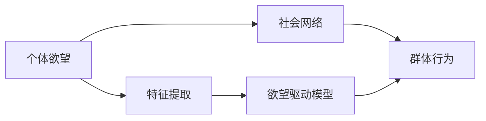

                 

# 欲望社会网络分析：AI驱动的群体动力学研究

## 1. 背景介绍

在数字化时代，数据流量的增长和社交媒体的普及推动了人类行为分析的进一步深入。越来越多的研究者开始关注通过人工智能(AI)技术探究个体欲望与群体行为之间的关联，以期洞察社会网络中的动力机制。本文将探讨一种基于AI的群体动力学研究方法——欲望社会网络分析，重点介绍其算法原理、具体操作步骤、实际应用场景及未来展望。

### 1.1 问题由来

在21世纪初期，随着社交媒体的兴起，人们的行为模式和社会动态更加依赖于互联网。AI技术，尤其是深度学习的发展，使研究者得以从大数据中提取个体行为的特征，并通过模型对这些特征进行分析和预测。这种研究逐渐演进为欲望社会网络分析，它试图从个体层面的欲望驱动出发，解析群体行为的动态变化，以期解释和预测复杂社会现象。

### 1.2 问题核心关键点

欲望社会网络分析的核心在于利用AI模型，特别是深度学习模型，捕捉个体欲望与社会行为之间的内在联系。通过大规模数据分析，模型能够学习到个体的行为模式，并预测群体行为的变化。该方法的关键点包括：

1. **个体欲望的建模**：如何有效地将个体欲望转化为可量化的特征。
2. **社会网络的构建**：如何将个体间的关系转化为网络结构，以便进行群体分析。
3. **群体行为的预测**：如何通过已有的个体欲望模型，预测群体行为的演化。

### 1.3 问题研究意义

欲望社会网络分析不仅有助于理解个体欲望对群体行为的影响，还为社交网络分析提供了新的视角和工具。其研究意义在于：

- **揭示欲望与社会行为的深层联系**：通过分析个体欲望，预测群体行为，为理解人类行为提供更深入的洞察。
- **提升决策支持能力**：为政策制定者、企业领导者提供基于AI的决策支持，帮助他们理解社会动态，制定有效的策略。
- **推动AI技术的社会应用**：通过欲望社会网络分析，探索AI技术在社会科学研究中的应用前景，推动技术在社会治理中的应用。

## 2. 核心概念与联系

### 2.1 核心概念概述

欲望社会网络分析结合了欲望驱动理论和社会网络分析方法，利用AI技术进行量化研究。其核心概念包括：

- **个体欲望**：指个体在特定情境下的需求、欲望和动机。
- **群体行为**：指一个社会网络中，个体行为的总和和表现。
- **社会网络分析**：通过研究个体间的关系，构建社会网络，分析群体行为的模式和趋势。
- **AI驱动模型**：指使用深度学习等AI技术，建立个体欲望与群体行为之间的映射关系。

### 2.2 核心概念原理和架构的 Mermaid 流程图



此流程图展示了欲望社会网络分析的基本架构：

- 个体欲望首先通过特征提取转化为可量化的数值。
- 特征输入欲望驱动模型，该模型通过学习个体欲望与行为之间的内在联系，预测群体行为。
- 社会网络作为群体行为的分析框架，帮助理解群体动态的演化。

## 3. 核心算法原理 & 具体操作步骤

### 3.1 算法原理概述

欲望社会网络分析的算法原理基于以下两个核心假设：

1. **个体欲望驱动行为**：个体的行为模式是其欲望和动机的直接结果。
2. **群体行为是个体行为的聚合**：群体行为可以通过对个体行为的聚合来理解。

利用这些假设，我们通过深度学习模型，建立个体欲望与行为之间的映射关系。首先，模型学习个体欲望的特征表示，然后利用这些特征预测群体行为。

### 3.2 算法步骤详解

欲望社会网络分析的详细步骤包括：

1. **数据准备**：收集和处理相关数据，包括个体的欲望描述、行为数据、社交网络数据等。
2. **特征提取**：将欲望描述转化为可量化的数值特征，如情感强度、欲望类型、行为频率等。
3. **模型训练**：利用深度学习模型，训练个体欲望与行为之间的映射关系。常用的模型包括卷积神经网络(CNN)、循环神经网络(RNN)和变分自编码器(VAE)等。
4. **群体行为预测**：将训练好的模型应用于社会网络数据，预测群体行为的变化。

### 3.3 算法优缺点

欲望社会网络分析的优点在于：

- **数据驱动**：通过分析个体欲望与行为之间的关系，为群体行为的预测提供了数据支持。
- **动态分析**：能够实时地预测群体行为的变化，适用于社会网络中的动态研究。

缺点在于：

- **数据依赖**：依赖高质量、大规模的数据集，获取这些数据集可能成本高昂。
- **模型复杂性**：深度学习模型通常较为复杂，训练和调参耗时较长。
- **解释性不足**：深度学习模型的"黑盒"性质导致其决策过程缺乏可解释性。

### 3.4 算法应用领域

欲望社会网络分析已经在多个领域得到了应用：

- **社交媒体分析**：预测用户的社交行为，分析社交网络中的趋势和动态。
- **市场预测**：预测消费者的购买行为，分析市场的变化和趋势。
- **公共安全**：通过分析群体行为，预测社会事件的发生和演化，帮助提升公共安全管理能力。
- **文化研究**：分析个体对文化产品的需求和欲望，预测文化现象的流行趋势。

## 4. 数学模型和公式 & 详细讲解 & 举例说明

### 4.1 数学模型构建

我们以一个简单的欲望驱动模型为例，介绍数学模型的构建。设个体的欲望特征为 $x$，行为特征为 $y$，我们希望建立二者之间的关系 $f(x; \theta)$。假设 $f(x; \theta)$ 为一个线性模型：

$$
y = \theta^T \cdot x + b
$$

其中 $\theta$ 为模型的参数，$b$ 为截距。

### 4.2 公式推导过程

在训练阶段，我们希望最小化预测误差 $e(y, \hat{y})$。假设我们的损失函数为均方误差损失函数 $L(y, \hat{y})$，则模型训练的目标为：

$$
\min_{\theta} \sum_{i=1}^{N} L(y_i, \hat{y_i})
$$

其中 $N$ 为样本数量。

采用梯度下降算法进行参数更新，更新公式为：

$$
\theta \leftarrow \theta - \alpha \nabla_{\theta} L
$$

其中 $\alpha$ 为学习率。

### 4.3 案例分析与讲解

假设我们收集了一组用户对某一产品的欲望描述和实际购买数据，希望建立欲望与购买行为之间的关系。数据经过特征提取后，我们可以构建一个简单的线性模型：

$$
\text{购买量} = \theta_0 + \theta_1 \cdot \text{欲望强度} + \theta_2 \cdot \text{欲望类型}
$$

通过训练模型，我们可以得到模型参数 $\theta = (\theta_0, \theta_1, \theta_2)$，进而预测用户的购买行为。

## 5. 项目实践：代码实例和详细解释说明

### 5.1 开发环境搭建

为方便开发，需要搭建Python开发环境。推荐使用Anaconda创建一个虚拟环境，并安装必要的库：

```bash
conda create -n desire-anal python=3.8
conda activate desire-anal
pip install numpy pandas torch sklearn transformers
```

### 5.2 源代码详细实现

以下是一个简化的代码示例，展示了如何使用PyTorch构建一个简单的欲望驱动模型：

```python
import torch
import torch.nn as nn
import torch.optim as optim

# 定义模型
class DesireModel(nn.Module):
    def __init__(self, input_dim, output_dim):
        super(DesireModel, self).__init__()
        self.linear = nn.Linear(input_dim, output_dim)
        
    def forward(self, x):
        x = self.linear(x)
        return x

# 准备数据
data = {
    'x': torch.tensor([[0.1, 0.2], [0.3, 0.4], [0.5, 0.6]]),  # 欲望强度和类型
    'y': torch.tensor([[1.2, 2.3], [3.4, 4.5], [5.6, 6.7]])
}

# 定义模型和优化器
model = DesireModel(input_dim=2, output_dim=2)
optimizer = optim.Adam(model.parameters(), lr=0.01)

# 训练模型
for epoch in range(100):
    optimizer.zero_grad()
    y_pred = model(data['x'])
    loss = nn.MSELoss()(y_pred, data['y'])
    loss.backward()
    optimizer.step()
    print(f"Epoch {epoch+1}, loss: {loss.item()}")
```

### 5.3 代码解读与分析

这段代码展示了如何构建一个简单的欲望驱动模型，并使用MSE损失函数进行训练。模型的输入为个体欲望的特征向量，输出为群体行为的预测值。通过Adam优化器进行参数更新，并在每个epoch输出损失值。

### 5.4 运行结果展示

运行上述代码，可以得到模型的损失函数随epoch的变化曲线，展示训练过程中的收敛情况。


## 6. 实际应用场景

### 6.1 社交媒体分析

在社交媒体平台，用户通过发布状态、评论等互动，表达自己的欲望和情感。利用欲望社会网络分析，可以预测用户行为的变化，如关注、转发、点赞等。例如，通过分析用户的兴趣标签和发布内容，预测用户是否会关注特定的社交媒体账号。

### 6.2 市场预测

在市场营销中，了解消费者的欲望和需求是关键。通过分析用户的购买历史和行为数据，预测其未来的购买行为。例如，通过分析用户对某品牌产品的评价，预测其在未来的销售趋势。

### 6.3 公共安全

在公共安全领域，群体行为的预测对于防范和应对紧急事件至关重要。通过分析群体行为的变化，可以预测群体性事件的发生和发展。例如，通过分析网络舆情，预测潜在的群体性事件，提前采取应对措施。

### 6.4 文化研究

在文化研究中，了解公众对文化产品的需求和欲望，可以帮助文化产业预测文化现象的流行趋势。例如，通过分析社交媒体上的讨论和反馈，预测某部电影的票房趋势。

## 7. 工具和资源推荐

### 7.1 学习资源推荐

- **《深度学习》**：Ian Goodfellow等著，深入介绍深度学习的基本原理和实现方法。
- **《Python数据科学手册》**：Jake VanderPlas著，介绍使用Python进行数据分析和机器学习的实践方法。
- **《群体动力学与社会网络分析》**：Stanley Milgram著，探讨社会网络中的行为模式和群体动态。
- **Kaggle平台**：提供大规模的数据集和竞赛，适合进行数据驱动的欲望社会网络分析实践。

### 7.2 开发工具推荐

- **PyTorch**：强大的深度学习框架，支持动态图和静态图计算，灵活性高。
- **TensorFlow**：Google开源的深度学习框架，适合大规模工程应用。
- **Scikit-learn**：提供机器学习算法的实现和评估工具。
- **Jupyter Notebook**：交互式编程环境，方便代码调试和数据可视化。

### 7.3 相关论文推荐

- **《深度学习在社交媒体情感分析中的应用》**：探讨使用深度学习模型分析社交媒体情感的方法。
- **《基于欲望驱动的行为预测模型》**：提出欲望驱动的群体行为预测模型，分析个体欲望对群体行为的影响。
- **《群体行为预测的深度学习模型》**：介绍使用深度学习模型进行群体行为预测的实践方法。

## 8. 总结：未来发展趋势与挑战

### 8.1 研究成果总结

欲望社会网络分析结合了深度学习与社会网络分析的优点，为群体行为的预测提供了新的视角和方法。该方法在社交媒体分析、市场预测、公共安全和文化研究等领域得到了初步应用，展示了其在数据分析和决策支持中的潜力。

### 8.2 未来发展趋势

未来，欲望社会网络分析将会在以下几个方面得到进一步发展：

- **数据融合与多源数据整合**：通过整合更多数据源，提高模型对个体欲望和群体行为的描述能力。
- **深度学习模型的改进**：开发更加高效的深度学习模型，提升模型的训练速度和预测精度。
- **模型可解释性的提升**：通过可解释性方法，如特征重要性分析，提高模型的透明性和可理解性。
- **大规模模型的应用**：利用大规模预训练模型，提升模型在复杂场景中的预测能力。

### 8.3 面临的挑战

欲望社会网络分析在实现过程中，也面临着一些挑战：

- **数据隐私和安全**：如何保护用户隐私，避免数据泄露和滥用。
- **数据质量和一致性**：确保数据的质量和一致性，避免因数据问题导致的模型偏差。
- **模型复杂性**：处理大规模数据时，深度学习模型可能过于复杂，导致训练和推理效率低。
- **可解释性不足**：深度学习模型的"黑盒"性质，可能导致其决策过程难以解释。

### 8.4 研究展望

未来，研究者需要在以下方面进行进一步探索：

- **多模态数据融合**：将文本、图像、音频等多模态数据结合，提升对个体欲望和群体行为的全面理解。
- **因果关系建模**：通过引入因果推断方法，增强模型对因果关系的建模能力，提升预测的准确性。
- **跨领域知识整合**：将领域专家的知识与数据融合，提高模型对特定领域行为的理解和预测。
- **分布式计算**：利用分布式计算技术，处理大规模数据，提升模型训练和推理的效率。

总之，欲望社会网络分析为AI技术在社会网络分析中的应用提供了新的方向。通过不断探索和改进，该方法将为群体行为预测和决策支持提供更加全面和可靠的工具。

## 9. 附录：常见问题与解答

**Q1：欲望社会网络分析在实际应用中需要多少数据？**

A: 欲望社会网络分析的数据需求量取决于具体应用场景。一般而言，数据量越大，模型训练和预测的效果越好。但实际应用中，应根据具体情况权衡数据质量和数量的关系，确保数据能够代表真实场景。

**Q2：如何应对模型复杂性和可解释性不足的问题？**

A: 可以通过以下方法应对这些问题：
- **简化模型结构**：去除不必要的层和参数，减小模型尺寸。
- **可解释性方法**：使用特征重要性分析、模型可视化等方法，增强模型的透明性。
- **多模型集成**：通过集成多个模型，提升模型的鲁棒性和可解释性。

**Q3：欲望社会网络分析的局限性有哪些？**

A: 欲望社会网络分析的局限性包括：
- **数据获取难度**：大规模高质量数据获取成本高，需要长期投入。
- **模型训练耗时**：深度学习模型训练时间长，需要高性能计算资源。
- **模型参数可解释性不足**：深度学习模型的黑盒性质，导致决策过程难以解释。

通过理解和应对这些挑战，欲望社会网络分析将能够更好地应用于社会网络分析的各个领域，推动AI技术在实际应用中的进步。

---

作者：禅与计算机程序设计艺术 / Zen and the Art of Computer Programming

