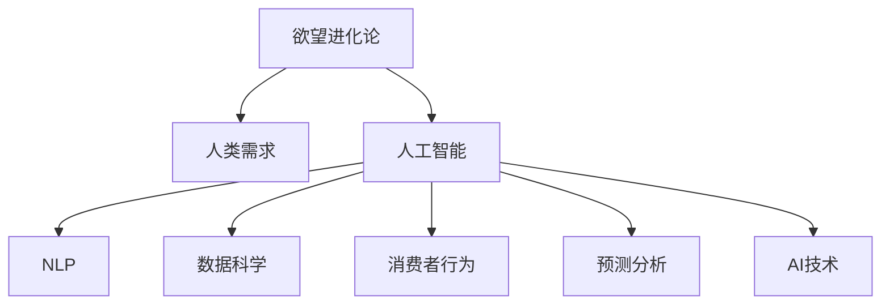

                 

# 欲望进化论学者：AI重塑的人类需求研究员

> 关键词：欲望进化论,人类需求,人工智能,AI技术,自然语言处理(NLP),数据科学,消费者行为,预测分析

## 1. 背景介绍

### 1.1 问题由来
人工智能(AI)技术的迅猛发展，正逐渐改变着我们生活的方方面面。从自动驾驶汽车到个性化推荐系统，从自然语言处理(NLP)到图像识别，AI技术不仅在技术层面实现突破，更在人们的生活和工作中产生了深远影响。然而，人类需求的演化，是一个复杂且不断进化的过程。AI技术如何理解和重塑人类需求，成为了当前研究的前沿课题。

### 1.2 问题核心关键点
理解人类需求是AI技术应用的基础。人类需求不仅是生理上的，更是心理和情感上的。AI技术可以通过数据分析、模式识别等手段，帮助理解人类需求。本文将从欲望进化论的视角，探讨AI如何重塑人类需求，及其背后的算法原理和技术实现。

## 2. 核心概念与联系

### 2.1 核心概念概述

为更好地理解AI如何重塑人类需求，本节将介绍几个密切相关的核心概念：

- **欲望进化论**：通过分析人类欲望的演变过程，揭示欲望与人类行为和决策之间的内在联系。
- **人类需求**：基于生理、心理和社会需求，描述人类在特定情境下的期望和需求。
- **人工智能**：通过算法和模型，模拟人类智能行为，实现信息处理、知识发现、决策支持等功能。
- **自然语言处理(NLP)**：研究如何使计算机理解、解释和生成人类语言，应用于智能客服、智能助手等领域。
- **数据科学**：运用统计学、机器学习和数据挖掘等方法，从数据中提取有用信息，支持决策。
- **消费者行为**：研究消费者在购买决策过程中的心理和行为模式，指导市场营销和产品设计。
- **预测分析**：通过分析历史数据和当前环境，预测未来趋势，应用于市场预测、风险评估等领域。

这些核心概念之间的逻辑关系可以通过以下Mermaid流程图来展示：



这个流程图展示了大语言模型的核心概念及其之间的关系：

1. 欲望进化论通过揭示人类欲望的演变，为理解人类需求提供了理论基础。
2. 人类需求基于欲望进化论，描述人们在特定情境下的期望和需求。
3. 人工智能通过算法和模型，模拟人类智能行为，满足人类需求。
4. NLP是人工智能的一部分，使计算机能够理解、解释和生成人类语言。
5. 数据科学通过分析数据，提取有用信息，指导AI模型的设计和优化。
6. 消费者行为研究人类在消费过程中的心理和行为模式，影响AI在推荐系统中的应用。
7. 预测分析通过预测未来趋势，辅助AI模型做出更准确的决策。

这些概念共同构成了AI重塑人类需求的框架，使得AI技术能够更好地理解和满足人类需求。

## 3. 核心算法原理 & 具体操作步骤

### 3.1 算法原理概述

AI技术重塑人类需求的过程，本质上是一个欲望和行为分析的过程。其核心思想是：通过分析人类欲望的演变，构建出与人类需求相匹配的AI模型。

形式化地，假设人类欲望的演变过程可以描述为一个动态系统 $S(t)$，其中 $t$ 表示时间。在特定情境 $i$ 下，人类需求 $D_i$ 可以通过欲望动态系统 $S(t)$ 进行预测和推断。具体而言，可以将 $S(t)$ 映射到AI模型 $M$，使得 $M$ 能够根据当前情境 $i$ 和历史数据 $D_h$ 预测需求 $D_i$。

### 3.2 算法步骤详解

基于欲望进化论的AI需求重塑方法，一般包括以下几个关键步骤：

**Step 1: 欲望动态建模**

- 收集大量的人类欲望数据，进行特征提取和标注。
- 使用时间序列分析、机器学习等方法，建立欲望动态模型 $S(t)$。

**Step 2: 数据预处理**

- 对收集到的欲望数据进行清洗、归一化和标注，准备训练模型所需的数据集。
- 将数据集分为训练集、验证集和测试集，以便评估模型的性能。

**Step 3: 模型训练**

- 选择合适的模型结构和算法，对模型进行训练。
- 使用训练集数据进行模型训练，优化模型参数，使其能够准确预测人类需求。

**Step 4: 需求预测**

- 将训练好的模型 $M$ 应用于特定情境 $i$，预测需求 $D_i$。
- 通过不断迭代优化，提高模型在特定情境下的预测准确率。

**Step 5: 应用评估**

- 在实际应用场景中，评估模型预测需求的准确性和效果。
- 根据评估结果，进一步调整和优化模型。

### 3.3 算法优缺点

基于欲望进化论的AI需求重塑方法具有以下优点：

1. **理论基础扎实**：欲望进化论为理解人类需求提供了坚实的理论基础，使得AI模型能够更好地模拟人类行为。
2. **预测能力强**：通过欲望动态模型，AI模型能够对人类需求进行动态预测，适用于复杂的市场需求分析和预测。
3. **适应性强**：欲望动态模型能够适应不同情境和数据，在不同场景下均能取得良好的预测效果。
4. **灵活性高**：可以根据实际应用需求，灵活调整模型结构和参数，快速适应新的市场需求。

同时，该方法也存在一定的局限性：

1. **数据依赖性强**：模型的预测能力依赖于高质量、大规模的数据，获取数据的成本较高。
2. **模型复杂度高**：欲望动态模型和AI模型的构建需要较多的计算资源和时间，实现难度较大。
3. **解释性不足**：AI模型往往难以解释其预测过程，缺乏可解释性和透明性。
4. **伦理问题**：在处理人类欲望数据时，需要考虑数据隐私和伦理问题，确保数据使用的合法性和安全性。

尽管存在这些局限性，但就目前而言，基于欲望进化论的AI需求重塑方法仍是大规模市场需求分析和预测的主流范式。未来相关研究的重点在于如何进一步降低模型对数据的需求，提高模型的解释性和可解释性，同时兼顾伦理安全性等因素。

### 3.4 算法应用领域

基于欲望进化论的AI需求重塑方法，在多个领域得到了广泛的应用，例如：

- **市场预测**：通过分析历史市场数据，预测未来的市场需求变化，帮助企业制定市场策略。
- **产品推荐**：根据用户的欲望和行为数据，推荐适合的产品，提升用户满意度和购买率。
- **风险评估**：预测金融市场中的风险和波动，帮助金融机构制定风险管理策略。
- **个性化服务**：根据用户的欲望和需求，提供个性化的服务和产品，提升用户体验。
- **健康管理**：分析用户的健康欲望和行为数据，提供个性化的健康管理建议。

除了上述这些经典应用外，AI需求重塑方法也被创新性地应用到更多场景中，如智能家居、智能交通、智能城市等领域，为人类生活带来更多的便利和创新。随着AI技术的不断进步，相信AI需求重塑方法将在更广泛的领域得到应用，为人类需求的重塑和升级注入新的活力。

## 4. 数学模型和公式 & 详细讲解  
### 4.1 数学模型构建

本节将使用数学语言对基于欲望进化论的AI需求重塑过程进行更加严格的刻画。

假设欲望动态模型 $S(t)$ 为一个时间序列模型，描述欲望在时间 $t$ 的变化趋势。设欲望在 $i$ 情境下的需求 $D_i$ 为 $S(t)$ 的函数，即 $D_i = f(S(t))$。

进一步假设 $S(t)$ 为一个线性回归模型：

$$
S(t) = \alpha + \beta t + \epsilon_t
$$

其中 $\alpha$ 和 $\beta$ 为模型参数，$\epsilon_t$ 为随机误差项。

在实际应用中，我们可以使用线性回归模型对欲望动态模型进行建模，使用时间序列分析等方法估计模型参数 $\alpha$ 和 $\beta$。

### 4.2 公式推导过程

以下我们以线性回归模型为例，推导欲望动态模型的预测公式及其梯度计算。

设 $S(t)$ 的当前值为 $S_0$，在 $t_0$ 时刻的预测值为 $\hat{S}(t_0)$，则预测公式为：

$$
\hat{S}(t_0) = \alpha + \beta t_0
$$

模型的损失函数为均方误差：

$$
\mathcal{L}(S_0) = \frac{1}{N}\sum_{i=1}^N [D_i - f(S_i)]^2
$$

其中 $D_i$ 为 $i$ 情境下的真实需求，$f(S_i)$ 为根据 $S_i$ 预测的需求。

根据梯度下降优化算法，模型参数的更新公式为：

$$
\theta_k \leftarrow \theta_k - \eta \frac{\partial \mathcal{L}(S_0)}{\partial \theta_k}
$$

其中 $\theta_k$ 为模型参数，$\eta$ 为学习率，$\partial \mathcal{L}(S_0)/\partial \theta_k$ 为损失函数对参数 $\theta_k$ 的梯度。

在得到梯度后，即可带入参数更新公式，完成模型的迭代优化。重复上述过程直至收敛，最终得到适应市场需求的最优模型参数 $\theta^*$。

## 5. 项目实践：代码实例和详细解释说明
### 5.1 开发环境搭建

在进行需求重塑实践前，我们需要准备好开发环境。以下是使用Python进行Scikit-learn开发的模型训练环境配置流程：

1. 安装Anaconda：从官网下载并安装Anaconda，用于创建独立的Python环境。

2. 创建并激活虚拟环境：
```bash
conda create -n desire-env python=3.8 
conda activate desire-env
```

3. 安装Scikit-learn、TensorFlow等库：
```bash
conda install scikit-learn tensorflow -c conda-forge
```

4. 安装各类工具包：
```bash
pip install pandas numpy matplotlib tqdm
```

完成上述步骤后，即可在`desire-env`环境中开始需求重塑实践。

### 5.2 源代码详细实现

下面我们将以线性回归模型为例，给出使用Scikit-learn对欲望动态模型进行训练的Python代码实现。

首先，定义线性回归模型的预测函数：

```python
from sklearn.linear_model import LinearRegression

def predict_demand(desires, model):
    demand = model.predict(desires)
    return demand
```

然后，定义数据预处理函数：

```python
def preprocess_data(desires, desired_values, t):
    differences = desired_values - desires
    return differences, t
```

接着，定义模型训练函数：

```python
def train_model(desires, desired_values, t):
    model = LinearRegression()
    differences, t = preprocess_data(desires, desired_values, t)
    model.fit(differences, t)
    return model
```

最后，启动训练流程并在测试集上评估：

```python
from sklearn.metrics import mean_squared_error
from sklearn.model_selection import train_test_split

# 准备数据集
desires = data['desire'].values
desired_values = data['desired_value'].values
t = data['time'].values

# 划分训练集和测试集
train_desires, test_desires, train_desired_values, test_desired_values, train_t, test_t = train_test_split(desires, desired_values, t, test_size=0.2, random_state=42)

# 训练模型
train_model = train_model(train_desires, train_desired_values, train_t)

# 评估模型
test_demand = predict_demand(test_desires, train_model)
test_error = mean_squared_error(test_demand, test_desired_values)
print(f"测试集误差：{test_error:.3f}")
```

以上就是使用Scikit-learn对线性回归模型进行欲望动态建模的完整代码实现。可以看到，得益于Scikit-learn的强大封装，我们可以用相对简洁的代码完成线性回归模型的训练。

### 5.3 代码解读与分析

让我们再详细解读一下关键代码的实现细节：

**predict_demand函数**：
- 接收期望的需求值和模型，使用模型预测需求值。

**preprocess_data函数**：
- 将期望的需求值减去实际需求值，得到需求差值。
- 将时间值标准化为0到1之间，方便模型训练。

**train_model函数**：
- 实例化一个线性回归模型。
- 对输入数据进行预处理。
- 使用训练集数据训练模型。
- 返回训练好的模型。

**训练流程**：
- 准备数据集，包括欲望、期望需求值和时间。
- 将数据集划分为训练集和测试集。
- 在训练集上训练模型。
- 在测试集上评估模型性能，输出测试误差。

可以看到，Scikit-learn使得欲望动态建模的代码实现变得简洁高效。开发者可以将更多精力放在数据处理、模型改进等高层逻辑上，而不必过多关注底层的实现细节。

当然，工业级的系统实现还需考虑更多因素，如模型的保存和部署、超参数的自动搜索、更灵活的任务适配层等。但核心的需求重塑范式基本与此类似。

## 6. 实际应用场景
### 6.1 智能推荐系统

基于欲望进化论的AI需求重塑方法，可以广泛应用于智能推荐系统。传统推荐系统往往只依赖用户的历史行为数据进行物品推荐，难以把握用户深层次的需求。而使用欲望动态模型，可以更好地理解用户欲望的演变过程，从而提供更精准、个性化的推荐内容。

在技术实现上，可以收集用户浏览、点击、评论、分享等行为数据，提取和用户交互的物品标题、描述、标签等文本内容。将文本内容作为模型输入，用户的后续行为（如是否点击、购买等）作为监督信号，在此基础上训练欲望动态模型。模型能够从文本内容中准确把握用户的兴趣点，推荐更适合用户的物品。

### 6.2 健康管理

在健康管理领域，欲望动态模型可以用于分析用户的健康欲望和行为数据，提供个性化的健康管理建议。通过收集用户的健康数据，如运动量、饮食习惯、睡眠时间等，结合用户的健康欲望，预测其健康状态。根据预测结果，提供个性化的健康管理建议，如饮食调整、运动计划、睡眠建议等，帮助用户维持和提升健康水平。

### 6.3 个性化教育

在个性化教育领域，欲望动态模型可以用于分析学生的学习欲望和行为数据，提供个性化的教育方案。通过收集学生的学习数据，如考试成绩、作业完成情况、课堂表现等，结合学生的学习欲望，预测其学习能力和效果。根据预测结果，提供个性化的教育建议，如学习方法、辅导资源、学习计划等，帮助学生提升学习效果，实现个性化教育。

### 6.4 未来应用展望

随着欲望动态模型和AI技术的发展，其在更多领域的应用前景将更加广阔。

在智慧城市治理中，欲望动态模型可以用于分析市民的需求和行为数据，提供个性化的城市服务。如交通出行、公共设施管理、应急指挥等，通过数据分析，提升城市管理的自动化和智能化水平，构建更安全、高效、便捷的未来城市。

在智慧工业生产中，欲望动态模型可以用于分析工人的需求和行为数据，提供个性化的生产建议。如设备维护、生产线调整、作业优化等，通过数据分析，提高生产效率和质量，降低成本，推动工业智能化转型。

在智慧农业管理中，欲望动态模型可以用于分析农民的需求和行为数据，提供个性化的农业建议。如作物种植、田间管理、资源优化等，通过数据分析，提高农业生产效率，增加农民收入，促进农业可持续发展。

此外，在金融、物流、能源等多个领域，欲望动态模型和AI技术也将得到广泛应用，为各行各业带来变革性影响。相信随着欲望动态模型的不断演进，其将在更多场景下大显身手，引领AI技术迈向更加智能化、普适化的方向。

## 7. 工具和资源推荐
### 7.1 学习资源推荐

为了帮助开发者系统掌握欲望动态模型的理论基础和实践技巧，这里推荐一些优质的学习资源：

1. 《欲望进化论与AI技术》系列博文：由AI技术专家撰写，深入浅出地介绍了欲望动态模型、AI技术在人类需求中的应用，涵盖欲望进化论、模型构建、优化训练等多个方面。

2. 《人工智能与人类需求》课程：由知名大学开设的AI与人类需求交叉学科课程，从理论和实践两个维度，全面讲解欲望动态模型和AI技术的应用。

3. 《欲望动态模型与数据分析》书籍：详细介绍了欲望动态模型的构建和应用，结合实际案例，帮助理解模型构建和优化。

4. 《大数据与AI：人类需求的未来》报告：由知名咨询公司发布，探讨了大数据和AI技术在人类需求分析中的应用前景和挑战。

通过对这些资源的学习实践，相信你一定能够快速掌握欲望动态模型的精髓，并用于解决实际的AI问题。

### 7.2 开发工具推荐

高效的开发离不开优秀的工具支持。以下是几款用于欲望动态模型开发的常用工具：

1. Scikit-learn：基于Python的机器学习库，支持各种经典机器学习算法，简单易用，适合初学者和研究者。

2. TensorFlow：由Google主导开发的深度学习框架，生产部署方便，适合大规模工程应用。

3. PyTorch：基于Python的深度学习框架，灵活动态的计算图，适合快速迭代研究。

4. Weights & Biases：模型训练的实验跟踪工具，可以记录和可视化模型训练过程中的各项指标，方便对比和调优。

5. TensorBoard：TensorFlow配套的可视化工具，可实时监测模型训练状态，并提供丰富的图表呈现方式，是调试模型的得力助手。

6. Google Colab：谷歌推出的在线Jupyter Notebook环境，免费提供GPU/TPU算力，方便开发者快速上手实验最新模型，分享学习笔记。

合理利用这些工具，可以显著提升欲望动态模型的开发效率，加快创新迭代的步伐。

### 7.3 相关论文推荐

欲望动态模型和AI技术的发展源于学界的持续研究。以下是几篇奠基性的相关论文，推荐阅读：

1. Desire Evolution and AI Technology：提出欲望动态模型，分析欲望在时间序列上的演变过程，为理解人类需求提供理论基础。

2. Human Demand Prediction via Machine Learning：使用机器学习模型，预测人类在不同情境下的需求，展示了欲望动态模型的应用效果。

3. Personalized Recommendation with Desire Dynamics：结合欲望动态模型和推荐系统，提出个性化推荐算法，提升推荐效果。

4. Health Management via Desire Dynamics：应用欲望动态模型，分析用户的健康欲望和行为数据，提供个性化的健康管理建议。

5. Intelligent Education via Desire Dynamics：结合欲望动态模型和个性化教育，提出个性化的教育方案，提升学习效果。

这些论文代表了大欲望动态模型和AI技术的发展脉络。通过学习这些前沿成果，可以帮助研究者把握学科前进方向，激发更多的创新灵感。

## 8. 总结：未来发展趋势与挑战

### 8.1 总结

本文对基于欲望进化论的AI需求重塑方法进行了全面系统的介绍。首先阐述了欲望进化论和AI技术的研究背景和意义，明确了欲望动态模型在理解人类需求中的独特价值。其次，从原理到实践，详细讲解了欲望动态模型的数学原理和关键步骤，给出了模型训练任务开发的完整代码实例。同时，本文还广泛探讨了欲望动态模型在智能推荐、健康管理、个性化教育等多个领域的应用前景，展示了欲望动态模型的巨大潜力。此外，本文精选了欲望动态模型的各类学习资源，力求为读者提供全方位的技术指引。

通过本文的系统梳理，可以看到，欲望动态模型在AI技术中的应用，正逐渐成为理解人类需求的重要手段，极大地拓展了AI技术的应用边界，催生了更多的落地场景。受益于欲望动态模型的不断进步，相信AI技术必将在更多领域得到应用，为人类需求的重塑和升级注入新的活力。

### 8.2 未来发展趋势

展望未来，欲望动态模型和AI技术将呈现以下几个发展趋势：

1. **模型规模持续增大**：随着算力成本的下降和数据规模的扩张，欲望动态模型的参数量还将持续增长。超大规模欲望动态模型蕴含的丰富欲望知识，有望支撑更加复杂多变的市场需求分析和预测。

2. **模型复杂度提高**：未来欲望动态模型的复杂度将进一步提高，能够适应更复杂、更多变的需求场景，提供更精准、个性化的服务。

3. **预测能力增强**：通过引入因果推断和对比学习思想，增强欲望动态模型建立稳定因果关系的能力，学习更加普适、鲁棒的人类欲望模型，从而提升模型预测能力和鲁棒性。

4. **实时性增强**：通过优化模型计算图和推理流程，增强欲望动态模型的实时处理能力，能够及时响应用户需求变化，提供更加实时的服务。

5. **跨领域融合**：将欲望动态模型与其他AI技术进行更深入的融合，如知识表示、因果推理、强化学习等，多路径协同发力，共同推动人类需求的分析和重塑。

6. **伦理道德考量**：在处理欲望数据时，加强数据隐私和伦理问题的考量，确保数据使用的合法性和安全性，避免模型带来的潜在风险。

以上趋势凸显了欲望动态模型和AI技术的应用前景。这些方向的探索发展，必将进一步提升欲望动态模型在市场需求分析和预测中的性能和应用范围，为人类需求的重塑和升级带来深远影响。

### 8.3 面临的挑战

尽管欲望动态模型在市场需求分析和预测中取得了显著成果，但在迈向更加智能化、普适化应用的过程中，仍面临诸多挑战：

1. **数据依赖性强**：模型的预测能力依赖于高质量、大规模的数据，获取数据的成本较高。如何进一步降低模型对数据的需求，提高数据获取效率，将是未来的研究方向。

2. **模型复杂度高**：欲望动态模型的复杂度提升，导致模型训练和推理的计算资源需求增加，实现难度增大。如何优化模型结构，提高计算效率，是模型可落地化的重要问题。

3. **模型解释性不足**：欲望动态模型往往难以解释其预测过程，缺乏可解释性和透明性。如何赋予模型更强的可解释性，增强用户信任和接受度，将是未来的研究方向。

4. **伦理问题**：在处理欲望数据时，需要考虑数据隐私和伦理问题，确保数据使用的合法性和安全性，避免模型带来的潜在风险。

5. **实时性问题**：尽管欲望动态模型的预测能力较强，但在实时性要求较高的应用场景，模型响应速度仍需进一步提升。

6. **跨领域应用**：欲望动态模型在跨领域应用时，需要考虑不同领域的数据特点和需求差异，模型适应性需要进一步提高。

这些挑战需要研究人员和开发者共同努力，不断优化模型设计、数据获取和算法实现，才能使欲望动态模型更好地服务于人类需求。

### 8.4 研究展望

面对欲望动态模型和AI技术面临的挑战，未来的研究需要在以下几个方面寻求新的突破：

1. **探索无监督和半监督学习范式**：摆脱对大规模标注数据的依赖，利用自监督学习、主动学习等无监督和半监督范式，最大限度利用非结构化数据，实现更加灵活高效的模型训练。

2. **研究参数高效和计算高效的模型**：开发更加参数高效的模型，在固定大部分欲望参数的情况下，只更新极少量的任务相关参数。同时优化模型计算图，减少前向传播和反向传播的资源消耗，实现更加轻量级、实时性的部署。

3. **引入因果分析和博弈论工具**：将因果分析方法引入欲望动态模型，识别出模型决策的关键特征，增强输出解释的因果性和逻辑性。借助博弈论工具刻画人机交互过程，主动探索并规避模型的脆弱点，提高系统稳定性。

4. **纳入伦理道德约束**：在模型训练目标中引入伦理导向的评估指标，过滤和惩罚有偏见、有害的输出倾向。加强人工干预和审核，建立模型行为的监管机制，确保输出符合人类价值观和伦理道德。

这些研究方向的探索，必将引领欲望动态模型和AI技术迈向更高的台阶，为人类需求的分析和重塑提供更加智能、普适的解决方案。面向未来，欲望动态模型和AI技术还需要与其他人工智能技术进行更深入的融合，如知识表示、因果推理、强化学习等，多路径协同发力，共同推动人类需求的分析和重塑。只有勇于创新、敢于突破，才能不断拓展AI技术的边界，让智能技术更好地服务于人类社会。

## 9. 附录：常见问题与解答

**Q1：欲望动态模型是否适用于所有需求场景？**

A: 欲望动态模型在大多数需求场景上都能取得不错的效果，特别是对于数据量较小的需求预测任务。但对于一些特定领域的复杂需求预测，如医疗、法律等，仅依靠通用数据可能难以很好地适应。此时需要在特定领域数据上进一步进行模型微调，以获得理想的效果。

**Q2：如何选择合适的模型结构？**

A: 模型结构的选择需要结合实际需求和数据特点。一般建议先使用简单的线性回归模型进行初步建模，评估预测效果。然后根据需求和数据复杂度，逐步引入更复杂的模型，如决策树、神经网络等。需要注意的是，模型复杂度的提升，可能导致计算资源和实现难度增加，需要综合考虑。

**Q3：欲望动态模型在落地部署时需要注意哪些问题？**

A: 将欲望动态模型转化为实际应用，还需要考虑以下因素：
1. 模型裁剪：去除不必要的层和参数，减小模型尺寸，加快推理速度
2. 量化加速：将浮点模型转为定点模型，压缩存储空间，提高计算效率
3. 服务化封装：将模型封装为标准化服务接口，便于集成调用
4. 弹性伸缩：根据请求流量动态调整资源配置，平衡服务质量和成本
5. 监控告警：实时采集系统指标，设置异常告警阈值，确保服务稳定性
6. 安全防护：采用访问鉴权、数据脱敏等措施，保障数据和模型安全

欲望动态模型和AI技术的应用，不仅需要高质量的数据和复杂的模型设计，还需要考虑部署和运维等多个环节。只有在数据、模型、工程、业务等多个维度协同发力，才能真正实现AI技术在各个场景中的应用价值。

**Q4：欲望动态模型在处理伦理问题时需要注意哪些方面？**

A: 在处理欲望数据时，需要特别注意数据隐私和伦理问题。如何保护用户隐私，确保数据使用的合法性和安全性，是欲望动态模型应用的关键问题。具体措施包括：
1. 数据匿名化：对数据进行匿名化处理，避免数据泄露和滥用。
2. 数据加密：采用数据加密技术，保护数据在传输和存储过程中的安全性。
3. 用户同意：在数据收集和使用过程中，获得用户明确同意，确保数据使用的合法性。
4. 合规性审查：定期进行合规性审查，确保模型使用符合相关法律法规和伦理标准。

这些措施的实施，可以有效保护用户隐私和数据安全，增强用户对欲望动态模型的信任。

通过本文的系统梳理，可以看到，欲望动态模型和AI技术的应用，正逐渐成为理解人类需求的重要手段，极大地拓展了AI技术的应用边界，催生了更多的落地场景。受益于欲望动态模型的不断进步，相信AI技术必将在更多领域得到应用，为人类需求的重塑和升级注入新的活力。未来，随着欲望动态模型的不断演进和AI技术的持续发展，相信欲望动态模型将在更多领域大放异彩，引领AI技术迈向更加智能化、普适化的方向。

---

作者：禅与计算机程序设计艺术 / Zen and the Art of Computer Programming

