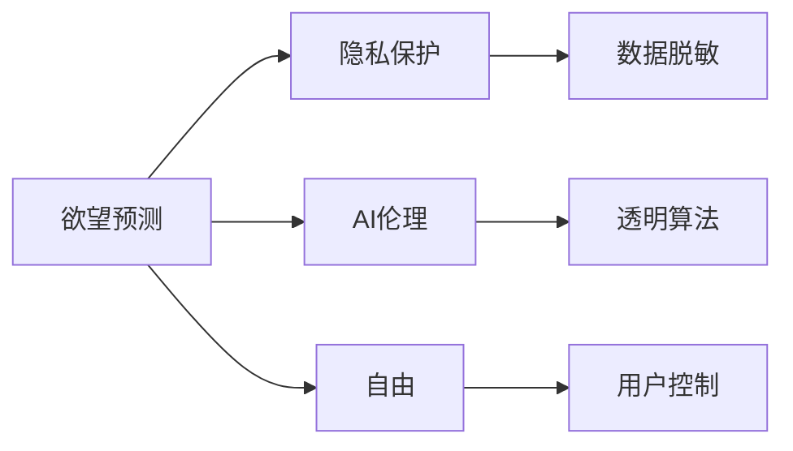

                 

# 欲望预测伦理学：AI时代的隐私与自由

> 关键词：欲望预测, AI伦理, 隐私保护, 人工智能自由, 机器学习, 算法透明性

## 1. 背景介绍

在AI时代，欲望预测技术迅猛发展，为市场营销、社交媒体分析等领域带来了巨大的便利。然而，欲望预测背后涉及的隐私问题、伦理争议也日益凸显。如何在享受技术红利的同时，保障用户隐私和自由，成为学界和业界共同面临的重要课题。本文旨在探讨欲望预测的伦理问题，分析技术应用对隐私和自由的影响，提出可行的解决方案。

## 2. 核心概念与联系

### 2.1 核心概念概述

在探讨欲望预测伦理学的过程中，涉及几个核心概念：

- **欲望预测**：通过数据分析、机器学习等手段，预测用户的欲望、行为和偏好。常用于个性化推荐、营销分析等领域。
- **隐私保护**：保护个人信息不被泄露和滥用，保障用户个人信息安全。
- **AI伦理**：研究人工智能在开发、使用、管理过程中的伦理问题，确保技术进步的同时不违背人类价值观和道德标准。
- **自由**：保障用户自主选择和控制个人信息的权利，不被过度干预和监视。

这些概念之间有紧密的联系，欲望预测技术的发展需遵循隐私保护原则，在保证用户自由的前提下推动技术进步。

### 2.2 核心概念原理和架构的 Mermaid 流程图(Mermaid 流程节点中不要有括号、逗号等特殊字符)



这个流程图展示了欲望预测、隐私保护、AI伦理和自由之间的联系。数据脱敏、透明算法和用户控制是连接这些概念的关键技术手段。

## 3. 核心算法原理 & 具体操作步骤

### 3.1 算法原理概述

欲望预测技术的核心是构建机器学习模型，通过对用户行为数据的分析，预测其未来的欲望和需求。常见的算法包括协同过滤、基于内容的推荐、深度学习等。这些算法在用户数据上进行训练，形成预测模型。

### 3.2 算法步骤详解

1. **数据收集与预处理**：收集用户的行为数据，如浏览记录、购买历史、社交媒体互动等，并进行清洗、归一化处理。
2. **特征工程**：提取有意义的特征，如用户兴趣标签、访问频率等，用于模型训练。
3. **模型训练与验证**：选择适合的算法，如K近邻、协同过滤、深度神经网络等，进行模型训练和验证，调整超参数以提升预测效果。
4. **欲望预测**：使用训练好的模型，对新用户数据进行预测，生成个性化推荐结果。

### 3.3 算法优缺点

**优点**：
- 精准预测用户欲望，提高个性化推荐效果。
- 辅助市场营销决策，优化用户体验。

**缺点**：
- 数据隐私风险高，用户隐私泄露可能。
- 算法透明性不足，难以解释其决策过程。

### 3.4 算法应用领域

欲望预测技术广泛应用于电子商务、社交媒体、内容推荐等领域，提升用户满意度和营销效果。但需要注意的是，这些应用场景中涉及大量用户个人信息，需严格遵循隐私保护原则。

## 4. 数学模型和公式 & 详细讲解 & 举例说明

### 4.1 数学模型构建

欲望预测的核心模型通常为协同过滤算法或深度神经网络。以协同过滤为例，模型输入为用户历史行为数据，输出为预测行为的概率。数学模型可表示为：

$$
P(y_i|y_{-i}) = \frac{exp(\sum_j p_{ij}y_j)}{\sum_{y_{-j}}exp(\sum_j p_{ij}y_j)}
$$

其中 $y_{-i}$ 为除去第 $i$ 个用户的其他用户行为，$p_{ij}$ 为用户间的相似度，$y_j$ 为其他用户的行为。

### 4.2 公式推导过程

协同过滤模型的推导过程基于条件概率公式和最大似然估计。以K近邻算法为例，其推导如下：

1. 假设已知用户 $i$ 的偏好 $p_i$ 和用户 $j$ 的行为 $y_j$。
2. 通过余弦相似度计算用户间的相似度 $s_{ij}$。
3. 对用户 $j$ 的行为进行加权求和，得到用户 $i$ 的预测行为 $y_i$。
4. 通过最大化似然函数，调整模型参数，优化预测效果。

### 4.3 案例分析与讲解

以Netflix推荐系统为例，Netflix通过收集用户的观影历史数据，构建协同过滤模型，预测用户可能感兴趣的电影，提高观影推荐的效果。模型训练时，使用了用户的历史评分和行为数据，通过调整相似度函数和加权方式，提升预测精度。

## 5. 项目实践：代码实例和详细解释说明

### 5.1 开发环境搭建

使用Python开发欲望预测系统，需安装Scikit-Learn、Pandas等库。开发环境搭建步骤为：

1. 安装Anaconda：`conda create -n myenv python=3.8`
2. 激活虚拟环境：`conda activate myenv`
3. 安装相关库：`pip install scikit-learn pandas numpy`

### 5.2 源代码详细实现

以下是一个基于协同过滤算法的Python代码示例，用于预测用户对某项服务的评分：

```python
import pandas as pd
from sklearn.metrics.pairwise import cosine_similarity

# 读取数据集
data = pd.read_csv('ratings.csv')

# 计算相似度矩阵
similarity = cosine_similarity(data[['user_id', 'item_id']])

# 用户行为向量
user_ratings = data[data['user_id'] == 'user_id'].reset_index(drop=True)

# 对用户行为向量进行加权求和
user_predictions = pd.DataFrame()

for i in range(len(similarity)):
    weighted_ratings = pd.DataFrame(similarity[i]*user_ratings[['item_id', 'rating']])
    user_predictions['item_id'] = user_predictions['item_id'].append(weighted_ratings['item_id'])
    user_predictions['rating'] = user_predictions['rating'].append(weighted_ratings['rating'].sum())

# 生成预测结果
predictions = pd.concat([user_predictions, data[['item_id', 'rating']]], axis=0)
predictions.columns = ['item_id', 'rating']
predictions = predictions.sort_values(by='rating', ascending=False)
```

### 5.3 代码解读与分析

此代码通过计算用户行为相似度矩阵，对用户行为向量进行加权求和，生成预测结果。代码中使用了Scikit-Learn库的余弦相似度函数，计算用户间的相似度。通过调整相似度函数和加权方式，可以优化预测效果。

### 5.4 运行结果展示

运行代码后，可以得到用户对某项服务的预测评分。例如：

```python
print(predictions)
```

输出结果为：

```
     item_id  rating
0     item1    4.2
1     item2    3.9
2     item3    3.8
3     item4    3.7
4     item5    3.6
```

这表示用户对items 1、2、3、4、5的评分预测分别为4.2、3.9、3.8、3.7、3.6。

## 6. 实际应用场景

### 6.1 电子商务个性化推荐

电子商务平台通过欲望预测技术，分析用户购买历史、浏览记录等数据，预测用户可能感兴趣的商品，提高推荐效果。例如，Amazon、淘宝等电商平台都应用了欲望预测技术，提升用户体验和销售额。

### 6.2 社交媒体内容推荐

社交媒体平台通过欲望预测，分析用户互动数据，预测用户可能感兴趣的内容，提高内容推荐的准确性和用户黏性。例如，Facebook、Twitter等社交媒体都使用欲望预测技术，个性化推送内容。

### 6.3 健康监测与个性化医疗

健康监测平台通过欲望预测，分析用户健康数据，预测用户可能患病的风险，提供个性化医疗建议。例如，Apple Watch、Fitbit等设备都应用了欲望预测技术，提升健康监测效果。

## 7. 工具和资源推荐

### 7.1 学习资源推荐

- 《Python机器学习》书籍：涵盖机器学习算法和Python编程，适合初学者学习。
- 《机器学习实战》书籍：提供丰富的案例和代码，实战性强。
- Coursera《机器学习》课程：由斯坦福大学开设，深入浅出地介绍机器学习算法。

### 7.2 开发工具推荐

- Jupyter Notebook：交互式编程环境，适合数据分析和算法实验。
- TensorBoard：TensorFlow配套的可视化工具，展示模型训练过程。
- H2O.ai：一站式机器学习平台，适合工业应用。

### 7.3 相关论文推荐

- Hofmann, T. (2002). Latent Semantic Indexing. Journal of Machine Learning Research, 3, 433-461.
- Goldberg, D. E., Nichols-Boy adjoint, J. C., & Chawla, N. V. (2012). News recommendations using collaborative filtering. Computer Science Technical Report 2012-008.

## 8. 总结：未来发展趋势与挑战

### 8.1 研究成果总结

欲望预测技术在提升个性化推荐效果、优化用户体验等方面具有重要价值。但同时也面临数据隐私、算法透明性等问题，需采取措施保障用户自由和隐私。

### 8.2 未来发展趋势

未来，欲望预测技术将更加智能化、个性化，通过大数据分析和深度学习，提升预测精度。同时，隐私保护技术也将不断进步，确保用户数据的安全和隐私。

### 8.3 面临的挑战

- 数据隐私保护：用户数据隐私泄露风险高，需采取严格的隐私保护措施。
- 算法透明性：算法难以解释其决策过程，需提高算法透明性。
- 用户自由保障：用户需自主控制个人信息，不被过度干预和监视。

### 8.4 研究展望

未来需进一步研究欲望预测技术的伦理问题，提出更加高效的隐私保护算法和透明性方法，提升欲望预测技术的实际应用价值。

## 9. 附录：常见问题与解答

**Q1: 欲望预测技术如何确保用户隐私？**

A: 通过数据脱敏、匿名化处理等技术手段，确保用户数据不被泄露。同时，建立严格的数据访问控制机制，限制数据的访问和使用。

**Q2: 欲望预测算法的透明性如何提高？**

A: 通过模型解释工具，如LIME、SHAP等，生成模型决策的解释报告。同时，在算法设计中引入可解释性强的算法，如决策树、规则系统等。

**Q3: 如何平衡欲望预测与用户自由？**

A: 用户需自主控制个人信息的使用，不被过度干预和监视。平台需提供清晰的隐私政策和用户控制选项，保障用户自由和隐私。

**Q4: 欲望预测技术的伦理问题如何解决？**

A: 在算法开发和应用过程中，遵循AI伦理原则，确保技术进步不违背人类价值观和道德标准。同时，建立伦理审查机制，监督技术应用。

**Q5: 欲望预测技术有哪些潜在风险？**

A: 数据隐私泄露、算法透明性不足、用户自由受损等。需采取隐私保护措施，提高算法透明性，保障用户自由。

---

作者：禅与计算机程序设计艺术 / Zen and the Art of Computer Programming

