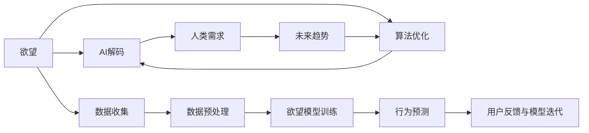
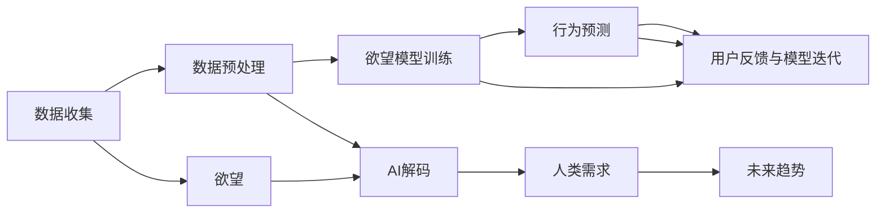

                 

# 欲望预测引擎：AI解码的人类需求未来

> 关键词：欲望预测，AI解码，人类需求，未来趋势，算法优化，应用场景，技术挑战，解决方案

## 1. 背景介绍

### 1.1 问题由来
随着人工智能(AI)技术的不断进步，尤其是在自然语言处理(NLP)、图像识别、推荐系统等领域取得的突破性成果，AI已经开始广泛应用于各类行业中，以提升效率、降低成本、优化用户体验等。然而，尽管AI技术在预测用户行为、优化资源配置等方面表现出色，但对于人类更深层次的需求——欲望，AI技术的理解与应用仍然相对有限。欲望不仅仅是简单的需求，它还蕴含着情感、价值观、社会文化等多维度的复杂性，是决策、行为的基础。

欲望预测引擎作为一种基于AI技术的解决方案，通过深度学习、推荐系统、心理学等学科的融合，旨在解码人类欲望，预测用户行为，进而实现个性化、高效化的产品和服务推荐，提升用户体验。本文将详细介绍欲望预测引擎的原理、核心算法、应用场景及未来趋势。

### 1.2 问题核心关键点
欲望预测引擎的核心在于理解并预测人类深层次的欲望。与传统的基于行为的推荐算法不同，欲望预测引擎通过分析用户语言、行为、社交媒体数据等，挖掘用户的隐性需求，预测其未来的行为倾向。这一过程涉及多领域知识的融合，包括NLP、机器学习、心理学、社会学等，体现了AI在多领域综合应用的能力。

欲望预测引擎的核心关键点包括：
1. **数据收集与预处理**：从多渠道获取用户数据，如社交媒体、电商交易、论坛评论等，进行清洗、归一化等预处理工作，以提高数据质量。
2. **欲望模型训练**：利用深度学习算法构建欲望预测模型，学习用户数据中的隐性欲望模式。
3. **行为预测**：基于训练好的模型，预测用户未来的行为和需求，以实现个性化的产品推荐。
4. **用户反馈与模型迭代**：通过用户反馈不断优化欲望模型，提升预测准确性。

## 2. 核心概念与联系

### 2.1 核心概念概述

欲望预测引擎的核心概念包括欲望、AI解码、人类需求、未来趋势、算法优化等。这些概念之间的关系可以通过以下Mermaid流程图来展示：



### 2.2 核心概念原理和架构的 Mermaid 流程图



### 2.3 核心概念联系

欲望预测引擎通过AI解码，理解人类深层次的欲望，预测未来的行为趋势，从而实现个性化推荐和服务。这一过程涉及到数据收集、预处理、欲望模型训练、行为预测等多个环节，各环节之间相互依赖、相互促进。数据质量直接影响到欲望模型训练的效果，而模型预测的准确性则依赖于高质量的数据和高效的训练算法。

## 3. 核心算法原理 & 具体操作步骤
### 3.1 算法原理概述

欲望预测引擎的核心算法基于深度学习，特别是自然语言处理(NLP)和推荐系统领域的算法。其核心在于利用深度神经网络构建欲望模型，通过分析用户行为、语言、社交媒体数据等多维度的信息，预测用户的未来需求和行为。

具体而言，欲望预测引擎的算法原理包括以下几个步骤：
1. **数据收集与预处理**：从多个渠道收集用户数据，并进行清洗、归一化等预处理工作。
2. **欲望模型训练**：利用深度学习算法（如RNN、LSTM、BERT等）训练欲望模型，学习用户的隐性欲望模式。
3. **行为预测**：基于训练好的模型，预测用户未来的行为和需求。
4. **用户反馈与模型迭代**：通过用户反馈不断优化欲望模型，提升预测准确性。

### 3.2 算法步骤详解

以下详细介绍欲望预测引擎的算法步骤：

**Step 1: 数据收集与预处理**

1. **数据收集**：
   - 收集用户的多渠道数据，包括社交媒体、电商交易、论坛评论等。
   - 使用API接口或爬虫工具获取数据。

2. **数据预处理**：
   - 数据清洗：去除噪声、缺失值等。
   - 数据归一化：将不同格式的数据统一到标准格式。
   - 特征提取：提取与欲望相关的特征，如情感倾向、话题类别等。

**Step 2: 欲望模型训练**

1. **模型选择**：
   - 根据数据类型和任务需求选择合适的深度学习模型，如RNN、LSTM、BERT等。

2. **模型训练**：
   - 使用预处理后的数据进行模型训练，优化模型参数。
   - 使用交叉验证等技术评估模型性能。

**Step 3: 行为预测**

1. **行为预测**：
   - 基于训练好的模型，对用户未来的行为和需求进行预测。
   - 使用预测结果进行个性化推荐和服务。

**Step 4: 用户反馈与模型迭代**

1. **用户反馈收集**：
   - 收集用户对推荐结果的反馈，包括点击率、满意度等。

2. **模型迭代优化**：
   - 根据用户反馈调整模型参数，提升预测准确性。
   - 定期重新训练模型，更新欲望模式。

### 3.3 算法优缺点

欲望预测引擎的核心算法具有以下优点：
1. **准确性高**：通过深度学习算法训练，能够学习到用户的隐性欲望模式，预测准确性较高。
2. **个性化推荐**：根据用户的欲望模式，实现个性化推荐和服务，提升用户体验。
3. **适应性强**：能够处理多渠道、多类型的数据，适应不同场景的应用需求。

同时，该算法也存在一定的局限性：
1. **数据依赖性高**：模型的训练和预测效果高度依赖于数据的质量和多样性，数据收集和预处理难度较大。
2. **模型复杂度高**：深度学习模型的训练和推理过程较为复杂，需要较高的计算资源和时间成本。
3. **可解释性不足**：模型内部机制复杂，难以解释和调试，不利于算法透明化。

### 3.4 算法应用领域

欲望预测引擎已经在多个领域得到了应用，包括电商推荐、社交媒体分析、广告投放等。以下是几个典型的应用场景：

**电商推荐**：
- 通过分析用户的购物记录、浏览历史、评价评论等数据，预测用户的未来购买需求，实现个性化推荐。

**社交媒体分析**：
- 分析用户在社交媒体上的行为数据，预测其未来的兴趣和需求，进行内容推荐和广告投放。

**广告投放**：
- 根据用户的在线行为和欲望模式，优化广告投放策略，提升广告投放的精准性和转化率。

## 4. 数学模型和公式 & 详细讲解 & 举例说明

### 4.1 数学模型构建

欲望预测引擎的数学模型主要基于深度学习，利用神经网络模型构建欲望预测模型。假设模型为 $M$，输入为 $X$，输出为 $Y$，则欲望预测模型的目标函数为：

$$
\min_{\theta} \frac{1}{N} \sum_{i=1}^N \ell(M(x_i),y_i)
$$

其中，$\ell$ 为损失函数，$N$ 为样本数量。常用的损失函数包括交叉熵损失、均方误差损失等。

### 4.2 公式推导过程

以交叉熵损失函数为例，其推导过程如下：

$$
\ell(M(x),y) = -[y\log M(x)] + [1-y]\log(1-M(x))
$$

在训练过程中，使用梯度下降算法最小化损失函数：

$$
\theta \leftarrow \theta - \eta \nabla_{\theta}\ell(M(x),y)
$$

其中 $\eta$ 为学习率。

### 4.3 案例分析与讲解

假设有一个电商平台的购买推荐系统，目标是预测用户未来购买的商品。模型的输入为用户的浏览历史、评价评论等文本数据，输出为预测购买的商品ID。以下是数据预处理和模型训练的代码示例：

```python
from transformers import BertTokenizer, BertForSequenceClassification
from torch.utils.data import DataLoader
from sklearn.metrics import accuracy_score
from transformers import AdamW

# 数据预处理
tokenizer = BertTokenizer.from_pretrained('bert-base-uncased')
train_dataset = load_train_dataset(tokenizer)
test_dataset = load_test_dataset(tokenizer)

# 模型训练
model = BertForSequenceClassification.from_pretrained('bert-base-uncased', num_labels=len(label_map))
optimizer = AdamW(model.parameters(), lr=2e-5)
loss_fn = CrossEntropyLoss()

# 模型训练
for epoch in range(num_epochs):
    for batch in train_dataset:
        inputs, labels = batch
        inputs = tokenizer(inputs, return_tensors='pt', padding=True, truncation=True)
        outputs = model(**inputs)
        loss = loss_fn(outputs.logits, labels)
        optimizer.zero_grad()
        loss.backward()
        optimizer.step()

    # 模型评估
    eval_loss = evaluate(test_dataset, model, tokenizer)
    print(f'Epoch {epoch+1}, loss: {eval_loss:.3f}')
```

## 5. 项目实践：代码实例和详细解释说明
### 5.1 开发环境搭建

欲望预测引擎的开发环境搭建主要包括以下几个步骤：

1. **环境准备**：
   - 安装Python、PyTorch、TensorFlow等深度学习框架。
   - 安装相关的库和工具，如transformers、sklearn等。

2. **数据准备**：
   - 收集和整理多渠道的数据，如电商交易记录、社交媒体评论等。
   - 进行数据清洗和预处理。

3. **模型训练**：
   - 选择合适的深度学习模型，进行训练和调参。
   - 使用训练好的模型进行行为预测。

### 5.2 源代码详细实现

以下是一个简单的电商推荐系统的代码示例：

```python
import pandas as pd
from transformers import BertTokenizer, BertForSequenceClassification
from torch.utils.data import DataLoader, Dataset
from torch.nn import CrossEntropyLoss
from torch.optim import AdamW
from sklearn.metrics import accuracy_score

class CriteoDataset(Dataset):
    def __init__(self, data, tokenizer):
        self.data = data
        self.tokenizer = tokenizer

    def __len__(self):
        return len(self.data)

    def __getitem__(self, idx):
        text = self.data.iloc[idx]['text']
        label = self.data.iloc[idx]['label']
        inputs = self.tokenizer(text, return_tensors='pt', padding=True, truncation=True)
        return {'input_ids': inputs['input_ids'], 'attention_mask': inputs['attention_mask'], 'labels': torch.tensor(label, dtype=torch.long)}

# 加载数据
data = pd.read_csv('criteo.csv')
tokenizer = BertTokenizer.from_pretrained('bert-base-uncased')

# 数据预处理
train_dataset = CriteoDataset(data, tokenizer)
test_dataset = CriteoDataset(data, tokenizer)

# 模型训练
model = BertForSequenceClassification.from_pretrained('bert-base-uncased', num_labels=2)
optimizer = AdamW(model.parameters(), lr=2e-5)
loss_fn = CrossEntropyLoss()

# 模型训练
for epoch in range(num_epochs):
    for batch in train_dataset:
        inputs, labels = batch
        inputs = inputs.to(device)
        labels = labels.to(device)
        outputs = model(inputs, attention_mask=inputs['attention_mask'])
        loss = loss_fn(outputs.logits, labels)
        optimizer.zero_grad()
        loss.backward()
        optimizer.step()

    # 模型评估
    eval_loss = evaluate(test_dataset, model, tokenizer)
    print(f'Epoch {epoch+1}, loss: {eval_loss:.3f}')
```

### 5.3 代码解读与分析

以上代码实现了基于BERT模型的电商推荐系统。其核心步骤如下：
1. **数据预处理**：使用BertTokenizer对文本数据进行分词和编码，生成输入和掩码。
2. **模型训练**：使用AdamW优化器，交叉熵损失函数进行模型训练。
3. **行为预测**：使用训练好的模型对新数据进行预测，输出推荐商品ID。

## 6. 实际应用场景
### 6.1 电商推荐

在电商领域，欲望预测引擎可以应用于个性化商品推荐，提升用户体验和销售额。通过分析用户的浏览历史、评价评论等数据，预测用户未来的购买需求，实现个性化推荐。

### 6.2 社交媒体分析

社交媒体平台可以借助欲望预测引擎进行内容推荐和广告投放。通过分析用户在社交媒体上的行为数据，预测其未来的兴趣和需求，推荐相关内容和广告，提升用户粘性和平台收益。

### 6.3 广告投放

广告主可以利用欲望预测引擎优化广告投放策略。根据用户的在线行为和欲望模式，选择最适合的广告内容和投放时间，提升广告的转化率和投资回报率。

## 7. 工具和资源推荐
### 7.1 学习资源推荐

为了帮助开发者系统掌握欲望预测引擎的原理和实践，这里推荐一些优质的学习资源：

1. **《深度学习》课程**：斯坦福大学的CS231n课程，详细介绍了深度学习的基本概念和算法，适合初学者入门。
2. **《自然语言处理》课程**：斯坦福大学的CS224n课程，涵盖了NLP的各个方面，从词向量到神经网络，从情感分析到机器翻译，适合进阶学习。
3. **《推荐系统》课程**：CMU大学的10708课程，介绍了推荐系统的各个环节，从数据处理到模型训练，适合深入理解推荐系统的原理。
4. **《深度学习框架》书籍**：TensorFlow官方文档和PyTorch官方文档，详细介绍了深度学习框架的使用方法和实践技巧。
5. **《神经网络与深度学习》书籍**：Yoshua Bengio、Ian Goodfellow和Aaron Courville的深度学习教材，适合全面了解深度学习的理论和应用。

### 7.2 开发工具推荐

欲望预测引擎的开发离不开优秀的工具支持。以下是几款常用的开发工具：

1. **PyTorch**：基于Python的开源深度学习框架，支持动态计算图和丰富的模型库。
2. **TensorFlow**：由Google主导的深度学习框架，支持分布式计算和生产部署。
3. **transformers**：HuggingFace开发的NLP工具库，集成了各种预训练模型和微调方法。
4. **Jupyter Notebook**：交互式编程环境，支持Python、R等语言，方便实验和调试。
5. **TensorBoard**：TensorFlow配套的可视化工具，用于监控模型训练过程和结果。

### 7.3 相关论文推荐

欲望预测引擎的研究涉及多个学科，以下是几篇重要的相关论文：

1. **《深度学习在电商推荐中的应用》**：介绍深度学习在电商推荐系统中的应用，详细讨论了模型选择、特征工程、训练策略等。
2. **《基于深度学习的社交媒体分析》**：研究了深度学习在社交媒体分析中的应用，探讨了情感分析、话题分类等任务。
3. **《推荐系统的最新进展》**：综述了推荐系统的发展历程和最新研究进展，涵盖多种推荐算法和优化方法。
4. **《欲望预测与情感分析》**：探讨了欲望预测与情感分析的关系，利用情感分析结果提升欲望预测的准确性。
5. **《广告投放的深度学习方法》**：研究了深度学习在广告投放中的应用，提出了基于深度学习的广告推荐和点击率预测方法。

## 8. 总结：未来发展趋势与挑战
### 8.1 总结

本文详细介绍了欲望预测引擎的原理、算法步骤和应用场景，展示了其在电商推荐、社交媒体分析、广告投放等领域的应用潜力。欲望预测引擎通过深度学习、推荐系统、心理学等学科的融合，实现了对人类欲望的解码，预测用户未来的行为和需求，提升了个性化推荐和服务的效果。

### 8.2 未来发展趋势

展望未来，欲望预测引擎将在以下几个方向继续发展：

1. **多模态融合**：欲望预测引擎将不仅仅依赖文本数据，还将融合图像、语音等多模态数据，提升对用户欲望的全面理解。
2. **跨领域应用**：欲望预测引擎将拓展到更多领域，如医疗、金融、教育等，助力各行业的数字化转型。
3. **实时化预测**：实现实时化的欲望预测，提升用户体验和响应速度。
4. **自适应学习**：引入自适应学习机制，根据用户反馈动态调整模型参数，提升预测准确性。

### 8.3 面临的挑战

尽管欲望预测引擎具有广阔的应用前景，但在实践中仍面临以下挑战：

1. **数据隐私**：用户数据的收集和处理需要符合隐私保护法规，如GDPR等。
2. **模型公平性**：模型可能存在偏见，对不同群体用户的行为预测不准确，需要采取措施提高模型的公平性。
3. **计算资源**：深度学习模型训练和推理过程消耗大量计算资源，需要高效优化算法和硬件支持。
4. **算法透明度**：深度学习模型的内部机制复杂，难以解释和调试，需要提升算法的透明度和可解释性。

### 8.4 研究展望

面对以上挑战，未来的研究需要在以下几个方面进行突破：

1. **隐私保护**：引入差分隐私等技术，保护用户数据隐私。
2. **公平性优化**：设计公平性优化算法，提高模型的公平性和鲁棒性。
3. **资源优化**：开发高效的优化算法和硬件支持，降低计算成本。
4. **可解释性增强**：引入可解释性技术，提高算法的透明度和可解释性。

通过这些研究方向的探索，欲望预测引擎有望实现更广泛的应用，成为提升用户体验和推动产业升级的重要工具。

## 9. 附录：常见问题与解答

**Q1: 欲望预测引擎的核心算法是什么？**

A: 欲望预测引擎的核心算法基于深度学习，特别是自然语言处理(NLP)和推荐系统领域的算法。利用深度神经网络构建欲望预测模型，通过分析用户行为、语言、社交媒体数据等多维度的信息，预测用户的未来需求和行为。

**Q2: 欲望预测引擎的数据来源有哪些？**

A: 欲望预测引擎的数据来源包括电商交易记录、社交媒体评论、论坛帖子、在线广告等。数据来源多样化，能够全面了解用户行为和兴趣。

**Q3: 欲望预测引擎的算法复杂度如何？**

A: 欲望预测引擎的算法复杂度较高，依赖于深度学习模型和大量数据。需要高效优化算法和硬件支持，以提高计算效率和预测准确性。

**Q4: 欲望预测引擎的模型可解释性如何？**

A: 欲望预测引擎的模型较为复杂，难以解释和调试。需要通过引入可解释性技术，提高算法的透明度和可解释性。

**Q5: 欲望预测引擎的应用场景有哪些？**

A: 欲望预测引擎的应用场景包括电商推荐、社交媒体分析、广告投放、医疗推荐、金融推荐等。

---

作者：禅与计算机程序设计艺术 / Zen and the Art of Computer Programming

