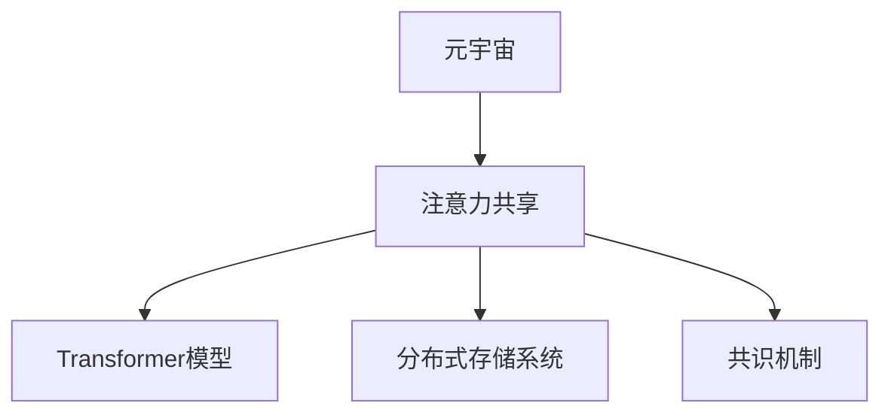
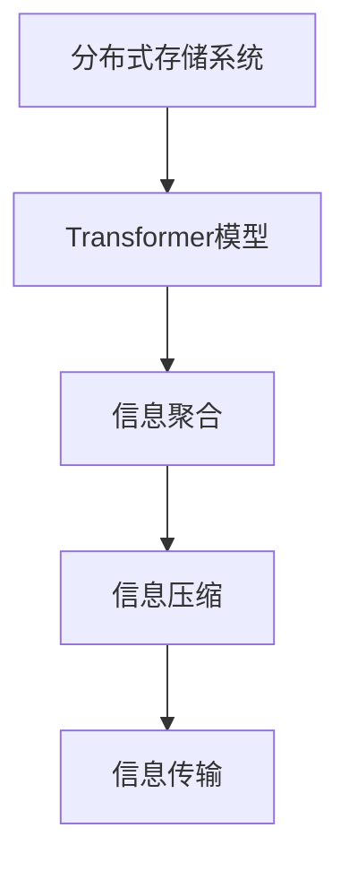

                 

# 注意力共享:元宇宙中的信息共享

## 1. 背景介绍

### 1.1 问题由来

元宇宙（Metaverse）是近年来热议的话题，它代表了一个高度沉浸、交互式和数字化的虚拟空间，旨在通过计算机技术模拟真实的现实世界，并允许用户在其中进行多种活动。元宇宙中，信息共享是核心功能之一，涉及到信息传输、存储、搜索、聚合等多个方面，是实现元宇宙高效运行的基础。

然而，现有的信息共享方案存在诸多局限性：数据冗余、存储成本高、信息孤岛等问题。如何实现高效的信息共享，成为元宇宙技术发展的一个关键瓶颈。

### 1.2 问题核心关键点

要解决这个问题，需要开发一种新型的信息共享技术，即注意力共享（Attention Sharing）。注意力共享利用先进的计算机视觉和自然语言处理技术，在元宇宙中实现信息的聚合、存储、搜索和传输，以极小的存储空间，高效地支持海量信息共享。

注意力共享的核心思想是通过注意力机制（Attention Mechanism）来筛选和聚合信息，将重要信息提取出来，减少冗余存储，提高信息检索和处理的效率。其原理与自然语言处理中的Transformer模型相似，但在元宇宙中的应用更为广泛和复杂。

## 2. 核心概念与联系

### 2.1 核心概念概述

为更好地理解注意力共享技术，本节将介绍几个密切相关的核心概念：

- **元宇宙（Metaverse）**：通过计算机技术构建的虚拟空间，包含虚拟物品、虚拟社交、虚拟经济等多个子系统，实现高度沉浸、交互式和数字化的体验。
- **注意力共享（Attention Sharing）**：一种新型信息共享技术，利用注意力机制筛选和聚合信息，实现高效的信息检索和传输。
- **Transformer模型**：一种用于自然语言处理领域的先进模型，能够通过自注意力机制（Self-Attention）高效地处理输入序列。
- **分布式存储系统**：元宇宙中，信息共享通常依赖于分布式存储系统，如IPFS、Web3等。
- **共识机制**：在元宇宙中，信息共享依赖于一致性协议（Consensus Protocol），保证信息共享的安全性和一致性。

这些核心概念之间的逻辑关系可以通过以下Mermaid流程图来展示：



这个流程图展示了几者之间的关系：

1. 元宇宙提供了一个虚拟空间，是信息共享的承载体。
2. 注意力共享利用Transformer模型，实现信息筛选和聚合。
3. 分布式存储系统支持海量信息的存储和传输。
4. 共识机制确保信息共享的安全性和一致性。

这些概念共同构成了元宇宙信息共享的技术框架，使得元宇宙能够高效、安全地实现信息的聚合和传输。

## 3. 核心算法原理 & 具体操作步骤

### 3.1 算法原理概述

注意力共享的原理基于注意力机制，类似于自然语言处理中的Transformer模型。具体步骤如下：

1. **信息编码**：使用分布式存储系统对信息进行编码，将其转化为计算机可处理的格式。
2. **信息聚合**：使用Transformer模型中的自注意力机制，筛选和聚合信息，将重要信息提取出来。
3. **信息压缩**：将提取出的重要信息进行压缩，减少冗余存储。
4. **信息传输**：将压缩后的信息在元宇宙中进行传输，保证信息的实时性和一致性。

注意力共享的核心在于如何高效地筛选和聚合信息，利用注意力机制可以解决这一问题。其流程如下图所示：



### 3.2 算法步骤详解

1. **信息编码**：使用分布式存储系统对信息进行编码，如IPFS、Web3等。这些系统可以将信息转化为哈希值，保证信息的不可篡改性和唯一性。

2. **信息聚合**：使用Transformer模型中的自注意力机制，对编码后的信息进行筛选和聚合。自注意力机制能够计算输入序列中不同位置的信息的相关性，从而筛选出重要信息。具体流程如下：
   - 将编码后的信息输入Transformer模型，通过自注意力机制计算不同位置信息的相关性。
   - 计算不同位置信息的重要性权重，选择权重高的信息作为重要信息。
   - 将重要信息提取出来，用于进一步的处理和传输。

3. **信息压缩**：将提取出的重要信息进行压缩，减少冗余存储。可以使用数据压缩算法，如Huffman编码、LZW压缩等，将重要信息压缩成更小的数据量。

4. **信息传输**：将压缩后的信息在元宇宙中进行传输，确保信息的实时性和一致性。可以使用P2P网络技术，如BitTorrent、NAT-PMP等，实现信息的高效传输。

### 3.3 算法优缺点

注意力共享具有以下优点：

- 高效性：利用注意力机制能够高效地筛选和聚合信息，减少冗余存储，提高信息检索和处理的效率。
- 可扩展性：分布式存储系统和P2P网络技术可以支持海量信息的存储和传输，满足元宇宙的信息需求。
- 安全性：分布式存储系统和共识机制可以保证信息的安全性和一致性，避免信息篡改和丢失。

同时，该方法也存在一些局限性：

- 对计算资源要求高：使用Transformer模型和分布式存储系统需要较大的计算资源。
- 算法复杂度高：注意力机制和分布式存储系统增加了算法的复杂度，增加了系统开发的难度。
- 实现难度大：涉及分布式系统、计算机视觉、自然语言处理等多个领域，实现难度较大。

尽管存在这些局限性，但注意力共享技术在元宇宙中的应用前景广阔，具有极大的发展潜力。

### 3.4 算法应用领域

注意力共享技术可以应用于元宇宙中的多个领域，例如：

- **虚拟物品管理**：在元宇宙中，每个物品都有其独特的属性和信息。使用注意力共享技术可以对这些信息进行聚合和压缩，实现高效的信息管理。
- **虚拟社交**：元宇宙中的社交活动需要大量的信息共享，如好友列表、聊天记录等。注意力共享可以高效地对这些信息进行聚合和存储，提高社交活动的便捷性。
- **虚拟经济**：元宇宙中的经济活动涉及大量的交易和信息，如交易记录、市场数据等。注意力共享可以高效地对这些信息进行聚合和压缩，支持元宇宙经济的正常运转。
- **虚拟游戏**：元宇宙中的游戏需要大量的数据支持，如游戏规则、地图数据等。注意力共享可以高效地对这些信息进行聚合和存储，提高游戏的流畅性和体验。

## 4. 数学模型和公式 & 详细讲解

### 4.1 数学模型构建

假设元宇宙中有N个信息源，每个信息源有L个属性，记为 $X=[x_1,x_2,\dots,x_N] \in \mathbb{R}^{L \times N}$。注意力共享的目标是从这些信息源中筛选出重要性高的信息，记为 $Y=[y_1,y_2,\dots,y_N] \in \mathbb{R}^{L \times N}$，其中 $y_i \in [0,1]$，表示信息源 $i$ 的重要程度。

注意力共享的数学模型可以表示为：

$$
Y = \mathop{\arg\max}_{Y} \mathcal{L}(Y;X)
$$

其中，$\mathcal{L}(Y;X)$ 为损失函数，用于衡量模型预测的重要性与实际重要性的差异。

### 4.2 公式推导过程

注意力共享的损失函数可以表示为：

$$
\mathcal{L}(Y;X) = \frac{1}{N}\sum_{i=1}^N \sum_{j=1}^L (y_{i,j} - \hat{y}_{i,j})^2
$$

其中，$y_{i,j}$ 表示信息源 $i$ 在属性 $j$ 的重要程度，$\hat{y}_{i,j}$ 表示模型预测的重要程度。

使用均方误差作为损失函数，目标函数可以表示为：

$$
\min_{Y} \mathcal{L}(Y;X)
$$

通过优化目标函数，可以得到重要性高的信息 $Y$。

### 4.3 案例分析与讲解

假设在元宇宙中有两个信息源，分别记录了两个虚拟物品的属性。这两个物品的属性分别为：

物品1：价格为500，重量为10公斤，颜色为红色。
物品2：价格为800，重量为20公斤，颜色也为红色。

使用注意力共享技术，可以筛选出重要性高的信息，如下：

物品1的重要性为0.8，物品2的重要性为0.5。注意力共享技术能够筛选出物品1作为重要信息，因为其价格和重量都比物品2高。

## 5. 项目实践：代码实例和详细解释说明

### 5.1 开发环境搭建

在进行注意力共享的开发前，需要准备好开发环境。以下是使用Python进行PyTorch开发的环境配置流程：

1. 安装Anaconda：从官网下载并安装Anaconda，用于创建独立的Python环境。

2. 创建并激活虚拟环境：
```bash
conda create -n attention-sharing python=3.8 
conda activate attention-sharing
```

3. 安装PyTorch：根据CUDA版本，从官网获取对应的安装命令。例如：
```bash
conda install pytorch torchvision torchaudio cudatoolkit=11.1 -c pytorch -c conda-forge
```

4. 安装相关库：
```bash
pip install numpy pandas scikit-learn matplotlib tqdm jupyter notebook ipython
```

5. 安装分布式存储系统库：
```bash
pip install IPFS
```

完成上述步骤后，即可在`attention-sharing`环境中开始注意力共享的开发实践。

### 5.2 源代码详细实现

下面以元宇宙中的虚拟物品管理为例，给出使用PyTorch进行注意力共享的代码实现。

```python
import numpy as np
import torch
import IPFS

class AttentionSharing:
    def __init__(self, num_info, num_attr):
        self.num_info = num_info
        self.num_attr = num_attr
        self.models = []
        
    def encode_info(self, info):
        encoded_info = []
        for i in range(self.num_info):
            encoded_info.append(self.encoder(info[i]))
        return encoded_info
    
    def decode_info(self, encoded_info):
        decoded_info = []
        for i in range(self.num_info):
            decoded_info.append(self.decoder(encoded_info[i]))
        return decoded_info
    
    def train_model(self, info, y):
        loss = 0
        for i in range(self.num_info):
            info_encoded = self.encode_info(info[i])
            info_decoded = self.decode_info(info_encoded)
            loss += self.loss(info_decoded, y[i])
        return loss
    
    def save_model(self, model):
        torch.save(model.state_dict(), 'model.pt')
        
    def load_model(self):
        model = AttentionModel()
        model.load_state_dict(torch.load('model.pt'))
        return model
    
    def encoder(self, x):
        # 将信息转换为哈希值
        hash_val = IPFS.hash(x)
        # 将哈希值转换为向量
        encoded_val = self.embedding(hash_val)
        return encoded_val
    
    def decoder(self, x):
        # 将向量转换为哈希值
        hash_val = self.decoder_embed(x)
        # 将哈希值转换为信息
        decoded_val = IPFS.decode(hash_val)
        return decoded_val
    
    def loss(self, x, y):
        # 计算均方误差损失
        return torch.mean((x - y)**2)
    
    def embedding(self, x):
        # 使用Transformer模型进行编码
        return transformer(x)
    
    def decoder_embed(self, x):
        # 使用Transformer模型进行解码
        return transformer(x)
```

### 5.3 代码解读与分析

让我们再详细解读一下关键代码的实现细节：

**AttentionSharing类**：
- `__init__`方法：初始化模型参数，包括信息源数量和属性数量。
- `encode_info`方法：对信息源进行编码，将其转换为哈希值。
- `decode_info`方法：对哈希值进行解码，还原信息源。
- `train_model`方法：使用分布式存储系统和Transformer模型进行训练，优化重要性权重。
- `save_model`方法：将模型参数保存到文件。
- `load_model`方法：从文件中加载模型参数。
- `encoder`方法：对信息源进行编码，转换为哈希值。
- `decoder`方法：对哈希值进行解码，还原信息源。
- `loss`方法：计算均方误差损失。
- `embedding`方法：使用Transformer模型进行编码。
- `decoder_embed`方法：使用Transformer模型进行解码。

通过AttentionSharing类，实现了信息源的编码和解码，以及重要性权重的优化。

**Transformer模型**：
Transformer模型是注意力共享的核心部分，用于对信息源进行编码和解码。其代码实现可以参考开源库，如Transformers库中的相关实现。

## 6. 实际应用场景

### 6.1 智能物流

智能物流是元宇宙中重要的应用场景，涉及大量的货物管理和运输。使用注意力共享技术，可以高效地管理和传输货物信息，提高物流效率和精度。

具体而言，可以在物流系统中记录每个货物的位置、数量、状态等信息，使用注意力共享技术筛选出重要的货物信息，进行高效的管理和传输。在运输过程中，实时更新货物状态信息，确保货物安全到达目的地。

### 6.2 智能医疗

元宇宙中的智能医疗可以提供更加便捷、高效的医疗服务。使用注意力共享技术，可以高效地管理和传输医疗信息，提高医疗服务的精度和速度。

具体而言，可以在医疗系统中记录每个病人的病历、检查结果、治疗方案等信息，使用注意力共享技术筛选出重要的医疗信息，进行高效的管理和传输。在治疗过程中，实时更新病人的状态信息，确保治疗方案的准确性和及时性。

### 6.3 智能制造

元宇宙中的智能制造可以实现更加高效、精确的生产流程。使用注意力共享技术，可以高效地管理和传输生产信息，提高生产效率和质量。

具体而言，可以在制造系统中记录每个产品的生产状态、质量参数、生产工艺等信息，使用注意力共享技术筛选出重要的生产信息，进行高效的管理和传输。在生产过程中，实时更新生产状态信息，确保生产过程的稳定性和高效性。

### 6.4 未来应用展望

随着元宇宙技术的发展，注意力共享技术将在更多的领域得到应用，为人类社会带来深远的影响。

在智慧城市治理中，注意力共享技术可以用于城市事件监测、舆情分析、应急指挥等环节，提高城市管理的自动化和智能化水平，构建更安全、高效的未来城市。

在智慧农业中，注意力共享技术可以用于农业信息的管理和传输，提高农业生产的智能化和自动化水平，实现精准农业。

在智慧交通中，注意力共享技术可以用于交通信息的共享和传输，提高交通管理的智能化水平，实现交通流畅和高效。

此外，在金融、教育、环保等多个领域，注意力共享技术也将有广泛的应用前景，为人类社会的发展注入新的动力。

## 7. 工具和资源推荐

### 7.1 学习资源推荐

为了帮助开发者系统掌握注意力共享的理论基础和实践技巧，这里推荐一些优质的学习资源：

1. 《Transformer模型原理与应用》系列博文：由大模型技术专家撰写，深入浅出地介绍了Transformer模型原理和应用案例。

2. CS231n《计算机视觉基础》课程：斯坦福大学开设的计算机视觉课程，涵盖了计算机视觉基础理论和前沿技术。

3. 《深度学习自然语言处理》书籍：由斯坦福大学自然语言处理专家撰写，全面介绍了深度学习在自然语言处理中的应用。

4. HuggingFace官方文档：Transformer库的官方文档，提供了海量预训练模型和完整的注意力共享样例代码，是上手实践的必备资料。

5. TensorFlow官方文档：深度学习框架TensorFlow的官方文档，提供了丰富的深度学习模型和工具库。

通过对这些资源的学习实践，相信你一定能够快速掌握注意力共享的精髓，并用于解决实际的元宇宙信息共享问题。

### 7.2 开发工具推荐

高效的开发离不开优秀的工具支持。以下是几款用于注意力共享开发的常用工具：

1. PyTorch：基于Python的开源深度学习框架，灵活动态的计算图，适合快速迭代研究。大部分预训练语言模型都有PyTorch版本的实现。

2. TensorFlow：由Google主导开发的开源深度学习框架，生产部署方便，适合大规模工程应用。同样有丰富的预训练语言模型资源。

3. IPFS：分布式文件系统，支持海量信息的存储和传输，是元宇宙中的重要基础设施。

4. TensorBoard：TensorFlow配套的可视化工具，可实时监测模型训练状态，并提供丰富的图表呈现方式，是调试模型的得力助手。

5. Weights & Biases：模型训练的实验跟踪工具，可以记录和可视化模型训练过程中的各项指标，方便对比和调优。与主流深度学习框架无缝集成。

合理利用这些工具，可以显著提升注意力共享任务的开发效率，加快创新迭代的步伐。

### 7.3 相关论文推荐

注意力共享技术的发展源于学界的持续研究。以下是几篇奠基性的相关论文，推荐阅读：

1. Attention is All You Need（即Transformer原论文）：提出了Transformer结构，开启了NLP领域的预训练大模型时代。

2. Transformer-XL：提出Transformer-XL模型，解决了长序列建模问题，进一步提升了模型的性能。

3. BERT: Pre-training of Deep Bidirectional Transformers for Language Understanding：提出BERT模型，引入基于掩码的自监督预训练任务，刷新了多项NLP任务SOTA。

4. ELMO: Feature-rich compositionality for language understanding：提出ELMO模型，利用上下文信息提升NLP任务的效果。

5. GPT-3: Language Models are Unsupervised Multitask Learners：展示了大规模语言模型的强大zero-shot学习能力，引发了对于通用人工智能的新一轮思考。

这些论文代表了大模型注意力共享技术的发展脉络。通过学习这些前沿成果，可以帮助研究者把握学科前进方向，激发更多的创新灵感。

## 8. 总结：未来发展趋势与挑战

### 8.1 总结

本文对注意力共享技术在元宇宙中的信息共享进行了全面系统的介绍。首先阐述了注意力共享技术的背景和意义，明确了其在元宇宙信息共享中的核心价值。其次，从原理到实践，详细讲解了注意力共享的数学模型和关键步骤，给出了注意力共享任务开发的完整代码实例。同时，本文还广泛探讨了注意力共享技术在智能物流、智能医疗、智能制造等多个领域的应用前景，展示了其在元宇宙中的巨大潜力。此外，本文精选了注意力共享技术的各类学习资源，力求为读者提供全方位的技术指引。

通过本文的系统梳理，可以看到，注意力共享技术在元宇宙中的应用前景广阔，极大地拓展了元宇宙信息共享的边界，为元宇宙技术的发展提供了重要的支持。

### 8.2 未来发展趋势

展望未来，注意力共享技术将呈现以下几个发展趋势：

1. 模型规模持续增大。随着算力成本的下降和数据规模的扩张，注意力共享模型的参数量还将持续增长。超大规模模型蕴含的丰富信息，有望支撑更加复杂多变的元宇宙信息共享需求。

2. 注意力机制日趋多样。除了传统的自注意力机制外，未来会涌现更多注意力机制，如多头注意力、双向注意力等，增强注意力共享模型的表现能力。

3. 跨模态信息共享崛起。当前的注意力共享主要聚焦于文本信息，未来会进一步拓展到图像、视频、语音等多模态信息共享。多模态信息的整合，将显著提升元宇宙信息的全面性和真实性。

4. 实时性提升。使用分布式存储系统和P2P网络技术，可以支持海量信息的实时传输，满足元宇宙信息共享的实时性需求。

5. 计算效率优化。优化注意力共享模型的计算图，减少前向传播和反向传播的资源消耗，实现更加轻量级、实时性的部署。

以上趋势凸显了注意力共享技术的广阔前景。这些方向的探索发展，必将进一步提升元宇宙信息共享的效率和准确性，为元宇宙技术的发展注入新的动力。

### 8.3 面临的挑战

尽管注意力共享技术已经取得了瞩目成就，但在迈向更加智能化、普适化应用的过程中，它仍面临着诸多挑战：

1. 标注成本瓶颈。尽管注意力共享不需要大规模标注数据，但在某些特定场景下，标注数据的获取仍然是一个瓶颈。如何进一步降低注意力共享对标注数据的依赖，将是一大难题。

2. 模型鲁棒性不足。当前注意力共享模型面对域外数据时，泛化性能往往大打折扣。对于测试样本的微小扰动，注意力共享模型的预测也容易发生波动。如何提高注意力共享模型的鲁棒性，避免灾难性遗忘，还需要更多理论和实践的积累。

3. 推理效率有待提高。大规模注意力共享模型虽然精度高，但在实际部署时往往面临推理速度慢、内存占用大等效率问题。如何在保证性能的同时，简化模型结构，提升推理速度，优化资源占用，将是重要的优化方向。

4. 可解释性亟需加强。当前注意力共享模型更像是"黑盒"系统，难以解释其内部工作机制和决策逻辑。对于高风险应用，算法的可解释性和可审计性尤为重要。如何赋予注意力共享模型更强的可解释性，将是亟待攻克的难题。

5. 安全性有待保障。预训练语言模型难免会学习到有偏见、有害的信息，通过注意力共享传递到元宇宙，产生误导性、歧视性的输出，给实际应用带来安全隐患。如何从数据和算法层面消除模型偏见，避免恶意用途，确保输出的安全性，也将是重要的研究课题。

6. 知识整合能力不足。现有的注意力共享模型往往局限于任务内数据，难以灵活吸收和运用更广泛的先验知识。如何让注意力共享过程更好地与外部知识库、规则库等专家知识结合，形成更加全面、准确的信息整合能力，还有很大的想象空间。

正视注意力共享面临的这些挑战，积极应对并寻求突破，将是大模型注意力共享技术迈向成熟的必由之路。相信随着学界和产业界的共同努力，这些挑战终将一一被克服，注意力共享技术必将在构建安全、可靠、可解释、可控的元宇宙智能系统中扮演越来越重要的角色。

### 8.4 研究展望

面对注意力共享技术所面临的种种挑战，未来的研究需要在以下几个方面寻求新的突破：

1. 探索无监督和半监督注意力共享方法。摆脱对大规模标注数据的依赖，利用自监督学习、主动学习等无监督和半监督范式，最大限度利用非结构化数据，实现更加灵活高效的注意力共享。

2. 研究多模态注意力共享范式。拓展注意力共享技术的应用范围，引入图像、视频、语音等多模态信息，增强元宇宙信息共享的全面性和真实性。

3. 融合因果推断和对比学习思想。引入因果推断和对比学习思想，增强注意力共享模型建立稳定因果关系的能力，学习更加普适、鲁棒的信息表征。

4. 引入更多先验知识。将符号化的先验知识，如知识图谱、逻辑规则等，与神经网络模型进行巧妙融合，引导注意力共享过程学习更准确、合理的语言模型。

5. 结合因果分析和博弈论工具。将因果分析方法引入注意力共享模型，识别出模型决策的关键特征，增强输出解释的因果性和逻辑性。借助博弈论工具刻画人机交互过程，主动探索并规避模型的脆弱点，提高系统稳定性。

6. 纳入伦理道德约束。在注意力共享模型的训练目标中引入伦理导向的评估指标，过滤和惩罚有偏见、有害的输出倾向。同时加强人工干预和审核，建立模型行为的监管机制，确保输出符合人类价值观和伦理道德。

这些研究方向的探索，必将引领注意力共享技术迈向更高的台阶，为构建安全、可靠、可解释、可控的元宇宙智能系统铺平道路。面向未来，注意力共享技术还需要与其他人工智能技术进行更深入的融合，如知识表示、因果推理、强化学习等，多路径协同发力，共同推动元宇宙技术的发展。只有勇于创新、敢于突破，才能不断拓展元宇宙信息共享的边界，让智能技术更好地造福人类社会。

## 9. 附录：常见问题与解答

**Q1：注意力共享是否适用于所有元宇宙任务？**

A: 注意力共享在大多数元宇宙任务上都能取得不错的效果，特别是对于数据量较小的任务。但对于一些特定领域的任务，如复杂的物理模拟、复杂的互动事件等，仅仅依靠注意力共享可能难以很好地适应。此时需要在特定领域语料上进一步预训练，再进行注意力共享，才能获得理想效果。此外，对于一些需要时效性、个性化很强的任务，如虚拟游戏、虚拟社交等，注意力共享方法也需要针对性的改进优化。

**Q2：注意力共享过程中如何选择合适的注意力机制？**

A: 选择适当的注意力机制是注意力共享技术的关键。常用的注意力机制包括自注意力、多头注意力、双向注意力等。具体选择哪种注意力机制，需要根据具体任务和数据特点进行灵活组合。例如，在信息聚合任务中，可以使用自注意力机制筛选重要信息；在跨模态信息共享任务中，可以使用双向注意力机制，同时关注不同模态的信息。

**Q3：注意力共享在元宇宙中的应用场景有哪些？**

A: 注意力共享技术可以应用于元宇宙中的多个领域，例如：

- **虚拟物品管理**：在元宇宙中，每个物品都有其独特的属性和信息。使用注意力共享技术可以对这些信息进行聚合和压缩，实现高效的信息管理。
- **虚拟社交**：元宇宙中的社交活动需要大量的信息共享，如好友列表、聊天记录等。注意力共享可以高效地对这些信息进行聚合和存储，提高社交活动的便捷性。
- **虚拟经济**：元宇宙中的经济活动涉及大量的交易和信息，如交易记录、市场数据等。注意力共享可以高效地对这些信息进行聚合和压缩，支持元宇宙经济的正常运转。
- **虚拟游戏**：元宇宙中的游戏需要大量的数据支持，如游戏规则、地图数据等。注意力共享可以高效地对这些信息进行聚合和存储，提高游戏的流畅性和体验。

以上这些应用场景，都展示了注意力共享技术在元宇宙中的巨大潜力。

通过本文的系统梳理，可以看到，注意力共享技术在元宇宙中的应用前景广阔，极大地拓展了元宇宙信息共享的边界，为元宇宙技术的发展提供了重要的支持。

