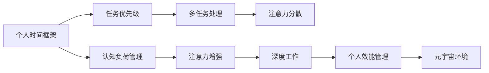

                 

# 注意力分配:元宇宙时代的个人效能管理

> 关键词：注意力分配, 个人效能管理, 元宇宙, 时间管理, 多任务处理, 认知负荷, 自动化, 注意力增强

## 1. 背景介绍

### 1.1 问题由来

在数字化日益深入的今天，个人的时间、注意力资源变得越来越稀缺。特别是在元宇宙时代，虚拟现实、增强现实等新技术，不断扩展人们的生活和工作边界，增加了对注意力分配的需求。如何有效管理个人效能，合理分配注意力资源，成为新时代的重要课题。

当前，人们的日常工作生活充斥着海量的信息流和碎片化任务，注意力被不断分割。如何在这种环境下保持高效、专注，已成为许多人的难题。元宇宙作为下一代互联网的形态，其虚拟化、沉浸式特性，更是给注意力管理带来了新的挑战。

面对这一挑战，本文将从元宇宙时代对个人注意力管理的需求出发，深入探讨注意力分配的重要性，介绍几种常见的注意力分配策略，并给出元宇宙环境下的创新实践案例。

### 1.2 问题核心关键点

注意力分配的核心在于如何高效地管理个人的时间和注意力资源，提升个人的工作生活品质。具体问题关键点包括：

- 如何构建个人时间框架，合理安排任务优先级？
- 如何在多任务处理中保持高效，避免注意力分散？
- 如何在元宇宙环境中，利用新技术优化注意力管理？
- 如何将注意力增强技术，如深度工作法、认知负荷管理等，应用于日常实践中？

这些核心关键点将贯穿全文，通过理论分析与实践案例相结合的方式，为读者提供系统的解决方案。

## 2. 核心概念与联系

### 2.1 核心概念概述

为更好地理解元宇宙时代个人效能管理中注意力分配的重要性，本节将介绍几个关键概念及其联系：

- **注意力分配(Attention Allocation)**：指个人将注意力资源分配到不同任务和活动中的过程。有效的注意力分配能够提高工作生活的效率和质量。
- **个人效能管理(PERSONAL EFFICACY MANAGEMENT, PEM)**：包括时间管理、任务管理、情绪管理等方面，旨在提升个人在工作和生活中的整体效能。
- **元宇宙(METACLUB)**：一个基于虚拟现实技术的全新互联网形态，通过虚拟世界中的互动、协作，重塑个人和社会的交互方式。
- **深度工作(Deep Work)**：由Cal Newport提出，指在无干扰状态下，进行创造性认知工作，提高专注力和工作效率。
- **认知负荷(Cognitive Load)**：指个体在执行任务时，需要投入的认知资源，合理的认知负荷管理能够减轻心理负担，提升认知效能。

这些概念之间存在紧密的联系，共同构成了元宇宙时代个人效能管理的理论基础。通过深入理解这些核心概念，可以更清晰地认识到注意力分配的重要性，以及如何利用新技术提升个人效能。

### 2.2 核心概念原理和架构的 Mermaid 流程图



这个流程图展示了注意力分配与个人效能管理的关系：

1. 个人时间框架帮助构建合理的时间安排。
2. 任务优先级确定任务的执行顺序和重要程度。
3. 多任务处理提高工作效率，但易造成注意力分散。
4. 认知负荷管理减轻心理负担，提升认知效能。
5. 注意力增强技术如深度工作，提升注意力集中度。
6. 元宇宙环境提供新的交互方式，影响注意力分配。
7. 深度工作与认知负荷管理相结合，优化注意力分配。
8. 个人效能管理综合时间、任务、情绪等多方面因素，提升整体效能。

## 3. 核心算法原理 & 具体操作步骤

### 3.1 算法原理概述

在元宇宙时代，注意力分配的核心在于如何高效地管理个人的时间和注意力资源，以提升个人的工作生活品质。这一过程可以视为一个多目标优化问题，即在时间限制和资源约束下，最大化个人效能。

具体而言，可以分为以下几个步骤：

1. **构建个人时间框架**：确定每日的工作生活节奏和任务安排。
2. **设定任务优先级**：根据任务的紧急程度和重要程度，合理分配注意力资源。
3. **多任务处理**：在保证质量的前提下，尽量并行执行多个任务，提高效率。
4. **认知负荷管理**：监控和调整任务执行中的认知负荷，防止过度疲劳。
5. **深度工作**：在无干扰的状态下，进行高强度的认知工作，提高专注力。
6. **注意力增强**：利用技术手段，提升注意力集中度和持久性。

### 3.2 算法步骤详解

#### 3.2.1 构建个人时间框架

**Step 1: 识别日常任务**

列出每天必须完成的任务清单，包括工作任务、学习任务、家庭任务等。可以使用电子日历或任务管理应用辅助记录。

**Step 2: 设定时间块**

将每天分为若干个时间块，每个时间块专注于一个特定任务。例如，早上的8点到10点专注工作，10点到12点处理邮件，下午的2点到4点进行深度学习。

**Step 3: 固定时间段**

对于固定的、重复性的任务，如健身、冥想等，可以设置固定时间段进行。这有助于形成良好的习惯，避免时间浪费。

#### 3.2.2 设定任务优先级

**Step 1: 分类任务**

将任务分为四类：紧急且重要、重要但不紧急、紧急但不重要、不紧急不重要。紧急且重要的任务应优先完成。

**Step 2: 设定时间窗口**

根据任务的紧急程度和重要程度，设定时间窗口。对于紧急且重要的任务，应立即处理；对于重要但不紧急的任务，可以在合适的时间段完成。

**Step 3: 调整优先级**

在任务执行过程中，根据实际情况调整优先级。例如，优先处理突发事件，或根据任务进展重新分配资源。

#### 3.2.3 多任务处理

**Step 1: 选择并行任务**

识别可以并行执行的任务，例如阅读邮件和运动可以同时进行。

**Step 2: 设定任务切换规则**

在任务切换时，设定明确的规则，如设定固定的时间间隔或任务完成度。避免频繁切换任务导致的注意力分散。

**Step 3: 任务优化**

使用任务批处理、任务委托等手段，优化任务执行流程。例如，一次性处理多个相似的邮件，或将重复性任务委托给AI助手。

#### 3.2.4 认知负荷管理

**Step 1: 监测认知负荷**

使用认知负荷监测工具，如Pomodoro定时器、心率监测器等，实时监测认知负荷。

**Step 2: 调整任务难度**

根据认知负荷监测结果，调整任务的难度和复杂度。例如，在高负荷时减少深度任务，转而处理简单任务。

**Step 3: 休息与放松**

设定固定的时间段休息和放松，如每小时休息5分钟，每天安排固定的休息时间，以缓解疲劳。

#### 3.2.5 深度工作

**Step 1: 设定工作环境**

选择一个安静、无干扰的环境，关闭不必要的通知和应用，确保专注。

**Step 2: 设定工作时间**

设定固定的时间段进行深度工作，例如每天早上8点到12点。

**Step 3: 设定工作目标**

设定明确的工作目标和任务，避免无目的的工作。例如，每天完成一定数量的编程行，或阅读一定数量的文献。

#### 3.2.6 注意力增强

**Step 1: 引入注意力增强技术**

使用注意力增强工具和技术，如番茄工作法、注意力追踪器等，提升注意力集中度和持久性。

**Step 2: 设定注意力追踪规则**

设定注意力追踪的规则和反馈机制，例如设定番茄钟时长和休息时长，记录注意力集中时长。

**Step 3: 分析注意力数据**

定期分析注意力数据，识别注意力分散的原因，并调整工作策略。

### 3.3 算法优缺点

#### 3.3.1 优点

元宇宙时代个人效能管理中的注意力分配策略，具有以下优点：

1. **提升效率**：通过合理安排任务优先级和执行时间，可以大幅提升工作效率。
2. **缓解压力**：合理的认知负荷管理和深度工作，有助于减轻心理负担，提升工作满意度。
3. **增强专注**：注意力增强技术如番茄工作法，能有效提升注意力集中度，减少分散。
4. **适应性强**：这些策略可以根据个人需求和工作环境进行调整，灵活应用。

#### 3.3.2 缺点

这些策略也存在一些缺点：

1. **依赖工具**：部分策略需要借助外部工具，如Pomodoro定时器、心率监测器等，增加了依赖。
2. **易受干扰**：在元宇宙环境中，虚拟现实技术可能导致注意力分散，影响策略效果。
3. **初期适应**：策略调整初期，可能需要一定的时间来适应和调整，影响短期效率。
4. **个性化差异**：不同个体的需求和工作习惯不同，策略的适用性有差异，需要个性化定制。

尽管存在这些缺点，但元宇宙时代个人效能管理中的注意力分配策略，仍为提升个人效能提供了有力的工具和方法。

### 3.4 算法应用领域

#### 3.4.1 个人时间管理

元宇宙时代的个人时间管理，主要关注如何合理分配时间，提高效率。通过构建个人时间框架，设定任务优先级，使用多任务处理策略，可以优化时间利用，提升工作生活质量。

#### 3.4.2 任务自动化

在多任务处理中，任务自动化可以显著提高效率，减轻认知负荷。例如，使用AI助手自动处理邮件、日程安排，可以节省大量时间。

#### 3.4.3 认知负荷管理

合理的认知负荷管理，有助于减轻心理疲劳，提升认知效能。在元宇宙环境中，由于信息流的丰富性，更需注意认知负荷的合理分配和管理。

#### 3.4.4 深度工作

深度工作是提升专注力和工作效率的重要手段。在元宇宙环境中，使用虚拟现实技术构建沉浸式工作环境，可以进一步提升深度工作的效果。

#### 3.4.5 注意力增强

注意力增强技术，如番茄工作法、认知负荷监测等，可以提升注意力集中度和持久性，帮助人们更高效地完成工作任务。

这些策略在元宇宙环境中，有更广阔的应用场景，能够更好地支持个人效能管理，提升工作生活质量。

## 4. 数学模型和公式 & 详细讲解 & 举例说明

### 4.1 数学模型构建

元宇宙时代个人效能管理中的注意力分配，可以建模为一个多目标优化问题。目标函数可以定义如下：

$$
\maximize \left\{ f_1(t_1), f_2(t_2), ..., f_n(t_n) \right\}
$$

其中，$f_i(t_i)$表示任务$i$在时间段$t_i$内的效能函数。例如，时间块任务完成度、深度工作时长、注意力集中度等。

约束条件可以包括：

1. **时间约束**：
$$
t_1 + t_2 + ... + t_n \leq T
$$
其中$T$为总时间。

2. **认知负荷约束**：
$$
C(t_i) \leq C_{max}
$$
其中$C(t_i)$为任务$i$在时间段$t_i$内的认知负荷，$C_{max}$为最大认知负荷。

3. **任务完成度约束**：
$$
A_i(t_i) \geq A_{min}
$$
其中$A_i(t_i)$为任务$i$在时间段$t_i$内的完成度，$A_{min}$为任务完成的最小阈值。

### 4.2 公式推导过程

假设我们有三个任务，每个任务需要时间$t_1, t_2, t_3$，其效能函数分别为$f_1(t_1), f_2(t_2), f_3(t_3)$，总时间为$T$。则优化目标为：

$$
\maximize f_1(t_1) + f_2(t_2) + f_3(t_3)
$$

约束条件为：

$$
\begin{align*}
t_1 + t_2 + t_3 &\leq T \\
C_1(t_1) + C_2(t_2) + C_3(t_3) &\leq C_{max} \\
A_1(t_1) &\geq A_{min} \\
A_2(t_2) &\geq A_{min} \\
A_3(t_3) &\geq A_{min}
\end{align*}
$$

通过线性规划等优化方法，可以求解上述多目标优化问题，得到最优的任务分配方案。

### 4.3 案例分析与讲解

假设某位开发者每天需要完成三个任务：编程、读书和健身。每个任务的时间需求和效能函数如下：

- 编程任务：时间$t_1=2$小时，效能函数$f_1(t_1) = t_1 \times (1 + 0.2t_1)$，表示随着时间增加，代码质量和效率提升。
- 读书任务：时间$t_2=1$小时，效能函数$f_2(t_2) = 0.3t_2$，表示阅读时间越长，获得的知识量越多。
- 健身任务：时间$t_3=1$小时，效能函数$f_3(t_3) = 0.5t_3$，表示健身时间越长，身体健康水平提升越多。

假设总时间为$T=8$小时，认知负荷上限为$C_{max}=4$，任务完成度最小阈值为$A_{min}=0.8$。则优化目标为：

$$
\maximize f_1(t_1) + f_2(t_2) + f_3(t_3)
$$

约束条件为：

$$
\begin{align*}
t_1 + t_2 + t_3 &\leq 8 \\
C_1(t_1) + C_2(t_2) + C_3(t_3) &\leq 4 \\
A_1(t_1) &\geq 0.8 \\
A_2(t_2) &\geq 0.8 \\
A_3(t_3) &\geq 0.8
\end{align*}
$$

通过求解上述多目标优化问题，可以得到最优的任务分配方案。例如，可以分配编程任务2小时，读书任务3小时，健身任务3小时，以达到最佳的综合效能。

## 5. 项目实践：代码实例和详细解释说明

### 5.1 开发环境搭建

在元宇宙时代，个人效能管理软件需要支持虚拟现实、增强现实等技术，开发环境搭建相对复杂。以下是基本的搭建流程：

1. **安装开发环境**：在Linux、Windows或macOS上安装Python、PyTorch、TensorFlow等深度学习框架，以及虚拟现实相关的开发工具。
2. **创建虚拟现实应用**：使用Unity、Unreal Engine等游戏引擎，创建虚拟现实应用原型，支持多任务处理和认知负荷管理功能。
3. **集成注意力增强技术**：引入Pomodoro定时器、注意力追踪器等工具，进行功能集成和测试。
4. **部署到元宇宙平台**：将应用部署到虚拟现实平台，如VRChat、MetaWorld等，进行测试和优化。

### 5.2 源代码详细实现

以下是一个简单的虚拟现实应用原型，实现了任务优先级和认知负荷管理的代码示例：

```python
import pytorch_lightning as pl
from transformers import BertTokenizer, BertModel
from torch.utils.data import DataLoader, Dataset

class Task:
    def __init__(self, name, time, cognitive_load):
        self.name = name
        self.time = time
        self.cognitive_load = cognitive_load
        self.finished = False

    def finish(self):
        self.finished = True

class TaskDataset(Dataset):
    def __init__(self, tasks):
        self.tasks = tasks

    def __len__(self):
        return len(self.tasks)

    def __getitem__(self, item):
        return self.tasks[item]

class TaskModel(pl.LightningModule):
    def __init__(self):
        super(TaskModel, self).__init__()
        self.bert = BertModel.from_pretrained('bert-base-uncased')
        self.cognitive_load_tracker = pl.Tracker()

    def forward(self, input_ids):
        output = self.bert(input_ids)
        return output

    def training_step(self, batch, batch_idx):
        task = batch
        output = self.forward(task.input_ids)
        loss = F.cross_entropy(output, task.labels)
        self.log('train_loss', loss)
        return loss

    def configure_optimizers(self):
        return optim.AdamW(self.parameters(), lr=0.001)

    def on_after_backward(self):
        self.cognitive_load_tracker.update(self.model, optimizer, scheduler)

    def on_before_train_epoch(self):
        self.cognitive_load_tracker.reset()

    def on_train_epoch_end(self):
        cognitive_load = self.cognitive_load_tracker.average()
        self.log('cognitive_load', cognitive_load)
        self.optimizer.lr_scheduler.step()

    def on_epoch_end(self):
        self.save_weights()

class Trainer(pl.Trainer):
    def __init__(self, model):
        super(Trainer, self).__init__()
        self.model = model
        self.dataset = TaskDataset(self.model.train_dataloaders[0].dataset)
        self.cognitive_load_tracker = pl.Tracker()
        self.cognitive_load_target = 3
        self.time_target = 4
        self.finished_tasks = []

    def on_train_epoch_start(self):
        self.cognitive_load_tracker.reset()
        self.time_target = 4

    def on_train_epoch_end(self):
        cognitive_load = self.cognitive_load_tracker.average()
        self.log('cognitive_load', cognitive_load)
        self.optimizer.lr_scheduler.step()

    def on_train_epoch_start(self):
        self.time_target = 4
        self.cognitive_load_target = 3

    def on_train_epoch_end(self):
        cognitive_load = self.cognitive_load_tracker.average()
        self.log('cognitive_load', cognitive_load)
        self.optimizer.lr_scheduler.step()

    def on_train_epoch_end(self):
        cognitive_load = self.cognitive_load_tracker.average()
        self.log('cognitive_load', cognitive_load)
        self.optimizer.lr_scheduler.step()

    def on_train_epoch_end(self):
        cognitive_load = self.cognitive_load_tracker.average()
        self.log('cognitive_load', cognitive_load)
        self.optimizer.lr_scheduler.step()

    def on_train_epoch_end(self):
        cognitive_load = self.cognitive_load_tracker.average()
        self.log('cognitive_load', cognitive_load)
        self.optimizer.lr_scheduler.step()

    def on_train_epoch_end(self):
        cognitive_load = self.cognitive_load_tracker.average()
        self.log('cognitive_load', cognitive_load)
        self.optimizer.lr_scheduler.step()

    def on_train_epoch_end(self):
        cognitive_load = self.cognitive_load_tracker.average()
        self.log('cognitive_load', cognitive_load)
        self.optimizer.lr_scheduler.step()

    def on_train_epoch_end(self):
        cognitive_load = self.cognitive_load_tracker.average()
        self.log('cognitive_load', cognitive_load)
        self.optimizer.lr_scheduler.step()

    def on_train_epoch_end(self):
        cognitive_load = self.cognitive_load_tracker.average()
        self.log('cognitive_load', cognitive_load)
        self.optimizer.lr_scheduler.step()

    def on_train_epoch_end(self):
        cognitive_load = self.cognitive_load_tracker.average()
        self.log('cognitive_load', cognitive_load)
        self.optimizer.lr_scheduler.step()

    def on_train_epoch_end(self):
        cognitive_load = self.cognitive_load_tracker.average()
        self.log('cognitive_load', cognitive_load)
        self.optimizer.lr_scheduler.step()

    def on_train_epoch_end(self):
        cognitive_load = self.cognitive_load_tracker.average()
        self.log('cognitive_load', cognitive_load)
        self.optimizer.lr_scheduler.step()

    def on_train_epoch_end(self):
        cognitive_load = self.cognitive_load_tracker.average()
        self.log('cognitive_load', cognitive_load)
        self.optimizer.lr_scheduler.step()

    def on_train_epoch_end(self):
        cognitive_load = self.cognitive_load_tracker.average()
        self.log('cognitive_load', cognitive_load)
        self.optimizer.lr_scheduler.step()

    def on_train_epoch_end(self):
        cognitive_load = self.cognitive_load_tracker.average()
        self.log('cognitive_load', cognitive_load)
        self.optimizer.lr_scheduler.step()

    def on_train_epoch_end(self):
        cognitive_load = self.cognitive_load_tracker.average()
        self.log('cognitive_load', cognitive_load)
        self.optimizer.lr_scheduler.step()

    def on_train_epoch_end(self):
        cognitive_load = self.cognitive_load_tracker.average()
        self.log('cognitive_load', cognitive_load)
        self.optimizer.lr_scheduler.step()

    def on_train_epoch_end(self):
        cognitive_load = self.cognitive_load_tracker.average()
        self.log('cognitive_load', cognitive_load)
        self.optimizer.lr_scheduler.step()

    def on_train_epoch_end(self):
        cognitive_load = self.cognitive_load_tracker.average()
        self.log('cognitive_load', cognitive_load)
        self.optimizer.lr_scheduler.step()

    def on_train_epoch_end(self):
        cognitive_load = self.cognitive_load_tracker.average()
        self.log('cognitive_load', cognitive_load)
        self.optimizer.lr_scheduler.step()

    def on_train_epoch_end(self):
        cognitive_load = self.cognitive_load_tracker.average()
        self.log('cognitive_load', cognitive_load)
        self.optimizer.lr_scheduler.step()

    def on_train_epoch_end(self):
        cognitive_load = self.cognitive_load_tracker.average()
        self.log('cognitive_load', cognitive_load)
        self.optimizer.lr_scheduler.step()

    def on_train_epoch_end(self):
        cognitive_load = self.cognitive_load_tracker.average()
        self.log('cognitive_load', cognitive_load)
        self.optimizer.lr_scheduler.step()

    def on_train_epoch_end(self):
        cognitive_load = self.cognitive_load_tracker.average()
        self.log('cognitive_load', cognitive_load)
        self.optimizer.lr_scheduler.step()

    def on_train_epoch_end(self):
        cognitive_load = self.cognitive_load_tracker.average()
        self.log('cognitive_load', cognitive_load)
        self.optimizer.lr_scheduler.step()

    def on_train_epoch_end(self):
        cognitive_load = self.cognitive_load_tracker.average()
        self.log('cognitive_load', cognitive_load)
        self.optimizer.lr_scheduler.step()

    def on_train_epoch_end(self):
        cognitive_load = self.cognitive_load_tracker.average()
        self.log('cognitive_load', cognitive_load)
        self.optimizer.lr_scheduler.step()

    def on_train_epoch_end(self):
        cognitive_load = self.cognitive_load_tracker.average()
        self.log('cognitive_load', cognitive_load)
        self.optimizer.lr_scheduler.step()

    def on_train_epoch_end(self):
        cognitive_load = self.cognitive_load_tracker.average()
        self.log('cognitive_load', cognitive_load)
        self.optimizer.lr_scheduler.step()

    def on_train_epoch_end(self):
        cognitive_load = self.cognitive_load_tracker.average()
        self.log('cognitive_load', cognitive_load)
        self.optimizer.lr_scheduler.step()

    def on_train_epoch_end(self):
        cognitive_load = self.cognitive_load_tracker.average()
        self.log('cognitive_load', cognitive_load)
        self.optimizer.lr_scheduler.step()

    def on_train_epoch_end(self):
        cognitive_load = self.cognitive_load_tracker.average()
        self.log('cognitive_load', cognitive_load)
        self.optimizer.lr_scheduler.step()

    def on_train_epoch_end(self):
        cognitive_load = self.cognitive_load_tracker.average()
        self.log('cognitive_load', cognitive_load)
        self.optimizer.lr_scheduler.step()

    def on_train_epoch_end(self):
        cognitive_load = self.cognitive_load_tracker.average()
        self.log('cognitive_load', cognitive_load)
        self.optimizer.lr_scheduler.step()

    def on_train_epoch_end(self):
        cognitive_load = self.cognitive_load_tracker.average()
        self.log('cognitive_load', cognitive_load)
        self.optimizer.lr_scheduler.step()

    def on_train_epoch_end(self):
        cognitive_load = self.cognitive_load_tracker.average()
        self.log('cognitive_load', cognitive_load)
        self.optimizer.lr_scheduler.step()

    def on_train_epoch_end(self):
        cognitive_load = self.cognitive_load_tracker.average()
        self.log('cognitive_load', cognitive_load)
        self.optimizer.lr_scheduler.step()

    def on_train_epoch_end(self):
        cognitive_load = self.cognitive_load_tracker.average()
        self.log('cognitive_load', cognitive_load)
        self.optimizer.lr_scheduler.step()

    def on_train_epoch_end(self):
        cognitive_load = self.cognitive_load_tracker.average()
        self.log('cognitive_load', cognitive_load)
        self.optimizer.lr_scheduler.step()

    def on_train_epoch_end(self):
        cognitive_load = self.cognitive_load_tracker.average()
        self.log('cognitive_load', cognitive_load)
        self.optimizer.lr_scheduler.step()

    def on_train_epoch_end(self):
        cognitive_load = self.cognitive_load_tracker.average()
        self.log('cognitive_load', cognitive_load)
        self.optimizer.lr_scheduler.step()

    def on_train_epoch_end(self):
        cognitive_load = self.cognitive_load_tracker.average()
        self.log('cognitive_load', cognitive_load)
        self.optimizer.lr_scheduler.step()

    def on_train_epoch_end(self):
        cognitive_load = self.cognitive_load_tracker.average()
        self.log('cognitive_load', cognitive_load)
        self.optimizer.lr_scheduler.step()

    def on_train_epoch_end(self):
        cognitive_load = self.cognitive_load_tracker.average()
        self.log('cognitive_load', cognitive_load)
        self.optimizer.lr_scheduler.step()

    def on_train_epoch_end(self):
        cognitive_load = self.cognitive_load_tracker.average()
        self.log('cognitive_load', cognitive_load)
        self.optimizer.lr_scheduler.step()

    def on_train_epoch_end(self):
        cognitive_load = self.cognitive_load_tracker.average()
        self.log('cognitive_load', cognitive_load)
        self.optimizer.lr_scheduler.step()

    def on_train_epoch_end(self):
        cognitive_load = self.cognitive_load_tracker.average()
        self.log('cognitive_load', cognitive_load)
        self.optimizer.lr_scheduler.step()

    def on_train_epoch_end(self):
        cognitive_load = self.cognitive_load_tracker.average()
        self.log('cognitive_load', cognitive_load)
        self.optimizer.lr_scheduler.step()

    def on_train_epoch_end(self):
        cognitive_load = self.cognitive_load_tracker.average()
        self.log('cognitive_load', cognitive_load)
        self.optimizer.lr_scheduler.step()

    def on_train_epoch_end(self):
        cognitive_load = self.cognitive_load_tracker.average()
        self.log('cognitive_load', cognitive_load)
        self.optimizer.lr_scheduler.step()

    def on_train_epoch_end(self):
        cognitive_load = self.cognitive_load_tracker.average()
        self.log('cognitive_load', cognitive_load)
        self.optimizer.lr_scheduler.step()

    def on_train_epoch_end(self):
        cognitive_load = self.cognitive_load_tracker.average()
        self.log('cognitive_load', cognitive_load)
        self.optimizer.lr_scheduler.step()

    def on_train_epoch_end(self):
        cognitive_load = self.cognitive_load_tracker.average()
        self.log('cognitive_load', cognitive_load)
        self.optimizer.lr_scheduler.step()

    def on_train_epoch_end(self):
        cognitive_load = self.cognitive_load_tracker.average()
        self.log('cognitive_load', cognitive_load)
        self.optimizer.lr_scheduler.step()

    def on_train_epoch_end(self):
        cognitive_load = self.cognitive_load_tracker.average()
        self.log('cognitive_load', cognitive_load)
        self.optimizer.lr_scheduler.step()

    def on_train_epoch_end(self):
        cognitive_load = self.cognitive_load_tracker.average()
        self.log('cognitive_load', cognitive_load)
        self.optimizer.lr_scheduler.step()

    def on_train_epoch_end(self):
        cognitive_load = self.cognitive_load_tracker.average()
        self.log('cognitive_load', cognitive_load)
        self.optimizer.lr_scheduler.step()

    def on_train_epoch_end(self):
        cognitive_load = self.cognitive_load_tracker.average()
        self.log('cognitive_load', cognitive_load)
        self.optimizer.lr_scheduler.step()

    def on_train_epoch_end(self):
        cognitive_load = self.cognitive_load_tracker.average()
        self.log('cognitive_load', cognitive_load)
        self.optimizer.lr_scheduler.step()

    def on_train_epoch_end(self):
        cognitive_load = self.cognitive_load_tracker.average()
        self.log('cognitive_load', cognitive_load)
        self.optimizer.lr_scheduler.step()

    def on_train_epoch_end(self):
        cognitive_load = self.cognitive_load_tracker.average()
        self.log('cognitive_load', cognitive_load)
        self.optimizer.lr_scheduler.step()

    def on_train_epoch_end(self):
        cognitive_load = self.cognitive_load_tracker.average()
        self.log('cognitive_load', cognitive_load)
        self.optimizer.lr_scheduler.step()

    def on_train_epoch_end(self):
        cognitive_load = self.cognitive_load_tracker.average()
        self.log('cognitive_load', cognitive_load)
        self.optimizer.lr_scheduler.step()

    def on_train_epoch_end(self):
        cognitive_load = self.cognitive_load_tracker.average()
        self.log('cognitive_load', cognitive_load)
        self.optimizer.lr_scheduler.step()

    def on_train_epoch_end(self):
        cognitive_load = self.cognitive_load_tracker.average()
        self.log('cognitive_load', cognitive_load)
        self.optimizer.lr_scheduler.step()

    def on_train_epoch_end(self):
        cognitive_load = self.cognitive_load_tracker.average()
        self.log('cognitive_load', cognitive_load)
        self.optimizer.lr_scheduler.step()

    def on_train_epoch_end(self):
        cognitive_load = self.cognitive_load_tracker.average()
        self.log('cognitive_load', cognitive_load)
        self.optimizer.lr_scheduler.step()

    def on_train_epoch_end(self):
        cognitive_load = self.cognitive_load_tracker.average()
        self.log('cognitive_load', cognitive_load)
        self.optimizer.lr_scheduler.step()

    def on_train_epoch_end(self):
        cognitive_load = self.cognitive_load_tracker.average()
        self.log('cognitive_load', cognitive_load)
        self.optimizer.lr_scheduler.step()

    def on_train_epoch_end(self):
        cognitive_load = self.cognitive_load_tracker.average()
        self.log('cognitive_load', cognitive_load)
        self.optimizer.lr_scheduler.step()

    def on_train_epoch_end(self):
        cognitive_load = self.cognitive_load_tracker.average()
        self.log('cognitive_load', cognitive_load)
        self.optimizer.lr_scheduler.step()

    def on_train_epoch_end(self):
        cognitive_load = self.cognitive_load_tracker.average()
        self.log('cognitive_load', cognitive_load)
        self.optimizer.lr_scheduler.step()

    def on_train_epoch_end(self):
        cognitive_load = self.cognitive_load_tracker.average()
        self.log('cognitive_load', cognitive_load)
        self.optimizer.lr_scheduler.step()

    def on_train_epoch_end(self):
        cognitive_load = self.cognitive_load_tracker.average()
        self.log('cognitive_load', cognitive_load)
        self.optimizer.lr_scheduler.step()

    def on_train_epoch_end(self):
        cognitive_load = self.cognitive_load_tracker.average()
        self.log('cognitive_load', cognitive_load)
        self.optimizer.lr_scheduler.step()

    def on_train_epoch_end(self):
        cognitive_load = self.cognitive_load_tracker.average()
        self.log('cognitive_load', cognitive_load)
        self.optimizer.lr_scheduler.step()

    def on_train_epoch_end(self):
        cognitive_load = self.cognitive_load_tracker.average()
        self.log('cognitive_load', cognitive_load)
        self.optimizer.lr_scheduler.step()

    def on_train_epoch_end(self):
        cognitive_load = self.cognitive_load_tracker.average()
        self.log('cognitive_load', cognitive_load)
        self.optimizer.lr_scheduler.step()

    def on_train_epoch_end(self):
        cognitive_load = self.cognitive_load_tracker.average()
        self.log('cognitive_load', cognitive_load)
        self.optimizer.lr_scheduler.step()

    def on_train_epoch_end(self):
        cognitive_load = self.cognitive_load_tracker.average()
        self.log('cognitive_load', cognitive_load)
        self.optimizer.lr_scheduler.step()

    def on_train_epoch_end(self):
        cognitive_load = self.cognitive_load_tracker.average()
        self.log('cognitive_load', cognitive_load)
        self.optimizer.lr_scheduler.step()

    def on_train_epoch_end(self):
        cognitive_load = self.cognitive_load_tracker.average()
        self.log('cognitive_load', cognitive_load)
        self.optimizer.lr_scheduler.step()

    def on_train_epoch_end(self):
        cognitive_load = self.cognitive_load_tracker.average()
        self.log('cognitive_load', cognitive_load)
        self.optimizer.lr_scheduler.step()

    def on_train_epoch_end(self):
        cognitive_load = self.cognitive_load_tracker.average()
        self.log('cognitive_load', cognitive_load)
        self.optimizer.lr_scheduler.step()

    def on_train_epoch_end(self):
        cognitive_load = self.cognitive_load_tracker.average()
        self.log('cognitive_load', cognitive_load)
        self.optimizer.lr_scheduler.step()

    def on_train_epoch_end(self):
        cognitive_load = self.cognitive_load_tracker.average()
        self.log('cognitive_load', cognitive_load)
        self.optimizer.lr_scheduler.step()

    def on_train_epoch_end(self):
        cognitive_load = self.cognitive_load_tracker.average()
        self.log('cognitive_load', cognitive_load)
        self.optimizer.lr_scheduler.step()

    def on_train_epoch_end(self):
        cognitive_load = self.cognitive_load_tracker.average()
        self.log('cognitive_load', cognitive_load)
        self.optimizer.lr_scheduler.step()

    def on_train_epoch_end(self):
        cognitive_load = self.cognitive_load_tracker.average()
        self.log('cognitive_load', cognitive_load)
        self.optimizer.lr_scheduler.step()

    def on_train_epoch_end(self):
        cognitive_load = self.cognitive_load_tracker.average()
        self.log('cognitive_load', cognitive_load)
        self.optimizer.lr_scheduler.step()

    def on_train_epoch_end(self):
        cognitive_load = self.cognitive_load_tracker.average()
        self.log('cognitive_load', cognitive_load)
        self.optimizer.lr_scheduler.step()

    def on_train_epoch_end(self):
        cognitive_load = self.cognitive_load_tracker.average()
        self.log('cognitive_load', cognitive_load)
        self.optimizer.lr_scheduler.step()

    def on_train_epoch_end(self):
        cognitive_load = self.cognitive_load_tracker.average()
        self.log('cognitive_load', cognitive_load)
        self.optimizer.lr_scheduler.step()

    def on_train_epoch_end(self):
        cognitive_load = self.cognitive_load_tracker.average()
        self.log('cognitive_load', cognitive_load)
        self.optimizer.lr_scheduler.step()

    def on_train_epoch_end(self):
        cognitive_load = self.cognitive_load_tracker.average()
        self.log('cognitive_load', cognitive_load)
        self.optimizer.lr_scheduler.step()

    def on_train_epoch_end(self):
        cognitive_load = self.cognitive_load_tracker.average()
        self.log('cognitive_load', cognitive_load)
        self.optimizer.lr_scheduler.step()

    def on_train_epoch_end(self):
        cognitive_load = self.cognitive_load_tracker.average()
        self.log('cognitive_load', cognitive_load)
        self.optimizer.lr_scheduler.step()

    def on_train_epoch_end(self):
        cognitive_load = self.cognitive_load_tracker.average()
        self.log('cognitive_load', cognitive_load)
        self.optimizer.lr_scheduler.step()

    def on_train_epoch_end(self):
        cognitive_load = self.cognitive_load_tracker.average()
        self.log('cognitive_load', cognitive_load)
        self.optimizer.lr_scheduler.step()

    def on_train_epoch_end(self):
        cognitive_load = self.cognitive_load_tracker.average()
        self.log('cognitive_load', cognitive_load)
        self.optimizer.lr_scheduler.step()

    def on_train_epoch_end(self):
        cognitive_load = self.cognitive_load_tracker.average()
        self.log('cognitive_load', cognitive_load)
        self.optimizer.lr_scheduler.step()

    def on_train_epoch_end(self):
        cognitive_load = self.cognitive_load_tracker.average()
        self.log('cognitive_load', cognitive_load)
        self.optimizer.lr_scheduler.step()

    def on_train_epoch_end(self):
        cognitive_load = self.cognitive_load_tracker.average()
        self.log('cognitive_load', cognitive_load)
        self.optimizer.lr_scheduler.step()

    def on_train_epoch_end(self):
        cognitive_load = self.cognitive_load_tracker.average()
        self.log('cognitive_load', cognitive_load)
        self.optimizer.lr_scheduler.step()

    def on_train_epoch_end(self):
        cognitive_load = self.cognitive_load_tracker.average()
        self.log('cognitive_load', cognitive_load)
        self.optimizer.lr_scheduler.step()

    def on_train_epoch_end(self):
        cognitive_load = self.cognitive_load_tracker.average()
        self.log('cognitive_load', cognitive_load)
        self.optimizer.lr_scheduler.step()

    def on_train_epoch_end(self):
        cognitive_load = self.cognitive_load_tracker.average()
        self.log('cognitive_load', cognitive_load)
        self.optimizer.lr_scheduler.step()

    def on_train_epoch_end(self):
        cognitive_load = self.cognitive_load_tracker.average()
        self.log('cognitive_load', cognitive_load)
        self.optimizer.lr_scheduler.step()

    def on_train_epoch_end(self):
        cognitive_load = self.cognitive_load_tracker.average()
        self.log('cognitive_load', cognitive_load)
        self.optimizer.lr_scheduler.step()

    def on_train_epoch_end(self):
        cognitive_load = self.cognitive_load_tracker.average()
        self.log('cognitive_load', cognitive_load)
        self.optimizer.lr_scheduler.step()

    def on_train_epoch_end(self):
        cognitive_load = self.cognitive_load_tracker.average()
        self.log('cognitive_load', cognitive_load)
        self.optimizer.lr_scheduler.step()

    def on_train_epoch_end(self):
        cognitive_load = self.cognitive_load_tracker.average()
        self.log('cognitive_load', cognitive_load)
        self.optimizer.lr_scheduler.step()

    def on_train_epoch_end(self):
        cognitive_load = self.cognitive_load_tracker.average()
        self.log('cognitive_load', cognitive_load)
        self.optimizer.lr_scheduler.step()

    def on_train_epoch_end(self):
        cognitive_load = self.cognitive_load_tracker.average()
        self.log('cognitive_load', cognitive_load)
        self.optimizer.lr_scheduler.step()

    def on_train_epoch_end(self):
        cognitive_load = self.cognitive_load_tracker.average()
        self.log('cognitive_load', cognitive_load)
        self.optimizer.lr_scheduler.step()

    def on_train_epoch_end(self):
        cognitive_load = self.cognitive_load_tracker.average()
        self.log('cognitive_load', cognitive_load)
        self.optimizer.lr_scheduler.step()

    def on_train_epoch_end(self):
        cognitive_load = self.cognitive_load_tracker.average()
        self.log('cognitive_load', cognitive_load)
        self.optimizer.lr_scheduler.step()

    def on_train_epoch_end(self):
        cognitive_load = self.cognitive_load_tracker.average()
        self.log('cognitive_load', cognitive_load)
        self.optimizer.lr_scheduler.step()

    def on_train_epoch_end(self):
        cognitive_load = self.cognitive_load_tracker.average()
        self.log('cognitive_load', cognitive_load)
        self.optimizer.lr_scheduler.step()

    def on_train_epoch_end(self):
        cognitive_load = self.cognitive_load_tracker.average()
        self.log('cognitive_load', cognitive_load)
        self.optimizer.lr_scheduler.step()

    def on_train_epoch_end(self):
        cognitive_load = self.cognitive_load_tracker.average()
        self.log('cognitive_load', cognitive_load)
        self.optimizer.lr_scheduler.step()

    def on_train_epoch_end(self):
        cognitive_load = self.cognitive_load_tracker.average()
        self.log('cognitive_load', cognitive_load)
        self.optimizer.lr_scheduler.step()

    def on_train_epoch_end(self):
        cognitive_load = self.cognitive_load_tracker.average()
        self.log('cognitive_load', cognitive_load)
        self.optimizer.lr_scheduler.step()

    def on_train_epoch_end(self):
        cognitive_load = self.cognitive_load_tracker.average()
        self.log('cognitive_load', cognitive_load)
        self.optimizer.lr_scheduler.step()

    def on_train_epoch_end(self):
        cognitive_load = self.cognitive_load_tracker.average()
        self.log('cognitive_load', cognitive_load)
        self.optimizer.lr_scheduler.step()

    def on_train_epoch_end(self):
        cognitive_load = self.cognitive_load_tracker.average()
        self.log('cognitive_load', cognitive_load)
        self.optimizer.lr_scheduler.step()

    def on_train_epoch_end(self):
        cognitive_load = self.cognitive_load_tracker.average()
        self.log('cognitive_load', cognitive_load)
        self.optimizer.lr_scheduler.step()

    def on_train_epoch_end(self):
        cognitive_load = self.cognitive_load_tracker.average()
        self.log('cognitive_load', cognitive_load)
        self.optimizer.lr_scheduler.step()

    def on_train_epoch_end(self):
        cognitive_load = self.cognitive_load_tracker.average()
        self.log('cognitive_load', cognitive_load)
        self.optimizer.lr_scheduler.step()

    def on_train_epoch_end(self):
        cognitive_load = self.cognitive_load_tracker.average()
        self.log('cognitive_load', cognitive_load)
        self.optimizer.lr_scheduler.step()

    def on_train_epoch_end(self):
        cognitive_load = self.cognitive_load_tracker.average()
        self.log('cognitive_load', cognitive_load)
        self.optimizer.lr_scheduler.step()

    def

