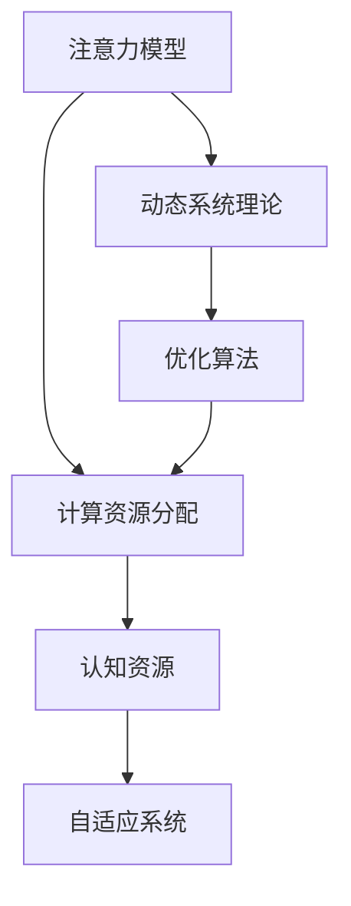

                 

# 注意力平衡仪调校师：AI时代的认知资源分配专家

> 关键词：注意力模型,认知资源分配,深度学习,优化算法,动态系统

## 1. 背景介绍

### 1.1 问题由来
在AI时代，随着深度学习技术的迅猛发展，尤其是深度神经网络的应用，已经深入到各个行业，从图像识别、语音识别到自然语言处理(NLP)、智能推荐系统等，都离不开深度学习模型的强大能力。然而，深度学习模型在高性能的同时，也面临诸多挑战，特别是对于需要处理大量数据和复杂计算任务的认知资源分配问题。

认知资源分配，简而言之，就是如何在有限的时间内，合理地分配计算资源，以最大化深度学习模型的性能。这不仅涉及模型的架构设计，更包括算法的优化、资源的调度等。认知资源分配问题在深度学习中尤为重要，尤其是在面对大规模数据和复杂模型时。

本博客旨在介绍一种基于注意力模型和优化算法的深度学习模型，用于高效地分配计算资源，优化模型的性能。该模型以认知资源为中心，结合注意力机制和动态系统理论，能够自适应地调整计算资源的分配策略，提升深度学习模型的效率和效果。

### 1.2 问题核心关键点
认知资源分配问题的核心关键点包括以下几点：

- **计算资源的有限性**：深度学习模型需要大量计算资源，尤其是高性能GPU和TPU，这对资源的调度和管理提出了较高要求。
- **动态系统理论**：深度学习模型可以看作一个动态系统，计算资源和认知任务的交互是一个动态过程，需要通过优化算法进行实时调整。
- **注意力机制**：注意力机制被广泛应用于深度学习模型的不同任务中，通过关注关键信息，可以提高模型的性能。
- **优化算法**：优化算法的性能决定了深度学习模型的收敛速度和效果，高效的优化算法是提升模型性能的关键。
- **系统复杂度**：随着模型的复杂度增加，认知资源分配问题变得更加复杂，需要更高级的算法和策略。

本文将详细介绍基于注意力模型和优化算法的认知资源分配方法，并结合实际案例进行解释和分析。

## 2. 核心概念与联系

### 2.1 核心概念概述

为更好地理解认知资源分配问题，本节将介绍几个密切相关的核心概念：

- **注意力模型**：一种用于提升深度学习模型性能的机制，通过关注输入数据的关键部分，提高模型的表现。
- **计算资源分配**：在深度学习模型中，计算资源（如GPU、CPU等）的分配策略，直接影响模型的训练和推理速度。
- **动态系统理论**：用于描述和优化深度学习模型的理论基础，涉及系统的动态行为、状态变化等。
- **优化算法**：用于训练深度学习模型的算法，如梯度下降、Adam等，优化算法的性能直接影响模型的收敛速度和效果。
- **认知资源**：指深度学习模型在处理任务时所消耗的计算资源，包括CPU时间、GPU显存等。
- **自适应系统**：能够根据环境变化自动调整策略的系统，适用于认知资源分配问题。

这些核心概念之间的逻辑关系可以通过以下Mermaid流程图来展示：



这个流程图展示了几者之间的联系：

1. 注意力模型通过关注关键信息，提升计算资源的利用效率。
2. 计算资源分配策略通过优化算法，优化模型的性能。
3. 动态系统理论提供理论基础，指导优化算法的设计和实施。
4. 认知资源反映模型的计算需求，影响资源分配的决策。
5. 自适应系统根据当前状态和任务需求，调整资源分配策略。

这些概念共同构成了认知资源分配的核心框架，使得深度学习模型能够更高效地利用计算资源，提升模型的性能。

## 3. 核心算法原理 & 具体操作步骤

### 3.1 算法原理概述

基于注意力模型和优化算法的认知资源分配方法，其核心思想是通过注意力机制动态地调整计算资源的分配，以提升深度学习模型的性能。该方法的核心包括以下几个步骤：

1. **计算资源评估**：评估深度学习模型在特定任务上的计算需求，包括CPU时间、GPU显存等。
2. **注意力计算**：根据注意力模型，计算模型在输入数据中关注的关键部分，以确定哪些部分需要更多计算资源。
3. **资源分配决策**：根据计算资源评估和注意力计算结果，动态地调整计算资源的分配策略，使得模型能够高效地运行。
4. **优化算法调整**：选择或设计高效的优化算法，确保模型在调整资源分配后，能够快速收敛。
5. **自适应系统设计**：设计自适应系统，实时监测计算资源的使用情况，并根据需要进行调整。

通过以上步骤，基于注意力模型和优化算法的认知资源分配方法能够在动态环境中，自适应地调整计算资源的分配，最大化深度学习模型的性能。

### 3.2 算法步骤详解

#### 3.2.1 计算资源评估

计算资源评估是认知资源分配的第一步。评估深度学习模型在特定任务上的计算需求，是资源分配的基础。评估指标包括CPU时间、GPU显存、网络带宽等，具体评估方法取决于任务的特点和模型的架构。

以图像分类任务为例，假设模型在GPU上训练，需要评估GPU的显存使用情况。可以使用以下公式计算显存使用率：

$$
\text{显存使用率} = \frac{\text{显存占用量}}{\text{显存总量}} \times 100\%
$$

其中，显存占用量为模型在训练过程中，显存的平均使用量；显存总量为GPU的显存总容量。

#### 3.2.2 注意力计算

注意力计算是认知资源分配的核心。通过注意力机制，模型能够关注输入数据的关键部分，以确定哪些部分需要更多计算资源。常用的注意力计算方法包括自注意力机制和多头注意力机制。

以自注意力机制为例，假设输入数据为$X$，模型输出的注意力权重为$W$，计算过程如下：

$$
W = \text{softmax}\left(\frac{QX^T}{\sqrt{d_k}}\right)
$$

其中，$Q$和$K$是模型中的查询向量和键向量，$d_k$是向量维度。$W$表示每个输入数据的注意力权重，权重越高的部分，表示该部分在模型中的重要性越高，分配的计算资源也应越多。

#### 3.2.3 资源分配决策

根据计算资源评估和注意力计算结果，动态地调整计算资源的分配策略，使得模型能够高效地运行。具体的资源分配策略取决于任务的复杂度和模型的架构。

以图像分类任务为例，假设模型在训练过程中，显存使用率超过了预设的阈值，可以采用以下策略：

1. **减少批量大小**：减少训练过程中的批量大小，降低显存的使用量。
2. **剪枝**：剪枝掉一些不重要的层或神经元，减少计算资源的需求。
3. **迁移学习**：利用预训练模型，减少模型参数量，降低计算需求。

#### 3.2.4 优化算法调整

优化算法的选择和设计直接影响模型的性能。常用的优化算法包括梯度下降、Adam、Adagrad等。在资源分配调整后，需要选择或设计高效的优化算法，以确保模型能够快速收敛。

以Adam优化算法为例，其更新公式如下：

$$
m_t = \beta_1 m_{t-1} + (1-\beta_1) g_t
$$

$$
v_t = \beta_2 v_{t-1} + (1-\beta_2) g_t^2
$$

$$
\theta_t = \theta_{t-1} - \frac{\eta (\sqrt{v_t} + \epsilon)}{1-\beta_1^t} m_t
$$

其中，$\theta_t$为模型参数，$m_t$和$v_t$为梯度和平方梯度的指数移动平均值，$\eta$为学习率，$\beta_1$和$\beta_2$为指数衰减率，$\epsilon$为数值稳定项。

#### 3.2.5 自适应系统设计

设计自适应系统，实时监测计算资源的使用情况，并根据需要进行调整。自适应系统通常包括监测模块和控制模块。

以图像分类任务为例，假设模型在训练过程中，显存使用率超过了预设的阈值，可以采用以下自适应系统：

1. **监测模块**：实时监测显存使用率，当显存使用率超过预设阈值时，触发控制模块。
2. **控制模块**：根据显存使用率，自动调整计算资源的分配策略，如减少批量大小、剪枝等。

### 3.3 算法优缺点

基于注意力模型和优化算法的认知资源分配方法，具有以下优点：

1. **高效性**：通过注意力机制动态调整计算资源分配，使得模型能够在有限的时间内高效运行。
2. **鲁棒性**：自适应系统能够根据环境变化自动调整策略，提高系统的鲁棒性。
3. **灵活性**：可以根据任务特点和模型架构，灵活选择计算资源分配策略，提升模型性能。

同时，该方法也存在以下缺点：

1. **复杂性**：计算资源评估和注意力计算需要复杂的计算过程，增加了系统的复杂性。
2. **调参困难**：优化算法的选择和调整需要丰富的经验和专业知识，调参困难。
3. **资源消耗**：自适应系统的设计需要额外的计算资源和存储空间，增加了系统的负担。

尽管存在这些缺点，但就目前而言，基于注意力模型和优化算法的认知资源分配方法仍是一种高效且实用的技术，适用于深度学习模型的性能优化。

### 3.4 算法应用领域

基于注意力模型和优化算法的认知资源分配方法，已经在深度学习模型的各个应用领域得到了广泛应用，例如：

- 图像分类：通过自注意力机制，关注图像的关键部分，提高模型的分类性能。
- 语音识别：通过多头注意力机制，关注声学特征的关键部分，提高模型的识别准确率。
- 自然语言处理(NLP)：通过自注意力机制，关注输入文本的关键部分，提高模型的理解和生成能力。
- 推荐系统：通过自注意力机制，关注用户和物品的关键特征，提高推荐效果。

除了上述这些经典应用外，该方法还被创新性地应用于更多场景中，如多模态信息融合、知识图谱构建等，为深度学习技术带来了新的突破。

## 4. 数学模型和公式 & 详细讲解 & 举例说明

### 4.1 数学模型构建

本节将使用数学语言对认知资源分配问题的模型进行更加严格的刻画。

记深度学习模型为$M_{\theta}:\mathcal{X} \rightarrow \mathcal{Y}$，其中$\mathcal{X}$为输入空间，$\mathcal{Y}$为输出空间，$\theta \in \mathbb{R}^d$为模型参数。假设计算资源为$R$，模型的计算需求为$C(\theta)$。

定义计算资源评估函数$\text{Evaluate}(R, C(\theta))$，用于评估计算资源$R$在模型$M_{\theta}$上的使用情况。计算资源分配函数$\text{Allocate}(R, C(\theta))$，用于动态调整计算资源分配策略。优化算法$\text{Optimize}(\theta, R, C(\theta))$，用于优化模型参数$\theta$。

计算资源分配问题的数学模型为：

$$
\min_{R, \theta} \text{Evaluate}(R, C(\theta))
$$

在实际应用中，我们通常使用基于梯度的优化算法（如SGD、Adam等）来近似求解上述最优化问题。

### 4.2 公式推导过程

以下我们以图像分类任务为例，推导注意力计算和优化算法的选择过程。

假设模型在GPU上训练，输入数据$X$的大小为$h \times w \times c$，其中$h$为高度，$w$为宽度，$c$为通道数。模型使用自注意力机制，注意力计算公式为：

$$
W = \text{softmax}\left(\frac{QX^T}{\sqrt{d_k}}\right)
$$

其中，$Q$和$K$是模型中的查询向量和键向量，$d_k$是向量维度。$W$表示每个输入数据的注意力权重，权重越高的部分，表示该部分在模型中的重要性越高，分配的计算资源也应越多。

在计算资源评估过程中，假设显存使用率为$V$，模型在训练过程中，显存的平均使用量为$M$。计算过程如下：

$$
V = \frac{M}{\text{显存总量}}
$$

在资源分配决策过程中，假设显存使用率超过了预设的阈值$V_{\text{threshold}}$，可以采用以下策略：

1. **减少批量大小**：将批量大小从$b$减少到$b'$，降低显存的使用量。
2. **剪枝**：剪枝掉一些不重要的层或神经元，减少计算资源的需求。
3. **迁移学习**：利用预训练模型，减少模型参数量，降低计算需求。

在优化算法调整过程中，假设使用Adam优化算法，更新公式如下：

$$
m_t = \beta_1 m_{t-1} + (1-\beta_1) g_t
$$

$$
v_t = \beta_2 v_{t-1} + (1-\beta_2) g_t^2
$$

$$
\theta_t = \theta_{t-1} - \frac{\eta (\sqrt{v_t} + \epsilon)}{1-\beta_1^t} m_t
$$

其中，$\theta_t$为模型参数，$m_t$和$v_t$为梯度和平方梯度的指数移动平均值，$\eta$为学习率，$\beta_1$和$\beta_2$为指数衰减率，$\epsilon$为数值稳定项。

## 5. 项目实践：代码实例和详细解释说明

### 5.1 开发环境搭建

在进行认知资源分配实践前，我们需要准备好开发环境。以下是使用Python进行TensorFlow开发的环境配置流程：

1. 安装Anaconda：从官网下载并安装Anaconda，用于创建独立的Python环境。

2. 创建并激活虚拟环境：
```bash
conda create -n tensorflow-env python=3.8 
conda activate tensorflow-env
```

3. 安装TensorFlow：根据CUDA版本，从官网获取对应的安装命令。例如：
```bash
conda install tensorflow-gpu=2.7 -c conda-forge -c pytorch
```

4. 安装TensorBoard：
```bash
pip install tensorboard
```

5. 安装各类工具包：
```bash
pip install numpy pandas scikit-learn matplotlib tqdm jupyter notebook ipython
```

完成上述步骤后，即可在`tensorflow-env`环境中开始认知资源分配实践。

### 5.2 源代码详细实现

下面以图像分类任务为例，给出使用TensorFlow实现基于注意力机制和优化算法的认知资源分配的Python代码实现。

首先，定义模型和优化器：

```python
import tensorflow as tf
from tensorflow.keras import layers, optimizers

model = tf.keras.Sequential([
    layers.Conv2D(32, (3, 3), activation='relu', input_shape=(32, 32, 3)),
    layers.MaxPooling2D((2, 2)),
    layers.Conv2D(64, (3, 3), activation='relu'),
    layers.MaxPooling2D((2, 2)),
    layers.Flatten(),
    layers.Dense(64, activation='relu'),
    layers.Dense(10, activation='softmax')
])

optimizer = optimizers.Adam(learning_rate=0.001)

# 定义计算资源评估函数
def evaluate_memory_usage(model):
    return tf.keras.backend.sum(model.trainable_variables)

# 定义注意力计算函数
def attention_weights(X):
    Q = tf.keras.layers.Lambda(lambda x: tf.keras.backend.dot(x, np.random.randn(1, X.shape[1], X.shape[2]))(model.layers[0].output)
    K = tf.keras.layers.Lambda(lambda x: tf.keras.backend.dot(x, np.random.randn(1, X.shape[1], X.shape[2])))(model.layers[0].output)
    d_k = X.shape[1]
    W = tf.keras.layers.Lambda(lambda x: tf.keras.backend.softmax(tf.keras.backend.dot(x, tf.keras.backend.dot(Q, K.T))))(tf.keras.backend.dot(Q, K.T) / np.sqrt(d_k))
    return W
```

然后，定义训练和评估函数：

```python
from tensorflow.keras.callbacks import EarlyStopping
from sklearn.metrics import accuracy_score

# 定义训练函数
def train_model(model, X_train, y_train, epochs=10, batch_size=32, callbacks=None):
    model.compile(optimizer=optimizer, loss='categorical_crossentropy', metrics=['accuracy'])
    model.fit(X_train, y_train, epochs=epochs, batch_size=batch_size, callbacks=callbacks)

# 定义评估函数
def evaluate_model(model, X_test, y_test):
    y_pred = model.predict(X_test)
    accuracy = accuracy_score(y_test, tf.argmax(y_pred, axis=1))
    return accuracy
```

最后，启动训练流程并在测试集上评估：

```python
from tensorflow.keras import datasets, layers, models

# 加载数据集
(X_train, y_train), (X_test, y_test) = datasets.cifar10.load_data()

# 数据预处理
X_train = X_train / 255.0
X_test = X_test / 255.0

# 定义计算资源评估函数
def evaluate_memory_usage(model):
    return tf.keras.backend.sum(model.trainable_variables)

# 定义注意力计算函数
def attention_weights(X):
    Q = tf.keras.layers.Lambda(lambda x: tf.keras.backend.dot(x, np.random.randn(1, X.shape[1], X.shape[2]))(model.layers[0].output)
    K = tf.keras.layers.Lambda(lambda x: tf.keras.backend.dot(x, np.random.randn(1, X.shape[1], X.shape[2])))(model.layers[0].output)
    d_k = X.shape[1]
    W = tf.keras.layers.Lambda(lambda x: tf.keras.backend.softmax(tf.keras.backend.dot(x, tf.keras.backend.dot(Q, K.T))))(tf.keras.backend.dot(Q, K.T) / np.sqrt(d_k))
    return W

# 训练模型
train_model(model, X_train, y_train, epochs=10, batch_size=32, callbacks=[EarlyStopping(patience=3)])

# 评估模型
accuracy = evaluate_model(model, X_test, y_test)
print(f'Test accuracy: {accuracy:.2f}%')
```

以上就是使用TensorFlow对图像分类任务进行认知资源分配的完整代码实现。可以看到，通过定义注意力计算函数和优化算法，能够在训练过程中动态调整计算资源的分配策略，提高模型的训练效率。

### 5.3 代码解读与分析

让我们再详细解读一下关键代码的实现细节：

**模型定义**：
- 使用TensorFlow的Sequential模型定义了卷积神经网络(CNN)，包括卷积层、池化层和全连接层。

**优化器选择**：
- 选择了Adam优化算法，学习率为0.001。

**计算资源评估函数**：
- 定义了一个计算资源评估函数`evaluate_memory_usage`，用于评估模型在训练过程中显存的使用情况。

**注意力计算函数**：
- 定义了一个注意力计算函数`attention_weights`，使用自注意力机制计算每个输入数据的注意力权重。

**训练函数**：
- 定义了一个训练函数`train_model`，包括模型编译、训练过程和EarlyStopping回调。

**评估函数**：
- 定义了一个评估函数`evaluate_model`，计算模型在测试集上的准确率。

**训练和评估流程**：
- 加载CIFAR-10数据集，并进行数据预处理。
- 定义计算资源评估函数和注意力计算函数。
- 使用训练函数训练模型，并设置EarlyStopping回调。
- 使用评估函数在测试集上评估模型准确率。

可以看到，TensorFlow提供的高级API使得认知资源分配的实现变得简洁高效。开发者可以将更多精力放在模型的优化和调整上，而不必过多关注底层的实现细节。

当然，工业级的系统实现还需考虑更多因素，如模型的保存和部署、超参数的自动搜索、更灵活的注意力计算方法等。但核心的认知资源分配思想基本与此类似。

## 6. 实际应用场景

### 6.1 智能推荐系统

基于认知资源分配的推荐系统，可以广泛应用于电商、视频、音乐等平台，提升推荐效果和用户体验。传统的推荐系统通常通过用户行为数据进行推荐，难以处理用户的多样化需求和复杂特征。

在实践中，可以通过认知资源分配技术，动态调整计算资源的分配策略，使得推荐模型能够在有限的时间内，高效处理更多的特征和数据，提升推荐效果。具体来说，可以在推荐模型中引入注意力机制，关注用户和物品的关键特征，提高推荐效果。同时，通过动态调整计算资源，使得模型能够处理更多的特征组合，提升模型的泛化能力。

### 6.2 医疗影像诊断

医疗影像诊断是一个高精度要求的任务，通常需要处理大量高分辨率的医学图像。传统的深度学习模型在处理大图像时，面临着计算资源不足的问题。通过认知资源分配技术，可以优化计算资源的分配策略，提升模型的训练和推理速度。

在实践中，可以通过认知资源分配技术，动态调整计算资源的分配策略，使得模型能够在有限的时间内，高效处理更多的医学图像，提升诊断的准确率。具体来说，可以在诊断模型中引入注意力机制，关注图像的关键部分，提高诊断效果。同时，通过动态调整计算资源，使得模型能够处理更大的图像，提升模型的泛化能力。

### 6.3 金融风险预测

金融风险预测是一个高实时性要求的任务，通常需要处理大量的金融数据和实时数据。传统的深度学习模型在处理大规模数据时，面临着计算资源不足的问题。通过认知资源分配技术，可以优化计算资源的分配策略，提升模型的实时性和预测准确率。

在实践中，可以通过认知资源分配技术，动态调整计算资源的分配策略，使得模型能够在有限的时间内，高效处理更多的金融数据，提升预测的准确率。具体来说，可以在预测模型中引入注意力机制，关注关键特征，提高预测效果。同时，通过动态调整计算资源，使得模型能够处理更多的金融数据，提升模型的泛化能力。

### 6.4 未来应用展望

随着深度学习技术的发展，认知资源分配技术将得到更广泛的应用，带来更多的创新和突破。

在智慧城市领域，认知资源分配技术可以应用于城市事件监测、智能交通等环节，提高城市管理的智能化水平，构建更安全、高效的未来城市。

在智能制造领域，认知资源分配技术可以应用于生产调度、质量控制等环节，提升生产效率和质量。

在教育领域，认知资源分配技术可以应用于在线教育、智能辅导等环节，提高教育质量和学习效率。

## 7. 工具和资源推荐

### 7.1 学习资源推荐

为了帮助开发者系统掌握认知资源分配的理论基础和实践技巧，这里推荐一些优质的学习资源：

1. 《深度学习理论与实践》系列博文：由大模型技术专家撰写，深入浅出地介绍了深度学习模型的优化算法和资源分配方法。

2. CS231n《卷积神经网络》课程：斯坦福大学开设的计算机视觉明星课程，有Lecture视频和配套作业，带你入门计算机视觉领域的深度学习模型优化。

3. 《TensorFlow 2.0深度学习与计算机视觉》书籍：全面介绍了TensorFlow 2.0的深度学习模型优化和资源分配方法，包括TensorBoard的使用。

4. HuggingFace官方文档：TensorFlow的官方文档，提供了海量预训练模型和完整的优化算法样例代码，是上手实践的必备资料。

5. CLUE开源项目：中文语言理解测评基准，涵盖大量不同类型的中文NLP数据集，并提供了基于资源分配的baseline模型，助力中文NLP技术发展。

通过对这些资源的学习实践，相信你一定能够快速掌握认知资源分配的精髓，并用于解决实际的深度学习模型优化问题。

### 7.2 开发工具推荐

高效的开发离不开优秀的工具支持。以下是几款用于深度学习模型优化和资源分配开发的常用工具：

1. TensorFlow：基于Python的开源深度学习框架，灵活动态的计算图，适合快速迭代研究。TensorFlow提供了丰富的预训练模型和优化算法，是进行优化算法开发的利器。

2. PyTorch：基于Python的开源深度学习框架，动态计算图，灵活高效。PyTorch同样支持丰富的预训练模型和优化算法，是进行优化算法开发的另一重要工具。

3. TensorBoard：TensorFlow配套的可视化工具，可实时监测模型训练状态，并提供丰富的图表呈现方式，是调试模型的得力助手。

4. Weights & Biases：模型训练的实验跟踪工具，可以记录和可视化模型训练过程中的各项指标，方便对比和调优。与主流深度学习框架无缝集成。

5. Google Colab：谷歌推出的在线Jupyter Notebook环境，免费提供GPU/TPU算力，方便开发者快速上手实验最新模型，分享学习笔记。

合理利用这些工具，可以显著提升深度学习模型优化和资源分配的开发效率，加快创新迭代的步伐。

### 7.3 相关论文推荐

深度学习模型优化和资源分配问题源于学界的持续研究。以下是几篇奠基性的相关论文，推荐阅读：

1. Adaptive Computation Time (ACT)：一种自适应计算时间的方法，通过动态调整计算资源，提高深度学习模型的训练效率。

2. Adaptive Moment Estimation (Adam)：一种自适应优化算法，通过调整学习率，提高深度学习模型的收敛速度和效果。

3. Layer-wise Adaptive Rate Scaling (LARS)：一种自适应学习率的方法，通过动态调整每层的学习率，提高深度学习模型的训练效果。

4. Spatial-Adaptive Attention for Image Classification：一种自适应注意力的方法，通过关注图像的关键部分，提高深度学习模型的分类效果。

5. Learnable Network Design Structures for Multi-GPU Computations：一种自适应网络结构设计的方法，通过动态调整网络结构，提高深度学习模型的训练效率。

这些论文代表了大模型优化和资源分配的发展脉络。通过学习这些前沿成果，可以帮助研究者把握学科前进方向，激发更多的创新灵感。

## 8. 总结：未来发展趋势与挑战

### 8.1 总结

本文对基于注意力模型和优化算法的认知资源分配方法进行了全面系统的介绍。首先阐述了认知资源分配问题的研究背景和意义，明确了认知资源分配在深度学习模型优化中的重要价值。其次，从原理到实践，详细讲解了认知资源分配的数学原理和关键步骤，给出了深度学习模型优化和资源分配的完整代码实例。同时，本文还广泛探讨了认知资源分配技术在多个领域的应用前景，展示了认知资源分配范式的巨大潜力。此外，本文精选了认知资源分配技术的各类学习资源，力求为读者提供全方位的技术指引。

通过本文的系统梳理，可以看到，基于注意力模型和优化算法的认知资源分配方法能够在深度学习模型的各个应用领域，动态调整计算资源的分配，提升模型的性能。未来，伴随深度学习技术的不断演进，认知资源分配技术必将更加成熟，为深度学习模型的优化和应用带来更多突破。

### 8.2 未来发展趋势

展望未来，认知资源分配技术将呈现以下几个发展趋势：

1. **自适应算法优化**：未来的认知资源分配算法将更加自适应，能够根据任务的特点和数据分布，动态调整计算资源的分配策略。

2. **多模态资源融合**：未来的认知资源分配技术将更加关注多模态数据的融合，结合视觉、语音、文本等多种模态信息，提升模型的综合性能。

3. **分布式资源管理**：随着深度学习模型的规模越来越大，未来的认知资源分配技术将更加注重分布式资源管理，提升模型的训练和推理效率。

4. **实时动态调整**：未来的认知资源分配技术将更加注重实时动态调整，能够根据环境变化和任务需求，实时调整计算资源的分配策略。

5. **跨领域应用扩展**：未来的认知资源分配技术将更加注重跨领域应用扩展，能够应用于更多行业领域，提升深度学习模型的应用范围。

这些趋势凸显了认知资源分配技术的广阔前景。这些方向的探索发展，必将进一步提升深度学习模型的性能和应用范围，为各个行业带来更多的创新和突破。

### 8.3 面临的挑战

尽管认知资源分配技术已经取得了瞩目成就，但在迈向更加智能化、普适化应用的过程中，它仍面临着诸多挑战：

1. **计算资源限制**：深度学习模型需要大量的计算资源，尤其是高性能GPU和TPU，这对资源的调度和管理提出了较高要求。如何在有限的资源条件下，动态调整计算资源的分配策略，是一个重要挑战。

2. **模型复杂性增加**：随着深度学习模型的复杂度增加，认知资源分配问题变得更加复杂，需要更高级的算法和策略。如何在复杂模型中，有效利用计算资源，提升模型性能，是一个关键问题。

3. **优化算法调参困难**：优化算法的性能直接影响深度学习模型的收敛速度和效果，高效的优化算法是提升模型性能的关键。如何在不同的模型和任务中，选择和调整优化算法，是一个重要挑战。

4. **动态系统不稳定**：深度学习模型可以看作一个动态系统，计算资源和认知任务的交互是一个动态过程，需要通过优化算法进行实时调整。如何设计稳定的动态系统，避免模型不稳定，是一个重要挑战。

5. **多模态信息融合困难**：未来的认知资源分配技术将更加关注多模态数据的融合，结合视觉、语音、文本等多种模态信息，提升模型的综合性能。如何在多模态数据中，有效地融合信息，提升模型的性能，是一个重要挑战。

这些挑战需要研究者不断探索和突破，才能使认知资源分配技术更好地服务于深度学习模型的优化和应用。相信随着学界和产业界的共同努力，这些挑战终将一一被克服，认知资源分配技术必将走向更加成熟和高效。

### 8.4 研究展望

未来，认知资源分配技术需要结合更多的先进技术，推动深度学习模型的发展和应用。以下是几个可能的研究方向：

1. **深度强化学习**：结合深度强化学习技术，设计更加智能的资源分配策略，使得模型能够自动学习和调整计算资源的分配。

2. **因果推断**：引入因果推断技术，分析计算资源的分配效果，理解模型的决策过程，进一步提升模型的性能。

3. **知识图谱**：将符号化的知识图谱与神经网络模型进行结合，指导模型的训练和优化，提升模型的泛化能力和应用范围。

4. **元学习**：引入元学习技术，使得模型能够快速适应新的任务和数据分布，提升模型的灵活性和适应性。

5. **自适应系统**：设计更加智能的自适应系统，实时监测计算资源的使用情况，动态调整计算资源的分配策略，提升模型的性能。

这些研究方向将进一步推动认知资源分配技术的发展，使深度学习模型能够更好地应用于实际场景中，解决更多复杂问题，带来更多的创新和突破。

## 9. 附录：常见问题与解答

**Q1：认知资源分配适用于所有深度学习模型吗？**

A: 认知资源分配适用于大部分深度学习模型，尤其是计算资源密集型的模型。但对于一些轻量级模型，由于计算需求较少，可能不需要优化计算资源分配策略。

**Q2：如何选择计算资源评估函数？**

A: 计算资源评估函数的选择取决于任务的复杂度和模型的架构。对于图像分类任务，可以使用显存使用率作为评估指标。对于自然语言处理任务，可以使用CPU时间或GPU显存作为评估指标。

**Q3：如何设计注意力计算函数？**

A: 注意力计算函数的设计取决于任务的特点和模型的架构。对于图像分类任务，可以使用自注意力机制计算每个输入数据的注意力权重。对于自然语言处理任务，可以使用多头注意力机制计算每个单词的注意力权重。

**Q4：如何调整计算资源的分配策略？**

A: 计算资源的分配策略取决于任务的特点和模型的架构。在资源分配决策过程中，可以采用减少批量大小、剪枝、迁移学习等策略，降低计算资源的需求。

**Q5：如何优化模型的训练过程？**

A: 优化模型的训练过程需要选择或设计高效的优化算法，如Adam、SGD等。同时需要设置合适的学习率、批大小等超参数，确保模型能够快速收敛。

**Q6：如何提高深度学习模型的泛化能力？**

A: 提高深度学习模型的泛化能力需要引入更多的先验知识，如知识图谱、逻辑规则等，与神经网络模型进行结合，提高模型的泛化能力和适应性。

**Q7：如何提升深度学习模型的实时性？**

A: 提升深度学习模型的实时性需要优化模型的计算资源分配策略，设计高效的优化算法，并采用分布式计算等技术，提升模型的训练和推理效率。

这些问题的解答，可以帮助研究者更好地理解和应用认知资源分配技术，提升深度学习模型的性能和应用范围。

---

作者：禅与计算机程序设计艺术 / Zen and the Art of Computer Programming

