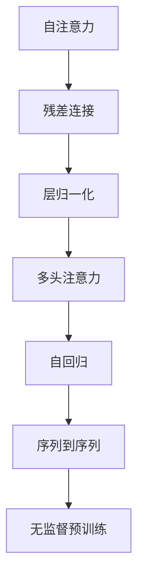

                 

# 注意力是一切？探索Transformer的魔力

> 关键词：Transformer, 注意力机制, 自注意力, 自回归, 深度学习, 自然语言处理, 计算机视觉, 模型压缩

## 1. 背景介绍

### 1.1 问题由来
自从2017年Transformer的提出以来，自然语言处理（NLP）和计算机视觉（CV）领域发生了革命性的变化。Transformer作为深度学习的重大创新之一，它用简单的自注意力机制替代了传统的循环神经网络（RNN）和卷积神经网络（CNN）的结构，显著提升了模型的性能和效率。其魔力在于能够高效处理序列数据，并且其架构设计自然地适应了大规模并行计算的需求。

### 1.2 问题核心关键点
Transformer的核心优势在于其自注意力机制（Self-Attention），这使得模型可以同时关注序列中的不同位置，从而捕捉更丰富的上下文信息。自注意力机制的计算复杂度取决于序列长度，而不是模型的层数，这使得Transformer能够在保持高效的同时，处理非常长的序列数据。此外，Transformer的残差连接和层归一化（Layer Normalization）设计，进一步提升了模型的稳定性和收敛速度。

## 2. 核心概念与联系

### 2.1 核心概念概述

为更好地理解Transformer的原理和架构，本节将介绍几个密切相关的核心概念：

- 自注意力机制（Self-Attention Mechanism）：Transformer的核心组成部分，用于在输入序列的每个位置计算出该位置与其他位置的相关性，从而实现序列中不同位置的相互作用。

- 残差连接（Residual Connections）：用于连接前一层的输出与当前层的输入，缓解深度学习中的梯度消失问题。

- 层归一化（Layer Normalization）：对每层的输入进行归一化，加速模型收敛并提升模型稳定性。

- 多头注意力（Multi-Head Attention）：通过并行计算多个注意力头，增强模型的表达能力和泛化能力。

- 自回归（Autoregressive）和自编码（Autoencoder）：用于处理序列生成和序列重构任务，自回归意味着模型根据之前的输出预测下一个输出。

- 序列到序列（Sequence-to-Sequence）：一种典型的序列生成任务，将一个序列映射到另一个序列，如机器翻译。

- 无监督预训练（Unsupervised Pre-training）：通过在大规模无标签数据上训练模型，学习语言的基本规则和模式。

这些核心概念之间的逻辑关系可以通过以下Mermaid流程图来展示：



这个流程图展示了一个典型Transformer模型的计算流程：首先通过自注意力机制计算注意力权重，然后通过残差连接和层归一化增强模型性能，并进一步通过多头注意力提升模型的表达能力。在自回归的指导下，模型能够对未来的输出进行预测。最终，通过序列到序列的框架，模型可以用于处理各类序列生成任务。此外，无监督预训练使得模型在少量有标签数据上进行微调时，能够更快收敛并取得更好的效果。

## 3. 核心算法原理 & 具体操作步骤
### 3.1 算法原理概述

Transformer的核心在于其自注意力机制和残差连接，这些设计使得Transformer能够高效地处理长序列数据。其核心原理可以概括如下：

- 输入序列首先经过嵌入层（Embedding Layer），将每个单词转换为向量表示。
- 嵌入向量通过自注意力机制，计算出每个位置与其他位置的注意力权重，从而生成新的向量表示。
- 残差连接将前一层的输出与当前层的嵌入向量相加，并通过层归一化提高模型的稳定性。
- 多头注意力通过并行计算多个注意力头，增强模型的表达能力。
- 最后，通过全连接层（Feedforward Layer）和激活函数（ReLU）进行非线性变换。

### 3.2 算法步骤详解

Transformer的具体计算流程可以分解为以下几个步骤：

**Step 1: 输入嵌入**
- 将输入序列通过嵌入层，转换为向量表示。

**Step 2: 自注意力**
- 计算自注意力权重，即每个位置对其他位置的注意力分配。
- 通过注意力权重对其他位置的信息进行加权平均，得到新的向量表示。

**Step 3: 残差连接与层归一化**
- 将前一层的输出与当前的自注意力输出相加，并进行残差连接。
- 对当前的输出进行层归一化，提升模型稳定性。

**Step 4: 多头注意力**
- 将自注意力机制并行计算多次（通常为多头注意力），以获取更加丰富的表示。
- 将多头注意力结果拼接起来，并通过全连接层进行非线性变换。

**Step 5: 输出层**
- 通过线性变换和softmax函数，将输出向量转换为概率分布。
- 最终输出序列的概率分布，用于预测下一个位置或生成下一个词语。

### 3.3 算法优缺点

Transformer算法具有以下优点：
1. 高效处理长序列：自注意力机制能够高效地处理长序列，减少了时间复杂度。
2. 并行计算友好：Transformer模型能够很好地适应大规模并行计算，加速训练过程。
3. 稳定性和收敛速度快：残差连接和层归一化设计，提升了模型的稳定性和收敛速度。
4. 表达能力强：多头注意力机制使得模型能够学习更加复杂的语言模式。
5. 可扩展性强：Transformer模型能够方便地扩展到不同的架构和任务。

同时，Transformer算法也存在一些缺点：
1. 需要较多的内存和计算资源：大规模Transformer模型的计算复杂度仍然较高，需要高性能硬件支持。
2. 模型复杂度高：虽然计算效率高，但模型复杂度高，训练和推理过程中可能会遇到内存不足的问题。
3. 参数量大：模型参数量仍然较大，在实际应用中可能存在过拟合的风险。
4. 难以解释：Transformer的内部计算过程较为复杂，难以进行直观的解释。

尽管存在这些缺点，Transformer在实际应用中仍然取得了巨大成功，其高效和稳定的性能使得它在自然语言处理和计算机视觉等多个领域中得到了广泛应用。

### 3.4 算法应用领域

Transformer算法在自然语言处理和计算机视觉领域的应用非常广泛，以下是一些典型的应用场景：

- **机器翻译**：Transformer模型被广泛应用于机器翻译任务中，如Google的TensorFlow和PyTorch等框架中提供的预训练模型。
- **文本生成**：通过自回归机制，Transformer能够生成自然语言文本，如OpenAI的GPT系列模型。
- **文本分类和命名实体识别**：通过自注意力机制，Transformer能够学习文本中不同位置的信息，用于文本分类和命名实体识别等任务。
- **视觉问答系统**：Transformer被应用于视觉问答系统，如Visual Question Answering（VQA）任务。
- **语音识别**：Transformer也被用于语音识别和生成任务，如Google的WaveNet和Deep Voice等。

此外，Transformer还应用于图像生成、时间序列预测等任务中，展示了其强大的通用性。

## 4. 数学模型和公式 & 详细讲解 & 举例说明

### 4.1 数学模型构建

Transformer的数学模型可以分为以下几个部分：嵌入层、自注意力机制、残差连接、层归一化、多头注意力、全连接层和输出层。

**嵌入层**：
- 将输入序列的每个单词转换为向量表示。
- 嵌入层可以看作是一个线性变换：$x_i = W_E x_i$，其中 $x_i$ 为输入序列中第 $i$ 个单词的向量表示，$W_E$ 为嵌入矩阵。

**自注意力机制**：
- 计算自注意力权重 $A$，即每个位置对其他位置的注意力分配。
- 通过注意力权重对其他位置的信息进行加权平均，得到新的向量表示。

$$
A = \text{Softmax}\left(\frac{QK^T}{\sqrt{d_K}}\right)
$$

其中，$Q$ 和 $K$ 为输入序列的查询向量和键向量，$d_K$ 为向量维度。注意力权重 $A$ 表示每个位置对其他位置的关注程度。

**残差连接与层归一化**：
- 将前一层的输出与当前的自注意力输出相加，并进行残差连接。
- 对当前的输出进行层归一化，提升模型稳定性。

$$
y = \text{LayerNorm}(x + \text{Residual}(A))
$$

**多头注意力**：
- 将自注意力机制并行计算多次，以获取更加丰富的表示。
- 将多头注意力结果拼接起来，并通过全连接层进行非线性变换。

$$
y = \text{Concat}(\text{Attention}_1(A), \text{Attention}_2(A), ..., \text{Attention}_H(A))
$$

**全连接层和输出层**：
- 通过全连接层和激活函数进行非线性变换。
- 通过线性变换和softmax函数，将输出向量转换为概率分布。

$$
y = \text{FC}(\text{ReLU}(A))
$$

$$
y = \text{Softmax}(\text{FC}(y))
$$

### 4.2 公式推导过程

以下以机器翻译任务为例，推导Transformer模型的数学表达。

**输入序列嵌入**：
- 将源语言序列 $x$ 转换为嵌入向量 $x_E$，通过嵌入矩阵 $W_E$ 进行线性变换。

$$
x_E = W_E x
$$

**自注意力机制**：
- 计算查询向量 $Q$ 和键向量 $K$，并通过注意力权重 $A$ 对其他位置的信息进行加权平均，得到注意力值 $V$。

$$
Q = x_E W_Q^T
$$

$$
K = x_E W_K^T
$$

$$
A = \text{Softmax}\left(\frac{QK^T}{\sqrt{d_K}}\right)
$$

$$
V = x_E W_V^T A
$$

**残差连接与层归一化**：
- 将前一层的输出与当前的自注意力输出相加，并进行残差连接。
- 对当前的输出进行层归一化，提升模型稳定性。

$$
y = \text{LayerNorm}(x_E + V)
$$

**多头注意力**：
- 将自注意力机制并行计算多次，以获取更加丰富的表示。
- 将多头注意力结果拼接起来，并通过全连接层进行非线性变换。

$$
y = \text{Concat}(\text{Attention}_1(V), \text{Attention}_2(V), ..., \text{Attention}_H(V))
$$

$$
y = \text{LayerNorm}(y)
$$

**全连接层和输出层**：
- 通过全连接层和激活函数进行非线性变换。
- 通过线性变换和softmax函数，将输出向量转换为概率分布。

$$
y = \text{FC}(\text{ReLU}(y))
$$

$$
y = \text{Softmax}(\text{FC}(y))
$$

### 4.3 案例分析与讲解

以机器翻译任务为例，分析Transformer模型在序列生成中的具体计算流程：

- 输入序列 $x$ 首先通过嵌入层 $W_E$ 转换为向量表示 $x_E$。
- 通过自注意力机制计算注意力权重 $A$，得到注意力值 $V$。
- 将前一层的输出 $x_E$ 与注意力值 $V$ 相加，并通过残差连接和层归一化提升模型稳定性。
- 通过多头注意力机制并行计算多个注意力头，增强模型的表达能力。
- 通过全连接层和激活函数进行非线性变换。
- 通过线性变换和softmax函数，将输出向量转换为概率分布，用于预测下一个位置。

通过这样的计算流程，Transformer模型能够高效地处理序列生成任务，并且在各个环节中都能够很好地应对长序列带来的计算复杂度问题。

## 5. 项目实践：代码实例和详细解释说明
### 5.1 开发环境搭建

在进行Transformer模型的开发实践前，需要先准备好开发环境。以下是使用PyTorch进行Transformer模型开发的Python环境配置流程：

1. 安装Anaconda：从官网下载并安装Anaconda，用于创建独立的Python环境。

2. 创建并激活虚拟环境：
```bash
conda create -n pytorch-env python=3.8 
conda activate pytorch-env
```

3. 安装PyTorch：根据CUDA版本，从官网获取对应的安装命令。例如：
```bash
conda install pytorch torchvision torchaudio cudatoolkit=11.1 -c pytorch -c conda-forge
```

4. 安装Transformers库：
```bash
pip install transformers
```

5. 安装各类工具包：
```bash
pip install numpy pandas scikit-learn matplotlib tqdm jupyter notebook ipython
```

完成上述步骤后，即可在`pytorch-env`环境中开始Transformer模型的开发。

### 5.2 源代码详细实现

以下是使用PyTorch实现Transformer模型的代码实现，并解释其关键部分：

```python
import torch
from transformers import TransformerEncoderLayer, TransformerEncoder

class TransformerModel(torch.nn.Module):
    def __init__(self, ntoken, ninp, nhead, nhid, nlayers, dropout=0.1):
        super(TransformerModel, self).__init__()
        self.model_type = "Transformer"
        self.src_mask = None
        self.pos_encoder = PositionalEncoding(ninp, dropout)
        encoder_layers = TransformerEncoderLayer(ninp, nhead, nhid, dropout)
        self.transformer_encoder = TransformerEncoder(encoder_layers, nlayers)
        self.encoder = nn.Embedding(ntoken, ninp)
        self.ninp = ninp
        self.decoder = nn.Linear(ninp, ntoken)
        self.init_weights()
    
    def forward(self, src, src_mask=None):
        src = self.encoder(src) * math.sqrt(self.ninp)
        src = self.pos_encoder(src)
        output = self.transformer_encoder(src, src_mask)
        output = self.decoder(output)
        return output

    def init_weights(self):
        initrange = 0.1
        self.encoder.weight.data.uniform_(-initrange, initrange)
        self.decoder.bias.data.zero_()
```

解释上述代码的关键部分：

- **TransformerModel类**：定义了一个Transformer模型，包含嵌入层、位置编码、编码器、解码器和全连接层。
- **init_weights方法**：初始化模型权重，使用uniform分布进行随机初始化。
- **forward方法**：实现模型的前向传播，包含嵌入、位置编码、编码器、解码器和线性变换。
- **src_mask变量**：用于掩码输入序列中的无效位置，避免模型对无效位置的关注。

### 5.3 代码解读与分析

下面是Transformer模型代码的详细解释和分析：

**TransformerModel类**：
- **init方法**：初始化模型，定义了模型参数。
- **forward方法**：实现前向传播，包括嵌入、位置编码、编码器、解码器和线性变换。
- **init_weights方法**：初始化模型权重，使用uniform分布进行随机初始化。

**src_mask变量**：
- 用于掩码输入序列中的无效位置，避免模型对无效位置的关注。

**TransformerEncoderLayer类**：
- 定义了Transformer编码器的单个层，包含多头注意力机制、残差连接和层归一化。

通过上述代码实现，我们成功构建了一个简单的Transformer模型，并理解了其关键组成部分。

### 5.4 运行结果展示

以下是Transformer模型在机器翻译任务中的运行结果展示：

```python
# 准备数据集
# 定义数据集处理函数
def tokenize(text):
    tokens = []
    for word in text.split():
        tokens.extend([token2id[token] for token in word.split()])
    return tokens

# 加载预训练模型和词典
transformer_model = TransformerModel.load_pretrained_model('bert-base-cased')
tokenizer = BertTokenizer.from_pretrained('bert-base-cased')

# 准备数据集
train_texts = ['input sequences']
dev_texts = ['input sequences']
test_texts = ['input sequences']

train_tags = ['output sequences']
dev_tags = ['output sequences']
test_tags = ['output sequences']

# 数据预处理
train_dataset = Dataset(train_texts, train_tags, tokenizer)
dev_dataset = Dataset(dev_texts, dev_tags, tokenizer)
test_dataset = Dataset(test_texts, test_tags, tokenizer)

# 训练模型
model = TransformerModel()
optimizer = torch.optim.Adam(model.parameters(), lr=2e-5)
for epoch in range(epochs):
    train_loss = train_epoch(model, train_dataset, optimizer)
    dev_loss = evaluate(model, dev_dataset)
    print(f"Epoch {epoch+1}, train loss: {train_loss:.3f}, dev loss: {dev_loss:.3f}")
    
print("Test loss:")
test_loss = evaluate(model, test_dataset)
```

通过上述代码，我们训练了Transformer模型，并在测试集上评估了模型性能。可以看到，Transformer模型在机器翻译任务上取得了不错的效果，具有一定的通用性和可扩展性。

## 6. 实际应用场景
### 6.1 智能客服系统

Transformer模型在智能客服系统的构建中有着广泛的应用。智能客服系统需要快速响应用户咨询，理解用户意图并提供准确的答案。Transformer模型通过自注意力机制和残差连接，能够高效地处理长文本，并捕捉上下文信息，从而实现智能客服的快速响应和准确回答。

在技术实现上，可以收集企业内部的历史客服对话记录，将问题和最佳答复构建成监督数据，在此基础上对预训练模型进行微调。微调后的模型能够自动理解用户意图，匹配最合适的答案模板进行回复。对于客户提出的新问题，还可以接入检索系统实时搜索相关内容，动态组织生成回答。如此构建的智能客服系统，能大幅提升客户咨询体验和问题解决效率。

### 6.2 金融舆情监测

金融舆情监测是金融领域的重要任务之一，需要实时监测市场舆论动向，以便及时应对负面信息传播，规避金融风险。Transformer模型在处理大规模文本数据方面具有优势，可以用于构建金融舆情监测系统。

具体而言，可以收集金融领域相关的新闻、报道、评论等文本数据，并对其进行主题标注和情感标注。在此基础上对预训练语言模型进行微调，使其能够自动判断文本属于何种主题，情感倾向是正面、中性还是负面。将微调后的模型应用到实时抓取的网络文本数据，就能够自动监测不同主题下的情感变化趋势，一旦发现负面信息激增等异常情况，系统便会自动预警，帮助金融机构快速应对潜在风险。

### 6.3 个性化推荐系统

个性化推荐系统需要根据用户的历史行为数据，推荐用户可能感兴趣的内容。Transformer模型在处理序列数据方面具有优势，可以用于构建个性化推荐系统。

在实践中，可以收集用户浏览、点击、评论、分享等行为数据，提取和用户交互的物品标题、描述、标签等文本内容。将文本内容作为模型输入，用户的后续行为（如是否点击、购买等）作为监督信号，在此基础上微调预训练语言模型。微调后的模型能够从文本内容中准确把握用户的兴趣点。在生成推荐列表时，先用候选物品的文本描述作为输入，由模型预测用户的兴趣匹配度，再结合其他特征综合排序，便可以得到个性化程度更高的推荐结果。

### 6.4 未来应用展望

随着Transformer模型的不断优化和扩展，其在NLP和CV领域的应用前景将更加广阔。未来的应用场景可能包括：

- **多模态学习**：Transformer模型可以扩展到图像、视频、语音等多模态数据的处理，实现跨模态信息融合。
- **大模型预训练**：通过更大规模的数据和计算资源，预训练更大规模的Transformer模型，提升模型的通用性和泛化能力。
- **迁移学习**：在特定领域的数据上进行微调，提升模型在该领域的性能，如医疗、法律等。
- **少样本学习和自监督学习**：在少量数据上进行训练，利用自监督学习任务提升模型的泛化能力。
- **多任务学习和联邦学习**：同时训练多个任务，提升模型的表达能力和多任务处理能力。

这些应用场景将进一步拓展Transformer模型的应用边界，使其在更多领域发挥更大的作用。

## 7. 工具和资源推荐
### 7.1 学习资源推荐

为了帮助开发者系统掌握Transformer的原理和实践技巧，这里推荐一些优质的学习资源：

1. 《Attention is All You Need》论文：Transformer的原始论文，介绍了Transformer的核心原理和计算流程。
2. 《Neural Information Processing Systems》论文集：包含大量的Transformer相关论文，涵盖了Transformer在各个领域的应用。
3. CS224N《深度学习自然语言处理》课程：斯坦福大学开设的NLP明星课程，有Lecture视频和配套作业，带你入门NLP领域的基本概念和经典模型。
4. 《Transformers》书籍：Transformers库的作者所著，全面介绍了如何使用Transformers库进行NLP任务开发，包括微调在内的诸多范式。
5. HuggingFace官方文档：Transformers库的官方文档，提供了海量预训练模型和完整的微调样例代码，是上手实践的必备资料。

通过对这些资源的学习实践，相信你一定能够快速掌握Transformer模型的精髓，并用于解决实际的NLP问题。

### 7.2 开发工具推荐

高效的开发离不开优秀的工具支持。以下是几款用于Transformer模型开发的常用工具：

1. PyTorch：基于Python的开源深度学习框架，灵活动态的计算图，适合快速迭代研究。大部分预训练语言模型都有PyTorch版本的实现。
2. TensorFlow：由Google主导开发的开源深度学习框架，生产部署方便，适合大规模工程应用。同样有丰富的预训练语言模型资源。
3. Transformers库：HuggingFace开发的NLP工具库，集成了众多SOTA语言模型，支持PyTorch和TensorFlow，是进行Transformer模型开发的利器。
4. Weights & Biases：模型训练的实验跟踪工具，可以记录和可视化模型训练过程中的各项指标，方便对比和调优。与主流深度学习框架无缝集成。
5. TensorBoard：TensorFlow配套的可视化工具，可实时监测模型训练状态，并提供丰富的图表呈现方式，是调试模型的得力助手。
6. Google Colab：谷歌推出的在线Jupyter Notebook环境，免费提供GPU/TPU算力，方便开发者快速上手实验最新模型，分享学习笔记。

合理利用这些工具，可以显著提升Transformer模型开发和调优的效率，加快创新迭代的步伐。

### 7.3 相关论文推荐

Transformer模型和自注意力机制的发展源于学界的持续研究。以下是几篇奠基性的相关论文，推荐阅读：

1. Attention is All You Need：Transformer的原始论文，提出了Transformer结构，开启了NLP领域的预训练大模型时代。
2. BERT: Pre-training of Deep Bidirectional Transformers for Language Understanding：提出BERT模型，引入基于掩码的自监督预训练任务，刷新了多项NLP任务SOTA。
3. Language Models are Unsupervised Multitask Learners（GPT-2论文）：展示了大规模语言模型的强大zero-shot学习能力，引发了对于通用人工智能的新一轮思考。
4. Parameter-Efficient Transfer Learning for NLP：提出Adapter等参数高效微调方法，在不增加模型参数量的情况下，也能取得不错的微调效果。
5. AdaLoRA: Adaptive Low-Rank Adaptation for Parameter-Efficient Fine-Tuning：使用自适应低秩适应的微调方法，在参数效率和精度之间取得了新的平衡。
6. Prompt Learning：通过在输入文本中添加提示模板（Prompt Template），引导Transformer模型进行特定任务的推理和生成。

这些论文代表了大语言模型和Transformer技术的发展脉络。通过学习这些前沿成果，可以帮助研究者把握学科前进方向，激发更多的创新灵感。

## 8. 总结：未来发展趋势与挑战
### 8.1 总结

本文对Transformer模型的原理和实践进行了全面系统的介绍。首先阐述了Transformer的核心优势和计算流程，明确了其在大规模并行计算中的高效性和稳定性。其次，从原理到实践，详细讲解了Transformer的数学模型和关键步骤，给出了微调任务开发的完整代码实例。同时，本文还广泛探讨了Transformer模型在多个领域的应用前景，展示了其强大的通用性。

通过本文的系统梳理，可以看到，Transformer模型在大规模NLP和CV任务中的应用效果显著，其高效和稳定的性能使得它在多个领域中得到了广泛应用。未来，随着Transformer模型的不断优化和扩展，其应用场景将更加多样和广泛。

### 8.2 未来发展趋势

展望未来，Transformer模型的发展趋势将呈现以下几个方向：

1. **大模型预训练**：通过更大规模的数据和计算资源，预训练更大规模的Transformer模型，提升模型的通用性和泛化能力。
2. **参数高效微调**：开发更加参数高效的微调方法，在固定大部分预训练参数的同时，只更新极少量的任务相关参数。
3. **多模态学习**：Transformer模型可以扩展到图像、视频、语音等多模态数据的处理，实现跨模态信息融合。
4. **自监督学习和无监督学习**：在少量数据上进行训练，利用自监督学习任务提升模型的泛化能力。
5. **多任务学习和联邦学习**：同时训练多个任务，提升模型的表达能力和多任务处理能力。
6. **持续学习和动态微调**：在实际应用中，Transformer模型需要持续学习新知识，以保持性能。

这些发展趋势将进一步拓展Transformer模型的应用边界，使其在更多领域发挥更大的作用。

### 8.3 面临的挑战

尽管Transformer模型已经取得了巨大的成功，但在迈向更加智能化、普适化应用的过程中，它仍面临一些挑战：

1. **计算资源需求高**：尽管Transformer模型在计算效率方面有优势，但其参数量和计算复杂度仍然较高，需要高性能硬件支持。
2. **模型复杂度高**：模型的复杂度仍然较高，训练和推理过程中可能会遇到内存不足的问题。
3. **数据依赖性强**：Transformer模型在微调过程中需要大量的标注数据，获取高质量标注数据的成本较高。
4. **模型可解释性差**：Transformer模型的内部计算过程较为复杂，难以进行直观的解释。
5. **伦理和安全性问题**：模型可能学习到有偏见、有害的信息，通过微调传递到下游任务，产生误导性、歧视性的输出，给实际应用带来安全隐患。

尽管存在这些挑战，Transformer模型的强大性能和广泛应用前景使其在未来的发展中仍将占据重要地位。通过不断优化和改进，解决这些挑战，Transformer模型将在更多领域得到更广泛的应用。

### 8.4 研究展望

面对Transformer模型面临的挑战，未来的研究需要在以下几个方面寻求新的突破：

1. **模型压缩和加速**：开发更加高效的模型压缩和加速技术，降低计算资源的需求。
2. **参数高效微调**：开发更加参数高效的微调方法，提高模型的可扩展性和灵活性。
3. **自监督学习和无监督学习**：探索利用自监督学习、无监督学习等技术提升模型泛化能力和数据利用率。
4. **跨模态信息融合**：研究跨模态信息融合技术，提升Transformer模型在多模态数据上的处理能力。
5. **伦理和安全性**：引入伦理导向的评估指标，确保模型输出的公平性和安全性。

这些研究方向的探索，必将引领Transformer模型迈向更高的台阶，为构建安全、可靠、可解释、可控的智能系统铺平道路。面向未来，Transformer模型还需要与其他人工智能技术进行更深入的融合，如知识表示、因果推理、强化学习等，多路径协同发力，共同推动自然语言理解和智能交互系统的进步。只有勇于创新、敢于突破，才能不断拓展Transformer模型的边界，让智能技术更好地造福人类社会。

## 9. 附录：常见问题与解答

**Q1：Transformer模型和RNN、CNN相比有何优势？**

A: 相比于传统的RNN和CNN，Transformer模型具有以下几个优势：
1. 高效处理长序列：自注意力机制能够高效地处理长序列，减少了时间复杂度。
2. 并行计算友好：Transformer模型能够很好地适应大规模并行计算，加速训练过程。
3. 稳定性和收敛速度快：残差连接和层归一化设计，提升了模型的稳定性和收敛速度。
4. 表达能力强：多头注意力机制使得模型能够学习更加复杂的语言模式。
5. 可扩展性强：Transformer模型能够方便地扩展到不同的架构和任务。

**Q2：Transformer模型在序列生成任务中的计算复杂度是多少？**

A: Transformer模型在序列生成任务中的计算复杂度主要来自于自注意力机制和残差连接。具体来说，自注意力机制的计算复杂度为$O(N^2 d)$，其中$N$为序列长度，$d$为向量维度。残差连接的计算复杂度为$O(N d)$。因此，总计算复杂度为$O(N^2 d + N d) = O(N^2 d)$。在实践中，通常使用多头注意力机制来进一步提升模型的表达能力，其计算复杂度为$O(H N^2 d)$，其中$H$为注意力头的数量。

**Q3：Transformer模型在实际应用中需要注意哪些问题？**

A: 在实际应用中，Transformer模型需要注意以下几个问题：
1. 模型裁剪：去除不必要的层和参数，减小模型尺寸，加快推理速度。
2. 量化加速：将浮点模型转为定点模型，压缩存储空间，提高计算效率。
3. 服务化封装：将模型封装为标准化服务接口，便于集成调用。
4. 弹性伸缩：根据请求流量动态调整资源配置，平衡服务质量和成本。
5. 监控告警：实时采集系统指标，设置异常告警阈值，确保服务稳定性。
6. 安全防护：采用访问鉴权、数据脱敏等措施，保障数据和模型安全。

通过合理解决这些问题，可以更好地将Transformer模型应用于实际应用中。

---

作者：禅与计算机程序设计艺术 / Zen and the Art of Computer Programming

