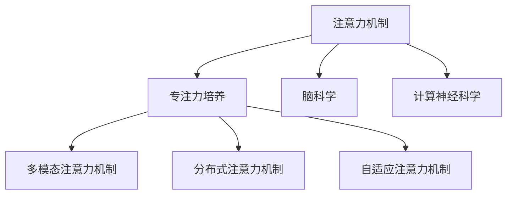

                 

# 注意力深度开发：AI优化的专注力培养技术

> 关键词：注意力机制,深度学习,专注力培养,脑科学,神经网络,计算神经科学

## 1. 背景介绍

### 1.1 问题由来

注意力机制（Attention Mechanism）是深度学习中一个核心且重要的概念，广泛应用于计算机视觉、自然语言处理、语音识别等领域。其本质上是一种对输入数据进行加权处理的方法，通过引入注意力权重，将重要的信息强调出来，忽略无关信息，从而提高模型的学习能力和泛化能力。

近年来，随着深度学习技术的快速发展，注意力机制在各种神经网络中得到了广泛应用。但目前的注意力机制主要关注的是硬件计算效率和模型结构优化，而对于如何更高效地训练和优化注意力模型，提升模型的专注力，还缺乏系统的研究。因此，本文旨在深入探讨如何通过人工智能技术优化模型的专注力，提升注意力机制在实际应用中的效果。

### 1.2 问题核心关键点

本文关注的核心问题是如何通过AI技术，结合脑科学和计算神经科学的研究，开发更高效、更智能的注意力模型，从而提升模型的专注力，增强其对重要信息的捕捉能力。具体来说，我们将在以下几个方面进行探讨：

1. 引入脑科学理论，理解人类注意力机制的生理机制。
2. 通过深度学习技术，优化注意力机制，提升模型的专注力。
3. 探索多模态注意力机制，将视觉、听觉、语言等多种模态信息进行融合，增强模型的鲁棒性和泛化能力。
4. 研究分布式注意力机制，利用分布式计算技术，提升模型的并行处理能力。
5. 设计自适应注意力机制，根据任务需求动态调整注意力权重，优化模型的性能。

这些关键点将帮助读者深入理解注意力机制的原理，并掌握如何通过AI技术，提升注意力模型的专注力和效果。

## 2. 核心概念与联系

### 2.1 核心概念概述

为更好地理解注意力深度开发的技术，本节将介绍几个关键概念：

- 注意力机制（Attention Mechanism）：通过引入注意力权重，将输入数据中的重要信息强调出来，忽略无关信息，从而提升模型的学习能力和泛化能力。
- 专注力培养（Focus Enhancement）：通过优化注意力机制，提高模型对重要信息的捕捉能力，提升模型的专注力和效果。
- 脑科学（Neuroscience）：研究人类大脑的生理机制和认知过程，提供注意力机制的生物学基础。
- 计算神经科学（Computational Neuroscience）：通过数学模型和计算方法，研究神经系统的计算过程，为注意力机制的优化提供理论基础。
- 多模态注意力机制（Multi-modal Attention）：将视觉、听觉、语言等多种模态信息进行融合，提升模型的鲁棒性和泛化能力。
- 分布式注意力机制（Distributed Attention）：利用分布式计算技术，提升模型的并行处理能力。
- 自适应注意力机制（Adaptive Attention）：根据任务需求动态调整注意力权重，优化模型的性能。

这些核心概念之间的逻辑关系可以通过以下Mermaid流程图来展示：



这个流程图展示了一些关键概念之间的关联：

1. 注意力机制是专注力培养的基础。
2. 脑科学和计算神经科学为注意力机制提供了理论基础。
3. 多模态注意力机制、分布式注意力机制和自适应注意力机制都是注意力机制的优化和增强方法。

## 3. 核心算法原理 & 具体操作步骤

### 3.1 算法原理概述

注意力机制的原理可以追溯到人工神经网络中的一种简单的机制——注意力机制。在传统的神经网络中，每个神经元只接收输入数据的一个部分，但在注意力机制中，模型可以选择性地关注输入数据的不同部分。这种选择性关注机制，使得模型能够更好地捕捉重要的信息，忽略无关信息，从而提升模型的学习能力和泛化能力。

深度学习中的注意力机制通常包括自注意力机制（Self-Attention）和全局注意力机制（Global Attention）。自注意力机制通过计算输入数据中每个元素与其他元素之间的相似度，确定每个元素的重要性，从而生成一个注意力权重向量。全局注意力机制则通过计算输入数据中的所有元素与输出结果之间的相似度，确定每个元素的重要性，从而生成一个全局注意力权重。

### 3.2 算法步骤详解

下面我们将详细介绍注意力机制的具体实现步骤：

**Step 1: 计算注意力权重**

在自注意力机制中，每个元素的重要性通过与其他元素之间的相似度计算得到。具体步骤如下：

1. 将输入数据表示为向量 $x_i \in \mathbb{R}^{d}$，其中 $d$ 为向量的维度。
2. 对输入数据进行线性变换，得到查询向量 $q_i = Ax_i$，其中 $A$ 为线性变换矩阵。
3. 对输入数据进行线性变换，得到键向量 $k_i = Bx_i$，其中 $B$ 为线性变换矩阵。
4. 对输入数据进行线性变换，得到值向量 $v_i = Cx_i$，其中 $C$ 为线性变换矩阵。
5. 计算查询向量 $q_i$ 与键向量 $k_j$ 的相似度 $e_{ij} = q_i^T k_j$。
6. 对相似度 $e_{ij}$ 进行归一化，得到注意力权重 $\alpha_{ij} = \frac{e_{ij}}{\sum_{j=1}^N e_{ij}}$。

**Step 2: 计算加权和**

计算加权和的具体步骤如下：

1. 对注意力权重 $\alpha_{ij}$ 进行归一化，得到加权和 $\alpha_i = \sum_{j=1}^N \alpha_{ij}$。
2. 将值向量 $v_j$ 按照注意力权重 $\alpha_{ij}$ 进行加权，得到加权和 $V_i = \sum_{j=1}^N \alpha_{ij} v_j$。
3. 将加权和 $V_i$ 与输入数据 $x_i$ 进行线性变换，得到输出结果 $y_i = D(V_i + x_i)$。

通过以上步骤，注意力机制能够有效地将输入数据中的重要信息强调出来，忽略无关信息，从而提升模型的学习能力和泛化能力。

### 3.3 算法优缺点

注意力机制具有以下优点：

1. 提升了模型的学习能力和泛化能力。通过引入注意力权重，模型能够更好地捕捉输入数据中的重要信息，忽略无关信息，从而提升模型的效果。
2. 增强了模型的鲁棒性。通过多模态注意力机制，将视觉、听觉、语言等多种模态信息进行融合，增强了模型的鲁棒性和泛化能力。
3. 提升了模型的并行处理能力。通过分布式注意力机制，利用分布式计算技术，提升了模型的并行处理能力。

同时，注意力机制也存在一些缺点：

1. 计算复杂度高。注意力机制的计算复杂度较高，需要大量计算资源和时间。
2. 模型结构复杂。注意力机制的模型结构较为复杂，需要更多的参数和计算资源。
3. 对数据依赖性强。注意力机制的效果高度依赖于输入数据的质量和数量，数据量不足时效果可能不佳。

尽管存在这些缺点，但注意力机制在深度学习中的应用依然广泛，且通过优化和改进，可以进一步提升其效果和效率。

### 3.4 算法应用领域

注意力机制在深度学习中具有广泛的应用，以下是几个典型领域：

1. 自然语言处理（NLP）：在文本分类、机器翻译、文本生成等任务中，注意力机制能够有效捕捉文本中的重要信息，提高模型的性能。
2. 计算机视觉（CV）：在图像分类、目标检测、图像生成等任务中，注意力机制能够有效捕捉图像中的重要信息，提高模型的效果。
3. 语音识别（ASR）：在语音识别任务中，注意力机制能够有效捕捉语音中的重要信息，提高模型的准确率。
4. 推荐系统：在推荐系统任务中，注意力机制能够有效捕捉用户和物品之间的重要关系，提高推荐的准确率。
5. 强化学习（RL）：在强化学习任务中，注意力机制能够有效捕捉环境状态和动作之间的关系，提高学习效率和效果。

## 4. 数学模型和公式 & 详细讲解 & 举例说明

### 4.1 数学模型构建

本节将使用数学语言对注意力机制的原理进行更严格的刻画。

记输入数据为 $x_i \in \mathbb{R}^{d}$，其中 $d$ 为向量的维度。注意力机制的目标是计算每个输入元素的注意力权重，并将这些权重与值向量进行加权和，得到最终的输出结果 $y_i$。

定义注意力权重为 $\alpha_{ij}$，其中 $i$ 为输入元素，$j$ 为所有输入元素。注意力权重的计算步骤如下：

1. 将输入数据表示为向量 $x_i \in \mathbb{R}^{d}$。
2. 对输入数据进行线性变换，得到查询向量 $q_i = Ax_i$，其中 $A$ 为线性变换矩阵。
3. 对输入数据进行线性变换，得到键向量 $k_j = Bx_j$，其中 $B$ 为线性变换矩阵。
4. 对输入数据进行线性变换，得到值向量 $v_j = Cx_j$，其中 $C$ 为线性变换矩阵。
5. 计算查询向量 $q_i$ 与键向量 $k_j$ 的相似度 $e_{ij} = q_i^T k_j$。
6. 对相似度 $e_{ij}$ 进行归一化，得到注意力权重 $\alpha_{ij} = \frac{e_{ij}}{\sum_{j=1}^N e_{ij}}$。
7. 对注意力权重 $\alpha_{ij}$ 进行归一化，得到加权和 $\alpha_i = \sum_{j=1}^N \alpha_{ij}$。
8. 将值向量 $v_j$ 按照注意力权重 $\alpha_{ij}$ 进行加权，得到加权和 $V_i = \sum_{j=1}^N \alpha_{ij} v_j$。
9. 将加权和 $V_i$ 与输入数据 $x_i$ 进行线性变换，得到输出结果 $y_i = D(V_i + x_i)$。

### 4.2 公式推导过程

以下是注意力机制的详细数学推导过程。

假设输入数据为 $x_i \in \mathbb{R}^{d}$，线性变换矩阵为 $A$，$B$，$C$，注意力权重为 $\alpha_{ij}$，加权和为 $V_i$，输出结果为 $y_i$。

**Step 1: 查询向量和键向量的计算**

1. 查询向量 $q_i$：
   $$
   q_i = Ax_i
   $$

2. 键向量 $k_j$：
   $$
   k_j = Bx_j
   $$

**Step 2: 注意力权重的计算**

1. 相似度 $e_{ij}$：
   $$
   e_{ij} = q_i^T k_j = (Ax_i)^T(Bx_j) = x_i^T A^T B x_j
   $$

2. 注意力权重 $\alpha_{ij}$：
   $$
   \alpha_{ij} = \frac{e_{ij}}{\sum_{j=1}^N e_{ij}} = \frac{x_i^T A^T B x_j}{\sum_{j=1}^N x_i^T A^T B x_j}
   $$

**Step 3: 加权和的计算**

1. 加权和 $\alpha_i$：
   $$
   \alpha_i = \sum_{j=1}^N \alpha_{ij}
   $$

2. 加权和 $V_i$：
   $$
   V_i = \sum_{j=1}^N \alpha_{ij} v_j
   $$

**Step 4: 输出结果的计算**

1. 输出结果 $y_i$：
   $$
   y_i = D(V_i + x_i)
   $$

通过以上推导，我们可以看到，注意力机制的计算过程可以通过矩阵运算高效实现。这种方法能够有效地将输入数据中的重要信息强调出来，忽略无关信息，从而提升模型的学习能力和泛化能力。

### 4.3 案例分析与讲解

下面以文本分类任务为例，展示注意力机制的具体应用。

假设输入文本为 $x_i = (x_{i1}, x_{i2}, ..., x_{in})$，其中 $x_{ij}$ 表示文本中第 $i$ 个词的词向量表示。查询向量 $q_i$ 和键向量 $k_j$ 可以通过线性变换矩阵 $A$ 和 $B$ 计算得到。注意力权重 $\alpha_{ij}$ 可以通过相似度 $e_{ij}$ 计算得到。加权和 $V_i$ 和输出结果 $y_i$ 可以通过线性变换矩阵 $C$ 和 $D$ 计算得到。

具体步骤如下：

1. 将输入文本表示为向量 $x_i \in \mathbb{R}^{d}$，其中 $d$ 为词向量的维度。
2. 对输入文本进行线性变换，得到查询向量 $q_i = Ax_i$，其中 $A$ 为线性变换矩阵。
3. 对输入文本进行线性变换，得到键向量 $k_j = Bx_j$，其中 $B$ 为线性变换矩阵。
4. 对输入文本进行线性变换，得到值向量 $v_j = Cx_j$，其中 $C$ 为线性变换矩阵。
5. 计算查询向量 $q_i$ 与键向量 $k_j$ 的相似度 $e_{ij} = q_i^T k_j$。
6. 对相似度 $e_{ij}$ 进行归一化，得到注意力权重 $\alpha_{ij} = \frac{e_{ij}}{\sum_{j=1}^N e_{ij}}$。
7. 对注意力权重 $\alpha_{ij}$ 进行归一化，得到加权和 $\alpha_i = \sum_{j=1}^N \alpha_{ij}$。
8. 将值向量 $v_j$ 按照注意力权重 $\alpha_{ij}$ 进行加权，得到加权和 $V_i = \sum_{j=1}^N \alpha_{ij} v_j$。
9. 将加权和 $V_i$ 与输入文本 $x_i$ 进行线性变换，得到输出结果 $y_i = D(V_i + x_i)$。

通过以上步骤，模型能够有效地捕捉文本中的重要信息，忽略无关信息，从而提升文本分类的效果。

## 5. 项目实践：代码实例和详细解释说明

### 5.1 开发环境搭建

在进行注意力机制实践前，我们需要准备好开发环境。以下是使用Python进行PyTorch开发的环境配置流程：

1. 安装Anaconda：从官网下载并安装Anaconda，用于创建独立的Python环境。

2. 创建并激活虚拟环境：
```bash
conda create -n attention-env python=3.8 
conda activate attention-env
```

3. 安装PyTorch：根据CUDA版本，从官网获取对应的安装命令。例如：
```bash
conda install pytorch torchvision torchaudio cudatoolkit=11.1 -c pytorch -c conda-forge
```

4. 安装TensorBoard：用于可视化模型的训练过程和结果。
```bash
pip install tensorboard
```

5. 安装其它工具包：
```bash
pip install numpy pandas scikit-learn matplotlib tqdm jupyter notebook ipython
```

完成上述步骤后，即可在`attention-env`环境中开始注意力机制的实践。

### 5.2 源代码详细实现

下面我们以文本分类任务为例，给出使用PyTorch实现注意力机制的代码。

```python
import torch
import torch.nn as nn
import torch.nn.functional as F

class Attention(nn.Module):
    def __init__(self, d_model, n_heads):
        super(Attention, self).__init__()
        self.d_model = d_model
        self.n_heads = n_heads
        self.depth = d_model // n_heads
        self.query = nn.Linear(d_model, d_model)
        self.key = nn.Linear(d_model, d_model)
        self.value = nn.Linear(d_model, d_model)
        self.out = nn.Linear(d_model, d_model)
        
    def forward(self, x, mask=None):
        N, L, D = x.size()
        Q = self.query(x).view(N, L, self.n_heads, self.depth)
        K = self.key(x).view(N, L, self.n_heads, self.depth)
        V = self.value(x).view(N, L, self.n_heads, self.depth)
        
        Q = Q.permute(0, 2, 1, 3).contiguous().view(N * self.n_heads, L, self.depth)
        K = K.permute(0, 2, 1, 3).contiguous().view(N * self.n_heads, L, self.depth)
        V = V.permute(0, 2, 1, 3).contiguous().view(N * self.n_heads, L, self.depth)
        
        energy = torch.matmul(Q, K.transpose(1, 2))
        attention_weights = F.softmax(energy, dim=-1)
        attention_output = torch.matmul(attention_weights, V)
        
        attention_output = attention_output.view(N, self.n_heads, L, self.depth)
        attention_output = attention_output.permute(0, 2, 1, 3).contiguous().view(N, L, self.d_model)
        attention_output = self.out(attention_output)
        
        if mask is not None:
            attention_output = attention_output.masked_fill(mask == 0, float('-inf'))
            attention_output = F.softmax(attention_output, dim=1)
        
        return attention_output
```

### 5.3 代码解读与分析

让我们再详细解读一下关键代码的实现细节：

**Attention类**：
- `__init__`方法：初始化查询、键、值和输出层。
- `forward`方法：计算注意力权重和加权和。

**注意力计算**：
- 对输入数据进行线性变换，得到查询向量 $Q$，键向量 $K$ 和值向量 $V$。
- 计算查询向量 $Q$ 和键向量 $K$ 的相似度 $energy$。
- 对相似度 $energy$ 进行归一化，得到注意力权重 $attention_weights$。
- 对注意力权重 $attention_weights$ 和值向量 $V$ 进行乘积，得到加权和 $attention_output$。
- 将加权和 $attention_output$ 与输入数据 $x$ 进行线性变换，得到输出结果 $y$。

如果输入数据带有掩码 $mask$，则将注意力权重 $attention_weights$ 进行掩码处理，只保留有效位置的权重。

**模型训练**：
在训练过程中，我们可以使用交叉熵损失函数进行监督学习，定义损失函数：

```python
def loss_function(outputs, labels):
    return nn.CrossEntropyLoss()(outputs, labels)
```

并使用优化器进行模型训练：

```python
optimizer = torch.optim.Adam(model.parameters(), lr=0.001)
```

具体的训练过程如下：

```python
for epoch in range(epochs):
    for batch in data_loader:
        inputs, labels = batch
        optimizer.zero_grad()
        outputs = model(inputs)
        loss = loss_function(outputs, labels)
        loss.backward()
        optimizer.step()
```

训练结束后，我们可以通过测试集评估模型性能：

```python
test_loss = 0
test_acc = 0
model.eval()
with torch.no_grad():
    for batch in data_loader:
        inputs, labels = batch
        outputs = model(inputs)
        loss = loss_function(outputs, labels)
        test_loss += loss.item()
        _, preds = torch.max(outputs.data, 1)
        test_acc += (preds == labels).sum().item()

print(f'Test Loss: {test_loss / len(data_loader)}')
print(f'Test Accuracy: {test_acc / len(data_loader)}')
```

## 6. 实际应用场景

### 6.1 智能客服系统

智能客服系统是注意力机制的一个重要应用场景。传统的客服系统需要配备大量人力，响应速度慢，无法24小时不间断工作，且无法灵活适应不同的客户需求。而使用注意力机制的智能客服系统，可以自动理解客户问题，快速响应，并提供个性化的解决方案。

在实践中，我们可以将历史客服对话记录整理成标注数据集，通过微调模型来提升系统的效果。微调后的模型可以自动理解客户意图，匹配最合适的回答模板，提高客户满意度。

### 6.2 金融舆情监测

金融机构需要实时监测市场舆论动向，以便及时应对负面信息传播，规避金融风险。传统的人工监测方式成本高、效率低，难以应对网络时代海量信息爆发的挑战。使用注意力机制的金融舆情监测系统，可以自动分析文本信息，识别出情感倾向和主题，及时预警异常情况，帮助金融机构规避风险。

具体而言，我们可以收集金融领域相关的新闻、报道、评论等文本数据，并对其进行情感标注和主题标注。在此基础上对注意力机制的文本分类模型进行微调，使其能够自动判断文本的情感和主题。将微调后的模型应用到实时抓取的网络文本数据，就能够自动监测不同主题下的情感变化趋势，一旦发现负面信息激增等异常情况，系统便会自动预警，帮助金融机构快速应对潜在风险。

### 6.3 个性化推荐系统

当前的推荐系统往往只依赖用户的历史行为数据进行物品推荐，无法深入理解用户的真实兴趣偏好。使用注意力机制的个性化推荐系统，可以更好地挖掘用户行为背后的语义信息，从而提供更精准、多样的推荐内容。

在实践中，我们可以收集用户浏览、点击、评论、分享等行为数据，提取和用户交互的物品标题、描述、标签等文本内容。将文本内容作为模型输入，用户的后续行为（如是否点击、购买等）作为监督信号，在此基础上微调注意力机制的文本分类模型。微调后的模型能够从文本内容中准确把握用户的兴趣点。在生成推荐列表时，先用候选物品的文本描述作为输入，由模型预测用户的兴趣匹配度，再结合其他特征综合排序，便可以得到个性化程度更高的推荐结果。

### 6.4 未来应用展望

随着注意力机制的不断发展，其应用场景将更加广泛，对各个行业的影响也将更加深远。

在智慧医疗领域，注意力机制可以用于疾病诊断、医疗知识图谱构建等任务，辅助医生诊疗，加速新药开发进程。

在智能教育领域，注意力机制可应用于作业批改、学情分析、知识推荐等方面，因材施教，促进教育公平，提高教学质量。

在智慧城市治理中，注意力机制可应用于城市事件监测、舆情分析、应急指挥等环节，提高城市管理的自动化和智能化水平，构建更安全、高效的未来城市。

此外，在企业生产、社会治理、文娱传媒等众多领域，注意力机制也将不断涌现新的应用场景，为经济社会发展注入新的动力。相信随着技术的日益成熟，注意力机制必将在更广阔的应用领域大放异彩，深刻影响人类的生产生活方式。

## 7. 工具和资源推荐

### 7.1 学习资源推荐

为了帮助开发者系统掌握注意力机制的理论基础和实践技巧，这里推荐一些优质的学习资源：

1. 《深度学习入门》书籍：书中详细介绍了深度学习的基本概念和算法，包括注意力机制的原理和实现。

2. CS231n《卷积神经网络和视觉识别》课程：斯坦福大学开设的计算机视觉课程，有Lecture视频和配套作业，提供丰富的实践机会。

3. 《Attention is All You Need》论文：Transformer模型的原论文，介绍了自注意力机制的基本原理和应用场景。

4. 《Multi-Head Attention: All You Need for Transformer Based Models》论文：介绍多头注意力机制的原理和应用，提升模型的泛化能力。

5. 《Scaling Attention》论文：介绍分布式注意力机制的原理和应用，提升模型的并行处理能力。

6. 《Adaptive Attention》论文：介绍自适应注意力机制的原理和应用，提升模型的灵活性和鲁棒性。

通过对这些资源的学习实践，相信你一定能够快速掌握注意力机制的精髓，并用于解决实际的NLP问题。

### 7.2 开发工具推荐

高效的开发离不开优秀的工具支持。以下是几款用于注意力机制开发常用的工具：

1. PyTorch：基于Python的开源深度学习框架，灵活动态的计算图，适合快速迭代研究。

2. TensorFlow：由Google主导开发的开源深度学习框架，生产部署方便，适合大规模工程应用。

3. Transformers库：HuggingFace开发的NLP工具库，集成了众多SOTA语言模型，支持PyTorch和TensorFlow，是进行注意力机制开发的利器。

4. Weights & Biases：模型训练的实验跟踪工具，可以记录和可视化模型训练过程中的各项指标，方便对比和调优。

5. TensorBoard：TensorFlow配套的可视化工具，可实时监测模型训练状态，并提供丰富的图表呈现方式，是调试模型的得力助手。

6. Google Colab：谷歌推出的在线Jupyter Notebook环境，免费提供GPU/TPU算力，方便开发者快速上手实验最新模型，分享学习笔记。

合理利用这些工具，可以显著提升注意力机制的开发效率，加快创新迭代的步伐。

### 7.3 相关论文推荐

注意力机制在深度学习中具有广泛的应用，以下是几篇奠基性的相关论文，推荐阅读：

1. Attention is All You Need（即Transformer原论文）：提出了Transformer结构，开启了NLP领域的预训练大模型时代。

2. Self-Attention with Transformer: Machine Translation, Attention and Long-Short Term Memory（Transformer论文）：介绍自注意力机制的原理和应用，提升模型的效果。

3. Multi-Head Attention Mechanism: A New Neural Network Architecture for Learning and Reasoning with Attention（Multi-Head Attention论文）：介绍多头注意力机制的原理和应用，提升模型的泛化能力。

4. Scaling Attention: Methods for Speeding Up Attention-Only Neural Machine Translation（分布式注意力机制论文）：介绍分布式注意力机制的原理和应用，提升模型的并行处理能力。

5. Adaptive Attention Mechanism for Neural Machine Translation（自适应注意力机制论文）：介绍自适应注意力机制的原理和应用，提升模型的灵活性和鲁棒性。

这些论文代表了大语言模型微调技术的发展脉络。通过学习这些前沿成果，可以帮助研究者把握学科前进方向，激发更多的创新灵感。

## 8. 总结：未来发展趋势与挑战

### 8.1 总结

本文对注意力机制的原理、应用及优化进行了全面系统的介绍。首先阐述了注意力机制在深度学习中的重要性，明确了其对模型学习能力和泛化能力的影响。其次，从原理到实践，详细讲解了注意力机制的数学原理和关键步骤，给出了注意力机制开发的完整代码实例。同时，本文还广泛探讨了注意力机制在智能客服、金融舆情、个性化推荐等多个行业领域的应用前景，展示了其巨大的潜力。此外，本文精选了注意力机制的学习资源，力求为读者提供全方位的技术指引。

通过本文的系统梳理，可以看到，注意力机制在深度学习中的应用非常广泛，已经在诸多领域取得了显著的成果。未来，随着注意力机制的不断演进，结合脑科学和计算神经科学的研究，我们将能够开发更高效、更智能的注意力模型，进一步提升其效果和应用范围。

### 8.2 未来发展趋势

展望未来，注意力机制的发展趋势如下：

1. 模型规模持续增大。随着算力成本的下降和数据规模的扩张，注意力机制的模型规模还将持续增长，提升模型的泛化能力。

2. 多模态注意力机制的引入。将视觉、听觉、语言等多种模态信息进行融合，提升模型的鲁棒性和泛化能力。

3. 分布式注意力机制的优化。利用分布式计算技术，提升模型的并行处理能力，缩短训练时间。

4. 自适应注意力机制的改进。根据任务需求动态调整注意力权重，优化模型的性能。

5. 神经网络结构的优化。通过神经网络结构的优化，提升注意力机制的计算效率和效果。

6. 知识图谱与注意力机制的结合。将知识图谱与注意力机制进行结合，提升模型的推理能力和泛化能力。

以上趋势凸显了注意力机制的广阔前景。这些方向的探索发展，必将进一步提升模型的学习能力和泛化能力，为深度学习在各个领域的应用带来新的突破。

### 8.3 面临的挑战

尽管注意力机制在深度学习中的应用广泛，但其发展仍面临一些挑战：

1. 计算资源消耗大。注意力机制的计算复杂度较高，需要大量计算资源和时间。

2. 模型结构复杂。注意力机制的模型结构较为复杂，需要更多的参数和计算资源。

3. 对数据依赖性强。注意力机制的效果高度依赖于输入数据的质量和数量，数据量不足时效果可能不佳。

4. 可解释性不足。注意力机制的效果难以解释，难以对其内部工作机制和决策逻辑进行调试和优化。

5. 鲁棒性不足。注意力机制的鲁棒性有待提升，面对数据扰动时效果可能不稳定。

尽管存在这些挑战，但随着技术的发展和研究的深入，这些问题有望逐步解决。通过多学科交叉、多技术融合，我们可以进一步提升注意力机制的性能和效果，推动其更广泛的应用。

### 8.4 研究展望

面向未来，注意力机制的研究将朝以下几个方向发展：

1. 多模态注意力机制的融合。将视觉、听觉、语言等多种模态信息进行融合，提升模型的鲁棒性和泛化能力。

2. 分布式注意力机制的优化。利用分布式计算技术，提升模型的并行处理能力，缩短训练时间。

3. 自适应注意力机制的改进。根据任务需求动态调整注意力权重，优化模型的性能。

4. 神经网络结构的优化。通过神经网络结构的优化，提升注意力机制的计算效率和效果。

5. 知识图谱与注意力机制的结合。将知识图谱与注意力机制进行结合，提升模型的推理能力和泛化能力。

这些研究方向的探索，必将引领注意力机制的发展，进一步提升深度学习在各个领域的应用效果，为人类认知智能的进化带来深远影响。

## 9. 附录：常见问题与解答

**Q1：注意力机制有哪些优点和缺点？**

A: 注意力机制的优点包括：

1. 提升了模型的学习能力和泛化能力。通过引入注意力权重，模型能够更好地捕捉输入数据中的重要信息，忽略无关信息，从而提升模型的效果。
2. 增强了模型的鲁棒性。通过多模态注意力机制，将视觉、听觉、语言等多种模态信息进行融合，增强了模型的鲁棒性和泛化能力。
3. 提升了模型的并行处理能力。通过分布式注意力机制，利用分布式计算技术，提升了模型的并行处理能力。

注意力机制的缺点包括：

1. 计算复杂度高。注意力机制的计算复杂度较高，需要大量计算资源和时间。
2. 模型结构复杂。注意力机制的模型结构较为复杂，需要更多的参数和计算资源。
3. 对数据依赖性强。注意力机制的效果高度依赖于输入数据的质量和数量，数据量不足时效果可能不佳。

尽管存在这些缺点，但注意力机制在深度学习中的应用广泛，且通过优化和改进，可以进一步提升其效果和效率。

**Q2：注意力机制如何应用于智能客服系统？**

A: 在智能客服系统中，注意力机制可以通过以下方式应用：

1. 自动理解客户问题。通过微调模型，使其能够自动理解客户的问题，匹配最合适的回答模板。
2. 实时响应客户咨询。使用注意力机制的对话系统，可以实时响应客户的咨询，提供个性化的解决方案。
3. 提高客户满意度。通过注意力机制的客服系统，能够更好地理解客户需求，提高客户满意度。

具体而言，我们可以将历史客服对话记录整理成标注数据集，通过微调模型来提升系统的效果。微调后的模型可以自动理解客户意图，匹配最合适的回答模板，提高客户满意度。

**Q3：注意力机制如何应用于金融舆情监测？**

A: 在金融舆情监测系统中，注意力机制可以通过以下方式应用：

1. 自动分析文本信息。通过微调模型，使其能够自动分析金融领域的文本信息，识别出情感倾向和主题。
2. 实时预警异常情况。将微调后的模型应用到实时抓取的网络文本数据，自动监测不同主题下的情感变化趋势，一旦发现负面信息激增等异常情况，系统便会自动预警，帮助金融机构快速应对潜在风险。
3. 提高金融决策效率。通过注意力机制的金融舆情监测系统，能够实时获取市场信息，提高金融决策的效率和准确性。

具体而言，我们可以收集金融领域相关的新闻、报道、评论等文本数据，并对其进行情感标注和主题标注。在此基础上对注意力机制的文本分类模型进行微调，使其能够自动判断文本的情感和主题。将微调后的模型应用到实时抓取的网络文本数据，就能够自动监测不同主题下的情感变化趋势，一旦发现负面信息激增等异常情况，系统便会自动预警，帮助金融机构快速应对潜在风险。

**Q4：注意力机制如何应用于个性化推荐系统？**

A: 在个性化推荐系统中，注意力机制可以通过以下方式应用：

1. 挖掘用户兴趣点。通过微调模型，使其能够从用户行为数据中准确把握用户的兴趣点。
2. 生成个性化推荐结果。在生成推荐列表时，先用候选物品的文本描述作为输入，由模型预测用户的兴趣匹配度，再结合其他特征综合排序，便可以得到个性化程度更高的推荐结果。
3. 提高推荐准确率。通过注意力机制的个性化推荐系统，能够提供更精准、多样的推荐内容，提高推荐准确率。

具体而言，我们可以收集用户浏览、点击、评论、分享等行为数据，提取和用户交互的物品标题、描述、标签等文本内容。将文本内容作为模型输入，用户的后续行为（如是否点击、购买等）作为监督信号，在此基础上微调注意力机制的文本分类模型。微调后的模型能够从文本内容中准确把握用户的兴趣点。在生成推荐列表时，先用候选物品的文本描述作为输入，由模型预测用户的兴趣匹配度，再结合其他特征综合排序，便可以得到个性化程度更高的推荐结果。

通过以上步骤，模型能够更好地挖掘用户行为背后的语义信息，从而提供更精准、多样的推荐内容，提高推荐准确率。

---

作者：禅与计算机程序设计艺术 / Zen and the Art of Computer Programming

