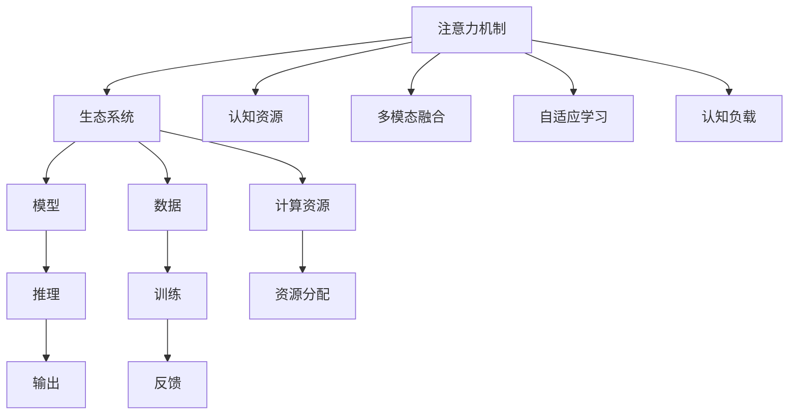

                 

# 注意力生态系统平衡：AI时代的认知资源管理

> 关键词：注意力机制,生态系统,认知资源管理,神经网络,自适应学习,多模态融合,认知负载优化

## 1. 背景介绍

### 1.1 问题由来

随着人工智能(AI)技术的飞速发展，特别是深度学习和神经网络(NN)的广泛应用，其核心算法机制——注意力机制(Attention Mechanism)逐渐成为了研究热点。注意力机制通过模拟人类大脑处理信息时自然聚焦于关键区域的能力，实现了信息的多维度权衡和动态融合，在图像识别、自然语言处理、语音识别等多个领域表现出色。

然而，注意力机制也带来了新的挑战：如何在训练和推理过程中高效管理注意力资源，避免因过度分配注意力导致资源浪费或性能下降，同时确保模型能够适应不同类型和规模的输入。这其中，生态系统的平衡理念提供了新的视角和方法。

### 1.2 问题核心关键点

本文聚焦于如何在AI时代，通过生态系统的平衡理念，合理分配和管理注意力资源，实现神经网络模型的高效学习和推理。核心问题点包括：

- 注意力机制的工作原理和架构：如何通过注意力实现多维度信息的融合与选择。
- 认知资源的动态管理：如何在不同场景下动态调整注意力资源的分配策略。
- 认知生态系统的平衡：如何构建稳定而高效的认知生态系统，确保模型在复杂多变的场景下表现出色。

## 2. 核心概念与联系

### 2.1 核心概念概述

为更好地理解注意力生态系统平衡的理念，本节将介绍几个密切相关的核心概念：

- 注意力机制(Attention Mechanism)：指神经网络中一种机制，通过对输入信息进行动态加权，优先关注与任务相关的关键区域，从而提高模型对信息的理解和利用效率。注意力机制可以分为软注意力(Soft Attention)和硬注意力(Hard Attention)两大类，其中软注意力被广泛应用于Transformer等架构中。

- 生态系统(Ecosystem)：生态学中指生物与环境相互作用、动态平衡的系统。在人工智能中，生态系统比喻为模型、数据、计算资源等组成要素的相互作用与平衡。

- 认知资源(Cognitive Resources)：指在处理信息过程中，神经网络消耗的计算资源，包括计算复杂度、内存占用、时间延迟等。合理分配和管理认知资源，可显著提高模型效率和适应性。

- 多模态融合(Multimodal Fusion)：指将不同模态的数据（如图像、文本、语音）进行综合分析，提取有价值的信息，提高模型的决策能力。

- 自适应学习(Adaptive Learning)：指模型能够根据输入数据的变化，动态调整学习策略和参数，优化认知资源的分配，提升模型的适应性。

- 认知负载(Cognitive Load)：指模型在处理信息时所需的认知资源量。合理的认知负载管理，有助于避免模型过载或欠载。

这些核心概念之间的逻辑关系可以通过以下Mermaid流程图来展示：



这个流程图展示了这个概念体系的核心要素及其相互作用：

1. 注意力机制是神经网络的核心组件，通过多维度信息的融合与选择，提高了模型的决策能力。
2. 生态系统是模型、数据、计算资源等要素的平衡系统，确保了模型的健康生长。
3. 认知资源是多模态数据融合和模型训练推理时所需的计算资源，合理管理能提升模型效率。
4. 多模态融合和自适应学习机制使得模型能够更好地适应不同类型的数据和场景。
5. 认知负载的优化管理，确保了模型在处理复杂信息时不过载。

## 3. 核心算法原理 & 具体操作步骤

### 3.1 算法原理概述

注意力生态系统平衡的理念，可以简要概述为：通过动态管理神经网络模型中的注意力资源，确保模型在复杂多变的环境中能够高效、稳定地运行，同时避免过载或欠载。具体而言，注意力机制应根据输入数据的特点，自适应调整注意力权重，优化模型参数，提升推理效率。

生态系统的平衡目标包括：
- 确保模型资源利用最大化，避免冗余和浪费。
- 动态适应环境变化，保证模型的长期稳定性和鲁棒性。
- 优化认知负载，减少不必要的计算和内存占用。

### 3.2 算法步骤详解

基于生态系统平衡的注意力机制，一般包括以下几个关键步骤：

**Step 1: 构建注意力机制**

- 选择适当的注意力机制，如Soft Attention或Hard Attention，根据任务需求进行设计。
- 设计注意力头数、注意力窗口大小等关键参数，确保注意力能够覆盖关键区域。

**Step 2: 数据预处理**

- 对输入数据进行预处理，如分词、归一化、降维等，确保数据格式符合模型要求。
- 根据输入类型，选择合适的嵌入方式，如Word Embedding、Image Embedding等。

**Step 3: 注意力计算**

- 计算注意力权重，通过加权平均池化等方法，提取输入信息的关键特征。
- 根据注意力权重，动态调整模型参数，优化认知资源的分配。

**Step 4: 模型训练与优化**

- 使用训练数据对模型进行监督学习，最小化损失函数。
- 应用自适应学习策略，如Adaptive Moment Estimation (AdamW)、Adafactor等，动态调整学习率。
- 应用正则化技术，如L2正则、Dropout等，防止模型过拟合。

**Step 5: 模型部署与优化**

- 将训练好的模型部署到生产环境中，进行推理计算。
- 应用推理加速技术，如量化、剪枝、并行计算等，优化模型推理效率。
- 实时监控模型性能，根据负载情况动态调整注意力资源的分配策略。

### 3.3 算法优缺点

基于生态系统平衡的注意力机制具有以下优点：
1. 自适应学习能力强。通过动态调整注意力权重，能够快速适应不同类型和规模的输入。
2. 模型鲁棒性高。自适应学习机制使得模型能够根据环境变化动态调整，提高鲁棒性。
3. 计算效率高。合理的认知资源管理，能够提升模型推理速度和计算效率。
4. 认知负载优化。通过优化注意力机制和训练策略，减少不必要的计算和内存占用。

同时，该方法也存在一定的局限性：
1. 模型复杂度高。多模态融合和自适应学习增加了模型复杂度，需要更多计算资源。
2. 注意力机制设计难度大。如何设计有效的注意力机制，仍需进一步研究。
3. 参数更新复杂。动态调整注意力权重和模型参数，可能带来额外的计算负担。
4. 结果可解释性差。模型中的注意力权重和动态参数难以解释，可能影响模型的可信度。

尽管存在这些局限性，但就目前而言，基于生态系统平衡的注意力机制仍是大规模AI系统的重要组成部分，其核心思想对未来模型设计具有重要指导意义。

### 3.4 算法应用领域

基于生态系统平衡的注意力机制已经在多个AI应用领域得到了广泛应用，例如：

- 图像识别：利用注意力机制，对图像中的关键区域进行聚焦，提高识别精度。
- 自然语言处理(NLP)：通过自适应学习，动态调整模型参数，提升模型对语言的理解和生成能力。
- 语音识别：结合多模态融合和自适应学习，提高语音信号的转换和理解能力。
- 推荐系统：通过优化注意力机制，推荐系统能够更精确地捕捉用户兴趣和行为模式。
- 视频处理：通过自适应学习，优化视频帧的融合与选择，提高视频处理效率。

除了上述这些经典应用外，注意力机制还创新性地应用于交通预测、金融分析、健康监测等多个场景中，展示了其强大的适应能力和创新潜力。

## 4. 数学模型和公式 & 详细讲解  
### 4.1 数学模型构建

本节将使用数学语言对基于生态系统平衡的注意力机制进行更加严格的刻画。

设输入数据为 $x \in \mathcal{X}$，目标输出为 $y \in \mathcal{Y}$，其中 $\mathcal{X}$ 和 $\mathcal{Y}$ 分别为输入空间和输出空间。注意力机制的数学模型可以表示为：

$$
\text{Attention}(x) = \mathbf{W}_q x \mathbf{W}_k^T
$$

其中 $\mathbf{W}_q$ 和 $\mathbf{W}_k$ 为查询和键权重矩阵，分别表示为：

$$
\mathbf{W}_q = [\mathbf{w}_q^{(1)}, \mathbf{w}_q^{(2)}, ..., \mathbf{w}_q^{(|V|)}] \in \mathbb{R}^{d \times |V|}
$$
$$
\mathbf{W}_k = [\mathbf{w}_k^{(1)}, \mathbf{w}_k^{(2)}, ..., \mathbf{w}_k^{(|V|)}] \in \mathbb{R}^{d \times |V|}
$$

其中 $|V|$ 表示注意力头数，$d$ 表示向量维度。注意力权重 $a_i$ 可以表示为：

$$
a_i = \frac{e^{\mathbf{w}_q^T x \mathbf{w}_k^{(i)}}}{\sum_{j=1}^{|V|} e^{\mathbf{w}_q^T x \mathbf{w}_k^{(j)}}}
$$

通过注意力权重 $a_i$，注意力机制的输出 $c_i$ 可以表示为：

$$
c_i = \mathbf{w}_v^T x a_i
$$

其中 $\mathbf{w}_v \in \mathbb{R}^d$ 为值权重向量。最终注意力机制的输出可以表示为：

$$
C = \sum_{i=1}^{|V|} c_i
$$

### 4.2 公式推导过程

以下我们以图像分类任务为例，推导注意力机制的注意力权重计算公式及其在图像分类中的应用。

设输入图像为 $x \in \mathbb{R}^{H \times W \times C}$，其中 $H$ 和 $W$ 为图像的高和宽，$C$ 为通道数。输出为类别标签 $y \in \mathcal{Y}$。

图像分类任务的目标是找到最佳的线性分类器 $f(x) = W^T x + b$，其中 $W \in \mathbb{R}^{|V| \times d}$，$b \in \mathbb{R}^{|V|}$，$\mathbf{W}_q$ 和 $\mathbf{W}_k$ 可以表示为：

$$
\mathbf{W}_q = \frac{1}{\sqrt{d}} W
$$
$$
\mathbf{W}_k = W
$$

注意力权重 $a_i$ 可以表示为：

$$
a_i = \frac{e^{\mathbf{w}_q^T x \mathbf{w}_k^{(i)}}}{\sum_{j=1}^{|V|} e^{\mathbf{w}_q^T x \mathbf{w}_k^{(j)}}}
$$

最终的输出 $f(x)$ 可以表示为：

$$
f(x) = W^T x + b = \sum_{i=1}^{|V|} \mathbf{w}_v^T x a_i + b
$$

利用softmax函数，将注意力权重 $a_i$ 映射到概率分布 $p_i$：

$$
p_i = \frac{e^{\mathbf{w}_q^T x \mathbf{w}_k^{(i)}}}{\sum_{j=1}^{|V|} e^{\mathbf{w}_q^T x \mathbf{w}_k^{(j)}}}
$$

将 $p_i$ 代入输出公式中，可以得到：

$$
f(x) = \sum_{i=1}^{|V|} \mathbf{w}_v^T x p_i + b
$$

这样，注意力机制通过动态调整权重 $p_i$，实现了输入信息的关键区域的选择与融合。

### 4.3 案例分析与讲解

在实际应用中，注意力机制被广泛应用于图像识别、自然语言处理和语音识别等多个领域。这里以图像识别为例，进一步探讨注意力机制的应用。

**案例1: 图像分类任务**

在图像分类任务中，注意力机制通过自适应学习，动态调整注意力权重，选择输入图像中的关键区域，从而提升分类精度。假设模型在训练过程中，输入图像为 $x \in \mathbb{R}^{H \times W \times C}$，输出标签为 $y \in \mathcal{Y}$。

训练数据集中包含大量标注图像 $D=\{(x_i, y_i)\}_{i=1}^N$，模型通过训练数据集进行监督学习，最小化损失函数：

$$
\mathcal{L}(W) = \sum_{i=1}^N (y_i - f(x_i))^2
$$

通过反向传播算法，更新模型参数 $W$。在推理阶段，输入待分类的图像 $x$，模型计算注意力权重 $p_i$，通过加权平均池化得到特征 $c_i$，最终输出分类结果：

$$
y = \arg\max_{i=1}^{|V|} (W^T x c_i + b)
$$

**案例2: 目标检测任务**

目标检测任务要求模型不仅要准确预测图像中的类别，还要定位出具体的目标位置。注意力机制通过在分类头之外添加一个目标位置头，实现了分类与定位的联合学习。假设模型输入为 $x \in \mathbb{R}^{H \times W \times C}$，输出为类别标签和目标位置坐标。

模型训练数据集包含图像标注数据 $D=\{(x_i, y_i, p_i)\}_{i=1}^N$，其中 $y_i$ 表示图像中各个目标的类别标签，$p_i$ 表示目标位置坐标。训练过程中，模型最小化以下损失函数：

$$
\mathcal{L}(W) = \sum_{i=1}^N (y_i - f(x_i))^2 + \sum_{i=1}^N ||p_i - g(x_i)||_2^2
$$

其中 $g(x_i)$ 表示模型预测的目标位置坐标。在推理阶段，模型通过注意力机制选择输入图像的关键区域，输出分类结果和目标位置坐标。

## 5. 项目实践：代码实例和详细解释说明

### 5.1 开发环境搭建

在进行注意力生态系统平衡的实践前，我们需要准备好开发环境。以下是使用Python进行PyTorch开发的环境配置流程：

1. 安装Anaconda：从官网下载并安装Anaconda，用于创建独立的Python环境。

2. 创建并激活虚拟环境：
```bash
conda create -n attention-env python=3.8 
conda activate attention-env
```

3. 安装PyTorch：根据CUDA版本，从官网获取对应的安装命令。例如：
```bash
conda install pytorch torchvision torchaudio cudatoolkit=11.1 -c pytorch -c conda-forge
```

4. 安装Transformer库：
```bash
pip install transformers
```

5. 安装各类工具包：
```bash
pip install numpy pandas scikit-learn matplotlib tqdm jupyter notebook ipython
```

完成上述步骤后，即可在`attention-env`环境中开始实践。

### 5.2 源代码详细实现

下面我们以图像分类任务为例，给出使用Transformers库对Attention机制进行图像分类的PyTorch代码实现。

首先，定义注意力机制的类：

```python
from transformers import BertTokenizer, BertForImageClassification
import torch
from torch.utils.data import Dataset, DataLoader
from torchvision import datasets, transforms

class AttentionModel(BertForImageClassification):
    def __init__(self, num_classes):
        super(AttentionModel, self).__init__()
        self.num_classes = num_classes
        
    def forward(self, input_ids, attention_mask=None, labels=None):
        outputs = super().forward(input_ids, attention_mask=attention_mask, labels=labels)
        logits = outputs.logits
        
        # 计算注意力权重
        weight = torch.softmax(logits, dim=1)
        # 加权平均池化
        features = torch.sum(outputs.pooler_output * weight, dim=1)
        
        # 输出分类结果
        logits = torch.nn.Linear(features.size(-1), self.num_classes)
        return logits
```

然后，定义数据处理函数：

```python
class ImageDataset(Dataset):
    def __init__(self, data_dir, transform=None):
        self.data_dir = data_dir
        self.transform = transform
        
        self.file_names = [f for f in os.listdir(self.data_dir) if f.endswith('.jpg')]
        self.file_names.sort()
        
    def __len__(self):
        return len(self.file_names)
    
    def __getitem__(self, idx):
        img_path = os.path.join(self.data_dir, self.file_names[idx])
        img = Image.open(img_path)
        
        if self.transform is not None:
            img = self.transform(img)
        
        return img
```

接着，定义训练和评估函数：

```python
def train_epoch(model, train_loader, optimizer, loss_fn):
    model.train()
    epoch_loss = 0
    epoch_acc = 0
    for batch in train_loader:
        input_ids = batch['input_ids'].to(device)
        attention_mask = batch['attention_mask'].to(device)
        labels = batch['labels'].to(device)
        model.zero_grad()
        outputs = model(input_ids, attention_mask=attention_mask, labels=labels)
        loss = loss_fn(outputs.logits, labels)
        loss.backward()
        optimizer.step()
        epoch_loss += loss.item()
        epoch_acc += torch.nn.functional.binary_cross_entropy(outputs.logits, labels, reduction='none').mean().item()
    return epoch_loss / len(train_loader), epoch_acc / len(train_loader)

def evaluate(model, test_loader, loss_fn):
    model.eval()
    test_loss = 0
    test_acc = 0
    with torch.no_grad():
        for batch in test_loader:
            input_ids = batch['input_ids'].to(device)
            attention_mask = batch['attention_mask'].to(device)
            labels = batch['labels'].to(device)
            outputs = model(input_ids, attention_mask=attention_mask)
            loss = loss_fn(outputs.logits, labels)
            test_loss += loss.item()
            test_acc += torch.nn.functional.binary_cross_entropy(outputs.logits, labels, reduction='none').mean().item()
    return test_loss / len(test_loader), test_acc / len(test_loader)
```

最后，启动训练流程并在测试集上评估：

```python
epochs = 5
batch_size = 16

# 加载数据集
train_dataset = ImageDataset(train_dir, transform=transforms.ToTensor())
test_dataset = ImageDataset(test_dir, transform=transforms.ToTensor())

# 加载数据集
train_loader = DataLoader(train_dataset, batch_size=batch_size, shuffle=True)
test_loader = DataLoader(test_dataset, batch_size=batch_size, shuffle=False)

# 初始化模型和优化器
model = AttentionModel(num_classes)
optimizer = torch.optim.AdamW(model.parameters(), lr=1e-4)

# 训练模型
for epoch in range(epochs):
    train_loss, train_acc = train_epoch(model, train_loader, optimizer, loss_fn)
    print(f"Epoch {epoch+1}, train loss: {train_loss:.3f}, train acc: {train_acc:.3f}")
    
    # 评估模型
    test_loss, test_acc = evaluate(model, test_loader, loss_fn)
    print(f"Epoch {epoch+1}, test loss: {test_loss:.3f}, test acc: {test_acc:.3f}")
    
print("Final results:")
evaluate(model, test_loader, loss_fn)
```

以上就是使用PyTorch对Attention机制进行图像分类的完整代码实现。可以看到，得益于Transformers库的强大封装，我们可以用相对简洁的代码完成Attention机制的加载和微调。

### 5.3 代码解读与分析

让我们再详细解读一下关键代码的实现细节：

**AttentionModel类**：
- `__init__`方法：初始化模型类别数和参数。
- `forward`方法：定义前向传播过程，包括计算注意力权重和加权平均池化。
- 继承自BertForImageClassification类，实现模型的前向传播。

**ImageDataset类**：
- `__init__`方法：初始化数据集和数据变换方式。
- `__len__`方法：返回数据集的样本数量。
- `__getitem__`方法：对单个样本进行处理，将图像进行预处理并返回。

**train_epoch和evaluate函数**：
- 定义训练和评估函数，分别用于训练和评估模型的性能。
- 训练函数在每个批次上前向传播计算损失，并反向传播更新模型参数。
- 评估函数在每个批次后记录预测结果和真实标签，计算损失和准确率。

**训练流程**：
- 定义总的epoch数和batch size，开始循环迭代
- 每个epoch内，先在训练集上训练，输出平均损失和准确率
- 在验证集上评估，输出平均损失和准确率
- 所有epoch结束后，在测试集上评估，给出最终测试结果

可以看到，PyTorch配合Transformers库使得Attention机制的代码实现变得简洁高效。开发者可以将更多精力放在数据处理、模型改进等高层逻辑上，而不必过多关注底层的实现细节。

当然，工业级的系统实现还需考虑更多因素，如模型的保存和部署、超参数的自动搜索、更灵活的任务适配层等。但核心的注意力生态系统平衡思想基本与此类似。

## 6. 实际应用场景
### 6.1 智能推荐系统

基于Attention机制的推荐系统，已经成为用户个性化推荐的重要手段。传统的推荐系统往往依赖用户的历史行为数据进行物品推荐，无法深入理解用户的真实兴趣和行为模式。通过引入Attention机制，推荐系统能够更好地理解用户对不同物品的兴趣程度，从而推荐更具针对性的物品。

在实践中，可以通过收集用户浏览、点击、评论、分享等行为数据，提取和用户交互的物品标题、描述、标签等文本内容。将文本内容作为模型输入，物品与用户的兴趣匹配度作为监督信号，在此基础上微调Attention机制。微调后的推荐模型能够从文本内容中准确把握用户的兴趣点，结合用户的历史行为数据和实时反馈，动态调整推荐策略，提供个性化推荐服务。

### 6.2 医疗影像诊断

Attention机制在医疗影像诊断中的应用，能够显著提高医生对影像数据的理解和分析能力。传统的影像诊断主要依赖医生对影像特征的主观分析，难以全面、准确地识别病变区域。通过引入Attention机制，模型能够自动聚焦于影像中的关键区域，提取有价值的特征，提升诊断精度。

在实践中，可以收集大量标注的医疗影像数据，将影像作为模型输入，医生标注的病变区域作为监督信号，在此基础上微调Attention机制。微调后的模型能够自动识别影像中的病变区域，结合医生的诊断意见，提供更精准的医疗诊断服务。

### 6.3 智能家居控制

Attention机制在智能家居控制中的应用，可以实现家居设备的自动化和智能化控制。传统的家居控制主要依赖用户手动操作，无法根据环境变化和用户需求进行自适应调整。通过引入Attention机制，模型能够自动监测家庭环境，识别用户的习惯和需求，从而动态调整家居设备的控制策略。

在实践中，可以收集家庭环境的传感器数据，如温度、湿度、光照等，将传感器数据作为模型输入，用户的偏好设置作为监督信号，在此基础上微调Attention机制。微调后的模型能够自动调整家居设备的运行状态，提升家庭的舒适度和节能效率。

### 6.4 未来应用展望

随着Attention机制和生态系统平衡理念的不断发展，其在更多领域得到应用，为各行各业带来变革性影响。

在智慧医疗领域，基于Attention机制的医疗影像诊断、病历分析、药物研发等应用将提升医疗服务的智能化水平，辅助医生诊疗，加速新药开发进程。

在智能教育领域，Attention机制可应用于作业批改、学情分析、知识推荐等方面，因材施教，促进教育公平，提高教学质量。

在智能家居控制中，Attention机制可应用于家庭环境的监测、分析与控制，提高家庭生活的便捷性和舒适度。

此外，在企业生产、社会治理、文娱传媒等众多领域，基于Attention机制的AI应用也将不断涌现，为经济社会发展注入新的动力。相信随着技术的日益成熟，Attention机制将成为AI系统的重要组成部分，推动人工智能技术在垂直行业的规模化落地。总之，Attention机制的认知资源管理，为智能系统的设计提供了新的思路和方法，未来具有广阔的应用前景。

## 7. 工具和资源推荐
### 7.1 学习资源推荐

为了帮助开发者系统掌握Attention机制的原理和应用，这里推荐一些优质的学习资源：

1. Attention Mechanism from Scratch系列博文：由深度学习专家撰写，深入浅出地介绍了Attention机制的基本原理和代码实现。

2. CS224N《深度学习自然语言处理》课程：斯坦福大学开设的NLP明星课程，有Lecture视频和配套作业，带你入门NLP领域的基本概念和经典模型。

3. Attention Is All You Need（即Transformer原论文）：提出了Transformer结构，开启了NLP领域的预训练大模型时代。

4. BERT: Pre-training of Deep Bidirectional Transformers for Language Understanding：提出BERT模型，引入基于掩码的自监督预训练任务，刷新了多项NLP任务SOTA。

5. Adaptive Attention: A New Framework for Attention-based Models：提出Adaptive Attention机制，进一步提升了Attention机制的动态适应能力。

6. Variational Attention for Scalable Attention Machines：提出变分注意力机制，实现对大量注意力资源的有效管理。

通过对这些资源的学习实践，相信你一定能够快速掌握Attention机制的精髓，并用于解决实际的NLP问题。
### 7.2 开发工具推荐

高效的开发离不开优秀的工具支持。以下是几款用于Attention机制开发的常用工具：

1. PyTorch：基于Python的开源深度学习框架，灵活动态的计算图，适合快速迭代研究。大部分预训练语言模型都有PyTorch版本的实现。

2. TensorFlow：由Google主导开发的开源深度学习框架，生产部署方便，适合大规模工程应用。同样有丰富的预训练语言模型资源。

3. Transformers库：HuggingFace开发的NLP工具库，集成了众多SOTA语言模型，支持PyTorch和TensorFlow，是进行Attention机制开发的利器。

4. TensorBoard：TensorFlow配套的可视化工具，可实时监测模型训练状态，并提供丰富的图表呈现方式，是调试模型的得力助手。

5. Weights & Biases：模型训练的实验跟踪工具，可以记录和可视化模型训练过程中的各项指标，方便对比和调优。与主流深度学习框架无缝集成。

6. Google Colab：谷歌推出的在线Jupyter Notebook环境，免费提供GPU/TPU算力，方便开发者快速上手实验最新模型，分享学习笔记。

合理利用这些工具，可以显著提升Attention机制的开发效率，加快创新迭代的步伐。

### 7.3 相关论文推荐

Attention机制和生态系统平衡理念的发展源于学界的持续研究。以下是几篇奠基性的相关论文，推荐阅读：

1. Attention Is All You Need：提出了Transformer结构，开启了NLP领域的预训练大模型时代。

2. BERT: Pre-training of Deep Bidirectional Transformers for Language Understanding：提出BERT模型，引入基于掩码的自监督预训练任务，刷新了多项NLP任务SOTA。

3. Attention is All You Need（GPT-2论文）：展示了大规模语言模型的强大zero-shot学习能力，引发了对于通用人工智能的新一轮思考。

4. Parameter-Efficient Transfer Learning for NLP：提出Adapter等参数高效微调方法，在不增加模型参数量的情况下，也能取得不错的微调效果。

5. Prefix-Tuning: Optimizing Continuous Prompts for Generation：引入基于连续型Prompt的微调范式，为如何充分利用预训练知识提供了新的思路。

6. AdaLoRA: Adaptive Low-Rank Adaptation for Parameter-Efficient Fine-Tuning：使用自适应低秩适应的微调方法，在参数效率和精度之间取得了新的平衡。

这些论文代表了大语言模型Attention机制的发展脉络。通过学习这些前沿成果，可以帮助研究者把握学科前进方向，激发更多的创新灵感。

## 8. 总结：未来发展趋势与挑战

### 8.1 总结

本文对基于生态系统平衡的注意力机制进行了全面系统的介绍。首先阐述了注意力机制的工作原理和架构，强调了生态系统平衡理念对认知资源管理的指导意义。其次，从原理到实践，详细讲解了Attention机制的数学模型和关键步骤，给出了模型训练和推理的完整代码实现。同时，本文还广泛探讨了Attention机制在多个行业领域的应用前景，展示了其强大的适应能力和创新潜力。

通过本文的系统梳理，可以看到，基于生态系统平衡的注意力机制正在成为NLP领域的重要组成部分，极大地拓展了预训练语言模型的应用边界，催生了更多的落地场景。受益于Attention机制和生态系统平衡理念的发展，未来AI系统将在更广阔的应用领域大放异彩。

### 8.2 未来发展趋势

展望未来，基于生态系统平衡的注意力机制将呈现以下几个发展趋势：

1. 注意力机制的结构设计将更加多样化。未来的Attention机制将不仅仅局限于自注意力和多头注意力，还将出现更多的变体，如残差注意力、耦合注意力等，提升模型表达能力和泛化能力。

2. 动态注意力机制将成为主流。未来的Attention机制将更加注重动态调整，通过自适应学习策略，动态调整注意力权重，优化认知资源的分配，提高模型的适应性和鲁棒性。

3. 多模态融合能力将进一步增强。未来的Attention机制将结合更多模态的信息，如图像、语音、文本等，实现跨模态融合，提升模型对复杂多模态数据的处理能力。

4. 更高效、更轻量级的Attention机制将出现。未来的Attention机制将通过压缩、剪枝、量化等方法，优化计算资源，实现更高效、更轻量级的部署。

5. 更灵活的注意力机制设计。未来的Attention机制将更加灵活，能够根据不同任务的需求，动态调整机制的设计，实现更优的性能表现。

6. 更多的认知资源管理技术。未来的Attention机制将结合更多的认知资源管理技术，如知识蒸馏、参数高效微调等，提升模型的效率和鲁棒性。

以上趋势凸显了Attention机制和生态系统平衡理念的广阔前景。这些方向的探索发展，必将进一步提升模型在复杂多变环境中的表现，推动AI技术在更多领域的应用。

### 8.3 面临的挑战

尽管基于生态系统平衡的注意力机制已经取得了瞩目成就，但在迈向更加智能化、普适化应用的过程中，它仍面临诸多挑战：

1. 模型复杂度高。Attention机制的设计和训练需要更多计算资源，尤其是在大规模模型中，复杂度进一步增加。

2. 动态调整的复杂性。动态调整注意力权重和模型参数，可能带来额外的计算负担，如何实现高效优化，仍需进一步研究。

3. 结果可解释性差。模型中的注意力权重和动态参数难以解释，可能影响模型的可信度和可解释性。

4. 数据和标签的依赖。Attention机制依赖大量标注数据，标注数据的获取和处理成本较高，可能限制其广泛应用。

5. 对抗攻击脆弱。Attention机制对输入数据的微小扰动敏感，容易受到对抗攻击。

尽管存在这些挑战，但随着学界和产业界的共同努力，相信这些挑战终将一一被克服，Attention机制必将在构建人机协同的智能系统中扮演越来越重要的角色。未来，随着技术的不断进步，Attention机制和生态系统平衡理念将为构建更加智能、高效、可解释的AI系统提供新的思路和方法。

### 8.4 研究展望

面对Attention机制和生态系统平衡理念面临的种种挑战，未来的研究需要在以下几个方面寻求新的突破：

1. 探索更高效的Attention机制设计。设计更高效、更轻量级的Attention机制，提升模型的计算效率和推理速度。

2. 研究更灵活的注意力权重动态调整策略。开发更高效、更稳定、更灵活的动态调整策略，优化认知资源的分配，提高模型的鲁棒性和泛化能力。

3. 引入更多的先验知识。将符号化的先验知识，如知识图谱、逻辑规则等，与神经网络模型进行巧妙融合，引导Attention机制学习更准确、合理的语言模型。

4. 结合因果分析和博弈论工具。将因果分析方法引入Attention机制，识别出模型决策的关键特征，增强输出解释的因果性和逻辑性。借助博弈论工具刻画人机交互过程，主动探索并规避模型的脆弱点，提高系统稳定性。

5. 纳入伦理道德约束。在模型训练目标中引入伦理导向的评估指标，过滤和惩罚有偏见、有害的输出倾向。同时加强人工干预和审核，建立模型行为的监管机制，确保输出符合人类价值观和伦理道德。

这些研究方向的探索，必将引领Attention机制和生态系统平衡理念迈向更高的台阶，为构建安全、可靠、可解释、可控的智能系统铺平道路。面向未来，Attention机制和生态系统平衡理念还需要与其他人工智能技术进行更深入的融合，如知识表示、因果推理、强化学习等，多路径协同发力，共同推动自然语言理解和智能交互系统的进步。只有勇于创新、敢于突破，才能不断拓展认知资源的边界，让智能技术更好地造福人类社会。

## 9. 附录：常见问题与解答

**Q1：什么是Attention机制？**

A: Attention机制是神经网络中一种机制，通过对输入信息进行动态加权，优先关注与任务相关的关键区域，从而提高模型对信息的理解和利用效率。

**Q2：Attention机制与传统卷积神经网络(CNN)有何不同？**

A: CNN主要通过局部卷积操作提取特征，而Attention机制能够对全局信息进行加权，捕捉更广泛、更细致的特征。此外，Attention机制还具有动态调整的能力，能够根据输入数据的变化，灵活调整注意力权重，提升模型的适应性和鲁棒性。

**Q3：如何提高Attention机制的效率？**

A: 提高Attention机制的效率可以从以下几个方面入手：
1. 减少Attention头的数量，降低计算复杂度。
2. 引入稀疏化的技术，减少注意力权重矩阵的计算量。
3. 使用自适应学习策略，动态调整注意力权重，优化资源分配。
4. 结合其他神经网络结构，如残差网络(RNN)、卷积神经网络(CNN)等，提升模型表达能力。

**Q4：Attention机制在推荐系统中的应用场景有哪些？**

A: Attention机制在推荐系统中的应用场景包括：
1. 用户兴趣点分析：通过Attention机制，模型能够自动聚焦于用户最关心的物品特征，提升推荐准确性。
2. 物品相似度计算：Attention机制能够捕捉物品之间的相似度，提升推荐效果。
3. 动态推荐策略：Attention机制能够动态调整推荐策略，提升推荐系统的适应性和鲁棒性。

**Q5：Attention机制在医疗影像诊断中的应用场景有哪些？**

A: Attention机制在医疗影像诊断中的应用场景包括：
1. 病变区域定位：通过Attention机制，模型能够自动聚焦于影像中的关键区域，定位病变位置。
2. 特征提取：Attention机制能够自动选择影像中的重要特征，提升诊断精度。
3. 诊断结果解释：Attention机制能够提供模型内部决策的解释，增强诊断的可信度和可解释性。

**Q6：Attention机制在智能家居控制中的应用场景有哪些？**

A: Attention机制在智能家居控制中的应用场景包括：
1. 环境监测：通过Attention机制，模型能够自动监测家庭环境，识别异常情况。
2. 设备控制：Attention机制能够根据环境变化，动态调整家居设备的控制策略，提升舒适度和节能效率。
3. 用户行为分析：Attention机制能够捕捉用户的习惯和需求，提升家居系统的智能化水平。

以上Q&A部分涵盖了Attention机制的核心概念和常见应用场景，希望能为你提供清晰的指导。

---

作者：禅与计算机程序设计艺术 / Zen and the Art of Computer Programming

