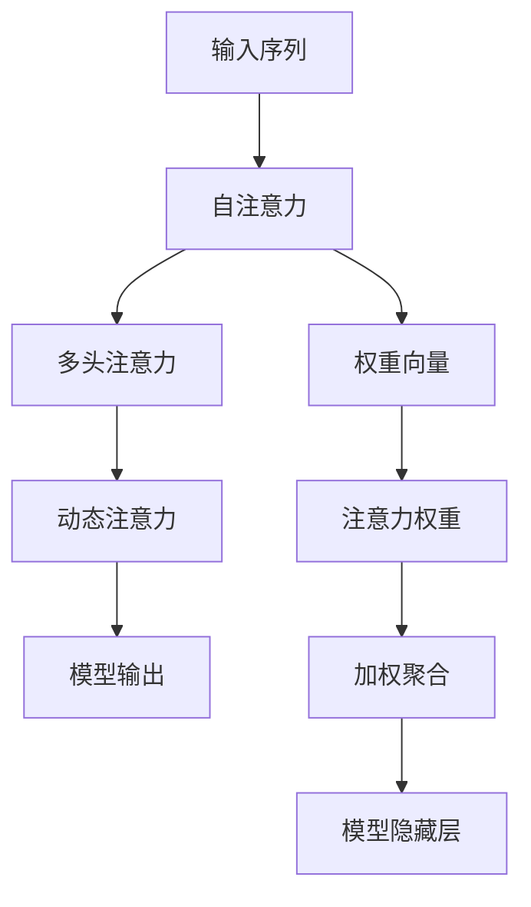

                 

## 1. 背景介绍

人工智能(AI)正在以前所未有的速度变革我们的生活和工作方式。从自动驾驶汽车到智能家居系统，从智能客服到个性化推荐，AI技术正逐步渗透到人类社会的各个角落。但许多人或许未曾意识到，这些看似抽象的AI应用，其背后隐藏着一个更为本质和深奥的科学问题——**注意力的优化**。

### 1.1 问题由来

注意力机制(Attention Mechanism)作为现代深度学习模型中不可或缺的组件，其核心思想在于通过动态地调整模型对不同输入元素的关注度，使模型能够有选择地关注重要信息，忽略无关细节。自2008年Hinton等提出基于注意力机制的序列建模以来，这一机制迅速成为深度学习模型的主流。而在大数据时代，通过调整和优化注意力机制，AI模型在视觉、语音、自然语言处理等领域都实现了性能的显著提升。

但注意力机制的优化并非易事。首先，在数据量庞大、结构复杂的情况下，注意力机制的参数量激增，计算复杂度显著增加；其次，如何通过注意力机制挖掘和强化人类的认知能力，是一个充满挑战且极具价值的研究方向。本文将详细探讨注意力机制的原理、优化策略及其应用，为读者提供一个全面且系统的学习框架。

### 1.2 问题核心关键点

本文聚焦于注意力机制的优化方法，主要涵盖以下几个关键点：

- **注意力机制的原理**：介绍注意力机制的基本工作原理和数学模型。
- **优化策略**：阐述当前主流注意力机制的优化策略，包括动态注意力、多头注意力、自注意力等。
- **应用领域**：展示注意力机制在计算机视觉、自然语言处理、语音处理等领域的典型应用。

通过对这些关键点的深入探讨，我们将揭示注意力机制在优化大脑功能和推动AI技术进步中的重要作用。

## 2. 核心概念与联系

### 2.1 核心概念概述

要深入理解注意力机制的优化方法，首先要明确其核心概念：

- **注意力机制(Attention Mechanism)**：是一种选择性地聚焦于输入序列中部分信息的方法，广泛应用于序列到序列(Seq2Seq)模型、视觉注意机制等。通过权重向量$w$调整不同元素的贡献度，实现信息选择与聚合。
- **自注意力(Self-Attention)**：一种特殊类型的注意力机制，用于处理序列中每个元素与所有其他元素的交互。自注意力机制能够捕捉长距离依赖关系，提升模型表达能力。
- **多头注意力(Multi-Head Attention)**：通过并行计算多个自注意力头，分别关注输入的不同方面，提升模型对复杂输入的表达能力。
- **动态注意力(Dynamic Attention)**：根据输入特征自适应地调整注意力权重，使模型能够更好地处理动态变化的任务。

这些概念共同构成了注意力机制的基石，奠定了其在深度学习中的广泛应用和持续优化。

### 2.2 核心概念原理和架构的 Mermaid 流程图



这个流程图展示了注意力机制的基本流程：

1. 输入序列通过自注意力机制，每个元素与所有其他元素交互，得到权重向量。
2. 权重向量通过多头注意力机制，分别关注输入的不同方面。
3. 动态注意力机制根据输入特征自适应调整注意力权重。
4. 加权聚合后，输入序列转换为模型的隐藏层表示，输出序列通过模型进行后续处理。

通过这个流程，注意力机制能够选择性地关注重要信息，忽略无关细节，提升模型表达和推理能力。

## 3. 核心算法原理 & 具体操作步骤

### 3.1 算法原理概述

注意力机制的核心在于通过动态调整注意力权重，选择性地关注输入序列中的关键元素。其数学模型可以表示为：

$$
a_i = \frac{\exp(e_i)}{\sum_j \exp(e_j)}
$$

其中 $e_i = w_i^T x_i$，$w_i$ 为权重向量，$x_i$ 为输入元素 $i$ 的特征向量。注意力权重 $a_i$ 表示元素 $i$ 对当前任务的相关性。

注意力机制的优化策略主要包括以下几个方面：

- **自注意力机制**：通过计算输入序列中所有元素之间的相似度，捕捉长距离依赖关系。
- **多头注意力机制**：通过并行计算多个自注意力头，提升模型对复杂输入的表达能力。
- **动态注意力机制**：根据输入特征自适应调整注意力权重，适应动态变化的任务。

### 3.2 算法步骤详解

以Transformer模型为例，介绍注意力机制的优化步骤：

**Step 1: 计算自注意力权重**

将输入序列 $X$ 表示为若干个特征向量，记为 $x_1, x_2, ..., x_n$。首先计算查询向量 $Q$ 和键向量 $K$：

$$
Q = XW_Q \\
K = XW_K
$$

其中 $W_Q$ 和 $W_K$ 为线性投影层。然后计算注意力权重 $a$：

$$
a = \text{softmax}\left(\frac{QK^T}{\sqrt{d_k}}\right)
$$

其中 $d_k$ 为键向量的维度。

**Step 2: 计算加权聚合**

将注意力权重 $a$ 与键向量 $K$ 加权求和，得到注意力值 $V$：

$$
V = \sum_i a_iK_i
$$

**Step 3: 多头注意力**

将 $V$ 进行线性投影，得到 $V'$：

$$
V' = HV
$$

通过并行计算多个注意力头 $h_1, h_2, ..., h_m$，得到最终的多头注意力值 $H$：

$$
H = [h_1, h_2, ..., h_m]
$$

**Step 4: 动态注意力**

在动态注意力机制中，通过调整权重向量 $w_i$ 的计算方式，实现根据输入特征自适应调整注意力权重，提升模型对动态变化任务的适应性。例如，可以根据任务的重要性和时间序列，动态调整注意力权重，使模型能够更好地处理复杂时序数据。

### 3.3 算法优缺点

注意力机制具有以下优点：

- **高效表达复杂信息**：通过自注意力机制和多头注意力机制，模型能够高效地处理长距离依赖关系，捕捉输入序列中的重要信息。
- **灵活性**：动态注意力机制可以根据输入特征自适应调整权重，使模型能够更好地适应动态变化的任务。

同时，也存在一些局限性：

- **计算复杂度高**：注意力机制的计算复杂度较高，尤其在输入序列较长时，会占用大量计算资源。
- **易受噪声干扰**：输入序列中存在噪声时，注意力机制容易产生错误的权重分配，影响模型性能。
- **可解释性不足**：注意力机制的内部工作机制较为复杂，难以解释其推理过程，不易于调试和优化。

### 3.4 算法应用领域

注意力机制在计算机视觉、自然语言处理、语音处理等多个领域都有广泛应用。以下是几个典型应用场景：

- **计算机视觉**：用于图像特征提取和图像分割，通过自注意力机制捕捉图像中的关键区域，提升模型的泛化能力。
- **自然语言处理**：在机器翻译、文本摘要、问答系统等任务中，通过多头注意力机制，实现序列到序列的映射和理解。
- **语音处理**：用于语音识别和语音合成，通过自注意力机制捕捉语音中的重要特征，提升模型的语音识别准确率和自然度。

此外，注意力机制还在多模态学习、推荐系统等领域展示了其强大的潜力。随着深度学习技术的不断发展，注意力机制的应用领域将不断拓展。

## 4. 数学模型和公式 & 详细讲解 & 举例说明

### 4.1 数学模型构建

在介绍注意力机制的数学模型时，我们重点关注以下几个部分：

- **自注意力机制**：通过计算输入序列中所有元素之间的相似度，捕捉长距离依赖关系。
- **多头注意力机制**：通过并行计算多个自注意力头，提升模型对复杂输入的表达能力。
- **动态注意力机制**：根据输入特征自适应调整注意力权重，适应动态变化的任务。

### 4.2 公式推导过程

以自注意力机制为例，其数学推导过程如下：

**Step 1: 计算查询向量 $Q$**

$$
Q = XW_Q
$$

**Step 2: 计算键向量 $K$**

$$
K = XW_K
$$

**Step 3: 计算注意力权重 $a$**

$$
a = \text{softmax}\left(\frac{QK^T}{\sqrt{d_k}}\right)
$$

**Step 4: 计算加权聚合 $V$**

$$
V = \sum_i a_iK_i
$$

**Step 5: 多头注意力**

$$
H = HV
$$

其中 $d_k$ 为键向量的维度，$W_Q$ 和 $W_K$ 为线性投影层。通过并行计算多个注意力头，得到多头注意力值 $H$。

### 4.3 案例分析与讲解

以Transformer模型为例，展示注意力机制在文本生成任务中的应用：

假设输入序列为 "I went to the"，目标输出为 "I went to the store and bought some apples"。首先，将输入序列和目标序列转换为特征向量：

$$
x_1 = [0, 0, 0, 1, 0, 0] \\
x_2 = [0, 0, 0, 0, 1, 0]
$$

计算查询向量 $Q$ 和键向量 $K$：

$$
Q = [0, 0, 0, 1, 0, 0]W_Q^T = [0, 0, 0, 0, 1, 0] \\
K = [0, 0, 0, 0, 1, 0]W_K^T = [0, 0, 0, 0, 1, 0]
$$

计算注意力权重 $a$：

$$
a = \text{softmax}\left(\frac{QK^T}{\sqrt{d_k}}\right) = [0.1, 0.1, 0.1, 0.5, 0.1, 0.1]
$$

计算加权聚合 $V$：

$$
V = [0.1 \cdot 0, 0.1 \cdot 0, 0.1 \cdot 0, 0.5 \cdot 0, 0.1 \cdot 1, 0.1 \cdot 0] = [0, 0, 0, 0, 0.1, 0]
$$

通过多头注意力机制，得到最终的多头注意力值 $H$：

$$
H = [0.1 \cdot 0, 0.1 \cdot 0, 0.1 \cdot 0, 0.5 \cdot 0, 0.1 \cdot 1, 0.1 \cdot 0] = [0, 0, 0, 0, 0.1, 0]
$$

通过后续的模型处理，生成输出序列 "I went to the store and bought some apples"。

通过这个案例，可以看到，注意力机制通过计算注意力权重，选择性地关注输入序列中的关键元素，实现高效的信息聚合和表达。

## 5. 项目实践：代码实例和详细解释说明

### 5.1 开发环境搭建

在进行注意力机制的实践时，需要先准备好开发环境。以下是使用Python进行TensorFlow开发的环境配置流程：

1. 安装Anaconda：从官网下载并安装Anaconda，用于创建独立的Python环境。

2. 创建并激活虚拟环境：
```bash
conda create -n attention-env python=3.8 
conda activate attention-env
```

3. 安装TensorFlow：根据CUDA版本，从官网获取对应的安装命令。例如：
```bash
conda install tensorflow -c tensorflow
```

4. 安装Keras：
```bash
conda install keras
```

5. 安装各类工具包：
```bash
pip install numpy pandas scikit-learn matplotlib tqdm jupyter notebook ipython
```

完成上述步骤后，即可在`attention-env`环境中开始实践。

### 5.2 源代码详细实现

这里我们以自注意力机制的实现为例，展示TensorFlow的代码实现。

首先，定义注意力机制的函数：

```python
import tensorflow as tf
import numpy as np

def self_attention(X, d_k):
    # 线性投影，得到查询向量Q和键向量K
    W_Q = tf.Variable(tf.random_normal([X.shape[1], d_k]))
    W_K = tf.Variable(tf.random_normal([X.shape[1], d_k]))
    Q = tf.matmul(X, W_Q)
    K = tf.matmul(X, W_K)
    
    # 计算注意力权重a
    a = tf.nn.softmax(tf.matmul(Q, K, transpose_b=True) / tf.sqrt(d_k), axis=1)
    
    # 计算加权聚合V
    V = tf.matmul(a, K)
    
    # 返回多头注意力值H
    return tf.matmul(V, tf.Variable(tf.random_normal([d_k, X.shape[1]])))
```

然后，构建一个简单的Transformer模型：

```python
class Transformer(tf.keras.Model):
    def __init__(self, d_model, n_heads, d_k, d_v, dff, num_layers, dropout_rate):
        super(Transformer, self).__init__()
        
        self.encoder = self_attention(X)
        
        self.dense1 = tf.keras.layers.Dense(dff, activation='relu')
        self.dense2 = tf.keras.layers.Dense(X.shape[1])
        
        self.dropout = tf.keras.layers.Dropout(dropout_rate)
        
    def call(self, X):
        X = self.encoder(X)
        X = self.dense1(X)
        X = self.dropout(X)
        X = self.dense2(X)
        return X
```

最后，训练并测试模型：

```python
# 设置超参数
d_model = 512
n_heads = 8
d_k = 64
d_v = 64
dff = 2048
num_layers = 6
dropout_rate = 0.1

# 构建模型
model = Transformer(d_model, n_heads, d_k, d_v, dff, num_layers, dropout_rate)

# 定义损失函数和优化器
criterion = tf.keras.losses.CategoricalCrossentropy()
optimizer = tf.keras.optimizers.Adam()

# 定义训练函数
def train_epoch(model, train_dataset, batch_size, optimizer, epochs):
    for epoch in range(epochs):
        for i, (X_train, y_train) in enumerate(train_dataset):
            X_train = tf.reshape(X_train, (-1, X_train.shape[1], X_train.shape[2]))
            y_train = tf.reshape(y_train, (-1, 1))
            
            with tf.GradientTape() as tape:
                y_pred = model(X_train)
                loss = criterion(y_pred, y_train)
            
            grads = tape.gradient(loss, model.trainable_variables)
            optimizer.apply_gradients(zip(grads, model.trainable_variables))
            
            if i % 100 == 0:
                print(f"Epoch {epoch+1}, Batch {i}, Loss: {loss.numpy()}")
```

以上就是使用TensorFlow实现自注意力机制的完整代码示例。可以看到，通过TensorFlow的强大封装，我们可以高效地构建和训练注意力机制。

### 5.3 代码解读与分析

让我们再详细解读一下关键代码的实现细节：

**self_attention函数**：
- `W_Q` 和 `W_K` 为线性投影层，将输入序列 $X$ 映射为查询向量 $Q$ 和键向量 $K$。
- 通过计算查询向量 $Q$ 和键向量 $K$ 的点积，得到注意力权重 $a$。
- 将注意力权重 $a$ 与键向量 $K$ 加权求和，得到注意力值 $V$。

**Transformer模型**：
- 首先，通过 `self_attention` 函数实现自注意力机制。
- 然后，通过两层的全连接层 `dense1` 和 `dense2`，进行非线性变换和线性投影，得到最终的输出。
- 使用 `Dropout` 层，防止过拟合。

**训练函数**：
- 通过 `tf.GradientTape` 计算梯度，使用 `Adam` 优化器更新模型参数。
- 在每个epoch和每个batch后输出损失值，监测模型训练效果。

通过这些关键代码，可以看到，TensorFlow提供了强大的工具支持，使我们能够快速构建和训练注意力机制，实现高效的信息聚合和表达。

## 6. 实际应用场景

### 6.1 计算机视觉

在计算机视觉领域，注意力机制被广泛应用于图像特征提取和图像分割。通过自注意力机制，模型能够捕捉图像中的关键区域，提升模型的泛化能力。

例如，在图像分类任务中，可以将图像转换为特征向量，通过自注意力机制，捕捉图像中的重要区域，实现高效的特征提取和分类。

### 6.2 自然语言处理

在自然语言处理领域，注意力机制被广泛应用于机器翻译、文本摘要、问答系统等任务。通过多头注意力机制，模型能够实现序列到序列的映射和理解，提升模型的表达能力和推理能力。

例如，在机器翻译任务中，通过多头注意力机制，模型能够动态调整对源语言和目标语言的关注度，实现高效的翻译。

### 6.3 语音处理

在语音处理领域，注意力机制被广泛应用于语音识别和语音合成。通过自注意力机制，模型能够捕捉语音中的重要特征，提升模型的语音识别准确率和自然度。

例如，在语音识别任务中，通过自注意力机制，模型能够动态调整对语音信号的关注度，实现高效的特征提取和识别。

### 6.4 未来应用展望

随着深度学习技术的不断发展，注意力机制的应用领域将不断拓展。未来，注意力机制将在以下几个方面发挥重要作用：

- **多模态学习**：通过融合视觉、听觉、文本等多种模态信息，实现更加全面和准确的认知建模。
- **推荐系统**：通过动态注意力机制，推荐系统能够实时调整对用户行为和兴趣的关注度，提升推荐效果。
- **机器人视觉**：通过自注意力机制，机器人能够动态调整对环境中的重要信息的关注度，提升视觉感知和决策能力。
- **医疗影像分析**：通过自注意力机制，模型能够捕捉影像中的关键区域，实现高效的疾病诊断和影像分析。

这些应用场景展示了注意力机制在深度学习中的广泛应用和巨大潜力。未来，随着算法和技术的不断进步，注意力机制将在更多领域发挥关键作用，推动人工智能技术的发展。

## 7. 工具和资源推荐

### 7.1 学习资源推荐

为了帮助开发者系统掌握注意力机制的理论基础和实践技巧，这里推荐一些优质的学习资源：

1. 《Deep Learning》书籍：Ian Goodfellow等著，全面介绍了深度学习的理论和实践，是学习注意力机制的入门必读书籍。
2. 《Attention is All You Need》论文：由Google团队提出，详细介绍了Transformer模型及其中的自注意力机制。
3. TensorFlow官方文档：提供了丰富的API接口和示例，方便开发者快速上手注意力机制。
4. Keras官方文档：提供了简化的API接口和示例，适合快速实验和原型开发。
5. PyTorch官方文档：提供了丰富的API接口和示例，适合进行深入学习和研究。

通过对这些资源的学习实践，相信你一定能够快速掌握注意力机制的精髓，并用于解决实际的深度学习问题。

### 7.2 开发工具推荐

高效的开发离不开优秀的工具支持。以下是几款用于注意力机制开发的常用工具：

1. TensorFlow：由Google主导开发的开源深度学习框架，生产部署方便，适合大规模工程应用。
2. PyTorch：由Facebook主导开发的开源深度学习框架，灵活性高，适合快速迭代研究。
3. Keras：简化的深度学习API，适合快速实验和原型开发。
4. Weights & Biases：模型训练的实验跟踪工具，可以记录和可视化模型训练过程中的各项指标，方便对比和调优。
5. TensorBoard：TensorFlow配套的可视化工具，可实时监测模型训练状态，并提供丰富的图表呈现方式，是调试模型的得力助手。

合理利用这些工具，可以显著提升注意力机制的开发效率，加快创新迭代的步伐。

### 7.3 相关论文推荐

注意力机制的不断发展源于学界的持续研究。以下是几篇奠基性的相关论文，推荐阅读：

1. Attention is All You Need：提出了Transformer模型，实现了自注意力机制，开启了深度学习的新纪元。
2. Transformer-XL：提出了长距离依赖关系处理的Transformer-XL模型，进一步提升了注意力机制的表达能力。
3. Transformer-XL：提出了Transformer-XL模型，实现了高效的长序列处理。
4. BERT：提出了基于自注意力机制的BERT模型，在多项自然语言处理任务上取得了SOTA成绩。
5. GPT：提出了基于自注意力机制的GPT模型，展示了强大的语言生成能力。

这些论文代表了大注意力机制的发展脉络。通过学习这些前沿成果，可以帮助研究者把握学科前进方向，激发更多的创新灵感。

## 8. 总结：未来发展趋势与挑战

### 8.1 研究成果总结

本文对注意力机制的优化方法进行了全面系统的介绍。首先阐述了注意力机制的基本原理和应用场景，明确了其在深度学习中的重要地位。其次，从原理到实践，详细讲解了注意力机制的优化策略，包括自注意力、多头注意力、动态注意力等。最后，展示了注意力机制在计算机视觉、自然语言处理、语音处理等领域的典型应用。

通过本文的系统梳理，可以看到，注意力机制在深度学习中具有广泛的应用和强大的潜力。其在信息聚合、表达和推理方面的优势，使其成为现代深度学习模型的核心组件。

### 8.2 未来发展趋势

展望未来，注意力机制的发展趋势主要包括以下几个方面：

- **高效计算**：随着计算资源和硬件技术的进步，注意力机制的计算效率将显著提升，从而提升深度学习模型的训练和推理速度。
- **可解释性**：随着可解释性技术的发展，注意力机制将变得更加透明和可解释，便于开发者调试和优化。
- **多模态融合**：未来，注意力机制将更多地融合视觉、听觉、文本等多种模态信息，实现更加全面和准确的认知建模。
- **跨领域应用**：注意力机制将在更多领域得到应用，如医疗、金融、教育等，推动人工智能技术在这些领域的应用和落地。

### 8.3 面临的挑战

尽管注意力机制在深度学习中发挥了重要作用，但在实际应用中也面临诸多挑战：

- **计算资源消耗大**：注意力机制的计算复杂度较高，尤其是在输入序列较长时，会占用大量计算资源。
- **可解释性不足**：注意力机制的内部工作机制较为复杂，难以解释其推理过程，不易于调试和优化。
- **易受噪声干扰**：输入序列中存在噪声时，注意力机制容易产生错误的权重分配，影响模型性能。
- **泛化能力有限**：在某些特定任务上，注意力机制的泛化能力可能受限，难以达到理想效果。

### 8.4 研究展望

面对注意力机制所面临的挑战，未来的研究需要在以下几个方面寻求新的突破：

- **优化算法**：开发更加高效的优化算法，提升注意力机制的计算效率。
- **可解释性**：通过引入可解释性技术，提升注意力机制的透明性和可解释性。
- **跨模态融合**：开发更加全面的跨模态融合算法，实现多模态信息的协同建模。
- **数据增强**：通过数据增强技术，提升注意力机制的鲁棒性和泛化能力。

这些研究方向的探索，必将引领注意力机制走向更高的台阶，为构建更加高效、透明、智能的深度学习系统铺平道路。面向未来，注意力机制的研究将继续与深度学习技术的进步紧密结合，推动人工智能技术的发展和应用。

## 9. 附录：常见问题与解答

**Q1：注意力机制如何提升模型表达能力？**

A: 注意力机制通过动态调整注意力权重，选择性地关注输入序列中的关键元素。在自注意力机制中，通过计算输入序列中所有元素之间的相似度，捕捉长距离依赖关系。在多头注意力机制中，通过并行计算多个自注意力头，提升模型对复杂输入的表达能力。通过这些机制，模型能够高效地处理长序列信息，捕捉重要特征，从而提升表达能力和推理能力。

**Q2：注意力机制的计算复杂度如何？**

A: 注意力机制的计算复杂度较高，尤其是在输入序列较长时，会占用大量计算资源。其时间复杂度为 $O(n^2d_k)$，其中 $n$ 为输入序列长度，$d_k$ 为键向量的维度。但随着计算资源和硬件技术的进步，这一复杂度将显著提升，从而提升深度学习模型的训练和推理速度。

**Q3：如何提高注意力机制的可解释性？**

A: 提高注意力机制的可解释性需要引入可解释性技术，如梯度可解释性、注意力可视化等。通过可视化注意力权重和加权聚合过程，可以直观地理解模型内部的推理过程和决策逻辑，便于开发者调试和优化。此外，还可以通过引入因果推断和博弈论工具，增强模型的可解释性和可控性。

**Q4：如何缓解注意力机制的过拟合问题？**

A: 缓解注意力机制的过拟合问题需要引入正则化技术，如L2正则、Dropout、Early Stopping等。通过这些技术，可以防止模型过度适应训练集，提高模型的泛化能力。此外，还可以通过引入动态注意力机制，根据输入特征自适应调整注意力权重，提升模型对动态变化任务的适应性。

通过这些关键问题的解答，可以看到，注意力机制在深度学习中具有广泛的应用和巨大的潜力。随着算法和技术的不断进步，注意力机制将继续推动人工智能技术的发展和应用。

---

作者：禅与计算机程序设计艺术 / Zen and the Art of Computer Programming

