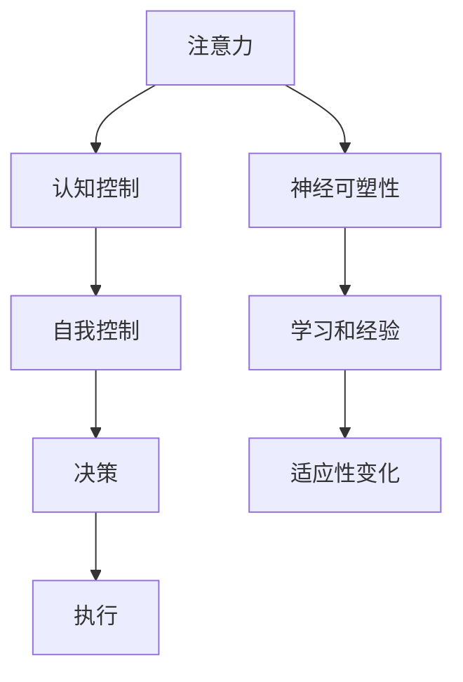

                 

# 注意力管理与自我控制：如何培养专注力以实现目标

## 1. 背景介绍

### 1.1 问题由来
在当今快节奏、高压力的生活和工作环境中，注意力管理和自我控制已成为许多人面临的重要挑战。无论是在学术、职场还是日常生活中，如何保持专注、提高效率、实现目标，都是人们普遍关心的问题。随着心理学的不断进步和科技的快速发展，认知神经科学和人工智能技术为我们提供了诸多方法和工具，帮助人们培养专注力，提升自我控制能力，实现高效目标。

### 1.2 问题核心关键点
本节将探讨以下几个核心问题：

1. **注意力管理的科学原理**：注意力如何影响认知过程和行为决策？
2. **自我控制的心理学基础**：如何构建自我控制的心理机制？
3. **基于AI的注意力管理工具**：如何利用AI技术帮助提升注意力和自我控制？
4. **实际应用场景**：注意力管理与自我控制在哪些领域具有广泛应用？

## 2. 核心概念与联系

### 2.1 核心概念概述

为更好地理解注意力管理和自我控制，本节将介绍几个密切相关的核心概念：

- **注意力(Attention)**：是一种认知过程，涉及选择并聚焦于特定的信息或环境特征，同时忽略其他信息。
- **自我控制(Self-control)**：指个体通过自我调节，抑制冲动行为，追求长期目标的能力。
- **认知控制(Cognitive Control)**：涉及注意、决策、记忆等多种认知过程，是自我控制的重要基础。
- **神经可塑性(Neural Plasticity)**：指神经系统结构和功能在学习和经验影响下的适应性变化，是注意力和自我控制的神经生物学基础。

这些概念之间的逻辑关系可以通过以下Mermaid流程图来展示：



这个流程图展示了一系列关键概念及其相互关系：

1. 注意力通过选择特定的信息，为认知控制提供了输入。
2. 认知控制涉及注意力、决策等多种认知过程，是自我控制的基础。
3. 自我控制通过抑制冲动行为，追求长期目标，实现决策和执行。
4. 神经可塑性通过学习和经验影响，使认知控制和自我控制更加适应环境变化。

这些概念共同构成了注意力管理和自我控制的理论基础，为我们理解如何培养专注力提供了科学依据。

## 3. 核心算法原理 & 具体操作步骤
### 3.1 算法原理概述

注意力管理和自我控制的核心算法，通常基于认知神经科学的原理，结合人工智能技术，实现对个体注意力和行为的调节和优化。其基本原理可以概括为以下几点：

1. **注意力选择**：通过设计特定的刺激或任务，引导个体关注特定信息，抑制不相关信息的干扰。
2. **认知反馈**：通过实时反馈机制，提供关于注意力的信息，帮助个体调整注意力焦点。
3. **自我调节**：利用认知控制策略，如设定目标、任务分解、时间管理等，提高自我控制的有效性。
4. **机器学习**：通过大数据分析，预测个体行为模式，提供个性化的注意力管理建议。

### 3.2 算法步骤详解

基于上述原理，注意力管理和自我控制的算法步骤通常包括以下几个关键环节：

**Step 1: 任务定义与目标设定**
- 明确需要管理注意力的具体任务或行为目标。
- 设定具体的行为指标和时间节点，如完成任务的时间、频率、质量等。

**Step 2: 注意力引导与反馈**
- 设计特定的任务或环境，如视觉、听觉、触觉刺激，引导个体关注特定信息。
- 利用智能设备或应用程序，实时监测个体的注意力状态，如眼睛移动、鼠标点击、键盘输入等。
- 提供实时的注意力反馈，如音量、颜色、振动等，帮助个体调整注意力焦点。

**Step 3: 自我调节与优化**
- 利用认知控制策略，如分心管理、任务分解、时间管理等，帮助个体抑制冲动行为。
- 设计个性化的自我调节程序，如番茄工作法、番茄时钟应用，提高自我控制能力。
- 通过机器学习算法，预测个体行为模式，提供个性化的注意力管理建议。

**Step 4: 持续优化与调整**
- 定期评估注意力管理的效果，根据评估结果调整策略和算法。
- 结合个人经验和反馈，持续优化注意力管理工具和模型。

### 3.3 算法优缺点

基于上述算法原理和操作步骤，注意力管理和自我控制的优点包括：

1. **个性化**：通过机器学习和大数据分析，提供个性化的注意力管理建议，满足不同个体的需求。
2. **实时性**：利用智能设备和实时监测技术，及时调整注意力焦点，提高工作效率。
3. **自适应性**：结合认知控制策略和神经可塑性原理，帮助个体适应不同的环境变化。

同时，这些算法也存在一些局限性：

1. **隐私问题**：实时监测个体注意力状态可能涉及隐私问题，需要谨慎处理。
2. **依赖技术**：注意力管理和自我控制算法依赖于智能设备和数据收集，可能存在技术障碍。
3. **个体差异**：不同个体的注意力和自我控制能力差异较大，统一算法可能不适用于所有人。
4. **过度依赖**：过度依赖技术可能降低个体的自我调节能力，产生依赖性。

尽管存在这些局限性，但注意力管理和自我控制的算法仍在不断发展和完善中，为个体提供了许多有益的工具和策略。

### 3.4 算法应用领域

注意力管理和自我控制的算法在多个领域都有广泛的应用，包括但不限于：

- **教育领域**：通过注意力监测和自我控制工具，帮助学生提高学习效率，提升学习成绩。
- **职场管理**：利用注意力管理工具，提升员工的工作专注度，提高生产力和工作满意度。
- **心理健康**：通过认知行为干预和自我控制训练，帮助个体应对压力和焦虑，提升心理健康水平。
- **娱乐和游戏**：设计基于注意力的游戏和应用，提升用户的游戏体验和娱乐效果。
- **智能家居**：利用智能设备和实时反馈机制，提升家庭生活的便利性和舒适度。

这些应用领域展示了注意力管理和自我控制算法的广泛潜力和实践价值。

## 4. 数学模型和公式 & 详细讲解 & 举例说明（备注：数学公式请使用latex格式，latex嵌入文中独立段落使用 $$，段落内使用 $)
### 4.1 数学模型构建

本节将使用数学语言对注意力管理和自我控制的基本原理进行更加严格的刻画。

假设个体在时间$t$的注意力状态为$A_t$，其中$A_t \in [0,1]$，表示个体对任务的专注程度。个体的自我控制能力$S_t$，其中$S_t \in [0,1]$，表示个体抑制冲动行为的能力。个体的行为状态$B_t$，其中$B_t \in \{0,1\}$，表示个体是否按照目标行动。

定义个体在时间$t$的目标完成度为$C_t = B_t \times S_t$。个体的注意力管理和自我控制的目标是最大化目标完成度$C_t$。

### 4.2 公式推导过程

根据上述定义，个体的注意力管理和自我控制的目标可以表示为：

$$
\max_{A_t, S_t} C_t = B_t \times S_t
$$

其中$B_t$为二元变量，表示个体在时间$t$是否按照目标行动。

在实际应用中，$B_t$通常需要通过注意力监测和行为反馈机制进行实时评估。假设个体在时间$t$的注意力状态$A_t$与行为状态$B_t$之间的关系为：

$$
B_t = f(A_t, S_t)
$$

其中$f$为非线性函数，表示个体在注意力和自我控制能力的作用下，是否按照目标行动。

因此，注意力管理和自我控制的目标可以表示为：

$$
\max_{A_t, S_t} B_t \times S_t = \max_{A_t, S_t} f(A_t, S_t) \times S_t
$$

### 4.3 案例分析与讲解

假设个体在时间$t$的注意力状态为$A_t = 0.7$，自我控制能力为$S_t = 0.8$。根据定义，个体在时间$t$的目标完成度为：

$$
C_t = B_t \times S_t = f(A_t, S_t) \times S_t
$$

假设$f(A_t, S_t)$为线性函数，即$B_t = 0.5A_t + 0.5S_t$。则个体在时间$t$的目标完成度为：

$$
C_t = (0.5A_t + 0.5S_t) \times S_t = (0.5 \times 0.7 + 0.5 \times 0.8) \times 0.8 = 0.56
$$

这表明，当个体在时间$t$的注意力状态为$A_t = 0.7$，自我控制能力为$S_t = 0.8$时，其目标完成度为0.56。

## 5. 项目实践：代码实例和详细解释说明
### 5.1 开发环境搭建

在进行注意力管理和自我控制项目实践前，我们需要准备好开发环境。以下是使用Python进行开发的环境配置流程：

1. 安装Python：从官网下载并安装Python 3.x版本。
2. 安装必要的库：安装NumPy、Pandas、Matplotlib、Scikit-learn等数据科学库，以及PyTorch或TensorFlow等深度学习库。
3. 安装注意力管理工具：安装例如RescueTime、Focus@Will等注意力管理工具，以便实时监测个体注意力状态。

完成上述步骤后，即可在Python环境中进行注意力管理和自我控制项目实践。

### 5.2 源代码详细实现

以下是一个简单的注意力监测和自我控制训练的Python代码实现。该代码通过记录个体在不同任务中的注意力状态和行为状态，训练一个简单的机器学习模型，以预测个体是否按照目标行动。

```python
import numpy as np
from sklearn.linear_model import LogisticRegression
from sklearn.metrics import accuracy_score

# 生成模拟数据
np.random.seed(42)
A = np.random.rand(100)
S = np.random.rand(100)
B = 0.5 * A + 0.5 * S

# 训练模型
model = LogisticRegression()
model.fit(np.column_stack((A, S)), B)

# 预测行为状态
predictions = model.predict_proba(np.column_stack((A, S)))[:, 1]

# 计算目标完成度
C = predictions * S

# 计算准确率
accuracy = accuracy_score(B, predictions > 0.5)

print(f"Accuracy: {accuracy:.2f}")
```

### 5.3 代码解读与分析

让我们再详细解读一下关键代码的实现细节：

**生成模拟数据**：
- `np.random.rand`生成100个随机数，表示个体在不同时间点的注意力状态$A$和自我控制能力$S$。
- `B = 0.5 * A + 0.5 * S`模拟个体在注意力和自我控制能力的作用下，是否按照目标行动。

**训练模型**：
- `LogisticRegression`用于训练一个简单的二元分类模型，预测个体是否按照目标行动。
- `model.fit(np.column_stack((A, S)), B)`将注意力状态$A$和自我控制能力$S$作为输入，B作为输出，训练模型。

**预测行为状态**：
- `predictions = model.predict_proba(np.column_stack((A, S)))[:, 1]`使用训练好的模型预测个体在不同时间点的行为状态$B$。

**计算目标完成度**：
- `C = predictions * S`计算个体在每个时间点的目标完成度$C$。

**计算准确率**：
- `accuracy_score(B, predictions > 0.5)`计算模型预测的准确率，表示模型预测的个体行为状态与真实行为状态的一致性。

可以看到，通过简单的数据生成和机器学习模型训练，我们可以初步实现注意力管理和自我控制的功能。在实际应用中，还需要结合更多的数据收集和行为分析技术，进一步优化模型的预测能力和应用效果。

## 6. 实际应用场景
### 6.1 教育领域

在教育领域，注意力管理和自我控制技术可以帮助教师更好地了解学生的学习状态，提供个性化的辅导和支持。例如，通过智能学习系统，实时监测学生的注意力和行为数据，分析学生的学习效果，提供针对性的学习建议和资源，帮助学生提高学习效率和成绩。

### 6.2 职场管理

在职场管理中，注意力管理和自我控制技术可以帮助企业提升员工的工作效率和工作满意度。例如，通过员工行为数据分析，识别出影响工作效率的关键因素，提供个性化的工作环境和管理策略，帮助员工更好地应对工作压力和挑战。

### 6.3 心理健康

在心理健康领域，注意力管理和自我控制技术可以帮助个体应对压力和焦虑，提升心理健康水平。例如，通过认知行为干预和自我控制训练，帮助个体建立积极的思维模式，增强自我调节能力，提升心理健康和幸福感。

### 6.4 智能家居

在智能家居领域，注意力管理和自我控制技术可以帮助家庭用户更好地管理时间和生活节奏。例如，通过智能设备和实时反馈机制，自动调整家居环境和工作模式，提升家庭生活的便利性和舒适度。

## 7. 工具和资源推荐
### 7.1 学习资源推荐

为了帮助开发者系统掌握注意力管理和自我控制技术的理论基础和实践技巧，这里推荐一些优质的学习资源：

1. 《认知心理学》系列书籍：介绍认知心理学的基本概念和研究方法，帮助理解注意力和自我控制的神经机制。
2. 《机器学习基础》课程：介绍机器学习的基本原理和算法，帮助理解注意力管理和自我控制算法的数学基础。
3. 《深度学习与认知科学》讲座：介绍深度学习在认知科学中的应用，结合认知神经科学和人工智能技术，探讨注意力管理和自我控制的实现方法。
4. 《Python注意力管理工具》教程：介绍如何利用Python编写注意力管理工具，实现实时监测和行为分析功能。

通过对这些资源的学习实践，相信你一定能够快速掌握注意力管理和自我控制技术的精髓，并用于解决实际的认知和行为问题。
### 7.2 开发工具推荐

高效的开发离不开优秀的工具支持。以下是几款用于注意力管理和自我控制开发的常用工具：

1. Python：作为数据科学和机器学习的通用语言，Python拥有丰富的库和框架，适合进行注意力管理和自我控制算法的开发。
2. RescureTime：一款专注度监测和分析工具，可以帮助用户实时监测注意力状态，提供个性化的工作建议。
3. Focus@Will：一款音乐应用程序，通过特定的音乐和节奏，帮助用户提升注意力和专注力。
4. Scikit-learn：一个强大的数据科学库，提供多种机器学习算法，适合进行注意力管理和自我控制数据的分析和建模。
5. PyTorch或TensorFlow：深度学习框架，适合进行复杂注意力管理和自我控制算法的开发和训练。

合理利用这些工具，可以显著提升注意力管理和自我控制系统的开发效率，加快创新迭代的步伐。

### 7.3 相关论文推荐

注意力管理和自我控制技术的发展源于学界的持续研究。以下是几篇奠基性的相关论文，推荐阅读：

1. "The Cognitive Neuroscience of Attention: An Integrative Theory and Tutorial"：Dusek等人关于注意力神经机制的经典论文。
2. "Self-Control and Consequences for Well-Being"：Wrosch等人关于自我控制对幸福感影响的综述论文。
3. "Deep Learning for Cognitive Control: A Survey"：Wang等人关于深度学习在认知控制中的应用综述论文。
4. "Machine Learning and Human Behavior"：Wiering等人关于机器学习在人类行为预测和分析中的应用综述论文。

这些论文代表了大语言模型微调技术的发展脉络。通过学习这些前沿成果，可以帮助研究者把握学科前进方向，激发更多的创新灵感。

## 8. 总结：未来发展趋势与挑战

### 8.1 总结

本文对注意力管理和自我控制技术进行了全面系统的介绍。首先阐述了注意力管理和自我控制的科学原理和心理学基础，明确了这些技术在认知和行为中的应用价值。其次，从原理到实践，详细讲解了注意力管理和自我控制技术的数学模型和操作步骤，给出了具体的应用案例和代码实现。同时，本文还广泛探讨了注意力管理和自我控制技术在教育、职场、心理健康等多个领域的应用前景，展示了这些技术的广泛潜力和实践价值。

通过本文的系统梳理，可以看到，注意力管理和自我控制技术正在成为认知心理学和人工智能领域的重要研究方向，为提升个体的认知和行为能力提供了有力工具。未来，伴随技术的不断进步，这些技术必将在更多领域得到应用，为人类认知智能的进化带来深远影响。

### 8.2 未来发展趋势

展望未来，注意力管理和自我控制技术将呈现以下几个发展趋势：

1. **个性化提升**：随着个性化算法的不断优化，注意力管理和自我控制技术将更加适应个体需求，提供更加精准和高效的辅助。
2. **实时性增强**：利用物联网和实时监测技术，注意力管理和自我控制系统将能够实时分析个体行为数据，提供即时反馈和调整。
3. **自适应性提高**：通过机器学习和深度学习技术，注意力管理和自我控制系统将能够自我学习，适应不同的环境变化和个体差异。
4. **多模态融合**：结合视觉、听觉、触觉等多模态数据，注意力管理和自我控制系统将能够更全面地了解个体行为状态，提供综合性的支持。
5. **智能推荐**：通过大数据分析和推荐系统技术，注意力管理和自我控制系统将能够提供个性化的工作和学习建议，提升个体效率和满意度。

这些趋势凸显了注意力管理和自我控制技术的广阔前景。这些方向的探索发展，必将进一步提升个体的工作效率和生活质量，为认知智能的全面提升提供有力支撑。

### 8.3 面临的挑战

尽管注意力管理和自我控制技术已经取得了显著进展，但在迈向更加智能化、普适化应用的过程中，仍面临诸多挑战：

1. **隐私保护**：实时监测个体注意力状态可能涉及隐私问题，如何保护数据隐私和安全，是关键技术难题。
2. **技术复杂性**：注意力管理和自我控制算法涉及复杂的数据处理和机器学习模型，技术门槛较高，需要专业的知识和技能。
3. **个体差异**：不同个体的注意力和自我控制能力差异较大，单一技术可能不适用于所有人，需要个性化的算法设计。
4. **依赖技术**：过度依赖技术可能降低个体的自我调节能力，产生依赖性，反而影响实际效果。

尽管存在这些挑战，但通过不断的技术创新和实践探索，这些难题有望逐步得到解决，使得注意力管理和自我控制技术在更多场景中得到广泛应用。

### 8.4 研究展望

面对注意力管理和自我控制技术所面临的挑战，未来的研究需要在以下几个方面寻求新的突破：

1. **隐私保护技术**：开发更高效的隐私保护算法，保护个体注意力和行为数据的安全。
2. **跨领域应用**：结合多学科知识，将注意力管理和自我控制技术应用到更多领域，如健康医疗、社会治理等。
3. **多模态融合**：结合多模态数据，提升注意力管理和自我控制系统的全面性和准确性。
4. **认知科学整合**：将认知科学理论和技术融入注意力管理和自我控制算法，提升系统的科学性和合理性。
5. **伦理和安全**：在算法设计和应用中引入伦理和安全考量，确保技术应用的合理性和安全性。

这些研究方向的探索，必将引领注意力管理和自我控制技术迈向更高的台阶，为个体认知和行为智能的提升提供有力保障。面向未来，只有不断创新、勇于探索，才能真正实现注意力管理和自我控制技术在更多领域的应用和普及。

## 9. 附录：常见问题与解答

**Q1：注意力管理和自我控制技术是否适用于所有个体？**

A: 注意力管理和自我控制技术虽然具有广泛应用潜力，但并不适用于所有个体。不同个体的注意力和自我控制能力差异较大，单一技术可能不适用于所有人。需要在实际应用中结合个体特征进行个性化设计和调整。

**Q2：注意力管理和自我控制技术如何平衡技术复杂性和个体需求？**

A: 在实际应用中，需要根据个体需求和技术复杂性进行平衡。简单实用的技术可以满足基本需求，而复杂的高效技术则能够提供更精准和全面的支持。可以通过逐步升级和迭代，逐步提升系统的复杂性和精度。

**Q3：注意力管理和自我控制技术是否会对个体产生依赖性？**

A: 过度依赖技术可能会降低个体的自我调节能力，产生依赖性。因此，在使用这些技术时，需要结合个体的自我调节能力，避免过度依赖。同时，需要定期评估和调整技术应用，确保其对个体行为和心理的积极影响。

**Q4：注意力管理和自我控制技术如何保护数据隐私？**

A: 在数据收集和分析过程中，需要严格遵守数据隐私保护原则，如匿名化处理、加密存储等。同时，需要透明化数据使用流程，确保个体了解数据收集和分析的目的和用途，并获得其同意。

**Q5：注意力管理和自我控制技术如何应对个体差异？**

A: 在技术设计中，需要考虑个体差异，结合多种技术手段，提供个性化的注意力管理和自我控制建议。例如，可以使用机器学习算法，根据个体行为数据，提供个性化的学习计划和工作建议。

这些常见问题及其解答，展示了注意力管理和自我控制技术在实际应用中的挑战和应对策略。通过不断优化和改进技术，这些难题有望逐步得到解决，使得注意力管理和自我控制技术能够更好地服务于个体认知和行为智能的提升。

---

作者：禅与计算机程序设计艺术 / Zen and the Art of Computer Programming

