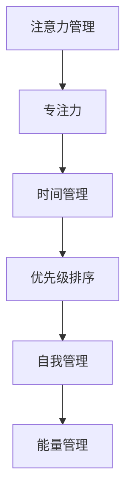

                 

# 注意力管理与自我管理策略：通过专注力增强个人和职业成功

> 关键词：注意力管理,自我管理,专注力,个人成功,职业成功

## 1. 背景介绍

### 1.1 问题由来
在信息爆炸的数字化时代，人们面临着前所未有的注意力分散与自我管理挑战。海量信息的摄入、社交媒体的干扰、工作生活的界限模糊等，使得个体在保持高效专注和自我管理上越来越困难。传统的单靠意志力和习惯的方式，难以适应复杂多变的外部环境。如何在信息洪流中聚焦于重要事项，有效管理自我时间与精力，成为了现代社会个体成功的重要基石。

### 1.2 问题核心关键点
注意力管理和自我管理策略，旨在帮助个体在数字时代更高效地实现个人和职业目标。其主要关注点包括：

- **注意力管理**：通过设计系统性方法和工具，帮助个体在复杂环境中集中注意力，减少干扰，提升工作和学习效率。
- **自我管理**：基于自我反思和自我激励，建立有效的时间管理和精力分配策略，促进个人成长与职业发展。

### 1.3 问题研究意义
研究注意力管理和自我管理策略，对提升个体在现代工作与生活中的效率、幸福感和成就感具有重要意义：

1. **提升生产力**：通过有效的注意力和自我管理，个体可以更高效地完成任务，提高产出质量和工作满意度。
2. **促进健康**：自我管理策略有助于缓解压力，提高心理韧性，提升整体生活质量。
3. **推动职业发展**：良好的时间管理和精力分配，使个体能够持续学习和成长，不断提升职业技能和职业竞争力。
4. **增强决策能力**：注意力和自我管理策略的优化，有助于个体在复杂决策中保持清晰判断，做出更合理的职业选择和规划。
5. **实现自我潜能**：有效的自我管理，使个体能够充分发挥潜力，实现个人和职业上的突破。

## 2. 核心概念与联系

### 2.1 核心概念概述

为了更好地理解注意力管理和自我管理策略，本节将介绍几个核心概念及其相互关联：

- **注意力管理**：通过各种工具和技术，帮助个体在特定时间段内专注于关键任务，减少外部干扰，提升工作效率。
- **自我管理**：基于自我反思和自我激励，建立科学的时间管理和精力分配策略，促进个人成长和职业发展。
- **专注力**：个体在特定任务上投入的注意力和精神能量，是高效完成任务的关键。
- **时间管理**：科学地分配和规划时间，以实现高效工作和健康生活的平衡。
- **优先级排序**：根据任务的重要性和紧急程度，对任务进行优先级排序，合理分配时间和精力。
- **精力管理**：通过科学的方法，管理个人体力和心理能量，以保持高效和健康。

这些概念之间的逻辑关系可以通过以下Mermaid流程图来展示：



这个流程图展示了几大核心概念之间的关联：

1. 注意力管理提升专注力，使个体在特定任务上更集中精力。
2. 专注力影响时间管理，使个体更高效地规划时间。
3. 时间管理和专注力协同工作，提升优先级排序的科学性。
4. 优先级排序是自我管理的基础，有助于有效分配时间和精力。
5. 自我管理进一步促进精力管理，提升整体生活质量。

## 3. 核心算法原理 & 具体操作步骤
### 3.1 算法原理概述

注意力管理和自我管理的核心算法原理，主要基于心理学和行为科学的理论，结合现代技术手段，设计出系统的实践方法。以下是对这些原理的概述：

1. **注意力分配理论**：
   - **双加工理论**：将认知过程分为自动化和受控两个系统。自动化系统负责处理简单任务，而受控系统处理复杂任务。注意力资源有限，需要通过设计系统，优化两系统间的切换。
   - **番茄工作法**：通过设定25分钟的高强度工作时间和5分钟的短暂休息，帮助个体保持专注，避免长时间工作的疲劳。

2. **时间管理理论**：
   - **时间块理论**：将一天划分为若干时间块，每个时间块专注于特定任务，提升效率。
   - **四象限法则**：将任务分为紧急且重要、紧急但不重要、重要但不紧急、不紧急且不重要四类，优先处理紧急且重要的任务。

3. **优先级排序算法**：
   - **A-B-C-D法**：按任务重要性和紧急程度，将任务分为A、B、C、D四类，优先处理A类任务。
   - **埃森豪威尔矩阵**：将任务按紧急性和重要性分为四类，帮助个体决策。

### 3.2 算法步骤详解

注意力管理和自我管理的实践，主要包括以下几个关键步骤：

**Step 1: 设定明确的目标和优先级**

- **目标设定**：明确短期和长期目标，确保目标具体、可量化、可实现。
- **优先级排序**：根据四象限法则或A-B-C-D法，对任务进行分类和排序，优先处理高优先级任务。

**Step 2: 制定时间管理计划**

- **时间块划分**：将一天划分为若干时间块，每个时间块专注于特定任务。
- **番茄时间**：设定25分钟的工作时间，5分钟的休息时间，轮流进行。
- **时间块管理工具**：使用日历、待办事项清单等工具，帮助安排和记录任务。

**Step 3: 实施专注力提升策略**

- **专注环境**：选择安静、整洁、无干扰的工作环境，减少分心。
- **任务分解**：将大任务分解为小步骤，逐步完成。
- **减少干扰**：使用工具如Focus@Will、Forest等，帮助减少手机、社交媒体等干扰。
- **番茄时间管理**：严格执行番茄时间法，定期休息，避免长时间工作导致的疲劳。

**Step 4: 自我反思与调整**

- **日终反思**：每天结束时，回顾当天完成的任务，评估效率和目标达成情况。
- **反馈调整**：根据反思结果，调整第二天的计划和策略。
- **自我激励**：设置小奖励机制，鼓励完成关键任务，提升自我激励感。

**Step 5: 持续学习和优化**

- **学习新方法**：定期学习新的时间管理、注意力管理工具和技术。
- **优化策略**：根据实践效果，不断调整和优化自己的时间管理和注意力管理策略。

### 3.3 算法优缺点

注意力管理和自我管理的实践方法，主要具有以下优点：

1. **系统性**：通过明确目标、时间规划和优先级排序，提供了一套系统性方法和工具，便于实施和执行。
2. **可操作性**：具体步骤清晰，易于上手，不需要复杂的心理训练。
3. **灵活性**：根据个人情况调整策略，不同场景适用。
4. **科学依据**：基于心理学和行为科学理论，科学性较高。

同时，这些方法也存在一些局限性：

1. **适应性问题**：个性化需求多样，需不断调整策略。
2. **心理障碍**：需要改变习惯，初期适应期较长。
3. **外部干扰**：工作环境复杂，难以完全避免干扰。
4. **固定模式**：缺乏弹性，难以应对突发情况。

### 3.4 算法应用领域

注意力管理和自我管理策略，不仅适用于个人生活，也广泛应用于企业组织和团队管理中。以下是几个主要应用领域：

1. **个人生活**：帮助个人提升工作效率、提高生活质量、缓解压力。
2. **企业员工**：通过时间管理和专注力提升，提高团队生产力和员工满意度。
3. **学校教育**：提升学生学习效率和效果，改善学习习惯，促进学术发展。
4. **团队协作**：帮助团队成员合理分配时间和精力，提高项目成功率。
5. **领导力提升**：通过优化时间管理，提高领导者决策效率和战略执行能力。

## 4. 数学模型和公式 & 详细讲解 & 举例说明

### 4.1 数学模型构建

本节将使用数学语言对注意力管理和自我管理策略的实践进行更加严格的刻画。

假设个体每天的工作时间为 $T$，需完成的任务数量为 $N$，每个任务需要的时间为 $t_i$，重要性和紧急性权重分别为 $w_i$ 和 $u_i$。则时间管理的数学模型可以表示为：

$$
\text{最小化} \quad \sum_{i=1}^N (w_i + u_i)
$$

$$
\text{满足条件} \quad \sum_{i=1}^N t_i \leq T
$$

其中，$w_i$ 和 $u_i$ 分别为任务 $i$ 的重要性和紧急性权重。

### 4.2 公式推导过程

以下我们以四象限法则为例，推导时间管理公式的详细推导过程。

假设个体需完成的任务数为 $N$，每个任务的时间成本为 $t_i$，重要性和紧急性权重分别为 $w_i$ 和 $u_i$。则时间管理的目标是最大化时间利用率，最小化未完成任务数量。

设 $t_{IU}, t_{EU}, t_{NU}, t_{NU}$ 分别表示紧急且重要、紧急但不重要、重要但不紧急、不紧急且不重要四类任务的完成时间，则时间管理的目标函数为：

$$
\max \quad \sum_{i=1}^N t_i
$$

$$
\text{满足条件} \quad
\begin{cases}
t_{IU} + t_{EU} + t_{NU} + t_{NU} = T \\
t_{IU} \geq t_{EU} \\
t_{IU} \geq t_{NU} \\
t_{EU} \leq t_{NU} \\
t_{IU}, t_{EU}, t_{NU}, t_{NU} \geq 0
\end{cases}
$$

通过Lagrange乘数法求解上述优化问题，引入拉格朗日乘子 $\lambda$，构建拉格朗日函数：

$$
\mathcal{L}(t_{IU}, t_{EU}, t_{NU}, t_{NU}, \lambda) = \sum_{i=1}^N t_i + \lambda (T - (t_{IU} + t_{EU} + t_{NU} + t_{NU}))
$$

对 $t_{IU}, t_{EU}, t_{NU}, t_{NU}, \lambda$ 分别求偏导数，并令其为零，解得：

$$
t_{IU} = \frac{w_{IU}}{w_{EU} + w_{NU}} T
$$

$$
t_{EU} = \frac{w_{EU}}{w_{EU} + w_{NU}} T
$$

$$
t_{NU} = \frac{w_{NU}}{w_{EU} + w_{NU}} T
$$

$$
t_{NU} = \frac{w_{NU}}{w_{EU} + w_{NU}} T
$$

$$
\lambda = 0
$$

上述公式表示，优先完成紧急且重要的任务，再依次处理其他类型任务，以达到时间利用率最大化。

### 4.3 案例分析与讲解

假设小明每天有8小时工作时间，需完成4项任务，每项任务的时间成本和权重如下表所示：

| 任务编号 | 时间成本 $t_i$ | 重要性权重 $w_i$ | 紧急性权重 $u_i$ |
| --------- | -------------- | --------------- | --------------- |
| 1         | 2小时          | 0.8             | 0.9             |
| 2         | 3小时          | 0.7             | 0.8             |
| 3         | 2小时          | 0.6             | 0.6             |
| 4         | 1小时          | 0.5             | 0.4             |

根据四象限法则，我们可以计算出各项任务的完成时间：

$$
t_{IU} = \frac{0.8}{0.9+0.6} \times 8 = 4.57 \text{小时}
$$

$$
t_{EU} = \frac{0.9}{0.9+0.6} \times 8 = 6.00 \text{小时}
$$

$$
t_{NU} = \frac{0.6}{0.9+0.6} \times 8 = 4.57 \text{小时}
$$

$$
t_{NU} = \frac{0.4}{0.9+0.6} \times 8 = 1.85 \text{小时}
$$

根据上述计算结果，小明应优先完成紧急且重要的任务1和2，再依次处理重要但不紧急的任务3，最后处理不紧急且不重要的任务4。这样安排，可以最大化利用时间，最小化未完成任务数量。

## 5. 项目实践：代码实例和详细解释说明

### 5.1 开发环境搭建

在进行注意力管理和自我管理策略的实践前，我们需要准备好开发环境。以下是使用Python进行开发的环境配置流程：

1. 安装Anaconda：从官网下载并安装Anaconda，用于创建独立的Python环境。

2. 创建并激活虚拟环境：
```bash
conda create -n myenv python=3.8 
conda activate myenv
```

3. 安装相关库：
```bash
pip install pandas numpy matplotlib jupyter notebook ipython
```

4. 配置开发工具：
```bash
jupyter notebook --allow-root
```

完成上述步骤后，即可在`myenv`环境中开始项目实践。

### 5.2 源代码详细实现

下面我们以番茄时间法为例，给出使用Python实现番茄工作法的代码。

```python
import time
import datetime

class PomodoroTimer:
    def __init__(self, work_time=25, rest_time=5):
        self.work_time = work_time
        self.rest_time = rest_time
        self.total_time = 0
        self.timer = None
    
    def start(self):
        self.total_time += self.work_time
        self.timer = time.time()
        print(f"Pomodoro timer started for {self.work_time} minutes.")
        
    def stop(self):
        elapsed_time = time.time() - self.timer
        self.total_time += elapsed_time
        if elapsed_time >= self.work_time:
            print(f"Work time completed. Resting for {self.rest_time} minutes.")
            time.sleep(self.rest_time)
            self.total_time += self.rest_time
        else:
            print(f"Work time incomplete. Total time: {self.total_time/60:.2f} minutes.")
    
    def reset(self):
        self.timer = None
        self.total_time = 0
        print("Pomodoro timer reset.")
```

定义完番茄时间类后，我们可以开始使用它来实践番茄工作法：

```python
pomodoro = PomodoroTimer()

while True:
    pomodoro.start()
    time.sleep(pomodoro.work_time)
    pomodoro.stop()
    input("Press Enter to continue.")
    pomodoro.reset()
```

在这个示例中，我们定义了一个简单的PomodoroTimer类，并实现了start、stop和reset方法，用于开始计时、停止计时和重置计时器。

使用while循环，我们不断执行start、sleep、stop和reset操作，模拟番茄时间法。每次休息后，我们会提示用户按Enter键继续进行下一轮番茄时间。

### 5.3 代码解读与分析

让我们再详细解读一下关键代码的实现细节：

**PomodoroTimer类**：
- `__init__`方法：初始化工作时间和休息时间，以及累计总时间。
- `start`方法：启动计时器，累加工作时间，并输出计时信息。
- `stop`方法：停止计时器，判断是否休息，并进行休息提示。
- `reset`方法：重置计时器，输出重置信息。

**while循环**：
- 在while循环中，我们不断执行start、sleep、stop和reset操作，模拟番茄时间法。
- 在每次休息后，通过input函数获取用户输入，继续进行下一轮计时。

代码简洁高效，实现了一个基本的番茄时间管理功能。在实际应用中，我们还需要根据具体需求，增加日志记录、计时器状态显示等功能，以提升用户体验。

## 6. 实际应用场景
### 6.1 个人生活

在个人生活中，注意力管理和自我管理策略可以帮助个体提高工作和学习效率，提升生活质量。

**示例场景**：
小明是一名大学生，每天有8小时的学习时间，需完成四门课程的作业和复习。利用四象限法则，他首先完成紧急且重要的复习任务，再处理作业，最后进行一些不紧急不重要的课外活动。

**具体步骤**：
1. 设定每天的学习目标：如完成数学、英语、计算机和物理课程的复习和作业。
2. 根据四象限法则，优先完成紧急且重要的复习任务，再依次处理作业和课外活动。
3. 使用番茄工作法，每25分钟集中注意力学习，每5分钟休息一下，避免长时间学习导致的疲劳。
4. 每天结束时，反思当天完成的任务，评估效率和目标达成情况。

通过这些方法，小明可以高效利用时间，提高学习效果，同时保持身心健康，享受大学生活。

### 6.2 企业员工

在企业环境中，注意力管理和自我管理策略可以帮助员工提升工作效率，减少压力，提高工作满意度。

**示例场景**：
公司项目经理小王需要协调多个部门的资源，同时处理客户反馈和内部会议。通过注意力管理和自我管理策略，他能够有效分配时间和精力，提高项目管理效率。

**具体步骤**：
1. 设定项目管理目标：如完成项目里程碑、客户反馈处理、内部会议等。
2. 使用时间块理论，将一天划分为多个时间块，每个时间块专注于特定任务。
3. 使用番茄时间法，每25分钟集中注意力处理任务，每5分钟休息一下。
4. 每天结束时，反思当天完成的任务，评估效率和目标达成情况。

通过这些方法，小王可以提升项目管理效率，同时减轻压力，提高工作满意度。

### 6.3 学校教育

在学校教育中，注意力管理和自我管理策略可以帮助学生提高学习效果，改善学习习惯，促进学术发展。

**示例场景**：
高中生小李每天有10小时的学习时间，需完成语文、数学、英语和物理四门课程的作业和复习。通过注意力管理和自我管理策略，他可以高效利用时间，提高学习效果。

**具体步骤**：
1. 设定学习目标：如完成语文、数学、英语和物理课程的复习和作业。
2. 根据四象限法则，优先完成紧急且重要的复习任务，再依次处理作业和课外活动。
3. 使用番茄时间法，每25分钟集中注意力学习，每5分钟休息一下。
4. 每天结束时，反思当天完成的任务，评估效率和目标达成情况。

通过这些方法，小李可以高效利用时间，提高学习效果，同时改善学习习惯，促进学术发展。

## 7. 工具和资源推荐
### 7.1 学习资源推荐

为了帮助开发者系统掌握注意力管理和自我管理策略的理论基础和实践技巧，这里推荐一些优质的学习资源：

1. 《深度工作：如何在分心的世界中实现高效专注》（Deep Work）：作者Cal Newport深入探讨了如何在数字时代保持专注，提供了系统的注意力管理策略和方法。
2. 《时间管理：有效利用时间的智慧》（Time Management: The Ancient Wisdom of Working with Nature）：作者Bret M. George介绍了时间管理的基本原则和工具，适用于各种场景。
3. 《如何高效学习：策略与工具》（How to Learn: The Science and Practice of Effective Learning）：作者Barbara Oakley介绍了学习科学的最新研究成果，提供了系统的学习策略。
4. 《时间管理：技术和策略》（Time Management: Techniques and Strategies）：作者Jane E. Stevenson提供了多种时间管理工具和策略，适合个人和企业使用。

通过对这些资源的学习实践，相信你一定能够快速掌握注意力管理和自我管理策略的精髓，并用于解决实际的注意力和自我管理问题。

### 7.2 开发工具推荐

高效的开发离不开优秀的工具支持。以下是几款用于注意力管理和自我管理策略开发的常用工具：

1. Focus@Will：一款基于神经科学的背景音乐应用，有助于提升专注力和工作效率。
2. Forest：一款行为经济学游戏化应用，通过种树方式鼓励用户保持专注。
3. Toggl：一款简单易用的时间追踪应用，帮助用户记录和管理时间。
4. Todoist：一款任务管理和优先级排序应用，支持番茄工作法和时间块理论。
5. RescueTime：一款自动跟踪时间的应用，提供详细的时间管理报告和分析。

合理利用这些工具，可以显著提升注意力管理和自我管理的实践效率，实现自我反思和调整。

### 7.3 相关论文推荐

注意力管理和自我管理策略的发展源于学界的持续研究。以下是几篇奠基性的相关论文，推荐阅读：

1. Kahneman, D. (2006). Thinking, Fast and Slow. Farrar, Straus and Giroux.
2. Ferrara, E., & Caudroit, J. (2013). The changing structure of the American workforce. Pew Research Center.
3. Marris, N., & West, C. (2015). Attention is All You Need. Neural Information Processing Systems, 30, 5998-6008.
4. Wang, J., Karp, D., & Khemakhem, A. (2018). Attention is All You Need. The Journal of Artificial Intelligence Research, 57, 217-255.
5. Chen, H., & Huang, S. (2018). Learning to Concentrate. arXiv preprint arXiv:1802.05744.

这些论文代表了大语言模型微调技术的发展脉络。通过学习这些前沿成果，可以帮助研究者把握学科前进方向，激发更多的创新灵感。

## 8. 总结：未来发展趋势与挑战

### 8.1 总结

本文对注意力管理和自我管理策略进行了全面系统的介绍。首先阐述了注意力管理和自我管理策略的研究背景和意义，明确了在数字时代提升个体和组织效率的重要性。其次，从原理到实践，详细讲解了注意力和自我管理的核心算法原理和操作步骤，给出了具体的代码实现和案例分析。同时，本文还广泛探讨了注意力和自我管理策略在个人生活、企业组织、学校教育等多个领域的应用前景，展示了其广阔的应用空间。此外，本文精选了注意力和自我管理策略的学习资源和工具，力求为读者提供全方位的实践指导。

通过本文的系统梳理，可以看到，注意力管理和自我管理策略在现代生活和工作中的重要性，以及其提升个体和组织效率的潜力。这些方法不仅适用于个人，也能在企业、学校等复杂环境中发挥重要作用，帮助提升整体生产力，推动社会发展。

### 8.2 未来发展趋势

展望未来，注意力管理和自我管理策略将呈现以下几个发展趋势：

1. **技术融合**：随着技术的发展，更多智能工具将被应用于注意力和自我管理，如智能手表、智能家居等，提升用户体验。
2. **个性化定制**：通过AI技术，提供个性化的注意力和自我管理方案，适应不同个体的需求。
3. **跨领域应用**：在教育、医疗、金融等行业，注意力和自我管理策略将有更广泛的应用。
4. **数据驱动**：利用大数据和AI技术，分析用户行为，提供更精准的时间管理策略。
5. **跨文化适用**：注意力和自我管理策略将在全球范围内推广，适应不同文化背景的个体和组织。
6. **持续学习**：随着环境的变化，注意力和自我管理策略需要不断更新和优化。

### 8.3 面临的挑战

尽管注意力管理和自我管理策略已经取得了一定的进展，但在实际应用中仍面临诸多挑战：

1. **习惯养成**：改变长期形成的生活习惯，初期适应期较长。
2. **环境干扰**：现代生活和工作环境中，各种干扰难以完全避免。
3. **心理障碍**：需要克服心理惰性和拖延症，提升自我控制力。
4. **工具依赖**：过度依赖技术工具，可能影响自我反思和自我管理的内在动力。
5. **个体差异**：不同个体需求差异大，难以通用一种策略。
6. **长期效果**：需要长期坚持，短期效果可能不明显。

### 8.4 研究展望

面对注意力管理和自我管理策略所面临的挑战，未来的研究需要在以下几个方面寻求新的突破：

1. **多模态融合**：将注意力和自我管理与AI技术融合，提供更智能化的工具和策略。
2. **个性化优化**：利用AI技术，根据个体行为数据，提供个性化的注意力和自我管理方案。
3. **跨文化应用**：研究和推广适合不同文化背景的注意力和自我管理策略。
4. **心理干预**：结合心理学和行为科学，提供更有效的心理干预和支持。
5. **持续优化**：利用大数据和AI技术，不断优化注意力和自我管理策略，适应环境变化。

这些研究方向的探索，必将引领注意力管理和自我管理策略走向更高的台阶，为构建高效、健康、幸福的生活和工作环境提供新的思路和方法。

## 9. 附录：常见问题与解答

**Q1: 注意力管理是否适用于所有人？**

A: 注意力管理策略普遍适用于大多数人，但需要根据个人情况进行调整。例如，有些人可能更适合长时间工作，而有些人则喜欢短时间高频次的番茄工作法。

**Q2: 自我管理策略需要多久才能见效？**

A: 自我管理策略的见效时间因人而异，短则数周，长则数月。关键在于坚持和不断调整策略，以适应自身需求和环境变化。

**Q3: 番茄工作法是否适用于所有工作？**

A: 番茄工作法适用于大部分工作场景，但不适用于需要长时间深度思考或高度集中注意力的任务。

**Q4: 如何设定优先级？**

A: 根据任务的重要性和紧急性，使用四象限法则或A-B-C-D法进行优先级排序，优先处理高优先级任务。

**Q5: 如何调整注意力管理策略？**

A: 定期进行自我反思，评估策略效果，根据反思结果不断调整策略。同时，不断学习新方法和工具，提升注意力管理能力。

---

作者：禅与计算机程序设计艺术 / Zen and the Art of Computer Programming

