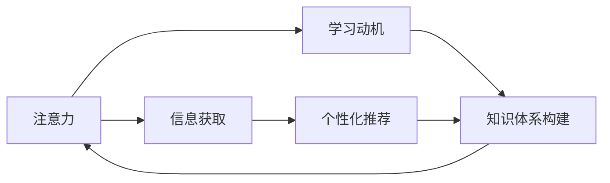
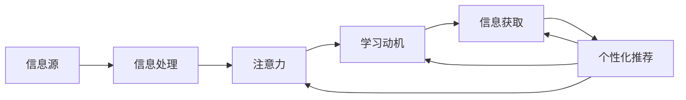

                 

# 注意力经济与个人学习动机的变化

## 1. 背景介绍

在互联网时代，信息的海量爆炸使得人们面临前所未有的信息过载问题。如何从浩如烟海的信息中筛选出对自己有价值的内容，成为了人们关注的焦点。因此，“注意力经济”的概念应运而生，指的是在信息过载的现代社会中，如何通过获取、分配和交换注意力资源，实现经济价值的创造和增值。而在这背后，个人的学习动机、信息获取方式以及知识体系构建方式也在发生深刻的变化。

### 1.1 信息过载与注意力经济

信息过载（Information Overload）是指在一个特定的时间段内，个人或系统面临的信息量超出了其处理能力，从而导致信息处理效率低下，甚至造成信息障碍的现象。信息过载主要表现在以下几个方面：

- **数据量剧增**：随着数字技术和社交媒体的发展，人们每天接触到的新闻、视频、图片等各类信息数量呈指数级增长。
- **信息碎片化**：短消息、短视频、微博等新兴媒体形式使信息更趋碎片化，用户需要花费更多时间和精力来筛选和整合信息。
- **注意力分散**：多元化的信息渠道使人们的注意力更加分散，难以集中于某一类信息的深度学习。

“注意力经济”则是指在信息过载的环境中，通过合理分配和使用注意力资源，以实现经济价值的创造和增值。具体来说，它涉及以下几个方面：

- **注意力获取**：吸引用户注意力的方式，如内容的创新性、互动性、时效性等。
- **注意力保持**：维持用户注意力的策略，如内容的连贯性、情感共鸣等。
- **注意力转换**：用户在不同的信息渠道间切换时的注意力管理和维护。

### 1.2 个人学习动机与信息获取方式的变化

在信息过载的时代，个人的学习动机和信息获取方式也在发生显著变化。具体表现为：

- **浅层学习**：由于信息过载，个人更倾向于选择浅层、碎片化的学习方式，如浏览新闻、观看短视频等，而不是深入阅读长篇文章。
- **即时获取**：为了应对生活节奏的加快，个人更追求信息获取的即时性，希望通过搜索引擎、社交媒体等渠道迅速获得所需信息。
- **个性化推荐**：通过个性化推荐算法，个人能够更高效地获取与自身兴趣和需求相匹配的信息，减少筛选成本。

## 2. 核心概念与联系

### 2.1 核心概念概述

为了更好地理解注意力经济与个人学习动机变化之间的关系，本文将介绍几个核心概念：

- **注意力**：是指用户在特定时间段内对特定信息或活动的集中注意。
- **学习动机**：是指驱动个体进行学习行为的内在动力，包括好奇心、求知欲、自我提升等。
- **信息获取**：是指个体通过各种方式获取信息的途径，包括主动搜索、订阅、社交网络等。
- **个性化推荐**：是指根据用户的历史行为和兴趣，推荐个性化的信息，提高用户满意度和信息利用效率。
- **知识体系构建**：是指个体通过学习、实践等方式，构建自己的知识结构，形成系统化的知识体系。

这些核心概念之间的逻辑关系可以通过以下Mermaid流程图来展示：



这个流程图展示出注意力、学习动机、信息获取、个性化推荐和知识体系构建之间的关系：

1. 注意力通过信息获取被触发，个性化推荐进一步增强信息的吸引力和相关性。
2. 学习动机驱动个体获取信息并进行深度学习，最终构建知识体系。
3. 知识体系的构建又反过来增强个体的学习动机和注意力分配。

### 2.2 核心概念原理和架构的 Mermaid 流程图



## 3. 核心算法原理 & 具体操作步骤

### 3.1 算法原理概述

注意力经济与个人学习动机变化的分析主要涉及注意力机制、推荐系统、学习理论等多个领域。其中，推荐系统是实现个性化信息获取的重要手段，其核心原理基于协同过滤、内容推荐、混合推荐等算法。

推荐系统通过用户的历史行为和兴趣特征，预测用户可能感兴趣的新信息。其关键步骤包括：

1. **用户画像构建**：收集用户的历史行为数据（如浏览记录、搜索记录、社交互动等），构建用户画像，表示用户的兴趣和偏好。
2. **信息特征提取**：对信息（如文章、视频、图片等）进行特征提取，表示其属性和内容。
3. **相似度计算**：计算用户画像和信息特征之间的相似度，根据相似度进行排序和推荐。

### 3.2 算法步骤详解

以协同过滤算法为例，其基本步骤如下：

1. **数据准备**：收集用户与信息的交互数据，构建用户-物品矩阵。
2. **相似度计算**：计算用户之间的相似度，可以采用余弦相似度、皮尔逊相关系数等方法。
3. **预测评分**：根据相似度，预测用户对信息的评分，计算方法是将用户的历史评分与相似用户的历史评分进行加权平均。
4. **推荐排序**：根据预测评分，对信息进行排序，推荐用户可能感兴趣的信息。

协同过滤算法的关键在于相似度计算和评分预测，这些步骤需要考虑数据稀疏性和冷启动问题，可以通过基于矩阵分解的算法（如SVD）来解决。

### 3.3 算法优缺点

协同过滤算法的主要优点包括：

- **适应性强**：能够处理稀疏和稠密的数据，不需要预先设定标签。
- **灵活性高**：适用于多种类型的推荐系统，如基于用户的协同过滤、基于物品的协同过滤等。

其主要缺点包括：

- **数据稀疏性**：用户与信息的交互数据稀疏，难以进行准确的相似度计算。
- **冷启动问题**：新用户或新物品缺乏足够的历史数据，难以进行有效推荐。
- **性能瓶颈**：随着用户和信息的增多，矩阵分解的计算复杂度较高，需要高效的算法和硬件支持。

### 3.4 算法应用领域

协同过滤算法在多个领域中得到广泛应用，如电子商务、新闻推荐、音乐推荐等。通过协同过滤，用户可以发现与自己兴趣相投的内容，商家可以精准推送商品，媒体平台可以提供个性化的新闻和视频。

## 4. 数学模型和公式 & 详细讲解 & 举例说明

### 4.1 数学模型构建

推荐系统的数学模型通常可以表示为：

$$
\hat{y}_{ui} = b + \sum_{j=1}^n \theta_{ij} x_{uj}
$$

其中，$y_{ui}$ 表示用户 $u$ 对物品 $i$ 的评分，$x_{uj}$ 表示用户 $u$ 对物品 $j$ 的评分，$\theta_{ij}$ 表示物品 $i$ 和物品 $j$ 的相似度，$b$ 是截距项，$n$ 是物品数量。

### 4.2 公式推导过程

以基于用户-物品矩阵的协同过滤算法为例，推导如下：

1. **用户画像构建**：将用户 $u$ 与物品 $i$ 的交互数据表示为用户-物品矩阵 $A$：

$$
A_{ui} = 1, \text{如果用户} u \text{对物品} i \text{有过评价}
$$

2. **相似度计算**：计算用户 $u$ 与物品 $i$ 的相似度 $s_{ui}$，可以采用余弦相似度方法：

$$
s_{ui} = \frac{\sum_{j=1}^n A_{uj}A_{ji}}{\sqrt{\sum_{j=1}^n A_{uj}^2}\sqrt{\sum_{j=1}^n A_{ji}^2}}
$$

3. **预测评分**：根据相似度 $s_{ui}$，预测用户 $u$ 对物品 $i$ 的评分 $\hat{y}_{ui}$：

$$
\hat{y}_{ui} = \sum_{j=1}^n \frac{A_{uj}}{\sqrt{\sum_{j=1}^n A_{uj}^2}} s_{uj} = \sum_{j=1}^n \frac{A_{uj}}{\sqrt{\sum_{j=1}^n A_{uj}^2}} \frac{\sum_{j=1}^n A_{uj}A_{ji}}{\sqrt{\sum_{j=1}^n A_{uj}^2}\sqrt{\sum_{j=1}^n A_{ji}^2}}
$$

4. **推荐排序**：将预测评分 $\hat{y}_{ui}$ 进行排序，推荐评分最高的物品给用户 $u$。

### 4.3 案例分析与讲解

假设某电商平台收集了用户对商品的历史评分数据，构建了用户-物品矩阵 $A$。用户 $u$ 对物品 $i$ 的评分可以表示为：

$$
y_{ui} = b + \sum_{j=1}^n \theta_{ij} x_{uj}
$$

其中 $b$ 为截距项，$\theta_{ij}$ 表示物品 $i$ 和物品 $j$ 的相似度，$x_{uj}$ 表示用户 $u$ 对物品 $j$ 的评分。通过对相似度进行计算和评分预测，可以实现对用户 $u$ 的个性化推荐。

## 5. 项目实践：代码实例和详细解释说明

### 5.1 开发环境搭建

在实际开发推荐系统时，需要使用Python、TensorFlow或PyTorch等深度学习框架。首先需要安装这些框架，并搭建开发环境：

```bash
pip install tensorflow==2.7.0
pip install torch==1.9.0
pip install sklearn==0.24.2
```

### 5.2 源代码详细实现

以下是一个使用TensorFlow实现协同过滤算法的代码示例：

```python
import tensorflow as tf
import numpy as np

# 构建用户-物品矩阵
A = np.random.randint(2, size=(1000, 1000))

# 计算用户-物品相似度矩阵
S = np.dot(A.T, A) / (np.sqrt(np.sum(A**2, axis=1)) * np.sqrt(np.sum(A**2, axis=0)))

# 定义模型参数
b = tf.Variable(tf.zeros([1000]))
theta = tf.Variable(tf.zeros([1000, 1000]))

# 定义损失函数
def loss(A, b, theta):
    y_pred = tf.reduce_sum(S * theta, axis=1) + b
    y_true = A
    return tf.reduce_mean(tf.square(y_pred - y_true))

# 定义优化器
optimizer = tf.optimizers.Adam()

# 训练模型
for i in range(1000):
    with tf.GradientTape() as tape:
        loss_value = loss(A, b, theta)
    grads = tape.gradient(loss_value, [b, theta])
    optimizer.apply_gradients(zip(grads, [b, theta]))

# 预测评分
y_pred = np.dot(S, theta) + b
```

### 5.3 代码解读与分析

在上述代码中，我们首先构建了一个用户-物品矩阵 $A$，并计算了用户-物品相似度矩阵 $S$。然后定义了模型的参数 $b$ 和 $\theta$，以及损失函数和优化器。通过反向传播算法，最小化损失函数，更新模型参数。最后，使用训练好的模型对新物品进行评分预测。

## 6. 实际应用场景

### 6.1 个性化推荐系统

个性化推荐系统是推荐系统的重要应用场景，旨在根据用户的兴趣和行为，推荐符合其需求的商品、新闻、视频等。以下是一个基于协同过滤算法的个性化推荐系统的应用示例：

某电子商务网站收集了用户对商品的浏览和购买历史数据，构建了用户-物品矩阵 $A$。通过协同过滤算法，计算用户 $u$ 与物品 $i$ 的相似度 $s_{ui}$，预测用户 $u$ 对物品 $i$ 的评分 $\hat{y}_{ui}$。根据预测评分，将评分高的物品推荐给用户 $u$。

### 6.2 内容推荐平台

内容推荐平台是推荐系统的另一个重要应用场景，包括新闻、音乐、视频等多个领域。以下是一个基于协同过滤算法的内容推荐平台的应用示例：

某视频网站收集了用户对视频的观看历史数据，构建了用户-视频矩阵 $A$。通过协同过滤算法，计算用户 $u$ 与视频 $i$ 的相似度 $s_{ui}$，预测用户 $u$ 对视频 $i$ 的评分 $\hat{y}_{ui}$。根据预测评分，将评分高的视频推荐给用户 $u$。

### 6.3 社交网络推荐

社交网络推荐是推荐系统在社交媒体上的应用，旨在为用户推荐感兴趣的朋友和内容。以下是一个基于协同过滤算法的社交网络推荐系统的应用示例：

某社交网络平台收集了用户对朋友和内容的互动数据，构建了用户-朋友-内容矩阵 $A$。通过协同过滤算法，计算用户 $u$ 与朋友 $j$ 的相似度 $s_{uj}$，预测用户 $u$ 对内容 $i$ 的评分 $\hat{y}_{ui}$。根据预测评分，将评分高的内容推荐给用户 $u$。

## 7. 工具和资源推荐

### 7.1 学习资源推荐

为了深入学习推荐系统的原理和实践，以下是几本推荐书籍：

1. 《推荐系统实战》（Recommender Systems: The Textbook）：该书系统地介绍了推荐系统的理论基础和实际应用，包括协同过滤、内容推荐、混合推荐等算法。
2. 《推荐系统》（Recommender Systems Handbook）：该书由多位推荐系统领域的专家合著，涵盖了推荐系统的各个方面，是推荐系统的权威参考书。
3. 《深度学习推荐系统：理论与实现》（Deep Learning Recommender Systems: Theory and Practice）：该书介绍了深度学习在推荐系统中的应用，包括基于矩阵分解、神经网络推荐等方法。

### 7.2 开发工具推荐

推荐系统的开发需要借助各种工具和框架，以下是几个常用的推荐系统开发工具：

1. TensorFlow：由Google开发的深度学习框架，支持大规模的推荐系统开发。
2. PyTorch：由Facebook开发的深度学习框架，支持灵活的模型构建和训练。
3. Apache Mahout：Apache基金会推出的推荐系统库，支持多种推荐算法和分布式计算。
4. FastFM：FastFM是一个高效的推荐系统框架，支持矩阵分解、树模型等算法。

### 7.3 相关论文推荐

以下是几篇经典的推荐系统论文，推荐阅读：

1. 《The BellKor 2011 Criteo Display Advertising Challenge》：介绍了基于协同过滤的点击率预测算法，在广告推荐领域取得了较好的效果。
2. 《Online Matrix Factorization Factorization Machines with Tensor Factorization》：提出了一种基于因子机的推荐系统，能够处理稀疏数据和连续数据。
3. 《DeepFM: A Factorization-Machine Based Neural Network for Recommender Systems》：提出了一种基于神经网络的推荐系统，结合了因子机和深度学习的方法。

## 8. 总结：未来发展趋势与挑战

### 8.1 研究成果总结

本文从注意力经济和个性化推荐的角度，探讨了信息过载时代个人学习动机和信息获取方式的变化。通过协同过滤等推荐系统算法，实现了用户与信息的精准匹配，大幅提升了用户体验。

### 8.2 未来发展趋势

未来推荐系统的发展趋势如下：

1. **深度学习应用**：随着深度学习技术的不断成熟，推荐系统将更多地采用神经网络等深度学习算法，提高推荐精度和泛化能力。
2. **多模态融合**：推荐系统将融合图像、语音、视频等多模态信息，提供更为丰富、准确的推荐结果。
3. **联邦学习**：为了保护用户隐私，推荐系统将采用联邦学习等分布式算法，避免数据泄露和集中存储。
4. **实时推荐**：推荐系统将实时响应用户需求，动态调整推荐内容，提高用户体验和满意度。

### 8.3 面临的挑战

推荐系统在实际应用中面临以下挑战：

1. **数据隐私**：推荐系统需要处理大量用户数据，如何保护用户隐私是一个重要问题。
2. **算法公平性**：推荐系统容易出现偏见和歧视，如何确保算法公平性是一个重要挑战。
3. **数据冷启动**：新用户或新物品缺乏足够的历史数据，如何解决冷启动问题是推荐系统需要解决的难点。
4. **推荐多样性**：推荐系统容易陷入“过滤气泡”，导致用户获取的信息多样性不足，如何提高推荐多样性是一个重要课题。

### 8.4 研究展望

为了应对以上挑战，未来的推荐系统研究需要重点关注以下方面：

1. **隐私保护**：采用差分隐私、联邦学习等技术，保护用户隐私，提高数据安全性。
2. **公平性**：引入多样性惩罚、对抗性训练等方法，确保推荐系统公平性，避免偏见和歧视。
3. **冷启动**：采用混合推荐、基于内容推荐等方法，提高新用户和新物品的推荐效果。
4. **多样性**：引入多样性推荐算法，如基于贝叶斯网络的推荐系统，提高推荐多样性。

通过这些研究方向的探索，推荐系统将更好地适应信息过载时代，为用户提供精准、公平、多样化的推荐服务，实现更高的经济价值和社会效益。

## 9. 附录：常见问题与解答

**Q1：推荐系统如何避免“过滤气泡”现象？**

A: “过滤气泡”现象是指用户在推荐系统中只看到与自己兴趣相近的信息，导致信息获取多样性不足。为避免这种现象，推荐系统可以采取以下措施：

1. **多样性推荐**：引入多样性惩罚算法，如基于贝叶斯网络、Gumbel Softmax等方法，确保推荐结果的多样性。
2. **信息扩散**：通过跨域推荐、上下文推荐等方法，将用户关注的内容扩散到更多相关领域，增加信息的多样性。
3. **动态更新**：实时更新推荐模型，根据用户的反馈和行为动态调整推荐策略，避免信息滞后和过时。

**Q2：推荐系统如何保护用户隐私？**

A: 推荐系统在收集和处理用户数据时，需要严格保护用户隐私。以下是一些保护用户隐私的措施：

1. **差分隐私**：采用差分隐私技术，通过对数据进行扰动，保护用户隐私，避免数据泄露。
2. **联邦学习**：采用联邦学习等分布式算法，在用户端进行模型训练，减少数据传输和存储。
3. **匿名化处理**：对用户数据进行匿名化处理，去除敏感信息，保护用户隐私。
4. **透明度**：提高推荐系统的透明度，向用户公开推荐算法和数据处理过程，增强用户信任。

**Q3：推荐系统如何应对冷启动问题？**

A: 冷启动问题是指新用户或新物品缺乏足够的历史数据，难以进行有效推荐。以下是一些应对冷启动问题的措施：

1. **混合推荐**：结合基于内容的推荐和基于协同过滤的推荐，弥补用户和物品缺乏历史数据的问题。
2. **基于用户画像的推荐**：利用用户画像中的兴趣特征，进行个性化推荐。
3. **基于物品特征的推荐**：利用物品特征，进行精准推荐，提高推荐效果。
4. **用户引导**：通过引导用户进行评价和反馈，积累更多历史数据，提高推荐精度。

**Q4：推荐系统如何实现实时推荐？**

A: 实时推荐是指推荐系统能够动态响应用户需求，根据用户的当前行为和兴趣，实时调整推荐内容。以下是一些实现实时推荐的措施：

1. **流式数据处理**：采用流式数据处理技术，实时收集和处理用户数据，动态调整推荐策略。
2. **实时反馈机制**：引入实时反馈机制，根据用户的反馈和行为，动态调整推荐模型。
3. **缓存机制**：采用缓存机制，存储用户历史行为数据，提高推荐系统响应速度。
4. **分布式计算**：采用分布式计算技术，提高推荐系统处理能力和实时响应能力。

通过这些措施，推荐系统将更好地适应信息过载时代，为用户提供精准、公平、多样化的推荐服务，实现更高的经济价值和社会效益。

---

作者：禅与计算机程序设计艺术 / Zen and the Art of Computer Programming

