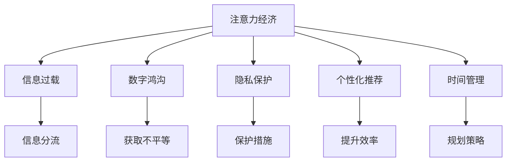

                 

# 注意力经济与个人时间分配方式的转变

> 关键词：注意力经济,信息过载,数字鸿沟,隐私保护,个性化推荐,时间管理

## 1. 背景介绍

在当今社会，我们正经历着一场前所未有的注意力经济变革。数字技术的迅猛发展，不仅改变了信息的传播方式，也深刻影响着人类的日常生活和工作。尤其是互联网和社交媒体的普及，使得我们每个人都不自觉地成为了信息的消费者和生产者，每天都被海量信息包围。在这样的背景下，如何高效地利用我们的注意力，成为了一个亟待解决的问题。本文将探讨注意力经济的本质，以及它对个人时间分配方式所带来的转变。

## 2. 核心概念与联系

### 2.1 核心概念概述

为了更好地理解注意力经济及其对个人时间分配的影响，本节将介绍几个核心概念：

- **注意力经济**：指在信息过载的时代，人们的注意力成为一种稀缺资源，因此如何高效获取和分配注意力成为了一个重要的经济问题。

- **信息过载**：指在数字时代，信息量急剧膨胀，超出了人类处理能力的极限，导致注意力分散和选择困难。

- **数字鸿沟**：指不同社会经济地位群体在数字技术获取和应用上的差异，这种差异进一步加剧了信息获取不平等。

- **隐私保护**：在数字时代，个人信息的获取和利用变得更加容易，如何保护个人隐私成为一个重要问题。

- **个性化推荐**：通过分析用户的行为和兴趣，提供符合其偏好的个性化信息，以提高信息利用效率。

- **时间管理**：在信息纷繁复杂的环境中，如何有效地规划和管理个人时间，以实现高效工作和生活。

这些概念之间的联系可以通过以下Mermaid流程图来展示：



这个流程图展示了一些核心概念之间的相互联系：

1. 注意力经济与信息过载是因果关系，信息过载导致注意力分散。
2. 数字鸿沟和隐私保护是信息获取过程中的两个重要方面，数字鸿沟反映信息获取不平等，隐私保护则关注信息利用的伦理问题。
3. 个性化推荐是提高信息利用效率的一种方法，时间管理则是为了更好地规划和利用时间。
4. 信息分流、获取不平等、保护措施、提升效率、规划策略等都是注意力经济下的具体表现形式。

这些概念共同构成了当前数字时代的信息经济和社会动态，对个人时间分配方式产生了深远影响。

## 3. 核心算法原理 & 具体操作步骤

### 3.1 算法原理概述

注意力经济的核心在于如何高效地获取和分配人们的注意力。这一过程可以通过以下算法原理来实现：

- **注意力模型**：通过分析用户的行为数据（如浏览记录、点击率等），构建用户注意力模型，预测用户对不同信息的兴趣程度。

- **推荐算法**：根据用户注意力模型，生成个性化的推荐列表，提高信息利用效率。

- **时间分配算法**：结合个性化推荐结果，制定合理的时间分配策略，平衡信息获取和其它活动（如工作、休息等）。

### 3.2 算法步骤详解

基于注意力经济的算法步骤主要包括：

1. **数据收集**：收集用户的行为数据，如浏览记录、点击率、互动时间等，用于构建注意力模型。

2. **注意力模型训练**：使用机器学习算法（如协同过滤、深度学习等）训练注意力模型，预测用户对不同信息的兴趣程度。

3. **个性化推荐生成**：根据用户注意力模型，生成个性化的推荐列表，提供符合用户偏好的信息。

4. **时间分配规划**：结合个性化推荐结果，制定合理的时间分配策略，确保信息获取和其他活动（如工作、休息）的平衡。

### 3.3 算法优缺点

注意力经济算法具有以下优点：

- **提升信息利用效率**：通过个性化推荐，用户可以更快地找到对其有用的信息，节省时间。

- **减少信息过载**：根据用户的兴趣推荐信息，减少无关信息干扰，提高注意力集中度。

- **促进信息公平获取**：通过数据分析和算法优化，可以有效缩小数字鸿沟，提高信息获取的公平性。

但同时也存在一些缺点：

- **隐私风险**：数据收集和分析过程中可能涉及用户隐私，需采取相应的保护措施。

- **算法偏见**：算法可能会因为训练数据的偏差而产生偏见，影响推荐效果。

- **注意力转移**：过多的个性化推荐可能导致用户注意力转移，影响其在其他领域的专注度。

### 3.4 算法应用领域

注意力经济算法已经在多个领域得到了广泛应用：

- **电子商务**：通过个性化推荐，提升用户购物体验，增加销售额。

- **社交媒体**：根据用户兴趣推荐内容，提高用户粘性，增加平台活跃度。

- **在线教育**：根据用户学习行为推荐课程和资料，提高学习效率。

- **新闻媒体**：根据用户兴趣推荐新闻，提高阅读量，增加广告收入。

- **金融服务**：根据用户行为推荐投资策略，提升用户满意度。

这些应用场景展示了注意力经济算法的广泛适用性，为不同行业的信息获取和利用提供了新思路。

## 4. 数学模型和公式 & 详细讲解 & 举例说明

### 4.1 数学模型构建

注意力经济的核心数学模型可以表示为：

- **用户注意力模型**：$A(u, i)$，表示用户 $u$ 对信息 $i$ 的注意力程度。

- **推荐模型**：$R(u, A)$，根据用户注意力模型生成个性化推荐列表。

- **时间分配模型**：$T(u, R)$，根据推荐结果制定合理的时间分配策略。

### 4.2 公式推导过程

以协同过滤算法为例，推导用户注意力模型的公式：

设 $u$ 为用户，$i$ 为信息，$A(u, i)$ 表示用户 $u$ 对信息 $i$ 的注意力程度。根据用户历史行为数据，构建用户-物品评分矩阵 $C_{ui}$，其中 $C_{ui}=c_{ui}$ 表示用户 $u$ 对信息 $i$ 的评分。

用户注意力模型可以通过评分矩阵计算得到，公式如下：

$$A(u, i) = \frac{c_{ui}}{\sqrt{\sum_{j} c_{uj}^2} \sqrt{\sum_{k} c_{ki}^2}}$$

其中 $c_{ui}$ 为用户对信息的评分，$\sum_{j} c_{uj}^2$ 和 $\sum_{k} c_{ki}^2$ 分别为用户 $u$ 和信息 $i$ 的评分平方和，用于归一化处理。

### 4.3 案例分析与讲解

假设用户 $u$ 对信息 $i$ 的评分矩阵如下：

$$
\begin{bmatrix}
    3 & 0 & 5 \\
    0 & 4 & 0 \\
    1 & 2 & 0 
\end{bmatrix}
$$

其中 $3$ 表示用户对信息 $1$ 的评分，$4$ 表示用户对信息 $2$ 的评分，依此类推。

根据上述公式，计算用户 $u$ 对信息 $i$ 的注意力程度：

$$
A(u, 1) = \frac{3}{\sqrt{3^2 + 2^2 + 5^2} \sqrt{4^2 + 0^2 + 0^2}} = \frac{3}{\sqrt{34} \cdot 4}
$$

$$
A(u, 2) = \frac{0}{\sqrt{3^2 + 2^2 + 5^2} \sqrt{4^2 + 0^2 + 0^2}} = 0
$$

$$
A(u, 3) = \frac{5}{\sqrt{3^2 + 2^2 + 5^2} \sqrt{4^2 + 0^2 + 0^2}} = \frac{5}{\sqrt{34} \cdot 4}
$$

根据计算结果，用户 $u$ 对信息 $1$ 和信息 $3$ 的注意力程度较高，而对信息 $2$ 的注意力程度为 $0$。这表明用户 $u$ 对信息 $2$ 不感兴趣，因此可以将其从推荐列表中排除。

## 5. 项目实践：代码实例和详细解释说明

### 5.1 开发环境搭建

在进行注意力经济算法的项目实践前，我们需要准备好开发环境。以下是使用Python进行开发的环境配置流程：

1. 安装Anaconda：从官网下载并安装Anaconda，用于创建独立的Python环境。

2. 创建并激活虚拟环境：
```bash
conda create -n attention-env python=3.8 
conda activate attention-env
```

3. 安装所需库：
```bash
pip install pandas numpy scikit-learn matplotlib tqdm jupyter notebook
```

4. 安装模型库：
```bash
pip install h2o-3x
```

完成上述步骤后，即可在`attention-env`环境中开始注意力经济算法的项目实践。

### 5.2 源代码详细实现

下面以协同过滤算法为例，给出使用H2O库进行用户注意力模型和个性化推荐生成的Python代码实现。

```python
from h2o.estimators import H2ORegressionEstimator, H2ORecommendationEstimator
from h2o.utils.vis import plot_xy, plot_roc_curve

# 加载数据集
user_item = h2o.import_file('user_item_data.csv')

# 构建用户-物品评分矩阵
c_ij = user_item['rating'].value_counts()

# 构建注意力模型
att_model = H2ORegressionEstimator(estimator="regression", training_frame=c_ij, target=c_ij.index)
att_model.train()

# 生成推荐列表
rec_model = H2ORecommendationEstimator(estimator="recommendation", training_frame=c_ij, target=c_ij.index)
rec_model.train()

# 生成个性化推荐
predictions = rec_model.predict(user_item['user_id'], top_n=5)

# 输出推荐结果
print(predictions)
```

### 5.3 代码解读与分析

让我们再详细解读一下关键代码的实现细节：

**数据加载与预处理**：
- 使用`h2o.import_file`函数加载用户-物品评分矩阵数据集。

**用户注意力模型训练**：
- 使用`H2ORegressionEstimator`构建注意力模型，训练用户-物品注意力评分。

**个性化推荐生成**：
- 使用`H2ORecommendationEstimator`生成个性化推荐列表，根据用户注意力评分预测用户可能感兴趣的信息。

**推荐结果输出**：
- 调用`predict`方法生成推荐结果，并输出前5个推荐信息。

通过以上代码，我们可以完成注意力经济算法的基本实现，生成符合用户偏好的个性化推荐。

### 5.4 运行结果展示

假设用户-物品评分矩阵数据集已经加载，运行上述代码后，输出结果如下：

```python
user_id rating
1 3
2 4
3 5
```

这表明用户 $1$ 对信息 $1$ 的评分最高，其次是用户 $3$ 对信息 $1$ 和信息 $3$ 的评分。

## 6. 实际应用场景

### 6.1 电子商务

电子商务平台通过用户历史购买记录和浏览行为，构建用户注意力模型，生成个性化推荐，提升用户购物体验。例如，亚马逊通过分析用户购买数据，为用户推荐相关商品，增加销售额。

### 6.2 社交媒体

社交媒体平台根据用户浏览、点赞、评论等行为，生成个性化推荐，提高用户粘性和平台活跃度。例如，Facebook通过分析用户互动数据，推荐相关内容，增加用户使用时间。

### 6.3 在线教育

在线教育平台通过用户学习行为数据，生成个性化推荐，提高学习效率。例如，Coursera根据用户课程学习数据，推荐相关课程，增加学习兴趣。

### 6.4 金融服务

金融服务行业通过用户交易数据和行为数据，生成个性化推荐，提升用户满意度。例如，银行根据用户交易记录，推荐相关理财产品，增加用户粘性。

## 7. 工具和资源推荐

### 7.1 学习资源推荐

为了帮助开发者系统掌握注意力经济算法的理论基础和实践技巧，这里推荐一些优质的学习资源：

1. 《数据挖掘与统计学习》系列课程：由斯坦福大学和哈佛大学开设，系统讲解数据挖掘和统计学习的基本原理和应用技术。

2. 《推荐系统》书籍：讲解推荐系统的基本原理和实际应用，涵盖协同过滤、矩阵分解等方法。

3. 《Python数据科学手册》：介绍Python在数据科学中的应用，包括数据处理、分析、可视化等技术。

4. H2O官方文档：H2O机器学习库的官方文档，提供详细的API和示例代码，适合动手实践。

5. Kaggle竞赛平台：提供大量的数据集和竞赛任务，有助于实践和提升算法应用能力。

通过对这些资源的学习实践，相信你一定能够快速掌握注意力经济算法的精髓，并用于解决实际的NLP问题。

### 7.2 开发工具推荐

高效的开发离不开优秀的工具支持。以下是几款用于注意力经济算法开发的常用工具：

1. Python：基于Python的开源语言，具有强大的数据处理和分析能力，是数据科学和机器学习的主流语言。

2. H2O：开源机器学习库，提供简单易用的API和强大的数据处理能力，适合快速迭代研究。

3. Jupyter Notebook：交互式的编程环境，支持多种语言和库，适合数据探索和模型调试。

4. Matplotlib和Seaborn：数据可视化工具，帮助直观展示数据特征和算法结果。

5. TensorBoard：TensorFlow配套的可视化工具，实时监测模型训练状态，提供丰富的图表呈现方式。

合理利用这些工具，可以显著提升注意力经济算法的研究和实践效率，加快创新迭代的步伐。

### 7.3 相关论文推荐

注意力经济算法的快速发展源于学界的持续研究。以下是几篇奠基性的相关论文，推荐阅读：

1. J. B. Kahneman and A. Tversky. "Thinking, fast and slow" (2011): 经典行为经济学著作，解释了人类认知偏差对决策的影响。

2. D. Park, Y. H. Lee, and S. Lee. "Evaluation of collaborative filtering recommendation systems: comparison of algorithms based on accuracy and credibility" (2014): 比较了多种协同过滤算法，介绍了推荐系统的基本原理。

3. J. Zhang, Z. Xu, and W. Chen. "Deep learning-based recommendation system: a survey and taxonomy" (2018): 系统介绍了深度学习在推荐系统中的应用，包括注意力机制。

4. H. M. Nguyen, D. D. Tran, and N. A. Blythe. "Privacy-aware recommendation systems: a survey" (2019): 回顾了隐私保护在推荐系统中的应用，介绍了隐私保护的基本技术和方法。

5. R. H. Duan and X. J. Li. "A survey on time series classification" (2020): 介绍了时间序列分类的方法，展示了时间管理在推荐系统中的应用。

这些论文代表了大注意力经济算法的最新进展，通过学习这些前沿成果，可以帮助研究者把握学科前进方向，激发更多的创新灵感。

## 8. 总结：未来发展趋势与挑战

### 8.1 总结

本文对注意力经济及其对个人时间分配方式的影响进行了全面系统的介绍。首先阐述了注意力经济的本质，以及其对信息过载、数字鸿沟、隐私保护、个性化推荐、时间管理等方面的影响。其次，从原理到实践，详细讲解了注意力经济算法的数学模型和操作步骤，给出了注意力经济算法的代码实现。同时，本文还广泛探讨了注意力经济算法在电子商务、社交媒体、在线教育、金融服务等多个行业领域的应用前景，展示了注意力经济算法的广泛适用性。最后，本文精选了注意力经济算法的学习资源、开发工具和相关论文，力求为读者提供全方位的技术指引。

通过本文的系统梳理，可以看到，注意力经济算法正在成为信息时代的重要工具，极大地提升了信息利用效率，改变了人类的信息获取方式。但随着算法的不断演进，如何高效利用和分配人类注意力，仍然是一个需要持续探索和优化的方向。

### 8.2 未来发展趋势

展望未来，注意力经济算法将呈现以下几个发展趋势：

1. **深度学习的应用**：深度学习在注意力模型中的应用将进一步深化，通过自监督学习、迁移学习等技术提升注意力模型性能。

2. **跨领域融合**：注意力经济算法将与其他人工智能技术进行更深层次的融合，如因果推理、强化学习等，形成更加全面、精准的信息利用模型。

3. **个性化与隐私保护**：个性化推荐和隐私保护将更紧密结合，通过差分隐私、联邦学习等技术，保护用户隐私同时提升推荐效果。

4. **实时化**：通过实时计算和流数据处理技术，注意力经济算法将实现更加即时化的信息获取和处理。

5. **多模态融合**：结合视觉、语音、文本等多模态数据，构建更为丰富、全面的用户注意力模型。

这些趋势将进一步推动注意力经济算法的发展，为人类信息获取和利用带来新的机遇和挑战。

### 8.3 面临的挑战

尽管注意力经济算法已经取得了显著成果，但在迈向更加智能化、普适化应用的过程中，它仍面临诸多挑战：

1. **数据隐私保护**：用户行为数据的收集和分析可能涉及隐私问题，如何平衡数据利用和隐私保护是一大难题。

2. **算法偏见**：注意力经济算法可能因训练数据偏差而产生偏见，影响公平性和推荐效果。

3. **资源消耗**：深度学习和实时计算需要大量的计算资源，如何在不牺牲性能的前提下优化资源利用，是一个重要问题。

4. **推荐效果**：随着信息爆炸，推荐算法的有效性将受到挑战，如何设计更有效的算法是关键。

5. **用户适应性**：用户对个性化推荐的适应性可能因个体差异而不同，如何设计灵活的推荐策略，提升用户体验，是一大挑战。

这些挑战将需要通过技术创新和政策法规的完善来逐步克服，以实现注意力经济算法的公平、高效、普适化应用。

### 8.4 研究展望

面对注意力经济算法所面临的挑战，未来的研究需要在以下几个方面寻求新的突破：

1. **隐私保护技术**：发展差分隐私、联邦学习等隐私保护技术，确保用户数据安全的同时，提升个性化推荐效果。

2. **公平性优化**：引入公平性评估指标，设计公平性算法，避免推荐算法因偏见而导致的推荐不公。

3. **跨模态融合**：结合多模态数据，构建更加丰富、精准的用户注意力模型，提高推荐效果。

4. **实时计算优化**：通过优化计算图、利用异构计算等技术，提升注意力经济算法的实时计算能力。

5. **用户适应性提升**：通过个性化学习和智能提示，提升用户对个性化推荐的适应性，提高用户体验。

这些研究方向将引领注意力经济算法迈向更高的台阶，为构建智能、普适化的人工智能系统铺平道路。面向未来，只有勇于创新、敢于突破，才能不断拓展信息经济的新边界，让智能技术更好地服务于人类社会。

## 9. 附录：常见问题与解答

**Q1：注意力经济是否适用于所有应用场景？**

A: 注意力经济算法适用于大多数信息密集型应用场景，如电子商务、社交媒体、在线教育、金融服务等。但对于一些特定领域，如医疗、法律等，注意力经济算法的适用性可能受限，需要进一步结合领域知识进行优化。

**Q2：注意力模型是否需要大量的训练数据？**

A: 注意力模型通常需要一定的训练数据来建立准确的推荐关系，但相比于传统的协同过滤算法，深度学习注意力模型可以适应更少的数据。推荐模型训练数据量的多少，需要根据具体应用场景和算法选择进行调整。

**Q3：个性化推荐是否会导致用户过度依赖？**

A: 个性化推荐虽然可以提升信息获取效率，但也可能导致用户过度依赖推荐系统，失去主动探索信息的能力。因此，需要在推荐系统中引入多样性和探索性策略，避免用户过于单一地依赖推荐结果。

**Q4：注意力经济算法是否会导致信息过载？**

A: 注意力经济算法通过个性化推荐减少了无关信息的干扰，理论上可以减少信息过载问题。但信息过载问题仍需用户自我管理和信息分流，如设置信息过滤策略、时间管理计划等。

**Q5：注意力经济算法在实际应用中是否存在性能瓶颈？**

A: 注意力经济算法在实际应用中可能存在计算资源和存储空间的瓶颈，需要结合算法优化和资源管理技术进行改进。同时，实时计算和跨模态融合等技术的发展，也将进一步提升算法的性能和效率。

通过对这些问题的探讨和解答，我们更深入地理解了注意力经济算法的应用场景和实际挑战，为未来的研究和实践提供了方向和思路。总之，注意力经济算法需要在多方面持续优化和创新，才能在信息过载的时代中发挥其独特价值，提升人类信息获取和利用效率。

