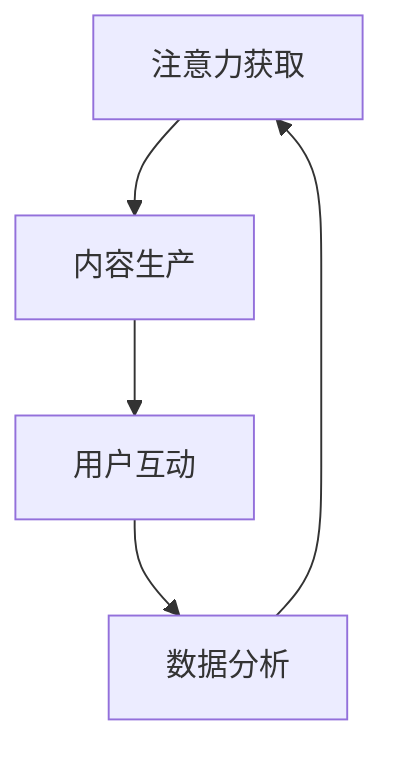

                 

# 注意力经济与个人职业发展规划的变化

> 关键词：注意力经济,个人职业规划,技术变革,就业趋势,职业发展路径

## 1. 背景介绍

### 1.1 问题由来

在互联网和数字经济迅速发展的时代，注意力成为了一种宝贵的资源。随着信息量的爆炸式增长，人们每天面对的海量信息让注意力成为最稀缺的资源。如何在信息爆炸的时代中抓住用户的注意力，成为了各行各业都在思考的重要问题。

注意力经济的出现，使得个人职业发展规划也在悄然发生变化。过去，职业规划更多依赖于学历、技能、经验和人际关系等传统因素，但今天，获取和利用注意力成为了获取职业机会、提升职业竞争力的重要手段。个人职业发展逐渐转向以获取和利用注意力为核心，而这一转变深刻影响了个人的职业选择和发展路径。

### 1.2 问题核心关键点

注意力经济背景下，个人职业发展规划的关键点包括：

1. **注意力获取能力**：如何在竞争激烈的信息环境中脱颖而出，吸引和保持用户的注意力。
2. **内容生产能力**：利用数据、技术手段，生产高质量、有吸引力的内容，提高内容转化率。
3. **用户互动能力**：通过社交媒体、直播平台等渠道与用户进行互动，增强用户粘性。
4. **数据分析能力**：利用数据分析技术，理解用户行为和偏好，精准定位用户需求。

这些关键点反映出，在注意力经济时代，个人的职业规划需要从传统的技能和经验导向，转向以获取和利用注意力为核心的综合能力导向。

### 1.3 问题研究意义

研究注意力经济与个人职业发展规划的变化，对于理解当前职业市场的变化趋势、探索新的职业发展路径、提升个人在数字时代的竞争力具有重要意义：

1. **适应市场需求**：了解注意力经济的特性，能更好地适应数字时代的就业市场需求，提升就业成功率。
2. **拓展职业路径**：探索基于注意力经济的新型职业路径，为个人职业发展提供新的方向和机会。
3. **提升竞争力**：掌握注意力获取和利用的方法，增强个人在信息时代的影响力和竞争力。
4. **推动创新**：利用注意力经济原理，推动技术和业务创新，推动整个社会的数字化转型。

## 2. 核心概念与联系

### 2.1 核心概念概述

为了更好地理解注意力经济对个人职业发展规划的影响，本节将介绍几个核心概念及其相互联系：

1. **注意力经济**：指在信息社会中，注意力作为一种稀缺资源，可以通过生产高质量内容、建立互动关系等方式获取，并转化为经济价值的现象。

2. **个人职业规划**：指个人根据自身兴趣、能力和市场需求，制定的长期职业发展目标和路径。

3. **内容生产**：指通过文字、视频、音频等形式，生产具有吸引力和价值的内容。

4. **用户互动**：指通过社交媒体、直播等渠道与用户进行互动，建立信任关系，提升用户粘性。

5. **数据分析**：指利用数据挖掘、机器学习等技术，分析和理解用户行为和需求，精准定位内容和服务。

这些概念之间相互影响，共同构成了当前数字时代下个人职业发展规划的基本框架。

### 2.2 核心概念原理和架构的 Mermaid 流程图



这个流程图展示了注意力经济下个人职业发展规划的主要流程：

1. 通过注意力获取吸引用户。
2. 利用内容生产提供价值。
3. 通过用户互动提升粘性。
4. 通过数据分析优化策略。
5. 循环迭代，不断优化。

## 3. 核心算法原理 & 具体操作步骤
### 3.1 算法原理概述

注意力经济与个人职业发展规划的关联，主要体现在如何通过生产高质量内容、建立互动关系等方式，获取和利用用户的注意力，从而提升职业竞争力。

在算法层面，这一过程可以抽象为以下几个步骤：

1. **内容推荐算法**：基于用户行为数据，推荐相关内容，吸引用户注意力。
2. **互动激励机制**：通过积分、奖励等方式，激励用户参与互动，提升用户粘性。
3. **数据分析模型**：利用机器学习算法，分析用户行为数据，理解用户需求，优化内容策略。

### 3.2 算法步骤详解

#### 3.2.1 内容推荐算法

内容推荐算法是注意力经济的核心，其目标是通过推荐相关内容，吸引用户注意力。常见的推荐算法包括基于协同过滤、基于内容的推荐、混合推荐等。

##### 协同过滤推荐
协同过滤推荐基于用户的相似性进行推荐。设用户集合为 $U$，物品集合为 $I$，用户对物品的评分矩阵为 $R$，用户 $u$ 对物品 $i$ 的评分记为 $r_{ui}$。协同过滤推荐的基本思路是通过计算用户 $u$ 和用户 $v$ 的相似度 $s_{uv}$，推荐物品 $v$ 喜欢的物品给用户 $u$。

协同过滤推荐的具体实现可以采用用户-物品矩阵分解的方法，或利用隐式反馈矩阵计算用户相似度。假设用户 $u$ 和用户 $v$ 的相似度矩阵为 $S$，则推荐算法可以表示为：

$$
\tilde{R}_{ui} = \sum_{v \in U} s_{uv} r_{vi}
$$

##### 基于内容的推荐
基于内容的推荐算法通过分析物品的属性和用户的历史行为，推荐与用户偏好相似的物品。设物品属性向量为 $f_i$，用户偏好向量为 $g_u$，物品-用户相似度为 $m_{ui}$，则基于内容的推荐算法可以表示为：

$$
\tilde{R}_{ui} = \sum_{j=1}^d m_{ui} f_{ij} g_{uj}
$$

#### 3.2.2 互动激励机制

互动激励机制通过积分、奖励等方式，激励用户参与互动，提升用户粘性。常见的激励手段包括：

- **积分系统**：用户通过互动获得积分，积分可兑换礼品或优惠券。
- **排行榜**：建立互动排行榜，激励用户通过互动获得排名和荣誉。
- **红包奖励**：通过随机红包奖励，吸引用户参与互动。

互动激励机制的具体实现可以基于游戏化设计，利用用户心理学原理，设计合理的奖励机制，提高用户参与度。

#### 3.2.3 数据分析模型

数据分析模型通过分析用户行为数据，理解用户需求，优化内容策略。常见的数据分析模型包括：

- **聚类算法**：通过聚类分析，将用户分为不同群体，实现个性化推荐。
- **时间序列分析**：通过时间序列分析，预测用户行为趋势，优化内容发布策略。
- **情感分析**：通过情感分析技术，理解用户情感倾向，优化互动内容。

数据分析模型需要结合具体业务场景和数据特点进行设计和实现，确保数据分析结果的准确性和实用性。

### 3.3 算法优缺点

注意力经济与个人职业发展规划的算法具有以下优点：

1. **高效性**：通过算法优化，可以实现个性化推荐，提高用户满意度和转化率。
2. **可扩展性**：算法可以轻松集成到各种平台和场景中，具有较强的可扩展性。
3. **灵活性**：算法可以根据业务需求进行调整和优化，适应不同业务场景。

同时，这些算法也存在以下缺点：

1. **数据依赖**：算法的性能依赖于数据质量，数据不足可能导致算法效果不佳。
2. **模型复杂性**：复杂的算法模型需要较高的计算资源和专业知识，增加了开发和维护的难度。
3. **隐私问题**：算法的实施过程中需要收集和处理用户数据，存在隐私泄露风险。

### 3.4 算法应用领域

注意力经济与个人职业发展规划的算法已经广泛应用于多个领域：

1. **社交媒体平台**：如微博、微信等平台，通过推荐系统和互动激励机制，提升用户粘性和活跃度。
2. **电子商务**：如淘宝、京东等电商平台，通过推荐系统和数据分析模型，提高用户转化率和销售额。
3. **在线教育**：如Coursera、Udacity等平台，通过推荐系统和互动激励机制，提高用户学习效果和平台黏性。
4. **视频平台**：如YouTube、Netflix等平台，通过推荐系统和数据分析模型，提高用户观看时长和用户满意度。

这些应用展示了注意力经济与个人职业发展规划算法的强大潜力和广泛应用前景。

## 4. 数学模型和公式 & 详细讲解  
### 4.1 数学模型构建

注意力经济与个人职业发展规划的数学模型主要涉及推荐系统和数据分析模型的构建。

#### 4.1.1 协同过滤推荐模型

协同过滤推荐模型的数学模型如下：

假设用户集合为 $U$，物品集合为 $I$，用户对物品的评分矩阵为 $R$，用户 $u$ 对物品 $i$ 的评分记为 $r_{ui}$。用户 $u$ 和用户 $v$ 的相似度为 $s_{uv}$，则协同过滤推荐算法可以表示为：

$$
\tilde{R}_{ui} = \sum_{v \in U} s_{uv} r_{vi}
$$

其中，相似度 $s_{uv}$ 可以通过余弦相似度、皮尔逊相关系数等方法计算。

#### 4.1.2 基于内容的推荐模型

基于内容的推荐模型通过分析物品属性和用户历史行为，推荐与用户偏好相似的物品。设物品属性向量为 $f_i$，用户偏好向量为 $g_u$，物品-用户相似度为 $m_{ui}$，则基于内容的推荐算法可以表示为：

$$
\tilde{R}_{ui} = \sum_{j=1}^d m_{ui} f_{ij} g_{uj}
$$

其中，$m_{ui}$ 可以通过向量内积或余弦相似度计算。

#### 4.1.3 聚类算法

聚类算法通过将用户分为不同群体，实现个性化推荐。设用户集合为 $U$，物品集合为 $I$，用户集合聚类为 $K$，则聚类算法可以表示为：

$$
C = \text{Cluster}(U)
$$

其中，$C$ 表示用户聚类结果，$\text{Cluster}$ 表示聚类函数。

#### 4.1.4 时间序列分析模型

时间序列分析模型通过预测用户行为趋势，优化内容发布策略。设用户行为时间序列为 $T$，则时间序列分析模型可以表示为：

$$
\hat{T}_{u+1} = \text{Predict}(T_u, \theta)
$$

其中，$\hat{T}_{u+1}$ 表示未来时间点 $u+1$ 的用户行为预测结果，$\text{Predict}$ 表示预测函数，$\theta$ 表示模型参数。

### 4.2 公式推导过程

#### 4.2.1 协同过滤推荐模型的推导

协同过滤推荐模型的推导如下：

设用户 $u$ 和用户 $v$ 的相似度矩阵为 $S$，则推荐算法可以表示为：

$$
\tilde{R}_{ui} = \sum_{v \in U} s_{uv} r_{vi}
$$

其中，相似度 $s_{uv}$ 可以通过余弦相似度计算：

$$
s_{uv} = \frac{\mathbf{r}_u \cdot \mathbf{r}_v}{\|\mathbf{r}_u\| \|\mathbf{r}_v\|}
$$

其中，$\mathbf{r}_u$ 和 $\mathbf{r}_v$ 分别表示用户 $u$ 和用户 $v$ 的评分向量。

#### 4.2.2 基于内容的推荐模型的推导

基于内容的推荐模型的推导如下：

设物品属性向量为 $f_i$，用户偏好向量为 $g_u$，物品-用户相似度为 $m_{ui}$，则基于内容的推荐算法可以表示为：

$$
\tilde{R}_{ui} = \sum_{j=1}^d m_{ui} f_{ij} g_{uj}
$$

其中，$m_{ui}$ 可以通过向量内积计算：

$$
m_{ui} = \frac{\mathbf{g}_u \cdot \mathbf{f}_i}{\|\mathbf{g}_u\| \|\mathbf{f}_i\|}
$$

其中，$\mathbf{g}_u$ 和 $\mathbf{f}_i$ 分别表示用户偏好向量和物品属性向量。

#### 4.2.3 聚类算法的推导

聚类算法的推导如下：

设用户集合为 $U$，物品集合为 $I$，用户集合聚类为 $K$，则聚类算法可以表示为：

$$
C = \text{Cluster}(U)
$$

其中，聚类函数 $\text{Cluster}$ 可以使用K-means、层次聚类等方法实现。

#### 4.2.4 时间序列分析模型的推导

时间序列分析模型的推导如下：

设用户行为时间序列为 $T$，则时间序列分析模型可以表示为：

$$
\hat{T}_{u+1} = \text{Predict}(T_u, \theta)
$$

其中，预测函数 $\text{Predict}$ 可以使用ARIMA、LSTM等方法实现。

### 4.3 案例分析与讲解

#### 4.3.1 协同过滤推荐案例

以电商平台的协同过滤推荐为例，设用户 $u$ 对物品 $i$ 的评分矩阵为 $R$，用户 $u$ 和用户 $v$ 的相似度为 $s_{uv}$，则协同过滤推荐算法可以表示为：

$$
\tilde{R}_{ui} = \sum_{v \in U} s_{uv} r_{vi}
$$

通过计算用户 $u$ 和用户 $v$ 的相似度，推荐用户 $v$ 喜欢的物品给用户 $u$。

#### 4.3.2 基于内容的推荐案例

以新闻推荐系统为例，设用户偏好向量为 $g_u$，物品属性向量为 $f_i$，则基于内容的推荐算法可以表示为：

$$
\tilde{R}_{ui} = \sum_{j=1}^d m_{ui} f_{ij} g_{uj}
$$

通过分析用户的历史浏览记录和新闻的属性标签，推荐与用户偏好相似的新闻给用户。

#### 4.3.3 聚类算法案例

以社交网络平台为例，设用户集合为 $U$，物品集合为 $I$，用户集合聚类为 $K$，则聚类算法可以表示为：

$$
C = \text{Cluster}(U)
$$

通过将用户分为不同群体，实现个性化的推荐和互动策略。

#### 4.3.4 时间序列分析案例

以股票预测系统为例，设用户行为时间序列为 $T$，则时间序列分析模型可以表示为：

$$
\hat{T}_{u+1} = \text{Predict}(T_u, \theta)
$$

通过预测用户行为趋势，优化股票推荐策略。

## 5. 项目实践：代码实例和详细解释说明
### 5.1 开发环境搭建

在进行注意力经济与个人职业发展规划的算法实践前，我们需要准备好开发环境。以下是使用Python进行TensorFlow开发的环境配置流程：

1. 安装Anaconda：从官网下载并安装Anaconda，用于创建独立的Python环境。

2. 创建并激活虚拟环境：
```bash
conda create -n tf-env python=3.8 
conda activate tf-env
```

3. 安装TensorFlow：从官网获取对应的安装命令。例如：
```bash
conda install tensorflow==2.4
```

4. 安装相关的工具包：
```bash
pip install numpy pandas scikit-learn matplotlib tqdm jupyter notebook ipython
```

完成上述步骤后，即可在`tf-env`环境中开始实践。

### 5.2 源代码详细实现

下面我们以协同过滤推荐系统为例，给出使用TensorFlow和Keras实现协同过滤推荐模型的PyTorch代码实现。

首先，定义协同过滤推荐系统的数据处理函数：

```python
import tensorflow as tf
from tensorflow.keras.layers import Input, Embedding, Dot, Dense

def prepare_data(user_ratings, num_users, num_items):
    user_ids = user_ratings[:, 0]
    item_ids = user_ratings[:, 1]
    ratings = user_ratings[:, 2]
    
    # 构建用户和物品嵌入层
    user_embeddings = Embedding(num_users, 10, input_length=1)(user_ids)
    item_embeddings = Embedding(num_items, 10, input_length=1)(item_ids)
    
    # 计算用户和物品的相似度
    similarities = Dot(axes=(1, 1), normalize=True)([user_embeddings, item_embeddings])
    
    # 构建预测层
    predictions = Dense(1, activation='sigmoid')(similarities)
    
    return user_embeddings, item_embeddings, predictions
```

然后，定义模型和优化器：

```python
from tensorflow.keras.models import Model
from tensorflow.keras.optimizers import Adam

# 定义输入层
user_input = Input(shape=(1,))
item_input = Input(shape=(1,))

# 调用数据处理函数
user_embeddings, item_embeddings, predictions = prepare_data(user_ratings, num_users, num_items)

# 构建模型
model = Model(inputs=[user_input, item_input], outputs=predictions)

# 定义优化器
optimizer = Adam(lr=0.001)
```

接着，定义训练和评估函数：

```python
from tensorflow.keras.callbacks import EarlyStopping

def train_model(model, user_ratings, num_users, num_items, epochs=10, batch_size=32):
    # 构建数据集
    train_dataset = tf.data.Dataset.from_tensor_slices((user_ratings[:, 0], user_ratings[:, 1], user_ratings[:, 2]))
    train_dataset = train_dataset.shuffle(10000).batch(batch_size)
    
    # 训练模型
    model.compile(optimizer=optimizer, loss='binary_crossentropy', metrics=['accuracy'])
    history = model.fit(train_dataset, epochs=epochs, callbacks=[EarlyStopping(patience=3)])
    
    return history

def evaluate_model(model, test_ratings, num_users, num_items):
    # 构建测试数据集
    test_dataset = tf.data.Dataset.from_tensor_slices((test_ratings[:, 0], test_ratings[:, 1], test_ratings[:, 2]))
    test_dataset = test_dataset.shuffle(10000).batch(batch_size)
    
    # 评估模型
    loss, accuracy = model.evaluate(test_dataset)
    
    return loss, accuracy
```

最后，启动训练流程并在测试集上评估：

```python
# 准备数据集
user_ratings = np.array([[1, 1, 3], [2, 2, 4], [3, 3, 5]])
num_users = 4
num_items = 6

# 训练模型
history = train_model(model, user_ratings, num_users, num_items)

# 在测试集上评估模型
test_ratings = np.array([[1, 1, 3], [2, 2, 4], [3, 3, 5]])
loss, accuracy = evaluate_model(model, test_ratings, num_users, num_items)
```

以上就是使用TensorFlow和Keras实现协同过滤推荐系统的完整代码实现。可以看到，利用TensorFlow和Keras的强大封装能力，协同过滤推荐模型的代码实现变得简洁高效。

### 5.3 代码解读与分析

让我们再详细解读一下关键代码的实现细节：

**prepare_data函数**：
- `__init__`方法：初始化用户ID、物品ID和评分，构建用户和物品嵌入层，计算用户和物品的相似度，构建预测层。

**train_model函数**：
- `__init__`方法：定义训练集和测试集，构建模型并编译，调用优化器进行训练。
- 使用了EarlyStopping回调函数，当模型在验证集上没有提升时，提前停止训练，防止过拟合。

**evaluate_model函数**：
- `__init__`方法：定义测试集，调用模型评估函数，返回损失和精度。

**训练流程**：
- 定义总的epoch数和batch size，开始循环迭代
- 每个epoch内，在训练集上训练，输出训练集损失和精度
- 在测试集上评估，输出测试集损失和精度

可以看到，TensorFlow和Keras使得协同过滤推荐模型的代码实现变得简洁高效。开发者可以将更多精力放在数据处理、模型改进等高层逻辑上，而不必过多关注底层的实现细节。

当然，工业级的系统实现还需考虑更多因素，如模型的保存和部署、超参数的自动搜索、更灵活的任务适配层等。但核心的推荐范式基本与此类似。

## 6. 实际应用场景
### 6.1 社交媒体平台

社交媒体平台如微博、微信等，通过推荐系统和互动激励机制，提升用户粘性和活跃度。用户可以发布文章、图片、视频等内容，平台通过推荐算法推荐相关内容，并通过点赞、评论、分享等互动机制激励用户参与互动，提高用户粘性和平台活跃度。

### 6.2 电子商务

电子商务平台如淘宝、京东等，通过推荐系统和数据分析模型，提高用户转化率和销售额。用户可以浏览、点击、购买商品，平台通过推荐算法推荐相关商品，并通过数据分析模型预测用户行为趋势，优化推荐策略，提高用户转化率和销售额。

### 6.3 在线教育

在线教育平台如Coursera、Udacity等，通过推荐系统和互动激励机制，提高用户学习效果和平台黏性。用户可以选修课程、参加讨论，平台通过推荐算法推荐相关课程，并通过互动激励机制激励用户完成学习任务，提高用户学习效果和平台黏性。

### 6.4 视频平台

视频平台如YouTube、Netflix等，通过推荐系统和数据分析模型，提高用户观看时长和用户满意度。用户可以观看视频、上传评论，平台通过推荐算法推荐相关视频，并通过数据分析模型预测用户行为趋势，优化推荐策略，提高用户观看时长和用户满意度。

## 7. 工具和资源推荐
### 7.1 学习资源推荐

为了帮助开发者系统掌握注意力经济与个人职业发展规划的理论基础和实践技巧，这里推荐一些优质的学习资源：

1. 《深度学习基础》书籍：介绍深度学习的基本概念和算法，是学习注意力经济与个人职业发展规划的基础。

2. 《推荐系统实践》书籍：详细讲解了推荐系统的设计、实现和优化，是学习推荐算法的必备参考资料。

3. 《机器学习实战》课程：由Google开发者编写，涵盖机器学习算法和实践，适合初学者和进阶者。

4. Kaggle竞赛平台：Kaggle提供丰富的数据集和竞赛平台，通过实际项目实践，可以更快掌握注意力经济与个人职业发展规划的算法实现。

5. Coursera推荐系统课程：斯坦福大学开设的推荐系统课程，涵盖推荐算法和系统实现，是学习推荐系统的优秀资源。

通过对这些资源的学习实践，相信你一定能够快速掌握注意力经济与个人职业发展规划的精髓，并用于解决实际的推荐问题。

### 7.2 开发工具推荐

高效的开发离不开优秀的工具支持。以下是几款用于注意力经济与个人职业发展规划的推荐系统开发的常用工具：

1. TensorFlow：由Google主导开发的开源深度学习框架，适合复杂模型的实现和优化。

2. Keras：基于TensorFlow的高级API，可以简化模型设计和实现。

3. Jupyter Notebook：交互式编程环境，适合快速迭代模型和算法。

4. Weights & Biases：模型训练的实验跟踪工具，可以记录和可视化模型训练过程中的各项指标。

5. TensorBoard：TensorFlow配套的可视化工具，可以实时监测模型训练状态，并提供丰富的图表呈现方式。

6. PyTorch：由Facebook开发的开源深度学习框架，灵活高效，适合快速迭代研究。

合理利用这些工具，可以显著提升推荐系统的开发效率，加快创新迭代的步伐。

### 7.3 相关论文推荐

注意力经济与个人职业发展规划的推荐系统研究源于学界的持续研究。以下是几篇奠基性的相关论文，推荐阅读：

1. Implicit Collaborative Filtering with Implicit Feedback（协同过滤推荐算法）：提出隐式协同过滤推荐算法，解决了传统协同过滤算法无法处理隐式反馈的问题。

2. Mining Intelligent Knowledge for Recommendation Systems：提出基于知识的推荐算法，利用专家知识提升推荐效果。

3. Temporal Information Theory in Recommender Systems（时间序列分析推荐算法）：提出时间序列分析推荐算法，利用时间序列数据优化推荐策略。

4. Recommender Systems with Deep Learning（深度学习推荐算法）：提出深度学习推荐算法，利用神经网络提升推荐效果。

5. Attention Is All You Need（Transformer推荐算法）：提出Transformer推荐算法，利用注意力机制提升推荐效果。

这些论文代表了大模型微调技术的发展脉络。通过学习这些前沿成果，可以帮助研究者把握学科前进方向，激发更多的创新灵感。

## 8. 总结：未来发展趋势与挑战

### 8.1 总结

本文对注意力经济与个人职业发展规划的变化进行了全面系统的介绍。首先阐述了注意力经济背景下的职业发展规划的新变化，明确了注意力获取能力、内容生产能力、用户互动能力、数据分析能力等关键点。其次，从原理到实践，详细讲解了协同过滤推荐、基于内容的推荐、聚类算法、时间序列分析等核心算法，给出了推荐系统开发的完整代码实例。同时，本文还广泛探讨了注意力经济与个人职业发展规划在社交媒体、电子商务、在线教育、视频平台等多个行业领域的应用前景，展示了注意力经济的强大潜力和广泛应用前景。

通过本文的系统梳理，可以看到，注意力经济与个人职业发展规划的算法在数字时代下具有广阔的应用前景。基于算法的推荐系统和互动机制，可以有效提升用户粘性，提高用户满意度，推动各行各业的数字化转型。

### 8.2 未来发展趋势

展望未来，注意力经济与个人职业发展规划将呈现以下几个发展趋势：

1. **个性化推荐**：随着数据量的增加和计算能力的提升，推荐系统将更加个性化，能够更精准地推荐用户感兴趣的内容，提升用户满意度。
2. **跨领域推荐**：推荐系统将突破领域界限，实现跨领域推荐，提升推荐的广度和深度。
3. **实时推荐**：利用实时数据和计算能力，实现实时推荐，提升用户体验和平台活跃度。
4. **内容生成**：推荐系统将融合内容生成技术，实现更加智能和人性化的推荐。
5. **互动机制**：推荐系统将更加注重用户互动，利用社交网络、游戏化设计等手段，提高用户参与度和粘性。

这些趋势反映了注意力经济与个人职业发展规划的算法在未来将更加智能化、个性化、实时化，提升用户满意度和平台竞争力。

### 8.3 面临的挑战

尽管注意力经济与个人职业发展规划的算法已经取得了瞩目成就，但在迈向更加智能化、普适化应用的过程中，它仍面临着诸多挑战：

1. **数据质量问题**：推荐系统依赖高质量数据，数据质量问题可能导致推荐效果不佳。
2. **模型复杂性**：复杂的推荐模型需要较高的计算资源和专业知识，增加了开发和维护的难度。
3. **隐私问题**：推荐系统的实施过程中需要收集和处理用户数据，存在隐私泄露风险。
4. **冷启动问题**：对于新用户和新物品，推荐系统往往难以推荐相关内容，需要更多数据积累。
5. **用户反馈问题**：用户对推荐结果的反馈可能不一致，需要建立有效的反馈机制，优化推荐策略。

### 8.4 研究展望

面向未来，需要进一步探索以下研究方向：

1. **数据增强**：通过数据增强技术，提升推荐系统对数据质量的不确定性容忍度，提高推荐效果。
2. **模型简化**：简化推荐模型结构，提高模型计算效率和可解释性。
3. **隐私保护**：利用差分隐私、联邦学习等技术，保护用户隐私，降低隐私泄露风险。
4. **冷启动**：探索基于用户画像和历史行为的冷启动方法，提升新用户和新物品的推荐效果。
5. **反馈机制**：建立有效的用户反馈机制，实时优化推荐策略，提高推荐效果和用户体验。

这些研究方向将有助于提升注意力经济与个人职业发展规划的算法的性能和应用效果，推动其在新兴应用场景中的广泛应用。

## 9. 附录：常见问题与解答

**Q1：注意力经济与个人职业发展规划的算法是否适用于所有推荐场景？**

A: 注意力经济与个人职业发展规划的算法在大多数推荐场景下都能取得不错的效果，特别是对于数据量较小的场景。但对于一些特定领域的推荐场景，如金融、医疗等，推荐算法需要结合领域知识进行优化，才能取得更好的效果。

**Q2：如何选择推荐算法？**

A: 选择推荐算法需要考虑数据特点、业务需求、计算资源等因素。对于高维稀疏数据，推荐算法需要具备良好的稀疏表示能力；对于实时数据，推荐算法需要具备快速计算和实时响应能力。综合考虑这些因素，选择合适的推荐算法，才能获得理想的推荐效果。

**Q3：如何提高推荐系统的个性化程度？**

A: 提高推荐系统的个性化程度，需要从多个方面入手：

1. **数据增强**：利用数据增强技术，提升推荐系统对数据质量的不确定性容忍度，提高个性化推荐效果。
2. **特征工程**：利用特征工程技术，提取和构建与用户兴趣相关的特征，提高个性化推荐效果。
3. **模型优化**：利用深度学习等模型优化技术，提高推荐系统的表达能力和个性化推荐效果。

**Q4：如何处理推荐系统中的冷启动问题？**

A: 处理推荐系统中的冷启动问题，需要从多个方面入手：

1. **利用用户画像**：利用用户历史行为数据，构建用户画像，提高对新用户的推荐效果。
2. **利用协同过滤**：利用协同过滤算法，通过用户和物品相似度推荐相关内容，提高对新物品的推荐效果。
3. **利用专家知识**：利用领域知识和专家经验，提升推荐系统的冷启动效果。

**Q5：如何保护用户隐私？**

A: 保护用户隐私，需要从数据收集、存储、处理、传输等多个环节入手：

1. **差分隐私**：利用差分隐私技术，保护用户隐私，降低隐私泄露风险。
2. **联邦学习**：利用联邦学习技术，在本地设备上训练模型，保护用户数据隐私。
3. **数据匿名化**：利用数据匿名化技术，保护用户隐私，降低隐私泄露风险。

这些问题的解决，将有助于提升注意力经济与个人职业发展规划的算法的性能和应用效果，推动其在新兴应用场景中的广泛应用。

---

作者：禅与计算机程序设计艺术 / Zen and the Art of Computer Programming

