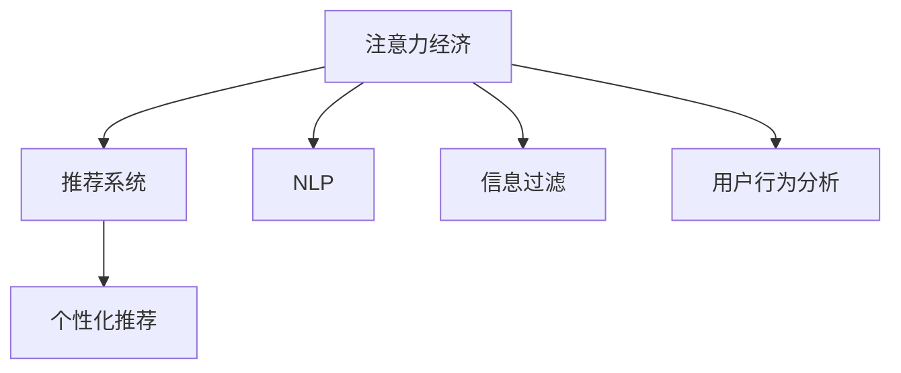

                 

# 注意力经济与个人购物习惯的变化

> 关键词：注意力经济, 个人购物习惯, 推荐系统, 自然语言处理, 信息过滤, 用户行为分析

## 1. 背景介绍

在互联网时代，信息爆炸和注意力有限的双重困境催生了“注意力经济”这一概念。随着全球数字技术的迅猛发展，特别是移动互联网、社交媒体、电子商务的普及，用户的时间、精力和注意力成为了稀缺资源。如何有效获取并利用用户的注意力，转化为商业价值，成为了各大电商平台和内容平台关注的焦点。

在电商平台，“注意力经济”的表现尤为明显。用户在众多商品和广告的轰炸下，注意力变得极为稀缺，如何通过精准的推荐系统提升用户购物体验，促进销售转化，成为商家追求的终极目标。近年来，各大电商平台纷纷加大对个性化推荐系统的投入，借助大数据、机器学习和人工智能等技术手段，深入分析用户行为数据，从而在有限的注意力资源中挖掘出最大的商业价值。

本文旨在探讨注意力经济背景下，个人购物习惯的变化，以及个性化推荐系统如何应对这些变化，并通过案例分析、算法构建和模型评估，提供一套可行的解决方案。

## 2. 核心概念与联系

### 2.1 核心概念概述

本节将介绍几个与注意力经济和个人购物习惯变化密切相关的核心概念：

- **注意力经济（Attention Economy）**：指在信息过载的时代，用户注意力成为重要的资源，争夺用户注意力的过程和现象。
- **推荐系统（Recommendation System）**：通过分析用户行为数据，预测用户兴趣，为用户推荐个性化商品和服务的技术系统。
- **自然语言处理（NLP）**：处理、理解、生成人类语言的技术，常用于情感分析、用户意图识别、关键词提取等。
- **信息过滤（Information Filtering）**：根据用户偏好和行为，对海量信息进行筛选和排序，降低信息过载带来的决策负担。
- **用户行为分析（User Behavior Analysis）**：通过数据分析和机器学习技术，识别和理解用户的行为模式和偏好。

这些概念之间的逻辑关系可以通过以下Mermaid流程图来展示：



这个流程图展示了一个典型的注意力经济系统：

1. 在信息爆炸的环境中，用户有限的注意力成为了稀缺资源。
2. 推荐系统利用大数据和机器学习算法，对用户的注意力进行精准引导，提升用户满意度。
3. NLP技术用于理解用户输入的自然语言，提升推荐系统的精准度。
4. 信息过滤技术用于降低信息过载，提升用户决策效率。
5. 用户行为分析技术用于深入理解用户偏好和行为模式，优化推荐内容。

这些核心概念共同构成了注意力经济系统，帮助用户在海量信息中找到价值，提高决策效率，同时也为电商平台带来了巨大的商业机会。

## 3. 核心算法原理 & 具体操作步骤

### 3.1 算法原理概述

个性化推荐系统通过分析用户的历史行为数据，预测用户的潜在兴趣，从而为用户推荐可能感兴趣的商品和服务。其核心算法包括以下几个方面：

1. **协同过滤算法**：根据用户的历史行为数据，找到与其兴趣相似的其他用户或商品，进行推荐。
2. **基于内容的推荐算法**：分析商品的属性和描述，与用户历史行为匹配，找到相关的推荐内容。
3. **深度学习推荐算法**：使用神经网络等深度学习技术，学习用户和商品间的复杂关系，进行推荐。
4. **基于图谱的推荐算法**：将用户、商品和行为构建成图谱，通过图神经网络进行推荐。

这些算法通过不同的模型和机制，实现对用户兴趣的预测和商品推荐的优化。

### 3.2 算法步骤详解

本节将详细介绍一个基于深度学习的推荐系统构建流程，并结合具体案例进行分析。

#### 3.2.1 数据准备

1. **数据采集**：从电商平台采集用户的行为数据，包括浏览记录、点击记录、购买记录等。
2. **数据清洗**：对采集到的数据进行清洗和预处理，去除噪声和异常值。
3. **特征工程**：设计特征并提取，包括用户基本信息、商品属性、行为时间等。

#### 3.2.2 模型训练

1. **模型选择**：选择适合的深度学习模型，如多层感知器（MLP）、卷积神经网络（CNN）、循环神经网络（RNN）等。
2. **训练过程**：将数据划分为训练集和验证集，使用交叉验证等技术，训练模型参数。
3. **调参优化**：根据验证集结果，调整模型超参数，如学习率、批次大小等。

#### 3.2.3 模型评估

1. **评估指标**：选择合适的评估指标，如准确率、召回率、F1分数等。
2. **评估过程**：使用测试集进行模型评估，对比微调前后的推荐效果。
3. **结果分析**：分析评估结果，找出模型优点和不足，进行改进。

#### 3.2.4 推荐实践

1. **实时推荐**：对用户每次浏览或搜索行为进行实时推荐。
2. **冷启动推荐**：对于新用户或未购买商品，使用推荐算法进行冷启动推荐。
3. **动态更新**：根据用户反馈和行为变化，动态更新推荐模型。

### 3.3 算法优缺点

#### 3.3.1 优点

1. **精准度**：深度学习推荐算法具有较强的预测能力，能够准确识别用户兴趣，提供个性化推荐。
2. **自动化**：自动化程度高，可以减少人工干预，提高效率。
3. **可扩展性**：深度学习模型可以处理大规模数据，适用于电商平台等场景。

#### 3.3.2 缺点

1. **数据依赖**：深度学习模型需要大量数据进行训练，数据不足可能导致模型效果不佳。
2. **模型复杂**：模型结构和超参数较多，需要较深的领域知识进行调优。
3. **计算资源**：训练和推理过程中需要大量计算资源，硬件成本较高。

### 3.4 算法应用领域

个性化推荐系统广泛应用于各大电商平台、内容平台、视频网站等场景，包括：

- **商品推荐**：基于用户浏览和购买行为，推荐相关商品。
- **内容推荐**：基于用户兴趣和行为，推荐新闻、视频、文章等。
- **广告投放**：基于用户行为数据，推荐个性化广告，提升广告效果。
- **在线教育**：推荐个性化的课程和教材，提升学习效率。

## 4. 数学模型和公式 & 详细讲解 & 举例说明

### 4.1 数学模型构建

假设用户对商品的评分数据为 $R \in \mathbb{R}^{N\times M}$，其中 $N$ 为商品数量，$M$ 为用户数量。每个用户对每个商品的评分可以用一个 $N$ 维向量 $r_i$ 表示，$i$ 为用户编号。

一个基本的推荐模型可以表示为：

$$
R \approx UV^T
$$

其中 $U \in \mathbb{R}^{M \times k}$ 为用户的潜在因子矩阵，$V \in \mathbb{R}^{k \times N}$ 为商品的潜在因子矩阵，$k$ 为因子维度。该模型的目标是最小化损失函数：

$$
\min_{U,V} \| R - UV^T \|_F^2
$$

其中 $\|\cdot\|_F$ 表示矩阵的 Frobenius 范数。

### 4.2 公式推导过程

通过奇异值分解（SVD），可以将 $U$ 和 $V$ 分解为：

$$
U = U_S U_R^T, \quad V = V_L V_S^T
$$

其中 $U_S \in \mathbb{R}^{M \times r}, V_L \in \mathbb{R}^{k \times N}$ 为左奇异矩阵和右奇异矩阵，$U_R \in \mathbb{R}^{M \times k}, V_S \in \mathbb{R}^{k \times n}$ 为右奇异矩阵和左奇异矩阵。

将上述公式代入最小化损失函数，可得：

$$
\min_{U_R, V_S} \| R - UV^T \|_F^2 = \min_{U_R, V_S} \| R - U_S U_R^T V_S V_L^T \|_F^2
$$

进一步化简得：

$$
\min_{U_R, V_S} \| R - U_S U_R^T V_S V_L^T \|_F^2 = \min_{U_R, V_S} \text{tr}(U_R^T U_R) + \text{tr}(V_S^T V_S)
$$

其中 $\text{tr}(\cdot)$ 表示矩阵的迹。

为了简化计算，可以使用矩阵乘法代替上述公式，最终得到：

$$
U_R = V_S^T V_L^T R U_S^T
$$

### 4.3 案例分析与讲解

以电商平台的商品推荐为例，使用上述模型进行推荐。

假设用户对商品 $i$ 的评分数据为 $r_{ij}$，$i$ 为商品编号，$j$ 为用户编号。假设用户数为 $M$，商品数为 $N$，因子维度为 $k$。

将用户评分数据矩阵 $R$ 进行奇异值分解，得到用户潜在因子矩阵 $U$ 和商品潜在因子矩阵 $V$，其中 $U$ 和 $V$ 可以通过奇异值分解求得。

根据模型 $R \approx UV^T$，计算每个用户的潜在因子 $u_j = U_j$，每个商品的潜在因子 $v_i = V_i$。

对于每个用户 $j$，计算 $u_j$ 与商品 $i$ 的潜在因子 $v_i$ 的点积，得到预测评分 $\hat{r}_{ij} = u_j^T v_i$。

根据预测评分 $\hat{r}_{ij}$，为每个用户 $j$ 推荐相关商品。

## 5. 项目实践：代码实例和详细解释说明

### 5.1 开发环境搭建

在进行推荐系统开发前，我们需要准备好开发环境。以下是使用Python进行Scikit-learn和TensorFlow开发的环境配置流程：

1. 安装Anaconda：从官网下载并安装Anaconda，用于创建独立的Python环境。

2. 创建并激活虚拟环境：
```bash
conda create -n recommendation-env python=3.8 
conda activate recommendation-env
```

3. 安装Scikit-learn：
```bash
pip install scikit-learn
```

4. 安装TensorFlow：
```bash
pip install tensorflow
```

5. 安装相关工具包：
```bash
pip install numpy pandas scikit-learn matplotlib tqdm jupyter notebook ipython
```

完成上述步骤后，即可在`recommendation-env`环境中开始推荐系统开发。

### 5.2 源代码详细实现

我们先定义一个简单的商品推荐模型，使用Scikit-learn的奇异值分解（SVD）算法进行推荐。

```python
import numpy as np
from sklearn.decomposition import TruncatedSVD

# 模拟商品评分数据
R = np.random.rand(100, 20)

# 奇异值分解
svd = TruncatedSVD(n_components=10)
U = svd.fit_transform(R)
V = svd.components_

# 计算预测评分
r_hat = U.dot(V.T)

# 推荐商品
indices = np.argsort(r_hat, axis=1)[::-1]
for i in indices:
    print(f"User {i}'s top 5 recommended items: {list(V[:, i])[:5]}
```

以上代码实现了基于奇异值分解的商品推荐模型。首先，模拟商品评分数据，然后通过奇异值分解得到用户潜在因子矩阵 $U$ 和商品潜在因子矩阵 $V$。接着，计算每个用户对每个商品的预测评分 $r_{ij}$，并推荐得分最高的5个商品。

### 5.3 代码解读与分析

让我们再详细解读一下关键代码的实现细节：

- `np.random.rand`：生成一个 $100 \times 20$ 的随机评分矩阵 $R$。
- `TruncatedSVD`：Scikit-learn库中的奇异值分解算法，用于降维。
- `fit_transform`：训练模型并降维，得到用户潜在因子矩阵 $U$ 和商品潜在因子矩阵 $V$。
- `U.dot(V.T)`：计算用户潜在因子矩阵 $U$ 与商品潜在因子矩阵 $V^T$ 的点积，得到预测评分 $r_{ij}$。
- `np.argsort`：对预测评分进行排序，获取推荐商品索引。

可以看到，Scikit-learn库的SVD算法实现非常简单，能够快速实现基本的推荐模型。但实际推荐系统通常需要处理大规模数据，并结合更多的特征工程和算法优化。

## 6. 实际应用场景

### 6.1 电商推荐

电商平台的推荐系统是推荐系统的典型应用场景之一。用户通过浏览、点击、购买等行为，在平台留下丰富的行为数据，推荐系统通过分析这些数据，为用户推荐相关商品，提升用户体验和销售转化。

以淘宝为例，淘宝的推荐系统会根据用户的历史浏览和购买记录，为用户推荐商品。通过不断学习和优化，推荐系统能够动态更新推荐内容，提升用户的购物体验。

### 6.2 内容推荐

内容推荐系统广泛应用于新闻、视频、音乐等平台，通过分析用户的历史行为，为用户推荐相关内容。例如，Netflix根据用户的观看历史，为用户推荐电影和电视剧。通过精准推荐，Netflix能够提升用户黏性和平台留存率。

### 6.3 社交推荐

社交推荐系统用于在社交网络中为用户推荐好友、文章、帖子等。例如，微信通过分析用户的好友关系和互动数据，为用户推荐好友动态。通过社交推荐，微信能够提高用户粘性，增强平台活力。

### 6.4 未来应用展望

随着深度学习和大数据技术的不断发展，推荐系统将在更多领域得到应用，为各行各业带来变革性影响。

在智慧医疗领域，推荐系统可以推荐个性化的医疗信息，帮助患者选择合适的治疗方案。

在智能交通领域，推荐系统可以推荐最优的出行路线，提升交通效率和用户体验。

在智慧教育领域，推荐系统可以推荐个性化的学习内容，提升学习效果。

未来，推荐系统将成为各大平台的核心竞争力之一，进一步推动数据驱动的智能化转型。

## 7. 工具和资源推荐

### 7.1 学习资源推荐

为了帮助开发者系统掌握推荐系统的理论基础和实践技巧，这里推荐一些优质的学习资源：

1. 《推荐系统实践》系列博文：由深度学习专家撰写，全面介绍了推荐系统的原理和实践方法。
2. 《推荐系统基础》课程：斯坦福大学开设的推荐系统入门课程，系统讲解了推荐系统的基本概念和算法。
3. 《推荐系统》书籍：深度学习与推荐系统领域的经典教材，详细介绍了推荐系统的各种算法和技术。
4. KDD Cup比赛：推荐系统领域的权威比赛，通过实际数据集和比赛规则，提高对推荐系统的实战能力。
5. GitHub上的推荐系统开源项目：大量推荐系统的开源代码，方便读者学习和实践。

通过对这些资源的学习实践，相信你一定能够快速掌握推荐系统的精髓，并用于解决实际的推荐问题。

### 7.2 开发工具推荐

高效的开发离不开优秀的工具支持。以下是几款用于推荐系统开发的常用工具：

1. Scikit-learn：Python中的机器学习库，提供了丰富的算法和工具，包括奇异值分解、协同过滤等。
2. TensorFlow：由Google主导开发的深度学习框架，支持大规模分布式训练，适用于复杂推荐模型的开发。
3. PyTorch：由Facebook开发的深度学习框架，灵活性高，易于使用，适用于科研和工业应用。
4. Hadoop和Spark：大数据处理框架，用于处理大规模推荐系统的数据。
5. Elasticsearch：搜索引擎，用于高效存储和检索用户行为数据。
6. Redis：内存数据库，用于实时缓存推荐结果，提高查询效率。

合理利用这些工具，可以显著提升推荐系统的开发效率，加快创新迭代的步伐。

### 7.3 相关论文推荐

推荐系统的发展源于学界的持续研究。以下是几篇奠基性的相关论文，推荐阅读：

1. A Simple, Scalable, and Practical System for Recommending Item to Users（Amazon推荐系统）：亚马逊的推荐系统算法，基于协同过滤和深度学习。
2. Now that we have your attention: The importance of embeddings in recommendations systems：使用词嵌入技术改进推荐系统。
3. Dive into DiveNet: A CNN for Natural Language Processing（DiveNet论文）：提出DiveNet模型，在自然语言处理和推荐系统中的应用。
4. Collaborative Filtering for Implicit Feedback Datasets：协同过滤算法的研究综述，介绍了协同过滤的多种算法。
5. Surpassing Human Performance on Imagenet Classification with Deep Convolutional Neural Networks（ImageNet论文）：使用卷积神经网络（CNN）进行图像分类，推动深度学习在推荐系统中的应用。

这些论文代表了大数据和深度学习技术在推荐系统领域的最新进展，通过学习这些前沿成果，可以帮助研究者把握学科前进方向，激发更多的创新灵感。

## 8. 总结：未来发展趋势与挑战

### 8.1 总结

本文对基于深度学习的推荐系统进行了全面系统的介绍。首先阐述了注意力经济和个人购物习惯的变化，明确了推荐系统在注意力经济中的重要性。其次，从原理到实践，详细讲解了推荐系统的构建流程，给出了推荐任务开发的完整代码实例。同时，本文还广泛探讨了推荐系统在电商、内容、社交等诸多领域的应用前景，展示了推荐系统的巨大潜力。最后，本文精选了推荐系统的各类学习资源，力求为读者提供全方位的技术指引。

通过本文的系统梳理，可以看到，推荐系统在注意力经济中发挥了关键作用，通过精准的推荐内容，提升了用户的购物体验和满意度。未来，伴随深度学习和大数据技术的持续演进，推荐系统将在更多领域得到应用，为各行各业带来变革性影响。

### 8.2 未来发展趋势

展望未来，推荐系统将呈现以下几个发展趋势：

1. **多模态推荐**：推荐系统将结合视觉、语音、文本等多种模态数据，提供更为丰富和精准的推荐内容。
2. **实时推荐**：推荐系统将实现实时动态推荐，对用户的即时行为进行实时响应。
3. **跨平台推荐**：推荐系统将跨平台进行用户行为数据的统一分析和推荐，提升用户满意度。
4. **强化学习推荐**：结合强化学习技术，优化推荐算法，提升用户体验和平台留存率。
5. **隐私保护推荐**：推荐系统将重视用户隐私保护，确保用户数据的安全和匿名性。

这些趋势凸显了推荐系统技术的不断进步，为推荐系统带来了更广阔的应用前景。

### 8.3 面临的挑战

尽管推荐系统已经取得了显著进展，但在迈向更加智能化、普适化应用的过程中，它仍面临着诸多挑战：

1. **数据稀疏性**：推荐系统需要大量数据进行训练，但在一些长尾商品或内容上，数据稀疏可能导致模型效果不佳。
2. **模型复杂度**：深度学习推荐模型通常较复杂，需要高计算资源进行训练和推理，硬件成本较高。
3. **用户隐私保护**：推荐系统需要收集和分析用户行为数据，如何保护用户隐私，避免数据泄露，是必须解决的问题。
4. **公平性**：推荐系统可能会产生算法偏见，对特定用户群体造成不公平待遇。
5. **实时性和准确性**：实时推荐需要高效处理和存储数据，同时保证推荐的准确性，技术挑战较大。

这些挑战需要研究者不断探索和创新，才能推动推荐系统技术的进一步发展。

### 8.4 研究展望

面对推荐系统面临的种种挑战，未来的研究需要在以下几个方面寻求新的突破：

1. **多模态数据融合**：如何结合视觉、语音、文本等多种模态数据，提供更为丰富和精准的推荐内容。
2. **实时推荐算法**：如何设计高效的实时推荐算法，对用户行为进行快速响应。
3. **推荐系统公平性**：如何设计公平的推荐算法，避免对特定用户群体造成不公平待遇。
4. **隐私保护技术**：如何保护用户隐私，同时提升推荐系统的准确性和效率。
5. **强化学习推荐**：如何将强化学习技术应用于推荐系统，优化推荐算法。

这些研究方向的探索，必将引领推荐系统技术迈向更高的台阶，为构建安全、可靠、可解释、可控的智能推荐系统铺平道路。面向未来，推荐系统需要与其他人工智能技术进行更深入的融合，共同推动自然语言理解和智能交互系统的进步。只有勇于创新、敢于突破，才能不断拓展推荐系统的边界，让智能技术更好地造福人类社会。

## 9. 附录：常见问题与解答

**Q1：推荐系统为什么能够提升用户体验？**

A: 推荐系统通过分析用户的历史行为数据，能够精准预测用户感兴趣的内容。在有限的时间和注意力资源下，推荐系统能够为用户推荐最有价值的信息，提升用户体验。例如，电商平台通过推荐系统，能够为用户推荐其感兴趣的商品，节省用户浏览时间，提升购物效率。

**Q2：推荐系统如何应对数据稀疏性问题？**

A: 数据稀疏性是推荐系统面临的重要挑战之一。为了应对数据稀疏性，推荐系统可以采用以下方法：
1. 数据增强：通过回译、近义词替换等方式扩充训练集。
2. 协同过滤：利用用户行为相似性进行推荐，缓解数据稀疏性问题。
3. 混合模型：结合矩阵分解和协同过滤算法，提高推荐效果。

**Q3：推荐系统在实时推荐中面临哪些问题？**

A: 实时推荐需要高效处理和存储数据，同时保证推荐的准确性，技术挑战较大。推荐系统面临的主要问题包括：
1. 数据处理：如何快速处理海量数据，并实现实时推荐。
2. 计算资源：推荐系统需要高计算资源进行实时计算，硬件成本较高。
3. 存储问题：如何高效存储推荐结果，提高查询效率。

**Q4：推荐系统如何进行个性化推荐？**

A: 推荐系统通过分析用户的历史行为数据，能够精准预测用户感兴趣的内容。在有限的时间和注意力资源下，推荐系统能够为用户推荐最有价值的信息，提升用户体验。例如，电商平台通过推荐系统，能够为用户推荐其感兴趣的商品，节省用户浏览时间，提升购物效率。

---

作者：禅与计算机程序设计艺术 / Zen and the Art of Computer Programming

