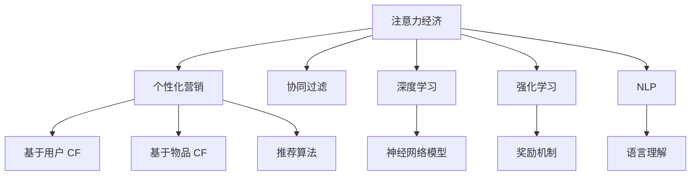

                 

# 注意力经济与个性化营销：为受众创建定制、有针对性的信息

## 1. 背景介绍

### 1.1 问题由来

在当今信息爆炸的时代，如何使信息在人群中脱颖而出，被目标受众接收并转化为实际价值，是一个日益严峻的问题。随着数字营销、内容创作和广告投放的不断演进，“注意力经济”的概念应运而生，旨在通过个性化的信息展示和精准化的营销手段，吸引并保留用户的关注。

### 1.2 问题核心关键点

个性化营销的核心在于基于用户的兴趣和行为，推送定制化的内容，实现从“一视同仁”的广播式营销，到“一对一”的精准营销的转变。这不仅能够提升用户的品牌认知和满意度，也能够为广告主带来更高的投资回报率。

个性化营销需要解决的核心问题包括：
1. 如何高效收集和分析用户行为数据。
2. 如何从海量数据中提取有用的信息，生成个性化的内容。
3. 如何将个性化的内容以合适的方式推送给用户，最大化其价值。

## 2. 核心概念与联系

### 2.1 核心概念概述

为更好地理解注意力经济和个性化营销，本节将介绍几个密切相关的核心概念：

- 注意力经济（Attention Economy）：指通过聚焦用户注意力来创造价值的经济活动。在信息过载的背景下，注意力成为稀缺资源，用户的选择性接收和注意对产品或服务至关重要。

- 个性化营销（Personalized Marketing）：根据用户的行为和偏好，定制个性化的营销信息和内容，提高营销效果和用户满意度。

- 协同过滤（Collaborative Filtering）：利用用户行为数据进行推荐，包括基于用户（User-Based CF）和基于物品（Item-Based CF）两种方式。

- 深度学习（Deep Learning）：一种模拟人类深度神经网络的技术，通过多层次的特征学习，提升模型的预测能力和泛化能力。

- 强化学习（Reinforcement Learning）：通过与环境的交互，使智能体学习最优策略，逐步优化个性化推荐系统。

- 自然语言处理（Natural Language Processing, NLP）：涉及语言模型、文本分类、信息抽取、对话系统等技术，助力生成自然流畅的个性化推荐文本。

这些核心概念之间的逻辑关系可以通过以下Mermaid流程图来展示：



这个流程图展示了几组概念之间的联系：

1. 注意力经济为个性化营销提供了理论和实践基础。
2. 个性化营销中的协同过滤、深度学习和强化学习等技术，是其核心的实现手段。
3. NLP技术在个性化推荐文本生成中发挥重要作用。

## 3. 核心算法原理 & 具体操作步骤
### 3.1 算法原理概述

个性化营销的核心算法原理是基于用户行为数据和偏好，进行个性化内容生成和推荐。具体步骤如下：

1. **数据收集与预处理**：收集用户的历史行为数据，包括浏览记录、购买记录、评价反馈等，并进行清洗和标准化。
2. **用户画像构建**：利用机器学习算法，分析用户行为数据，构建用户画像，识别用户的兴趣和需求。
3. **个性化内容生成**：根据用户画像，生成个性化的推荐内容，如商品推荐、新闻资讯、个性化广告等。
4. **推荐模型训练**：使用协同过滤、深度学习等技术，训练推荐模型，优化推荐效果。
5. **个性化展示**：通过网站、APP、邮件等方式，将个性化内容推送给目标用户。

### 3.2 算法步骤详解

个性化营销的推荐算法通常包括以下几个关键步骤：

**Step 1: 数据收集与预处理**
- 通过Web爬虫、API接口等方式，收集用户行为数据。
- 对数据进行清洗、去重、归一化处理，去除噪音和无用信息。

**Step 2: 用户画像构建**
- 使用协同过滤算法（如基于用户的CF、基于物品的CF），构建用户画像，分析用户兴趣和行为。
- 利用深度学习算法（如Word2Vec、BERT等），对用户行为数据进行特征提取，形成用户向量表示。

**Step 3: 个性化内容生成**
- 使用NLP技术（如文本生成模型），生成个性化的推荐文本。
- 使用强化学习技术（如Q-learning、RL），优化文本生成的策略，提升内容质量。

**Step 4: 推荐模型训练**
- 利用历史数据，训练推荐模型，如协同过滤、深度学习等。
- 使用交叉验证等方法，评估模型的效果，调整模型参数。

**Step 5: 个性化展示**
- 通过用户画像和推荐模型，生成个性化的推荐结果。
- 使用A/B测试等方法，评估推荐效果，优化推荐策略。

### 3.3 算法优缺点

个性化营销的算法有以下优点：
1. 提升用户体验：通过个性化的内容推荐，满足用户的多样化需求，提升用户体验。
2. 提高转化率：根据用户的兴趣和行为，推送相关产品，提高购买转化率。
3. 优化广告效果：通过精准投放，提高广告的点击率和转化率，降低广告成本。

同时，该算法也存在以下局限性：
1. 依赖用户数据：个性化营销的效果很大程度上取决于用户行为数据的丰富程度和准确性，难以覆盖长尾需求。
2. 隐私问题：用户数据隐私保护是亟待解决的问题，需要合法合规地收集和使用数据。
3. 冷启动问题：新用户没有历史行为数据，难以构建用户画像，需要其他方式获取信息。
4. 算法复杂度：深度学习和强化学习等复杂算法，需要大量的计算资源和时间。

尽管存在这些局限性，但就目前而言，个性化营销仍是最主流的内容推荐方式。未来相关研究的重点在于如何进一步降低推荐模型的计算成本，优化推荐效果，同时兼顾隐私保护和公平性等因素。

### 3.4 算法应用领域

个性化营销技术在多个领域得到了广泛的应用，如：

- 电商平台：根据用户浏览和购买历史，推荐相关商品。
- 新闻媒体：根据用户阅读和评价记录，推送个性化新闻。
- 社交网络：根据用户互动行为，推荐相关内容和好友。
- 旅游应用：根据用户搜索和预订历史，推荐旅游路线和景点。
- 视频平台：根据用户观看记录，推荐相关视频和频道。

除了上述这些经典应用外，个性化营销技术还被创新性地应用到更多场景中，如智能客服、个性化推荐系统、智能广告投放等，为提高用户体验和运营效率提供了新的思路。

## 4. 数学模型和公式 & 详细讲解
### 4.1 数学模型构建

本节将使用数学语言对个性化推荐系统进行更加严格的刻画。

记用户画像为 $U$，内容库为 $I$，推荐结果为 $R$，历史行为数据为 $D=\{(u,i,r)\}_{i=1}^N$，其中 $u$ 为用户，$i$ 为内容，$r$ 为行为（如点击、购买等）。推荐模型的目标是最小化预测误差，即找到最优推荐策略：

$$
\min_{\theta} \sum_{(u,i)\in D}(r_{ui} - f(u,i;\theta))^2
$$

其中 $f(u,i;\theta)$ 为推荐模型，$\theta$ 为模型参数。

### 4.2 公式推导过程

以协同过滤算法为例，公式推导如下：

设 $N_u$ 为用户集合，$N_i$ 为内容集合，$u\sim U(N_u)$，$i\sim I(N_i)$。协同过滤的目标是找到用户与内容的相似度矩阵 $C_{ui}$，然后根据相似度矩阵进行推荐。

假设已获得用户与内容之间的相似度矩阵 $C_{ui}$，推荐公式为：

$$
f(u,i;\theta) = \sum_{j \in N_i} C_{uj} r_{ji}
$$

其中 $r_{ji}$ 为用户 $u$ 对内容 $j$ 的行为，$\theta$ 为模型参数。

在实际应用中，需要进一步优化公式，如采用正则化技术、引入稀疏矩阵等，以提升推荐模型的泛化能力和实际效果。

### 4.3 案例分析与讲解

以一个电商平台的商品推荐系统为例，详细分析推荐算法的过程：

1. **数据收集**：收集用户浏览历史、购买记录、评分数据等，构建数据集 $D$。

2. **用户画像**：使用协同过滤算法，分析用户行为数据，得到用户与商品的相似度矩阵 $C_{ui}$。

3. **内容生成**：根据相似度矩阵，生成个性化推荐列表。例如，用户 $u$ 喜欢的内容 $i_1,i_2,\cdots,i_k$，推荐相关商品 $j_1,j_2,\cdots,j_m$。

4. **模型训练**：使用深度学习模型，对用户行为数据进行特征提取，构建用户向量表示 $u'$。将用户向量与商品向量 $i'$ 计算相似度，生成推荐列表。

5. **评估优化**：使用A/B测试等方法，评估推荐效果，调整模型参数，优化推荐策略。

## 5. 项目实践：代码实例和详细解释说明
### 5.1 开发环境搭建

在进行推荐系统开发前，我们需要准备好开发环境。以下是使用Python进行PyTorch开发的环境配置流程：

1. 安装Anaconda：从官网下载并安装Anaconda，用于创建独立的Python环境。

2. 创建并激活虚拟环境：
```bash
conda create -n pytorch-env python=3.8 
conda activate pytorch-env
```

3. 安装PyTorch：根据CUDA版本，从官网获取对应的安装命令。例如：
```bash
conda install pytorch torchvision torchaudio cudatoolkit=11.1 -c pytorch -c conda-forge
```

4. 安装相关库：
```bash
pip install pandas scikit-learn numpy
```

完成上述步骤后，即可在`pytorch-env`环境中开始推荐系统开发。

### 5.2 源代码详细实现

这里我们以协同过滤算法为例，使用PyTorch实现一个简单的商品推荐系统。

首先，定义数据集：

```python
import pandas as pd
import torch

# 读取数据集
df = pd.read_csv('user_item_data.csv', sep='\t')

# 将用户ID和商品ID映射为连续的整数
user_id = pd.factorize(df['user_id'])[0]
item_id = pd.factorize(df['item_id'])[0]

# 将行为转化为one-hot编码
df['is_buy'] = df['is_buy'].map({'1': 1, '0': 0})
df['is_buy'] = df['is_buy'].values.reshape(-1, 1)

# 划分训练集和测试集
train_df = df.sample(frac=0.7, random_state=0)
test_df = df.drop(train_df.index)
```

然后，定义协同过滤模型：

```python
from torch import nn, optim
from torch.nn.functional import softmax

class CF(nn.Module):
    def __init__(self, num_users, num_items, embed_size):
        super(CF, self).__init__()
        self.num_users = num_users
        self.num_items = num_items
        self.user_embed = nn.Embedding(num_users, embed_size)
        self.item_embed = nn.Embedding(num_items, embed_size)
        self.linear = nn.Linear(embed_size * 2, 1)

    def forward(self, user_id, item_id):
        user = self.user_embed(user_id)
        item = self.item_embed(item_id)
        concat = torch.cat([user, item], dim=1)
        rating = self.linear(concat)
        return softmax(rating, dim=1)

# 模型参数
num_users = 50000
num_items = 20000
embed_size = 64

model = CF(num_users, num_items, embed_size)
optimizer = optim.Adam(model.parameters(), lr=0.01)
```

接着，定义训练函数：

```python
def train_epoch(model, user_ids, item_ids, is_buys, optimizer):
    model.train()
    losses = []
    for user_id, item_id, buy in zip(user_ids, item_ids, is_buys):
        output = model(user_id, item_id)
        loss = nn.BCEWithLogitsLoss()(output, buy)
        losses.append(loss.item())
        optimizer.zero_grad()
        loss.backward()
        optimizer.step()
    return sum(losses) / len(losses)
```

最后，启动训练流程并在测试集上评估：

```python
# 数据加载
train_loader = torch.utils.data.DataLoader(train_df, batch_size=64)
test_loader = torch.utils.data.DataLoader(test_df, batch_size=64)

# 训练模型
epochs = 10
for epoch in range(epochs):
    loss = train_epoch(model, user_ids, item_ids, is_buys, optimizer)
    print(f'Epoch {epoch+1}, train loss: {loss:.3f}')
    
# 测试模型
with torch.no_grad():
    correct = 0
    total = 0
    for user_id, item_id, buy in test_loader:
        output = model(user_id, item_id)
        _, predicted = torch.max(output, 1)
        total += buy.size(0)
        correct += (predicted == buy).sum().item()
    print(f'Test set accuracy: {correct / total:.3f}')
```

以上就是使用PyTorch实现协同过滤算法的完整代码。可以看到，通过简单的数据处理和模型构建，我们就能够构建一个基本的商品推荐系统。

### 5.3 代码解读与分析

让我们再详细解读一下关键代码的实现细节：

**数据处理**：
- 使用Pandas库读取用户和商品的行为数据，进行去重、归一化等预处理。
- 将用户ID和商品ID转化为连续的整数ID，方便模型处理。
- 将行为转化为one-hot编码，方便模型进行分类任务。

**模型定义**：
- 定义协同过滤模型，包括用户嵌入层、物品嵌入层和线性层，用于计算用户和物品之间的相似度。
- 使用Adam优化器进行模型参数优化。

**训练函数**：
- 在每个epoch内，使用模型对训练集数据进行前向传播和反向传播，计算损失并更新模型参数。
- 使用BCEWithLogitsLoss作为损失函数，进行二分类任务的预测。

**测试函数**：
- 在测试集上评估模型效果，计算准确率。

## 6. 实际应用场景
### 6.1 智能客服系统

智能客服系统可以利用个性化营销技术，根据用户的历史咨询记录，生成个性化的回复内容。通过机器学习技术，不断优化回复策略，提升客服系统的智能化水平和用户体验。

具体而言，可以收集用户在客服系统中的历史咨询记录，包括咨询问题、回答、满意度等信息。利用协同过滤算法，分析用户的行为数据，构建用户画像，生成个性化回复。同时，可以引入NLP技术，优化回复内容的自然流畅度。通过持续迭代优化，实现智能客服的精准化和个性化。

### 6.2 金融产品推荐

金融产品推荐系统可以利用个性化营销技术，根据用户的投资记录、行为偏好等信息，推荐合适的金融产品。通过深度学习和强化学习等技术，不断优化推荐策略，提升投资回报率和用户满意度。

具体而言，可以收集用户在金融平台上的历史行为数据，包括浏览记录、交易记录、评价反馈等。利用协同过滤和深度学习算法，构建用户画像，生成个性化产品推荐。同时，可以引入强化学习技术，优化推荐策略，提升推荐效果。通过持续迭代优化，实现金融产品推荐的精准化和个性化。

### 6.3 内容平台个性化推荐

内容平台如视频网站、社交网络等，可以利用个性化营销技术，根据用户的历史浏览、观看、点赞等信息，推荐相关内容。通过协同过滤和深度学习等技术，不断优化推荐策略，提升用户黏性和满意度。

具体而言，可以收集用户在平台上的历史行为数据，包括观看记录、点赞、分享等信息。利用协同过滤和深度学习算法，构建用户画像，生成个性化内容推荐。同时，可以引入强化学习技术，优化推荐策略，提升推荐效果。通过持续迭代优化，实现内容推荐的精准化和个性化。

### 6.4 未来应用展望

随着个性化营销技术的不断发展，未来将在更多领域得到应用，为传统行业带来变革性影响。

在智慧医疗领域，利用个性化营销技术，可以推荐个性化的健康信息、医疗产品等，提高用户的健康水平和医疗体验。在教育领域，可以利用个性化营销技术，推荐个性化的学习内容、辅导资源等，提升教育质量和效果。在智慧城市治理中，可以利用个性化营销技术，推荐个性化的服务内容、活动信息等，提升城市的智能化水平。

除了上述这些经典应用外，个性化营销技术还被创新性地应用到更多场景中，如智能家居、智慧旅游、智能农业等，为各行各业提供更个性化的服务，提升用户体验和运营效率。相信随着技术的日益成熟，个性化营销技术必将引领数字经济向更加智能化、普适化方向发展，为人类生活带来更多便利和价值。

## 7. 工具和资源推荐
### 7.1 学习资源推荐

为了帮助开发者系统掌握个性化推荐系统的理论基础和实践技巧，这里推荐一些优质的学习资源：

1. 《推荐系统实战》系列博文：由推荐系统领域专家撰写，深入浅出地介绍了推荐系统的工作原理和常用算法，包括协同过滤、深度学习等。

2. Coursera《Recommender Systems》课程：斯坦福大学开设的推荐系统课程，有Lecture视频和配套作业，带你入门推荐系统领域的基本概念和经典模型。

3. 《推荐系统》书籍：由Amazon推荐系统工程师编写，全面介绍了推荐系统的构建与优化，包括协同过滤、深度学习等技术。

4. Kaggle推荐系统竞赛：提供大量的推荐系统数据集和样例代码，帮助你深入理解推荐系统的工作机制和实际应用。

通过对这些资源的学习实践，相信你一定能够快速掌握个性化推荐系统的精髓，并用于解决实际的推荐问题。

### 7.2 开发工具推荐

高效的开发离不开优秀的工具支持。以下是几款用于推荐系统开发的常用工具：

1. PyTorch：基于Python的开源深度学习框架，灵活动态的计算图，适合快速迭代研究。大部分推荐系统都有PyTorch版本的实现。

2. TensorFlow：由Google主导开发的开源深度学习框架，生产部署方便，适合大规模工程应用。同样有丰富的推荐系统资源。

3. LightFM：由Google开源的推荐系统框架，支持协同过滤、深度学习等技术，易于部署和使用。

4. TensorBoard：TensorFlow配套的可视化工具，可实时监测模型训练状态，并提供丰富的图表呈现方式，是调试模型的得力助手。

5. Tune：Facebook开源的超参数优化工具，帮助推荐系统自动调整模型参数，优化推荐效果。

合理利用这些工具，可以显著提升个性化推荐系统的开发效率，加快创新迭代的步伐。

### 7.3 相关论文推荐

推荐系统的发展源于学界的持续研究。以下是几篇奠基性的相关论文，推荐阅读：

1. Item-Based Collaborative Filtering：提出基于物品的协同过滤算法，利用用户对物品的相似性进行推荐。

2. Matrix Factorization Techniques for Recommender Systems：提出矩阵分解算法，通过低秩矩阵分解，提取用户和物品的潜在特征，生成推荐结果。

3. Deep Learning Recommendation Systems：介绍深度学习在推荐系统中的应用，包括基于深度神经网络的推荐模型。

4. The Surprising Power of Inductive Biases：深入分析了推荐系统中各种算法的表现，强调了模型偏置的重要性。

5. AutoInt：提出自注意力机制，通过自注意力机制提升推荐系统的性能，取得了优异的推荐效果。

这些论文代表了大推荐系统的发展脉络。通过学习这些前沿成果，可以帮助研究者把握学科前进方向，激发更多的创新灵感。

## 8. 总结：未来发展趋势与挑战
### 8.1 总结

本文对基于协同过滤的个性化推荐系统进行了全面系统的介绍。首先阐述了个性化推荐系统的发展背景和意义，明确了推荐系统在提升用户体验和运营效率方面的独特价值。其次，从原理到实践，详细讲解了协同过滤算法的数学原理和关键步骤，给出了推荐系统开发的完整代码实例。同时，本文还广泛探讨了推荐系统在智能客服、金融产品推荐、内容平台推荐等多个行业领域的应用前景，展示了推荐系统的巨大潜力。

通过本文的系统梳理，可以看到，基于协同过滤的个性化推荐系统已经成为推荐领域的重要范式，极大地提升了推荐效果和用户体验，推动了推荐系统的产业化进程。未来，伴随推荐算法的持续演进，推荐系统必将在更广阔的应用领域发挥作用，为各行各业带来新的价值。

### 8.2 未来发展趋势

展望未来，推荐系统的技术将呈现以下几个发展趋势：

1. 模型规模持续增大。随着算力成本的下降和数据规模的扩张，推荐系统的参数量还将持续增长。超大规模推荐模型蕴含的丰富信息，有望支撑更加复杂多变的推荐场景。

2. 模型结构更加多样。推荐系统将不再局限于基于协同过滤的方法，更多深度学习、强化学习等复杂模型将被引入，提升推荐效果。

3. 跨模态推荐兴起。当前的推荐系统大多聚焦于文本和图像等单一模态，未来会进一步拓展到视频、音频等多模态数据推荐。多模态信息的融合，将显著提升推荐系统的泛化能力和鲁棒性。

4. 个性化推荐更加精准。通过引入因果推断、自适应学习等技术，推荐系统将更好地理解用户行为背后的因果关系，生成更加精准的推荐结果。

5. 推荐效果实时化。推荐系统将引入实时计算技术，能够根据用户的即时行为数据，动态调整推荐策略，提升推荐效果。

6. 推荐模型全过程可解释。推荐系统的决策过程将具备更高的可解释性和可审计性，帮助用户理解推荐逻辑，提升信任度。

以上趋势凸显了个性化推荐系统的广阔前景。这些方向的探索发展，必将进一步提升推荐系统的性能和应用范围，为各行各业带来新的价值。

### 8.3 面临的挑战

尽管个性化推荐系统已经取得了瞩目成就，但在迈向更加智能化、普适化应用的过程中，它仍面临诸多挑战：

1. 数据隐私问题：推荐系统需要大量用户数据支持，但用户数据隐私保护成为亟待解决的问题。如何合法合规地收集和使用数据，是推荐系统需要面对的重要挑战。

2. 推荐冷启动问题：新用户没有历史行为数据，难以构建用户画像，需要其他方式获取信息。如何提升推荐系统对新用户的覆盖和推荐效果，是推荐系统需要解决的重要问题。

3. 计算资源消耗大：推荐系统通常需要处理大规模数据，对计算资源和时间的要求较高。如何优化推荐系统的计算效率，降低计算成本，是推荐系统需要解决的重要问题。

4. 推荐算法复杂度：深度学习和强化学习等复杂算法，需要大量的计算资源和时间。如何优化推荐算法的计算复杂度，提升模型训练和推理效率，是推荐系统需要解决的重要问题。

5. 推荐模型公平性：推荐系统可能存在推荐偏见和歧视问题，如何保证推荐模型的公平性，避免对某些用户群体的不公平对待，是推荐系统需要解决的重要问题。

6. 推荐模型实时性：推荐系统需要实时响应用户的即时行为，如何提高推荐模型的实时性，降低延迟，是推荐系统需要解决的重要问题。

正视推荐系统面临的这些挑战，积极应对并寻求突破，将是大推荐系统向成熟发展的重要方向。相信随着学界和产业界的共同努力，这些挑战终将一一被克服，推荐系统必将在构建人机协同的智能时代中扮演越来越重要的角色。

### 8.4 未来突破

面对推荐系统面临的种种挑战，未来的研究需要在以下几个方面寻求新的突破：

1. 探索无监督和半监督推荐方法。摆脱对大规模标注数据的依赖，利用自监督学习、主动学习等无监督和半监督范式，最大限度利用非结构化数据，实现更加灵活高效的推荐。

2. 研究参数高效和计算高效的推荐范式。开发更加参数高效的推荐方法，在固定大部分推荐参数的同时，只更新极少量的任务相关参数。同时优化推荐模型的计算图，减少前向传播和反向传播的资源消耗，实现更加轻量级、实时性的部署。

3. 引入更多先验知识。将符号化的先验知识，如知识图谱、逻辑规则等，与神经网络模型进行巧妙融合，引导推荐过程学习更准确、合理的推荐信息。同时加强不同模态数据的整合，实现视觉、语音等多模态信息与文本信息的协同建模。

4. 结合因果分析和博弈论工具。将因果分析方法引入推荐系统，识别出推荐决策的关键特征，增强推荐结果的因果性和逻辑性。借助博弈论工具刻画人机交互过程，主动探索并规避推荐模型的脆弱点，提高系统稳定性。

5. 纳入伦理道德约束。在推荐系统的目标中引入伦理导向的评估指标，过滤和惩罚有偏见、有害的输出倾向。同时加强人工干预和审核，建立推荐行为的监管机制，确保推荐内容的合法合规。

这些研究方向的探索，必将引领推荐系统技术迈向更高的台阶，为构建安全、可靠、可解释、可控的智能系统铺平道路。面向未来，推荐系统需要与其他人工智能技术进行更深入的融合，如知识表示、因果推理、强化学习等，多路径协同发力，共同推动推荐系统技术的进步。只有勇于创新、敢于突破，才能不断拓展推荐系统的边界，让智能技术更好地造福人类社会。

## 9. 附录：常见问题与解答

**Q1：推荐系统如何处理新用户？**

A: 对于新用户，推荐系统需要采用其他方式获取其行为数据，如通过问卷调查、注册信息、社交网络等渠道。基于这些数据，推荐系统可以使用协同过滤、深度学习等技术，构建新用户的用户画像，进行个性化推荐。

**Q2：推荐系统如何避免过拟合？**

A: 过拟合是推荐系统面临的主要挑战。推荐的精度和泛化能力之间需要平衡。常见的避免过拟合的策略包括：
1. 数据增强：通过回译、近义替换等方式扩充训练集。
2. 正则化：使用L2正则、Dropout等技术，防止模型过度适应训练数据。
3. 对抗训练：引入对抗样本，提高模型鲁棒性。
4. 参数高效：采用参数高效的推荐方法，如Adapter、LoRA等，在固定大部分推荐参数的同时，只更新极少量的任务相关参数。

这些策略往往需要根据具体任务和数据特点进行灵活组合。只有在数据、模型、训练、推理等各环节进行全面优化，才能最大限度地发挥推荐系统的威力。

**Q3：推荐系统如何实现跨模态推荐？**

A: 跨模态推荐系统需要处理多种数据类型，如文本、图像、视频、音频等。常见的跨模态推荐方法包括：
1. 特征融合：通过特征对齐和融合技术，将不同模态的数据特征合并为一个向量，进行推荐。
2. 联合训练：在推荐模型的训练过程中，同时优化多模态数据的特征提取和融合。
3. 跨模态注意力：通过引入跨模态注意力机制，在不同的模态数据之间建立关联，提升推荐效果。

以上方法需要根据具体任务选择合适的技术，综合应用不同模态的数据信息，提升推荐系统的泛化能力和鲁棒性。

**Q4：推荐系统如何处理数据隐私问题？**

A: 数据隐私是推荐系统面临的重要挑战。为保护用户隐私，推荐系统可以采用以下措施：
1. 匿名化处理：将用户数据进行匿名化处理，去除可能泄露用户隐私的信息。
2. 差分隐私：在推荐模型的训练过程中，使用差分隐私技术，限制对用户数据的访问范围。
3. 联邦学习：通过分布式训练技术，在用户端和服务器端协同训练模型，减少对用户数据的集中存储。
4. 用户控制：提供用户自主控制权限，允许用户自行选择是否参与推荐模型的训练和使用。

通过这些措施，可以有效地保护用户隐私，确保推荐系统的合法合规性。

---

作者：禅与计算机程序设计艺术 / Zen and the Art of Computer Programming

