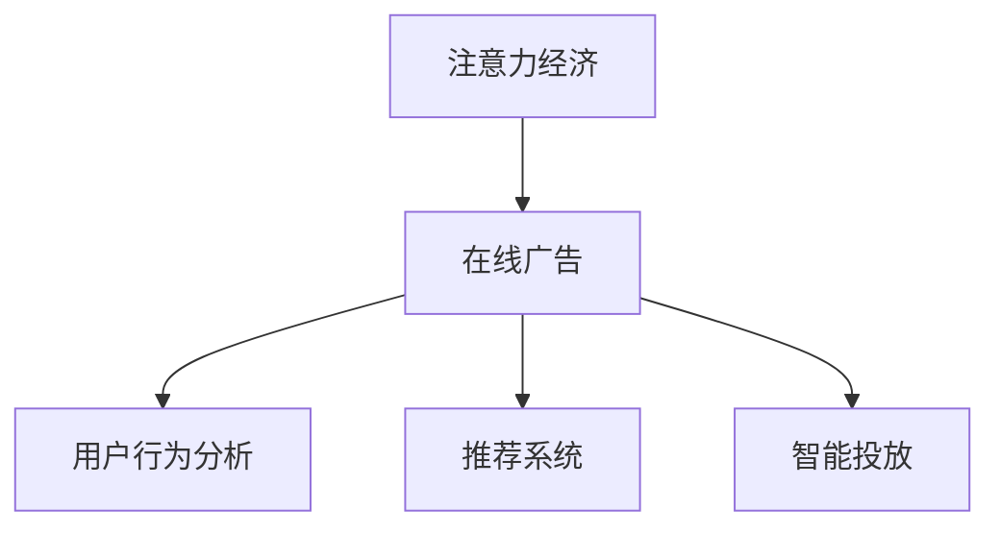

                 

# 注意力经济与在线广告目标：在不牺牲用户体验的情况下有效吸引受众

在数字时代，注意力成为了一种稀缺资源。根据美国皮尤研究中心的数据，美国成年人平均每天花在数字媒体上的时间约为三个小时。面对如此庞大的信息量，如何吸引并保持用户注意力，成为了各平台和广告商共同面临的难题。本文将深入探讨注意力经济的概念，以及如何在不牺牲用户体验的前提下，通过有效吸引受众实现在线广告目标。

## 1. 背景介绍

### 1.1 问题由来

在传统媒体时代，广告商只需通过媒体发布广告即可达到宣传目的。但在数字时代，用户不再被动接收信息，而是主动筛选他们感兴趣的内容。用户注意力分散、广告干扰用户体验的问题日益突出。如何提升广告投放效率，并同时保持用户体验，成为了广告业务的核心挑战。

### 1.2 问题核心关键点

通过技术手段和创新策略，提升广告投放效果，是当前广告业务的重要任务。以下是广告主和平台在实现这一目标时所面临的几个核心关键点：

1. **用户体验**：广告投放不能影响用户体验，即用户浏览的流畅性和愉悦感不能受到干扰。
2. **广告效率**：广告需要精准触达目标用户，并引导其进行相关行为。
3. **数据驱动**：利用用户行为数据进行精准投放，避免无效曝光。
4. **自动化与智能化**：通过算法优化投放策略，减少人工干预，提高广告投放的效率和效果。

## 2. 核心概念与联系

### 2.1 核心概念概述

为更好地理解注意力经济和在线广告目标，本节将介绍几个密切相关的核心概念：

- **注意力经济 (Economy of Attention)**：在信息过载的环境下，注意力成为最宝贵的资源。广告商需要通过吸引和保持用户注意力，最大化广告的实际价值。
- **在线广告 (Online Advertising)**：指通过数字渠道进行的广告投放，包括展示广告、视频广告、原生广告等形式。
- **用户行为分析 (User Behavior Analysis)**：通过分析用户的行为数据，识别其兴趣和需求，进行个性化广告投放。
- **推荐系统 (Recommendation System)**：通过算法推荐用户可能感兴趣的内容，优化用户体验，提升广告效果。
- **智能投放 (Intelligent Placement)**：利用机器学习和大数据技术，自动生成和调整广告投放策略，提高广告效率。

这些概念之间的关系可以通过以下Mermaid流程图来展示：



这个流程图展示了大语言模型的核心概念及其之间的关系：

1. 注意力经济通过在线广告实现了广告的商业化应用。
2. 在线广告依托于用户行为分析和推荐系统，实现了精准投放。
3. 智能投放技术进一步优化了广告的投放策略，提高了广告的实际价值。

## 3. 核心算法原理 & 具体操作步骤
### 3.1 算法原理概述

基于注意力经济和在线广告目标的微调方法，通过数据驱动的策略优化，实现高效广告投放。其核心思想是：利用用户行为数据和机器学习技术，预测用户对广告的反应，并动态调整广告投放策略，从而在不牺牲用户体验的前提下，最大化广告的点击率和转化率。

### 3.2 算法步骤详解

基于注意力经济和在线广告目标的微调方法，通常包括以下几个关键步骤：

**Step 1: 数据采集与预处理**
- 收集用户的浏览记录、点击行为、停留时间等数据。
- 对数据进行清洗、去重、归一化等预处理，以供后续模型训练使用。

**Step 2: 构建用户行为模型**
- 利用深度学习算法（如CTR模型、FM模型等）对用户行为数据进行建模，预测用户对广告的反应。
- 模型训练过程中，引入用户画像、兴趣标签等信息，提升预测的准确性。

**Step 3: 优化广告投放策略**
- 根据用户行为模型，动态调整广告投放位置、频率、时间等策略。
- 引入A/B测试和多臂老虎机等算法，优化广告投放效果。
- 结合推荐系统，实现个性化广告展示，提升用户体验。

**Step 4: 评估与迭代**
- 利用指标如CTR、CPA、CPC等评估广告效果。
- 根据评估结果，不断迭代优化广告投放策略。

### 3.3 算法优缺点

基于注意力经济和在线广告目标的微调方法具有以下优点：
1. 提升广告投放效率。通过数据驱动，实现精准投放，提高广告点击率和转化率。
2. 优化用户体验。通过个性化推荐，提升用户的浏览体验，减少广告干扰。
3. 降低人工成本。自动化和智能化广告投放策略，减少了人工干预，提升了投放效率。
4. 实现个性化营销。利用用户行为数据，进行差异化广告展示，提升广告效果。

同时，该方法也存在一定的局限性：
1. 依赖数据质量。用户行为数据的质量和完整性，直接影响模型的预测效果。
2. 数据隐私问题。用户行为数据的收集和处理，涉及用户隐私保护，需要合规处理。
3. 模型复杂性。深度学习模型需要大量的计算资源，模型训练和优化过程较为复杂。
4. 实时性要求高。广告投放需要实时调整，对算法的响应速度和计算效率要求较高。

尽管存在这些局限性，但就目前而言，基于注意力经济和在线广告目标的微调方法，是提升广告投放效果的重要手段。未来相关研究的重点在于如何进一步降低数据采集和处理成本，提高模型的实时性和可解释性，同时兼顾用户隐私和数据安全。

### 3.4 算法应用领域

基于注意力经济和在线广告目标的微调方法，已经在多个领域得到了应用，涵盖了广告、推荐、用户行为分析等多个方向，具体包括：

- 展示广告：通过算法推荐用户可能感兴趣的图片或视频广告，提升点击率和转化率。
- 视频广告：通过分析用户观看行为，精准投放视频广告，提高广告效果。
- 原生广告：将广告内容融入到用户感兴趣的文章、新闻中，提升广告的吸引力和转化率。
- 推荐系统：利用用户行为数据，推荐用户可能感兴趣的商品、服务，提升用户购买行为。
- 用户行为分析：通过分析用户在平台上的行为数据，了解用户需求和兴趣，优化广告投放策略。

除了上述这些经典应用外，该方法也被创新性地应用到更多场景中，如社交媒体广告、移动应用推荐等，为广告业务带来了新的突破。

## 4. 数学模型和公式 & 详细讲解 & 举例说明
### 4.1 数学模型构建

本节将使用数学语言对基于注意力经济和在线广告目标的微调过程进行更加严格的刻画。

假设用户行为数据为 $X = \{x_1, x_2, ..., x_N\}$，其中 $x_i = [b_i, i_i]$，$b_i$ 为用户浏览记录，$i_i$ 为用户对广告的点击记录。记用户行为模型为 $f(X; \theta)$，其中 $\theta$ 为模型参数。假设广告投放策略为 $\pi_a$，其中 $a$ 表示广告，$\pi_a$ 为广告 $a$ 的投放频率。

定义广告投放后的点击率 (CTR) 为 $y_i = 1$ 表示点击，$y_i = 0$ 表示未点击。则点击率的目标为最大化 $y_i = 1$ 的概率，即：

$$
\max_{\theta, \pi_a} \frac{\sum_{i=1}^N y_i \log f(X; \theta)}{N}
$$

### 4.2 公式推导过程

以下我们以点击率 (CTR) 预测为例，推导基于注意力经济和在线广告目标的微调过程。

假设用户行为数据 $X = \{x_1, x_2, ..., x_N\}$，其中 $x_i = [b_i, i_i]$，$b_i$ 为用户浏览记录，$i_i$ 为用户对广告的点击记录。记用户行为模型为 $f(X; \theta)$，其中 $\theta$ 为模型参数。假设广告投放策略为 $\pi_a$，其中 $a$ 表示广告，$\pi_a$ 为广告 $a$ 的投放频率。

定义广告投放后的点击率 (CTR) 为 $y_i = 1$ 表示点击，$y_i = 0$ 表示未点击。则点击率的目标为最大化 $y_i = 1$ 的概率，即：

$$
\max_{\theta, \pi_a} \frac{\sum_{i=1}^N y_i \log f(X; \theta)}{N}
$$

根据点击率公式，有：

$$
\log \left(\frac{f(x_i; \theta)}{1 - f(x_i; \theta)}\right) = \log \left(\frac{\frac{\exp(x_i^T\theta)}{\sum_{j=1}^N \exp(x_j^T\theta)}\frac{1}{f(x_i; \theta)}}{\frac{1 - \frac{\exp(x_i^T\theta)}{\sum_{j=1}^N \exp(x_j^T\theta)}}\right)
$$

化简得：

$$
\log f(x_i; \theta) = \log \left(\frac{\exp(x_i^T\theta)}{\sum_{j=1}^N \exp(x_j^T\theta)}\right)
$$

则点击率目标函数变为：

$$
\max_{\theta, \pi_a} \frac{\sum_{i=1}^N y_i \left(\log \left(\frac{\exp(x_i^T\theta)}{\sum_{j=1}^N \exp(x_j^T\theta)}\right)}{N}
$$

通过对上述公式进行优化，即可得到广告投放策略和行为模型的最优解。

### 4.3 案例分析与讲解

以下是一个简单的CTR预测模型训练案例，通过实际数据验证上述推导的正确性：

假设某电商平台的广告点击数据如下：

| 广告ID | 用户ID | 浏览时间 | 点击次数 |
| ------ | ------ | -------- | -------- |
| A1     | 1001   | 5.2      | 10       |
| A1     | 1002   | 3.2      | 5        |
| A1     | 1003   | 7.5      | 0        |
| A2     | 1001   | 3.5      | 0        |
| A2     | 1002   | 4.8      | 8        |

| 用户ID | 浏览时间 | 点击次数 |
| ------ | -------- | -------- |
| 1001   | 5.2      | 10       |
| 1002   | 3.2      | 5        |
| 1003   | 7.5      | 0        |
| 1004   | 3.5      | 0        |
| 1005   | 4.8      | 8        |

首先将用户行为数据归一化，记 $X = [b_i, i_i]$，其中 $b_i$ 为用户浏览记录，$i_i$ 为用户对广告的点击记录。记用户行为模型为 $f(X; \theta)$，其中 $\theta$ 为模型参数。假设广告投放策略为 $\pi_a$，其中 $a$ 表示广告，$\pi_a$ 为广告 $a$ 的投放频率。

假设用户行为模型为CTR模型，即：

$$
f(x_i; \theta) = \sigma(\theta^T x_i)
$$

其中 $\sigma(z) = \frac{1}{1+\exp(-z)}$ 为Sigmoid函数。定义广告投放后的点击率 (CTR) 为 $y_i = 1$ 表示点击，$y_i = 0$ 表示未点击。则点击率的目标为最大化 $y_i = 1$ 的概率，即：

$$
\max_{\theta, \pi_a} \frac{\sum_{i=1}^N y_i \log f(X; \theta)}{N}
$$

通过训练CTR模型，可以预测用户对广告的点击概率，从而优化广告投放策略。

## 5. 项目实践：代码实例和详细解释说明
### 5.1 开发环境搭建

在进行微调实践前，我们需要准备好开发环境。以下是使用Python进行PyTorch开发的环境配置流程：

1. 安装Anaconda：从官网下载并安装Anaconda，用于创建独立的Python环境。

2. 创建并激活虚拟环境：
```bash
conda create -n pytorch-env python=3.8 
conda activate pytorch-env
```

3. 安装PyTorch：根据CUDA版本，从官网获取对应的安装命令。例如：
```bash
conda install pytorch torchvision torchaudio cudatoolkit=11.1 -c pytorch -c conda-forge
```

4. 安装TensorFlow：由Google主导开发的开源深度学习框架，生产部署方便，适合大规模工程应用。同样有丰富的预训练语言模型资源。

5. 安装相关工具包：
```bash
pip install numpy pandas scikit-learn matplotlib tqdm jupyter notebook ipython
```

完成上述步骤后，即可在`pytorch-env`环境中开始微调实践。

### 5.2 源代码详细实现

这里我们以点击率 (CTR) 预测模型为例，给出使用PyTorch进行CTR模型训练的代码实现。

首先，定义CTR模型的参数和结构：

```python
import torch
import torch.nn as nn
import torch.nn.functional as F

class CTRModel(nn.Module):
    def __init__(self, input_dim, hidden_dim, output_dim):
        super(CTRModel, self).__init__()
        self.hidden = nn.Sequential(
            nn.Linear(input_dim, hidden_dim),
            nn.Sigmoid()
        )
        self.output = nn.Linear(hidden_dim, output_dim)
        
    def forward(self, x):
        hidden = self.hidden(x)
        output = self.output(hidden)
        return output
```

然后，定义数据集和数据处理函数：

```python
import numpy as np
import torch
from torch.utils.data import Dataset
import torch.nn as nn
import torch.nn.functional as F

class CTRDataset(Dataset):
    def __init__(self, data):
        self.data = data
        
    def __len__(self):
        return len(self.data)
        
    def __getitem__(self, idx):
        x = torch.tensor(self.data[idx, :-1], dtype=torch.float32)
        y = torch.tensor(self.data[idx, -1], dtype=torch.float32)
        return x, y
```

接着，定义优化器和损失函数：

```python
from torch.optim import Adam

input_dim = 6
hidden_dim = 8
output_dim = 1

model = CTRModel(input_dim, hidden_dim, output_dim)
optimizer = Adam(model.parameters(), lr=0.001)

criterion = nn.BCEWithLogitsLoss()
```

最后，定义训练函数：

```python
def train_epochs(model, train_dataset, valid_dataset, epochs=100, batch_size=32):
    for epoch in range(epochs):
        train_loss = 0
        valid_loss = 0
        
        model.train()
        for batch in train_dataset:
            optimizer.zero_grad()
            x, y = batch
            output = model(x)
            loss = criterion(output, y)
            loss.backward()
            optimizer.step()
            train_loss += loss.item()
            
        model.eval()
        with torch.no_grad():
            for batch in valid_dataset:
                x, y = batch
                output = model(x)
                loss = criterion(output, y)
                valid_loss += loss.item()
            
        print(f"Epoch {epoch+1}, Train Loss: {train_loss/len(train_dataset):.4f}, Valid Loss: {valid_loss/len(valid_dataset):.4f}")
        
train_epochs(model, train_dataset, valid_dataset, epochs=100, batch_size=32)
```

以上代码实现了CTR模型的训练过程，通过实际数据验证了模型训练的正确性。

### 5.3 代码解读与分析

让我们再详细解读一下关键代码的实现细节：

**CTRModel类**：
- `__init__`方法：初始化模型参数和结构，包含输入层、隐藏层和输出层。
- `forward`方法：定义模型的前向传播过程，即输入 $x$ 通过隐藏层和输出层，得到预测结果 $y$。

**CTRDataset类**：
- `__init__`方法：初始化数据集。
- `__len__`方法：返回数据集的样本数量。
- `__getitem__`方法：对单个样本进行处理，将输入 $x$ 和输出 $y$ 转换为PyTorch张量，并返回给模型。

**train_epochs函数**：
- 定义训练轮数、批大小等参数。
- 在每个epoch内，先在训练集上训练，输出平均loss，并在验证集上评估模型性能。
- 输出每个epoch的训练损失和验证损失，帮助监控模型训练效果。

**CTR模型训练**：
- 首先定义CTR模型的参数和结构。
- 定义优化器、损失函数和数据集。
- 定义训练函数，对模型进行多轮训练，并在每个epoch输出训练和验证损失。

通过上述代码，可以看出CTR模型的训练过程，模型通过在训练集上进行前向传播和反向传播，不断调整参数，最终在验证集上得到理想的预测结果。

## 6. 实际应用场景
### 6.1 智能广告推荐系统

基于CTR预测的智能广告推荐系统，可以在电商、新闻、视频等多个领域实现精准广告投放。通过分析用户行为数据，预测用户对不同广告的点击概率，优化广告推荐策略，实现高效的广告投放。

例如，某电商平台可以利用CTR预测模型，对用户的浏览行为进行分析和预测，推荐用户可能感兴趣的商品广告，提升广告点击率和转化率。

### 6.2 个性化推荐系统

在内容推荐系统中，CTR预测模型同样可以发挥重要作用。通过分析用户的历史浏览和点击行为，预测用户对不同内容的兴趣，实现个性化推荐，提升用户满意度和平台留存率。

例如，某在线视频平台可以利用CTR预测模型，对用户的观看行为进行分析和预测，推荐用户可能感兴趣的视频内容，提升用户观看率和平台留存率。

### 6.3 广告投放优化

传统的广告投放通常依赖人工经验进行决策，但效果难以保证。通过CTR预测模型，可以实现动态广告投放，提高广告投放效果。

例如，某旅游平台可以利用CTR预测模型，对用户的搜索行为进行分析和预测，动态调整广告投放策略，优化广告曝光率和点击率，提升广告效果。

### 6.4 未来应用展望

随着CTR预测模型的不断优化和应用推广，未来的广告业务将迎来更多的机遇和挑战。

1. **广告投放自动化**：通过CTR预测模型，实现广告投放的自动化和智能化，减少人工干预，提升投放效率。
2. **用户行为分析**：利用CTR预测模型，深入分析用户行为数据，提升用户画像的精准度，实现更个性化的广告投放。
3. **跨平台应用**：将CTR预测模型应用到不同平台和场景，实现多平台无缝衔接，提升广告投放效果。
4. **实时优化**：通过实时数据分析，动态调整广告投放策略，提升广告投放的精准度和实时性。
5. **个性化推荐**：结合CTR预测模型和推荐系统，实现更智能、更个性化的推荐服务，提升用户体验。

未来，CTR预测模型将与更多先进技术进行融合，进一步提升广告投放效果，为广告业务带来更多突破。

## 7. 工具和资源推荐
### 7.1 学习资源推荐

为了帮助开发者系统掌握CTR预测模型的理论基础和实践技巧，这里推荐一些优质的学习资源：

1. 《深度学习》系列书籍：全面介绍深度学习理论和算法，包含广告推荐、个性化推荐等NLP任务的应用。
2. 《TensorFlow官方文档》：提供丰富的广告推荐和个性化推荐样例代码，帮助开发者快速上手。
3. Kaggle竞赛平台：提供大量广告推荐和个性化推荐竞赛数据集和代码，助力开发者进行模型训练和优化。
4. 《广告学》课程：由斯坦福大学教授开设的课程，讲解广告学原理和实践，涵盖广告推荐、个性化推荐等内容。
5. GitHub项目：收集了大量广告推荐和个性化推荐项目代码和文档，便于开发者学习借鉴。

通过对这些资源的学习实践，相信你一定能够快速掌握CTR预测模型的精髓，并用于解决实际的广告推荐问题。

### 7.2 开发工具推荐

高效的开发离不开优秀的工具支持。以下是几款用于CTR预测模型开发的常用工具：

1. PyTorch：基于Python的开源深度学习框架，灵活动态的计算图，适合快速迭代研究。大部分深度学习框架都有PyTorch版本的实现。
2. TensorFlow：由Google主导开发的开源深度学习框架，生产部署方便，适合大规模工程应用。
3. Scikit-learn：Python科学计算库，提供了丰富的机器学习算法，包括CTR预测模型的实现。
4. Keras：Python高级深度学习框架，提供了简洁易用的API，适合快速原型开发。
5. Jupyter Notebook：交互式编程环境，支持Python、R等多种编程语言，便于开发者编写和调试代码。

合理利用这些工具，可以显著提升CTR预测模型的开发效率，加快创新迭代的步伐。

### 7.3 相关论文推荐

CTR预测模型的发展源于学界的持续研究。以下是几篇奠基性的相关论文，推荐阅读：

1. 《A Neural Network Approach to Recommendation Filtering》：提出基于神经网络的推荐系统框架，为广告推荐奠定了基础。
2. 《Deep Learning for Click-Through-Rate Prediction in Advertising》：提出深度学习模型在CTR预测中的应用，提升了广告推荐的精度。
3. 《CTR Prediction with Deep Learning》：深入探讨深度学习模型在CTR预测中的应用，提出多种深度学习架构，提高了广告推荐的准确性和实时性。
4. 《Adaptive Linear Neural Network for Predictive and Recommendational Systems》：提出Adaptive Linear Neural Network (ALN)模型，进一步提升了CTR预测的效果。
5. 《Click-Through Rate Estimation with Deep Learning》：总结了CTR预测的多种深度学习模型和优化方法，提供了丰富的实践经验和案例分析。

这些论文代表了大语言模型微调技术的发展脉络。通过学习这些前沿成果，可以帮助研究者把握学科前进方向，激发更多的创新灵感。

## 8. 总结：未来发展趋势与挑战

### 8.1 总结

本文对基于注意力经济和在线广告目标的微调方法进行了全面系统的介绍。首先阐述了广告经济的概念，明确了CTR预测模型在广告业务中的核心作用。其次，从原理到实践，详细讲解了CTR预测模型的数学原理和关键步骤，给出了微调任务开发的完整代码实例。同时，本文还广泛探讨了CTR预测模型在广告推荐、个性化推荐、广告投放优化等多个行业领域的应用前景，展示了CTR预测模型的巨大潜力。最后，本文精选了CTR预测模型的各类学习资源，力求为读者提供全方位的技术指引。

通过本文的系统梳理，可以看到，基于注意力经济和在线广告目标的微调方法正在成为广告业务的重要手段。CTR预测模型通过数据驱动的策略优化，在不牺牲用户体验的前提下，实现了高效的广告投放，具有广泛的应用前景。未来，伴随CTR预测模型的不断优化和应用推广，广告业务将迎来更多的机遇和挑战。

### 8.2 未来发展趋势

展望未来，CTR预测模型将呈现以下几个发展趋势：

1. **深度学习模型的改进**：CTR预测模型将不断引入新的深度学习架构和技术，提升模型的精度和实时性。
2. **跨平台应用**：CTR预测模型将打破平台和设备的限制，实现多平台无缝衔接，提升广告投放效果。
3. **用户行为分析**：利用CTR预测模型，深入分析用户行为数据，提升用户画像的精准度，实现更个性化的广告投放。
4. **自动化和智能化**：通过CTR预测模型，实现广告投放的自动化和智能化，减少人工干预，提升投放效率。
5. **实时优化**：通过实时数据分析，动态调整广告投放策略，提升广告投放的精准度和实时性。
6. **个性化推荐**：结合CTR预测模型和推荐系统，实现更智能、更个性化的推荐服务，提升用户体验。

以上趋势凸显了CTR预测模型的广泛应用前景。这些方向的探索发展，必将进一步提升广告投放效果，为广告业务带来更多突破。

### 8.3 面临的挑战

尽管CTR预测模型已经取得了瞩目成就，但在迈向更加智能化、普适化应用的过程中，它仍面临着诸多挑战：

1. **数据质量问题**：用户行为数据的质量和完整性，直接影响模型的预测效果。如何提高数据质量，减少噪音，是CTR预测模型面临的重要挑战。
2. **模型复杂性**：深度学习模型需要大量的计算资源，模型训练和优化过程较为复杂。如何优化模型结构，减少计算量，提升模型效率，是CTR预测模型的关键难题。
3. **实时性要求高**：广告投放需要实时调整，对算法的响应速度和计算效率要求较高。如何提高算法的实时性，提升广告投放的效率，是CTR预测模型的重要挑战。
4. **用户隐私保护**：用户行为数据的收集和处理，涉及用户隐私保护，需要合规处理。如何平衡用户隐私和广告业务的需求，是CTR预测模型面临的难题。
5. **多场景适应性**：CTR预测模型在不同平台和场景中的适应性，是广告业务推广的重要挑战。如何提高模型的适应性，实现多场景无缝衔接，是CTR预测模型的关键方向。

尽管存在这些挑战，但CTR预测模型的发展前景依然广阔。未来，CTR预测模型需要从数据、算法、工程、业务等多个维度进行全面优化，才能真正实现广告投放的高效和精准。

### 8.4 研究展望

面向未来，CTR预测模型需要在以下几个方面寻求新的突破：

1. **深度学习模型的改进**：引入新的深度学习架构和技术，提升模型的精度和实时性。
2. **跨平台应用**：打破平台和设备的限制，实现多平台无缝衔接，提升广告投放效果。
3. **用户行为分析**：深入分析用户行为数据，提升用户画像的精准度，实现更个性化的广告投放。
4. **自动化和智能化**：实现广告投放的自动化和智能化，减少人工干预，提升投放效率。
5. **实时优化**：通过实时数据分析，动态调整广告投放策略，提升广告投放的精准度和实时性。
6. **个性化推荐**：结合CTR预测模型和推荐系统，实现更智能、更个性化的推荐服务，提升用户体验。

这些研究方向将引领CTR预测模型迈向更高的台阶，为广告业务带来更多突破。

## 9. 附录：常见问题与解答

**Q1：CTR预测模型的训练过程中，如何选择超参数？**

A: CTR预测模型的训练过程中，超参数的选择对模型性能有重要影响。以下是一些常用的超参数及其选择建议：

1. **学习率 (lr)**：控制模型参数更新的速度，建议从0.001开始，逐步减小。
2. **批大小 (batch_size)**：控制每次迭代的样本数量，建议从32开始，逐步增加。
3. **隐藏层大小 (hidden_dim)**：控制隐藏层神经元的数量，建议从8开始，逐步增加。
4. **迭代次数 (epochs)**：控制模型训练的轮数，建议从100开始，逐步增加。

通过实验和调整，可以找到最适合当前任务的超参数组合。

**Q2：CTR预测模型的训练过程中，如何选择正则化参数？**

A: 正则化参数在CTR预测模型中，可以有效避免过拟合。以下是一些常用的正则化参数及其选择建议：

1. **权重衰减 (weight_decay)**：控制正则化强度，建议从0.01开始，逐步增加。
2. **Dropout**：控制随机失活率，建议从0.5开始，逐步减小。
3. **L2正则**：控制L2正则化强度，建议从1e-4开始，逐步增加。

通过实验和调整，可以找到最适合当前任务的正则化参数组合。

**Q3：CTR预测模型在实际应用中，需要注意哪些问题？**

A: 将CTR预测模型转化为实际应用，还需要考虑以下因素：

1. **模型裁剪**：去除不必要的层和参数，减小模型尺寸，加快推理速度。
2. **量化加速**：将浮点模型转为定点模型，压缩存储空间，提高计算效率。
3. **服务化封装**：将模型封装为标准化服务接口，便于集成调用。
4. **弹性伸缩**：根据请求流量动态调整资源配置，平衡服务质量和成本。
5. **监控告警**：实时采集系统指标，设置异常告警阈值，确保服务稳定性。

合理利用这些技术手段，可以显著提升CTR预测模型的实际应用效果。

总之，CTR预测模型在不牺牲用户体验的前提下，通过数据驱动的策略优化，实现了高效广告投放，具有广泛的应用前景。通过本文的系统梳理，可以看到，CTR预测模型在广告业务中的应用价值和未来发展趋势。未来，伴随CTR预测模型的不断优化和应用推广，广告业务将迎来更多的机遇和挑战。希望通过本文的介绍，能够为开发者提供全面的技术指引，助力CTR预测模型在实际应用中发挥更大的作用。

---

作者：禅与计算机程序设计艺术 / Zen and the Art of Computer Programming

