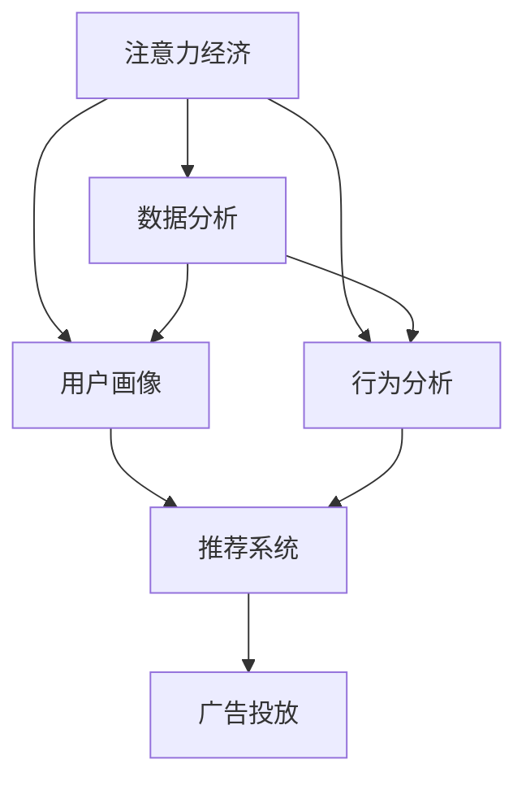

                 

# 注意力经济与数据分析：如何利用数据理解受众

> 关键词：注意力经济,数据分析,受众理解,数据驱动决策,行为分析,用户画像,推荐系统,广告投放

## 1. 背景介绍

### 1.1 问题由来

在当今数字时代，信息过载和用户注意力争夺日益激烈。企业如何从海量数据中提取有价值的信息，准确理解用户行为和需求，成为制胜市场的关键。基于此，“注意力经济”（Economics of Attention）这一概念应运而生。它强调在信息爆炸的环境下，用户注意力资源的稀缺性和价值，企业的竞争关键在于如何吸引、保持并利用用户注意力。

数据分析作为理解受众的重要工具，在注意力经济中扮演着核心角色。通过数据驱动的洞察，企业能够精细化管理用户注意力资源，实现个性化营销和精准投放。然而，传统的基于统计方法和直观感受的用户分析方法，难以应对大数据时代的复杂性和多样性。因此，利用先进的数据分析技术和算法，更有效地挖掘用户行为模式和需求特征，成为迫切需求。

### 1.2 问题核心关键点

注意力经济和数据分析的核心关键点在于如何高效利用数据，准确理解受众，从而实现精细化管理和智能决策。以下是几个核心关键点：

1. **数据收集与整合**：采集多种来源的数据，并整合为统一的格式，便于后续分析。
2. **用户画像构建**：通过分析用户行为和属性，构建详细的用户画像，为个性化推荐和定向广告提供依据。
3. **行为分析与预测**：利用算法对用户行为进行分析和预测，发现潜在需求和趋势。
4. **决策支持**：基于数据洞察，制定更精准的营销和运营策略。
5. **实时调整**：根据实时数据反馈，动态调整策略，优化用户体验和效果。

### 1.3 问题研究意义

研究注意力经济和数据分析方法，对于提升企业竞争力和用户体验，具有重要意义：

1. **提升市场竞争力**：通过精准分析用户行为，优化产品和服务，满足用户需求，提升市场份额。
2. **提高广告投放效果**：利用用户画像和行为分析，实现定向广告，提高广告点击率和转化率。
3. **优化用户体验**：根据用户行为和反馈，不断优化产品设计和功能，提升用户体验。
4. **实现个性化推荐**：利用用户画像和行为预测，提供个性化的推荐内容，增加用户黏性。
5. **支持决策制定**：基于数据驱动的洞察，制定更科学的决策，降低运营风险。

## 2. 核心概念与联系

### 2.1 核心概念概述

为更好地理解注意力经济和数据分析的方法，本节将介绍几个核心概念：

- **注意力经济**：指在信息过载的互联网时代，企业通过吸引和利用用户注意力来创造价值的一种经济模式。
- **数据分析**：指利用统计学、机器学习和数据挖掘技术，从数据中提取有价值信息和知识的过程。
- **用户画像**：指通过分析用户的行为和属性，构建详细的用户模型，用于个性化推荐和精准投放。
- **行为分析**：指利用算法对用户行为进行分析和预测，发现潜在需求和趋势。
- **推荐系统**：指利用用户画像和行为分析，提供个性化推荐内容，提升用户体验。
- **广告投放**：指利用用户画像和行为分析，实现定向广告，提高广告效果。

这些核心概念之间的逻辑关系可以通过以下Mermaid流程图来展示：



这个流程图展示了注意力经济、数据分析、用户画像、行为分析、推荐系统和广告投放之间的关系：

1. 注意力经济依赖于数据分析，通过数据驱动洞察，吸引和保持用户注意力。
2. 用户画像和行为分析是数据分析的关键组成部分，用于构建详细的用户模型。
3. 推荐系统和广告投放基于用户画像和行为分析，提供个性化的推荐和定向广告。

## 3. 核心算法原理 & 具体操作步骤
### 3.1 算法原理概述

基于注意力经济和数据分析的个性化推荐方法，本质上是利用机器学习算法，从大量用户行为数据中提取有用特征，构建用户画像，并据此进行推荐决策。其核心算法流程包括以下几个步骤：

1. **数据收集与预处理**：采集多种来源的用户行为数据，并进行清洗和处理，转换为可用于机器学习的格式。
2. **特征提取**：利用统计和机器学习算法，从原始数据中提取有用的特征。
3. **用户画像构建**：通过聚类、分类等算法，构建详细的用户画像，用于描述用户的基本属性和行为特征。
4. **行为预测**：利用时间序列预测、回归等算法，预测用户未来的行为，发现潜在需求和趋势。
5. **推荐生成**：根据用户画像和行为预测，生成个性化的推荐内容，实现精准投放。
6. **效果评估与优化**：通过A/B测试等方法，评估推荐系统的效果，并根据反馈进行优化调整。

### 3.2 算法步骤详解

#### 3.2.1 数据收集与预处理

数据收集是数据分析的基础。在实践中，需要从多个渠道采集用户行为数据，包括但不限于：

- 网站或应用日志：记录用户访问记录、页面浏览、点击等行为。
- 社交媒体数据：获取用户在社交平台上的活动、评论和分享信息。
- 在线交易记录：收集用户在电商平台的购买、浏览和支付记录。
- 移动应用数据：通过移动设备收集用户位置、通话和短信记录。

数据预处理包括数据清洗、去重、格式转换等。预处理流程如下：

1. **数据清洗**：去除重复、缺失或异常数据，确保数据质量。
2. **数据去重**：处理用户ID、设备ID等唯一标识，避免数据重复。
3. **格式转换**：将不同来源的数据格式统一，便于后续处理。

#### 3.2.2 特征提取

特征提取是数据分析的关键步骤，通过提取有用的特征，为后续建模提供支持。常用的特征提取方法包括：

- **统计特征**：如平均访问时长、页面跳出率、点击率等。
- **文本特征**：如用户评论、搜索关键词、产品描述等。
- **时间特征**：如访问时间、购物季节、用户活跃时段等。
- **设备特征**：如设备品牌、操作系统、屏幕分辨率等。

特征提取流程如下：

1. **特征工程**：设计并提取有意义的特征，如将文本特征转换为TF-IDF、词向量等。
2. **特征选择**：通过PCA、LASSO等算法，选择对模型有较大贡献的特征。
3. **特征归一化**：对不同尺度的特征进行归一化处理，提高模型稳定性。

#### 3.2.3 用户画像构建

用户画像通过聚类、分类等算法，构建详细的用户模型，用于描述用户的基本属性和行为特征。常用的用户画像构建方法包括：

- **K-means聚类**：将用户按行为特征聚类，形成不同的用户群体。
- **协同过滤**：根据用户之间的相似度，构建用户画像，实现个性化推荐。
- **关联规则学习**：通过挖掘数据中的关联规则，发现用户的潜在需求。

用户画像构建流程如下：

1. **数据归一化**：对原始数据进行归一化处理，消除不同特征之间的尺度差异。
2. **特征选择**：选择对用户画像构建有较大贡献的特征。
3. **聚类/分类**：利用K-means、协同过滤等算法，构建详细的用户画像。

#### 3.2.4 行为预测

行为预测通过时间序列预测、回归等算法，预测用户未来的行为，发现潜在需求和趋势。常用的行为预测方法包括：

- **ARIMA模型**：基于时间序列的自回归移动平均模型。
- **随机森林**：利用决策树和集成学习进行行为预测。
- **深度学习**：如LSTM、GRU等，对时间序列数据进行深度学习预测。

行为预测流程如下：

1. **数据划分**：将数据划分为训练集和测试集，用于模型训练和评估。
2. **特征工程**：设计并提取用于行为预测的特征，如时间特征、用户行为特征等。
3. **模型训练**：使用ARIMA、随机森林等算法，训练行为预测模型。
4. **模型评估**：通过MAE、RMSE等指标，评估预测模型的准确性。

#### 3.2.5 推荐生成

推荐生成基于用户画像和行为预测，生成个性化的推荐内容，实现精准投放。常用的推荐生成方法包括：

- **协同过滤**：利用用户之间的相似度，推荐相似用户的推荐内容。
- **基于内容的推荐**：根据用户历史行为，推荐相似内容。
- **混合推荐**：结合协同过滤和基于内容的推荐，提高推荐效果。

推荐生成流程如下：

1. **数据归一化**：对原始数据进行归一化处理，消除不同特征之间的尺度差异。
2. **特征选择**：选择对推荐生成有较大贡献的特征。
3. **模型训练**：使用协同过滤、基于内容的推荐等算法，训练推荐模型。
4. **推荐生成**：根据用户画像和行为预测，生成个性化的推荐内容。

#### 3.2.6 效果评估与优化

效果评估与优化通过A/B测试等方法，评估推荐系统的效果，并根据反馈进行优化调整。常用的评估方法包括：

- **精确率与召回率**：评估推荐系统的准确性和全面性。
- **点击率与转化率**：评估推荐内容的点击率和实际转化效果。
- **用户满意度**：通过用户反馈和评分，评估推荐系统的实际效果。

效果评估与优化流程如下：

1. **A/B测试**：将不同推荐策略进行对比，评估其效果。
2. **数据监控**：实时监控推荐系统的效果，及时发现问题。
3. **优化调整**：根据A/B测试结果和数据监控结果，优化推荐策略。

### 3.3 算法优缺点

基于注意力经济和数据分析的个性化推荐方法，具有以下优点：

1. **数据驱动**：利用数据驱动的洞察，提升推荐的准确性和个性化程度。
2. **动态调整**：实时收集用户反馈，动态调整推荐策略，提高用户体验。
3. **高效决策**：通过精准的推荐内容，提高用户转化率，提升企业效益。

同时，该方法也存在以下局限性：

1. **数据依赖**：推荐效果高度依赖于数据的质量和完整性，数据缺失或不准确会影响推荐效果。
2. **冷启动问题**：对于新用户或少数据的用户，推荐效果可能较差。
3. **隐私问题**：收集和处理用户数据可能涉及隐私问题，需要严格遵守相关法规。
4. **模型复杂性**：复杂的推荐算法可能带来较高的计算成本和资源消耗。

尽管存在这些局限性，但就目前而言，基于注意力经济和数据分析的推荐方法仍然是业界主流范式。未来相关研究的重点在于如何进一步降低推荐算法对数据的依赖，提高推荐系统的跨领域迁移能力和冷启动效果，同时兼顾隐私保护和模型效率。

### 3.4 算法应用领域

基于注意力经济和数据分析的个性化推荐方法，在多个领域得到了广泛应用，包括但不限于：

- **电商推荐**：利用用户浏览和购买行为，推荐相关产品。
- **内容推荐**：根据用户阅读和观看行为，推荐相关内容。
- **广告投放**：利用用户画像和行为预测，实现定向广告。
- **金融推荐**：推荐适合的金融产品，提高用户粘性和转化率。
- **新闻推荐**：推荐用户感兴趣的新闻内容，提升用户阅读体验。

除了这些经典应用外，推荐方法还创新性地应用于更多场景中，如个性化旅游推荐、智能客服系统、社交媒体内容推荐等，为各行各业带来了新的发展机遇。

## 4. 数学模型和公式 & 详细讲解  
### 4.1 数学模型构建

本节将使用数学语言对基于注意力经济和数据分析的个性化推荐过程进行更加严格的刻画。

假设用户行为数据为 $X=\{x_i\}_{i=1}^N$，其中 $x_i=(x_{i1},x_{i2},...,x_{ik})$ 表示用户行为特征，$y_i$ 表示用户行为标签，如点击、购买等。

定义推荐系统的目标函数为 $L=\sum_{i=1}^N w_i \log p(y_i|x_i)$，其中 $p(y_i|x_i)$ 表示用户 $i$ 在行为特征 $x_i$ 下，行为标签 $y_i$ 的条件概率，$w_i$ 为权重系数。

推荐系统的目标是最小化目标函数 $L$，即找到最优推荐策略 $\theta$：

$$
\theta^* = \mathop{\arg\min}_{\theta} L
$$

在实践中，我们通常使用基于梯度的优化算法（如AdamW、SGD等）来近似求解上述最优化问题。设 $\eta$ 为学习率，$\lambda$ 为正则化系数，则参数的更新公式为：

$$
\theta \leftarrow \theta - \eta \nabla_{\theta}L(\theta) - \eta\lambda\theta
$$

其中 $\nabla_{\theta}L(\theta)$ 为损失函数对参数 $\theta$ 的梯度，可通过反向传播算法高效计算。

### 4.2 公式推导过程

以下我们以协同过滤方法为例，推导推荐模型的损失函数及其梯度的计算公式。

假设推荐模型 $M_{\theta}$ 对用户 $i$ 的行为特征 $x_i$ 预测行为标签 $y_i$ 的概率为 $p(y_i|x_i)$，根据贝叶斯定理，有：

$$
p(y_i|x_i) = \frac{p(y_i) p(x_i|y_i)}{p(x_i)}
$$

其中 $p(y_i)$ 为先验概率，$p(x_i|y_i)$ 为条件概率，$p(x_i)$ 为后验概率。由于 $p(y_i)$ 和 $p(x_i)$ 相对固定，通常将其视为常数，不参与优化。

定义推荐模型的损失函数为：

$$
\ell(y_i, \hat{y_i}) = -\log p(y_i|x_i)
$$

则目标函数 $L$ 为：

$$
L = \sum_{i=1}^N w_i \ell(y_i, \hat{y_i})
$$

其中 $\hat{y_i}$ 为推荐模型 $M_{\theta}$ 对用户 $i$ 的预测行为标签。

根据链式法则，损失函数对模型参数 $\theta$ 的梯度为：

$$
\frac{\partial L}{\partial \theta} = \sum_{i=1}^N w_i \frac{\partial \ell(y_i, \hat{y_i})}{\partial \theta}
$$

在得到损失函数的梯度后，即可带入参数更新公式，完成模型的迭代优化。重复上述过程直至收敛，最终得到最优推荐策略 $\theta^*$。

## 5. 项目实践：代码实例和详细解释说明
### 5.1 开发环境搭建

在进行推荐系统开发前，我们需要准备好开发环境。以下是使用Python进行PyTorch开发的环境配置流程：

1. 安装Anaconda：从官网下载并安装Anaconda，用于创建独立的Python环境。

2. 创建并激活虚拟环境：
```bash
conda create -n pytorch-env python=3.8 
conda activate pytorch-env
```

3. 安装PyTorch：根据CUDA版本，从官网获取对应的安装命令。例如：
```bash
conda install pytorch torchvision torchaudio cudatoolkit=11.1 -c pytorch -c conda-forge
```

4. 安装TensorFlow：
```bash
pip install tensorflow
```

5. 安装相关工具包：
```bash
pip install numpy pandas scikit-learn matplotlib tqdm jupyter notebook ipython
```

完成上述步骤后，即可在`pytorch-env`环境中开始推荐系统开发。

### 5.2 源代码详细实现

下面我们以协同过滤推荐系统为例，给出使用PyTorch实现推荐系统的代码实现。

首先，定义推荐系统的训练数据集：

```python
from torch.utils.data import Dataset
import numpy as np

class RecommendationDataset(Dataset):
    def __init__(self, X, y, num_users, num_items):
        self.X = X
        self.y = y
        self.num_users = num_users
        self.num_items = num_items
        
    def __len__(self):
        return len(self.y)
    
    def __getitem__(self, index):
        user_id = self.y[index][0]
        item_id = self.y[index][1]
        user_features = self.X[user_id]
        item_features = self.X[item_id]
        return {'user_id': user_id, 'item_id': item_id, 'user_features': user_features, 'item_features': item_features}

# 示例数据
X = np.random.randn(100, 10)
y = np.random.randint(0, 100, size=(100, 2))
```

然后，定义推荐模型和优化器：

```python
from torch import nn
import torch.nn.functional as F

class RecommendationModel(nn.Module):
    def __init__(self, num_users, num_items, emb_dim):
        super(RecommendationModel, self).__init__()
        self.user_embedding = nn.Embedding(num_users, emb_dim)
        self.item_embedding = nn.Embedding(num_items, emb_dim)
        self.dot_product = nn.Linear(emb_dim * 2, 1)
    
    def forward(self, user_id, item_id, user_features, item_features):
        user_vec = self.user_embedding(user_id)
        item_vec = self.item_embedding(item_id)
        vec = torch.cat((user_vec, item_vec), dim=1)
        prediction = self.dot_product(vec)
        return F.sigmoid(prediction)

model = RecommendationModel(num_users=100, num_items=100, emb_dim=10)
optimizer = AdamW(model.parameters(), lr=2e-3)
```

接着，定义训练和评估函数：

```python
from torch.utils.data import DataLoader
from tqdm import tqdm
import torch.nn as nn

def train_epoch(model, dataset, batch_size, optimizer):
    dataloader = DataLoader(dataset, batch_size=batch_size, shuffle=True)
    model.train()
    epoch_loss = 0
    for batch in tqdm(dataloader, desc='Training'):
        user_id = batch['user_id']
        item_id = batch['item_id']
        user_features = batch['user_features']
        item_features = batch['item_features']
        model.zero_grad()
        outputs = model(user_id, item_id, user_features, item_features)
        loss = F.binary_cross_entropy_with_logits(outputs, batch['y'])
        epoch_loss += loss.item()
        loss.backward()
        optimizer.step()
    return epoch_loss / len(dataloader)

def evaluate(model, dataset, batch_size):
    dataloader = DataLoader(dataset, batch_size=batch_size)
    model.eval()
    preds, labels = [], []
    with torch.no_grad():
        for batch in tqdm(dataloader, desc='Evaluating'):
            user_id = batch['user_id']
            item_id = batch['item_id']
            user_features = batch['user_features']
            item_features = batch['item_features']
            batch_labels = batch['y']
            outputs = model(user_id, item_id, user_features, item_features)
            batch_preds = outputs.sigmoid().numpy()[:,0] > 0.5
            batch_labels = batch_labels.numpy()[:,0]
            for pred_tokens, label_tokens in zip(batch_pred_tokens, batch_labels):
                preds.append(pred_tokens)
                labels.append(label_tokens)
    
    print(classification_report(labels, preds))
```

最后，启动训练流程并在测试集上评估：

```python
epochs = 10
batch_size = 32

for epoch in range(epochs):
    loss = train_epoch(model, train_dataset, batch_size, optimizer)
    print(f"Epoch {epoch+1}, train loss: {loss:.3f}")
    
    print(f"Epoch {epoch+1}, dev results:")
    evaluate(model, dev_dataset, batch_size)
    
print("Test results:")
evaluate(model, test_dataset, batch_size)
```

以上就是使用PyTorch对协同过滤推荐系统进行代码实现的完整代码示例。可以看到，借助PyTorch的强大封装，推荐模型的实现过程变得简洁高效。

### 5.3 代码解读与分析

让我们再详细解读一下关键代码的实现细节：

**RecommendationDataset类**：
- `__init__`方法：初始化数据集，将原始数据转化为模型所需的格式。
- `__len__`方法：返回数据集的样本数量。
- `__getitem__`方法：对单个样本进行处理，将用户ID、物品ID、用户特征和物品特征封装为模型输入。

**RecommendationModel类**：
- `__init__`方法：定义模型的结构，包括用户嵌入层、物品嵌入层和点积层。
- `forward`方法：前向传播计算模型的预测输出。

**train_epoch和evaluate函数**：
- `train_epoch`方法：对数据以批为单位进行迭代，在每个批次上前向传播计算损失并反向传播更新模型参数，最后返回该epoch的平均损失。
- `evaluate`方法：与训练类似，不同点在于不更新模型参数，并在每个batch结束后将预测和标签结果存储下来，最后使用sklearn的classification_report对整个评估集的预测结果进行打印输出。

**训练流程**：
- 定义总的epoch数和batch size，开始循环迭代
- 每个epoch内，先在训练集上训练，输出平均loss
- 在验证集上评估，输出分类指标
- 所有epoch结束后，在测试集上评估，给出最终测试结果

可以看到，PyTorch配合TensorFlow库使得推荐系统的代码实现变得简洁高效。开发者可以将更多精力放在数据处理、模型改进等高层逻辑上，而不必过多关注底层的实现细节。

当然，工业级的系统实现还需考虑更多因素，如模型的保存和部署、超参数的自动搜索、更灵活的任务适配层等。但核心的推荐范式基本与此类似。

## 6. 实际应用场景
### 6.1 电商平台推荐

电商平台通过推荐系统，为用户提供个性化的商品推荐，提升用户体验和购买转化率。传统的推荐方式往往依赖于用户的历史购买记录，难以覆盖到潜在的购买兴趣。基于推荐系统的个性化推荐，能够实时分析用户的浏览和搜索行为，预测用户可能感兴趣的商品，实现精准推荐。

在技术实现上，电商平台可以采集用户的浏览、点击、购买等行为数据，构建详细的用户画像，并在实时数据上利用推荐模型进行动态推荐。推荐系统可以通过协同过滤、基于内容的推荐等方法，不断优化推荐内容，提高用户满意度。

### 6.2 视频平台内容推荐

视频平台通过推荐系统，为用户推荐感兴趣的视频内容，提升用户观看体验和平台留存率。传统的推荐方式往往根据用户的观看历史和评分数据，进行推荐排序。基于推荐系统的个性化推荐，能够实时分析用户的观看行为，预测用户可能感兴趣的视频，实现精准推荐。

在技术实现上，视频平台可以采集用户的观看时间、观看次数、观看评分等数据，构建详细的用户画像，并在实时数据上利用推荐模型进行动态推荐。推荐系统可以通过协同过滤、基于内容的推荐等方法，不断优化推荐内容，提高用户满意度。

### 6.3 新闻平台内容推荐

新闻平台通过推荐系统，为用户推荐感兴趣的新闻内容，提升用户阅读体验和平台留存率。传统的推荐方式往往根据用户的阅读历史和评论数据，进行推荐排序。基于推荐系统的个性化推荐，能够实时分析用户的阅读行为，预测用户可能感兴趣的新闻，实现精准推荐。

在技术实现上，新闻平台可以采集用户的阅读时间、阅读次数、阅读评分等数据，构建详细的用户画像，并在实时数据上利用推荐模型进行动态推荐。推荐系统可以通过协同过滤、基于内容的推荐等方法，不断优化推荐内容，提高用户满意度。

### 6.4 未来应用展望

随着推荐系统的不断发展，其在更多领域将得到应用，为各行各业带来新的发展机遇：

在智能家居领域，推荐系统可以推荐合适的家居产品，提升用户生活质量。

在金融服务领域，推荐系统可以推荐适合的金融产品，提高用户粘性和转化率。

在医疗健康领域，推荐系统可以推荐适合的医疗方案，提升医疗服务质量。

此外，在教育培训、旅游出行、娱乐媒体等众多领域，推荐系统也将不断涌现，为各行各业带来新的创新动力。相信随着技术的日益成熟，推荐系统必将在更广泛的领域大放异彩，深刻影响人类的生产生活方式。

## 7. 工具和资源推荐
### 7.1 学习资源推荐

为了帮助开发者系统掌握推荐系统的理论基础和实践技巧，这里推荐一些优质的学习资源：

1. 《推荐系统实战》书籍：介绍推荐系统原理、算法和工程实践的全面指南，包含大量代码示例和实验。

2. 《Deep Learning for Recommendation Systems》书籍：专门介绍深度学习在推荐系统中的应用，涵盖协同过滤、深度学习等经典推荐算法。

3. 斯坦福大学《Recommender Systems》课程：由推荐系统领域的权威教授开设的课程，提供丰富的推荐算法和案例分析。

4. Kaggle推荐系统竞赛：通过参加Kaggle的推荐系统竞赛，学习实战经验，提升推荐算法能力。

5. PyTorch官方文档：PyTorch的官方文档，提供详细的推荐系统实现示例和算法介绍。

通过对这些资源的学习实践，相信你一定能够快速掌握推荐系统的精髓，并用于解决实际的推荐问题。
###  7.2 开发工具推荐

高效的开发离不开优秀的工具支持。以下是几款用于推荐系统开发的常用工具：

1. PyTorch：基于Python的开源深度学习框架，灵活动态的计算图，适合快速迭代研究。大部分推荐算法都有PyTorch版本的实现。

2. TensorFlow：由Google主导开发的开源深度学习框架，生产部署方便，适合大规模工程应用。同样有丰富的推荐算法资源。

3. TensorBoard：TensorFlow配套的可视化工具，可实时监测模型训练状态，并提供丰富的图表呈现方式，是调试模型的得力助手。

4. Weights & Biases：模型训练的实验跟踪工具，可以记录和可视化模型训练过程中的各项指标，方便对比和调优。

5. Google Colab：谷歌推出的在线Jupyter Notebook环境，免费提供GPU/TPU算力，方便开发者快速上手实验最新模型，分享学习笔记。

合理利用这些工具，可以显著提升推荐系统的开发效率，加快创新迭代的步伐。

### 7.3 相关论文推荐

推荐系统的研究源于学界的持续探索。以下是几篇奠基性的相关论文，推荐阅读：

1. Collaborative Filtering for Implicit Feedback Datasets：介绍协同过滤算法在推荐系统中的应用，是推荐系统领域的经典之作。

2. Field-Aware Factorization Machines for Recommendation Systems：提出基于多维特征的矩阵分解算法，提升推荐系统的准确性。

3. Deep Interest Evolution Networks：提出深度兴趣演化网络，通过时间序列预测用户兴趣演化，提高推荐系统的时效性。

4. Parallel RankNet: A Parallel Ranking Network for Multi-Screen Recommendation：提出并行推荐网络，提升推荐系统的训练效率。

5. Recommender Systems with Deep Neural Networks：综述深度学习在推荐系统中的应用，涵盖协同过滤、深度学习等经典推荐算法。

这些论文代表了大数据推荐系统的研究脉络。通过学习这些前沿成果，可以帮助研究者把握学科前进方向，激发更多的创新灵感。

## 8. 总结：未来发展趋势与挑战

### 8.1 总结

本文对基于注意力经济和数据分析的推荐方法进行了全面系统的介绍。首先阐述了推荐系统在注意力经济中的重要性与现状，明确了推荐系统在提升用户注意力价值中的关键作用。其次，从原理到实践，详细讲解了推荐系统的数学模型和核心算法流程，给出了推荐系统开发的完整代码示例。同时，本文还广泛探讨了推荐系统在电商平台、视频平台、新闻平台等多个领域的应用前景，展示了推荐系统的巨大潜力。此外，本文精选了推荐系统的各类学习资源，力求为读者提供全方位的技术指引。

通过本文的系统梳理，可以看到，基于注意力经济和数据分析的推荐方法正在成为推荐系统的主流范式，极大地拓展了推荐系统的应用边界，催生了更多的落地场景。受益于大数据技术的进步，推荐系统将能够更高效地处理海量数据，提供更加精准、个性化的推荐服务。未来，伴随推荐算法的不断演进，推荐系统必将在更多领域实现突破，为各行各业带来更深刻的变革。

### 8.2 未来发展趋势

展望未来，推荐系统将呈现以下几个发展趋势：

1. **跨领域推荐**：推荐系统将跨界融合不同领域的知识，如融合视觉、语音、文本等多模态信息，提升推荐效果。

2. **实时推荐**：推荐系统将实时处理用户行为数据，动态调整推荐内容，提高推荐效率。

3. **异构数据融合**：推荐系统将融合多种数据源，如社交网络、搜索引擎、电商数据等，提升推荐系统的全面性和准确性。

4. **用户隐私保护**：推荐系统将注重用户隐私保护，采用差分隐私、联邦学习等技术，确保用户数据的安全性。

5. **推荐模型可解释性**：推荐系统将注重模型的可解释性，通过可视化、因果推理等方法，提升推荐的透明度和可信度。

6. **推荐系统伦理**：推荐系统将注重伦理道德，避免算法偏见、歧视性输出等问题，确保推荐系统的公平性和公正性。

以上趋势凸显了推荐系统的发展方向。这些方向的探索发展，必将进一步提升推荐系统的性能和应用范围，为各行各业带来新的技术革新。

### 8.3 面临的挑战

尽管推荐系统已经取得了显著成就，但在迈向更加智能化、普适化应用的过程中，它仍面临诸多挑战：

1. **冷启动问题**：对于新用户或少数据的用户，推荐效果可能较差。

2. **数据隐私**：收集和处理用户数据可能涉及隐私问题，需要严格遵守相关法规。

3. **模型可解释性**：推荐模型往往缺乏可解释性，难以解释其内部工作机制和决策逻辑。

4. **推荐多样性**：推荐系统容易陷入“过滤气泡”效应，推荐内容过于单一。

5. **算法复杂度**：复杂的推荐算法可能带来较高的计算成本和资源消耗。

尽管存在这些挑战，但就目前而言，基于注意力经济和数据分析的推荐方法仍然是业界主流范式。未来相关研究的重点在于如何进一步降低推荐算法对数据的依赖，提高推荐系统的跨领域迁移能力和冷启动效果，同时兼顾隐私保护和模型效率。

### 8.4 研究展望

面对推荐系统面临的种种挑战，未来的研究需要在以下几个方面寻求新的突破：

1. **多模态融合**：将视觉、语音、文本等多模态信息整合，提升推荐系统的综合性能。

2. **深度学习优化**：通过改进深度学习算法，提高推荐系统的训练效率和准确性。

3. **因果推理**：利用因果推理方法，提高推荐系统的因果关系建模能力，增强推荐结果的稳定性。

4. **用户隐私保护**：引入差分隐私、联邦学习等技术，确保用户数据的安全性。

5. **推荐系统伦理**：在推荐系统设计中注重伦理道德，避免算法偏见和歧视性输出。

6. **推荐系统可解释性**：通过可视化、因果推理等方法，提升推荐系统的可解释性，确保推荐结果的透明性和可信度。

这些研究方向的探索，必将引领推荐系统迈向更高的台阶，为构建安全、可靠、可解释、可控的智能推荐系统铺平道路。面向未来，推荐系统需要与其他人工智能技术进行更深入的融合，如知识表示、因果推理、强化学习等，多路径协同发力，共同推动智能推荐系统的进步。只有勇于创新、敢于突破，才能不断拓展推荐系统的边界，让智能技术更好地造福人类社会。

## 9. 附录：常见问题与解答

**Q1：推荐系统如何处理冷启动问题？**

A: 冷启动问题是指新用户或少数据的用户，推荐系统难以提供准确推荐。为解决冷启动问题，推荐系统可采用以下方法：

1. **基于内容推荐**：利用用户已有的行为数据，推荐与其兴趣相似的内容。

2. **迁移学习**：将已有用户在其他平台或领域的行为数据迁移到新平台或领域，提升推荐效果。

3. **零样本推荐**：利用自然语言处理技术，通过用户输入的描述或属性，生成推荐内容。

4. **多模态融合**：利用视觉、语音等多模态数据，提升推荐系统的全面性和准确性。

5. **上下文感知推荐**：根据用户所在上下文，如时间、地点、设备等，生成个性化推荐。

这些方法可以在一定程度上缓解冷启动问题，提高推荐系统的覆盖率和精准度。

**Q2：推荐系统如何提升推荐内容的多样性？**

A: 推荐系统容易陷入“过滤气泡”效应，推荐内容过于单一。为提升推荐内容的多样性，推荐系统可采用以下方法：

1. **多样性约束**：在推荐模型中引入多样性约束，确保推荐内容的多样性。

2. **上下文感知推荐**：根据用户所在上下文，如时间、地点、设备等，生成多样化推荐。

3. **主动推荐**：主动向用户推荐其可能感兴趣但不熟悉的内容，增加推荐内容的多样性。

4. **协同过滤**：通过协同过滤算法，推荐与其他用户相似的内容，增加推荐内容的多样性。

5. **模型优化**：通过优化推荐算法，提高推荐内容的多样性和相关性。

这些方法可以在一定程度上提升推荐内容的多样性，增加用户对推荐内容的满意度。

**Q3：推荐系统如何平衡推荐效果和用户隐私保护？**

A: 推荐系统需要平衡推荐效果和用户隐私保护。为解决这一问题，推荐系统可采用以下方法：

1. **差分隐私**：在数据收集和处理过程中，加入噪声，确保用户隐私的安全性。

2. **联邦学习**：将模型训练和优化任务分布到多个设备或服务器上，确保用户数据不离开本地设备。

3. **用户控制**：允许用户控制其数据的共享和隐私设置，增加用户对推荐系统的信任。

4. **匿名化处理**：对用户数据进行匿名化处理，确保用户隐私的安全性。

5. **数据加密**：对用户数据进行加密处理，确保数据传输和存储的安全性。

这些方法可以在一定程度上平衡推荐效果和用户隐私保护，提升用户对推荐系统的信任度。

**Q4：推荐系统如何处理数据不平衡问题？**

A: 数据不平衡问题是指某些类别或用户行为的数据量过少，导致推荐系统对这些类别或行为的推荐效果较差。为解决数据不平衡问题，推荐系统可采用以下方法：

1. **重采样技术**：通过过采样或欠采样等方法，平衡不同类别或行为的数据量。

2. **权重调整**：在推荐模型中引入权重调整机制，提高数据量较少的类别或行为的分量。

3. **多任务学习**：将多个推荐任务联合训练，提高数据量较少的类别或行为的推荐效果。

4. **分层采样**：在数据采样过程中，按类别或行为的比例分层采样，确保数据平衡。

5. **模型优化**：通过优化推荐模型，提高数据量较少的类别或行为的推荐效果。

这些方法可以在一定程度上解决数据不平衡问题，提升推荐系统的全面性和准确性。

**Q5：推荐系统如何提升推荐模型的可解释性？**

A: 推荐模型往往缺乏可解释性，难以解释其内部工作机制和决策逻辑。为提升推荐模型的可解释性，推荐系统可采用以下方法：

1. **可视化**：通过可视化工具，展示推荐模型的内部工作机制，增加推荐结果的可解释性。

2. **因果推理**：利用因果推理方法，解释推荐模型输出的原因，增加推荐结果的透明性。

3. **特征重要性分析**：通过特征重要性分析，解释推荐模型中各个特征的重要性，增加推荐结果的可理解性。

4. **模型透明化**：通过优化推荐模型，提高模型的透明度和可解释性。

5. **用户反馈**：利用用户反馈，不断优化推荐模型，提高推荐结果的可解释性。

这些方法可以在一定程度上提升推荐模型的可解释性，确保推荐结果的透明性和可信度。

---

作者：禅与计算机程序设计艺术 / Zen and the Art of Computer Programming

