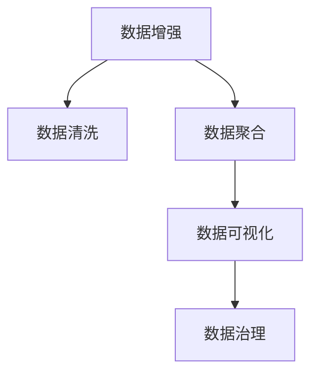

                 

# 注意力经济与数据驱动的决策制定：利用数据增强业务洞察力

> 关键词：注意力经济,数据驱动,决策制定,数据增强,业务洞察力,数据质量,数据治理,决策模型,业务分析

## 1. 背景介绍

### 1.1 问题由来
在信息化时代，数据驱动决策已成为企业运营的核心方法之一。随着大数据、人工智能等技术的不断进步，企业能够通过数据洞察来指导业务决策，提升运营效率和盈利能力。然而，数据驱动决策的效果往往受限于数据的准确性和完整性。错误或不完整的数据会导致错误的决策，严重时甚至会造成企业战略方向的失误。

数据质量问题不仅仅存在于数据采集阶段，也在数据存储、数据处理和数据共享环节普遍存在。数据分散、数据孤岛、数据不一致、数据冗余、数据重复等问题，都极大地影响了数据的质量和可用性。因此，如何提高数据质量，利用数据增强业务洞察力，成为当前企业信息化建设的重要课题。

### 1.2 问题核心关键点
为有效提升数据质量，实现业务洞察，本文将探讨数据增强技术。数据增强是指通过对数据进行扩充、清洗、聚合、分析等操作，提高数据的准确性、完整性和可利用性，进而提升数据驱动决策的效果。核心关键点包括：

- **数据清洗与去重**：清洗数据中的噪声、异常值，去除重复数据，提升数据质量。
- **数据聚合与归一**：将分散的数据进行聚合，统一数据格式和维度，便于数据分析。
- **数据增强与扩展**：利用数据生成技术，通过数据合成、重构、融合等方式，增强数据量与多样性。
- **数据可视与洞察**：将数据转化为可视化的图表和报告，帮助业务人员直观地理解数据，做出更好的决策。
- **数据治理与保护**：建立数据治理机制，确保数据隐私和安全性，规范数据使用流程。

## 2. 核心概念与联系

### 2.1 核心概念概述

为更好地理解数据增强技术，本节将介绍几个密切相关的核心概念：

- **数据增强(Data Augmentation)**：通过一系列数据生成技术，如旋转、缩放、裁剪等，扩充数据量，增加数据的多样性，提升模型的泛化能力。
- **数据清洗(Data Cleaning)**：去除数据中的噪声、异常值、重复记录等，提升数据质量。
- **数据聚合(Data Aggregation)**：将分散的数据进行整合，统一数据格式和维度，便于数据统一管理和分析。
- **数据可视化(Data Visualization)**：将数据转化为可视化的图表和报告，辅助业务决策。
- **数据治理(Data Governance)**：建立数据治理机制，确保数据隐私和安全性，规范数据使用流程。

这些核心概念之间的逻辑关系可以通过以下Mermaid流程图来展示：



这个流程图展示了几项数据处理技术的核心流程：

1. 数据增强用于扩充和增加数据的多样性。
2. 数据清洗用于去除噪声和异常值，提升数据质量。
3. 数据聚合用于统一数据格式和维度，便于数据分析。
4. 数据可视化用于直观展示数据，辅助决策。
5. 数据治理用于规范数据使用流程，保障数据隐私和安全。

这些核心概念共同构成了数据增强技术的框架，为企业提升数据质量和业务洞察力提供了有力支撑。

## 3. 核心算法原理 & 具体操作步骤

### 3.1 算法原理概述

数据增强技术本质上是一种数据生成技术，通过一系列算法，将原始数据进行扩充和变换，生成新的、具有不同特征的数据集。这一过程可以应用于数据的预处理阶段，也可以作为模型训练的一部分。

以图像数据增强为例，常见的方法包括旋转、平移、缩放、翻转、裁剪、颜色变换等。这些变换操作可以在保留原始数据特征的前提下，生成新的数据样本。新的数据样本增加了数据的多样性，有助于提高模型的泛化能力。

### 3.2 算法步骤详解

以下将以图像数据增强为例，介绍数据增强的具体操作步骤：

1. **数据采集**：从原始数据源中获取需要增强的数据。
2. **数据预处理**：对原始数据进行预处理，如尺寸调整、归一化等。
3. **选择增强方法**：根据应用场景和需求，选择适合的数据增强方法，如旋转、翻转、裁剪等。
4. **增强数据生成**：对原始数据应用选定的增强方法，生成新的数据样本。
5. **数据融合**：将原始数据和增强数据进行合并，形成最终的数据集。
6. **数据存储**：将增强后的数据集存储到目标数据源中，完成数据增强操作。

### 3.3 算法优缺点

数据增强技术具有以下优点：

- **数据多样性**：通过数据增强，可以增加数据的多样性，提升模型的泛化能力。
- **提升模型性能**：新的数据样本提供了更多的训练数据，有助于提升模型的训练效果。
- **降低过拟合**：数据增强可以避免模型对训练数据过拟合，提高模型的泛化能力。
- **成本低廉**：数据增强技术成本较低，不需要额外收集标注数据。

同时，数据增强技术也存在一些缺点：

- **过度增强**：过度增强可能导致数据失真，影响模型性能。
- **计算量大**：数据增强涉及大量计算，需要一定的计算资源。
- **鲁棒性不足**：某些增强方法可能不适用于特定数据集，影响增强效果。

### 3.4 算法应用领域

数据增强技术在多个领域得到了广泛应用，例如：

- **图像处理**：通过增强图像数据，提升图像识别、物体检测等模型的性能。
- **自然语言处理(NLP)**：通过生成新的文本数据，增加模型训练样本，提升文本分类、情感分析等任务的准确率。
- **信号处理**：通过增强信号数据，提升音频、视频等信号处理的准确性和鲁棒性。
- **网络安全**：通过增强攻击数据，提升模型对网络攻击的识别和防御能力。
- **智能制造**：通过增强工业数据，提升生产流程优化和设备维护的效率。
- **金融风控**：通过增强金融数据，提升风险评估和欺诈检测的准确性。

数据增强技术的多样性使其能够适应不同领域的应用需求，成为提升模型性能的重要手段。

## 4. 数学模型和公式 & 详细讲解 & 举例说明

### 4.1 数学模型构建

在本节中，我们将以图像数据增强为例，介绍数据增强的数学模型构建。

假设原始图像数据集为 $D=\{(x_i,y_i)\}_{i=1}^N$，其中 $x_i$ 为图像，$y_i$ 为标签。数据增强的目的是生成新的图像数据 $x'_i$，使得 $(x_i,y_i)$ 与 $(x'_i,y'_i)$ 具有相似的特征。

为了简化问题，我们假设数据增强的方法为平移，即生成的新图像 $x'_i$ 通过在原始图像 $x_i$ 上平移 $t$ 像素得到。则平移变换后的图像可以表示为：

$$
x'_i = x_i \oplus t
$$

其中 $\oplus$ 表示平移操作，$t$ 表示平移参数。

数据增强的目标是最大化新图像 $x'_i$ 与原始图像 $x_i$ 的相似度。一种常用的相似度度量方法为对比度损失(BCELoss)，用于衡量两个图像的相似度。

### 4.2 公式推导过程

对比度损失的公式为：

$$
L(x_i, x'_i) = \max(0, \alpha - x_i \cdot x'_i)
$$

其中 $\alpha$ 为阈值，当 $x_i \cdot x'_i > \alpha$ 时，损失函数为 0，否则为 $x_i \cdot x'_i - \alpha$。

对比度损失用于衡量两个图像之间的相似度，将其作为数据增强的目标函数，可以指导增强算法生成更接近原始图像的新图像。

### 4.3 案例分析与讲解

以下我们将以一个简单的图像分类任务为例，介绍数据增强在模型训练中的应用。

假设我们有一个包含 $N$ 张图像的分类数据集 $D$，每张图像的大小为 $H \times W \times C$，其中 $H$ 为图像高度，$W$ 为图像宽度，$C$ 为通道数。数据增强的目标是将图像进行平移操作，生成 $N'$ 张新的图像，使得 $N' \gg N$，从而增加数据量。

具体实现步骤如下：

1. **数据预处理**：对原始图像进行归一化处理，使得像素值在 $[0,1]$ 范围内。
2. **平移操作**：在原始图像 $x_i$ 上随机平移 $t$ 像素，生成新图像 $x'_i$。
3. **损失计算**：计算新图像 $x'_i$ 与原始图像 $x_i$ 的对比度损失，作为增强算法的目标函数。
4. **生成新数据**：重复步骤 2 和步骤 3，生成多张新图像，直到满足数据量的要求。
5. **数据融合**：将原始数据和增强数据进行合并，形成最终的数据集。
6. **模型训练**：将增强后的数据集作为训练集，训练分类模型。

## 5. 项目实践：代码实例和详细解释说明

### 5.1 开发环境搭建

在进行数据增强实践前，我们需要准备好开发环境。以下是使用Python进行Pillow库进行图像数据增强的环境配置流程：

1. 安装Pillow库：从官网下载并安装Pillow库。
2. 安装NumPy和SciPy库：用于数据处理和数值计算。
3. 安装Matplotlib库：用于数据可视化。

完成上述步骤后，即可在Python环境中开始数据增强实践。

### 5.2 源代码详细实现

下面是使用Pillow库进行图像数据增强的Python代码实现：

```python
from PIL import Image
import numpy as np
import matplotlib.pyplot as plt

def rotate_image(image, angle):
    """
    旋转图像
    :param image: 原始图像
    :param angle: 旋转角度
    :return: 旋转后的图像
    """
    rotated_image = image.rotate(angle)
    return rotated_image

def flip_image(image):
    """
    翻转图像
    :param image: 原始图像
    :return: 翻转后的图像
    """
    flipped_image = image.transpose(Image.FLIP_LEFT_RIGHT)
    return flipped_image

def zoom_image(image, scale):
    """
    缩放图像
    :param image: 原始图像
    :param scale: 缩放比例
    :return: 缩放后的图像
    """
    zoomed_image = image.resize((image.width * scale, image.height * scale))
    return zoomed_image

def data_augmentation(image, angles=[0, 90, 180, 270], scale=[0.5, 1.0, 1.5]):
    """
    数据增强
    :param image: 原始图像
    :param angles: 旋转角度列表
    :param scale: 缩放比例列表
    :return: 增强后的图像
    """
    rotated_images = []
    flipped_images = []
    zoomed_images = []
    for angle in angles:
        rotated_image = rotate_image(image, angle)
        rotated_images.append(rotated_image)
    for angle in angles:
        flipped_image = flip_image(rotated_images[angle])
        flipped_images.append(flipped_image)
    for scale in scale:
        zoomed_image = zoom_image(flipped_images[0], scale)
        zoomed_images.append(zoomed_image)
    return zoomed_images

# 读取图像数据
image = Image.open('image.jpg')

# 数据增强
augmented_images = data_augmentation(image)

# 显示增强后的图像
for i, augmented_image in enumerate(augmented_images):
    plt.subplot(1, len(augmented_images), i+1)
    plt.imshow(np.array(augmented_image))
    plt.title(f"增强后的图像 {i+1}")
    plt.axis('off')
plt.show()
```

上述代码实现了一个简单的图像数据增强功能，可以对图像进行旋转、翻转、缩放等操作。在实际应用中，可以根据具体需求选择不同的数据增强方法，生成更多样化的数据集。

### 5.3 代码解读与分析

在上述代码中，我们使用了Pillow库中的Image类来进行图像处理，使用了NumPy库进行数组操作，使用了Matplotlib库进行图像显示。

代码的核心部分是`data_augmentation`函数，该函数接受原始图像和旋转角度、缩放比例的列表，返回增强后的图像列表。在函数内部，我们通过循环实现了旋转、翻转和缩放操作，并生成增强后的图像列表。最后，将增强后的图像列表作为函数的返回值，以便在后续代码中进行使用。

## 6. 实际应用场景

### 6.1 智能制造

在智能制造领域，数据增强技术可以应用于生产线的监测和维护。通过增强图像数据，提升图像识别和物体检测等模型的性能，从而提高生产线的运行效率和设备维护的准确性。

具体而言，可以收集生产线上的图像数据，通过数据增强技术生成更多样化的图像数据，训练模型识别关键部件的缺陷、磨损和故障等。通过图像识别和检测，可以及时发现生产线上的问题，提前进行维护，避免生产线的停机和延误。

### 6.2 金融风控

在金融领域，数据增强技术可以应用于风险评估和欺诈检测。通过增强金融数据，提升模型对异常行为的识别能力，从而降低金融风险。

具体而言，可以收集金融交易数据，通过数据增强技术生成更多的交易样本，训练模型识别异常交易和欺诈行为。通过模型检测，可以及时发现异常交易和欺诈行为，降低金融风险和损失。

### 6.3 网络安全

在网络安全领域，数据增强技术可以应用于恶意攻击的检测和防御。通过增强攻击数据，提升模型对攻击行为的识别和防御能力，从而提高网络安全性。

具体而言，可以收集网络攻击数据，通过数据增强技术生成更多的攻击样本，训练模型识别各种攻击行为。通过模型检测，可以及时发现和防御各种网络攻击，保障网络的安全性和稳定性。

### 6.4 未来应用展望

随着数据增强技术的不断发展，其应用领域将不断拓展，为各行各业带来新的机遇和挑战。

在智慧医疗领域，数据增强技术可以应用于医疗影像分析，通过增强医疗影像数据，提升模型的诊断准确性和鲁棒性，辅助医生进行疾病诊断和治疗。

在智能教育领域，数据增强技术可以应用于学生行为分析，通过增强学生行为数据，提升模型的分析和预测能力，帮助教师了解学生的学习状态和需求，提供个性化的教育服务。

在智慧城市治理中，数据增强技术可以应用于城市事件监测，通过增强城市监控数据，提升模型的识别和预测能力，及时发现和应对城市事件，保障城市的安全和稳定。

## 7. 工具和资源推荐

### 7.1 学习资源推荐

为了帮助开发者系统掌握数据增强技术的理论基础和实践技巧，这里推荐一些优质的学习资源：

1. 《Python数据增强实战》系列博文：由大模型技术专家撰写，深入浅出地介绍了Python数据增强的实现方法和应用场景。
2. Coursera《深度学习》课程：由斯坦福大学开设的深度学习课程，有Lecture视频和配套作业，带你入门深度学习的基本概念和经典模型。
3. GitHub上的数据增强项目：GitHub上提供了大量数据增强的开源项目，包括图像增强、文本增强、信号增强等，通过学习这些项目可以深入了解数据增强的实现细节和应用效果。

通过对这些资源的学习实践，相信你一定能够快速掌握数据增强技术的精髓，并用于解决实际的NLP问题。

### 7.2 开发工具推荐

高效的开发离不开优秀的工具支持。以下是几款用于数据增强开发的常用工具：

1. Python：作为数据增强的主流编程语言，具有丰富的第三方库和工具支持。
2. Pillow库：Python的图像处理库，支持丰富的图像操作，如旋转、翻转、缩放等。
3. OpenCV库：开源的计算机视觉库，支持图像处理、视频处理等多种计算机视觉任务。
4. PyTorch：基于Python的开源深度学习框架，支持GPU加速，适合大规模数据处理和模型训练。
5. TensorFlow：由Google主导开发的开源深度学习框架，支持多GPU训练，适合大规模数据处理和模型训练。

合理利用这些工具，可以显著提升数据增强任务的开发效率，加快创新迭代的步伐。

### 7.3 相关论文推荐

数据增强技术的发展源于学界的持续研究。以下是几篇奠基性的相关论文，推荐阅读：

1. "Data Augmentation for Robustness in Vision Learning"：提出了一系列数据增强方法，包括旋转、缩放、裁剪等，用于提升模型的鲁棒性和泛化能力。
2. "Simple Image Augmentation with a Single Dataset"：提出了一种基于单数据集的数据增强方法，通过旋转、翻转、缩放等方式生成更多的训练数据。
3. "Language Modeling with Multi-task Learning"：提出了一种基于多任务学习的语言模型，通过数据增强技术生成更多的训练数据，提升模型的语言理解能力。

这些论文代表了大数据增强技术的发展脉络。通过学习这些前沿成果，可以帮助研究者把握学科前进方向，激发更多的创新灵感。

## 8. 总结：未来发展趋势与挑战

### 8.1 总结

本文对数据增强技术进行了全面系统的介绍。首先阐述了数据增强技术的背景和意义，明确了数据增强在提升数据质量和业务洞察力方面的重要价值。其次，从原理到实践，详细讲解了数据增强的数学模型和操作步骤，给出了数据增强任务开发的完整代码实例。同时，本文还探讨了数据增强技术在多个领域的应用场景，展示了数据增强范式的巨大潜力。

通过本文的系统梳理，可以看到，数据增强技术正在成为数据处理和业务决策的重要范式，极大地提高了数据驱动决策的效果。未来，伴随数据增强方法的持续演进，相信NLP技术将在更广泛的领域中发挥重要作用，为各行各业带来深刻的变革。

### 8.2 未来发展趋势

展望未来，数据增强技术将呈现以下几个发展趋势：

1. **数据多样性提升**：随着数据增强方法的不断丰富，数据的多样性和多样性将不断提升，有助于提升模型的泛化能力和鲁棒性。
2. **自动化增强**：通过自动化增强技术，根据数据特征动态生成数据增强策略，避免过度增强和增强不足的问题，提升增强效果。
3. **跨模态增强**：结合图像、文本、音频等多种数据模态，进行多模态数据增强，提升模型的综合表现和应用范围。
4. **智能增强**：通过引入AI技术，自动发现数据增强方法，并根据任务需求进行智能调整，提升增强效率和效果。
5. **可解释性增强**：引入可解释性技术，帮助理解数据增强的过程和效果，提升模型的透明度和可信度。

以上趋势凸显了数据增强技术的广阔前景。这些方向的探索发展，必将进一步提升数据驱动决策的效果，推动AI技术在更多领域的落地应用。

### 8.3 面临的挑战

尽管数据增强技术已经取得了显著进展，但在迈向更加智能化、普适化应用的过程中，它仍面临着诸多挑战：

1. **数据隐私和安全**：数据增强过程中涉及大量数据的处理和共享，数据隐私和安全问题亟待解决。
2. **计算资源限制**：数据增强涉及大量计算和存储资源，如何在有限的资源下进行高效的增强操作，仍需不断优化。
3. **增强方法选择**：不同的数据增强方法适用于不同的数据类型和应用场景，如何选择合适的方法，仍需进一步研究。
4. **数据质量评估**：如何评估增强后的数据质量，确保其对模型训练的有效性，仍需建立有效的评估机制。
5. **增强效果一致性**：不同任务和数据集可能需要不同的增强策略，如何保证增强效果的一致性，仍需深入研究。

这些挑战需要在未来的研究中不断克服，才能使数据增强技术充分发挥其潜力，推动AI技术的发展和应用。

### 8.4 研究展望

面对数据增强技术所面临的挑战，未来的研究需要在以下几个方面寻求新的突破：

1. **自动化增强技术**：引入自动化增强技术，通过AI算法自动发现和选择数据增强策略，提升增强效率和效果。
2. **跨模态增强方法**：结合多种数据模态，进行多模态数据增强，提升模型的综合表现和应用范围。
3. **数据隐私保护技术**：引入数据隐私保护技术，如差分隐私、联邦学习等，保护数据隐私和安全。
4. **增强效果评估机制**：建立有效的数据增强效果评估机制，确保增强后的数据质量。
5. **增强模型训练方法**：研究新的增强模型训练方法，如自适应增强、迁移增强等，提升增强效果的一致性和鲁棒性。

这些研究方向将为数据增强技术带来新的突破，推动AI技术在更多领域的应用和发展。

## 9. 附录：常见问题与解答

**Q1：数据增强是否适用于所有数据类型？**

A: 数据增强技术可以应用于多种数据类型，如图像、文本、音频等。但不同类型的数据需要采用不同的增强方法。例如，图像增强可以通过旋转、缩放、翻转等方式，而文本增强可以通过近义替换、随机删除等方式。

**Q2：数据增强的计算成本如何？**

A: 数据增强涉及大量计算和存储资源，尤其是在数据量较大时。因此，需要在计算资源有限的情况下进行优化。例如，可以采用分布式计算、GPU加速等方式提高增强效率。

**Q3：如何选择数据增强方法？**

A: 选择数据增强方法需要根据数据类型和应用场景进行评估。例如，对于图像数据，旋转、缩放、翻转等方法可以提升模型的泛化能力；对于文本数据，近义替换、随机删除等方法可以提高模型的鲁棒性。

**Q4：数据增强的效果如何评估？**

A: 数据增强的效果可以通过模型性能的提升来评估。例如，在图像分类任务中，可以通过验证集上的准确率提升来评估数据增强的效果。同时，还可以通过可视化技术，直观展示增强后的数据效果。

**Q5：如何保护数据隐私？**

A: 数据增强过程中，需要考虑数据隐私和安全问题。可以采用差分隐私、联邦学习等技术，保护数据隐私和安全。

综上所述，数据增强技术已经成为提升数据质量和业务洞察力的重要手段。未来，随着数据增强方法的持续演进，相信其在更多领域将发挥更大的作用，推动AI技术的发展和应用。

---

作者：禅与计算机程序设计艺术 / Zen and the Art of Computer Programming

