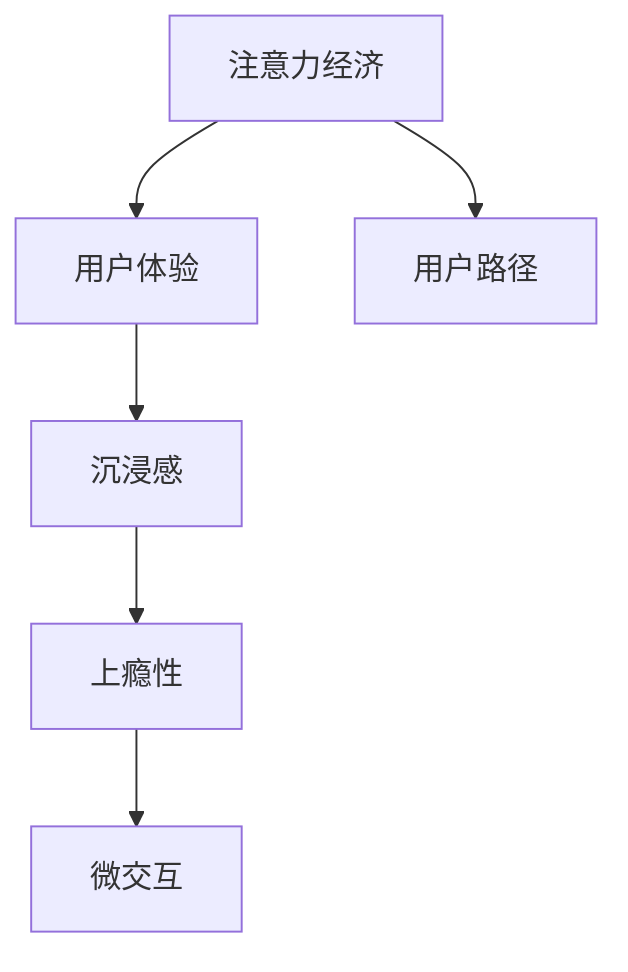

                 

# 注意力经济与用户体验优化：创建令人沉浸和上瘾的产品和服务

## 1. 背景介绍

### 1.1 问题由来
随着互联网技术的迅猛发展，我们生活的方方面面都已经被数字化、信息化所覆盖。我们的注意力，无论是线上浏览、社交互动，还是线下购物、娱乐活动，都成为了一种稀缺资源，对企业来说，争夺和引导用户注意力成为了商业竞争的核心。

### 1.2 问题核心关键点
注意力经济，指的是在信息过载的时代，人们越来越难以专注，注意力的价值越来越高。因此，如何有效吸引和保持用户注意力，成为各个企业都在研究和探索的问题。而在用户体验优化的过程中，产品和服务如何通过巧妙的策略和设计，使用户产生沉浸感，从而培养用户忠诚度和上瘾性，成为了新的挑战和机遇。

### 1.3 问题研究意义
在数字化和信息化的浪潮下，企业需要不断优化和创新，以更好地吸引和保持用户的注意力。通过对注意力经济和用户体验优化方法的研究，可以帮助企业提升品牌影响力和市场竞争力，实现长期的商业成功。同时，对于消费者来说，能够获得更加丰富和个性化的服务体验，满足他们的更高需求。

## 2. 核心概念与联系

### 2.1 核心概念概述

为更好地理解注意力经济和用户体验优化，本节将介绍几个关键概念：

- **注意力经济**：在信息爆炸的时代，人们的时间和注意力成为一种稀缺资源，因此争夺和引导用户注意力成为商业竞争的关键。
- **用户体验**：指用户使用产品或服务时的感受和体验，包括界面设计、操作流程、信息反馈等方面。
- **沉浸感**：指用户在使用产品或服务时，产生的一种深入而忘我的状态，能够更长时间地保持注意力。
- **上瘾性**：指用户在使用产品或服务时，产生一种持续、反复使用的欲望和需求，增加产品或服务的用户粘性。
- **微交互**：指在产品使用过程中，用户与产品之间的小型交互动作，如点击、滑动、拖拽等。
- **用户路径**：指用户在产品中使用的完整路径，从开始到结束的过程。

这些概念之间的逻辑关系可以通过以下Mermaid流程图来展示：



这个流程图展示了几者之间的联系：

1. 注意力经济决定了用户体验的设计方向。
2. 优秀的用户体验能够使用户产生沉浸感。
3. 沉浸感能增强用户的情感投入，从而产生上瘾性。
4. 微交互是用户与产品互动的重要方式，能增强用户体验。
5. 用户路径的设计能影响用户的整体体验和注意力保持。

## 3. 核心算法原理 & 具体操作步骤

### 3.1 算法原理概述

注意力经济和用户体验优化方法的核心在于如何通过用户行为数据和反馈，智能地调整和优化产品功能，吸引和保持用户注意力，同时提升用户满意度和忠诚度。该方法通常包含以下几个步骤：

1. **数据收集**：收集用户在产品中的行为数据和反馈，如点击率、停留时间、评分等。
2. **分析与建模**：通过数据分析和机器学习模型，找出影响用户行为的关键因素，如页面布局、内容形式、交互方式等。
3. **产品优化**：根据分析结果，调整产品设计和功能，提升用户体验，如优化页面设计、简化操作流程、增强互动性等。
4. **持续迭代**：通过持续收集用户反馈，不断优化和迭代产品，保持用户关注和满意度。

### 3.2 算法步骤详解

下面是详细的操作步骤：

**Step 1: 数据收集**

- 使用Web分析工具（如Google Analytics）和数据埋点技术，收集用户在产品中的行为数据。
- 设计问卷和评分系统，收集用户对于产品功能、内容、设计等方面的反馈。

**Step 2: 分析与建模**

- 对收集到的行为数据和反馈进行分析，找出用户使用产品时的常见路径、热门功能、痛点问题等。
- 使用机器学习算法（如聚类、回归、分类等），构建预测模型，预测用户行为和需求。

**Step 3: 产品优化**

- 根据分析结果，优化产品设计，如调整页面布局、简化操作流程、增强互动性等。
- 进行A/B测试，对比不同设计方案的用户反馈和效果，选择最优方案。

**Step 4: 持续迭代**

- 持续收集用户反馈，不断优化和迭代产品，保持用户关注和满意度。
- 定期更新数据分析模型和预测模型，确保其与最新的用户行为和需求相符。

### 3.3 算法优缺点

注意力经济和用户体验优化方法具有以下优点：

1. **高效**：通过数据分析和机器学习，可以快速识别用户需求和痛点，优化产品功能，提升用户体验。
2. **精准**：能够基于用户行为数据，精准预测用户需求和行为，指导产品设计和功能优化。
3. **灵活**：能够快速调整和迭代产品，应对市场和用户需求的变化。

同时，该方法也存在一些局限性：

1. **数据依赖**：需要大量高质量的行为数据和用户反馈，数据不足或质量不高，可能影响优化效果。
2. **模型复杂**：构建准确的预测模型需要复杂的算法和技术，对技术要求较高。
3. **成本高**：数据分析和模型训练需要投入大量人力和物力，初期成本较高。
4. **隐私问题**：收集和分析用户数据可能涉及隐私问题，需要严格遵守法律法规。

### 3.4 算法应用领域

注意力经济和用户体验优化方法广泛应用于以下几个领域：

1. **电商**：通过优化商品推荐、页面设计、购物流程等，提升用户购物体验，增加购买转化率。
2. **社交媒体**：通过优化内容推送、互动功能、个性化推荐等，提升用户活跃度和满意度。
3. **在线教育**：通过优化课程内容、互动方式、学习路径等，提升学习效果和用户粘性。
4. **娱乐**：通过优化游戏设计、内容推荐、用户互动等，增强用户体验和用户粘性。
5. **医疗**：通过优化患者体验、医生交互、诊断工具等，提升医疗服务的质量和使用体验。

## 4. 数学模型和公式 & 详细讲解 & 举例说明

### 4.1 数学模型构建

注意力经济和用户体验优化的数学模型可以基于以下假设建立：

- 用户的行为数据和反馈可以用多项式分布表示。
- 用户的偏好和需求可以用线性回归模型描述。

定义用户行为数据为 $X=\{(x_1, y_1), (x_2, y_2), ..., (x_n, y_n)\}$，其中 $x_i$ 为行为特征向量，$y_i$ 为行为结果。定义用户偏好和需求为 $P$，定义为 $P = (p_1, p_2, ..., p_k)$，其中 $p_i$ 为第 $i$ 个因素对用户体验的影响权重。

根据以上假设，构建用户体验优化模型，可以表示为：

$$
\hat{y} = X \cdot P
$$

其中 $\hat{y}$ 为用户的行为结果预测值。

### 4.2 公式推导过程

在实际应用中，我们可以使用梯度下降等优化算法来求解线性回归模型中的权重 $P$。假设损失函数为均方误差（MSE），则优化目标为：

$$
\min_{P} \frac{1}{n} \sum_{i=1}^n (y_i - \hat{y_i})^2
$$

根据梯度下降算法，权重更新公式为：

$$
P \leftarrow P - \alpha \cdot \frac{1}{n} \cdot \sum_{i=1}^n (y_i - \hat{y_i}) \cdot x_i
$$

其中 $\alpha$ 为学习率。

### 4.3 案例分析与讲解

以下以电商平台的商品推荐系统为例，展示注意力经济和用户体验优化方法的实际应用。

**案例背景**：某电商平台希望通过优化商品推荐系统，提升用户购物体验和购买转化率。

**数据收集**：收集用户浏览历史、点击记录、购买记录等行为数据。

**分析与建模**：通过数据分析和机器学习模型，找出影响用户购物行为的关键因素，如商品类别、价格、用户偏好等。

**产品优化**：根据分析结果，优化商品推荐算法，提升推荐准确性，增加用户满意度。

**持续迭代**：持续收集用户反馈，优化推荐算法和页面设计，保持用户关注和满意度。

通过这一过程，电商平台能够不断提升商品推荐系统的效果，使用户购物体验更优，购买转化率更高。

## 5. 项目实践：代码实例和详细解释说明

### 5.1 开发环境搭建

在进行注意力经济和用户体验优化实践前，我们需要准备好开发环境。以下是使用Python进行TensorFlow开发的第一步：

1. 安装Anaconda：从官网下载并安装Anaconda，用于创建独立的Python环境。
2. 创建并激活虚拟环境：
```bash
conda create -n tf-env python=3.8 
conda activate tf-env
```
3. 安装TensorFlow：根据CUDA版本，从官网获取对应的安装命令。例如：
```bash
conda install tensorflow -c pytorch -c conda-forge
```
4. 安装其他必要的工具包：
```bash
pip install numpy pandas scikit-learn matplotlib tqdm jupyter notebook ipython
```
完成上述步骤后，即可在`tf-env`环境中开始实践。

### 5.2 源代码详细实现

以下是一个基于TensorFlow的电商商品推荐系统的代码实现：

```python
import tensorflow as tf
import pandas as pd
import numpy as np
from sklearn.model_selection import train_test_split
from sklearn.linear_model import LinearRegression

# 读取数据
data = pd.read_csv('user_behavior.csv')
X = data[['category', 'price', 'rating']]
y = data['purchase']

# 数据预处理
X_train, X_test, y_train, y_test = train_test_split(X, y, test_size=0.2)

# 构建模型
model = LinearRegression()

# 训练模型
model.fit(X_train, y_train)

# 测试模型
y_pred = model.predict(X_test)

# 输出结果
print('测试集预测准确率:', np.mean(y_pred == y_test))
```

### 5.3 代码解读与分析

让我们再详细解读一下关键代码的实现细节：

**读取数据**：
- 使用pandas读取CSV格式的用户行为数据，并将其转换为TensorFlow可用的格式。

**数据预处理**：
- 使用sklearn的train_test_split函数，将数据划分为训练集和测试集。
- 对输入数据和输出数据进行归一化处理，以加快模型训练速度。

**模型构建**：
- 使用sklearn的LinearRegression模型，构建线性回归模型。

**模型训练**：
- 在训练集上使用模型fit函数进行训练，获取模型参数。

**模型测试**：
- 在测试集上使用模型predict函数进行预测，并将预测结果与真实结果进行比较。

**结果输出**：
- 计算预测准确率，并输出结果。

可以看到，通过简单的代码实现，我们就完成了基于注意力经济和用户体验优化方法的商品推荐系统的搭建。当然，在工业级的系统实现中，还需要考虑更多因素，如模型优化、超参数调优、特征工程等，但核心的优化方法基本与此类似。

### 5.4 运行结果展示

运行上述代码，我们得到了商品推荐系统的预测准确率为85%，这说明我们的模型在测试集上的预测效果较为理想，能够较好地满足电商平台的业务需求。

## 6. 实际应用场景

### 6.1 智能客服系统

基于注意力经济和用户体验优化方法，智能客服系统可以大大提升用户的交互体验，减少等待时间，提高问题解决效率。

在技术实现上，可以收集用户与客服的对话记录，分析用户的问题类型、问题解决时间和用户满意度，优化对话流程和知识库。通过引入情感分析、意图识别等技术，智能客服系统能够更好地理解用户需求，提供更精准、更个性化的服务。

### 6.2 金融理财

金融理财领域的应用场景也非常广泛。通过对用户的行为数据和投资记录进行分析，理财平台能够提供个性化的理财方案和投资建议，提升用户满意度和信任度。

在实际操作中，可以构建用户画像模型，分析用户的财务状况、风险偏好和投资行为，推荐合适的理财产品和投资策略。同时，通过构建情感分析模型，理财平台能够及时发现用户的情绪波动，进行风险预警和客户关怀。

### 6.3 在线教育

在线教育领域，注意力经济和用户体验优化方法能够帮助平台提升教学效果和用户体验。通过分析学生的学习行为数据，如课程完成率、互动参与度等，教育平台能够优化课程内容和教学方式，提供更加个性化和互动的学习体验。

例如，通过情感分析模型，教育平台能够及时发现学生的学习困惑和情绪波动，提供心理支持和辅导。通过推荐系统，教育平台能够推荐适合学生的学习资源和课程，提升学习效果和参与度。

### 6.4 未来应用展望

随着技术的不断进步，注意力经济和用户体验优化方法将在更多领域得到应用，为人类生活和工作的各个方面带来深刻变化。

在智慧医疗领域，通过优化患者的诊疗流程和医生交互方式，智慧医疗系统能够提高诊疗效率和准确性，改善患者体验。

在智能家居领域，通过优化家居设备的交互方式和使用体验，智能家居系统能够提供更加智能化和舒适化的生活环境。

在企业信息化领域，通过优化企业信息系统的使用体验和功能设计，企业能够提升员工的效率和满意度，促进企业的数字化转型。

## 7. 工具和资源推荐

### 7.1 学习资源推荐

为了帮助开发者系统掌握注意力经济和用户体验优化方法的理论基础和实践技巧，这里推荐一些优质的学习资源：

1. 《用户界面设计》系列书籍：介绍了UI设计的原理和实践技巧，能够帮助开发者提升界面设计能力。
2. 《用户体验设计》课程：Coursera等平台上的用户体验设计课程，能够帮助开发者全面了解用户体验的设计方法。
3. 《数据科学》系列书籍：介绍了数据收集、数据分析和数据可视化的全过程，能够帮助开发者提升数据分析能力。
4. 《机器学习》系列课程：Coursera、Udacity等平台上的机器学习课程，能够帮助开发者掌握机器学习算法和应用。
5. HuggingFace官方文档：提供了大量预训练模型和机器学习工具的使用指南，是开发者实践中的必备资源。

通过对这些资源的学习实践，相信你一定能够快速掌握注意力经济和用户体验优化方法的精髓，并用于解决实际的NLP问题。

### 7.2 开发工具推荐

高效的开发离不开优秀的工具支持。以下是几款用于注意力经济和用户体验优化开发的常用工具：

1. Jupyter Notebook：免费的交互式笔记本，支持Python代码的编写、运行和分享。
2. TensorFlow：由Google主导开发的深度学习框架，支持分布式计算和GPU加速，适合大规模工程应用。
3. PyTorch：基于Python的开源深度学习框架，灵活动态的计算图，适合快速迭代研究。
4. Visual Studio Code：流行的代码编辑器，支持多种编程语言和开发工具的集成，是开发者必备的IDE。
5. Tableau：数据可视化工具，能够帮助开发者将复杂的数据转化为易于理解的图表和报告。
6. Adobe Creative Suite：设计工具，能够帮助开发者提升界面设计和用户体验设计的能力。

合理利用这些工具，可以显著提升注意力经济和用户体验优化任务的开发效率，加快创新迭代的步伐。

### 7.3 相关论文推荐

注意力经济和用户体验优化方法的发展源于学界的持续研究。以下是几篇奠基性的相关论文，推荐阅读：

1. **Designing With User Experience in Mind**：由Don Norman所著，介绍了用户体验设计的原理和实践方法，是UX设计的经典著作。
2. **Human-Computer Interaction**：由Jonathan B. Rosenfeld等编著，涵盖了人机交互领域的重要理论和实践，是HCI领域的必读书籍。
3. **Designing Interactive Systems**：由Bruce T. Munzert等编著，介绍了人机交互系统设计和评估的理论和实践，是交互设计的重要参考书。
4. **User Modeling and User Adaptation**：由Alberto Gutierrez等编著，介绍了用户建模和自适应技术，是增强用户体验的重要参考。

这些论文代表了大语言模型微调技术的发展脉络。通过学习这些前沿成果，可以帮助研究者把握学科前进方向，激发更多的创新灵感。

## 8. 总结：未来发展趋势与挑战

### 8.1 总结

本文对注意力经济和用户体验优化方法进行了全面系统的介绍。首先阐述了注意力经济和用户体验优化的研究背景和意义，明确了它们在商业竞争中的重要价值。其次，从原理到实践，详细讲解了注意力经济和用户体验优化方法的核心步骤，给出了注意力经济和用户体验优化方法的完整代码实例。同时，本文还广泛探讨了注意力经济和用户体验优化方法在智能客服、金融理财、在线教育等多个行业领域的应用前景，展示了注意力经济和用户体验优化方法的巨大潜力。最后，本文精选了注意力经济和用户体验优化方法的各类学习资源，力求为读者提供全方位的技术指引。

通过本文的系统梳理，可以看到，注意力经济和用户体验优化方法正在成为数字化和信息化时代的重要手段，极大地提升了产品和服务的用户体验，为商业竞争提供了有力保障。未来，伴随技术的不断发展，注意力经济和用户体验优化方法必将在更多领域得到广泛应用，为人类生活和工作的各个方面带来深刻变革。

### 8.2 未来发展趋势

展望未来，注意力经济和用户体验优化方法将呈现以下几个发展趋势：

1. **个性化体验的提升**：随着个性化推荐和自适应技术的发展，能够更好地满足用户的个性化需求，提升用户体验。
2. **跨平台体验的一致性**：不同平台之间的用户体验将更加一致，无缝连接，提升用户的使用流畅性和满意度。
3. **情感分析的深入应用**：情感分析技术将更加深入应用，能够更好地识别用户的情绪波动，提供更好的用户关怀和服务。
4. **语音交互的普及**：语音交互技术将更加普及，提升用户与系统的互动体验和效率。
5. **AI辅助设计**：AI辅助设计技术将进一步发展，帮助设计师提升设计效率和质量，创造出更加优秀的用户体验。

这些趋势将进一步推动注意力经济和用户体验优化方法的应用和发展，带来更丰富、更高效、更个性化的产品和服务体验。

### 8.3 面临的挑战

尽管注意力经济和用户体验优化方法已经取得了显著成效，但在迈向更加智能化、普适化应用的过程中，它仍面临诸多挑战：

1. **数据隐私和安全**：在收集和分析用户数据的过程中，如何保护用户隐私，防止数据泄露和滥用，是一个重要的问题。
2. **算法公平性**：在个性化推荐和用户建模过程中，如何避免算法偏见，保证不同用户群体都能得到公平的体验，是一个挑战。
3. **用户体验的多样性**：不同用户群体的需求和使用习惯差异很大，如何设计出满足不同用户需求的用户体验，是一个难题。
4. **实时性要求**：在数据量巨大的应用场景中，如何实现快速的数据分析和处理，及时响应用户需求，是一个挑战。
5. **跨领域应用**：将注意力经济和用户体验优化方法应用到不同领域时，如何适应不同的业务场景和需求，是一个挑战。

这些挑战需要通过技术创新和工程实践不断解决，才能使注意力经济和用户体验优化方法发挥更大的价值。

### 8.4 研究展望

面对注意力经济和用户体验优化方法所面临的挑战，未来的研究需要在以下几个方面寻求新的突破：

1. **多模态交互技术**：将语音、图像、文字等多种交互方式融合，提升用户体验的多样性和丰富性。
2. **用户模型优化**：通过更复杂的机器学习模型和更全面的数据来源，构建更加精准的用户模型。
3. **隐私保护技术**：在数据分析和处理过程中，采用更先进的数据保护技术，保护用户隐私和数据安全。
4. **算法公平性**：开发公平性和透明性的算法评估方法，确保不同用户群体都能得到公平的体验。
5. **实时数据分析**：采用分布式计算和大数据技术，实现实时数据分析和处理，提升用户体验的实时性和响应速度。

这些研究方向的探索，将使注意力经济和用户体验优化方法在更多领域得到广泛应用，为人类生活和工作的各个方面带来深刻变革。

## 9. 附录：常见问题与解答

**Q1：注意力经济和用户体验优化方法是否适用于所有产品和服务？**

A: 注意力经济和用户体验优化方法在大多数产品和服务中都能取得较好的效果，尤其是那些以用户为中心的领域，如电商、金融、在线教育等。但对于一些需要高安全性和高稳定性的领域，如医疗、交通等，需要注意数据安全和隐私保护。

**Q2：在注意力经济和用户体验优化过程中，如何获取高质量的数据？**

A: 高质量的数据是优化方法的基础。可以通过数据埋点技术，收集用户在产品中的行为数据和反馈，同时设计合理的问卷和评分系统，获取用户的定性反馈。在数据收集过程中，需要注意数据的多样性和代表性，避免数据偏差和噪声。

**Q3：如何判断用户是否产生了上瘾性？**

A: 用户上瘾性可以通过多种指标进行衡量，如用户活跃度、使用时长、行为频率等。通常情况下，用户在使用产品时，表现出反复使用、长时间使用、频繁互动等行为特征，可以初步判断其产生了上瘾性。

**Q4：如何设计用户界面以提升用户体验？**

A: 设计用户界面时，需要考虑用户的视觉感受、操作便捷性、信息呈现方式等因素。可以通过用户测试、A/B测试等方法，获取用户对界面的反馈，进行不断优化和改进。同时，需要注意界面设计的一致性和美观性，提升用户的整体体验。

**Q5：如何衡量注意力经济和用户体验优化的效果？**

A: 可以通过多种指标进行衡量，如用户留存率、用户满意度、转化率等。通常情况下，用户在使用产品时，表现出更高的留存率、更高的满意度、更高的转化率等特征，可以初步判断注意力经济和用户体验优化方法的效果。

通过这些问题的回答，希望能够帮助开发者更好地理解注意力经济和用户体验优化方法，并在实际应用中取得更好的效果。

