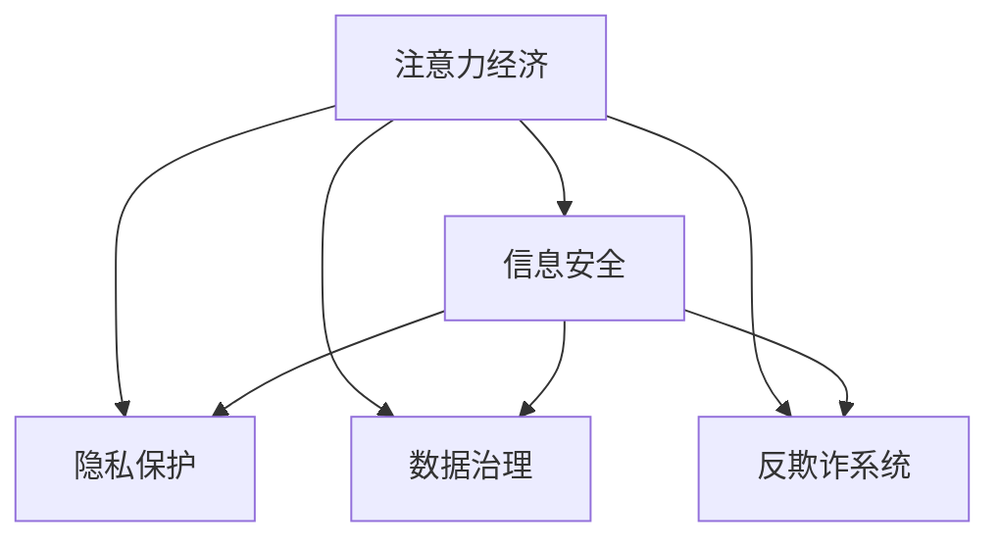

                 

## 1. 背景介绍

随着互联网和移动互联网的迅猛发展，信息的生产、传播、消费呈现出指数级增长，数据和信息已经成为重要的经济资源，催生了“注意力经济”这一新的经济形态。在注意力经济时代，企业和个人需要更加精细化地管理和利用信息资源，以实现最大化的经济价值和社会效益。

然而，信息安全问题在注意力经济中也日益凸显，信息泄露、数据滥用、隐私侵犯等事件频发，不仅威胁到个人和企业的数据安全，也严重影响到了用户的信任和体验，甚至可能对社会的稳定和国家的安全造成影响。因此，如何保障注意力经济中的信息安全，成为了亟待解决的重要问题。

## 2. 核心概念与联系

### 2.1 核心概念概述

为更好地理解注意力经济中的信息安全问题，本节将介绍几个密切相关的核心概念：

- 注意力经济：指在互联网时代，注意力资源成为重要的经济资源，企业通过吸引和利用用户注意力来创造价值的过程。

- 信息安全：指保护信息在存储、传输、使用过程中的保密性、完整性和可用性，防止未经授权的访问、修改和破坏。

- 隐私保护：指保护个人和组织的隐私信息，防止隐私泄露和滥用。

- 数据治理：指通过标准化、规范化和制度化手段，管理和优化数据资源的收集、存储、共享和利用，确保数据的质量和安全。

- 反欺诈系统：指利用人工智能和大数据分析技术，实时监测和识别欺诈行为，保障金融交易、电商支付等业务的安全性。

这些核心概念之间的逻辑关系可以通过以下Mermaid流程图来展示：



这个流程图展示了的核心概念及其之间的关系：

1. 注意力经济依赖于信息资源的有效管理和利用。
2. 信息安全是保护注意力经济中的信息资源不被泄露和破坏的前提。
3. 隐私保护和数据治理是确保信息安全和注意力的合规使用的基础。
4. 反欺诈系统是基于信息安全的一部分，用于保护金融等高风险业务的安全。

这些概念共同构成了注意力经济中的信息安全体系，对保障注意力资源的高效、安全和合规利用具有重要意义。

## 3. 核心算法原理 & 具体操作步骤
### 3.1 算法原理概述

在注意力经济中，信息安全问题主要体现在以下几个方面：

- **数据泄露**：企业内部数据、客户隐私等敏感信息被非法获取和利用。
- **数据滥用**：未经授权的数据被用于商业竞争、广告投放、定向营销等目的。
- **欺诈行为**：利用虚假信息或假冒身份进行诈骗，如网络钓鱼、金融诈骗等。

针对这些安全问题，常见的解决手段包括数据加密、访问控制、异常检测等技术。其中，基于注意力经济特性的信息安全问题，特别关注如何利用机器学习和大数据分析技术，对用户注意力进行有效监控和分析，识别潜在风险，从而实现信息安全的保障。

### 3.2 算法步骤详解

下面详细介绍基于机器学习和大数据分析的信息安全算法步骤：

**Step 1: 数据预处理**

- 收集和整理相关数据集，如用户行为数据、交易记录、点击流数据等。
- 对数据进行清洗和归一化，确保数据的质量和一致性。
- 根据不同的安全需求，选择合适的特征提取方法，如TF-IDF、Word2Vec等。

**Step 2: 模型训练**

- 选择适合的信息安全模型，如分类模型、聚类模型、异常检测模型等。
- 利用预处理后的数据集，对模型进行训练和调优。
- 在训练过程中，需要特别注意数据分布、特征选择和模型选择等问题，以确保模型的泛化能力和鲁棒性。

**Step 3: 模型应用**

- 将训练好的模型应用于实际的注意力经济场景，如金融交易监控、广告投放优化等。
- 实时监控用户行为和交易数据，识别异常行为和潜在风险。
- 根据模型输出结果，采取相应的安全措施，如限制交易、禁止访问等。

**Step 4: 模型评估与优化**

- 定期对模型的性能进行评估，如准确率、召回率、F1值等指标。
- 根据评估结果，不断优化模型和算法，提升信息安全保障能力。
- 引入反馈机制，利用用户反馈信息进行模型迭代和改进。

### 3.3 算法优缺点

基于机器学习和大数据分析的信息安全算法，具有以下优点：

- **高准确性**：利用机器学习技术，可以识别复杂的、难以察觉的安全威胁，提高信息安全防护的准确性。
- **实时性**：通过大数据分析技术，可以实现实时监控和响应，保障信息安全的时效性。
- **可扩展性**：算法可以灵活应用于各种注意力经济场景，具备良好的可扩展性。

同时，该算法也存在一定的局限性：

- **数据隐私**：在数据预处理和训练过程中，可能存在隐私泄露的风险。
- **过拟合问题**：模型可能会对特定的数据分布进行过拟合，泛化能力有限。
- **计算资源消耗**：大数据分析和高精度模型训练需要大量的计算资源，可能存在性能瓶颈。
- **模型复杂性**：算法涉及复杂的机器学习和大数据分析技术，对技术和数据的要求较高。

尽管存在这些局限性，但该方法仍是大规模注意力经济信息安全保障的重要手段。未来相关研究的重点在于如何进一步提高算法的精度、降低计算资源消耗，同时兼顾隐私保护和模型复杂性。

### 3.4 算法应用领域

基于机器学习和大数据分析的信息安全算法，已经在多个注意力经济领域得到了广泛应用，如金融、电商、社交媒体等，具体应用场景包括：

- **金融交易监控**：通过实时分析交易数据，识别潜在的欺诈行为和风险事件，保障金融交易的安全性。
- **广告投放优化**：利用用户行为数据，识别潜在风险用户，优化广告投放策略，提升广告投放效果。
- **社交媒体内容监管**：通过分析用户言论和行为数据，识别违法和有害信息，保障社交媒体内容的安全性。
- **电商平台安全**：通过实时监控交易和支付数据，识别异常行为和欺诈交易，保护电商平台和用户的安全。
- **智能客服安全**：通过分析用户对话数据，识别潜在的欺诈行为和恶意攻击，保障智能客服系统的安全性。

除了上述这些经典应用外，大语言模型微调方法也被创新性地应用到更多场景中，如可控文本生成、常识推理、代码生成、数据增强等，为NLP技术带来了全新的突破。随着预训练模型和微调方法的不断进步，相信NLP技术将在更广阔的应用领域大放异彩。

## 4. 数学模型和公式 & 详细讲解  
### 4.1 数学模型构建

在注意力经济中，信息安全问题可以通过多种数学模型来建模，如分类模型、聚类模型、异常检测模型等。这里以异常检测模型为例，介绍基于机器学习的信息安全模型构建方法。

假设我们有一组标记好的训练数据集 $D=\{(x_i, y_i)\}_{i=1}^N$，其中 $x_i$ 为输入数据，$y_i$ 为标记标签。目标是根据这些训练数据，训练一个异常检测模型 $M_{\theta}$，对新的输入数据进行异常检测。

**Step 1: 特征提取**

- 对每个输入数据 $x_i$，提取一组特征向量 $f_i$。特征提取可以采用多种方法，如TF-IDF、Word2Vec、PCA等。

**Step 2: 训练模型**

- 根据提取的特征向量 $f_i$，训练一个异常检测模型 $M_{\theta}$。常见的异常检测模型包括：
  - **离群点检测**：假设数据服从正态分布，利用均值和方差计算异常得分，识别离群点。
  - **孤立森林**：通过随机切割，构建决策树，识别孤立点。
  - **孤立子空间分析**：在低维子空间中识别异常点，识别复杂结构下的异常。
  - **One-Class SVM**：利用核技巧，将异常检测转化为分类问题，识别正类和异常类。

**Step 3: 预测异常**

- 对新的输入数据 $x$，提取特征向量 $f$，利用训练好的模型 $M_{\theta}$，计算异常得分 $s(x)$，根据阈值 $t$ 判断是否为异常点。

**Step 4: 模型评估**

- 在测试集上评估模型的性能指标，如准确率、召回率、F1值等。
- 利用交叉验证等方法，避免过拟合问题。
- 引入正则化技术，如L2正则、Dropout等，防止模型过拟合。

### 4.2 公式推导过程

以下我们以孤立森林（Isolation Forest）为例，推导异常检测模型的训练和预测过程。

假设我们的训练数据集 $D=\{(x_i, y_i)\}_{i=1}^N$，其中 $y_i \in \{0,1\}$，$y_i=1$ 表示正类（正常数据），$y_i=0$ 表示异常类。

**Step 1: 特征提取**

假设对每个输入数据 $x_i$，提取一组特征向量 $f_i$，长度为 $d$。

**Step 2: 训练模型**

孤立森林模型假设异常点相对于正常点的切割次数更少。因此，通过随机切割，构建决策树，计算每个数据点的切割次数 $s_i$，然后利用 $s_i$ 训练模型。

孤立森林的训练过程如下：
- 随机选择 $n$ 个特征和 $n$ 个切割点。
- 随机选择 $n$ 个数据点作为切割点，构建一棵随机切割的树。
- 对每个数据点 $x_i$，计算其切割次数 $s_i$。

**Step 3: 预测异常**

对于新的输入数据 $x$，提取特征向量 $f$，利用训练好的模型 $M_{\theta}$，计算异常得分 $s(x)$，判断是否为异常点。

异常得分 $s(x)$ 的计算如下：
$$
s(x) = \frac{1}{n}\sum_{i=1}^n\log_2\frac{2d}{1 + s_i}
$$

其中 $s_i$ 为模型对数据点 $x_i$ 的切割次数。

### 4.3 案例分析与讲解

下面以金融交易监控为例，展示基于机器学习的信息安全模型构建和应用过程。

**案例背景**

某电商平台在金融交易监控中，发现存在大量异常交易行为，需要建立异常检测模型，及时发现和阻止这些异常交易。

**数据准备**

- 收集平台上的金融交易数据，标记是否为异常交易。
- 对交易数据进行清洗和归一化，提取有用的特征。
- 将数据集划分为训练集和测试集。

**模型训练**

- 选择孤立森林模型，训练异常检测模型。
- 利用训练集数据，进行交叉验证和调参，选择最优的参数。

**模型应用**

- 在实时交易数据上，提取特征向量。
- 利用训练好的模型，计算异常得分。
- 根据阈值，识别异常交易，并采取相应的安全措施。

**模型评估**

- 在测试集上评估模型的性能指标，如准确率、召回率、F1值等。
- 引入正则化技术，防止模型过拟合。
- 持续优化模型，提升异常检测能力。

## 5. 项目实践：代码实例和详细解释说明
### 5.1 开发环境搭建

在进行信息安全算法实践前，我们需要准备好开发环境。以下是使用Python进行项目实践的环境配置流程：

1. 安装Anaconda：从官网下载并安装Anaconda，用于创建独立的Python环境。

2. 创建并激活虚拟环境：
```bash
conda create -n info-security python=3.8 
conda activate info-security
```

3. 安装必要的Python库：
```bash
pip install pandas numpy matplotlib sklearn scikit-learn tensorflow matplotlib
```

4. 安装H2O：
```bash
conda install h2oai/h2o -c conda-forge
```

5. 安装TensorFlow和Keras：
```bash
pip install tensorflow
pip install keras
```

完成上述步骤后，即可在`info-security`环境中开始项目实践。

### 5.2 源代码详细实现

这里我们以孤立森林模型为例，展示信息安全模型的源代码实现。

首先，定义数据处理函数：

```python
import pandas as pd
import numpy as np
from sklearn.preprocessing import StandardScaler
from sklearn.model_selection import train_test_split
from sklearn.ensemble import IsolationForest

def load_data(file_path):
    data = pd.read_csv(file_path)
    X = data.drop('label', axis=1)
    y = data['label']
    return X, y

def preprocess_data(X):
    scaler = StandardScaler()
    X = scaler.fit_transform(X)
    return X

def train_model(X, y, n, max_depth):
    X_train, X_test, y_train, y_test = train_test_split(X, y, test_size=0.2)
    model = IsolationForest(n_estimators=n, max_depth=max_depth, contamination=0.1)
    model.fit(X_train)
    return model

def evaluate_model(model, X_test, y_test):
    y_pred = model.predict(X_test)
    acc = np.mean(y_pred == y_test)
    return acc
```

然后，定义模型训练和评估函数：

```python
from sklearn.metrics import accuracy_score
from h2o.estimators import H2OIsolationForest

def train_h2o_model(X, y, n, max_depth):
    X_train, X_test, y_train, y_test = train_test_split(X, y, test_size=0.2)
    model = H2OIsolationForest(n_estimators=n, max_depth=max_depth, contamination=0.1)
    model.train(X_train)
    return model

def evaluate_h2o_model(model, X_test, y_test):
    y_pred = model.predict(X_test)
    acc = accuracy_score(y_test, y_pred)
    return acc
```

最后，启动模型训练和评估流程：

```python
n = 100
max_depth = 30
X, y = load_data('transaction_data.csv')
X = preprocess_data(X)

h2o_model = train_h2o_model(X, y, n, max_depth)
acc = evaluate_h2o_model(h2o_model, X_test, y_test)
print('Accuracy:', acc)
```

以上就是使用Python和H2O对孤立森林模型进行金融交易监控的代码实现。可以看到，通过H2O的强大计算能力和丰富的算法库，我们可以快速搭建并优化模型，实现高效的信息安全监控。

### 5.3 代码解读与分析

让我们再详细解读一下关键代码的实现细节：

**load_data函数**：
- 定义了数据加载函数，从CSV文件中读取交易数据，并返回特征矩阵X和标签y。

**preprocess_data函数**：
- 对特征矩阵X进行标准化处理，归一化数据分布，确保数据的可比性。

**train_model函数**：
- 定义了训练模型函数，利用孤立森林算法训练异常检测模型，返回训练好的模型。

**evaluate_model函数**：
- 定义了模型评估函数，计算模型的准确率，评估模型性能。

**train_h2o_model函数**：
- 利用H2O的IsolationForest算法训练孤立森林模型，返回训练好的模型。

**evaluate_h2o_model函数**：
- 利用H2O模型评估模型的准确率，对比和测试模型性能。

**训练流程**：
- 定义孤立森林模型的参数n和max_depth。
- 加载数据，对数据进行预处理。
- 利用训练函数train_h2o_model训练模型，获取训练好的模型。
- 利用评估函数evaluate_h2o_model评估模型性能，输出准确率。

## 6. 实际应用场景
### 6.1 智能客服安全

在智能客服系统中，利用机器学习和大数据分析技术，可以实时监控用户对话数据，识别潜在的欺诈行为和恶意攻击，保障客服系统的安全性。具体而言，可以构建基于用户行为、语音、文字等多种特征的异常检测模型，识别异常的对话模式和语音特征，及时采取安全措施，防止用户信息泄露和诈骗。

### 6.2 金融交易监控

在金融交易中，利用机器学习和大数据分析技术，可以实时监测交易数据，识别潜在的欺诈行为和风险事件，保障金融交易的安全性。具体而言，可以构建基于交易金额、交易时间、交易地点等多种特征的异常检测模型，识别异常的交易行为和金额，及时阻止异常交易，防止金融风险。

### 6.3 社交媒体内容监管

在社交媒体中，利用机器学习和大数据分析技术，可以实时监测用户言论和行为数据，识别违法和有害信息，保障社交媒体内容的安全性。具体而言，可以构建基于用户言论、行为、互动等多种特征的异常检测模型，识别异常的言论和行为，及时采取安全措施，防止有害信息的传播。

### 6.4 电商平台安全

在电商平台上，利用机器学习和大数据分析技术，可以实时监控交易和支付数据，识别异常行为和欺诈交易，保护电商平台和用户的安全。具体而言，可以构建基于交易金额、交易时间、交易地点等多种特征的异常检测模型，识别异常的交易行为和金额，及时阻止异常交易，防止欺诈行为。

## 7. 工具和资源推荐
### 7.1 学习资源推荐

为了帮助开发者系统掌握信息安全问题的理论基础和实践技巧，这里推荐一些优质的学习资源：

1. 《机器学习实战》系列博文：由机器学习专家撰写，详细介绍了机器学习的基本概念和经典算法，适合入门学习。

2. 《深度学习入门》课程：由斯坦福大学开设的深度学习课程，涵盖了深度学习的基础知识和实践技能，适合进一步学习。

3. 《人工智能安全》书籍：深入浅出地介绍了人工智能安全的基本概念和实践技术，适合深入学习和研究。

4. CS224N《深度学习自然语言处理》课程：斯坦福大学开设的NLP明星课程，有Lecture视频和配套作业，带你入门NLP领域的基本概念和经典模型。

5. Kaggle机器学习竞赛：全球知名的数据科学竞赛平台，提供大量的实际数据集和模型评测，适合实战练习。

通过对这些资源的学习实践，相信你一定能够快速掌握信息安全问题的精髓，并用于解决实际的注意力经济问题。

### 7.2 开发工具推荐

高效的开发离不开优秀的工具支持。以下是几款用于信息安全算法开发的常用工具：

1. Jupyter Notebook：开源的交互式笔记本环境，方便代码调试和文档编辑。

2. PyCharm：功能强大的Python IDE，支持代码编写、调试、测试和部署。

3. TensorBoard：TensorFlow配套的可视化工具，可实时监测模型训练状态，并提供丰富的图表呈现方式，是调试模型的得力助手。

4. Scikit-learn：Python机器学习库，提供了丰富的机器学习算法和工具，适合数据处理和模型构建。

5. H2O.ai：大数据分析平台，支持高效的数据处理和模型训练，适合大规模数据集的处理和分析。

合理利用这些工具，可以显著提升信息安全算法的开发效率，加快创新迭代的步伐。

### 7.3 相关论文推荐

信息安全问题涉及多个领域的交叉研究，以下是几篇奠基性的相关论文，推荐阅读：

1. Anomaly Detection in Data Mining: A Survey（异常检测综述）：回顾了异常检测算法的研究进展，介绍了常用的异常检测方法和模型。

2. H2O Isolation Forest: Efficient Anomaly Detection with Isolation Forests（孤立森林算法）：提出了一种高效的异常检测算法，利用随机切割构建决策树，识别异常点。

3. Isolation Forest: Anomaly Detection with Local Outlier Factor（孤立森林算法）：提出了一种基于局部离群因子（LOF）的异常检测算法，利用数据分布的不一致性识别异常点。

4. One-Class SVM: An Introduction to the Theory and Application of One-Class SVM（One-Class SVM算法）：提出了一种基于支持向量机（SVM）的异常检测算法，利用核技巧处理非线性数据。

这些论文代表了大规模信息安全研究的发展脉络。通过学习这些前沿成果，可以帮助研究者把握学科前进方向，激发更多的创新灵感。

## 8. 总结：未来发展趋势与挑战

### 8.1 总结

本文对基于机器学习和大数据分析的信息安全问题进行了全面系统的介绍。首先阐述了信息安全问题的研究背景和重要性，明确了信息安全在注意力经济中的关键地位。其次，从原理到实践，详细讲解了信息安全问题的数学模型和算法步骤，给出了信息安全算法的代码实现。同时，本文还广泛探讨了信息安全问题在智能客服、金融交易、社交媒体等领域的实际应用，展示了信息安全范式的巨大潜力。此外，本文精选了信息安全问题的学习资源，力求为读者提供全方位的技术指引。

通过本文的系统梳理，可以看到，基于机器学习和大数据分析的信息安全方法在注意力经济中具有重要的应用价值，能够显著提升信息安全保障能力。未来，伴随技术手段的不断演进，信息安全技术必将发挥越来越重要的作用，为注意力经济的健康发展保驾护航。

### 8.2 未来发展趋势

展望未来，信息安全问题将呈现以下几个发展趋势：

1. **技术融合加速**：随着AI和大数据技术的不断发展，信息安全问题将与其他技术进行更深层次的融合，如区块链、联邦学习、边缘计算等。技术融合将带来更高效、更安全的解决方案。

2. **隐私保护加强**：伴随数据隐私意识的提升，隐私保护技术将得到更加广泛的应用，如差分隐私、联邦学习、多方安全计算等，确保用户数据的安全性和隐私性。

3. **实时性提升**：信息安全问题将更加注重实时性和自动化，利用边缘计算、实时数据流处理等技术，实现秒级甚至毫秒级的响应速度，提升信息安全的防护能力。

4. **模型复杂性降低**：模型复杂性是当前信息安全算法面临的一大挑战。未来将通过简化模型结构和算法，提升算法的效率和可解释性，降低计算资源的消耗。

5. **自动化和智能化**：随着自动化和智能化技术的普及，信息安全问题将更加依赖AI和大数据分析技术，自动化生成威胁检测规则和异常行为模型，提升信息安全的自动化水平。

6. **跨领域应用拓展**：信息安全问题将不再局限于单一领域，而是广泛应用于更多行业，如医疗、教育、制造等，为各行业提供信息安全保障。

以上趋势凸显了信息安全问题的重要性和挑战性，对保障注意力经济中的信息安全具有重要的指导意义。

### 8.3 面临的挑战

尽管信息安全技术已经取得了显著进展，但在迈向更加智能化、普适化应用的过程中，仍面临着诸多挑战：

1. **数据隐私问题**：在数据预处理和训练过程中，如何保护数据隐私，防止数据泄露和滥用，是一个重要的挑战。

2. **模型泛化能力**：模型往往对特定的数据分布进行过拟合，泛化能力有限。如何提升模型的泛化能力，以应对不同领域的数据分布变化，是一个亟待解决的问题。

3. **计算资源消耗**：大数据分析和模型训练需要大量的计算资源，可能存在性能瓶颈。如何优化计算资源消耗，降低算法的成本，是一个重要的研究方向。

4. **模型可解释性**：当前信息安全算法往往黑箱化，难以解释其内部工作机制和决策逻辑。如何赋予模型更强的可解释性，提高模型的透明度和可信度，是一个重要的研究方向。

5. **模型复杂性**：算法涉及复杂的机器学习和大数据分析技术，对技术和数据的要求较高。如何降低算法复杂性，提高算法的易用性和可操作性，是一个重要的研究方向。

6. **模型鲁棒性**：模型在面对恶意攻击和异常数据时，可能出现鲁棒性不足的问题。如何提高模型的鲁棒性，提升模型的抗干扰能力，是一个重要的研究方向。

正视信息安全问题面临的这些挑战，积极应对并寻求突破，将是大规模注意力经济信息安全保障的重要课题。

### 8.4 研究展望

面对信息安全问题所面临的种种挑战，未来的研究需要在以下几个方面寻求新的突破：

1. **隐私保护技术**：引入差分隐私、联邦学习、多方安全计算等隐私保护技术，确保数据的安全性和隐私性。

2. **模型泛化能力**：通过数据增强、迁移学习、无监督学习等方法，提升模型的泛化能力，应对不同领域的数据分布变化。

3. **计算资源优化**：通过模型裁剪、量化加速、混合精度训练等方法，降低算法的计算资源消耗，提升算法的效率和可扩展性。

4. **模型可解释性**：引入可解释性技术，如特征重要性分析、解释模型等，提高模型的透明度和可信度，增强用户信任。

5. **自动化和智能化**：利用AI和大数据分析技术，自动生成威胁检测规则和异常行为模型，提升信息安全的自动化水平。

6. **跨领域应用**：将信息安全技术应用于更多行业，如医疗、教育、制造等，为各行业提供信息安全保障，实现跨领域应用的广泛推广。

这些研究方向将推动信息安全技术不断进步，为大规模注意力经济的信息安全提供更全面、更有效的解决方案。

## 9. 附录：常见问题与解答

**Q1: 如何提高信息安全算法的准确性？**

A: 提高信息安全算法的准确性需要从多个方面进行优化：
- 数据预处理：确保数据的质量和一致性，提取有用的特征。
- 模型选择：选择合适的算法和模型，如孤立森林、One-Class SVM等，提升算法的准确性。
- 调参优化：利用交叉验证等方法，进行模型调参和优化，提升模型性能。
- 异常检测：通过数据增强、模型融合等方法，提升异常检测的准确性。

**Q2: 如何处理信息安全问题中的计算资源消耗？**

A: 处理信息安全问题中的计算资源消耗，需要采用以下方法：
- 模型裁剪：去除不必要的层和参数，减小模型尺寸，加快推理速度。
- 量化加速：将浮点模型转为定点模型，压缩存储空间，提高计算效率。
- 混合精度训练：采用混合精度训练方法，降低计算资源消耗。
- 模型并行：采用模型并行、分布式训练等方法，提高算法的可扩展性。

**Q3: 如何应对信息安全问题中的数据隐私问题？**

A: 应对信息安全问题中的数据隐私问题，需要采用以下方法：
- 差分隐私：通过加入噪声，保护数据隐私，防止数据泄露和滥用。
- 联邦学习：在数据本地化的情况下，利用分布式训练技术，保护数据隐私。
- 多方安全计算：通过多方安全计算技术，保护数据隐私，防止数据泄露和滥用。
- 加密技术：利用加密技术，保护数据隐私，防止数据泄露和滥用。

**Q4: 如何提升信息安全算法的实时性？**

A: 提升信息安全算法的实时性需要采用以下方法：
- 边缘计算：将计算任务分布到边缘设备，降低数据传输延时，提升实时性。
- 实时数据流处理：利用实时数据流处理技术，实现秒级甚至毫秒级的响应速度，提升实时性。
- 轻量级模型：设计轻量级模型，减少计算资源消耗，提升实时性。

**Q5: 如何增强信息安全算法的可解释性？**

A: 增强信息安全算法的可解释性需要采用以下方法：
- 特征重要性分析：利用特征重要性分析方法，解释模型的决策过程。
- 解释模型：引入解释模型，提高模型的透明度和可信度，增强用户信任。
- 可解释性技术：利用可解释性技术，如LIME、SHAP等，解释模型的决策过程。

通过这些方法，可以逐步提高信息安全算法的准确性、实时性、可解释性和鲁棒性，为大规模注意力经济的信息安全提供更全面、更有效的解决方案。

