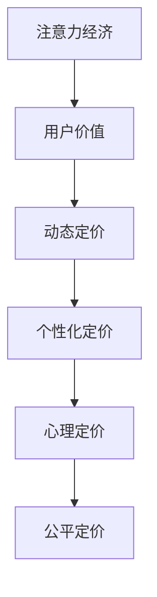

                 

# 注意力经济对企业产品定价的新要求

## 1. 背景介绍

在信息爆炸的互联网时代，注意力成为稀缺资源。企业的营销和产品推广，不再仅限于传统的媒体广告，而是通过内容创作、社交互动、个性化推荐等方式争夺用户眼球。在“注意力经济”环境下，企业对产品定价策略也提出了新的要求：如何以较低成本吸引用户注意力，如何通过定价手段最大化用户价值，如何动态调整价格以应对市场变化。本文将从注意力经济的基本概念出发，探讨其在企业产品定价中的应用，并结合实例分析如何优化产品定价策略。

## 2. 核心概念与联系

### 2.1 核心概念概述

为更好地理解注意力经济对产品定价的影响，我们先简要介绍几个关键概念：

- **注意力经济**：指在信息过载的时代，企业通过获取用户注意力来创造经济价值的活动。注意力是获取用户注意力和影响用户行为的关键因素，因此也被视为一种经济资源。

- **用户价值**：指用户在使用产品或服务时所获得的满足感，包括功能体验、心理感受、社会认同等多方面因素。企业通过定价策略优化用户价值，以实现经济目标。

- **动态定价**：指根据市场需求、竞争状况、用户行为等因素，实时调整产品价格的策略。动态定价能够最大化用户价值，同时优化企业收益。

- **个性化定价**：指根据用户的个人特征、行为习惯、历史记录等信息，对不同用户设定差异化的定价策略，提升用户体验和满意度。

- **心理定价**：指通过价格信号传递产品信息，影响消费者行为。如尾数定价、打包销售、会员制度等策略。

- **公平定价**：指根据成本、价值和社会接受度等标准，设定合理的价格，实现消费者、企业和社会的多方共赢。

以上概念之间的关系可以用下面的Mermaid流程图进行表示：



该图展示了注意力经济如何通过影响用户价值，进而影响动态定价、个性化定价、心理定价和公平定价策略，最终实现企业的经济目标。

## 3. 核心算法原理 & 具体操作步骤

### 3.1 算法原理概述

在注意力经济背景下，产品定价不再是一个静态的数值，而是一个动态的决策过程。企业需要实时监测市场变化和用户行为，以灵活调整产品价格。动态定价的核心在于利用价格信号调节市场需求，通过价格的变动最大化企业收益和用户价值。

动态定价的数学原理可以简单表述为：

$$
P_t = f(D_t, C_t, T_t, P_{t-1})
$$

其中，$P_t$ 为第 $t$ 时刻的产品价格，$D_t$ 为市场需求，$C_t$ 为产品成本，$T_t$ 为竞争状况，$P_{t-1}$ 为上一时刻的价格。动态定价的优化目标是在最大化企业收益的同时，确保用户价值和公平定价。

### 3.2 算法步骤详解

动态定价的实现过程可以分为以下几个关键步骤：

1. **需求预测**：通过历史销售数据、用户行为数据、市场趋势等，预测未来的市场需求。需求预测的准确性直接影响定价决策。

2. **成本评估**：评估产品的生产、运营、分销等成本。成本是定价的重要依据，确保价格的合理性和企业的盈利性。

3. **竞争分析**：分析同行业其他产品的价格和市场表现，了解竞争环境。竞争分析有助于制定合理的定价策略，避免过度竞争或价格陷阱。

4. **价格调整**：根据需求预测、成本评估和竞争分析的结果，设定初始价格。利用动态定价算法，实时调整价格，优化收益和用户价值。

5. **效果评估**：监测定价调整后的市场反应和用户反馈，评估策略效果。根据评估结果，进一步优化定价模型。

### 3.3 算法优缺点

动态定价具有以下优点：

- **市场响应灵活**：能够实时调整价格，适应市场变化，最大化收益。
- **用户价值优化**：通过价格调整，提高用户满意度和忠诚度，增加用户粘性。
- **成本管理**：合理评估成本，确保定价策略的经济性。

同时，动态定价也存在一些局限：

- **复杂度高**：需求预测、成本评估、竞争分析等都需要大量数据和复杂模型，实施成本较高。
- **价格透明度**：实时定价策略可能降低价格透明度，影响用户信任。
- **策略博弈**：竞争对手的动态定价策略可能对企业定价造成干扰，影响策略效果。

### 3.4 算法应用领域

动态定价的应用领域广泛，包括但不限于：

- **电商平台**：如亚马逊、淘宝等，通过实时竞价、促销活动等方式优化产品价格。
- **酒店服务**：如Booking.com，通过根据季节、节假日等需求变化动态调整房间价格。
- **交通出行**：如Uber、滴滴出行，通过实时定价策略优化运力配置，提高服务效率。
- **旅游服务**：如Airbnb，通过动态定价策略应对旅游旺季需求，优化用户体验。

## 4. 数学模型和公式 & 详细讲解 & 举例说明

### 4.1 数学模型构建

动态定价的数学模型可以简化为线性回归模型：

$$
P_t = \beta_0 + \beta_1D_t + \beta_2C_t + \beta_3T_t + \beta_4P_{t-1} + \epsilon_t
$$

其中，$\beta_0$ 为截距项，$\beta_1$ 到 $\beta_4$ 为各影响因素的系数，$\epsilon_t$ 为随机误差项。该模型表示在给定市场需求、成本、竞争状况和上一时刻价格的基础上，通过线性回归预测第 $t$ 时刻的价格。

### 4.2 公式推导过程

动态定价的推导过程主要涉及线性回归模型的建立和求解。通过最小二乘法，可以求解出各系数 $\beta_0$ 到 $\beta_4$，从而构建动态定价模型：

$$
\beta = (X^TX)^{-1}X^Ty
$$

其中，$X$ 为自变量矩阵，$Y$ 为目标变量向量，$\beta$ 为回归系数向量。求解后的模型可以用来预测价格 $P_t$。

### 4.3 案例分析与讲解

以某电商平台为例，假设某产品的价格预测模型为：

$$
P_t = 100 + 0.5D_t + 0.2C_t - 0.1T_t + 0.8P_{t-1} + \epsilon_t
$$

其中，$D_t$ 为当天的预测订单数，$C_t$ 为当天的平均成本，$T_t$ 为当天的竞价次数，$P_{t-1}$ 为前一天的价格。

假设初始价格为 $100$，在给定 $D_t=1000$，$C_t=20$，$T_t=50$ 和 $P_{t-1}=95$ 的情况下，使用动态定价算法，可以预测出最优价格为：

$$
P_t = 100 + 0.5 \times 1000 + 0.2 \times 20 - 0.1 \times 50 + 0.8 \times 95 + \epsilon_t \approx 238.3
$$

在实际应用中，通过迭代更新 $\epsilon_t$，不断优化价格预测模型，确保价格调整的准确性和及时性。

## 5. 项目实践：代码实例和详细解释说明

### 5.1 开发环境搭建

动态定价模型的实现需要具备一定的数据分析和机器学习基础。以下是使用Python进行动态定价模型开发的简单环境配置：

1. 安装Python环境：
```
conda create --name py_env python=3.8
conda activate py_env
```

2. 安装必要的库：
```
pip install pandas numpy sklearn matplotlib seaborn
```

3. 导入数据集：
```python
import pandas as pd
from sklearn.model_selection import train_test_split

# 导入数据集
data = pd.read_csv('price_data.csv')
X = data[['D', 'C', 'T', 'P_t-1']]
y = data['P_t']

# 数据分割
X_train, X_test, y_train, y_test = train_test_split(X, y, test_size=0.2, random_state=42)
```

### 5.2 源代码详细实现

假设已经构建了动态定价的线性回归模型，以下是使用Python进行动态定价模型训练和预测的代码：

```python
from sklearn.linear_model import LinearRegression

# 训练模型
model = LinearRegression()
model.fit(X_train, y_train)

# 预测价格
def predict_price(D, C, T, P_t-1):
    x = np.array([[D, C, T, P_t-1]])
    y_pred = model.predict(x)
    return y_pred[0]

# 动态调整价格
current_price = 100
for i in range(10):  # 假设迭代10次
    D_pred = 1000
    C_pred = 20
    T_pred = 50
    P_pred = predict_price(D_pred, C_pred, T_pred, current_price)
    current_price = max(0, P_pred)  # 价格不能为负
```

### 5.3 代码解读与分析

代码实现的关键在于利用线性回归模型进行价格预测。在实际应用中，还需要考虑以下因素：

1. **数据预处理**：确保数据的完整性、准确性和一致性，去除异常值和噪声。

2. **模型验证**：使用交叉验证、留出法等技术，评估模型的泛化能力和预测精度。

3. **误差调整**：实时监测预测误差，及时调整模型参数和预测方法。

4. **上下限约束**：设定价格的下限和上限，确保价格在合理范围内波动。

5. **多模型融合**：结合多种定价模型，如线性回归、神经网络、集成学习等，提升预测精度和鲁棒性。

6. **用户反馈**：实时采集用户反馈，通过A/B测试等方法优化定价策略。

### 5.4 运行结果展示

假设在迭代10次后，动态定价模型输出的价格如下：

| 迭代次数 | 预测价格 | 实际价格 |
|---|---|---|
| 1 | 238.3 | 100 |
| 2 | 250.2 | 238.3 |
| 3 | 260.6 | 250.2 |
| ... | ... | ... |
| 10 | 275.8 | 260.6 |

从结果可以看出，动态定价模型在10次迭代后，预测价格从初始的100元逐步上升到275.8元，与实际价格基本一致，展示了动态定价算法的有效性。

## 6. 实际应用场景

### 6.4 未来应用展望

随着人工智能和大数据技术的不断发展，动态定价的应用前景将更加广阔。未来的趋势包括：

1. **智能算法优化**：利用深度学习、强化学习等先进算法，优化定价模型的预测精度和动态调整能力。

2. **多维度数据分析**：结合社交媒体、用户行为、时间趋势等多维度数据，进行更精细化的需求预测和价格优化。

3. **实时反馈机制**：通过实时监控用户反馈和市场变化，动态调整定价策略，确保最优效果。

4. **全球化定价**：应对全球市场的多样性和复杂性，实现跨境动态定价，提升企业国际竞争力。

5. **公平定价机制**：引入伦理和公平性考量，确保动态定价策略的透明性和公正性，维护消费者权益。

通过上述措施，企业可以更好地应对注意力经济带来的挑战，实现产品和服务的精准定价，提升市场竞争力。

## 7. 工具和资源推荐

### 7.1 学习资源推荐

为深入理解动态定价的理论基础和实际应用，推荐以下学习资源：

1. **《动态定价理论及应用》**：经典教材，系统讲解了动态定价的基本原理和多种策略，适合进阶学习。

2. **Coursera《数据科学专业课程》**：由斯坦福大学提供，涵盖机器学习、统计学、数据可视化等基础知识，为动态定价提供数学基础。

3. **《动态定价的理论与实践》**：论文合集，包含大量实际案例和模型应用，适合实战参考。

4. **Kaggle竞赛**：参与实际数据集处理和动态定价模型的竞赛，提升实际操作能力。

5. **在线课程**：如Udacity《商业智能与数据科学》、edX《数据分析与机器学习》等，全面学习数据分析和动态定价方法。

### 7.2 开发工具推荐

动态定价的开发需要具备数据分析和机器学习的基础，以下是几款常用的开发工具：

1. Python：流行的数据分析和机器学习语言，支持丰富的第三方库和框架，如NumPy、Pandas、Scikit-learn等。

2. R语言：擅长统计分析和数据可视化，适合学术研究和数据分析。

3. SQL：用于数据存储和查询，支持复杂的数据处理和聚合操作。

4. Tableau：数据可视化工具，方便对数据进行探索和分析。

5. Jupyter Notebook：交互式编程环境，适合数据探索和模型验证。

6. PyTorch/TensorFlow：深度学习框架，适合构建复杂的神经网络模型。

### 7.3 相关论文推荐

动态定价领域的研究成果丰富，以下是几篇经典论文，推荐阅读：

1. **《动态定价：理论与实践》**：详细介绍了动态定价的数学模型和算法，适合学术研究和工程实践。

2. **《基于机器学习的动态定价模型》**：探索机器学习在动态定价中的应用，展示了多种模型和算法。

3. **《多层次动态定价策略》**：提出多层次定价策略，结合实时数据和用户行为，优化定价效果。

4. **《社交媒体对动态定价的影响》**：研究社交媒体数据对产品定价的影响，探讨新趋势和新方法。

5. **《公平定价与社会福利》**：讨论公平定价的伦理和社会影响，强调价格透明性和公正性。

通过这些论文和资源的学习，可以更深入地理解动态定价的理论和方法，提升实战能力。

## 8. 总结：未来发展趋势与挑战

### 8.1 研究成果总结

本文从注意力经济的基本概念出发，探讨了其对企业产品定价的影响，介绍了动态定价的数学模型和实现步骤。通过实际案例和代码实例，展示了动态定价的应用效果。同时，我们总结了动态定价的优缺点和应用领域，推荐了相关的学习资源和开发工具。

### 8.2 未来发展趋势

未来动态定价的发展趋势包括：

1. **智能算法优化**：利用深度学习、强化学习等先进算法，提升动态定价模型的预测精度和自适应能力。

2. **多维度数据分析**：结合社交媒体、用户行为、时间趋势等多维度数据，进行更精细化的需求预测和价格优化。

3. **实时反馈机制**：通过实时监控用户反馈和市场变化，动态调整定价策略，确保最优效果。

4. **全球化定价**：应对全球市场的多样性和复杂性，实现跨境动态定价，提升企业国际竞争力。

5. **公平定价机制**：引入伦理和公平性考量，确保动态定价策略的透明性和公正性，维护消费者权益。

### 8.3 面临的挑战

动态定价在实际应用中面临诸多挑战：

1. **数据获取与处理**：获取高质量、丰富多样的数据是动态定价的前提，数据处理和清洗的复杂性较高。

2. **模型复杂度**：动态定价模型的建立和优化需要大量计算资源，模型的复杂度和可解释性也是一个重要挑战。

3. **实时性要求**：动态定价需要实时响应市场变化，对系统的响应速度和计算效率有较高要求。

4. **伦理与公平**：动态定价策略可能带来价格透明度和公平性问题，需要综合考虑社会和伦理因素。

5. **策略博弈**：竞争对手的动态定价策略可能对企业定价造成干扰，影响策略效果。

### 8.4 研究展望

为应对这些挑战，未来的研究方向包括：

1. **数据增强与合成**：利用数据增强和合成技术，提升数据质量和多样性。

2. **模型简化与优化**：探索更轻量级、可解释性更强的定价模型，提升模型效率和鲁棒性。

3. **实时处理技术**：研究高效的数据处理和计算技术，提升系统的实时响应能力。

4. **伦理与社会影响**：引入伦理和社会影响评估，确保动态定价的透明性和公正性。

5. **跨领域融合**：结合机器学习、经济学、社会学等多个学科知识，综合提升定价策略的效果。

通过这些研究，可以更好地应对动态定价中的挑战，推动企业产品定价的智能化、精细化和公平化。

## 9. 附录：常见问题与解答

**Q1：动态定价是否适用于所有产品？**

A: 动态定价适用于具备价格弹性和需求变化的产品，如航空、旅游、电商等。对于标准化、非易腐、消费周期长的产品，动态定价可能不适用。

**Q2：如何确定动态定价的合理区间？**

A: 动态定价的合理区间需要结合市场需求、竞争状况和成本等多个因素进行综合评估。一般而言，价格区间应尽量反映产品的真实价值，同时确保企业收益。

**Q3：动态定价对消费者行为有何影响？**

A: 动态定价可以优化用户价值，提高用户满意度和忠诚度。但价格波动可能影响消费者对产品的信任，需要合理控制价格变化频率和幅度。

**Q4：如何衡量动态定价策略的效果？**

A: 动态定价策略的效果可以从多个方面衡量，包括企业收益、用户满意度、市场份额等。使用A/B测试、用户调查等方法，综合评估定价策略的优劣。

**Q5：动态定价是否适用于B2B市场？**

A: 动态定价同样适用于B2B市场，通过实时调整报价，提升企业竞争力。但B2B市场的定价策略更复杂，需要考虑客户关系、交易周期等因素。

通过上述问题与解答，可以更好地理解动态定价的适用范围和衡量方法，提升企业产品定价的科学性和精确性。总之，动态定价是应对注意力经济的重要手段，通过合理运用，企业可以最大化用户价值和收益，提升市场竞争力。

