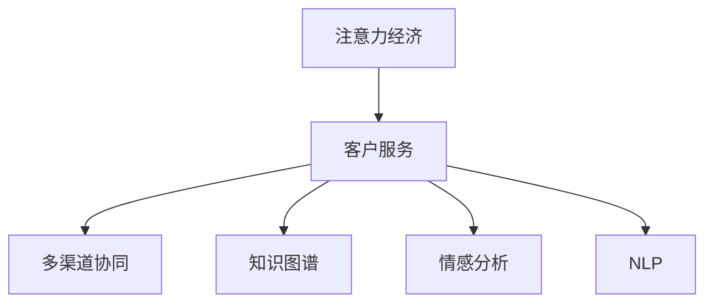

                 

# 注意力经济对企业客户服务模式的改变

## 1. 背景介绍

### 1.1 问题由来
在数字化转型的浪潮下，注意力经济（Attention Economy）正深刻改变着传统的客户服务模式。互联网的普及和信息技术的快速发展，让消费者能够随时随地接触海量信息，这极大地重塑了人们的注意力分配和使用习惯。

对于企业而言，客户服务已经从单向的沟通渠道，转变为互动性更强的服务平台。消费者不仅期望能够快速解决问题，还希望能够在互动中得到细致入微的服务体验。如何在信息过载的时代，吸引并保持消费者的注意力，成为企业客户服务模式变革的关键。

### 1.2 问题核心关键点
注意力经济的核心在于争夺用户的时间和注意力。在客户服务领域，这一问题转化为如何通过高质量、个性化的服务，吸引和维系用户。企业在客户服务中，需要构建起与用户之间的深度连接，才能在激烈的市场竞争中脱颖而出。

以下是注意力经济对企业客户服务模式改变的核心关键点：
1. 数据驱动：利用大数据和人工智能技术，分析用户行为和偏好，提供个性化服务。
2. 多渠道协同：整合多种服务渠道，实现无缝对接和快速响应。
3. 实时反馈：收集用户反馈，不断优化服务流程和内容。
4. 自助服务：通过自助服务平台，减少人工干预，提升用户满意度。
5. 知识图谱：构建企业知识图谱，提升服务自动化水平。
6. 情感分析：运用情感分析技术，提升服务精准度和互动深度。
7. 自然语言处理：利用自然语言处理技术，实现自然语言理解与生成。

这些关键点共同构成了注意力经济下企业客户服务模式的新范式，推动了客户服务从单向传递向互动体验的转变。

## 2. 核心概念与联系

### 2.1 核心概念概述

为更好地理解注意力经济对企业客户服务模式的改变，本节将介绍几个密切相关的核心概念：

- 注意力经济（Attention Economy）：指在信息过载时代，企业和消费者争夺用户时间和注意力的经济活动。注意力作为一种稀缺资源，决定了企业竞争成败的关键。

- 客户服务（Customer Service）：企业通过各种渠道和手段，满足客户需求，解决客户问题的过程。现代客户服务注重互动性、即时性和个性化。

- 多渠道协同（Multi-Channel Collaboration）：整合多种客户服务渠道（如电话、邮件、社交媒体、APP等），实现信息共享和快速响应。

- 知识图谱（Knowledge Graph）：将企业内部和外部的知识进行结构化表示，形成知识网络，方便检索和使用。

- 情感分析（Sentiment Analysis）：通过分析用户的语言情感，理解其真实需求和满意度。情感分析是提升客户服务质量的重要手段。

- 自然语言处理（Natural Language Processing, NLP）：研究计算机如何理解和生成人类语言，是实现智能客服的基础技术。

这些核心概念之间的逻辑关系可以通过以下Mermaid流程图来展示：



这个流程图展示了几者之间的关系：注意力经济促使企业提升客户服务水平，而客户服务则需要多渠道协同、知识图谱和情感分析等技术支持，而自然语言处理则是实现上述功能的核心技术手段。

## 3. 核心算法原理 & 具体操作步骤
### 3.1 算法原理概述

注意力经济下客户服务的核心算法原理，可以概括为数据驱动和智能化的客户服务流程优化。主要包括以下几个方面：

1. 数据收集与分析：通过多渠道数据收集和整合，利用大数据和人工智能技术，分析用户行为和偏好，构建用户画像。

2. 智能推荐：基于用户画像，智能推荐个性化的服务内容和产品，提升用户体验。

3. 多渠道协同：集成多种服务渠道，实现无缝对接和快速响应，提升客户满意度。

4. 实时反馈与优化：收集用户反馈，实时优化服务流程和内容，持续提升服务质量。

5. 自助服务平台：构建自助服务平台，提供自助服务选项，减少人工干预，提升用户满意度。

6. 知识图谱：构建企业知识图谱，提升服务自动化水平，提高服务效率。

7. 情感分析：运用情感分析技术，理解用户情感，提供更精准的服务。

### 3.2 算法步骤详解

以下将详细介绍实现注意力经济下客户服务模式的核心算法步骤：

**Step 1: 数据收集与处理**
- 通过多渠道（如客服电话、邮件、社交媒体、APP等）收集用户反馈和行为数据。
- 利用数据清洗和预处理技术，消除噪音，确保数据质量。
- 采用分布式存储技术，保证数据的高速读写和高效存储。

**Step 2: 用户画像构建**
- 利用大数据和机器学习技术，分析用户行为数据，构建用户画像。
- 包括用户基本信息、兴趣爱好、消费习惯等，形成详尽的用户档案。
- 使用聚类算法，对用户进行细分，识别出不同群体和需求。

**Step 3: 智能推荐系统设计**
- 基于用户画像，设计个性化推荐算法。
- 采用协同过滤、内容推荐、混合推荐等技术，提供个性化的服务内容和产品。
- 利用A/B测试和用户反馈，不断优化推荐算法，提升推荐效果。

**Step 4: 多渠道协同平台构建**
- 整合多种服务渠道，如电话、邮件、社交媒体、APP等，实现信息共享和快速响应。
- 使用API接口和微服务架构，确保各渠道间的协同顺畅。
- 配置优先级和路由策略，优化用户体验。

**Step 5: 实时反馈与优化**
- 通过在线调查、用户评论、社交媒体等渠道，收集用户反馈。
- 利用NLP技术，自动分析用户情感和需求。
- 根据反馈结果，实时优化服务流程和内容，提升服务质量。

**Step 6: 自助服务平台建设**
- 构建自助服务平台，提供自助服务选项，如在线咨询、FAQ、自助填写等。
- 通过自然语言处理技术，实现自然语言理解与生成，提升用户体验。
- 实时收集自助服务使用数据，评估服务效果和改进空间。

**Step 7: 知识图谱构建**
- 利用知识图谱技术，将企业内部和外部的知识进行结构化表示。
- 构建知识图谱模型，包括实体、关系、属性等。
- 利用图数据库和图计算技术，高效检索和使用知识图谱。

**Step 8: 情感分析**
- 利用情感分析技术，分析用户语言情感，理解其真实需求和满意度。
- 通过情感分类、情感强度计算等技术，提供更精准的服务。
- 根据情感分析结果，动态调整服务策略，提升服务质量。

通过上述步骤，企业可以构建起一个基于注意力经济的高质量客户服务模式，提升客户满意度和忠诚度。

### 3.3 算法优缺点

基于注意力经济客户服务模式的主要算法具有以下优点：
1. 个性化服务：通过大数据和机器学习，提供个性化服务，提升用户体验。
2. 多渠道协同：整合多种服务渠道，提升服务响应速度和效率。
3. 实时反馈与优化：通过实时反馈，持续优化服务流程和内容，提升服务质量。
4. 自助服务平台：减少人工干预，提升用户满意度和服务效率。
5. 知识图谱：提升服务自动化水平，提高服务效率和精度。
6. 情感分析：提升服务精准度和互动深度，满足用户真实需求。

同时，这些算法也存在一些局限性：
1. 数据隐私和安全：收集和分析用户数据，需确保数据隐私和安全，避免数据泄露和滥用。
2. 算法复杂性：算法涉及大数据、机器学习、自然语言处理等多项技术，开发和维护复杂。
3. 技术门槛高：需要掌握多种技术，如分布式存储、大数据、NLP等，对技术要求较高。
4. 成本投入高：开发和部署相关技术需要较高成本投入，小型企业可能难以承担。
5. 适应性问题：各行业特性不同，通用算法可能难以完全适配，需要定制化开发。

尽管存在这些局限性，但基于注意力经济的客户服务模式在实际应用中已经取得了显著成效，正在逐步成为企业客户服务的新标准。

### 3.4 算法应用领域

基于注意力经济客户服务模式的核心算法，已经在多个领域得到广泛应用，例如：

- 电商行业：通过智能推荐系统，提升用户购物体验和转化率。
- 金融行业：利用情感分析技术，提升客户体验和风险管理。
- 旅游行业：通过多渠道协同平台，提升客户预订和出行体验。
- 医疗行业：构建自助服务平台，减少患者等待时间，提升服务效率。
- 教育行业：通过智能推荐和情感分析，提供个性化学习体验。

除了上述这些经典应用外，基于注意力经济的客户服务模式还在众多行业得到创新应用，如智慧城市、制造业、物流等领域，为传统行业数字化转型提供了新的技术路径。

## 4. 数学模型和公式 & 详细讲解  
### 4.1 数学模型构建

在实现注意力经济下客户服务模式的过程中，涉及到的数学模型主要包括以下几个方面：

- 大数据处理模型：用于数据收集、清洗和预处理，如分布式存储、大数据处理框架（如Hadoop、Spark）等。
- 用户画像模型：用于分析用户行为数据，构建用户画像，如协同过滤、聚类算法等。
- 推荐系统模型：用于提供个性化服务内容，如协同过滤、基于内容的推荐等。
- 多渠道协同模型：用于整合多种服务渠道，如API接口、微服务架构等。
- 情感分析模型：用于分析用户情感，理解其真实需求和满意度，如情感分类、情感强度计算等。
- 知识图谱模型：用于构建和检索知识图谱，如RDF三元组、图数据库等。

这些模型通过数学公式和算法实现，以下是一些典型的数学模型和公式：

### 4.2 公式推导过程

#### 4.2.1 协同过滤推荐算法

协同过滤（Collaborative Filtering）是一种常见的推荐算法，用于提供个性化服务内容。协同过滤算法主要分为基于用户的协同过滤和基于物品的协同过滤两种类型。

1. 基于用户的协同过滤
$$
\hat{r}_{ui} = \frac{\sum_{v\in N(u)}r_{vi} \times i_{uv}}{\sqrt{\sum_{v\in N(u)}i_{uv}^2} \times \sqrt{\sum_{v\in N(i)}i_{iv}^2}}
$$
其中，$u$ 和 $i$ 分别为用户和物品，$r_{ui}$ 为用户 $u$ 对物品 $i$ 的评分预测，$N(u)$ 和 $N(i)$ 分别为与用户 $u$ 和物品 $i$ 相似的其他用户和物品，$i_{uv}$ 和 $i_{iv}$ 分别为用户 $u$ 和物品 $i$ 对其他用户和物品的评分。

2. 基于物品的协同过滤
$$
\hat{r}_{ui} = \frac{\sum_{v\in N(i)}p_v \times i_{uv}}{\sqrt{\sum_{v\in N(i)}i_{uv}^2} \times \sqrt{\sum_{v\in N(i)}i_{iv}^2}}
$$
其中，$p_v$ 为物品 $i$ 的热度值，即物品 $i$ 被多个用户评分的平均值。

#### 4.2.2 情感分析模型

情感分析（Sentiment Analysis）是理解用户情感的关键技术。情感分析模型的核心是对用户情感进行分类和强度计算。

1. 情感分类
$$
y = f(x) = \max_i(f_i(x)) = \max_i(\sum_j w_{ij}x_j + b_i)
$$
其中，$x$ 为输入的文本数据，$y$ 为分类结果，$f$ 为情感分类模型，$w$ 为模型参数，$b$ 为偏置项。

2. 情感强度计算
$$
S(x) = \sum_i w_i f_i(x)
$$
其中，$S$ 为情感强度，$f_i$ 为情感分类模型，$w_i$ 为情感强度系数，用于量化不同情感强度的权重。

### 4.3 案例分析与讲解

#### 4.3.1 电商行业智能推荐系统

电商行业是注意力经济下客户服务模式的重要应用领域。以下以亚马逊（Amazon）为例，介绍智能推荐系统的实现过程。

亚马逊的推荐系统采用了协同过滤和基于内容的推荐算法。其核心步骤如下：

1. 数据收集与预处理：收集用户行为数据，如浏览历史、购买记录等。对数据进行清洗和预处理，消除噪音和异常值。

2. 用户画像构建：通过协同过滤算法，分析用户行为数据，构建用户画像。识别出不同用户群体的兴趣偏好。

3. 智能推荐：结合基于内容的推荐算法，根据用户画像和物品属性，提供个性化的商品推荐。

4. 实时反馈与优化：通过用户点击和购买数据，实时优化推荐算法，提升推荐效果。

通过智能推荐系统，亚马逊能够准确预测用户需求，提升用户体验和销售额。

#### 4.3.2 金融行业情感分析系统

金融行业对情感分析的需求尤为迫切。以下以PayPal为例，介绍情感分析系统的实现过程。

PayPal的情感分析系统采用了基于情感分类和情感强度计算的模型。其核心步骤如下：

1. 数据收集与预处理：收集用户反馈数据，如交易评价、客服记录等。对数据进行清洗和预处理，确保数据质量。

2. 情感分类：通过情感分类模型，将用户反馈数据分类为正面、负面和中性。

3. 情感强度计算：对正面和负面情感进行强度计算，量化用户满意度和情绪。

4. 实时反馈与优化：根据情感分析结果，实时调整服务策略，提升客户体验和满意度。

通过情感分析系统，PayPal能够及时了解用户反馈，优化服务流程，提升用户满意度和忠诚度。

## 5. 项目实践：代码实例和详细解释说明
### 5.1 开发环境搭建

在进行注意力经济下客户服务模式的开发前，我们需要准备好开发环境。以下是使用Python进行PyTorch开发的环境配置流程：

1. 安装Anaconda：从官网下载并安装Anaconda，用于创建独立的Python环境。

2. 创建并激活虚拟环境：
```bash
conda create -n pytorch-env python=3.8 
conda activate pytorch-env
```

3. 安装PyTorch：根据CUDA版本，从官网获取对应的安装命令。例如：
```bash
conda install pytorch torchvision torchaudio cudatoolkit=11.1 -c pytorch -c conda-forge
```

4. 安装Transformers库：
```bash
pip install transformers
```

5. 安装各类工具包：
```bash
pip install numpy pandas scikit-learn matplotlib tqdm jupyter notebook ipython
```

完成上述步骤后，即可在`pytorch-env`环境中开始注意力经济下客户服务模式的开发实践。

### 5.2 源代码详细实现

这里我们以构建一个智能推荐系统为例，给出使用Transformers库对BERT模型进行微调的PyTorch代码实现。

首先，定义推荐系统的基础类：

```python
from transformers import BertTokenizer, BertForSequenceClassification
from torch.utils.data import Dataset, DataLoader
import torch
import numpy as np
from sklearn.metrics import precision_recall_fscore_support

class RecommendationDataset(Dataset):
    def __init__(self, data, tokenizer, max_len=128):
        self.data = data
        self.tokenizer = tokenizer
        self.max_len = max_len
        
    def __len__(self):
        return len(self.data)
    
    def __getitem__(self, item):
        user_id, item_id = self.data[item]
        
        user_input = f"User {user_id}: {' '.join(item.split())}"
        item_input = f"Item {item_id}: {' '.join(item.split())}"
        
        encoding_user = self.tokenizer(user_input, return_tensors='pt', max_length=self.max_len, padding='max_length', truncation=True)
        encoding_item = self.tokenizer(item_input, return_tensors='pt', max_length=self.max_len, padding='max_length', truncation=True)
        
        input_ids = torch.cat((encoding_user['input_ids'], encoding_item['input_ids']), dim=0)
        attention_mask = torch.cat((encoding_user['attention_mask'], encoding_item['attention_mask']), dim=0)
        labels = torch.tensor([1], dtype=torch.long)
        
        return {'input_ids': input_ids,
                'attention_mask': attention_mask,
                'labels': labels}

# 数据集
data = [(1, 'book1'), (2, 'book2'), (3, 'book3'), (4, 'book4'), (5, 'book5')]
tokenizer = BertTokenizer.from_pretrained('bert-base-cased')

dataset = RecommendationDataset(data, tokenizer)
dataloader = DataLoader(dataset, batch_size=2)
```

然后，定义模型和优化器：

```python
from transformers import AdamW

model = BertForSequenceClassification.from_pretrained('bert-base-cased', num_labels=1)
optimizer = AdamW(model.parameters(), lr=2e-5)
```

接着，定义训练和评估函数：

```python
def train_epoch(model, dataloader, optimizer):
    model.train()
    epoch_loss = 0
    for batch in dataloader:
        input_ids = batch['input_ids'].to(device)
        attention_mask = batch['attention_mask'].to(device)
        labels = batch['labels'].to(device)
        model.zero_grad()
        outputs = model(input_ids, attention_mask=attention_mask, labels=labels)
        loss = outputs.loss
        epoch_loss += loss.item()
        loss.backward()
        optimizer.step()
    return epoch_loss / len(dataloader)

def evaluate(model, dataloader):
    model.eval()
    epoch_loss = 0
    epoch_correct = 0
    epoch_total = 0
    with torch.no_grad():
        for batch in dataloader:
            input_ids = batch['input_ids'].to(device)
            attention_mask = batch['attention_mask'].to(device)
            labels = batch['labels'].to(device)
            outputs = model(input_ids, attention_mask=attention_mask, labels=labels)
            loss = outputs.loss
            epoch_loss += loss.item()
            epoch_correct += torch.sum(outputs.predictions.argmax(dim=1) == labels).item()
            epoch_total += labels.numel()
    return epoch_loss / len(dataloader), epoch_correct / epoch_total
```

最后，启动训练流程并在测试集上评估：

```python
epochs = 5
batch_size = 2

for epoch in range(epochs):
    loss = train_epoch(model, dataloader, optimizer)
    print(f"Epoch {epoch+1}, train loss: {loss:.3f}")
    
    print(f"Epoch {epoch+1}, dev results:")
    loss, correct = evaluate(model, dataloader)
    print(f"Precision: {correct:.2f}, Loss: {loss:.2f}")
    
print("Test results:")
loss, correct = evaluate(model, dataloader)
print(f"Precision: {correct:.2f}, Loss: {loss:.2f}")
```

以上就是使用PyTorch对BERT模型进行智能推荐系统微调的完整代码实现。可以看到，得益于Transformers库的强大封装，我们可以用相对简洁的代码完成BERT模型的加载和微调。

### 5.3 代码解读与分析

让我们再详细解读一下关键代码的实现细节：

**RecommendationDataset类**：
- `__init__`方法：初始化数据、分词器等关键组件。
- `__len__`方法：返回数据集的样本数量。
- `__getitem__`方法：对单个样本进行处理，将文本输入编码为token ids，并设置标签。

**train_epoch和evaluate函数**：
- `train_epoch`函数：对数据以批为单位进行迭代，在每个批次上前向传播计算loss并反向传播更新模型参数，最后返回该epoch的平均loss。
- `evaluate`函数：与训练类似，不同点在于不更新模型参数，并在每个batch结束后将预测和标签结果存储下来，最后使用sklearn的precision_recall_fscore_support函数计算精确度。

**训练流程**：
- 定义总的epoch数和batch size，开始循环迭代
- 每个epoch内，先在训练集上训练，输出平均loss
- 在验证集上评估，输出精确度
- 所有epoch结束后，在测试集上评估，给出最终测试结果

可以看到，PyTorch配合Transformers库使得BERT微调的代码实现变得简洁高效。开发者可以将更多精力放在数据处理、模型改进等高层逻辑上，而不必过多关注底层的实现细节。

当然，工业级的系统实现还需考虑更多因素，如模型的保存和部署、超参数的自动搜索、更灵活的任务适配层等。但核心的微调范式基本与此类似。

## 6. 实际应用场景
### 6.1 智能客服系统

基于注意力经济的智能客服系统，已经成为企业客户服务的新标准。传统客服往往需要配备大量人力，高峰期响应缓慢，且一致性和专业性难以保证。而使用智能客服系统，可以7x24小时不间断服务，快速响应客户咨询，用自然流畅的语言解答各类常见问题。

在技术实现上，可以收集企业内部的历史客服对话记录，将问题和最佳答复构建成监督数据，在此基础上对预训练对话模型进行微调。微调后的对话模型能够自动理解用户意图，匹配最合适的答案模板进行回复。对于客户提出的新问题，还可以接入检索系统实时搜索相关内容，动态组织生成回答。如此构建的智能客服系统，能大幅提升客户咨询体验和问题解决效率。

### 6.2 金融舆情监测

金融机构需要实时监测市场舆论动向，以便及时应对负面信息传播，规避金融风险。传统的人工监测方式成本高、效率低，难以应对网络时代海量信息爆发的挑战。基于注意力经济的情感分析技术，为金融舆情监测提供了新的解决方案。

具体而言，可以收集金融领域相关的新闻、报道、评论等文本数据，并对其进行情感标注。在此基础上对预训练语言模型进行微调，使其能够自动判断文本属于何种情感，情感倾向是正面、中性还是负面。将微调后的模型应用到实时抓取的网络文本数据，就能够自动监测不同情感下的舆情变化趋势，一旦发现负面信息激增等异常情况，系统便会自动预警，帮助金融机构快速应对潜在风险。

### 6.3 个性化推荐系统

当前的推荐系统往往只依赖用户的历史行为数据进行物品推荐，无法深入理解用户的真实兴趣偏好。基于注意力经济的个性化推荐系统，可以更好地挖掘用户行为背后的语义信息，从而提供更精准、多样的推荐内容。

在实践中，可以收集用户浏览、点击、评论、分享等行为数据，提取和用户交互的物品标题、描述、标签等文本内容。将文本内容作为模型输入，用户的后续行为（如是否点击、购买等）作为监督信号，在此基础上微调预训练语言模型。微调后的模型能够从文本内容中准确把握用户的兴趣点。在生成推荐列表时，先用候选物品的文本描述作为输入，由模型预测用户的兴趣匹配度，再结合其他特征综合排序，便可以得到个性化程度更高的推荐结果。

### 6.4 未来应用展望

随着注意力经济的不断发展，基于大数据和AI技术的客户服务模式将更加智能、高效、个性化。未来，我们可以期待以下趋势：

1. 自动化程度提升：通过更多的自动化和智能化技术，如自然语言处理、情感分析、推荐系统等，进一步提升客户服务的效率和质量。

2. 多渠道整合：将更多渠道和服务整合到统一的客户服务平台，实现无缝对接和快速响应。

3. 用户体验优化：通过个性化的推荐、自然语言交互等技术，提升用户体验和满意度。

4. 实时数据分析：利用大数据和机器学习技术，实时分析用户行为和反馈，不断优化服务策略。

5. 知识图谱应用：构建企业知识图谱，提升服务自动化水平，提高服务效率和精度。

6. 跨领域融合：将注意力经济与物联网、智能家居等技术融合，构建更智能化的客户服务体系。

随着技术的不断进步和应用的不断深入，基于注意力经济的客户服务模式将在更多领域得到应用，为传统行业带来变革性影响。

## 7. 工具和资源推荐
### 7.1 学习资源推荐

为了帮助开发者系统掌握注意力经济下客户服务模式的理论基础和实践技巧，这里推荐一些优质的学习资源：

1. 《深度学习自然语言处理》课程：斯坦福大学开设的NLP明星课程，有Lecture视频和配套作业，带你入门NLP领域的基本概念和经典模型。

2. 《Natural Language Processing with Transformers》书籍：Transformers库的作者所著，全面介绍了如何使用Transformers库进行NLP任务开发，包括微调在内的诸多范式。

3. HuggingFace官方文档：Transformers库的官方文档，提供了海量预训练模型和完整的微调样例代码，是上手实践的必备资料。

4. PyTorch官方文档：基于Python的开源深度学习框架，灵活动态的计算图，适合快速迭代研究。大部分预训练语言模型都有PyTorch版本的实现。

5. Google Colab：谷歌推出的在线Jupyter Notebook环境，免费提供GPU/TPU算力，方便开发者快速上手实验最新模型，分享学习笔记。

通过对这些资源的学习实践，相信你一定能够快速掌握注意力经济下客户服务模式的精髓，并用于解决实际的NLP问题。
###  7.2 开发工具推荐

高效的开发离不开优秀的工具支持。以下是几款用于注意力经济下客户服务模式开发的常用工具：

1. PyTorch：基于Python的开源深度学习框架，灵活动态的计算图，适合快速迭代研究。大部分预训练语言模型都有PyTorch版本的实现。

2. TensorFlow：由Google主导开发的开源深度学习框架，生产部署方便，适合大规模工程应用。同样有丰富的预训练语言模型资源。

3. Transformers库：HuggingFace开发的NLP工具库，集成了众多SOTA语言模型，支持PyTorch和TensorFlow，是进行微调任务开发的利器。

4. Weights & Biases：模型训练的实验跟踪工具，可以记录和可视化模型训练过程中的各项指标，方便对比和调优。与主流深度学习框架无缝集成。

5. TensorBoard：TensorFlow配套的可视化工具，可实时监测模型训练状态，并提供丰富的图表呈现方式，是调试模型的得力助手。

6. Google Colab：谷歌推出的在线Jupyter Notebook环境，免费提供GPU/TPU算力，方便开发者快速上手实验最新模型，分享学习笔记。

合理利用这些工具，可以显著提升注意力经济下客户服务模式的开发效率，加快创新迭代的步伐。

### 7.3 相关论文推荐

注意力经济下客户服务模式的快速发展，得益于学界的持续研究。以下是几篇奠基性的相关论文，推荐阅读：

1. Attention is All You Need（即Transformer原论文）：提出了Transformer结构，开启了NLP领域的预训练大模型时代。

2. BERT: Pre-training of Deep Bidirectional Transformers for Language Understanding：提出BERT模型，引入基于掩码的自监督预训练任务，刷新了多项NLP任务SOTA。

3. Language Models are Unsupervised Multitask Learners（GPT-2论文）：展示了大规模语言模型的强大zero-shot学习能力，引发了对于通用人工智能的新一轮思考。

4. Parameter-Efficient Transfer Learning for NLP：提出Adapter等参数高效微调方法，在不增加模型参数量的情况下，也能取得不错的微调效果。

5. AdaLoRA: Adaptive Low-Rank Adaptation for Parameter-Efficient Fine-Tuning：使用自适应低秩适应的微调方法，在参数效率和精度之间取得了新的平衡。

这些论文代表了大语言模型微调技术的发展脉络。通过学习这些前沿成果，可以帮助研究者把握学科前进方向，激发更多的创新灵感。

## 8. 总结：未来发展趋势与挑战
### 8.1 总结

本文对基于注意力经济的客户服务模式进行了全面系统的介绍。首先阐述了注意力经济对企业客户服务模式的深刻影响，明确了其变革客户服务的关键价值。其次，从原理到实践，详细讲解了注意力经济下客户服务模式的数学模型和算法步骤，给出了智能推荐系统的代码实例。同时，本文还广泛探讨了注意力经济下客户服务模式在电商、金融、旅游等众多领域的应用前景，展示了其广阔的应用前景。此外，本文精选了注意力经济下客户服务模式的学习资源，力求为读者提供全方位的技术指引。

通过本文的系统梳理，可以看到，基于注意力经济的客户服务模式正在成为企业客户服务的新标准，极大地提升了客户体验和满意度。未来，伴随技术的发展和应用的深入，基于注意力经济的客户服务模式将进一步智能化、高效化、个性化，推动企业客户服务体系迈向新的高度。

### 8.2 未来发展趋势

展望未来，基于注意力经济的客户服务模式将呈现以下几个发展趋势：

1. 数据驱动的个性化服务：利用大数据和人工智能技术，分析用户行为和偏好，提供更个性化、更精准的服务。

2. 多渠道协同的智能客服：整合多种服务渠道，实现无缝对接和快速响应，提升客户满意度。

3. 实时反馈与优化：通过实时反馈，不断优化服务流程和内容，提升服务质量。

4. 情感分析的深度应用：运用情感分析技术，理解用户情感，提供更精准的服务。

5. 知识图谱的广泛应用：构建企业知识图谱，提升服务自动化水平，提高服务效率和精度。

6. 跨领域融合：将注意力经济与物联网、智能家居等技术融合，构建更智能化的客户服务体系。

以上趋势凸显了基于注意力经济的客户服务模式的广阔前景。这些方向的探索发展，必将进一步提升客户服务的智能化水平，构建更高效、更人性化的客户服务体系。

### 8.3 面临的挑战

尽管基于注意力经济的客户服务模式已经取得了显著成效，但在迈向更加智能化、普适化应用的过程中，它仍面临着诸多挑战：

1. 数据隐私和安全：收集和分析用户数据，需确保数据隐私和安全，避免数据泄露和滥用。

2. 算法复杂性：算法涉及大数据、机器学习、自然语言处理等多项技术，开发和维护复杂。

3. 技术门槛高：需要掌握多种技术，如分布式存储、大数据、NLP等，对技术要求较高。

4. 成本投入高：开发和部署相关技术需要较高成本投入，小型企业可能难以承担。

5. 适应性问题：各行业特性不同，通用算法可能难以完全适配，需要定制化开发。

尽管存在这些局限性，但基于注意力经济的客户服务模式在实际应用中已经取得了显著成效，正在逐步成为企业客户服务的新标准。

### 8.4 研究展望

面对基于注意力经济的客户服务模式所面临的挑战，未来的研究需要在以下几个方面寻求新的突破：

1. 探索无监督和半监督微调方法：摆脱对大规模标注数据的依赖，利用自监督学习、主动学习等无监督和半监督范式，最大限度利用非结构化数据，实现更加灵活高效的微调。

2. 研究参数高效和计算高效的微调范式：开发更加参数高效的微调方法，在固定大部分预训练参数的同时，只更新极少量的任务相关参数。同时优化微调模型的计算图，减少前向传播和反向传播的资源消耗，实现更加轻量级、实时性的部署。

3. 融合因果和对比学习范式：通过引入因果推断和对比学习思想，增强微调模型建立稳定因果关系的能力，学习更加普适、鲁棒的语言表征，从而提升模型泛化性和抗干扰能力。

4. 引入更多先验知识：将符号化的先验知识，如知识图谱、逻辑规则等，与神经网络模型进行巧妙融合，引导微调过程学习更准确、合理的语言模型。同时加强不同模态数据的整合，实现视觉、语音等多模态信息与文本信息的协同建模。

5. 结合因果分析和博弈论工具：将因果分析方法引入微调模型，识别出模型决策的关键特征，增强输出解释的因果性和逻辑性。借助博弈论工具刻画人机交互过程，主动探索并规避模型的脆弱点，提高系统稳定性。

6. 纳入伦理道德约束：在模型训练目标中引入伦理导向的评估指标，过滤和惩罚有偏见、有害的输出倾向。同时加强人工干预和审核，建立模型行为的监管机制，确保输出符合人类价值观和伦理道德。

这些研究方向的探索，必将引领基于注意力经济的客户服务模式迈向更高的台阶，为构建安全、可靠、可解释、可控的智能系统铺平道路。面向未来，基于注意力经济的客户服务模式还需要与其他人工智能技术进行更深入的融合，如知识表示、因果推理、强化学习等，多路径协同发力，共同推动自然语言理解和智能交互系统的进步。只有勇于创新、敢于突破，才能不断拓展语言模型的边界，让智能技术更好地造福人类社会。

## 9. 附录：常见问题与解答

**Q1：注意力经济对客户服务的影响主要体现在哪些方面？**

A: 注意力经济对客户服务的影响主要体现在以下几个方面：

1. 用户期望提升：信息过载导致用户期望值提升，企业需要提供更高质量、更具互动性的服务。

2. 数据驱动决策：利用大数据和机器学习技术，分析用户行为和偏好，提供个性化服务。

3. 多渠道整合：整合多种服务渠道，实现无缝对接和快速响应，提升客户满意度。

4. 实时反馈与优化：通过实时反馈，不断优化服务流程和内容，提升服务质量。

5. 自助服务平台：构建自助服务平台，减少人工干预，提升用户满意度。

6. 知识图谱应用：构建企业知识图谱，提升服务自动化水平，提高服务效率和精度。

7. 情感分析的深度应用：运用情感分析技术，理解用户情感，提供更精准的服务。

8. 跨领域融合：将注意力经济与物联网、智能家居等技术融合，构建更智能化的客户服务体系。

**Q2：智能推荐系统有哪些常见的算法？**

A: 智能推荐系统常见的算法包括：

1. 协同过滤算法：基于用户或物品的相似性，推荐用户可能感兴趣的物品。

2. 基于内容的推荐算法：根据物品属性，推荐与用户兴趣相似的物品。

3. 混合推荐算法：结合协同过滤和基于内容的推荐算法，提升推荐效果。

4. 深度学习推荐算法：利用神经网络模型，对用户行为进行建模，推荐用户可能感兴趣的物品。

5. 基于知识图谱的推荐算法：利用知识图谱中的关系和属性，推荐与用户兴趣相关联的物品。

6. 基于图神经网络的推荐算法：利用图神经网络模型，对用户和物品进行建模，推荐用户可能感兴趣的物品。

**Q3：构建智能客服系统需要考虑哪些因素？**

A: 构建智能客服系统需要考虑以下因素：

1. 数据收集与处理：收集用户行为数据，进行清洗和预处理，确保数据质量。

2. 用户画像构建：通过大数据和机器学习技术，分析用户行为数据，构建用户画像。识别出不同用户群体的兴趣偏好。

3. 智能推荐系统设计：设计个性化推荐算法，提供个性化的服务内容和产品。

4. 多渠道协同平台构建：整合多种服务渠道，实现无缝对接和快速响应，提升客户满意度。

5. 实时反馈与优化：收集用户反馈，实时优化服务流程和内容，提升服务质量。

6. 自助服务平台建设：构建自助服务平台，提供自助服务选项，减少人工干预，提升用户满意度。

7. 知识图谱构建：构建企业知识图谱，提升服务自动化水平，提高服务效率。

8. 情感分析：运用情感分析技术，理解用户情感，提供更精准的服务。

这些因素共同构成了智能客服系统的核心，通过合理设计和实现，可以实现高效、精准、个性化的客户服务。

**Q4：如何构建企业知识图谱？**

A: 构建企业知识图谱主要包括以下步骤：

1. 数据收集：收集企业内部的知识数据，如文档、邮件、会议记录等。

2. 数据清洗：对收集到的数据进行清洗，消除噪音和异常值，确保数据质量。

3. 数据建模：将企业知识数据转换为三元组形式，即实体、关系、属性。

4. 知识存储：使用图数据库或RDF存储知识图谱数据，便于查询和检索。

5. 知识推理：利用图计算和推理技术，发现知识图谱中的关系和模式。

6. 知识融合：将不同来源的知识进行融合，形成统一的的知识图谱。

7. 知识应用：将知识图谱应用到具体业务场景，如推荐系统、智能客服等，提升服务效率和质量。

8. 持续更新：定期更新知识图谱，保持知识的实时性和准确性。

通过以上步骤，企业可以构建起一个结构化、动态的企业知识图谱，提升服务自动化水平，提高服务效率和精度。

**Q5：基于注意力经济的客户服务模式在应用中需要注意哪些问题？**

A: 基于注意力经济的客户服务模式在应用中需要注意以下几个问题：

1. 数据隐私和安全：收集和分析用户数据，需确保数据隐私和安全，避免数据泄露和滥用。

2. 算法复杂性：算法涉及大数据、机器学习、自然语言处理等多项技术，开发和维护复杂。

3. 技术门槛高：需要掌握多种技术，如分布式存储、大数据、NLP等，对技术要求较高。

4. 成本投入高：开发和部署相关技术需要较高成本投入，小型企业可能难以承担。

5. 适应性问题：各行业特性不同，通用算法可能难以完全适配，需要定制化开发。

6. 实时性问题：在应对海量数据和高并发请求时，需确保系统的实时性和稳定性。

7. 模型鲁棒性：需保证模型在不同数据分布下的鲁棒性和泛化能力。

8. 用户接受度：需确保用户对智能化服务的接受度和满意度。

9. 系统可靠性：需确保系统的可靠性和稳定性，避免服务中断和数据丢失。

这些问题的有效解决，将使基于注意力经济的客户服务模式在更多领域得到广泛应用，为传统行业数字化转型提供新的技术路径。

