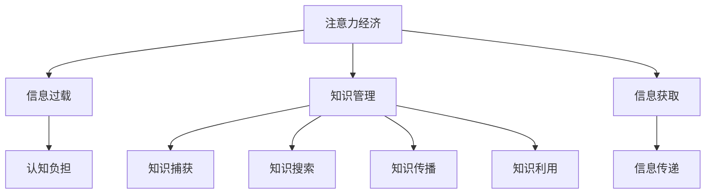

                 

## 1. 背景介绍

### 1.1 问题由来
随着互联网和移动互联网的迅猛发展，信息量呈指数级增长。企业面临海量的数据和信息，如何有效管理和利用这些数据，成为企业知识管理的核心挑战。与此同时，注意力作为有限的心理资源，成为企业获取信息、提升知识管理的瓶颈。

### 1.2 问题核心关键点
注意力经济（Economy of Attention）是指在信息过载时代，企业获取和利用信息的成本不再仅仅取决于数据本身的价值，更取决于受众的注意力成本。企业通过吸引和引导用户的注意力，实现信息的高效传递和知识管理目标。

### 1.3 问题研究意义
在信息爆炸的时代，如何有效管理企业知识，提升信息获取和利用的效率，是一个迫在眉睫的问题。注意力经济的概念为知识管理提供了一种全新的视角和方法，有助于企业在海量数据中发现有价值的信息，实现知识的精准匹配和高效利用。

## 2. 核心概念与联系

### 2.1 核心概念概述

为更好地理解注意力经济对企业知识管理的影响，本节将介绍几个密切相关的核心概念：

- 注意力经济（Economy of Attention）：指在信息过载时代，企业获取和利用信息的成本不再仅仅取决于数据本身的价值，更取决于受众的注意力成本。企业通过吸引和引导用户的注意力，实现信息的高效传递和知识管理目标。

- 知识管理（Knowledge Management, KM）：通过计划、组织、捕获、搜索、传播和利用知识资源，提高企业竞争力。知识管理的目标是最大化知识的价值，支持企业的战略目标。

- 信息过载（Information Overload）：指个体或组织面临的信息量远远超过其处理能力，导致信息获取和决策困难的现象。

- 认知负担（Cognitive Load）：指个体在信息处理过程中，需要投入的心理资源，包括注意力、记忆力和计算力等。

这些核心概念之间的逻辑关系可以通过以下Mermaid流程图来展示：



这个流程图展示了几大核心概念及其之间的关系：

1. 注意力经济是信息过载时代企业获取信息的新范式，以吸引和引导用户注意力为核心。
2. 知识管理通过计划、组织、捕获、搜索、传播和利用知识资源，支持企业的战略目标。
3. 信息过载和认知负担是注意力经济面临的主要挑战，需要通过有效策略来缓解。
4. 信息获取、传递、捕获、搜索、传播和利用是知识管理的关键环节。

这些概念共同构成了注意力经济对企业知识管理的理解和实践框架，有助于企业在大数据时代实现知识的高效管理。

## 3. 核心算法原理 & 具体操作步骤
### 3.1 算法原理概述

注意力经济的核心在于通过吸引和引导用户的注意力，实现信息的高效传递和知识管理。在具体实践中，企业通常采用以下几种策略：

1. **信息筛选与过滤**：通过算法推荐、人工智能筛选等方式，将海量的信息过滤和聚焦到用户最感兴趣的部分，减轻信息过载和认知负担。

2. **内容个性化**：根据用户的兴趣、行为、偏好等，定制个性化的信息内容，提升用户的参与度和满意度。

3. **互动式内容**：通过社交媒体、在线讨论等方式，促进用户之间的互动，增加信息的曝光度和传播效果。

4. **数据驱动决策**：利用大数据分析工具，对用户行为和偏好进行深入分析，指导企业的知识管理策略。

5. **多媒体融合**：结合文字、图片、视频等多种媒体形式，丰富信息的展示和传播方式，提高用户的注意力和参与度。

### 3.2 算法步骤详解

以下是基于注意力经济的常见信息筛选与过滤算法步骤：

**Step 1: 数据收集与处理**
- 收集企业内部和外部的各种数据源，如网站访问日志、社交媒体数据、用户反馈等。
- 对数据进行预处理，清洗、去重、标准化等。

**Step 2: 用户画像构建**
- 基于用户历史行为、兴趣、社交网络等信息，构建用户画像，描述用户的兴趣偏好。

**Step 3: 信息相关性计算**
- 使用机器学习算法（如TF-IDF、余弦相似度等）计算信息与用户画像之间的相关性。

**Step 4: 信息过滤与推荐**
- 根据计算出的相关性，过滤和推荐最相关的信息给用户。

**Step 5: 效果评估与优化**
- 定期评估信息筛选与过滤的效果，使用户满意度作为重要指标。
- 根据效果评估结果，不断优化算法模型和推荐策略。

### 3.3 算法优缺点

基于注意力经济的策略具有以下优点：

1. **提升信息获取效率**：通过算法筛选和个性化推荐，有效过滤无用信息，提升用户的信息获取效率。

2. **降低认知负担**：通过信息筛选和内容定制，减轻用户的信息处理负担，提升用户满意度。

3. **促进知识传播**：通过互动式内容和多媒体融合，增强信息的传播效果，促进知识的共享和利用。

4. **数据驱动决策**：通过大数据分析，为企业提供数据支持的决策支持，提升决策的准确性和科学性。

但这些策略也存在一定的局限性：

1. **依赖数据质量**：信息筛选和过滤的效果高度依赖于数据的质量和完整性，数据不充分或不准确可能导致过滤效果不佳。

2. **个性化推荐难度**：个性化推荐需要处理大量用户数据，模型复杂度高，计算成本高。

3. **信息过载风险**：虽然过滤效果提升，但仍然存在信息过载的风险，用户在接受过多个性化信息后，可能产生信息疲劳。

4. **隐私和伦理问题**：在数据处理和分析过程中，需要严格遵守隐私保护和伦理规范，避免用户隐私泄露。

### 3.4 算法应用领域

基于注意力经济的策略广泛应用于各个领域，具体应用如下：

- **电子商务**：推荐系统通过分析用户行为和偏好，推荐个性化商品，提升用户购买转化率。
- **社交媒体**：内容推荐系统通过分析用户互动和兴趣，推荐相关内容，增加用户黏性。
- **在线教育**：推荐系统根据用户学习行为和成绩，推荐个性化的学习内容和资源，提升学习效果。
- **新闻媒体**：新闻推荐系统根据用户兴趣和阅读历史，推荐相关新闻，提升用户阅读体验。
- **金融服务**：投资推荐系统根据用户风险偏好和历史交易记录，推荐投资产品，降低投资风险。

除了上述这些常见应用外，基于注意力经济的策略还将在更多领域得到应用，如医疗健康、智能交通等，为不同行业带来新的变化。

## 4. 数学模型和公式 & 详细讲解
### 4.1 数学模型构建

基于注意力经济的策略通常使用推荐系统进行实现。推荐系统通过用户历史行为、兴趣偏好等信息，计算物品与用户之间的相关性，推荐最相关的物品给用户。

记用户 $u$ 的历史行为数据为 $I_u$，物品的特征为 $x_i$，用户 $u$ 对物品 $i$ 的兴趣度为 $p_{ui}$。推荐系统的目标是最小化用户 $u$ 的负对数似然损失函数，即：

$$
\min_{\theta} \sum_{u \in U} \sum_{i \in I} \log \frac{p_{ui}}{1-p_{ui}}
$$

其中，$U$ 为用户集合，$I$ 为物品集合，$p_{ui}$ 为物品 $i$ 对用户 $u$ 的兴趣度，$\theta$ 为模型参数。

### 4.2 公式推导过程

以下我们以协同过滤算法为例，推导用户对物品的兴趣度计算公式。

协同过滤算法分为基于用户的协同过滤和基于物品的协同过滤。这里我们以基于用户的协同过滤为例。

设用户 $u$ 对物品 $i$ 的兴趣度为 $p_{ui}$，基于用户的协同过滤公式为：

$$
p_{ui} = \frac{\sum_{j \in N_u} \alpha_i^j \cdot p_{uj}}{\sum_{j \in N_u} \alpha_j^i}
$$

其中，$N_u$ 为与用户 $u$ 相似的用户集合，$\alpha_i^j$ 和 $\alpha_j^i$ 为相似度权重。

将上式转化为矩阵形式：

$$
\vec{p} = \vec{W} \cdot \vec{\alpha} \cdot \vec{p}
$$

其中 $\vec{p}$ 为兴趣度向量，$\vec{\alpha}$ 为相似度权重矩阵，$\vec{W}$ 为权重矩阵。

通过矩阵乘法和向量运算，可以高效计算用户对物品的兴趣度。

### 4.3 案例分析与讲解

以Netflix推荐系统为例，Netflix通过协同过滤算法推荐用户可能感兴趣的电影。Netflix收集了用户的浏览历史、评分和观看记录等数据，构建用户画像和物品画像。基于协同过滤算法计算用户对不同电影的兴趣度，并根据兴趣度进行排序，推荐最可能吸引用户注意的电影。

Netflix通过优化协同过滤算法和引入其他推荐策略（如基于内容的推荐、时间序列分析等），显著提升了用户满意度，大幅提高了用户留存率和销售额。

## 5. 项目实践：代码实例和详细解释说明
### 5.1 开发环境搭建

在进行推荐系统实践前，我们需要准备好开发环境。以下是使用Python进行Scikit-learn开发的环境配置流程：

1. 安装Anaconda：从官网下载并安装Anaconda，用于创建独立的Python环境。

2. 创建并激活虚拟环境：
```bash
conda create -n recommender-env python=3.8 
conda activate recommender-env
```

3. 安装Scikit-learn：
```bash
pip install scikit-learn
```

4. 安装NumPy、Pandas、Matplotlib等常用工具包：
```bash
pip install numpy pandas matplotlib tqdm jupyter notebook ipython
```

完成上述步骤后，即可在`recommender-env`环境中开始推荐系统开发。

### 5.2 源代码详细实现

这里我们以协同过滤算法为例，实现基于用户兴趣的推荐系统。

首先，定义协同过滤算法类：

```python
import numpy as np
from sklearn.metrics.pairwise import cosine_similarity

class CollaborativeFiltering:
    def __init__(self, alpha=0.5):
        self.alpha = alpha
        
    def fit(self, X):
        self.user_matrix = X
        
    def predict(self, user_id, items):
        similarity_matrix = cosine_similarity(self.user_matrix)
        user_similarity = similarity_matrix[user_id]
        predicted_scores = []
        for item_id in items:
            user_scores = user_similarity[item_id] * self.alpha
            predicted_scores.append(user_scores.sum())
        return np.array(predicted_scores)
```

然后，定义数据加载和预处理函数：

```python
def load_data():
    # 读取数据，构建用户-物品评分矩阵
    user_matrix = np.loadtxt('data/user_matrix.txt')
    return user_matrix

def preprocess_data(user_matrix):
    # 对数据进行标准化处理
    user_matrix = (user_matrix - user_matrix.mean(axis=1, keepdims=True)) / user_matrix.std(axis=1, keepdims=True)
    return user_matrix
```

最后，启动推荐系统流程并评估结果：

```python
user_matrix = load_data()
user_matrix = preprocess_data(user_matrix)

# 初始化协同过滤算法
collaborative_filtering = CollaborativeFiltering(alpha=0.5)

# 训练模型
collaborative_filtering.fit(user_matrix)

# 预测推荐
user_id = 0
items = [1, 2, 3]
scores = collaborative_filtering.predict(user_id, items)

print(f"推荐分数：{scores}")
```

以上就是使用Scikit-learn实现协同过滤算法的完整代码实现。可以看到，利用Scikit-learn，推荐系统的开发变得简洁高效。

### 5.3 代码解读与分析

让我们再详细解读一下关键代码的实现细节：

**CollaborativeFiltering类**：
- `__init__`方法：初始化协同过滤算法，设定相似度权重。
- `fit`方法：训练协同过滤算法，计算用户-物品评分矩阵。
- `predict`方法：预测用户对物品的评分。

**load_data和preprocess_data函数**：
- `load_data`函数：从数据文件中读取用户-物品评分矩阵，构建用户-物品评分矩阵。
- `preprocess_data`函数：对评分矩阵进行标准化处理，提升算法的准确性。

**训练和预测流程**：
- 定义协同过滤算法，加载和预处理数据。
- 训练协同过滤算法，构建用户-物品评分矩阵。
- 对指定用户进行物品评分预测，输出推荐分数。

可以看到，Scikit-learn提供了丰富的机器学习算法和工具，可以快速实现推荐系统的开发。开发者可以在此基础上进一步改进算法，增加个性化推荐、基于内容的推荐等策略，提升推荐系统的效果。

当然，工业级的系统实现还需考虑更多因素，如模型的保存和部署、超参数的自动搜索、更灵活的推荐策略等。但核心的协同过滤算法基本与此类似。

## 6. 实际应用场景
### 6.1 智能推荐系统

智能推荐系统通过分析用户历史行为和兴趣偏好，为用户推荐个性化的商品、内容和服务。智能推荐系统广泛应用于电商、视频、新闻、音乐等平台，提升用户体验和转化率。

以亚马逊推荐系统为例，亚马逊通过分析用户浏览历史、购买记录和评分数据，为用户推荐可能感兴趣的商品。智能推荐系统通过协同过滤、基于内容的推荐、时间序列分析等多种策略，大大提升了用户满意度，提高了销售额和用户留存率。

### 6.2 社交媒体内容推荐

社交媒体内容推荐系统通过分析用户互动和兴趣，为用户推荐相关内容，增加用户黏性。Facebook、Twitter等社交媒体平台通过推荐系统，提升用户活跃度和平台粘性。

以Facebook推荐系统为例，Facebook通过分析用户点赞、评论、分享等互动数据，为用户推荐相关内容。推荐系统通过协同过滤和基于内容的推荐策略，提升了用户对平台的依赖性，增加了用户活跃度。

### 6.3 个性化广告投放

个性化广告投放通过分析用户行为和兴趣，投放最相关的广告，提升广告效果和转化率。Google、Facebook等平台通过推荐系统进行广告投放，显著提升了广告投放效果。

以Google推荐系统为例，Google通过分析用户搜索行为和点击数据，为用户推荐相关广告。推荐系统通过协同过滤和基于内容的推荐策略，提升了广告投放效果，降低了广告成本。

### 6.4 未来应用展望

随着推荐系统技术的不断发展，基于注意力经济的策略将在更多领域得到应用，为不同行业带来新的变化。

在智能制造领域，智能推荐系统可以帮助企业预测设备维护需求，提升设备利用率，降低维护成本。

在智慧城市治理中，智能推荐系统可以优化交通路线、提升能源利用效率，构建更智能、更环保的城市。

在医疗健康领域，智能推荐系统可以根据患者病历和诊断数据，推荐最合适的治疗方案，提升诊疗效果。

此外，在教育、金融、电商等众多领域，基于注意力经济的策略也将不断涌现，为各行业带来新的变革。

## 7. 工具和资源推荐
### 7.1 学习资源推荐

为了帮助开发者系统掌握推荐系统理论基础和实践技巧，这里推荐一些优质的学习资源：

1. 《推荐系统实战》系列博文：由大模型技术专家撰写，深入浅出地介绍了推荐系统的原理、算法和实现方法。

2. Coursera《推荐系统》课程：斯坦福大学开设的推荐系统课程，涵盖推荐系统的基本概念和经典算法，适合入门推荐系统开发。

3. 《推荐系统理论与算法》书籍：全面介绍了推荐系统的理论基础和算法实现，是推荐系统开发的必备参考资料。

4. Kaggle推荐系统竞赛：Kaggle提供了多个推荐系统竞赛数据集和基线模型，是学习和验证推荐系统效果的好机会。

5. Weights & Biases：推荐系统训练的实验跟踪工具，可以记录和可视化模型训练过程中的各项指标，方便对比和调优。

通过这些学习资源，相信你一定能够快速掌握推荐系统的精髓，并用于解决实际的推荐问题。

### 7.2 开发工具推荐

高效的开发离不开优秀的工具支持。以下是几款用于推荐系统开发的常用工具：

1. Scikit-learn：基于Python的开源机器学习库，提供丰富的推荐算法和工具。

2. TensorFlow：由Google主导开发的开源深度学习框架，支持分布式训练和模型优化。

3. PyTorch：基于Python的开源深度学习框架，灵活高效的计算图，适合快速迭代研究。

4. Spark MLlib：Apache Spark的机器学习库，支持分布式计算和多种推荐算法。

5. Amazon Personalize：亚马逊提供的推荐系统服务，提供简单易用的API接口。

合理利用这些工具，可以显著提升推荐系统的开发效率，加快创新迭代的步伐。

### 7.3 相关论文推荐

推荐系统的发展源于学界的持续研究。以下是几篇奠基性的相关论文，推荐阅读：

1. "Collaborative Filtering for Implicit Feedback Datasets"：介绍了协同过滤算法的原理和实现方法。

2. "The Bell-Katz Model for Recommender Systems"：提出了基于内容的推荐算法，奠定了推荐系统算法的基础。

3. "Item-Based Collaborative Filtering with Sample-Based Implicit Feedback"：介绍了基于物品的协同过滤算法，扩展了协同过滤的应用场景。

4. "Online Collaborative Filtering"：提出了在线协同过滤算法，适应动态数据流和实时推荐需求。

5. "A Comprehensive Survey of Recommender Systems"：全面回顾了推荐系统的历史和未来发展方向，适合入门和深入学习。

这些论文代表了大模型推荐系统的发展脉络。通过学习这些前沿成果，可以帮助研究者把握学科前进方向，激发更多的创新灵感。

## 8. 总结：未来发展趋势与挑战
### 8.1 总结

本文对基于注意力经济的推荐系统进行了全面系统的介绍。首先阐述了注意力经济和知识管理的关系，明确了注意力经济在信息过载时代企业获取信息的新范式。其次，从原理到实践，详细讲解了推荐系统的数学原理和关键步骤，给出了推荐任务开发的完整代码实例。同时，本文还广泛探讨了推荐系统在电商、社交媒体、广告等领域的应用前景，展示了注意力经济策略的巨大潜力。此外，本文精选了推荐系统的各类学习资源，力求为读者提供全方位的技术指引。

通过本文的系统梳理，可以看到，基于注意力经济的推荐系统正在成为企业知识管理的核心手段，极大地提升了信息获取和利用的效率，促进了知识的精准匹配和高效利用。

### 8.2 未来发展趋势

展望未来，推荐系统技术将呈现以下几个发展趋势：

1. **多模态推荐**：结合文本、图像、语音等多种模态数据，丰富推荐内容，提升推荐效果。

2. **实时推荐**：通过在线协同过滤和深度学习等技术，实现实时推荐，提升用户体验。

3. **跨领域推荐**：通过领域迁移学习，将某领域的推荐策略应用到其他领域，提升推荐系统的泛化能力。

4. **个性化推荐**：通过深度学习、强化学习等技术，实现更加个性化和精准的推荐，提升用户满意度。

5. **隐私保护**：在推荐系统中引入隐私保护技术，如差分隐私、联邦学习等，保护用户隐私，增强用户信任。

6. **冷启动问题**：通过社交网络、协同过滤等技术，解决冷启动问题，提升新用户的推荐效果。

以上趋势凸显了推荐系统技术的广阔前景。这些方向的探索发展，必将进一步提升推荐系统的性能和应用范围，为各行各业带来新的变革。

### 8.3 面临的挑战

尽管推荐系统技术已经取得了瞩目成就，但在迈向更加智能化、普适化应用的过程中，它仍面临着诸多挑战：

1. **数据质量**：推荐系统的效果高度依赖于数据的质量和完整性，数据不充分或不准确可能导致推荐效果不佳。

2. **计算资源**：推荐系统涉及大规模数据的处理和计算，计算资源消耗大，系统扩展难度高。

3. **隐私保护**：在数据处理和分析过程中，需要严格遵守隐私保护和伦理规范，避免用户隐私泄露。

4. **算法复杂性**：推荐系统算法复杂度高，模型调参难度大，需要专业的算法工程师和数据科学家。

5. **冷启动问题**：对于新用户和新商品，推荐系统难以给出高质量推荐，需要结合社交网络和协同过滤等技术解决。

6. **稳定性与可解释性**：推荐系统的稳定性和可解释性是用户信任的重要因素，需要在系统设计和开发中充分考虑。

正视推荐系统面临的这些挑战，积极应对并寻求突破，将使推荐系统在实际应用中发挥更大价值。

### 8.4 研究展望

面对推荐系统面临的挑战，未来的研究需要在以下几个方面寻求新的突破：

1. **跨模态融合**：结合多模态数据，丰富推荐内容，提升推荐效果。

2. **实时推荐技术**：通过在线协同过滤和深度学习等技术，实现实时推荐，提升用户体验。

3. **隐私保护技术**：在推荐系统中引入隐私保护技术，如差分隐私、联邦学习等，保护用户隐私，增强用户信任。

4. **推荐算法优化**：通过深度学习、强化学习等技术，实现更加个性化和精准的推荐。

5. **冷启动解决方案**：通过社交网络、协同过滤等技术，解决冷启动问题，提升新用户的推荐效果。

6. **推荐系统可解释性**：通过可解释性算法和工具，增强推荐系统的可解释性和用户信任。

这些研究方向将推动推荐系统技术进一步成熟和应用，为各行业带来新的变革。

## 9. 附录：常见问题与解答

**Q1：推荐系统如何应对数据稀疏性问题？**

A: 数据稀疏性是推荐系统面临的常见问题，可以通过以下方法应对：

1. 数据增强：利用用户历史行为、社交网络、兴趣标签等，增加数据量，丰富用户画像。

2. 矩阵分解：通过矩阵分解技术，对稀疏矩阵进行低秩分解，减少计算复杂度。

3. 协同过滤：通过协同过滤技术，利用用户间的相似度，弥补单个用户数据稀疏的问题。

4. 混合推荐：结合基于内容的推荐和协同过滤，弥补不同推荐方法的不足。

通过这些方法，可以有效应对数据稀疏性问题，提升推荐系统的效果。

**Q2：推荐系统如何实现实时推荐？**

A: 实时推荐通过在线协同过滤和深度学习等技术实现。具体步骤如下：

1. 数据流处理：实时收集用户行为数据，构建用户画像和物品画像。

2. 在线协同过滤：使用在线协同过滤算法，实时计算用户对物品的兴趣度。

3. 深度学习：使用深度学习模型，实时预测用户行为和偏好。

4. 实时推荐：根据实时计算的兴趣度和预测结果，实时生成推荐内容。

通过实时推荐，可以显著提升用户体验和推荐效果。

**Q3：推荐系统如何平衡个性化和普适性？**

A: 推荐系统需要在个性化和普适性之间找到平衡点，可以通过以下方法实现：

1. 个性化推荐：通过深度学习、协同过滤等技术，实现更加个性化和精准的推荐，提升用户满意度。

2. 普适性推荐：通过算法优化和用户反馈机制，实现普适性推荐，避免过拟合和信息过载。

3. 多模态融合：结合文本、图像、语音等多种模态数据，丰富推荐内容，提升推荐效果。

4. 用户反馈机制：通过用户反馈机制，实时调整推荐策略，平衡个性化和普适性。

通过这些方法，可以在个性化和普适性之间找到平衡点，提升推荐系统的效果。

**Q4：推荐系统如何保护用户隐私？**

A: 推荐系统需要严格遵守隐私保护和伦理规范，避免用户隐私泄露。可以通过以下方法实现：

1. 差分隐私：通过加入噪声，保护用户隐私，避免数据泄露。

2. 联邦学习：通过分布式学习，避免数据集中存储，保护用户隐私。

3. 匿名化技术：对数据进行匿名化处理，保护用户隐私。

4. 数据脱敏：对敏感数据进行脱敏处理，避免隐私泄露。

通过这些方法，可以有效保护用户隐私，增强用户信任。

**Q5：推荐系统如何提高模型可解释性？**

A: 推荐系统的可解释性是用户信任的重要因素，可以通过以下方法提高模型可解释性：

1. 可解释性算法：使用可解释性算法，如LIME、SHAP等，解释推荐模型的决策过程。

2. 可视化工具：使用可视化工具，如TensorBoard、Tableau等，展示推荐系统的输入和输出。

3. 特征工程：通过特征工程，提取关键特征，提升模型的可解释性。

4. 用户反馈机制：通过用户反馈机制，实时调整推荐策略，提高模型的可解释性。

通过这些方法，可以有效提高推荐系统的可解释性和用户信任。

---

作者：禅与计算机程序设计艺术 / Zen and the Art of Computer Programming

