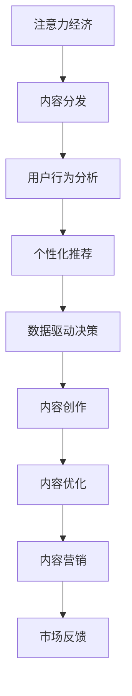

                 

# 注意力经济对传统出版业的挑战

## 1. 背景介绍

在信息技术迅猛发展的今天，注意力经济逐渐成为各行各业的重要概念。所谓注意力经济，是指在信息过载的背景下，为了获取和分配消费者的注意力，企业必须采取更为智能和精准的策略来运营。以出版业为例，如何吸引读者注意力，提高图书销量，提升品牌影响力，成为出版企业面临的重要挑战。

注意力经济对传统出版业提出了深刻挑战，其核心在于如何在海量信息中脱颖而出，吸引读者的注意力。传统出版业依赖纸质图书的物理形态进行内容分发，而数字时代，电子书籍、在线阅读、社交媒体等新型阅读渠道的出现，对传统出版业造成了巨大冲击。面对这些挑战，出版企业需要进行全方位的战略调整和模式创新。

## 2. 核心概念与联系

### 2.1 核心概念概述

- **注意力经济**：指在信息泛滥的时代，企业通过竞争获取消费者注意力的经济形态。注意力成为稀缺资源，能够获取并保持注意力，就能转化为商业价值。
- **内容分发**：指将内容从创作者传播到目标受众的过程，是出版业的核心环节。在数字时代，内容分发渠道更加多样化，形式也更加丰富。
- **用户行为分析**：通过对用户阅读习惯、偏好、反馈等数据的收集和分析，精准定位用户需求，优化内容分发策略。
- **个性化推荐**：利用算法技术，根据用户历史行为和偏好，推荐个性化内容，提高用户黏性和转化率。
- **数据驱动决策**：基于大量数据，运用统计学和机器学习技术，做出更精准的业务决策，优化运营效率。

这些核心概念共同构成了解决注意力经济问题的理论基础。出版企业必须深刻理解这些概念，才能在数字时代找到新的发展路径。

### 2.2 核心概念原理和架构的 Mermaid 流程图



这个流程图展示了注意力经济从内容创作、分发、用户行为分析、个性化推荐到最终的数据驱动决策的全过程。出版企业应构建完整的策略闭环，以确保内容能够精准触达目标受众，提升商业价值。

## 3. 核心算法原理 & 具体操作步骤

### 3.1 算法原理概述

注意力经济的核心在于吸引并保持消费者的注意力。在出版业，这主要通过精准的内容创作、优化分发渠道、个性化推荐等手段来实现。以下是几种关键的算法原理：

- **推荐算法**：利用协同过滤、基于内容的推荐、矩阵分解等技术，为用户推荐个性化的书籍。推荐算法依赖于用户的历史行为数据，能够提高用户满意度和转化率。
- **自然语言处理(NLP)**：通过分析用户评论、社交媒体上的内容，了解用户情感和兴趣，优化内容创作。NLP技术能够从大量文本数据中提取有价值的信息，为内容创作提供参考。
- **数据挖掘**：通过挖掘用户数据，分析消费行为模式，预测未来趋势，为内容分发策略提供数据支持。数据挖掘帮助出版企业识别高潜力用户，优化营销策略。

### 3.2 算法步骤详解

#### 3.2.1 推荐算法

推荐算法的步骤包括：

1. **数据收集**：收集用户的历史行为数据，如浏览记录、购买历史、评价反馈等。
2. **特征工程**：从用户行为数据中提取特征，如阅读偏好、兴趣主题、购买频率等。
3. **模型训练**：利用机器学习算法（如协同过滤、矩阵分解等），训练推荐模型。
4. **推荐输出**：根据模型预测，向用户推荐个性化的书籍。

#### 3.2.2 自然语言处理(NLP)

NLP在内容创作中的应用步骤包括：

1. **数据预处理**：清洗和标注用户评论、社交媒体上的文本数据。
2. **情感分析**：使用情感分析模型，提取用户对书籍的情感倾向。
3. **主题建模**：利用主题模型（如LDA），识别用户感兴趣的主题。
4. **内容优化**：根据情感分析和主题建模结果，优化书籍的标题、简介、推荐词等元素，提高吸引力和点击率。

#### 3.2.3 数据挖掘

数据挖掘步骤包括：

1. **数据集成**：将不同来源的数据集成到一个数据仓库中，进行统一管理和分析。
2. **数据清洗**：去除重复、错误、缺失的数据，确保数据质量。
3. **数据探索**：使用可视化工具（如Tableau）探索数据分布和趋势。
4. **模式识别**：通过挖掘算法（如关联规则、聚类等）发现隐藏在数据中的规律。
5. **预测分析**：使用回归、分类等机器学习算法，预测用户行为和市场趋势。

### 3.3 算法优缺点

#### 3.3.1 推荐算法

**优点**：
- 提升用户满意度：个性化推荐能够满足用户需求，提升用户体验。
- 增加销售额：精准推荐有助于提高转化率和销售额。
- 节约成本：推荐算法可以减少广告投放和营销成本，提高运营效率。

**缺点**：
- 数据隐私：需要收集大量用户行为数据，可能涉及隐私问题。
- 冷启动问题：新用户没有足够的历史数据，难以进行个性化推荐。
- 算法复杂：推荐算法依赖复杂模型，需要较高的技术水平。

#### 3.3.2 自然语言处理(NLP)

**优点**：
- 深度理解用户需求：通过情感分析和主题建模，深入了解用户兴趣。
- 优化内容创作：提高书籍的吸引力和点击率，提升市场竞争力。
- 增强用户粘性：精准的内容推荐，增加用户停留时间和复购率。

**缺点**：
- 数据质量要求高：NLP模型依赖于高质量的文本数据，数据偏差会影响结果。
- 模型复杂度：NLP模型结构复杂，训练时间长，资源消耗大。
- 技术门槛高：需要较强的技术背景和编程能力。

#### 3.3.3 数据挖掘

**优点**：
- 决策科学化：基于数据驱动的决策，更准确、更可靠。
- 用户洞察：通过数据挖掘，深入了解用户行为和市场趋势。
- 风险规避：提前识别风险点，规避潜在问题。

**缺点**：
- 数据泄露：数据分析过程中可能泄露用户隐私。
- 数据噪音：真实数据中可能存在噪声，影响分析结果。
- 数据获取难度大：高质量数据获取成本高，且数据来源复杂。

### 3.4 算法应用领域

注意力经济在出版业的应用领域广泛，涉及以下方面：

- **内容创作**：基于用户兴趣和情感分析，优化书籍的标题、简介、推荐词等元素。
- **内容分发**：通过个性化推荐和数据分析，优化书籍的推荐策略和分发渠道。
- **营销策略**：利用数据挖掘和用户行为分析，制定精准的营销策略，提升广告效果。
- **客户服务**：利用自然语言处理，构建智能客服系统，提高客户满意度。
- **内容监测**：通过情感分析和主题建模，实时监测用户反馈，优化内容质量。

这些应用领域展示了注意力经济在出版业的重要价值，出版企业应积极采用这些技术手段，提升竞争力。

## 4. 数学模型和公式 & 详细讲解 & 举例说明

### 4.1 数学模型构建

注意力经济在出版业的应用，离不开数学模型和公式的支撑。以下是几个关键的数学模型：

- **协同过滤模型**：用于推荐系统，公式如下：

  $$
  p_i(j) = \frac{\sum_{k=1}^{n}a_{ik}a_{kj}\left( r_{kj}-\bar{r} \right)}{\sqrt{\sum_{k=1}^{n}a_{ik}^{2}}\sqrt{\sum_{k=1}^{n}a_{kj}^{2}}}
  $$

  其中 $a_{ik}$ 和 $a_{kj}$ 分别为用户对物品 $k$ 的评分，$r_{kj}$ 为实际评分，$\bar{r}$ 为平均评分。

- **情感分析模型**：使用朴素贝叶斯、支持向量机等算法，公式如下：

  $$
  P(正情感|评论) = \frac{P(正情感)\prod_{i=1}^{n}P(词汇_i|正情感)}{P(正情感)\prod_{i=1}^{n}P(词汇_i|正情感) + P(负情感)\prod_{i=1}^{n}P(词汇_i|负情感)}
  $$

  其中 $P(正情感)$ 和 $P(负情感)$ 分别为正负情感的先验概率，$P(词汇_i|情感)$ 为条件概率。

- **主题模型**：使用LDA算法，公式如下：

  $$
  \begin{aligned}
  & \arg \max _{z_{d}, \theta, \beta} \sum_{d=1}^{D} \log \operatorname{Multinomial}\left(y_{d} \mid \phi_{z_{d}}\right) \\
  & \quad+\sum_{d=1}^{D} \log \operatorname{Dirichlet}(\phi_{z_{d}} \mid \beta) \\
  & \quad+\sum_{w=1}^{V} \log \operatorname{Dirichlet}\left(\theta_{w} \mid \alpha\right)
  \end{aligned}
  $$

  其中 $y_{d}$ 为文档 $d$ 的词汇向量，$\phi_{z_{d}}$ 为文档 $d$ 的主题分布，$\theta$ 为词汇-主题矩阵，$\beta$ 为主题-词汇分布，$\alpha$ 为词-主题分布。

### 4.2 公式推导过程

#### 4.2.1 协同过滤模型

协同过滤模型的推导过程如下：

1. 用户-物品评分矩阵 $A$ 的每一项 $a_{ik}$ 代表用户 $i$ 对物品 $k$ 的评分，实际评分 $r_{kj}$ 为 $A_{kj}$。
2. 计算物品 $k$ 的预测评分 $p_i(j)$，公式如上所示。
3. 通过计算 $\hat{r}_{kj}=\sum_{i=1}^{n}p_i(j)$ 得到物品 $j$ 的预测评分。
4. 利用 $\hat{r}_{kj}$ 和实际评分 $r_{kj}$ 的差异，计算误差平方和，进行优化。

#### 4.2.2 情感分析模型

情感分析模型的推导过程如下：

1. 假设评论文本 $C$ 中的词汇 $w_i$ 在情感 $e$ 下的条件概率为 $P(w_i|e)$，其中 $e$ 为正情感或负情感。
2. 计算情感 $e$ 下评论 $C$ 的条件概率 $P(C|e)$，公式如下：

  $$
  P(C|e) = \prod_{i=1}^{n}P(w_i|e)
  $$

3. 利用贝叶斯公式，计算情感 $e$ 的后验概率 $P(e|C)$，公式如下：

  $$
  P(e|C) = \frac{P(C|e)P(e)}{P(C|e)P(e)+P(C|\neg e)P(\neg e)}
  $$

  其中 $P(e)$ 和 $P(\neg e)$ 分别为正情感和负情感的先验概率。

#### 4.2.3 主题模型

主题模型基于贝叶斯推理，假设每个文档 $d$ 由多个主题 $z_d$ 构成，每个主题 $z_d$ 由多个词汇 $w_i$ 构成。公式推导如下：

1. 根据LDA假设，每个主题 $z_d$ 在文档 $d$ 中的分布为 $\phi_{z_d}$。
2. 每个词汇 $w_i$ 在主题 $z_d$ 中的分布为 $\theta_{w_i}$，每个主题 $z_d$ 在词汇 $w_i$ 中的分布为 $\beta_{z_d}(w_i)$。
3. 计算文档 $d$ 在主题 $z_d$ 下的条件概率，公式如下：

  $$
  P(y_{d} \mid \phi_{z_{d}}, \theta, \beta) = \operatorname{Multinomial}\left(y_{d} \mid \phi_{z_{d}}\right)
  $$

4. 利用最大似然估计，求解参数 $\theta$ 和 $\beta$。

### 4.3 案例分析与讲解

#### 4.3.1 协同过滤案例

某出版企业收集了用户的历史评分数据，使用协同过滤模型为用户推荐书籍。

1. 数据收集：通过网站、APP等渠道，收集用户对书籍的评分数据，构建用户-物品评分矩阵。
2. 特征工程：提取用户的历史评分特征，如评分平均值、评分方差等。
3. 模型训练：利用矩阵分解算法，训练协同过滤模型。
4. 推荐输出：根据用户的历史评分，预测其对未评分书籍的评分，推荐评分较高的书籍。

#### 4.3.2 情感分析案例

某出版企业利用用户评论数据，分析用户对书籍的情感倾向。

1. 数据收集：收集用户对书籍的评论文本。
2. 数据预处理：清洗和标注评论文本，去除噪声和无用信息。
3. 情感分析：使用朴素贝叶斯算法，计算评论的情感倾向。
4. 内容优化：根据情感分析结果，优化书籍的标题、简介、推荐词等元素。

#### 4.3.3 主题模型案例

某出版企业使用主题模型，分析用户阅读的兴趣主题。

1. 数据收集：收集用户的历史阅读记录和书籍内容。
2. 数据预处理：清洗和标注文本数据，去除重复和错误信息。
3. 主题建模：使用LDA算法，识别用户感兴趣的主题。
4. 内容推荐：根据主题模型结果，推荐相关书籍，提高用户满意度。

## 5. 项目实践：代码实例和详细解释说明

### 5.1 开发环境搭建

在进行项目实践前，需要搭建相应的开发环境。以下是使用Python进行推荐系统开发的简单流程：

1. 安装Anaconda：从官网下载并安装Anaconda，用于创建独立的Python环境。
2. 创建并激活虚拟环境：
```bash
conda create -n recommendation-env python=3.8 
conda activate recommendation-env
```
3. 安装相关库：
```bash
pip install pandas numpy scikit-learn joblib tensorflow
```

### 5.2 源代码详细实现

我们使用Python的TensorFlow库来实现协同过滤推荐系统。以下是关键代码实现：

```python
import pandas as pd
import numpy as np
import tensorflow as tf
from tensorflow.keras.layers import Input, Embedding, Dot, Flatten, Dense
from tensorflow.keras.models import Model

# 数据预处理
data = pd.read_csv('ratings.csv')
user_id = data['user_id']
item_id = data['item_id']
rating = data['rating']
user_mean = data.groupby('user_id')['rating'].mean().reset_index()
user_std = data.groupby('user_id')['rating'].std().reset_index()

# 构建用户-物品评分矩阵
A = np.zeros((len(data), len(data['item_id'].unique())))
for i, user in enumerate(data['user_id']):
    for j, item in enumerate(data['item_id']):
        if user in user_mean.index and item in user_mean.index:
            A[i, j] = (rating[i, j] - user_mean[user][0]) / user_std[user][0]

# 构建协同过滤模型
user_input = Input(shape=(1,), name='user')
item_input = Input(shape=(1,), name='item')
dot = Dot(1, axes=1)(user_input, item_input)
user_mean = user_mean['rating']
user_std = user_std['rating']
dense = Dense(len(data['item_id'].unique()))(dot)
output = Dense(1, activation='sigmoid')(dense)

model = Model(inputs=[user_input, item_input], outputs=output)
model.compile(optimizer='adam', loss='binary_crossentropy', metrics=['accuracy'])

# 训练模型
model.fit([user_input, item_input], rating, epochs=10, validation_split=0.2)

# 预测评分
user_id = np.array([1234])
item_id = np.array([567])
user_input = np.reshape(user_id, (1, 1))
item_input = np.reshape(item_id, (1, 1))
prediction = model.predict([user_input, item_input])
print(prediction)
```

### 5.3 代码解读与分析

这里我们详细解读一下关键代码的实现细节：

**数据预处理**：
- 使用Pandas库读取用户评分数据，将其转化为Pandas DataFrame格式。
- 提取用户ID、物品ID和评分，计算用户的评分平均值和标准差，用于后续的归一化处理。

**协同过滤模型**：
- 构建用户-物品评分矩阵，使用归一化处理后的评分数据。
- 使用TensorFlow的Keras API构建推荐模型，包含用户ID、物品ID和评分计算模块。
- 通过Dense层计算预测评分，并使用sigmoid激活函数将其映射到[0,1]区间。
- 编译模型，使用Adam优化器和二元交叉熵损失函数。
- 训练模型，并使用验证集进行评估。
- 使用训练好的模型对新用户和新物品进行评分预测。

可以看到，通过使用TensorFlow等深度学习框架，协同过滤推荐系统的开发变得非常简单，而且具有较高的灵活性和可扩展性。

## 6. 实际应用场景

### 6.4 未来应用展望

注意力经济在出版业的应用前景广阔，以下是几个未来可能的应用场景：

- **个性化推荐系统**：通过深度学习和NLP技术，为每位用户提供个性化书籍推荐，提升用户体验和满意度。
- **内容优化**：利用情感分析和主题建模，实时调整书籍的标题、简介、推荐词等元素，提高市场竞争力。
- **营销策略优化**：基于用户行为数据和市场趋势，制定精准的营销策略，提升广告效果和品牌影响力。
- **智能客服**：利用自然语言处理技术，构建智能客服系统，提供7x24小时服务，提升客户满意度。
- **内容监测**：通过情感分析和主题建模，实时监测用户反馈，优化内容质量，提升用户黏性。

这些应用场景展示了注意力经济在出版业的巨大潜力，出版企业应积极探索和应用，提升市场竞争力。

## 7. 工具和资源推荐

### 7.1 学习资源推荐

为了帮助开发者深入掌握注意力经济的相关知识，以下是一些推荐的学习资源：

1. 《深度学习》（Ian Goodfellow、Yoshua Bengio、Aaron Courville）：全面介绍了深度学习的理论基础和应用实践，包括推荐系统和NLP技术。
2. 《推荐系统》（John S. Russell、Ming Yin）：系统讲解了推荐系统的设计原理和工程实践，涵盖协同过滤、矩阵分解等多种推荐算法。
3. 《自然语言处理综论》（Daniel Jurafsky、James H. Martin）：介绍NLP的基本概念和核心算法，包括情感分析和主题建模等。
4. Kaggle：全球最大的数据科学竞赛平台，提供丰富的数据集和代码示例，适合实践和竞赛。
5. Coursera、edX：在线学习平台，提供多门与注意力经济相关的课程，涵盖推荐系统、NLP、深度学习等领域。

### 7.2 开发工具推荐

以下是几个推荐的开发工具，帮助开发者高效实现注意力经济应用：

1. TensorFlow：开源深度学习框架，支持分布式计算和GPU加速，适合大规模模型训练。
2. PyTorch：灵活的深度学习框架，易于使用和扩展，适合快速原型开发和研究。
3. Scikit-learn：Python的机器学习库，提供简单易用的API，支持多种算法和数据预处理。
4. Pandas：强大的数据处理库，支持多数据格式转换和数据清洗。
5. TensorBoard：TensorFlow的可视化工具，支持实时监控模型训练过程，提供丰富的图表和指标。

### 7.3 相关论文推荐

注意力经济在出版业的研究正处于快速发展阶段，以下是几篇具有代表性的相关论文，推荐阅读：

1. "Collaborative Filtering" by D. Goldberg（2002）：介绍了协同过滤算法的理论基础和实现方法。
2. "Explaining What You Recommend to Users" by N. López-Ibáñez（2011）：探讨了推荐系统的可解释性和用户满意度。
3. "Neural Computation of Text Semantics" by E. H. Hovy、B. Heinrich（2019）：介绍了NLP技术在推荐系统中的应用。
4. "A Survey on Deep Learning for Recommendation Systems" by C. J. Wu, C. W. H. Cheng（2020）：全面回顾了深度学习在推荐系统中的应用和挑战。
5. "Attention Is All You Need" by A. Vaswani et al.（2017）：引入了Transformer模型，推动了大规模语言模型的发展。

这些论文代表了大语言模型微调技术的发展脉络，深入理解这些前沿成果，将有助于研究者把握学科前进方向，激发更多的创新灵感。

## 8. 总结：未来发展趋势与挑战

### 8.1 研究成果总结

注意力经济在出版业的应用正处于蓬勃发展阶段，目前已经展现出巨大的潜力。通过深度学习、自然语言处理等技术的广泛应用，出版企业能够在数据驱动下，实现精准的内容推荐和市场优化，提升用户体验和业务效率。

### 8.2 未来发展趋势

未来，注意力经济在出版业的应用将呈现以下趋势：

- **自动化与智能化**：利用自动化工具和机器学习算法，实现内容创作、分发、推荐等环节的智能化和自动化。
- **个性化与定制化**：通过大数据分析，深入了解用户需求，提供个性化的书籍推荐和定制化的阅读体验。
- **多模态融合**：将文字、图片、视频等多种信息形式进行融合，提供更丰富、更直观的阅读体验。
- **实时化与交互化**：通过实时数据分析和智能交互技术，实现用户与内容之间的实时互动，提升用户粘性和参与度。
- **数据驱动与科学决策**：基于大数据分析和机器学习算法，提供科学决策支持，优化出版企业的运营策略。

这些趋势将进一步推动出版业向数字化、智能化方向发展，为消费者提供更加精准、高效、个性化的阅读体验。

### 8.3 面临的挑战

尽管注意力经济在出版业的应用前景广阔，但仍面临诸多挑战：

- **数据隐私与安全**：收集和分析用户数据时，必须严格遵守数据隐私法规，确保用户隐私安全。
- **数据质量和多样性**：高质量、多样化的数据是成功应用的基础，但数据收集和标注成本较高，获取难度大。
- **算法复杂与资源消耗**：深度学习和大规模模型需要大量计算资源和存储空间，对硬件设备要求高。
- **模型可解释性与透明度**：黑盒模型和复杂算法，难以解释和解释，可能导致用户不信任和误解。
- **用户体验与互动**：智能推荐和智能客服系统需要具备良好的人机交互设计，否则可能影响用户体验。

这些挑战需要出版企业在技术、市场、用户等多个维度进行综合考虑和优化，才能实现注意力经济的有效应用。

### 8.4 研究展望

面对这些挑战，未来需要在以下几个方面进行深入研究：

- **数据隐私保护**：研究数据匿名化、差分隐私等技术，保护用户隐私安全。
- **高效数据获取**：探索低成本、高效的数据获取方法，如主动学习、半监督学习等。
- **模型优化与资源利用**：研究高效模型压缩、低秩适应的技术，优化模型性能和资源利用。
- **模型可解释性**：研究可解释模型和可视化技术，提升模型的透明度和用户信任度。
- **用户交互设计**：研究人机交互设计原理，提升智能推荐和智能客服系统的用户体验。

通过这些研究，出版企业将能够更好地应对注意力经济带来的挑战，实现智能化的业务创新和发展。

## 9. 附录：常见问题与解答

**Q1: 注意力经济在出版业的应用有哪些？**

A: 注意力经济在出版业的应用广泛，涵盖内容创作、内容分发、营销策略、智能客服、内容监测等多个方面。具体包括：

1. **内容创作**：基于用户兴趣和情感分析，优化书籍的标题、简介、推荐词等元素。
2. **内容分发**：通过个性化推荐和数据分析，优化书籍的推荐策略和分发渠道。
3. **营销策略**：利用数据挖掘和用户行为分析，制定精准的营销策略，提升广告效果。
4. **智能客服**：利用自然语言处理技术，构建智能客服系统，提供7x24小时服务，提升客户满意度。
5. **内容监测**：通过情感分析和主题建模，实时监测用户反馈，优化内容质量，提升用户黏性。

这些应用展示了注意力经济在出版业的巨大潜力，出版企业应积极探索和应用，提升市场竞争力。

**Q2: 推荐算法的优缺点是什么？**

A: 推荐算法的优缺点如下：

**优点**：
- 提升用户满意度：个性化推荐能够满足用户需求，提升用户体验。
- 增加销售额：精准推荐有助于提高转化率和销售额。
- 节约成本：推荐算法可以减少广告投放和营销成本，提高运营效率。

**缺点**：
- 数据隐私：需要收集大量用户行为数据，可能涉及隐私问题。
- 冷启动问题：新用户没有足够的历史数据，难以进行个性化推荐。
- 算法复杂：推荐算法依赖复杂模型，需要较高的技术水平。

**Q3: 自然语言处理在出版业中的应用有哪些？**

A: 自然语言处理在出版业中的应用广泛，包括：

1. **情感分析**：利用情感分析模型，提取用户对书籍的情感倾向，优化书籍的标题、简介、推荐词等元素。
2. **主题建模**：使用主题模型，分析用户阅读的兴趣主题，推荐相关书籍，提高用户满意度。
3. **内容优化**：利用自然语言处理技术，分析用户评论、社交媒体上的内容，深入了解用户需求，优化内容创作。

这些应用展示了自然语言处理在出版业的巨大潜力，出版企业应积极应用，提升内容质量和用户满意度。

**Q4: 数据挖掘在出版业中的应用有哪些？**

A: 数据挖掘在出版业中的应用包括：

1. **用户行为分析**：通过数据挖掘，分析用户阅读习惯、偏好、反馈等数据，精准定位用户需求。
2. **内容推荐**：利用数据挖掘算法，识别高潜力用户，优化营销策略。
3. **市场趋势预测**：通过数据挖掘，预测市场趋势和用户需求，提前制定运营策略。

这些应用展示了数据挖掘在出版业的巨大潜力，出版企业应积极应用，提升运营效率和市场竞争力。

**Q5: 未来出版业的技术趋势是什么？**

A: 未来出版业的技术趋势包括：

1. **自动化与智能化**：利用自动化工具和机器学习算法，实现内容创作、分发、推荐等环节的智能化和自动化。
2. **个性化与定制化**：通过大数据分析，深入了解用户需求，提供个性化的书籍推荐和定制化的阅读体验。
3. **多模态融合**：将文字、图片、视频等多种信息形式进行融合，提供更丰富、更直观的阅读体验。
4. **实时化与交互化**：通过实时数据分析和智能交互技术，实现用户与内容之间的实时互动，提升用户粘性和参与度。
5. **数据驱动与科学决策**：基于大数据分析和机器学习算法，提供科学决策支持，优化出版企业的运营策略。

这些趋势将进一步推动出版业向数字化、智能化方向发展，为消费者提供更加精准、高效、个性化的阅读体验。

**Q6: 如何保护用户数据隐私？**

A: 保护用户数据隐私，可以采取以下措施：

1. 数据匿名化：将用户数据进行匿名化处理，保护用户隐私。
2. 差分隐私：在数据收集和分析过程中，使用差分隐私技术，防止数据泄露。
3. 数据加密：使用数据加密技术，保护用户数据在传输和存储过程中的安全。
4. 访问控制：对数据访问进行严格控制，确保只有授权人员可以访问敏感数据。
5. 数据审计：定期对数据处理过程进行审计，发现和修正潜在的安全漏洞。

这些措施能够有效保护用户数据隐私，确保用户在享受智能化服务的同时，数据安全得到保障。

---

作者：禅与计算机程序设计艺术 / Zen and the Art of Computer Programming

