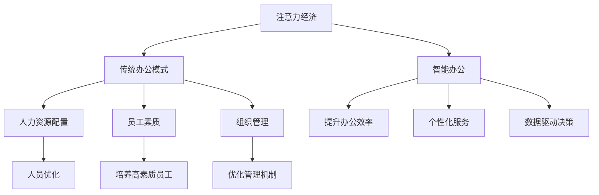

                 

# 注意力经济对传统办公模式的挑战

> 关键词：注意力经济, 智能办公, 传统办公模式, 人工智能, 大数据, 组织管理

## 1. 背景介绍

### 1.1 问题由来

在数字化、智能化浪潮的推动下，全球进入了“注意力经济”的时代。传统的线性媒体、报纸、电视、广播等正在逐渐被移动互联网、社交媒体、智能搜索等新媒体所取代。人们获取信息的方式和途径发生了深刻变化，注意力成为最重要的资源。

在“注意力经济”中，公司、组织和机构都在争抢消费者的注意力。但这种变化对传统办公模式造成了巨大冲击，甚至引发了诸多挑战。面对新的经济环境，如何适应并调整自己的办公模式，成为许多企业急需解决的问题。

### 1.2 问题核心关键点

注意力经济的崛起带来了以下几个核心关键点：

- **信息爆炸**：大量信息充斥在互联网中，使得人们难以消化和筛选。
- **注意力稀缺**：人们的注意力变得分散和短视，容易陷入信息茧房。
- **品牌竞争**：企业需要耗费更多资源争夺用户注意力，提升品牌曝光率。
- **个性化需求**：个性化内容更容易获得用户关注，驱动企业向智能推荐、个性化服务转型。
- **人力资源配置**：注意力经济的竞争需要高素质、高技能的员工队伍，这对传统人力资源配置提出了新要求。

这些核心关键点共同构成了注意力经济对传统办公模式的新挑战，需要企业从各个层面进行应对和调整。

## 2. 核心概念与联系

### 2.1 核心概念概述

为更好地理解注意力经济对传统办公模式的挑战，本节将介绍几个密切相关的核心概念：

- **注意力经济**：指在数字化经济中，企业通过争夺消费者的注意力来获取竞争优势的经济模式。

- **智能办公**：利用人工智能和大数据技术，对传统办公模式进行智能化、自动化改造，提升办公效率和质量。

- **传统办公模式**：基于线性组织结构和集中式管理，依赖手工操作、纸质文件等物理介质进行业务处理的模式。

- **人力资源配置**：通过科学、合理地分配和使用人力资源，实现员工能力与岗位需求的匹配。

- **员工素质**：包括专业技能、综合素质、创新能力等，是企业竞争力的重要体现。

- **组织管理**：企业内部对员工、项目、资源等进行统筹管理和协调的机制。

这些核心概念之间的逻辑关系可以通过以下Mermaid流程图来展示：



这个流程图展示了大语言模型的核心概念及其之间的关系：

1. 注意力经济的崛起促使企业转向智能办公，提升效率和竞争力。
2. 智能办公需要高素质的员工队伍，对人力资源配置提出更高要求。
3. 企业需要优化组织管理，实现人力资源的科学配置。
4. 高素质员工与优化管理机制相辅相成，共同推动企业发展。

这些概念共同构成了注意力经济对传统办公模式挑战的深层背景。

## 3. 核心算法原理 & 具体操作步骤

### 3.1 算法原理概述

注意力经济的崛起对传统办公模式提出了以下挑战：

1. **信息管理**：如何在海量信息中找到有价值的内容。
2. **员工绩效**：如何高效配置员工，提升工作效率和质量。
3. **客户互动**：如何通过智能化的方式更好地与客户沟通。
4. **组织结构**：如何适应快速变化的业务需求，调整组织结构。
5. **知识共享**：如何促进知识在企业内部流通，提升整体能力。

针对这些挑战，智能办公通过以下算法原理进行应对：

- **信息检索与推荐**：利用算法技术在海量信息中快速定位相关内容，提升信息检索效率。
- **员工性能管理**：通过数据分析，优化员工配置，提升工作效率和质量。
- **客户互动**：通过智能化的客户服务平台，实现快速响应和精准服务。
- **组织结构调整**：通过数据分析和预测，优化组织结构，适应快速变化的市场需求。
- **知识共享**：通过知识图谱和推荐系统，促进知识在企业内部的流通和共享。

### 3.2 算法步骤详解

以下是智能办公在应对注意力经济挑战时，所遵循的主要算法步骤：

1. **数据采集与清洗**：收集企业内部的信息、员工绩效、客户互动等数据，并进行初步清洗和整理。
2. **特征工程**：利用特征工程技术，提取和构建适用于智能办公的数据特征。
3. **算法训练与优化**：选择合适的算法模型，如推荐算法、决策树、神经网络等，进行训练和优化。
4. **模型集成与评估**：将多个模型进行集成，提升整体性能，并通过评估指标进行效果验证。
5. **系统部署与应用**：将训练好的模型部署到实际系统中，实现信息检索、员工绩效管理、客户互动、组织结构调整和知识共享等功能。
6. **持续优化**：根据系统反馈，持续优化模型和算法，保持系统性能的稳定和提升。

### 3.3 算法优缺点

智能办公在应对注意力经济挑战时，具有以下优点：

- **效率提升**：通过自动化和智能化的方式，大幅提升信息检索、员工绩效管理等效率。
- **精准度提高**：通过算法优化，实现更精准的信息推荐和员工配置。
- **成本降低**：减少对人工操作和纸质文件的依赖，降低运营成本。

同时，智能办公也存在以下缺点：

- **数据隐私**：在数据采集和处理过程中，可能会涉及员工和客户的隐私数据，需要严格保护。
- **算法偏见**：算法可能存在偏见，导致推荐结果不公正。
- **技术依赖**：需要高水平的工程师和技术人员进行开发和维护。
- **成本投入**：初期开发和部署可能需要较大的资金投入。

### 3.4 算法应用领域

智能办公技术在多个领域都有广泛应用，如：

- **人力资源管理**：通过智能办公系统，实现员工招聘、绩效管理、培训等流程的自动化和智能化。
- **客户服务**：通过智能客户服务平台，实现客户咨询、投诉、售后等业务的自动化处理。
- **市场营销**：利用智能推荐系统，实现个性化营销和精准营销。
- **财务管理**：利用数据分析和机器学习，实现财务数据的智能分析和风险控制。
- **运营管理**：通过智能办公系统，实现生产、仓储、物流等环节的优化和智能化。
- **知识管理**：通过知识图谱和推荐系统，促进知识在企业内部的流通和共享。

这些应用场景展示了智能办公的广泛潜力，进一步印证了其对传统办公模式的挑战和影响。

## 4. 数学模型和公式 & 详细讲解 & 举例说明

### 4.1 数学模型构建

本节将使用数学语言对智能办公系统进行更加严格的刻画。

记智能办公系统为 $S_{\theta}$，其中 $\theta$ 为系统参数。假设智能办公系统需要处理的任务为 $T=\{R,V,C,S,K\}$，分别代表信息检索、员工绩效管理、客户互动、组织结构调整和知识共享。

定义任务 $T$ 在数据集 $D=\{(x_i,y_i)\}_{i=1}^N$ 上的损失函数为 $\ell(S_{\theta}(x_i),y_i)$，则在数据集 $D$ 上的经验风险为：

$$
\mathcal{L}(\theta) = \frac{1}{N} \sum_{i=1}^N \ell(S_{\theta}(x_i),y_i)
$$

智能办公系统的优化目标是最小化经验风险，即找到最优参数：

$$
\theta^* = \mathop{\arg\min}_{\theta} \mathcal{L}(\theta)
$$

在实践中，我们通常使用基于梯度的优化算法（如SGD、Adam等）来近似求解上述最优化问题。设 $\eta$ 为学习率，$\lambda$ 为正则化系数，则参数的更新公式为：

$$
\theta \leftarrow \theta - \eta \nabla_{\theta}\mathcal{L}(\theta) - \eta\lambda\theta
$$

其中 $\nabla_{\theta}\mathcal{L}(\theta)$ 为损失函数对参数 $\theta$ 的梯度，可通过反向传播算法高效计算。

### 4.2 公式推导过程

以下我们以员工绩效管理为例，推导算法的数学模型和公式。

假设智能办公系统通过员工绩效管理模型 $M_{\theta}$ 对员工 $i$ 的工作表现进行评估，模型的输出为 $\hat{y}_i=M_{\theta}(x_i) \in [0,1]$，表示员工 $i$ 完成工作的概率。实际工作量 $y_i$ 为二分类变量，表示员工 $i$ 是否完成任务。

定义模型 $M_{\theta}$ 在输入 $x_i$ 上的损失函数为 $\ell(M_{\theta}(x_i),y_i)$，则在数据集 $D$ 上的经验风险为：

$$
\mathcal{L}(\theta) = -\frac{1}{N}\sum_{i=1}^N [y_i\log M_{\theta}(x_i)+(1-y_i)\log(1-M_{\theta}(x_i))]
$$

根据链式法则，损失函数对参数 $\theta_k$ 的梯度为：

$$
\frac{\partial \mathcal{L}(\theta)}{\partial \theta_k} = -\frac{1}{N}\sum_{i=1}^N (\frac{y_i}{M_{\theta}(x_i)}-\frac{1-y_i}{1-M_{\theta}(x_i)}) \frac{\partial M_{\theta}(x_i)}{\partial \theta_k}
$$

其中 $\frac{\partial M_{\theta}(x_i)}{\partial \theta_k}$ 可进一步递归展开，利用自动微分技术完成计算。

### 4.3 案例分析与讲解

假设智能办公系统需要评估员工 $i$ 在任务 $t$ 上的工作表现。模型 $M_{\theta}$ 的输出为员工 $i$ 完成工作的概率 $\hat{y}_i$，实际工作量 $y_i$ 为二分类变量，表示员工 $i$ 是否完成任务。假设员工 $i$ 在任务 $t$ 上的工作表现由多因素决定，如技能水平、工作态度、任务难度等。则模型的输入 $x_i$ 可以表示为：

$$
x_i = (x_{i,1},x_{i,2},\ldots,x_{i,n})
$$

其中 $x_{i,j}$ 为影响员工 $i$ 在任务 $t$ 上的工作表现的特征向量。这些特征可以通过数据采集和特征工程得到。

为了训练模型 $M_{\theta}$，需要准备大量标注数据 $D=\{(x_{i,t},y_{i,t})\}_{i=1}^N$，其中 $x_{i,t}$ 为员工 $i$ 在任务 $t$ 上的特征向量，$y_{i,t}$ 为员工 $i$ 在任务 $t$ 上的实际工作量。

模型 $M_{\theta}$ 可以采用多种算法进行训练，如逻辑回归、决策树、神经网络等。以神经网络为例，模型 $M_{\theta}$ 的输入层为特征向量 $x_i$，输出层为 $\hat{y}_i$，中间层为多个全连接层。损失函数 $\ell$ 可以采用交叉熵损失函数，公式如下：

$$
\ell(M_{\theta}(x_i),y_i) = -[y_i\log \hat{y}_i + (1-y_i)\log (1-\hat{y}_i)]
$$

在训练过程中，通过反向传播算法计算梯度，并使用优化算法更新模型参数 $\theta$。具体的训练步骤如下：

1. 数据预处理：将数据集 $D$ 划分为训练集 $D_{train}$ 和验证集 $D_{valid}$，将数据进行归一化、特征选择等预处理。
2. 模型搭建：定义模型结构，包括输入层、隐藏层和输出层。选择合适的激活函数、损失函数和优化器。
3. 模型训练：使用训练集 $D_{train}$ 对模型进行训练，并根据验证集 $D_{valid}$ 的性能进行调整。
4. 模型评估：使用测试集 $D_{test}$ 对模型进行评估，计算准确率、召回率、F1分数等指标。

通过上述步骤，智能办公系统可以构建出高效的员工绩效管理模型，实现对员工工作表现的自动化评估和优化。

## 5. 项目实践：代码实例和详细解释说明

### 5.1 开发环境搭建

在进行智能办公系统开发前，我们需要准备好开发环境。以下是使用Python进行PyTorch开发的环境配置流程：

1. 安装Anaconda：从官网下载并安装Anaconda，用于创建独立的Python环境。

2. 创建并激活虚拟环境：
```bash
conda create -n pytorch-env python=3.8 
conda activate pytorch-env
```

3. 安装PyTorch：根据CUDA版本，从官网获取对应的安装命令。例如：
```bash
conda install pytorch torchvision torchaudio cudatoolkit=11.1 -c pytorch -c conda-forge
```

4. 安装TensorBoard：
```bash
pip install tensorboard
```

5. 安装Flask：
```bash
pip install flask
```

6. 安装Jupyter Notebook：
```bash
pip install jupyter notebook
```

完成上述步骤后，即可在`pytorch-env`环境中开始智能办公系统开发。

### 5.2 源代码详细实现

以下是智能办公系统员工绩效管理模块的PyTorch代码实现。

首先，定义数据处理函数：

```python
import pandas as pd
from sklearn.preprocessing import StandardScaler

class DataProcessor:
    def __init__(self, data_path):
        self.data = pd.read_csv(data_path)
        self.scaler = StandardScaler()
    
    def preprocess_data(self, features, target):
        X = self.data[features]
        y = self.data[target]
        X = self.scaler.fit_transform(X)
        return X, y
```

然后，定义员工绩效管理模型：

```python
import torch
from torch import nn, optim
from torch.utils.data import DataLoader

class EmployeePerformanceModel(nn.Module):
    def __init__(self, input_dim, hidden_dim=64, output_dim=1):
        super(EmployeePerformanceModel, self).__init__()
        self.fc1 = nn.Linear(input_dim, hidden_dim)
        self.fc2 = nn.Linear(hidden_dim, hidden_dim)
        self.fc3 = nn.Linear(hidden_dim, output_dim)
    
    def forward(self, x):
        x = torch.relu(self.fc1(x))
        x = torch.relu(self.fc2(x))
        x = torch.sigmoid(self.fc3(x))
        return x
```

接着，定义训练和评估函数：

```python
def train_model(model, X_train, y_train, X_valid, y_valid, batch_size=32, epochs=10):
    criterion = nn.BCELoss()
    optimizer = optim.Adam(model.parameters(), lr=0.001)
    
    train_loader = DataLoader(X_train, y_train, batch_size=batch_size, shuffle=True)
    valid_loader = DataLoader(X_valid, y_valid, batch_size=batch_size, shuffle=False)
    
    for epoch in range(epochs):
        model.train()
        train_loss = 0.0
        train_correct = 0
        for batch_idx, (inputs, targets) in enumerate(train_loader):
            inputs = inputs.to(device)
            targets = targets.to(device)
            optimizer.zero_grad()
            outputs = model(inputs)
            loss = criterion(outputs, targets)
            loss.backward()
            optimizer.step()
            train_loss += loss.item()
            train_correct += (outputs > 0.5).sum().item()
        
        model.eval()
        valid_loss = 0.0
        valid_correct = 0
        with torch.no_grad():
            for batch_idx, (inputs, targets) in enumerate(valid_loader):
                inputs = inputs.to(device)
                targets = targets.to(device)
                outputs = model(inputs)
                loss = criterion(outputs, targets)
                valid_loss += loss.item()
                valid_correct += (outputs > 0.5).sum().item()
        
        print(f'Epoch {epoch+1}, Train Loss: {train_loss/len(train_loader):.4f}, Train Acc: {train_correct/len(X_train):.4f}')
        print(f'Epoch {epoch+1}, Valid Loss: {valid_loss/len(valid_loader):.4f}, Valid Acc: {valid_correct/len(X_valid):.4f}')
```

最后，启动训练流程并在验证集上评估：

```python
if __name__ == '__main__':
    processor = DataProcessor('data.csv')
    X_train, y_train = processor.preprocess_data(features=['feat1', 'feat2', 'feat3'], target='performance')
    X_valid, y_valid = processor.preprocess_data(features=['feat1', 'feat2', 'feat3'], target='performance')
    
    model = EmployeePerformanceModel(input_dim=X_train.shape[1], output_dim=1)
    model.to(device)
    
    train_model(model, X_train, y_train, X_valid, y_valid)
```

以上就是使用PyTorch对员工绩效管理模型进行训练的完整代码实现。可以看到，PyTorch提供了灵活的框架和丰富的工具，能够快速构建和训练各种智能办公模块。

### 5.3 代码解读与分析

让我们再详细解读一下关键代码的实现细节：

**DataProcessor类**：
- `__init__`方法：初始化数据集和特征缩放器。
- `preprocess_data`方法：对数据进行归一化和特征选择，返回处理后的特征矩阵和目标向量。

**EmployeePerformanceModel类**：
- `__init__`方法：定义神经网络的结构，包括输入层、隐藏层和输出层。
- `forward`方法：定义模型的前向传播过程，包括激活函数和输出层。

**train_model函数**：
- 定义损失函数和优化器。
- 通过DataLoader对数据集进行批次化加载。
- 在每个epoch内，先进行模型训练，计算训练集损失和精度。
- 再进行模型评估，计算验证集损失和精度。
- 输出每个epoch的训练和验证结果。

**训练流程**：
- 首先加载数据集并进行预处理。
- 定义神经网络模型，并进行GPU部署。
- 调用train_model函数进行模型训练，并在验证集上评估。

可以看到，PyTorch提供了高效的数据处理、模型搭建和训练框架，使智能办公系统的开发变得便捷高效。开发者只需关注算法实现和业务逻辑，而底层的技术细节和优化则由PyTorch负责。

## 6. 实际应用场景

### 6.1 智能人力资源管理

智能办公系统在人力资源管理中的应用非常广泛。通过智能办公系统，可以实现招聘、绩效管理、培训等流程的自动化和智能化，提高人力资源管理效率和质量。

例如，智能办公系统可以利用大数据和机器学习算法，对员工的历史绩效、能力、背景等数据进行分析，预测其未来的工作表现，并进行智能匹配。同时，系统可以自动进行员工绩效评估，生成绩效报告，提供个性化培训建议。

### 6.2 智能客户服务

智能办公系统在客户服务中的应用也非常普遍。通过智能客户服务平台，可以实现客户咨询、投诉、售后等业务的自动化处理，提高客户服务效率和质量。

例如，智能客户服务平台可以利用自然语言处理技术，对客户的咨询、投诉等信息进行自动化分析，生成初步处理意见，并提供解决方案。同时，系统可以自动记录客户历史信息，进行情感分析和预警，提高客户满意度。

### 6.3 智能财务管理

智能办公系统在财务管理中的应用也非常重要。通过智能办公系统，可以实现财务数据的智能分析和风险控制，提升财务管理效率和精度。

例如，智能办公系统可以利用机器学习算法，对财务数据进行异常检测和预测，及时发现和处理财务风险。同时，系统可以自动进行账目核对、报表生成等操作，提高财务处理效率。

### 6.4 智能运营管理

智能办公系统在运营管理中的应用也非常广泛。通过智能办公系统，可以实现生产、仓储、物流等环节的优化和智能化，提高运营管理效率和质量。

例如，智能办公系统可以利用物联网技术和传感器，对生产设备进行实时监控和预测维护，减少设备故障和停机时间。同时，系统可以自动进行物流调度和库存管理，提高物流效率和降低成本。

### 6.5 智能知识管理

智能办公系统在知识管理中的应用也非常重要。通过智能办公系统，可以实现知识在企业内部的流通和共享，提升企业整体能力。

例如，智能办公系统可以利用知识图谱和推荐系统，对企业的知识库进行智能分类和推荐。同时，系统可以自动进行知识更新和校验，保证知识的准确性和时效性。

## 7. 工具和资源推荐

### 7.1 学习资源推荐

为了帮助开发者系统掌握智能办公的理论基础和实践技巧，这里推荐一些优质的学习资源：

1. 《深度学习》系列书籍：由深度学习专家撰写，全面介绍了深度学习的基础知识和前沿技术，适合初学者和高级开发者。

2. 《机器学习实战》：由知名机器学习专家撰写，提供了丰富的实践案例，适合入门级开发者。

3. 《TensorFlow实战》：由TensorFlow官方团队编写，详细介绍了TensorFlow的使用方法，适合TensorFlow开发者。

4. 《PyTorch官方文档》：PyTorch官方提供的详细文档，包括教程、API和案例，适合PyTorch开发者。

5. 《智能办公技术》系列博文：由智能办公领域的专家撰写，深入浅出地介绍了智能办公系统的开发和应用，适合对智能办公感兴趣的读者。

通过对这些资源的学习实践，相信你一定能够快速掌握智能办公的核心技术，并应用于实际开发中。

### 7.2 开发工具推荐

高效的开发离不开优秀的工具支持。以下是几款用于智能办公开发常用的工具：

1. PyTorch：基于Python的开源深度学习框架，灵活的动态计算图，适合快速迭代研究。大部分智能办公模块都有PyTorch版本的实现。

2. TensorFlow：由Google主导开发的开源深度学习框架，生产部署方便，适合大规模工程应用。同样有丰富的智能办公模块资源。

3. Scikit-learn：开源机器学习库，提供了丰富的机器学习算法和数据预处理工具，适合智能办公系统开发。

4. Jupyter Notebook：交互式开发环境，支持Python、R等多种编程语言，适合数据科学和机器学习开发者。

5. Flask：轻量级的Web框架，适合构建智能办公系统的前端服务。

6. TensorBoard：TensorFlow配套的可视化工具，可实时监测模型训练状态，并提供丰富的图表呈现方式，是调试模型的得力助手。

合理利用这些工具，可以显著提升智能办公系统的开发效率，加快创新迭代的步伐。

### 7.3 相关论文推荐

智能办公技术的发展源于学界的持续研究。以下是几篇奠基性的相关论文，推荐阅读：

1. Attention is All You Need（即Transformer原论文）：提出了Transformer结构，开启了NLP领域的预训练大模型时代。

2. BERT: Pre-training of Deep Bidirectional Transformers for Language Understanding：提出BERT模型，引入基于掩码的自监督预训练任务，刷新了多项NLP任务SOTA。

3. Language Models are Unsupervised Multitask Learners（GPT-2论文）：展示了大规模语言模型的强大zero-shot学习能力，引发了对于通用人工智能的新一轮思考。

4. Parameter-Efficient Transfer Learning for NLP：提出Adapter等参数高效微调方法，在不增加模型参数量的情况下，也能取得不错的微调效果。

5. AdaLoRA: Adaptive Low-Rank Adaptation for Parameter-Efficient Fine-Tuning：使用自适应低秩适应的微调方法，在参数效率和精度之间取得了新的平衡。

这些论文代表了大语言模型微调技术的发展脉络。通过学习这些前沿成果，可以帮助研究者把握学科前进方向，激发更多的创新灵感。

## 8. 总结：未来发展趋势与挑战

### 8.1 总结

本文对智能办公系统在应对注意力经济挑战时的理论基础和实践技巧进行了全面系统的介绍。首先阐述了注意力经济的崛起对传统办公模式造成的冲击，明确了智能办公系统开发的重要性和紧迫性。其次，从算法原理和具体操作步骤，详细讲解了智能办公系统在信息管理、员工绩效管理、客户互动、组织结构调整和知识共享等方面的应用，提供了丰富的代码实例和详细解释。同时，本文还探讨了智能办公系统在人力资源管理、客户服务、财务管理、运营管理和知识管理等多个领域的应用前景，展示了智能办公系统的广泛潜力。

通过本文的系统梳理，可以看到，智能办公系统为应对注意力经济挑战提供了新的解决方案，不仅提升了办公效率和质量，还为传统办公模式带来了深刻的变革。智能办公技术的不断演进，必将进一步提升企业的市场竞争力，推动数字化经济的持续发展。

### 8.2 未来发展趋势

展望未来，智能办公系统的发展将呈现以下几个趋势：

1. **数据融合与分析**：智能办公系统将进一步融合各类数据，如社交媒体、物联网、金融数据等，进行多源数据融合和深入分析，提升决策支持能力。
2. **个性化服务**：智能办公系统将利用机器学习算法，实现个性化服务推荐，满足用户的个性化需求。
3. **自动化与智能化**：智能办公系统将进一步自动化和智能化，减少对人工操作的依赖，提高办公效率和质量。
4. **跨领域应用**：智能办公系统将跨领域扩展，应用于更多行业，如医疗、金融、教育等，提供全面的智能解决方案。
5. **智能协作**：智能办公系统将实现人与人、人与机之间的智能协作，提高团队的协作效率和质量。
6. **安全与隐私保护**：智能办公系统将加强数据隐私和安全保护，防止数据泄露和滥用。

这些趋势展示了智能办公系统未来发展的广阔前景，进一步印证了其对传统办公模式的深刻影响。

### 8.3 面临的挑战

尽管智能办公系统在应对注意力经济挑战时取得了显著进展，但在迈向更加智能化、普适化应用的过程中，仍面临诸多挑战：

1. **数据获取与质量**：智能办公系统需要大量的高质量数据进行训练，而数据获取和清洗是一个复杂且耗时的过程。如何高效获取和处理数据，是智能办公系统开发的关键问题。
2. **算法复杂性**：智能办公系统中的算法复杂性较高，需要高水平的技术人员进行开发和维护。如何降低算法复杂性，提高开发效率，是智能办公系统面临的重要挑战。
3. **技术集成**：智能办公系统需要将多种技术进行融合，如人工智能、大数据、物联网等。如何实现技术集成，提高系统稳定性和可扩展性，是智能办公系统开发的重要难题。
4. **隐私与安全**：智能办公系统中的数据隐私和安全保护非常重要，如何防止数据泄露和滥用，是智能办公系统开发的关键问题。
5. **成本投入**：智能办公系统的开发和部署需要较高的资金投入，如何降低成本，提高投资回报率，是智能办公系统开发的重要考虑。

这些挑战需要企业在开发过程中进行全面考量，通过技术创新和优化，逐步克服这些难题，实现智能办公系统的长期发展和应用。

### 8.4 研究展望

面对智能办公系统面临的诸多挑战，未来的研究需要在以下几个方面寻求新的突破：

1. **数据自动化采集与清洗**：开发高效的数据自动化采集与清洗技术，降低数据获取和处理的复杂度，提高数据质量。
2. **轻量级算法设计**：设计轻量级算法，降低算法复杂性和开发难度，提高开发效率。
3. **跨领域技术融合**：探索人工智能、大数据、物联网等技术的融合应用，提高系统的综合能力。
4. **隐私与安全保护**：研究隐私保护和安全保护技术，提高数据隐私和安全防护能力。
5. **智能化与自动化**：进一步提升系统的智能化和自动化水平，提高办公效率和质量。
6. **多模态数据融合**：研究多模态数据的融合与分析技术，提升系统的感知能力和决策支持能力。

这些研究方向将引领智能办公系统迈向更高的台阶，为应对注意力经济的挑战提供更全面、更高效的解决方案。

## 9. 附录：常见问题与解答

**Q1：智能办公系统需要多少数据才能正常运行？**

A: 智能办公系统的数据需求因应用场景和算法模型而异。一般而言，需要准备几百万到几千万条标注数据进行模型训练和优化。数据越多，模型的性能越好。但在实际应用中，数据量越大，数据采集和处理的工作量也越大，成本和复杂度也会相应提高。

**Q2：智能办公系统如何处理数据隐私问题？**

A: 智能办公系统在数据采集和处理过程中，需要严格保护数据隐私。首先，在数据采集阶段，需要确保数据来源合法、透明，避免侵犯用户隐私。其次，在数据处理过程中，需要对数据进行匿名化、去标识化等预处理，防止数据泄露和滥用。同时，需要设计和使用隐私保护技术，如差分隐私、联邦学习等，确保数据隐私和安全。

**Q3：智能办公系统如何保证算法的公平性和公正性？**

A: 智能办公系统中的算法可能存在偏见，导致结果不公正。因此，需要在算法设计和训练过程中进行公平性评估和调整。可以采用公平性约束、偏见检测、公平性修复等技术手段，确保算法的公平性和公正性。

**Q4：智能办公系统如何应对算力不足的问题？**

A: 智能办公系统通常需要较高的计算资源，但随着算力成本的降低和算法的优化，越来越多的企业可以负担得起。如果算力不足，可以考虑使用云服务、GPU集群等方式进行扩展，或者采用模型压缩、参数剪枝等技术，减少模型复杂度，降低计算需求。

**Q5：智能办公系统如何实现多模态数据的融合？**

A: 多模态数据的融合是智能办公系统的一个重要研究方向。可以通过深度学习中的多模态融合技术，如多模态深度融合、特征对齐等方法，将不同模态的数据进行融合和协同分析，提升系统的感知能力和决策支持能力。

通过这些问题的回答，可以看到智能办公系统在应对注意力经济挑战时，需要从多个方面进行综合考量，才能充分发挥其潜力，实现更加高效、智能化和个性化的办公模式。

