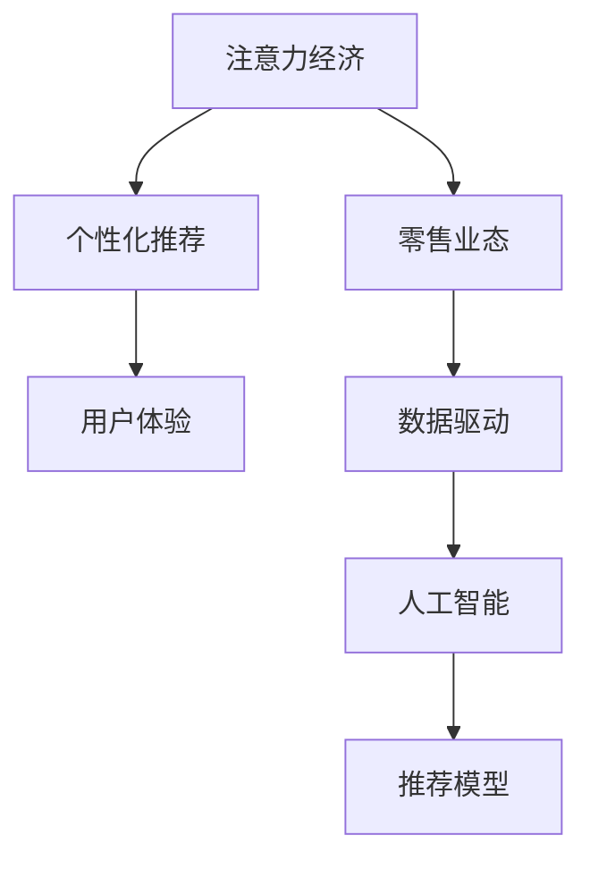

                 

# 注意力经济对传统零售业态的改造

> 关键词：注意力经济, 零售业态, 个性化推荐, 用户体验, 数据驱动, 人工智能

## 1. 背景介绍

### 1.1 问题由来
随着信息技术的飞速发展，传统零售业态正经历着前所未有的变革。从线下实体店铺的数字化转型，到线上电商平台的竞争加剧，再到社交媒体对消费行为的影响，零售行业的每一个环节都在被重塑。在这其中，注意力经济（Attention Economy）的概念逐渐受到广泛关注。

注意力经济是指在信息过载的现代社会，消费者对信息的获取和处理更加依赖于注意力资源的分配。在零售业态中，如何有效吸引和利用消费者的注意力，成为了提升销售业绩和增强用户粘性的关键。

### 1.2 问题核心关键点
注意力经济对传统零售业态的改造，关键在于通过数据驱动和人工智能技术，精准捕捉和引导消费者的注意力，实现个性化推荐和服务，从而提高销售转化率和用户满意度。

具体而言，注意力经济改造涉及以下几个核心关键点：
- 数据采集与处理：收集消费者的行为数据、偏好数据、社交媒体互动数据等，为个性化推荐提供数据基础。
- 模型构建与优化：使用机器学习算法构建推荐模型，根据用户行为预测其需求，并实时调整推荐策略。
- 用户体验优化：通过智能化的交互设计和多渠道触达，提升消费者的购物体验，增加其购买意愿。
- 广告与营销优化：利用注意力经济原理优化广告投放和营销策略，最大化消费者的广告曝光和互动效果。

## 2. 核心概念与联系

### 2.1 核心概念概述

为更好地理解注意力经济对零售业态的改造，本节将介绍几个密切相关的核心概念：

- 注意力经济（Attention Economy）：指在信息爆炸的时代，消费者对信息的选择和处理受到注意力的限制。零售商需通过个性化推荐等手段，引导消费者注意力，提升销售效果。

- 零售业态（Retail Channel）：包括线下实体店铺、线上电商平台、社交媒体等多元化的销售渠道。注意力经济改造关注如何在不同渠道上吸引和利用消费者注意力。

- 个性化推荐（Personalized Recommendation）：基于用户行为数据和偏好模型，为其提供定制化的产品或服务推荐，提高用户体验和满意度。

- 用户体验（User Experience, UX）：包括用户在使用产品或服务过程中的感知和情感体验，是提升用户忠诚度和重复购买率的重要因素。

- 数据驱动（Data-Driven）：利用数据和算法进行决策和优化，降低人为干预，提高决策效率和效果。

- 人工智能（Artificial Intelligence, AI）：通过机器学习、深度学习等技术，构建推荐模型和智能系统，实现自动化和智能化决策。

这些核心概念之间的逻辑关系可以通过以下Mermaid流程图来展示：



这个流程图展示出注意力经济、零售业态、个性化推荐、用户体验、数据驱动和人工智能之间的紧密联系：注意力经济关注如何引导消费者注意力，而零售业态提供了实施场景；个性化推荐和用户体验是其核心手段，而数据驱动和人工智能提供了技术支持。

## 3. 核心算法原理 & 具体操作步骤
### 3.1 算法原理概述

注意力经济对传统零售业态的改造，本质上是利用数据和人工智能技术，构建个性化推荐系统，以数据驱动的方式优化零售商的销售策略和用户体验。

具体而言，注意力经济改造的过程如下：
1. 通过数据收集和处理，构建用户行为和偏好模型。
2. 利用机器学习算法，对用户行为进行预测，生成推荐列表。
3. 根据推荐结果，调整零售商的广告投放和营销策略，吸引用户注意力。
4. 通过多渠道触达，提供个性化购物体验，提升用户满意度和转化率。

### 3.2 算法步骤详解

以下是注意力经济改造传统零售业态的具体操作步骤：

**Step 1: 数据收集与处理**
- 收集用户行为数据，如浏览历史、购买记录、评价反馈等。
- 整合社交媒体互动数据，如点赞、评论、分享等。
- 进行数据清洗和预处理，去除噪声和异常值。
- 使用数据挖掘技术，构建用户画像和行为模式。

**Step 2: 模型构建与优化**
- 选择合适的推荐算法，如协同过滤、内容过滤、混合推荐等。
- 设计推荐模型，包括特征工程、模型训练和评估指标。
- 应用优化算法，调整模型参数，提高预测准确性。
- 定期更新模型，跟踪用户行为变化，确保推荐内容的时效性。

**Step 3: 广告与营销优化**
- 利用用户画像和行为数据，定向投放广告。
- 设计吸引眼球的广告素材，提高点击率。
- 应用A/B测试，对比不同广告策略的效果。
- 优化广告投放渠道和时间，提升广告曝光和互动效果。

**Step 4: 用户体验优化**
- 设计直观友好的界面，提供个性化商品展示。
- 应用智能客服和聊天机器人，解答用户疑问。
- 提供多渠道触达，如手机APP、社交媒体、在线客服等。
- 应用优惠券和促销活动，提高用户购买意愿。

**Step 5: 效果评估与迭代**
- 设置评估指标，如转化率、复购率、用户满意度等。
- 定期评估推荐系统的效果，收集用户反馈。
- 根据评估结果，调整推荐策略和广告投放策略。
- 持续迭代，优化推荐模型和用户体验。

### 3.3 算法优缺点

注意力经济改造零售业态具有以下优点：
1. 提升销售业绩：通过精准推荐和定向广告，提高用户转化率和购买意愿。
2. 增强用户体验：个性化推荐和智能客服提升了用户满意度和购物体验。
3. 提高运营效率：数据驱动的决策减少了人为干预，提高了运营效率。
4. 降低营销成本：精准的广告投放和高效的推荐算法降低了营销成本。

同时，该方法也存在一些局限性：
1. 数据隐私问题：大规模数据收集可能涉及用户隐私，需严格遵守数据保护法规。
2. 推荐多样性不足：过度依赖算法推荐，可能导致商品多样性减少。
3. 模型偏见问题：推荐算法可能存在偏见，影响推荐的公正性。
4. 技术门槛高：构建和优化推荐系统需要一定的技术基础和资源投入。

尽管存在这些局限性，但就目前而言，注意力经济改造范式仍是零售业态中最为先进和有效的解决方案。未来相关研究应进一步降低技术门槛，提高推荐多样性和公平性，同时兼顾数据隐私保护。

### 3.4 算法应用领域

注意力经济改造技术已在零售业态的多个领域得到应用，例如：

- 电商平台的个性化推荐：根据用户浏览和购买历史，生成个性化推荐商品，提升用户购物体验。
- 智能客服系统：通过自然语言处理技术，提供7x24小时在线客服，解答用户疑问，提升服务质量。
- 广告投放优化：利用用户画像和行为数据，定向投放广告，提高广告点击率和转化率。
- 营销策略优化：基于用户行为数据，设计个性化的营销活动，提升用户参与度和品牌忠诚度。
- 库存管理优化：通过预测用户需求，优化库存结构，减少库存积压和缺货现象。

除了上述这些经典应用外，注意力经济改造技术也被创新性地应用到更多场景中，如社交媒体电商、内容订阅、智能仓储等，为零售业态带来了全新的突破。随着数据驱动和人工智能技术的不断发展，相信注意力经济改造将引领零售业态迈向更加智能化和个性化的未来。

## 4. 数学模型和公式 & 详细讲解  
### 4.1 数学模型构建

本节将使用数学语言对注意力经济改造过程进行更加严格的刻画。

记用户行为数据为 $D=\{x_i\}_{i=1}^N$，其中 $x_i$ 表示用户 $i$ 在某一时间点 $t$ 的行为特征向量。记推荐模型为 $M_\theta:\mathcal{X} \rightarrow \mathcal{Y}$，其中 $\mathcal{X}$ 为用户行为特征空间，$\mathcal{Y}$ 为推荐内容空间，$\theta$ 为模型参数。

定义推荐模型的预测函数为 $M_{\theta}(x_i)$，其中 $M_{\theta}(x_i)$ 表示用户 $i$ 在行为特征 $x_i$ 下的推荐内容。推荐模型的损失函数为：

$$
\mathcal{L}(\theta) = \sum_{i=1}^N \ell(M_{\theta}(x_i),y_i)
$$

其中 $\ell$ 为损失函数，$y_i$ 为用户的真实推荐内容。常见的损失函数包括均方误差、交叉熵损失等。

### 4.2 公式推导过程

以下我们以协同过滤推荐算法为例，推导损失函数及其梯度的计算公式。

假设用户行为数据 $D=\{x_i\}_{i=1}^N$ 中的每一条记录 $x_i$ 包含 $d$ 个特征 $x_i^j (j=1,\dots,d)$，推荐内容 $Y=\{y_i\}_{i=1}^N$ 中的每一条记录 $y_i$ 包含 $m$ 个推荐项 $y_i^k (k=1,\dots,m)$。协同过滤算法通过计算用户间的相似度和物品间的相似度，为用户生成推荐列表。设 $\tilde{y}_i$ 为 $x_i$ 的推荐列表，则协同过滤算法的损失函数为：

$$
\mathcal{L}(\theta) = \sum_{i=1}^N \sum_{j=1}^d \sum_{k=1}^m |M_{\theta}(x_i^j) - y_i^k|^2
$$

其中 $M_{\theta}(x_i^j)$ 表示用户 $i$ 在特征 $x_i^j$ 下的推荐分数。

根据链式法则，损失函数对参数 $\theta$ 的梯度为：

$$
\frac{\partial \mathcal{L}(\theta)}{\partial \theta} = \sum_{i=1}^N \sum_{j=1}^d \sum_{k=1}^m \frac{\partial M_{\theta}(x_i^j)}{\partial \theta} \cdot (M_{\theta}(x_i^j) - y_i^k)
$$

其中 $\frac{\partial M_{\theta}(x_i^j)}{\partial \theta}$ 为预测函数对参数 $\theta$ 的梯度，可通过反向传播算法高效计算。

在得到损失函数的梯度后，即可带入优化算法，更新模型参数 $\theta$，最小化损失函数 $\mathcal{L}(\theta)$。重复上述过程直至收敛，最终得到适应用户行为特征的推荐模型参数 $\theta^*$。

## 5. 项目实践：代码实例和详细解释说明
### 5.1 开发环境搭建

在进行注意力经济改造实践前，我们需要准备好开发环境。以下是使用Python进行PyTorch开发的环境配置流程：

1. 安装Anaconda：从官网下载并安装Anaconda，用于创建独立的Python环境。

2. 创建并激活虚拟环境：
```bash
conda create -n pytorch-env python=3.8 
conda activate pytorch-env
```

3. 安装PyTorch：根据CUDA版本，从官网获取对应的安装命令。例如：
```bash
conda install pytorch torchvision torchaudio cudatoolkit=11.1 -c pytorch -c conda-forge
```

4. 安装各类工具包：
```bash
pip install numpy pandas scikit-learn matplotlib tqdm jupyter notebook ipython
```

完成上述步骤后，即可在`pytorch-env`环境中开始注意力经济改造实践。

### 5.2 源代码详细实现

这里我们以电商平台个性化推荐为例，给出使用PyTorch构建和优化推荐模型的PyTorch代码实现。

首先，定义推荐模型的预测函数：

```python
from torch import nn
import torch.nn.functional as F

class RecommendationModel(nn.Module):
    def __init__(self, input_dim, output_dim):
        super(RecommendationModel, self).__init__()
        self.fc1 = nn.Linear(input_dim, 64)
        self.fc2 = nn.Linear(64, output_dim)

    def forward(self, x):
        x = F.relu(self.fc1(x))
        x = self.fc2(x)
        return x
```

然后，定义推荐模型的损失函数和优化器：

```python
from torch import optim

loss_fn = nn.MSELoss()
optimizer = optim.Adam(model.parameters(), lr=0.01)
```

接着，定义训练和评估函数：

```python
def train_epoch(model, data_loader, optimizer):
    model.train()
    for batch in data_loader:
        inputs, labels = batch
        optimizer.zero_grad()
        outputs = model(inputs)
        loss = loss_fn(outputs, labels)
        loss.backward()
        optimizer.step()

def evaluate(model, data_loader):
    model.eval()
    total_loss = 0
    total_correct = 0
    with torch.no_grad():
        for batch in data_loader:
            inputs, labels = batch
            outputs = model(inputs)
            loss = loss_fn(outputs, labels)
            total_loss += loss.item()
            total_correct += (torch.argmax(outputs, dim=1) == labels).sum().item()
    return total_loss / len(data_loader), total_correct / len(data_loader)
```

最后，启动训练流程并在测试集上评估：

```python
epochs = 10
batch_size = 32

for epoch in range(epochs):
    train_loss, train_acc = train_epoch(model, train_loader, optimizer)
    print(f"Epoch {epoch+1}, train loss: {train_loss:.4f}, train acc: {train_acc:.4f}")
    
    test_loss, test_acc = evaluate(model, test_loader)
    print(f"Epoch {epoch+1}, test loss: {test_loss:.4f}, test acc: {test_acc:.4f}")
```

以上就是使用PyTorch构建和优化电商平台个性化推荐模型的完整代码实现。可以看到，得益于PyTorch的强大框架和丰富的API，构建推荐模型变得非常简单高效。

### 5.3 代码解读与分析

让我们再详细解读一下关键代码的实现细节：

**RecommendationModel类**：
- `__init__`方法：定义模型结构，包括两个全连接层，并初始化参数。
- `forward`方法：实现前向传播，计算模型预测输出。

**loss_fn和optimizer**：
- `loss_fn`为均方误差损失函数，用于计算预测输出和真实标签之间的差异。
- `optimizer`为Adam优化器，用于更新模型参数。

**train_epoch和evaluate函数**：
- `train_epoch`函数：在每个epoch内，对训练集进行迭代，前向传播计算损失，反向传播更新模型参数。
- `evaluate`函数：在测试集上评估模型性能，计算平均损失和准确率。

**训练流程**：
- 定义总的epoch数和batch size，开始循环迭代
- 每个epoch内，先在训练集上训练，输出训练集上的平均损失和准确率
- 在测试集上评估，输出测试集上的平均损失和准确率
- 所有epoch结束后，停止训练

可以看到，PyTorch提供了便捷的API和灵活的框架，使得构建和优化推荐模型变得非常简单。开发者可以将更多精力放在数据处理、模型改进等高层逻辑上，而不必过多关注底层的实现细节。

## 6. 实际应用场景
### 6.1 智能客服系统

基于注意力经济的智能客服系统可以大幅提升客户咨询体验和问题解决效率。通过分析客户的聊天记录和反馈信息，智能客服系统能够准确把握客户需求，提供精准的解决方案。

具体实现时，可以构建基于深度学习的对话生成模型，如seq2seq、Transformer等，通过微调优化模型参数。在客户提出问题时，智能客服系统能够即时回复，并根据用户反馈进行智能学习，逐步提升服务质量。

### 6.2 金融舆情监测

在金融领域，注意力经济有助于及时监测市场舆情变化，预防金融风险。通过分析新闻、评论等社交媒体内容，智能舆情监测系统能够实时识别出舆情变化趋势，并发出预警。

具体实现时，可以构建基于情感分析的舆情监测模型，通过微调优化模型参数。在分析文本情感时，智能监测系统能够准确把握舆情情绪，提供及时的风险预警和应对策略。

### 6.3 个性化推荐系统

个性化推荐系统是注意力经济的重要应用场景。通过分析用户行为数据和偏好信息，推荐系统能够为用户提供精准的商品或服务推荐，提升用户体验和满意度。

具体实现时，可以构建基于协同过滤、内容过滤等推荐算法的推荐模型，通过微调优化模型参数。在推荐商品时，智能推荐系统能够根据用户历史行为和当前需求，生成个性化的推荐列表，提升用户购买意愿和满意度。

### 6.4 未来应用展望

随着注意力经济和人工智能技术的不断发展，未来的零售业态将呈现以下几个趋势：

1. 零售业态的多元化融合：线上线下融合、社交电商、无人店铺等新型零售业态将逐渐普及，进一步丰富用户体验。

2. 智能客服的普及化：基于自然语言处理和深度学习的智能客服系统将大规模应用，提升客户服务质量和效率。

3. 个性化推荐的深化：通过更多维度的数据采集和更高级的算法设计，推荐系统将更加精准、多样，提升用户满意度。

4. 数据驱动的全面化：从用户行为数据、社交媒体数据到外部知识库、专家规则，数据驱动将成为零售业态的核心驱动力。

5. 实时化的互动体验：通过AR、VR等技术，零售商将提供更加沉浸式的互动体验，增强用户粘性。

总之，注意力经济改造将引领零售业态迈向更加智能化、个性化的未来，推动零售行业实现数字化转型和升级。

## 7. 工具和资源推荐
### 7.1 学习资源推荐

为了帮助开发者系统掌握注意力经济改造的理论基础和实践技巧，这里推荐一些优质的学习资源：

1. 《深度学习与人工智能》课程：斯坦福大学开设的机器学习经典课程，涵盖深度学习基础知识和算法实现，适合初学者入门。

2. 《推荐系统实践》书籍：详细介绍了推荐系统的原理、算法和工程实践，是推荐系统开发的必备参考书。

3. 《人工智能导论》书籍：讲解了人工智能的基础理论和技术应用，包括机器学习、深度学习、自然语言处理等，适合全面了解AI技术。

4. 《注意力机制》论文：深度解析了注意力机制的原理和应用，是理解注意力经济改造的关键论文。

5. Kaggle竞赛平台：提供大量真实场景下的推荐系统比赛数据，适合实践和检验模型效果。

通过对这些资源的学习实践，相信你一定能够快速掌握注意力经济改造的精髓，并用于解决实际的零售问题。
### 7.2 开发工具推荐

高效的开发离不开优秀的工具支持。以下是几款用于注意力经济改造开发的常用工具：

1. PyTorch：基于Python的开源深度学习框架，灵活动态，适合模型研究和优化。

2. TensorFlow：由Google主导开发的深度学习框架，生产部署方便，适合大规模工程应用。

3. Pandas：数据处理和分析工具，支持高效的数据清洗和预处理。

4. Scikit-learn：机器学习库，提供丰富的算法和模型评估工具，适合构建推荐系统和数据分析。

5. Jupyter Notebook：交互式编程环境，支持代码编写、数据可视化、结果展示等，适合快速原型设计和实验验证。

合理利用这些工具，可以显著提升注意力经济改造任务的开发效率，加快创新迭代的步伐。

### 7.3 相关论文推荐

注意力经济改造技术的发展源于学界的持续研究。以下是几篇奠基性的相关论文，推荐阅读：

1. Recommender Systems Handbook：详细介绍推荐系统理论、算法和工程实践，涵盖协同过滤、内容过滤、混合推荐等多种推荐技术。

2. Attention is All You Need（即Transformer原论文）：提出Transformer结构，通过自注意力机制提升了模型对上下文信息的建模能力。

3. Deep Collaborative Filtering for Large-Scale Recommender Systems：提出基于深度学习的协同过滤推荐算法，通过微调优化模型性能。

4. Sequence-to-Sequence Learning with Neural Networks：提出seq2seq模型，通过微调优化语言模型，实现对话生成等自然语言处理任务。

5. Attention and Memory in Deep Learning：解析注意力机制的原理和应用，探讨其在推荐系统和对话系统中的应用效果。

这些论文代表了大语言模型微调技术的发展脉络。通过学习这些前沿成果，可以帮助研究者把握学科前进方向，激发更多的创新灵感。

## 8. 总结：未来发展趋势与挑战

### 8.1 总结

本文对注意力经济改造传统零售业态的方法进行了全面系统的介绍。首先阐述了注意力经济在零售业态中的重要意义，明确了其对提升销售业绩和用户满意度的关键作用。其次，从原理到实践，详细讲解了注意力经济改造的理论基础和具体步骤，给出了详细的代码实现。同时，本文还广泛探讨了注意力经济改造在多个行业领域的应用前景，展示了其广阔的应用潜力。此外，本文精选了注意力经济改造技术的各类学习资源，力求为读者提供全方位的技术指引。

通过本文的系统梳理，可以看到，注意力经济改造技术正在成为零售业态的重要范式，极大地拓展了零售商的销售边界，提升了用户体验和运营效率。未来，伴随注意力经济和人工智能技术的不断发展，基于数据驱动的零售业态必将在更加智能化、个性化的道路上大步向前，为消费者带来全新的购物体验。

### 8.2 未来发展趋势

展望未来，注意力经济改造技术将呈现以下几个发展趋势：

1. 数据驱动的全面化。随着数据采集和处理技术的进步，数据驱动的零售业态将更加全面，从用户行为数据、社交媒体数据到外部知识库、专家规则，数据驱动将成为核心驱动力。

2. 个性化推荐的深化。通过更多维度的数据采集和更高级的算法设计，推荐系统将更加精准、多样，提升用户满意度和购买意愿。

3. 智能客服的普及化。基于自然语言处理和深度学习的智能客服系统将大规模应用，提升客户服务质量和效率。

4. 实时化的互动体验。通过AR、VR等技术，零售商将提供更加沉浸式的互动体验，增强用户粘性。

5. 跨界融合的趋势。注意力经济改造技术将与其他AI技术进行更深入的融合，如知识表示、因果推理、强化学习等，共同推动零售业态的全面升级。

以上趋势凸显了注意力经济改造技术的广阔前景。这些方向的探索发展，必将进一步提升零售业态的智能化水平，为消费者带来更加丰富、便捷的购物体验。

### 8.3 面临的挑战

尽管注意力经济改造技术已经取得了显著成效，但在迈向更加智能化、普适化应用的过程中，它仍面临诸多挑战：

1. 数据隐私问题。大规模数据收集可能涉及用户隐私，需严格遵守数据保护法规，防止数据泄露和滥用。

2. 推荐多样性不足。过度依赖算法推荐，可能导致商品多样性减少，影响用户体验。

3. 模型偏见问题。推荐算法可能存在偏见，影响推荐的公正性，需进行公平性评估和优化。

4. 技术门槛高。构建和优化推荐系统需要一定的技术基础和资源投入，需降低技术门槛，提升模型易用性。

5. 用户体验的不一致性。跨渠道的用户体验需保持一致，需设计统一的用户界面和交互体验。

6. 系统的扩展性和稳定性。随着业务规模的扩大，系统需具备高扩展性和稳定性，需优化系统架构，确保系统可靠性。

正视这些挑战，积极应对并寻求突破，将是大语言模型微调走向成熟的必由之路。相信随着学界和产业界的共同努力，这些挑战终将一一被克服，注意力经济改造必将在构建人机协同的智能时代中扮演越来越重要的角色。

### 8.4 研究展望

面向未来，以下研究方向值得进一步探索：

1. 探索更多元化的数据来源。除了用户行为数据，还需利用外部知识库、社交媒体数据等，提升推荐系统的全面性和多样性。

2. 融合更多AI技术。结合知识表示、因果推理、强化学习等技术，提升推荐系统的逻辑性和稳定性。

3. 提升模型的公平性和公正性。通过算法优化和规则约束，消除推荐算法的偏见，确保推荐系统的公平性。

4. 优化推荐策略和广告投放。通过更多维度的数据挖掘和智能算法，优化推荐策略和广告投放，提升用户体验和营销效果。

5. 增强系统的可解释性和可控性。通过可解释性模型和可控性机制，提升推荐系统的透明度和用户信任度。

这些研究方向的探索，必将引领注意力经济改造技术迈向更高的台阶，为构建安全、可靠、可解释、可控的智能系统铺平道路。面向未来，大语言模型微调技术还需要与其他AI技术进行更深入的融合，多路径协同发力，共同推动自然语言理解和智能交互系统的进步。只有勇于创新、敢于突破，才能不断拓展语言模型的边界，让智能技术更好地造福人类社会。

## 9. 附录：常见问题与解答

**Q1：注意力经济改造是否适用于所有零售业态？**

A: 注意力经济改造在大多数零售业态中都能取得不错的效果，特别是对于线上电商和社交电商等新兴业态。但对于一些传统的线下零售业态，如实体店铺，需结合店铺的实际情况，灵活调整改造策略。

**Q2：如何优化推荐系统的多样性？**

A: 为了提升推荐系统的多样性，可以采取以下策略：
1. 引入多样性约束：在推荐模型中加入多样性约束，避免推荐结果过于集中。
2. 增加商品多样性：通过丰富商品种类和描述，提升推荐系统的多样性。
3. 设计多维推荐算法：结合协同过滤、内容过滤等多种推荐算法，提升推荐系统的多样性。

**Q3：如何在跨渠道间保持一致的用户体验？**

A: 为了保持跨渠道一致的用户体验，可以采取以下措施：
1. 设计统一的UI/UX界面：确保不同渠道的用户界面和交互体验一致。
2. 数据同步与共享：确保用户在不同渠道上的数据同步和共享，避免信息孤岛。
3. 统一的推荐策略：确保不同渠道上的推荐策略一致，提升用户体验。

**Q4：如何处理推荐系统中的偏见问题？**

A: 为了处理推荐系统中的偏见问题，可以采取以下策略：
1. 数据公平性评估：评估推荐系统的公平性，识别出可能的偏见来源。
2. 算法优化：优化推荐算法，减少算法本身的偏见。
3. 规则约束：引入专家规则，限制推荐结果的偏见。

**Q5：如何提升推荐系统的可解释性？**

A: 为了提升推荐系统的可解释性，可以采取以下策略：
1. 引入可解释性模型：使用可解释性模型，如决策树、线性模型等，提升模型的可解释性。
2. 多维度数据融合：结合外部知识库、社交媒体数据等多维数据，提升推荐系统的透明度。
3. 用户反馈机制：引入用户反馈机制，及时调整推荐策略，提升用户信任度。

这些策略将帮助零售商在实施注意力经济改造时，避免潜在问题，提升系统的可靠性和用户满意度。

---

作者：禅与计算机程序设计艺术 / Zen and the Art of Computer Programming

