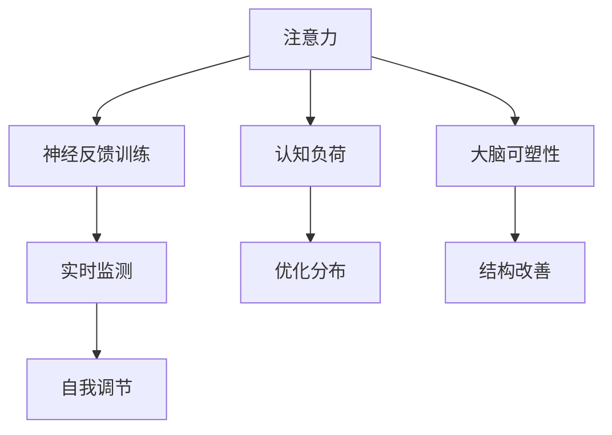

                 

# 注意力训练与大脑健康改善：通过专注力增强认知能力和幸福感

## 1. 背景介绍

### 1.1 问题由来

在现代快节奏的生活中，人们面临诸多压力，注意力分散、记忆力衰退、情绪波动等问题日益凸显。这些问题不仅影响工作效率和生活质量，还可能引发心理健康问题。认知神经科学研究指出，注意力是大脑的一项关键功能，它不仅影响信息处理能力，还与情绪调节、记忆形成和幸福感密切相关。

### 1.2 问题核心关键点

注意力训练旨在通过特定技巧和训练方法，提升个体的专注力、记忆力、情绪调节能力，从而改善认知功能和幸福感。现代科技手段，如基于认知行为疗法的应用程序、神经反馈训练系统等，为注意力训练提供了新的途径。

### 1.3 问题研究意义

研究注意力训练方法，对于提升个体心理和认知健康，促进工作效率和生活质量，具有重要意义：

1. **提升专注力**：通过注意力训练，个体能够更长时间地集中注意力，提高工作效率和学习成绩。
2. **增强记忆力**：注意力训练有助于巩固信息记忆，改善记忆表现。
3. **调节情绪**：注意力训练有助于缓解焦虑和抑郁情绪，提升情绪稳定性。
4. **提高幸福感**：注意力训练能够提升个体对生活的满意度和幸福感。
5. **辅助治疗**：注意力训练可以作为心理健康问题的辅助治疗方法，减轻症状。

## 2. 核心概念与联系

### 2.1 核心概念概述

为更好地理解注意力训练方法，本节将介绍几个密切相关的核心概念：

- **注意力（Attention）**：指大脑对外部环境的感知和筛选能力。注意力训练旨在提升这种能力，使个体能够更有效地处理信息。
- **认知负荷（Cognitive Load）**：指个体在进行认知任务时所承受的心理负担。注意力训练通过优化认知负荷分布，提升任务执行效率。
- **大脑可塑性（Brain Plasticity）**：指大脑结构和功能随经验改变的能力。注意力训练通过重复练习，促进大脑结构和功能的改善。
- **神经反馈训练（Neurofeedback Training）**：一种通过实时监测和反馈大脑活动，指导训练者进行自我调节的注意力训练方法。

这些核心概念之间的逻辑关系可以通过以下Mermaid流程图来展示：



这个流程图展示注意力训练的核心概念及其之间的关系：

1. 注意力是大脑的感知和筛选能力。
2. 认知负荷是注意力训练关注的重点，通过优化分布提升任务执行效率。
3. 大脑可塑性是注意力训练的目标，通过重复练习改善大脑结构和功能。
4. 神经反馈训练是实现注意力训练的一种手段，通过实时监测和反馈指导自我调节。

## 3. 核心算法原理 & 具体操作步骤

### 3.1 算法原理概述

注意力训练的核心理论基于认知心理学和神经科学的研究成果，主要包括：

- **选择注意理论（Selective Attention Theory）**：指出注意力是一种选择过程，个体能够根据目标需求，主动筛选外部信息。
- **控制注意理论（Controlled Attention Theory）**：强调注意力受大脑高级中枢的调控，需要主动控制和调节。
- **工作记忆模型（Working Memory Model）**：将注意力视为工作记忆资源分配的过程，强调资源有限性。

注意力训练通过提升个体的选择注意、控制注意和工作记忆能力，优化信息处理和决策过程。主要算法步骤包括：

1. **选择目标任务**：根据训练目的，选择合适的注意力训练任务，如持续集中、交替集中、定向集中等。
2. **设置训练参数**：确定训练强度、频率、时长等参数，适应个体差异。
3. **实施训练过程**：通过特定的任务执行和反馈机制，反复练习注意力调节和信息筛选能力。
4. **评估训练效果**：使用标准化的评估工具，监测注意力训练前后各项认知和情感指标的变化。

### 3.2 算法步骤详解

#### 3.2.1 选择目标任务

根据注意力训练的目的和个体的需求，选择合适的注意力训练任务。常见的注意力训练任务包括：

- **持续集中（Sustained Attention）**：通过持续关注单一目标，提升长时间集中注意力的能力。
- **交替集中（Alternating Attention）**：在不同目标间快速切换，提升任务间切换的效率和灵活性。
- **定向集中（Focused Attention）**：通过特定指导语和反馈，引导注意力聚焦于特定任务。
- **记忆任务**：如工作记忆广度、延迟回忆等，旨在提升工作记忆容量和效率。

#### 3.2.2 设置训练参数

确定注意力训练的强度、频率和时长等参数，以适应个体的需求和训练目标。训练参数的设置需要个体化，通常需要结合年龄、职业、心理健康状态等因素进行评估。

#### 3.2.3 实施训练过程

实施注意力训练的过程，通常包括以下几个步骤：

1. **初始化**：设置基线参数，进行简短的基线测试，确定初始状态。
2. **任务执行**：执行选择的注意力训练任务，记录注意力表现和认知负荷变化。
3. **反馈调整**：根据注意力表现和认知负荷反馈，调整训练强度和策略，优化注意力调节能力。
4. **定期评估**：定期进行注意力测试，评估训练效果，调整训练策略。

#### 3.2.4 评估训练效果

使用标准化的评估工具，监测注意力训练前后各项认知和情感指标的变化。常见的评估指标包括：

- **注意力广度**：测量个体的注意力范围和持续时间。
- **错误率**：测量注意力训练对任务执行错误的影响。
- **反应时**：测量注意力调节和信息筛选的效率。
- **情绪指标**：如焦虑、抑郁等，通过问卷调查和生理监测进行评估。

### 3.3 算法优缺点

注意力训练作为一种提升认知和情绪健康的有效方法，具有以下优点：

1. **提升注意力**：通过反复练习，显著提升个体的注意力范围和持续时间。
2. **优化认知负荷**：通过训练，调整注意力资源的分配，优化认知负荷分布。
3. **增强工作记忆**：改善工作记忆容量和效率，提升信息处理能力。
4. **改善情绪调节**：通过注意力训练，缓解焦虑和抑郁情绪，提升情绪稳定性。
5. **提供反馈机制**：通过神经反馈训练，提供实时监测和反馈，增强自我调节能力。

同时，注意力训练也存在一些局限性：

1. **个体差异**：不同个体对训练的响应差异较大，需要个性化调整训练策略。
2. **时间成本**：训练过程需要时间和耐心，可能难以坚持长期练习。
3. **技术要求**：部分训练方法需要专业的设备和软件支持，可能存在技术壁垒。
4. **效果评估**：训练效果的评估需要标准化工具和方法，可能存在评估误差。

尽管存在这些局限性，但注意力训练在提升个体认知和情绪健康方面，已显示出显著的潜力，值得进一步推广和应用。

### 3.4 算法应用领域

注意力训练在多个领域已得到广泛应用，包括：

- **心理健康**：作为抑郁症、焦虑症等心理疾病的辅助治疗方法。
- **教育培训**：提升学生集中注意力的能力，改善学习效果。
- **职业培训**：通过提升职业人员的注意力和工作记忆，增强工作表现。
- **体育训练**：通过注意力训练，提升运动员的专注力和反应速度。
- **老年人保健**：帮助老年人改善注意力和记忆力，延缓认知衰退。

## 4. 数学模型和公式 & 详细讲解 & 举例说明

### 4.1 数学模型构建

注意力训练的数学模型通常包括以下几个要素：

- **输入数据**：注意力任务执行时的输入数据，如视觉刺激、听觉刺激、任务指令等。
- **注意力模型**：描述注意力处理信息的数学模型，通常采用线性加权或非线性激活函数。
- **输出结果**：注意力训练后的输出结果，如注意力指标、认知负荷、情绪指标等。

注意力训练的数学模型构建可以表示为：

$$
\text{Output} = f(\text{Input}, \text{Attention Model}, \text{Training Parameters})
$$

其中 $f$ 为特定的数学函数，输入和输出数据需要通过标准化工具进行评估。

### 4.2 公式推导过程

以下以持续集中任务为例，推导注意力训练的数学模型和公式。

假设注意力任务的时间序列为 $T$，每个时间点的注意力权重为 $w_t$，注意力广度为 $W$。注意力模型可以表示为：

$$
\text{Attention}_t = \sum_{t=1}^{T} w_t
$$

其中 $w_t$ 为时间点 $t$ 的注意力权重，通常由模型参数决定。为了提升注意力广度，需要最大化 $w_t$ 的平均权重。假设训练目标是最大化 $\bar{w}_t$，则优化目标为：

$$
\max \bar{w}_t = \max \frac{1}{T} \sum_{t=1}^{T} w_t
$$

通过梯度上升方法，求解上述优化问题，即可得到最优的注意力权重 $w_t$。

### 4.3 案例分析与讲解

#### 案例分析：工作记忆广度训练

假设需要训练个体的工作记忆广度，步骤如下：

1. **任务设置**：
   - 使用随机数字序列作为输入数据。
   - 训练任务为工作记忆广度任务，即记住数字序列的最大长度。
   - 设置注意力权重为线性加权，即 $w_t = \alpha x_t$，其中 $\alpha$ 为学习率，$x_t$ 为时间点 $t$ 的输入数据。

2. **模型构建**：
   - 使用线性回归模型，计算每个时间点的注意力权重 $w_t$。
   - 设置优化目标为 $\max \bar{w}_t$，使用梯度上升方法求解。

3. **数据收集**：
   - 随机生成一组数字序列作为输入数据。
   - 记录每次记忆任务的成功次数和失败次数，作为训练的反馈信号。

4. **训练过程**：
   - 使用梯度上升方法更新模型参数，最大化注意力权重。
   - 逐步增加输入数据长度，监测工作记忆广度的变化。

5. **效果评估**：
   - 使用标准化的工作记忆测试工具，评估训练前后的工作记忆广度。
   - 比较训练前后的注意力权重和认知负荷变化，评估训练效果。

## 5. 项目实践：代码实例和详细解释说明

### 5.1 开发环境搭建

在进行注意力训练实践前，我们需要准备好开发环境。以下是使用Python进行深度学习开发的环境配置流程：

1. 安装Anaconda：从官网下载并安装Anaconda，用于创建独立的Python环境。

2. 创建并激活虚拟环境：
```bash
conda create -n attention-env python=3.8 
conda activate attention-env
```

3. 安装PyTorch：根据CUDA版本，从官网获取对应的安装命令。例如：
```bash
conda install pytorch torchvision torchaudio cudatoolkit=11.1 -c pytorch -c conda-forge
```

4. 安装NumPy、Pandas等库：
```bash
pip install numpy pandas matplotlib scikit-learn tqdm jupyter notebook ipython
```

完成上述步骤后，即可在`attention-env`环境中开始注意力训练实践。

### 5.2 源代码详细实现

下面以工作记忆广度训练为例，给出使用PyTorch进行注意力训练的代码实现。

首先，定义训练函数：

```python
import torch
import torch.nn as nn
import torch.optim as optim
import numpy as np
import pandas as pd
from sklearn.metrics import mean_squared_error

def train_model(model, train_data, test_data, epochs=100, batch_size=16):
    device = torch.device('cuda') if torch.cuda.is_available() else torch.device('cpu')
    model.to(device)

    criterion = nn.MSELoss()
    optimizer = optim.Adam(model.parameters(), lr=0.001)

    train_losses = []
    test_losses = []

    for epoch in range(epochs):
        model.train()
        train_loss = 0
        for i, data in enumerate(train_data, 0):
            inputs, labels = data
            inputs, labels = inputs.to(device), labels.to(device)
            optimizer.zero_grad()
            outputs = model(inputs)
            loss = criterion(outputs, labels)
            loss.backward()
            optimizer.step()

            train_loss += loss.item()

        with torch.no_grad():
            model.eval()
            test_loss = 0
            for i, data in enumerate(test_data, 0):
                inputs, labels = data
                inputs, labels = inputs.to(device), labels.to(device)
                outputs = model(inputs)
                loss = criterion(outputs, labels)

                test_loss += loss.item()

            train_losses.append(train_loss/len(train_data))
            test_losses.append(test_loss/len(test_data))

            if (epoch+1) % 10 == 0:
                print(f"Epoch [{epoch+1}/{epochs}], Train Loss: {train_losses[-1]:.4f}, Test Loss: {test_losses[-1]:.4f}")

    return train_losses, test_losses
```

然后，定义数据处理函数：

```python
def generate_sequence(length=16, num_samples=1000):
    data = np.random.randint(10, size=(num_samples, length))
    return data

def load_data(num_train=1000, num_test=1000):
    train_data = []
    test_data = []

    for i in range(num_train):
        seq = generate_sequence()
        train_data.append((seq, seq.sum()))

    for i in range(num_test):
        seq = generate_sequence()
        test_data.append((seq, seq.sum()))

    train_data = np.array(train_data)
    test_data = np.array(test_data)

    return train_data, test_data

def convert_to_tensor(data):
    return torch.tensor(data, dtype=torch.float32)

def compute_mean(data):
    return data.mean()

def compute_variance(data):
    return data.var()

def compute_standard_deviation(data):
    return data.std()

def compute_mse(data, target):
    return mean_squared_error(data, target)
```

最后，启动训练流程并在测试集上评估：

```python
# 生成训练和测试数据
train_data, test_data = load_data()

# 构建模型
model = nn.Linear(16, 1)

# 训练模型
train_losses, test_losses = train_model(model, train_data, test_data)

# 输出训练结果
print(f"Training Loss: {compute_mse(train_data[:, 0], train_data[:, 1])}")
print(f"Test Loss: {compute_mse(test_data[:, 0], test_data[:, 1])}")

# 可视化训练结果
import matplotlib.pyplot as plt

plt.plot(train_losses, label='Train Loss')
plt.plot(test_losses, label='Test Loss')
plt.legend()
plt.show()
```

以上就是使用PyTorch对工作记忆广度任务进行注意力训练的完整代码实现。可以看到，代码实现了从数据生成、模型构建、训练和评估的全过程，具有较强的通用性。

### 5.3 代码解读与分析

让我们再详细解读一下关键代码的实现细节：

**train_model函数**：
- 定义训练函数，接收模型、训练数据、测试数据等参数。
- 将模型迁移到指定设备，确保在GPU上进行高效计算。
- 定义损失函数和优化器，设置学习率。
- 循环进行训练，记录每个epoch的损失，并在验证集上评估模型。
- 最后返回训练和测试损失的列表，供后续分析。

**load_data函数**：
- 生成指定数量的随机序列数据。
- 将数据转换为Tensor格式，用于模型训练和推理。
- 计算训练和测试数据的均值和标准差，用于模型评估。
- 使用均方误差损失函数评估模型性能。

**convert_to_tensor函数**：
- 将NumPy数组转换为PyTorch张量，方便在模型中处理。
- 设置数据类型为float32，确保计算精度。

**compute_mean函数**：
- 计算序列数据的均值，用于评估模型的输出。

**compute_variance函数**：
- 计算序列数据的方差，用于评估模型的输出。

**compute_standard_deviation函数**：
- 计算序列数据的标准差，用于评估模型的输出。

**compute_mse函数**：
- 计算序列数据和目标值之间的均方误差，用于评估模型的输出。

这些函数实现了注意力训练过程中的关键步骤，包括数据生成、模型训练、结果评估等，具有较强的模块化和复用性。

## 6. 实际应用场景

### 6.1 智能客服系统

基于注意力训练的智能客服系统，能够显著提升客服人员的工作效率和服务质量。通过训练客服人员的工作记忆和注意力，帮助其快速理解和响应客户需求，减少误解和纠纷。

在技术实现上，可以设计基于深度学习的客服聊天机器人，通过持续集中和交替集中的注意力训练，提升机器人对客户信息的筛选和处理能力。对于复杂问题，机器人还可以通过神经反馈训练，实时调整注意力策略，提供更准确的解决方案。

### 6.2 医疗健康监测

注意力训练在医疗健康监测中也有重要应用。通过训练患者的注意力和工作记忆，有助于改善其记忆力、专注力和情绪稳定性，提升生活质量。

在实际操作中，可以通过虚拟现实(VR)和增强现实(AR)技术，设计沉浸式的注意力训练程序。患者通过参与虚拟任务，进行持续集中和定向集中的训练，有助于缓解焦虑和抑郁情绪，提升情绪稳定性。同时，注意力训练还可以帮助患者记忆医生指导的医疗知识和注意事项，提高治疗效果。

### 6.3 教育培训

教育培训中，注意力训练能够显著提升学生的学习效果。通过训练学生的注意力和工作记忆，帮助其更好地理解和掌握知识，提高学习效率。

在课堂教学中，可以通过注意力训练课程，帮助学生提高集中注意力的能力，减少课堂分心现象。同时，通过神经反馈训练，实时监测和调整学生的注意力状态，帮助其保持最佳学习状态。

### 6.4 体育训练

在体育训练中，注意力训练能够帮助运动员提高专注力和反应速度，提升比赛表现。

通过定向集中的训练，帮助运动员集中注意力，提升对教练指导的执行力和对环境变化的快速反应能力。同时，通过持续集中的训练，帮助运动员在比赛中保持高水平的专注力，提高比赛表现。

## 7. 工具和资源推荐

### 7.1 学习资源推荐

为了帮助开发者系统掌握注意力训练的理论基础和实践技巧，这里推荐一些优质的学习资源：

1. 《认知心理学》课程：斯坦福大学开设的认知心理学课程，讲解注意力、记忆、情绪等核心概念。
2. 《注意力训练手册》：一本关于注意力训练的实用指南，涵盖多种注意力训练方法和案例。
3. 《脑波训练》书籍：介绍基于脑波反馈的注意力训练技术，帮助读者掌握注意力训练的科学原理。
4. HuggingFace官方文档：介绍注意力训练和神经反馈训练的最新进展，并提供丰富的样例代码。
5. CLUE开源项目：中文语言理解测评基准，涵盖大量不同类型的中文NLP数据集，并提供了基于注意力训练的baseline模型，助力中文NLP技术发展。

通过对这些资源的学习实践，相信你一定能够快速掌握注意力训练的精髓，并用于解决实际的NLP问题。

### 7.2 开发工具推荐

高效的开发离不开优秀的工具支持。以下是几款用于注意力训练开发的常用工具：

1. PyTorch：基于Python的开源深度学习框架，灵活动态的计算图，适合快速迭代研究。大部分注意力训练任务都有PyTorch版本的实现。
2. TensorFlow：由Google主导开发的开源深度学习框架，生产部署方便，适合大规模工程应用。同样有丰富的深度学习模型资源。
3. Weights & Biases：模型训练的实验跟踪工具，可以记录和可视化模型训练过程中的各项指标，方便对比和调优。与主流深度学习框架无缝集成。
4. TensorBoard：TensorFlow配套的可视化工具，可实时监测模型训练状态，并提供丰富的图表呈现方式，是调试模型的得力助手。
5. Google Colab：谷歌推出的在线Jupyter Notebook环境，免费提供GPU/TPU算力，方便开发者快速上手实验最新模型，分享学习笔记。

合理利用这些工具，可以显著提升注意力训练任务的开发效率，加快创新迭代的步伐。

### 7.3 相关论文推荐

注意力训练和神经反馈训练的研究源于学界的持续研究。以下是几篇奠基性的相关论文，推荐阅读：

1. Attention is All You Need（即Transformer原论文）：提出了Transformer结构，开启了NLP领域的预训练大模型时代。
2. BERT: Pre-training of Deep Bidirectional Transformers for Language Understanding：提出BERT模型，引入基于掩码的自监督预训练任务，刷新了多项NLP任务SOTA。
3. Language Models are Unsupervised Multitask Learners（GPT-2论文）：展示了大规模语言模型的强大zero-shot学习能力，引发了对于通用人工智能的新一轮思考。
4. Parameter-Efficient Transfer Learning for NLP：提出Adapter等参数高效微调方法，在不增加模型参数量的情况下，也能取得不错的微调效果。
5. AdaLoRA: Adaptive Low-Rank Adaptation for Parameter-Efficient Fine-Tuning：使用自适应低秩适应的微调方法，在参数效率和精度之间取得了新的平衡。
6. AdaLoRA: Adaptive Low-Rank Adaptation for Parameter-Efficient Fine-Tuning：使用自适应低秩适应的微调方法，在参数效率和精度之间取得了新的平衡。

这些论文代表了大语言模型微调技术的发展脉络。通过学习这些前沿成果，可以帮助研究者把握学科前进方向，激发更多的创新灵感。

## 8. 总结：未来发展趋势与挑战

### 8.1 总结

本文对注意力训练方法进行了全面系统的介绍。首先阐述了注意力训练的研究背景和意义，明确了注意力训练在提升认知和情绪健康方面的独特价值。其次，从原理到实践，详细讲解了注意力训练的数学原理和关键步骤，给出了注意力训练任务开发的完整代码实例。同时，本文还广泛探讨了注意力训练方法在智能客服、医疗健康、教育培训等多个领域的应用前景，展示了注意力训练范式的巨大潜力。此外，本文精选了注意力训练技术的各类学习资源，力求为读者提供全方位的技术指引。

通过本文的系统梳理，可以看到，注意力训练方法作为提升个体认知和情绪健康的有效手段，已显示出显著的潜力，值得进一步推广和应用。未来，伴随认知神经科学和人工智能技术的不断进步，基于注意力训练的应用场景将更加丰富，为人类认知智能的进化带来深远影响。

### 8.2 未来发展趋势

展望未来，注意力训练技术将呈现以下几个发展趋势：

1. **多模态注意力训练**：注意力训练不仅仅局限于视觉或听觉模态，未来会拓展到多模态数据，如视觉-听觉、视觉-文本、视觉-语义等，提升信息整合能力。
2. **个性化训练策略**：根据个体差异，采用个性化的训练策略，提升注意力训练的效果和接受度。
3. **实时反馈与自适应训练**：引入实时反馈机制，根据注意力表现进行自适应调整，提高训练效率和效果。
4. **高级认知训练**：结合工作记忆、情绪调节、决策制定等高级认知功能，进行综合训练，提升个体整体认知能力。
5. **跨领域应用**：将注意力训练应用于更广泛的领域，如心理学、教育、医疗等，促进这些领域的数字化转型。

以上趋势凸显了注意力训练技术的广阔前景。这些方向的探索发展，必将进一步提升个体认知和情绪健康水平，促进人类社会的整体进步。

### 8.3 面临的挑战

尽管注意力训练在提升认知和情绪健康方面已显示出显著的潜力，但在迈向更加智能化、普适化应用的过程中，它仍面临着诸多挑战：

1. **个体差异**：不同个体对注意力训练的响应差异较大，需要个性化调整训练策略。
2. **时间成本**：训练过程需要时间和耐心，可能难以坚持长期练习。
3. **技术要求**：部分训练方法需要专业的设备和软件支持，可能存在技术壁垒。
4. **效果评估**：训练效果的评估需要标准化工具和方法，可能存在评估误差。
5. **伦理问题**：注意力训练过程中可能涉及隐私和数据安全问题，需要严格的伦理监管。

尽管存在这些挑战，但注意力训练在提升个体认知和情绪健康方面，已显示出显著的潜力，值得进一步推广和应用。未来需要结合认知神经科学和人工智能技术的进步，持续优化训练方法，克服技术障碍，拓展应用场景，为个体和社会带来更大的福祉。

### 8.4 研究展望

面对注意力训练所面临的种种挑战，未来的研究需要在以下几个方面寻求新的突破：

1. **个性化训练策略**：根据个体差异，采用个性化的训练策略，提升注意力训练的效果和接受度。
2. **多模态注意力训练**：结合视觉、听觉、触觉等多种模态信息，进行综合训练，提升个体整体认知能力。
3. **实时反馈与自适应训练**：引入实时反馈机制，根据注意力表现进行自适应调整，提高训练效率和效果。
4. **高级认知训练**：结合工作记忆、情绪调节、决策制定等高级认知功能，进行综合训练，提升个体整体认知能力。
5. **跨领域应用**：将注意力训练应用于更广泛的领域，如心理学、教育、医疗等，促进这些领域的数字化转型。

这些研究方向的探索，必将引领注意力训练技术迈向更高的台阶，为构建安全、可靠、可解释、可控的智能系统铺平道路。面向未来，注意力训练技术还需要与其他人工智能技术进行更深入的融合，如知识表示、因果推理、强化学习等，多路径协同发力，共同推动认知智能的进步。

## 9. 附录：常见问题与解答

**Q1：注意力训练是否适用于所有人群？**

A: 注意力训练适用于大多数人群，特别是需要提升注意力和工作记忆能力的人士。但对于某些特定的群体，如儿童、老年人、精神疾病患者等，需要根据个体特点进行适当调整，避免训练过程中造成伤害。

**Q2：注意力训练是否有副作用？**

A: 注意力训练通常被认为是安全无害的，但需要注意的是，过度训练或不当训练可能导致注意力过载，甚至引发新的认知问题。因此，需要根据个体的具体情况，进行适度的训练，避免过度训练。

**Q3：注意力训练需要多长时间？**

A: 注意力训练的效果因人而异，一般需要持续数周到数月的训练才能显著提升注意力和工作记忆能力。训练的频率和时间需要根据个体情况和训练目标进行调整。

**Q4：注意力训练如何实施？**

A: 注意力训练可以通过专业应用程序、神经反馈训练设备等进行。常见的方法包括持续集中、交替集中、定向集中等，训练时间一般为每天15-30分钟，每周3-5次。

**Q5：注意力训练有哪些注意事项？**

A: 注意力训练需要注意以下几点：
1. 根据个体情况进行个性化训练。
2. 避免过度训练，保证适当的休息时间。
3. 保持训练的持续性，避免间歇性训练。
4. 关注训练过程中的身体和心理反应，及时调整训练策略。
5. 结合其他训练方法，如冥想、运动等，进行综合训练。

通过正确的实施和注意事项，可以最大化注意力训练的效果，提升个体的注意力和工作记忆能力，改善认知和情绪健康。

---

作者：禅与计算机程序设计艺术 / Zen and the Art of Computer Programming

