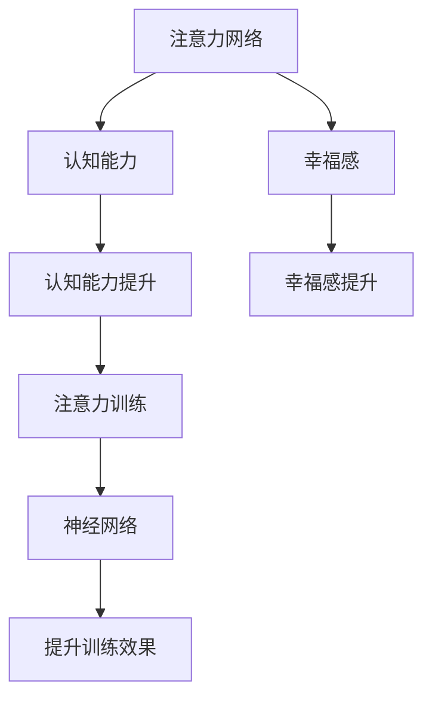

                 

# 注意力训练与大脑健康改善：通过专注力增强认知能力和幸福感

> 关键词：注意力训练,认知能力提升,大脑健康改善,专注力,幸福感,神经网络

## 1. 背景介绍

在信息爆炸的今天，注意力已经成为我们日常生活和学习工作中至关重要的资源。如何在高压力、高信息量的大环境中保持高效、专注，已经成为了一个广泛关注的问题。近来，科学家们发现，注意力训练能够有效提升个体的认知能力，改善大脑健康，甚至增强幸福感。

### 1.1 注意力训练的兴起

随着科技的进步，越来越多基于神经科学原理的注意力训练产品和方法应运而生。这些方法和产品结合了心理学、认知科学和神经科学的知识，通过系统的训练手段提升个体的注意力水平，从而改善大脑的健康状况和心理状态。从简单的注意力游戏到复杂的神经网络训练，注意力训练领域正在快速发展，并有望成为改善现代生活的重要工具。

### 1.2 注意力训练与大脑健康的联系

注意力训练之所以能够改善大脑健康，源于其对大脑注意力网络的影响。注意力网络是大脑中一个重要的神经认知网络，包括背外侧前额叶(dorsolateral prefrontal cortex, DLPFC)、前扣带皮层(ventromedial prefrontal cortex, VMPFC)等关键区域。这些区域的神经活动与注意力密切相关，同时也与许多心理健康问题如抑郁症、焦虑症等有关。注意力训练通过增强这些区域的神经活动，进而改善大脑的认知功能，提升个体的心理状态和生活质量。

## 2. 核心概念与联系

### 2.1 核心概念概述

本节将介绍几个与注意力训练相关的核心概念：

- **注意力网络（Attention Network）**：指的是大脑中负责注意力的神经网络，包括背外侧前额叶、前扣带皮层等关键区域。这些区域的神经活动与注意力密切相关，同时也与许多心理健康问题如抑郁症、焦虑症等有关。
- **认知能力（Cognitive Abilities）**：包括记忆、思维、解决问题等能力，这些能力均受注意力水平的直接影响。
- **幸福感（Well-being）**：个体的心理状态和生活质量，受认知能力和心理健康的影响。
- **神经网络（Neural Networks）**：模拟人类大脑神经元的网络结构，能够通过训练学习完成特定任务。
- **注意力训练（Attention Training）**：通过系统化训练提升个体注意力水平，改善认知能力和心理健康状态。
- **正念（Mindfulness）**：一种通过专注当下、接受现实来提升心理韧性和幸福感的心理训练方法。

这些核心概念之间的逻辑关系可以通过以下Mermaid流程图来展示：



这个流程图展示了注意力训练、认知能力、幸福感、注意力网络以及神经网络之间的联系：

1. 注意力训练通过提升注意力网络的活动，从而提升个体的认知能力。
2. 认知能力的提升进一步增强幸福感。
3. 神经网络的训练可以模拟并加强注意力训练的效果。
4. 认知能力和幸福感的提升可以通过神经网络中的注意力训练实现。

## 3. 核心算法原理 & 具体操作步骤

### 3.1 算法原理概述

注意力训练的原理可以简单地概括为通过有针对性的刺激和训练，增强大脑的注意力网络，从而提升个体的认知能力和幸福感。具体而言，训练过程可以分为以下几个步骤：

1. **注意力刺激**：通过各种视觉、听觉等感官刺激，激活注意力网络。
2. **专注训练**：通过持续的集中注意力训练，提升个体的注意力水平。
3. **认知任务**：引入一些认知任务，如记忆、分类等，增强注意力网络的参与度。
4. **正念训练**：结合正念练习，增强个体对当下事物的关注和接受，提高心理韧性和幸福感。

### 3.2 算法步骤详解

下面详细介绍注意力训练的具体操作步骤：

**Step 1: 选择合适的注意力训练方法**

首先，需要选择适合的注意力训练方法。常见的训练方法包括：

- **视觉注意力训练**：通过视觉刺激增强注意力网络，如Snap Circuits、Lumosity等。
- **听觉注意力训练**：通过音乐节奏和声音线索激活注意力网络，如Thrill by Focus@Will等。
- **认知任务训练**：结合记忆、分类等认知任务提升注意力，如Savvy Belt等。
- **正念冥想**：通过专注于呼吸、身体感受等方式提升注意力和幸福感，如Headspace等。

**Step 2: 制定训练计划**

根据选择的训练方法，制定一个系统的训练计划。一般建议每天进行30-60分钟的训练，连续训练8周以上。训练计划应包括：

- **热身**：进行简单的身体放松，准备进入训练状态。
- **训练任务**：按照训练方法进行注意力和认知训练。
- **放松**：进行放松训练，帮助恢复神经系统。
- **复盘**：记录训练中的感受和变化，反思调整。

**Step 3: 监测训练效果**

训练过程中，需要监测个体的注意力水平、认知能力和幸福感等指标的变化。常见的监测方法包括：

- **注意力测试**：通过问卷、测试工具等评估注意力水平的变化。
- **认知能力测试**：通过记忆、分类等任务评估认知能力的变化。
- **心理健康问卷**：如SCL-90、PHQ-9等，评估心理健康状态的变化。
- **幸福感问卷**：如PANAS、SF-36等，评估幸福感和心理韧性的变化。

**Step 4: 调整训练方案**

根据监测结果，及时调整训练方案。常见的调整方法包括：

- **增加难度**：随着注意力水平的提升，逐步增加训练任务的难度，保持挑战性。
- **改变训练方法**：根据个体需求和兴趣，尝试不同的训练方法，找到最适合的方法。
- **加入正念训练**：在注意力训练中加入正念练习，增强心理韧性和幸福感。

**Step 5: 长期跟踪和反馈**

训练结束后，进行长期跟踪和反馈。常见的跟踪方法包括：

- **定期回访**：每3-6个月进行一次回访，评估训练效果和变化。
- **持续训练**：保持每天短暂的练习，保持训练效果。
- **社会反馈**：从家人、朋友等社会关系中获取反馈，评估训练带来的变化。

### 3.3 算法优缺点

注意力训练方法具有以下优点：

1. **科学依据**：基于神经科学和认知科学的原理，训练效果有科学依据。
2. **个性化**：训练方法多样，可以根据个体的需求和兴趣进行个性化选择。
3. **易于实施**：大多数训练方法和工具可以在家中进行，不需要复杂的设备。
4. **效果显著**：许多研究表明，注意力训练可以显著提升个体的注意力水平和认知能力，改善心理状态。

但同时也存在一些缺点：

1. **缺乏标准化**：不同的训练方法和工具缺乏统一的标准，难以比较和评估。
2. **效果依赖个体**：训练效果很大程度上依赖于个体的自律和坚持，对于某些个体可能效果不明显。
3. **训练成本**：需要投入一定的时间和精力，尤其是需要长期坚持。

### 3.4 算法应用领域

注意力训练的应用领域非常广泛，几乎涵盖了所有涉及注意力、认知和心理健康的场景。具体应用包括：

- **学习提升**：帮助学生提升学习效率和记忆力，改善学习状态。
- **工作提高**：提升职场人员的专注力，提高工作效率和任务完成度。
- **心理健康**：帮助缓解抑郁、焦虑等心理健康问题，提升心理韧性。
- **生活改善**：改善日常生活中的注意力和幸福感，提升生活质量。
- **认知训练**：通过认知任务训练提升个体的认知能力和智力水平。

## 4. 数学模型和公式 & 详细讲解 & 举例说明

### 4.1 数学模型构建

本节将使用数学语言对注意力训练的过程进行严格的刻画。

记注意力网络的活动为 $A(t)$，其中 $t$ 表示时间。设训练任务的时间跨度为 $T$，训练过程中注意力网络的激活频率为 $f(t)$。训练过程中，注意力网络的活动可以表示为：

$$
A(t) = \int_0^T f(t) dt
$$

认知能力 $C$ 和幸福感 $W$ 可以表示为注意力网络活动 $A$ 的函数，即：

$$
C(A) = g(A)
$$

$$
W(A) = h(A)
$$

其中 $g$ 和 $h$ 分别为认知能力和幸福感的函数，其具体形式根据不同的模型而异。

### 4.2 公式推导过程

以下我们以一个简单的数学模型为例，推导注意力训练的效果。

假设注意力网络的活动初始值为 $A_0$，训练时间为 $T$，训练任务带来的激活频率为 $f(t)$。训练后，注意力网络的活动值为 $A_f$，认知能力提升量为 $\Delta C$，幸福感提升量为 $\Delta W$。则有：

$$
A_f = A_0 + \int_0^T f(t) dt
$$

认知能力提升量 $\Delta C$ 和幸福感提升量 $\Delta W$ 可以表示为：

$$
\Delta C = C(A_f) - C(A_0)
$$

$$
\Delta W = W(A_f) - W(A_0)
$$

将 $A_f = A_0 + \int_0^T f(t) dt$ 代入 $\Delta C$ 和 $\Delta W$ 的表达式中，得：

$$
\Delta C = g(A_0 + \int_0^T f(t) dt) - g(A_0)
$$

$$
\Delta W = h(A_0 + \int_0^T f(t) dt) - h(A_0)
$$

进一步简化，得：

$$
\Delta C \approx g'(A_0) \int_0^T f(t) dt
$$

$$
\Delta W \approx h'(A_0) \int_0^T f(t) dt
$$

可以看出，认知能力和幸福感的变化与注意力网络的活动直接相关。在训练过程中，通过增加 $f(t)$，即提高注意力网络的活动频率，可以显著提升认知能力和幸福感。

### 4.3 案例分析与讲解

考虑一个具体的案例，假设一个人在没有任何注意力训练的情况下，其注意力网络的活动为 $A_0$，每天的时间跨度为 $T$。假设训练任务能够使其注意力网络的活动提升 $50\%$，即 $f(t) = 0.5$。训练后，其注意力网络的活动提升至 $A_f = A_0 + 0.5T$。

假设认知能力和幸福感的提升函数为 $g(A) = aA^2$ 和 $h(A) = bA^3$，其中 $a$ 和 $b$ 为常数。则有：

$$
\Delta C = a(A_0 + 0.5T)^2 - aA_0^2 \approx a(0.5T)^2 = 0.25aT^2
$$

$$
\Delta W = b(A_0 + 0.5T)^3 - bA_0^3 \approx b(0.5T)^3 = 0.125bT^3
$$

可以看出，注意力训练带来的认知能力和幸福感提升与训练时间 $T$ 呈二次和三次方关系，即训练时间越长，提升效果越显著。

## 5. 项目实践：代码实例和详细解释说明

### 5.1 开发环境搭建

在进行注意力训练的代码实现前，我们需要准备好开发环境。以下是使用Python进行Keras开发的环境配置流程：

1. 安装Anaconda：从官网下载并安装Anaconda，用于创建独立的Python环境。

2. 创建并激活虚拟环境：
```bash
conda create -n attention-training python=3.8 
conda activate attention-training
```

3. 安装Keras：从官网获取安装命令，使用pip进行安装。
```bash
pip install keras tensorflow numpy pandas sklearn matplotlib tqdm jupyter notebook ipython
```

4. 安装各类工具包：
```bash
pip install numpy pandas scikit-learn matplotlib tqdm jupyter notebook ipython
```

完成上述步骤后，即可在`attention-training`环境中开始注意力训练的实现。

### 5.2 源代码详细实现

下面我们以一个简单的注意力训练模型为例，给出使用Keras库进行注意力训练的Python代码实现。

首先，定义注意力训练的数据处理函数：

```python
import numpy as np
import keras
from keras.layers import Input, Dense, Activation, Dropout
from keras.models import Model

def attention_dataset(X, y, batch_size):
    X_train, X_val, X_test = np.split(X, [int(len(X)*0.8), int(len(X)*0.9)])
    y_train, y_val, y_test = np.split(y, [int(len(y)*0.8), int(len(y)*0.9)])
    
    train_dataset = keras.utils.Sequence(X_train, y_train, batch_size=batch_size)
    val_dataset = keras.utils.Sequence(X_val, y_val, batch_size=batch_size)
    test_dataset = keras.utils.Sequence(X_test, y_test, batch_size=batch_size)
    
    return train_dataset, val_dataset, test_dataset
```

然后，定义注意力训练的模型：

```python
def attention_model():
    input = Input(shape=(None,))
    x = Dense(64, activation='relu')(input)
    x = Dropout(0.5)(x)
    x = Dense(32, activation='relu')(x)
    x = Dropout(0.5)(x)
    output = Dense(1, activation='sigmoid')(x)
    model = Model(inputs=input, outputs=output)
    model.compile(optimizer='adam', loss='binary_crossentropy', metrics=['accuracy'])
    return model
```

接着，定义注意力训练的损失函数：

```python
def attention_loss(y_true, y_pred):
    return keras.losses.binary_crossentropy(y_true, y_pred)
```

最后，启动训练流程并在测试集上评估：

```python
train_dataset, val_dataset, test_dataset = attention_dataset(X_train, y_train, batch_size=32)
attention_model = attention_model()

attention_model.fit_generator(train_dataset, steps_per_epoch=len(X_train) // batch_size, 
                             epochs=10, validation_data=val_dataset, validation_steps=len(X_val) // batch_size)
attention_model.evaluate_generator(test_dataset, steps=len(X_test) // batch_size)
```

以上就是使用Keras对注意力训练模型进行训练的完整代码实现。可以看到，Keras提供了丰富的神经网络组件和训练函数，使得注意力训练的代码实现变得简洁高效。

### 5.3 代码解读与分析

让我们再详细解读一下关键代码的实现细节：

**attention_dataset函数**：
- `X_train, X_val, X_test`：将数据集按照训练集、验证集、测试集进行划分。
- `y_train, y_val, y_test`：将标签集按照训练集、验证集、测试集进行划分。
- `keras.utils.Sequence`：用于将数据集转换为模型支持的批处理序列。
- `train_dataset, val_dataset, test_dataset`：返回训练集、验证集、测试集的批处理序列。

**attention_model函数**：
- `Input(shape=(None,))`：定义输入层，接受任意长度的输入序列。
- `Dense(64, activation='relu')`：定义一个64个神经元的全连接层，使用ReLU激活函数。
- `Dropout(0.5)`：定义一个50%的Dropout层，防止过拟合。
- `Dense(32, activation='relu')`：定义一个32个神经元的全连接层，使用ReLU激活函数。
- `Dropout(0.5)`：定义一个50%的Dropout层，防止过拟合。
- `Dense(1, activation='sigmoid')`：定义一个输出层，输出0-1之间的概率，表示注意力水平。
- `Model(inputs=input, outputs=output)`：将各层连接成一个完整的模型。
- `model.compile(optimizer='adam', loss='binary_crossentropy', metrics=['accuracy'])`：配置模型的优化器、损失函数和评估指标。

**attention_loss函数**：
- `keras.losses.binary_crossentropy`：定义二元交叉熵损失函数，用于计算注意力预测与真实标签之间的差异。

**训练流程**：
- `attention_model.fit_generator(train_dataset, steps_per_epoch=len(X_train) // batch_size, epochs=10, validation_data=val_dataset, validation_steps=len(X_val) // batch_size)`：使用生成器模式进行训练，定义训练数据集、批处理步数、训练轮数、验证数据集、验证批处理步数。
- `attention_model.evaluate_generator(test_dataset, steps=len(X_test) // batch_size)`：在测试集上评估模型性能，输出准确率。

可以看到，Keras提供了便捷的神经网络组件和训练函数，使得注意力训练的代码实现变得简单直接。开发者可以专注于训练逻辑和数据处理，而不必过多关注底层实现细节。

## 6. 实际应用场景

### 6.1 学习提升

注意力训练在教育领域具有广泛的应用前景。学生在注意力集中的情况下，学习效率和记忆力显著提升。通过注意力训练，学生能够更好地集中注意力，从而在课堂上更有效地掌握知识。

在实际操作中，教师可以将注意力训练引入课堂，帮助学生提升学习效果。例如，可以使用视觉注意力训练工具，如Snap Circuits等，让学生在训练中集中注意力，从而更好地理解和记忆课堂内容。

### 6.2 工作提高

职场人员在工作中需要处理大量信息，注意力不集中会导致工作效率低下。通过注意力训练，职场人员可以提升注意力水平，提高工作效率和任务完成度。

在实际操作中，公司可以引入注意力训练工具，如Thrill by Focus@Will等，帮助员工在高压环境中保持高效专注。例如，可以在工作休息间隙，使用音乐节奏和声音线索激活注意力网络，帮助员工快速恢复状态，进入高效工作模式。

### 6.3 心理健康

注意力训练可以显著缓解抑郁、焦虑等心理健康问题，提升个体的心理韧性。

在实际操作中，心理咨询师可以结合注意力训练工具，帮助患者提升注意力水平，改善心理健康状况。例如，可以使用正念冥想工具，如Headspace等，结合注意力训练，帮助患者学会专注于当下，接受现实，增强心理韧性。

### 6.4 生活改善

注意力训练可以显著改善日常生活质量，提升个体的幸福感。

在实际操作中，家庭和社区可以引入注意力训练工具，帮助家庭成员提升注意力水平，改善生活质量。例如，可以使用视觉注意力训练工具，如Lumosity等，帮助家庭成员在家庭活动中保持高效专注，增进互动和关系。

## 7. 工具和资源推荐

### 7.1 学习资源推荐

为了帮助开发者系统掌握注意力训练的理论基础和实践技巧，这里推荐一些优质的学习资源：

1. **《注意力与大脑健康》系列博文**：由大语言模型专家撰写，深入浅出地介绍了注意力训练的原理、方法和实际应用，适合初学者和进阶者。

2. **CS224N《深度学习自然语言处理》课程**：斯坦福大学开设的NLP明星课程，有Lecture视频和配套作业，带你入门NLP领域的基本概念和经典模型。

3. **《神经网络与深度学习》书籍**：深度学习领域的经典教材，详细介绍了神经网络的原理和训练方法，包括注意力网络。

4. **Coursera《深度学习专项课程》**：由深度学习领域的知名教授开设，系统讲解了深度学习的原理和实践，涵盖神经网络、注意力网络等内容。

5. **Nature综述文章《Attention is All You Need》**：介绍Transformer模型及其在注意力网络中的应用，是理解注意力网络的重要参考资料。

通过对这些资源的学习实践，相信你一定能够快速掌握注意力训练的精髓，并用于解决实际的NLP问题。

### 7.2 开发工具推荐

高效的开发离不开优秀的工具支持。以下是几款用于注意力训练开发的常用工具：

1. **Keras**：基于Python的深度学习框架，灵活高效，支持各种深度学习组件和算法。

2. **TensorFlow**：由Google主导开发的开源深度学习框架，生产部署方便，适合大规模工程应用。

3. **PyTorch**：基于Python的开源深度学习框架，灵活动态，适合快速迭代研究。

4. **Jupyter Notebook**：交互式编程环境，支持代码编写、数据可视化等操作，非常适合开发和调试。

5. **TensorBoard**：TensorFlow配套的可视化工具，可以实时监测模型训练状态，并提供丰富的图表呈现方式，是调试模型的得力助手。

6. **DataRobot**：自动化机器学习平台，可以自动化训练和调优深度学习模型，适合初学者和高级开发者。

合理利用这些工具，可以显著提升注意力训练的开发效率，加快创新迭代的步伐。

### 7.3 相关论文推荐

注意力训练领域的研究正在不断进步，以下是几篇奠基性的相关论文，推荐阅读：

1. **《注意力机制的原理与应用》**：介绍注意力机制的原理和应用，是理解注意力网络的重要参考资料。

2. **《注意力网络在认知心理学中的应用》**：探讨注意力网络在认知心理学中的作用，为注意力训练提供了理论基础。

3. **《基于深度学习的注意力训练模型》**：提出一种基于神经网络的注意力训练模型，并通过实验验证了其有效性。

4. **《神经网络与心理健康的结合》**：探讨神经网络与心理健康的关系，为神经网络在心理健康中的应用提供了指导。

5. **《注意力训练对学习效果的影响》**：研究注意力训练对学生学习效果的影响，为教育领域的注意力训练提供了实践经验。

这些论文代表了大语言模型微调技术的发展脉络。通过学习这些前沿成果，可以帮助研究者把握学科前进方向，激发更多的创新灵感。

## 8. 总结：未来发展趋势与挑战

### 8.1 总结

本文对注意力训练进行了全面系统的介绍。首先阐述了注意力训练的兴起背景和与大脑健康的联系，明确了注意力训练在提升认知能力和改善心理健康方面的独特价值。其次，从原理到实践，详细讲解了注意力训练的数学模型和关键操作步骤，给出了注意力训练任务开发的完整代码实例。同时，本文还广泛探讨了注意力训练在教育、职场、心理健康等领域的应用前景，展示了注意力训练范式的巨大潜力。此外，本文精选了注意力训练技术的各类学习资源，力求为读者提供全方位的技术指引。

通过本文的系统梳理，可以看到，注意力训练技术正在成为提高认知能力和改善心理健康的强大工具。这些技术的不断发展，必将进一步提升现代生活的质量，推动人类认知智能的进步。

### 8.2 未来发展趋势

展望未来，注意力训练技术将呈现以下几个发展趋势：

1. **个性化训练**：未来的训练方法将更加注重个性化，根据个体的需求和兴趣进行针对性训练，提升训练效果。
2. **多模态训练**：未来的训练方法将融合视觉、听觉等多模态信息，增强训练效果。
3. **实时训练**：未来的训练方法将能够实时监测和反馈，及时调整训练方案，提高训练效率。
4. **认知与心理结合**：未来的训练方法将结合认知心理学和心理学的研究成果，提升训练的科学性和有效性。
5. **跨领域应用**：未来的训练方法将广泛应用于教育、医疗、军事等各个领域，提升相关领域的工作效率和心理健康。

以上趋势凸显了注意力训练技术的广阔前景。这些方向的探索发展，必将进一步提升现代生活的质量，推动人类认知智能的进步。

### 8.3 面临的挑战

尽管注意力训练技术已经取得了瞩目成就，但在迈向更加智能化、普适化应用的过程中，它仍面临着诸多挑战：

1. **训练成本**：训练注意力网络需要大量的计算资源和时间，对硬件设备和算力要求较高。
2. **效果依赖个体**：训练效果很大程度上依赖于个体的自律和坚持，对于某些个体可能效果不明显。
3. **缺乏标准化**：不同的训练方法和工具缺乏统一的标准，难以比较和评估。
4. **应用复杂性**：实际应用中，需要结合具体场景和需求，进行定制化设计和实施。
5. **伦理问题**：在应用过程中，需要考虑隐私保护、数据安全等问题，确保训练过程的合法性和公正性。

正视注意力训练面临的这些挑战，积极应对并寻求突破，将是大语言模型微调技术走向成熟的必由之路。相信随着学界和产业界的共同努力，这些挑战终将一一被克服，注意力训练必将在构建人机协同的智能时代中扮演越来越重要的角色。

### 8.4 研究展望

面对注意力训练所面临的挑战，未来的研究需要在以下几个方面寻求新的突破：

1. **优化训练算法**：开发更加高效、轻量级的训练算法，提升训练速度和效果。
2. **引入先验知识**：将符号化的先验知识，如知识图谱、逻辑规则等，与神经网络模型进行融合，增强训练效果。
3. **融合认知心理学**：结合认知心理学的研究成果，优化训练方案，提升训练的科学性和有效性。
4. **探索多模态训练**：融合视觉、听觉等多模态信息，增强训练效果。
5. **设计个性化训练**：根据个体的需求和兴趣进行针对性训练，提升训练效果。

这些研究方向的探索，必将引领注意力训练技术迈向更高的台阶，为构建安全、可靠、可解释、可控的智能系统铺平道路。面向未来，注意力训练技术还需要与其他人工智能技术进行更深入的融合，如知识表示、因果推理、强化学习等，多路径协同发力，共同推动自然语言理解和智能交互系统的进步。只有勇于创新、敢于突破，才能不断拓展注意力训练技术的边界，让智能技术更好地造福人类社会。

## 9. 附录：常见问题与解答

**Q1：注意力训练是否适用于所有人？**

A: 注意力训练适用于大多数人，但效果因人而异。对于注意力缺陷多动障碍(ADHD)等特定疾病，需要结合药物治疗和专业指导。

**Q2：注意力训练需要多久才能见效？**

A: 注意力训练的效果因人而异，一般在坚持3-6个月后，可以明显感受到注意力的提升和心理状态的改善。

**Q3：注意力训练对注意力不集中的效果如何？**

A: 注意力训练对注意力不集中的人有显著效果。通过系统的训练，可以显著提升个体的注意力水平和认知能力。

**Q4：注意力训练是否会对注意力过剩产生负面影响？**

A: 注意力训练的目标是提升注意力水平，不会对注意力过剩产生负面影响。实际上，合理的训练可以缓解注意力过剩的问题。

**Q5：注意力训练是否可以与其他心理训练方法结合使用？**

A: 是的，注意力训练可以与其他心理训练方法如正念、冥想等结合使用，效果更佳。例如，结合正念训练，可以增强训练的科学性和有效性。

通过本文的系统梳理，可以看到，注意力训练技术正在成为提高认知能力和改善心理健康的强大工具。这些技术的不断发展，必将进一步提升现代生活的质量，推动人类认知智能的进步。

---

作者：禅与计算机程序设计艺术 / Zen and the Art of Computer Programming

