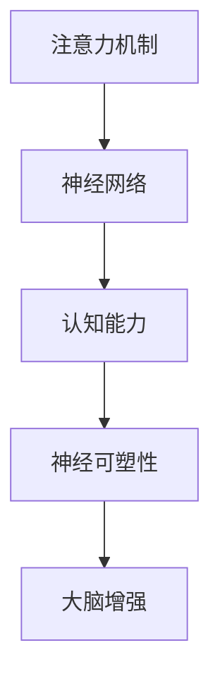

                 

## 1. 背景介绍

### 1.1 问题由来
随着技术的飞速发展，人工智能已经渗透到日常生活的各个方面。其中，注意力机制（Attention Mechanism）作为神经网络中的核心组件，其重要性不言而喻。注意力机制通过模拟人脑的注意力机制，对输入数据进行加权处理，有效提高了模型对关键信息的识别能力，推动了深度学习的发展。

然而，尽管注意力机制在人工智能中有着广泛应用，但其背后的认知科学原理仍不清晰，如何更好地理解和优化注意力机制仍是科研工作者面临的重要问题。与此同时，认知科学和神经科学在近年来也取得了巨大进展，尤其是对人脑注意力机制的研究，为人工智能提供了新的思路和突破口。

因此，本文旨在探讨注意力机制的认知科学原理，以及如何通过模拟大脑注意力机制来增强认知能力和神经可塑性。文章将从背景介绍、核心概念与联系、算法原理与操作步骤、数学模型与详细讲解、项目实践、实际应用场景、工具与资源推荐、总结与发展趋势与挑战等多个方面，系统介绍注意力训练和大脑增强技术，并探讨其在人工智能中的实际应用。

### 1.2 问题核心关键点
本文将围绕以下几个核心问题展开讨论：

1. **注意力机制的认知科学原理**：研究注意力机制在大脑中的神经科学基础，理解其工作机制。
2. **注意力训练的基本方法**：介绍基于神经网络模型训练注意力机制的算法和技术。
3. **注意力机制的实际应用**：探讨注意力机制在自然语言处理、计算机视觉等领域的实际应用。
4. **大脑增强的目标**：讨论如何通过注意力机制训练来增强认知能力和神经可塑性。

## 2. 核心概念与联系

### 2.1 核心概念概述

为更好地理解注意力训练和大脑增强技术，本节将介绍几个关键概念：

- **注意力机制（Attention Mechanism）**：一种神经网络组件，用于加权处理输入数据，提高模型对关键信息的识别能力。
- **神经网络（Neural Network）**：由大量神经元（Neuron）构成的计算模型，通过学习大量数据来识别输入数据的规律和模式。
- **认知能力（Cognitive Ability）**：人脑处理信息、学习新知识和解决问题的能力。
- **神经可塑性（Neural Plasticity）**：神经系统的适应性，能够根据外部环境的变化调整自身结构和功能。

这些核心概念之间的逻辑关系可以通过以下Mermaid流程图来展示：



这个流程图展示了注意力机制在神经网络中扮演的核心角色，以及其对认知能力和神经可塑性的影响。

## 3. 核心算法原理 & 具体操作步骤

### 3.1 算法原理概述

基于注意力机制的神经网络模型通常由编码器和解码器组成，其中编码器用于提取输入数据的特征，解码器则用于生成输出结果。注意力机制通过计算输入数据与编码器输出的相似度，为每个输入数据分配一个权重，从而加权处理输入数据，提升模型性能。

注意力机制的核心思想是：模型在处理输入数据时，并不是平均关注每一个数据点，而是根据数据的上下文关系和语义重要性，有选择地关注部分关键数据点，忽略无关数据。这种有选择性的关注能力，使得模型能够更好地识别关键信息，提高任务完成的质量。

### 3.2 算法步骤详解

基于注意力机制的神经网络模型训练通常包括以下几个关键步骤：

1. **数据准备**：收集标注数据，并将数据分为训练集、验证集和测试集。
2. **模型设计**：设计神经网络模型架构，包括编码器和解码器结构，以及注意力机制的实现。
3. **模型训练**：使用训练集数据，通过反向传播算法训练模型参数，优化注意力机制。
4. **模型评估**：在验证集和测试集上评估模型性能，根据评估结果调整模型参数。
5. **模型部署**：将训练好的模型部署到实际应用场景中，进行任务处理。

### 3.3 算法优缺点

注意力机制的神经网络模型具有以下优点：

1. **提升模型性能**：通过加权处理输入数据，提高了模型对关键信息的识别能力，提升任务完成的质量。
2. **适应性强**：能够根据输入数据的分布自动调整注意力权重，适应不同任务的需求。
3. **可解释性强**：注意力权重可以用于解释模型决策过程，帮助理解模型的工作机制。

同时，该方法也存在以下局限性：

1. **计算复杂度高**：注意力机制的计算复杂度高，在大规模数据集上训练时，计算资源需求较大。
2. **训练时间较长**：注意力机制需要较长的训练时间，特别是在大规模数据集上，训练时间会显著增加。
3. **参数量较大**：由于注意力机制需要学习大量的权重，模型参数量较大，占用的内存和计算资源较多。

### 3.4 算法应用领域

注意力机制在自然语言处理、计算机视觉、语音识别等诸多领域得到了广泛应用，具体包括：

1. **机器翻译**：在机器翻译任务中，注意力机制用于处理源语言和目标语言之间的对应关系，提高了翻译质量。
2. **语音识别**：在语音识别任务中，注意力机制用于识别语音中的关键特征，提高识别的准确率。
3. **图像识别**：在图像识别任务中，注意力机制用于处理图像中的关键区域，提高了识别精度。
4. **自然语言生成**：在自然语言生成任务中，注意力机制用于处理输入文本的上下文关系，生成自然流畅的文本。
5. **文本摘要**：在文本摘要任务中，注意力机制用于处理输入文本中的关键信息，生成简洁的摘要。

## 4. 数学模型和公式 & 详细讲解

### 4.1 数学模型构建

本节将使用数学语言对注意力机制进行详细的构建和讲解。

记输入数据为 $X=\{x_1, x_2, \cdots, x_n\}$，编码器输出为 $H=\{h_1, h_2, \cdots, h_n\}$，解码器输出为 $Y=\{y_1, y_2, \cdots, y_m\}$，其中 $x_i$ 表示输入数据的第 $i$ 个元素，$h_i$ 表示编码器输出的第 $i$ 个元素，$y_i$ 表示解码器输出的第 $i$ 个元素。注意力机制的目标是计算输入数据与编码器输出的相似度，为每个输入数据分配一个权重 $a_i$，使得解码器在生成 $y_i$ 时，只关注与 $y_i$ 最相关的 $h_i$。

注意力机制的数学模型可以表示为：

$$
a_i = \frac{\exp(e(h_i, x_i))}{\sum_{j=1}^{n} \exp(e(h_j, x_j))}
$$

其中 $e(h_i, x_i)$ 表示输入数据 $x_i$ 和编码器输出 $h_i$ 之间的相似度函数。

### 4.2 公式推导过程

以机器翻译为例，假设输入数据为源语言句子，编码器输出为中间表示，解码器输出为目标语言句子。注意力机制的计算过程如下：

1. **计算相似度**：将输入数据 $x_i$ 和编码器输出 $h_i$ 送入相似度函数，计算相似度 $e(h_i, x_i)$。
2. **计算注意力权重**：将每个相似度值进行归一化，得到注意力权重 $a_i$。
3. **加权处理编码器输出**：将编码器输出 $h_i$ 乘以注意力权重 $a_i$，得到加权后的编码器输出 $h_i^a$。
4. **生成解码器输出**：将加权后的编码器输出 $h_i^a$ 和当前解码器状态 $y_{i-1}$ 送入解码器，生成当前解码器输出 $y_i$。

以下是计算相似度 $e(h_i, x_i)$ 的常见方法：

- **点积相似度**：
$$
e(h_i, x_i) = h_i^T x_i
$$

- **注意力头**：
$$
e(h_i, x_i) = \text{Attention}(h_i, x_i)
$$

- **Self-Attention**：
$$
e(h_i, x_i) = \text{Softmax}(h_i h_i^T) x_i
$$

### 4.3 案例分析与讲解

以Transformer模型为例，Transformer模型的注意力机制是通过Self-Attention实现的，其核心思想是通过计算输入数据和编码器输出之间的相似度，为每个输入数据分配一个权重，从而加权处理输入数据，提升模型性能。

Transformer模型的注意力机制计算过程如下：

1. **计算查询、键、值向量**：将输入数据和编码器输出进行线性变换，得到查询向量、键向量和值向量。
2. **计算相似度**：将查询向量与键向量进行点积，计算相似度。
3. **计算注意力权重**：将相似度进行Softmax归一化，得到注意力权重。
4. **加权处理值向量**：将值向量与注意力权重进行加权处理，得到加权后的值向量。
5. **生成解码器输出**：将加权后的值向量与当前解码器状态进行拼接，送入前馈神经网络，生成解码器输出。

Transformer模型通过多层Self-Attention和前馈神经网络的组合，能够有效地处理长距离依赖和复杂关系，从而在机器翻译、文本生成等任务上取得了优异的性能。

## 5. 项目实践：代码实例和详细解释说明

### 5.1 开发环境搭建

在进行注意力训练和大脑增强技术实践前，我们需要准备好开发环境。以下是使用Python进行TensorFlow开发的环境配置流程：

1. 安装Anaconda：从官网下载并安装Anaconda，用于创建独立的Python环境。
2. 创建并激活虚拟环境：
```bash
conda create -n attention-env python=3.8 
conda activate attention-env
```
3. 安装TensorFlow：根据CUDA版本，从官网获取对应的安装命令。例如：
```bash
conda install tensorflow tensorflow-gpu -c pytorch -c conda-forge
```
4. 安装相关库：
```bash
pip install numpy pandas scikit-learn matplotlib tqdm jupyter notebook ipython
```
完成上述步骤后，即可在`attention-env`环境中开始项目实践。

### 5.2 源代码详细实现

下面以机器翻译为例，给出使用TensorFlow实现注意力机制的代码实现。

```python
import tensorflow as tf
import numpy as np
import matplotlib.pyplot as plt

# 定义模型参数
embedding_dim = 256
num_heads = 4
attention_dim = embedding_dim * num_heads
num_encoder_layers = 2
num_decoder_layers = 2
dropout_rate = 0.1
batch_size = 16
sequence_length = 512
source_max_length = 100
target_max_length = 100
vocab_size = 10000

# 定义Transformer模型
class Transformer(tf.keras.Model):
    def __init__(self, num_heads, attention_dim, num_encoder_layers, num_decoder_layers, dropout_rate, vocab_size, embedding_dim):
        super(Transformer, self).__init__()
        self.encoder = Encoder(num_heads, attention_dim, num_encoder_layers, dropout_rate, embedding_dim, vocab_size)
        self.decoder = Decoder(num_heads, attention_dim, num_decoder_layers, dropout_rate, embedding_dim, vocab_size)
    
    def call(self, source, target):
        attention_weights = self.encoder(source) * self.decoder(target)
        return attention_weights

# 定义编码器
class Encoder(tf.keras.Model):
    def __init__(self, num_heads, attention_dim, num_encoder_layers, dropout_rate, embedding_dim, vocab_size):
        super(Encoder, self).__init__()
        self.embedding = tf.keras.layers.Embedding(vocab_size, embedding_dim)
        self.multi_head_attention = MultiHeadAttention(num_heads, attention_dim, dropout_rate)
        self.ffn = Ffn(embedding_dim, dropout_rate)
        self.dropout = tf.keras.layers.Dropout(dropout_rate)
    
    def call(self, input):
        embedding = self.embedding(input)
        attention_weights = self.multi_head_attention(embedding, input)
        feed_forward = self.ffn(attention_weights)
        return self.dropout(feed_forward)

# 定义解码器
class Decoder(tf.keras.Model):
    def __init__(self, num_heads, attention_dim, num_decoder_layers, dropout_rate, embedding_dim, vocab_size):
        super(Decoder, self).__init__()
        self.embedding = tf.keras.layers.Embedding(vocab_size, embedding_dim)
        self.multi_head_attention = MultiHeadAttention(num_heads, attention_dim, dropout_rate)
        self.ffn = Ffn(embedding_dim, dropout_rate)
        self.dropout = tf.keras.layers.Dropout(dropout_rate)
    
    def call(self, input, encoder_output):
        embedding = self.embedding(input)
        attention_weights = self.multi_head_attention(embedding, encoder_output, input)
        feed_forward = self.ffn(attention_weights)
        return self.dropout(feed_forward)

# 定义多头注意力机制
class MultiHeadAttention(tf.keras.layers.Layer):
    def __init__(self, num_heads, attention_dim, dropout_rate):
        super(MultiHeadAttention, self).__init__()
        self.num_heads = num_heads
        self.attention_dim = attention_dim
        self.dropout = tf.keras.layers.Dropout(dropout_rate)
        self.WQ = tf.keras.layers.Dense(attention_dim)
        self.WK = tf.keras.layers.Dense(attention_dim)
        self.WV = tf.keras.layers.Dense(attention_dim)
        self.dense = tf.keras.layers.Dense(vocab_size)
    
    def split_heads(self, x, batch_size):
        x = tf.reshape(x, (batch_size, -1, self.num_heads, self.attention_dim // self.num_heads))
        return tf.transpose(x, perm=[0, 2, 1, 3])
    
    def call(self, query, key, value):
        batch_size = tf.shape(query)[0]
        Q = self.WQ(query)
        K = self.WK(key)
        V = self.WV(value)
        Q = self.split_heads(Q, batch_size)
        K = self.split_heads(K, batch_size)
        V = self.split_heads(V, batch_size)
        attention_weights = tf.matmul(Q, K, transpose_b=True)
        attention_weights = self.dropout(tf.nn.softmax(attention_weights, axis=-1))
        attention_outputs = tf.matmul(attention_weights, V)
        attention_outputs = tf.transpose(attention_outputs, perm=[0, 2, 1, 3])
        attention_outputs = tf.reshape(attention_outputs, (batch_size, -1, self.attention_dim))
        return self.dense(attention_outputs)

# 定义前馈神经网络
class Ffn(tf.keras.layers.Layer):
    def __init__(self, d_model, dropout_rate):
        super(Ffn, self).__init__()
        self.intermediate_dim = d_model * 4
        self.intermediate = tf.keras.layers.Dense(self.intermediate_dim, activation='relu')
        self.final = tf.keras.layers.Dense(d_model)
        self.dropout = tf.keras.layers.Dropout(dropout_rate)
    
    def call(self, inputs):
        intermediate = self.intermediate(inputs)
        intermediate = self.dropout(intermediate)
        outputs = self.final(intermediate)
        return outputs
```

### 5.3 代码解读与分析

让我们再详细解读一下关键代码的实现细节：

- **Transformer模型**：定义了Transformer模型结构，包括编码器和解码器。
- **Encoder模型**：定义了编码器结构，包括嵌入层、多头注意力机制、前馈神经网络和dropout层。
- **Decoder模型**：定义了解码器结构，包括嵌入层、多头注意力机制、前馈神经网络和dropout层。
- **MultiHeadAttention层**：实现了多头注意力机制，通过将输入数据和编码器输出进行矩阵乘法，计算注意力权重，并将权重应用到值向量上，得到加权后的值向量。
- **Ffn层**：实现了前馈神经网络，通过全连接层进行非线性变换。

## 6. 实际应用场景

### 6.1 智能语音助手

智能语音助手如Siri、Alexa等，通过自然语言理解和生成技术，实现与用户的自然对话。注意力机制在语音助手中的应用，可以更好地理解用户的意图和上下文关系，提高对话的自然流畅性和准确性。

在实现语音助手时，可以使用注意力机制对用户输入的语音进行分析和处理，提取关键特征和信息，提高语音识别的准确率和生成文本的自然度。

### 6.2 自动驾驶系统

自动驾驶系统通过摄像头、雷达、传感器等设备获取道路环境信息，并通过注意力机制对信息进行分析和处理，识别出道路上的关键元素，如行人、车辆、交通信号灯等。

在自动驾驶系统中，注意力机制可以帮助系统聚焦于关键的信息源，提高感知和决策的准确性。通过注意力机制，系统可以更好地处理复杂的信息输入，提高安全性和可靠性。

### 6.3 医学影像分析

医学影像分析是医疗领域的重要任务，通过图像处理和分析技术，帮助医生诊断疾病。注意力机制可以应用于医学影像的特征提取和分类任务，提高诊断的准确性和效率。

在医学影像分析中，注意力机制可以用于识别图像中的关键区域，提取相关特征，提高诊断结果的准确性和可解释性。通过注意力机制，系统可以更好地理解医学影像的复杂结构和细节，提高诊断的可靠性。

## 7. 工具和资源推荐

### 7.1 学习资源推荐

为了帮助开发者系统掌握注意力机制和大脑增强技术的理论基础和实践技巧，这里推荐一些优质的学习资源：

1. **深度学习框架教程**：TensorFlow和PyTorch等深度学习框架的官方文档，提供了丰富的教程和样例代码，帮助你快速上手学习。
2. **自然语言处理课程**：斯坦福大学开设的NLP明星课程，涵盖深度学习、自然语言处理等前沿内容，适合初学者和进阶学习者。
3. **认知科学文献**：阅读认知科学和神经科学领域的经典文献，了解人脑注意力机制的原理和应用。
4. **Transformer论文**：Transformer模型的原始论文，了解其核心思想和实现细节，掌握Transformer模型的架构和优化方法。

通过对这些资源的学习实践，相信你一定能够快速掌握注意力机制和大脑增强技术的精髓，并用于解决实际的NLP问题。

### 7.2 开发工具推荐

高效的开发离不开优秀的工具支持。以下是几款用于注意力训练和大脑增强技术开发的常用工具：

1. **TensorFlow**：由Google主导开发的开源深度学习框架，生产部署方便，适合大规模工程应用。提供了丰富的神经网络组件和优化算法，支持高性能计算和分布式训练。
2. **PyTorch**：基于Python的开源深度学习框架，灵活高效，支持动态计算图，适合研究和原型开发。提供了强大的GPU加速和自动微分功能，支持多种神经网络架构。
3. **Keras**：基于TensorFlow和Theano的高级深度学习框架，提供了简单易用的API，适合快速原型开发和模型部署。支持多种神经网络组件和优化算法。
4. **JAX**：基于NumPy和JIT编译器的高级深度学习框架，支持高性能计算和动态计算图，适合研究和原型开发。提供了灵活的神经网络组件和优化算法，支持分布式训练和GPU加速。

合理利用这些工具，可以显著提升注意力训练和大脑增强技术的开发效率，加快创新迭代的步伐。

### 7.3 相关论文推荐

注意力机制和大脑增强技术的发展源于学界的持续研究。以下是几篇奠基性的相关论文，推荐阅读：

1. **Attention is All You Need**：提出了Transformer模型，开创了基于自注意力机制的神经网络新范式。
2. **Neural Machine Translation by Jointly Learning to Align and Translate**：提出基于注意力机制的机器翻译模型，有效提高了机器翻译的质量。
3. **Learning Phrase Representations using RNN Encoder-Decoder for Statistical Machine Translation**：提出了基于RNN的机器翻译模型，利用注意力机制处理长距离依赖，提高了翻译精度。
4. **Memorized Neural Machine Translation**：提出基于记忆机制的神经网络模型，利用注意力机制处理长距离依赖，提高了翻译质量。
5. **Recurrent Models of Attention and Memory**：介绍了RNN模型的注意力机制，利用注意力机制处理长距离依赖，提高了序列建模能力。

这些论文代表了大语言模型微调技术的发展脉络。通过学习这些前沿成果，可以帮助研究者把握学科前进方向，激发更多的创新灵感。

## 8. 总结：未来发展趋势与挑战

### 8.1 总结

本文对注意力机制和大脑增强技术进行了全面系统的介绍。首先阐述了注意力机制的认知科学原理，明确了其在大脑中的神经科学基础。其次，从算法原理和操作步骤出发，详细讲解了注意力机制的实现方法，并通过代码实例进行说明。最后，讨论了注意力机制在多个实际应用场景中的潜在应用，并推荐了相关的学习资源和开发工具。

通过本文的系统梳理，可以看到，注意力机制在人工智能中具有广泛的应用前景，能够提升模型的识别能力和推理能力，改善系统的性能和效率。未来，随着认知科学和神经科学的发展，基于注意力机制的神经网络模型将不断取得新的突破，推动人工智能技术向前发展。

### 8.2 未来发展趋势

展望未来，注意力机制和大脑增强技术将呈现以下几个发展趋势：

1. **深度学习与认知科学的融合**：认知科学的发展将推动深度学习技术的发展，两者之间的融合将带来更多创新的突破。
2. **多模态注意力机制**：未来的注意力机制将不再局限于单模态数据，而是能够处理多模态数据，如视觉、语音、文本等，实现多模态信息的协同建模。
3. **自适应注意力机制**：未来的注意力机制将具备自适应能力，能够根据不同的任务和数据自动调整注意力权重，提高模型的泛化能力和适应性。
4. **神经可塑性增强**：未来的注意力机制将能够增强神经可塑性，提高系统的学习和适应能力，使得系统能够更好地适应不断变化的环境。
5. **分布式注意力机制**：未来的注意力机制将能够实现分布式计算，利用大规模集群资源进行高效计算，处理大规模数据集。

以上趋势凸显了注意力机制和大脑增强技术的广阔前景。这些方向的探索发展，必将进一步提升人工智能系统的性能和应用范围，为人类认知智能的进化带来深远影响。

### 8.3 面临的挑战

尽管注意力机制和大脑增强技术已经取得了瞩目成就，但在迈向更加智能化、普适化应用的过程中，它仍面临着诸多挑战：

1. **计算资源瓶颈**：大规模注意力机制的计算资源需求较大，需要高性能计算设备和算法优化。
2. **模型复杂度**：注意力机制的模型复杂度较高，训练和推理时间较长，需要优化算法和硬件加速。
3. **数据标注成本**：大规模数据集的标注成本较高，需要高效的数据标注方法和工具。
4. **模型鲁棒性**：注意力机制在面对噪声和干扰时，容易产生错误决策，需要优化鲁棒性。
5. **模型可解释性**：注意力机制的决策过程较为复杂，难以解释其内部工作机制和推理逻辑，需要提高可解释性和可控性。

### 8.4 研究展望

面对注意力机制和大脑增强技术所面临的挑战，未来的研究需要在以下几个方面寻求新的突破：

1. **算法优化**：开发更加高效、灵活的算法，减少计算资源消耗，提高模型训练和推理速度。
2. **模型压缩**：通过模型压缩和优化，降低模型参数量，提高模型效率和可解释性。
3. **数据增强**：通过数据增强和合成技术，提高模型泛化能力和适应性，减少对标注数据的需求。
4. **跨模态学习**：通过跨模态学习，将不同模态的信息融合在一起，提高模型的多模态处理能力。
5. **神经可塑性研究**：深入研究神经可塑性机制，开发具有自适应和增强能力的注意力机制。

这些研究方向的探索，必将引领注意力机制和大脑增强技术迈向更高的台阶，为人工智能系统的智能化和普适化提供新的突破口。面向未来，我们需要从数据、算法、硬件等多个维度协同发力，才能真正实现人工智能技术在实际应用中的广泛落地。总之，注意力机制和大脑增强技术需要不断地优化和创新，才能推动人工智能技术向前发展，为人类社会带来更多的福祉。

## 9. 附录：常见问题与解答

**Q1: 注意力机制在实际应用中需要注意哪些问题？**

A: 在实际应用中，注意力机制需要注意以下几个问题：

1. **计算资源消耗**：大规模注意力机制的计算资源需求较大，需要高性能计算设备和算法优化。
2. **模型复杂度**：注意力机制的模型复杂度较高，训练和推理时间较长，需要优化算法和硬件加速。
3. **数据标注成本**：大规模数据集的标注成本较高，需要高效的数据标注方法和工具。
4. **模型鲁棒性**：注意力机制在面对噪声和干扰时，容易产生错误决策，需要优化鲁棒性。
5. **模型可解释性**：注意力机制的决策过程较为复杂，难以解释其内部工作机制和推理逻辑，需要提高可解释性和可控性。

**Q2: 注意力机制的训练过程中有哪些技巧？**

A: 注意力机制的训练过程中，有一些技巧可以帮助提升模型的性能：

1. **梯度裁剪**：在反向传播过程中，对梯度进行裁剪，避免梯度爆炸和消失问题。
2. **学习率调整**：通过学习率调整，如warmup策略和 decay策略，提高模型收敛速度。
3. **正则化技术**：使用L2正则、Dropout等正则化技术，防止过拟合和泛化能力不足。
4. **自适应算法**：使用自适应算法，如Adagrad、Adam等，提高模型训练的稳定性和收敛速度。
5. **模型压缩**：通过模型压缩和优化，降低模型参数量，提高模型效率和可解释性。

**Q3: 如何解释注意力机制的决策过程？**

A: 注意力机制的决策过程可以通过可视化技术进行解释。以下是几种常见的可视化方法：

1. **注意力权重可视化**：通过可视化注意力权重，展示模型在处理输入数据时的关注点。
2. **特征图可视化**：通过可视化模型特征图，展示模型对输入数据的处理过程和关键特征。
3. **梯度可视化**：通过可视化梯度，展示模型在训练过程中对不同参数的敏感程度。

通过这些可视化方法，可以帮助理解注意力机制的决策过程，提高模型的可解释性和可控性。

**Q4: 注意力机制在医学影像分析中的应用有哪些？**

A: 注意力机制在医学影像分析中的应用主要包括：

1. **特征提取**：利用注意力机制提取医学影像的关键区域，提高特征提取的准确性和效率。
2. **病变检测**：利用注意力机制识别医学影像中的病变区域，提高病变检测的准确性。
3. **影像分割**：利用注意力机制对医学影像进行分割，提高影像分割的精度和可解释性。
4. **病例分类**：利用注意力机制对医学影像进行分类，提高诊断的准确性和效率。

通过注意力机制，医学影像分析系统能够更好地理解医学影像的复杂结构和细节，提高诊断的可靠性。

---

作者：禅与计算机程序设计艺术 / Zen and the Art of Computer Programming

