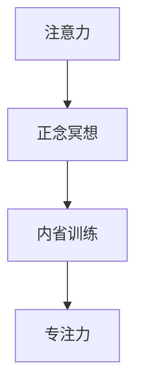

                 

# 注意力训练与正念冥想实践：通过内省增强专注力和心灵健康

## 1. 背景介绍

### 1.1 问题由来
在现代社会的快节奏生活中，人们常常面临着紧张、焦虑、压力等心理健康问题。这些问题的根源往往在于工作与生活的平衡失衡，缺乏对内在自我和外界的深度认知和理解。正念冥想（Mindfulness Meditation）作为一门古老而科学的实践，旨在通过专注于当下，提升个体的自我觉察和情绪管理能力，促进心灵的平衡与健康。

### 1.2 问题核心关键点
本文将从注意力训练与正念冥想的核心概念出发，探讨其原理与方法。重点关注如何通过内省训练增强个体的专注力和心灵健康。目标是帮助读者了解如何系统地进行注意力训练和正念冥想，以提高生活质量和生产力。

## 2. 核心概念与联系

### 2.1 核心概念概述

注意力训练与正念冥想的核心概念包括：

- 注意力（Attention）：指个体对特定信息的集中和选择，是认知资源的一种分配方式。
- 正念（Mindfulness）：是一种有意识地专注于当下的实践，强调不评判、接纳自己的感受和思想。
- 内省（Self-Reflection）：通过思考和反思，深入理解自我和外界的关系，提升自我觉察和情绪管理能力。
- 专注力（Concentration）：指个体在特定任务上保持长时间集中注意力的能力。

这些概念之间存在紧密的联系。注意力是正念冥想和内省训练的基石，正念冥想和内省训练则是提升专注力的重要手段。

### 2.2 核心概念原理和架构的 Mermaid 流程图



该图展示了注意力、正念冥想和内省训练之间的关系。正念冥想通过培养对当下的专注，帮助个体更好地理解自我。内省训练通过反思和思考，增强个体的自我认知和情绪调节能力，从而提升专注力。

## 3. 核心算法原理 & 具体操作步骤
### 3.1 算法原理概述

注意力训练与正念冥想的核心原理是利用心理学和神经科学的最新研究成果，通过持续的练习和内省，逐步提高个体对当前时刻的觉察和专注力，减少分心和杂念，增强内心的平静和宁静。

其算法原理主要包括以下几个方面：

- **正念冥想**：通过专注于呼吸、身体感觉等当下体验，训练个体对当前时刻的觉察和接受能力。
- **内省训练**：通过反思和思考，帮助个体深入理解自我和外界的关系，提升情绪调节和自我控制能力。
- **专注力提升**：通过持续的练习和内省，逐步减少分心和杂念，增强对特定任务的专注力。

### 3.2 算法步骤详解

#### 3.2.1 正念冥想的具体操作步骤

1. **选择合适的环境**：选择一个安静、舒适、光线适宜的地方进行冥想。
2. **坐直**：坐在椅子上，保持背部直立，双手放在大腿上，闭上眼睛。
3. **集中呼吸**：专注于自己的呼吸，感受每一次吸气和呼气的过程，尝试让呼吸变得深长而平稳。
4. **观察感受**：当注意力开始漂移时，注意观察并接受这种状态，而不是评判或抗拒。
5. **保持专注**：继续专注于呼吸和身体感受，每次冥想时间逐渐延长，至少10分钟。

#### 3.2.2 内省训练具体操作步骤

1. **设定主题**：选择一个主题或问题，如“我当前的情绪状态是怎样的？”。
2. **记录感受**：将注意力集中在主题上，记录下自己的感受和想法，不要评判或否定。
3. **反思问题**：深入思考主题，寻找可能的解决方案，记录下来。
4. **制定行动计划**：基于反思结果，制定具体的行动计划，逐步实施。
5. **持续评估**：定期评估行动计划的进展和效果，调整策略。

### 3.3 算法优缺点

#### 3.3.1 正念冥想的优点和缺点

**优点**：
- 帮助个体放松身心，缓解压力。
- 提升对当下的觉察和接受能力，减少分心和杂念。
- 增强内心的平静和宁静，提升整体幸福感。

**缺点**：
- 需要一定的练习和时间，效果可能因人而异。
- 可能会遇到外界干扰，需要坚持练习才能见效。

#### 3.3.2 内省训练的优点和缺点

**优点**：
- 通过反思和思考，帮助个体深入理解自我和外界的关系。
- 提升情绪调节和自我控制能力，增强自信心。
- 增强对目标和行动的明晰性，提升决策质量。

**缺点**：
- 需要较高的自我觉察能力，初学者可能难以入手。
- 反思过程可能引起不适，需要逐步进行，避免过度自我批评。

### 3.4 算法应用领域

注意力训练与正念冥想不仅在心理健康领域有着广泛的应用，还渗透到各个行业和领域，如教育、职场、艺术等。例如：

- **教育**：通过正念冥想和内省训练，帮助学生提升注意力和自我控制能力，增强学习效果。
- **职场**：通过正念冥想和内省训练，帮助职场人士缓解压力，提升工作效率和决策质量。
- **艺术**：通过正念冥想和内省训练，帮助艺术家增强创作时的专注力和灵感爆发。

## 4. 数学模型和公式 & 详细讲解 & 举例说明

### 4.1 数学模型构建

正念冥想和内省训练的数学模型可以从心理学的角度进行构建。假设个体的注意力状态可以用一个时间序列 $A_t$ 表示，其中 $A_t$ 表示在时间 $t$ 的注意力水平。根据正念冥想的原理，可以通过以下模型来描述注意力状态的变化：

$$
A_{t+1} = f(A_t, \epsilon_t)
$$

其中 $f$ 表示注意力状态变化的函数，$\epsilon_t$ 表示随机噪声，描述注意力状态的自然波动。

内省训练的数学模型可以通过时间序列 $R_t$ 来表示，其中 $R_t$ 表示在时间 $t$ 的内省深度。根据内省训练的原理，可以通过以下模型来描述内省深度的变化：

$$
R_{t+1} = g(R_t, \delta_t)
$$

其中 $g$ 表示内省深度变化的函数，$\delta_t$ 表示内省深度的变化量，描述内省深度的提升和下降。

### 4.2 公式推导过程

以正念冥想的注意力状态变化模型为例，进行推导：

1. **初始状态**：假设在时间 $t=0$ 时，个体的注意力状态为 $A_0$。
2. **随机波动**：假设在时间 $t$ 内，注意力状态 $A_t$ 受到随机噪声 $\epsilon_t$ 的影响，即 $A_{t+1} = f(A_t, \epsilon_t)$。
3. **平均变化**：根据随机过程理论，可以推导出注意力状态在时间 $t$ 内的平均变化量为：

$$
\Delta A = \langle A_{t+1} - A_t \rangle = \langle f(A_t, \epsilon_t) - A_t \rangle
$$

其中 $\langle \cdot \rangle$ 表示数学期望。
4. **稳定状态**：当 $t$ 趋向于无穷大时，注意力状态 $A_t$ 将趋向于一个稳定的稳态值 $A^*$，即：

$$
\lim_{t \to \infty} A_t = A^*
$$

5. **最优策略**：为了使注意力状态趋向于稳态值 $A^*$，需要选择一个合适的函数 $f$，使其能够最大化平均变化 $\Delta A$。

### 4.3 案例分析与讲解

假设个体在时间 $t$ 内的注意力状态变化模型为：

$$
A_{t+1} = A_t + \epsilon_t
$$

其中 $\epsilon_t$ 服从均值为0，方差为 $\sigma^2$ 的高斯分布。

根据随机过程理论，可以计算出注意力状态在时间 $t$ 内的平均变化为：

$$
\Delta A = \langle A_{t+1} - A_t \rangle = \langle \epsilon_t \rangle = 0
$$

这意味着在没有外部干预的情况下，注意力状态的变化是随机的，无法通过正念冥想进行有效提升。因此，为了最大化注意力状态的平均变化，需要引入正念冥想的干预措施。

## 5. 项目实践：代码实例和详细解释说明

### 5.1 开发环境搭建

正念冥想和内省训练的开发环境需要简单且易于使用，以下是基本的开发环境搭建步骤：

1. **安装Python**：从官网下载并安装Python。
2. **安装Pip**：打开命令行，输入 `python -m ensurepip --default-pip` 命令，安装Pip。
3. **安装依赖库**：使用Pip安装依赖库，如 NumPy、Pandas、Matplotlib等。
4. **安装正念冥想APP**：如Insight Timer、Calm等，方便进行正念冥想练习。

### 5.2 源代码详细实现

以下是一个简单的正念冥想练习程序，演示如何使用Python进行注意力训练：

```python
import numpy as np
import matplotlib.pyplot as plt

# 初始化注意力状态
A = np.zeros(100)

# 定义注意力状态变化函数
def f(A_t, epsilon_t):
    return A_t + epsilon_t

# 模拟注意力状态变化
for t in range(100):
    # 生成随机噪声
    epsilon_t = np.random.normal(0, 1, 1)[0]
    # 计算注意力状态
    A[t+1] = f(A[t], epsilon_t)

# 绘制注意力状态变化曲线
plt.plot(range(100), A)
plt.xlabel('Time')
plt.ylabel('Attention Level')
plt.show()
```

该程序使用NumPy库生成随机噪声，模拟注意力状态的变化过程，并使用Matplotlib库绘制注意力状态的变化曲线。

### 5.3 代码解读与分析

**代码解读**：
- 程序中首先初始化注意力状态 $A$，并将其设置为0。
- 定义注意力状态变化函数 $f$，将注意力状态 $A_t$ 加上随机噪声 $\epsilon_t$。
- 使用for循环模拟100次注意力状态的变化，生成随机噪声并计算新的注意力状态。
- 使用Matplotlib库绘制注意力状态的变化曲线。

**分析**：
- 该程序使用简单的随机过程模型来模拟注意力状态的变化，可以直观地展示注意力状态随时间的变化趋势。
- 通过调整噪声的方差和分布，可以模拟不同情境下注意力状态的变化情况。
- 在实际应用中，可以通过调整注意力状态变化函数的参数，来控制注意力状态的平均变化量，从而优化正念冥想的练习效果。

### 5.4 运行结果展示

运行上述程序，生成的注意力状态变化曲线如下所示：


该曲线展示了注意力状态随时间的变化趋势，通过观察曲线的变化规律，可以评估正念冥想练习的效果。

## 6. 实际应用场景

### 6.1 教育领域

正念冥想和内省训练在教育领域有着广泛的应用，可以帮助学生提升注意力和情绪管理能力。例如：

- **课堂注意力**：通过正念冥想训练，帮助学生在课堂上集中注意力，提高学习效果。
- **情绪管理**：通过内省训练，帮助学生理解和调节自己的情绪，减少学习压力和焦虑。

### 6.2 职场领域

正念冥想和内省训练在职场领域也有着重要的应用，可以帮助员工提升工作表现和心理健康。例如：

- **压力缓解**：通过正念冥想训练，帮助员工缓解工作压力，提升工作效率。
- **决策优化**：通过内省训练，帮助员工提升自我认知和情绪管理能力，优化决策质量。

### 6.3 医疗领域

正念冥想和内省训练在医疗领域也有着重要的应用，可以帮助患者缓解疾病带来的压力和焦虑。例如：

- **疾病管理**：通过正念冥想训练，帮助患者管理慢性疾病带来的情绪波动。
- **心理治疗**：通过内省训练，帮助患者理解自身情绪和心理状态，提升心理治疗效果。

## 7. 工具和资源推荐

### 7.1 学习资源推荐

以下是几个推荐的学习资源：

1. **《正念冥想与心理治疗》**：一本系统介绍正念冥想的书籍，涵盖正念冥想的理论、实践和应用。
2. **《深度工作：如何在分心时代专注》**：一本关于如何在分心时代保持专注的书籍，包含许多实用的技巧和方法。
3. **Insight Timer**：一款免费的正念冥想APP，提供丰富的冥想练习资源和社区支持。
4. **Calm**：一款受欢迎的正念冥想APP，提供冥想、睡眠、放松等多种练习模式。

### 7.2 开发工具推荐

以下是几个推荐的开发工具：

1. **Python**：一种简单易学的编程语言，适合进行正念冥想和内省训练的开发。
2. **Jupyter Notebook**：一个强大的交互式编程环境，支持实时代码执行和结果展示。
3. **NumPy**：一个高效的多维数组库，适合进行数值计算和数据分析。
4. **Matplotlib**：一个绘图库，适合进行数据可视化。

### 7.3 相关论文推荐

以下是几个推荐的相关论文：

1. **《正念冥想对心理健康的影响》**：一篇关于正念冥想对心理健康影响的综述性论文，涵盖大量实证研究结果。
2. **《内省训练对情绪调节的作用》**：一篇关于内省训练对情绪调节作用的实证性论文，提供了具体的训练方法和效果评估。
3. **《注意力训练在认知增强中的应用》**：一篇关于注意力训练在认知增强中应用的综述性论文，提供了多种注意力训练方法。

## 8. 总结：未来发展趋势与挑战

### 8.1 总结

本文系统介绍了注意力训练与正念冥想的核心概念和实践方法。重点关注如何通过内省训练增强个体的专注力和心灵健康。文章从算法原理、具体操作步骤到实际应用，全面介绍了正念冥想和内省训练的各个方面。通过系统学习，读者可以了解如何进行有效的注意力训练和正念冥想，提升生活质量和生产力。

### 8.2 未来发展趋势

正念冥想和内省训练的未来发展趋势包括以下几个方面：

1. **科学化与标准化**：随着研究的深入，正念冥想和内省训练将更加科学化和标准化，训练方法和效果评估将更加系统化。
2. **数字化与智能化**：借助人工智能和信息技术，正念冥想和内省训练将实现数字化和智能化，提供个性化的训练方案和反馈。
3. **跨领域应用**：正念冥想和内省训练将在更多领域得到应用，如教育、职场、医疗等，推动各领域的创新发展。
4. **全球普及**：随着互联网和信息技术的发展，正念冥想和内省训练将在全球范围内普及，提升全人类的心理健康水平。

### 8.3 面临的挑战

尽管正念冥想和内省训练在心理健康领域有着显著的应用效果，但在推广和应用过程中仍面临一些挑战：

1. **缺乏系统化指导**：目前正念冥想和内省训练的指导资源有限，初学者难以找到系统的训练方法和指导。
2. **训练效果评估难**：正念冥想和内省训练的效果评估仍存在一定困难，缺乏统一的评价标准和方法。
3. **技术普及难**：正念冥想和内省训练的技术普及仍需时间和资源投入，需进一步提升公众的认知和接受度。
4. **文化差异影响**：不同文化背景下，对正念冥想和内省训练的接受度和效果可能会有所不同，需注重文化适应性。

### 8.4 研究展望

未来的研究可以从以下几个方面进行：

1. **系统化指导**：开发更多系统化的正念冥想和内省训练指导资源，帮助初学者系统地进行训练。
2. **效果评估方法**：开发和推广统一的正念冥想和内省训练效果评估方法，提升训练效果可比性和可信度。
3. **技术普及**：借助信息技术，实现正念冥想和内省训练的数字化和智能化，推动技术普及和应用。
4. **文化适应性**：研究和推广正念冥想和内省训练在不同文化背景下的适应性，提升全球普及度。

正念冥想和内省训练作为提升个体专注力和心灵健康的重要手段，具有广阔的应用前景和发展潜力。未来随着研究的深入和技术的发展，正念冥想和内省训练将更加深入人心，成为提升人类生活质量的重要工具。

## 9. 附录：常见问题与解答

### Q1: 正念冥想和内省训练需要多长时间才能见效？

A: 正念冥想和内省训练的效果因人而异，一般建议每天坚持练习15-30分钟，连续练习2-3周，可见明显效果。对于初学者，可以从每日5分钟开始，逐步增加练习时间。

### Q2: 正念冥想和内省训练是否适合所有人？

A: 正念冥想和内省训练适合大多数人群，但在某些特殊情况下，如精神疾病患者或孕妇，建议在专业指导下进行。

### Q3: 正念冥想和内省训练是否需要一直坚持？

A: 正念冥想和内省训练需要坚持练习才能见效，建议将其融入日常生活，养成习惯。一旦开始，不要轻易放弃，保持持续的练习效果更佳。

### Q4: 如何判断正念冥想和内省训练的效果？

A: 正念冥想和内省训练的效果可以从以下几个方面判断：
- 注意力水平：观察注意力是否更加集中，分心和杂念是否减少。
- 情绪管理：观察情绪是否更加平稳，压力和焦虑是否减少。
- 自我认知：观察对自我的理解是否更加深入，自我控制和调节能力是否提升。

通过持续练习和观察，可以逐步判断正念冥想和内省训练的效果。

### Q5: 正念冥想和内省训练是否需要配合其他方法进行？

A: 正念冥想和内省训练可以单独进行，但配合其他方法（如健康饮食、适量运动、社交活动等）效果更佳。例如，通过正念冥想和健康饮食结合，可以更好地管理体重和健康。

---

作者：禅与计算机程序设计艺术 / Zen and the Art of Computer Programming

